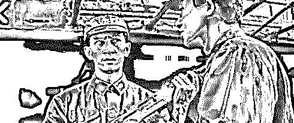

# 透过视觉中国，看黑社会产业升级四十年

> 原文：[`mp.weixin.qq.com/s?__biz=MzIyMDYwMTk0Mw==&mid=2247495188&idx=1&sn=a5c1318c1cffd28ed776f2646cfd96ef&chksm=97cb252ca0bcac3a51e98a04b502bd82206f8fba727be7052be585412a7e85ea9ca46e48c690&scene=27#wechat_redirect`](http://mp.weixin.qq.com/s?__biz=MzIyMDYwMTk0Mw==&mid=2247495188&idx=1&sn=a5c1318c1cffd28ed776f2646cfd96ef&chksm=97cb252ca0bcac3a51e98a04b502bd82206f8fba727be7052be585412a7e85ea9ca46e48c690&scene=27#wechat_redirect)

**点击上方蓝色字体免费订阅“灰产圈”**

导读

黑产从黑社会把控下的收保护费，敲诈勒索，放高利贷，卖淫色情仙人跳，偷窃抢劫等行为，随着社会法制完善和经济结构变化下，开始了灰白隐蔽的演变过程。

从过去 40 年的经验看，每 10 年为一个阶段，黑社会组织和黑社会产业，都会从局部开始一次产业形式的质变。

视觉中国与全景网络利用知识产权进行敲诈说明了，现在，黑势力正在开始新的产业升级。

1

黑社会的产业升级

当我们还在震惊于《无间道》里黑白无间，警匪互相卧底斗争的云波诡异时，早在 80 年代初的山西，燕子帮的帮主冯小春，为了谋求帮派的长远发展，一家开始有意让成员报考警校，当时共有 15 名燕子帮成员考取了警校，其中大多数毕业后回到了冯小春的老家实习工作....

当我们还在为《古惑仔》中陈浩南的热血江湖倾倒时，80 年代末的东北，泥瓦工乔四从过旧城改造拆迁中看到了机会，他开始纠集流氓，通过帮助开发商拆迁扶摇直上，形成了以拆迁，地产，娱乐，酒店等为核心的黑社会集团，不但是开发商集团代言人，而且还成为了高官座上宾，甚至拆迁企业家乔四还被任命为龙华建筑公司的副总经理，其成就远非蒋天养这帮洪门矮骡子所能相比。

当我们还在为《杀手的童话》里周润发潇洒矫健的身手所折服时，相聚港岛不远的海南岛上，日后被号称为海南第一杀手的孔繁登正在声名鹊起，此人从未成年就开始犯罪，天性凶残暴戾、嗜杀成性，还颇有头脑、办事胆大心细。在江湖黑道上，孔繁座被称为“冷血杀手”。

他在 1988 年公然持刀抢劫银行十万元之后，利用这些钱购买了 AK47 冲锋枪，大威力滑膛枪 20 多把，装备比整个海南警方的还好。并开始了血腥的犯罪之路，武装抢劫金店商行，绑架外国佬勒索美元，更为钱杀人，在 1992 年受雇某老板，与其商业竞争对手在歌舞厅枪战，打死 20 多人，9 名无辜群众死亡，伤者不计其数，歌舞厅里血流成河。

此人是天生的悍匪。杀手童话里的小马哥遇到这种全城通缉的局面也要选择跑路，可孔繁座不，他去整容医院做了整形之后，继续游荡在海南连续顶风做了多起大案要案，在逃窜四年后才被抓捕。与之相比，香港黑帮电影里无论英雄还是杀手的气魄，都要相形见绌。

当古惑仔里的 13 妹在波兰姐经营着她江河日下的皮肉生意时，东莞色情大亨太子辉正在冉冉升起，在之后的十几年间，他为东莞 96 家五星级酒店，以及上百家桑拿提供色情资源，甚至连市长见了他都要恭敬的叫一声辉哥。

当澳门赌王在他的一亩三分地里回望自己辉煌一生时，从国内出走的黑恶势力，已经在柬埔寨缅甸等地方已经建立起了更庞大的赌场，但这些以赌博为生的黑社会们并不止满足于延续传统的赌场生意，他们更是拥抱互联网，在马来西亚等地成立了盈利更高的网络赌博集团.....

当香港的小混混还在以街头收保护费敲诈勒索为生时，国内的后辈们已经踏足了印尼泰国，在这里建立起了庞大的电信诈骗帝国，与湾湾岛上的势力并列双雄，是国际上最大的电信诈骗犯罪集团，年营收可以达到数百亿之巨。

当香港的偷车贼还在为偷到一辆车窃喜时，国内的车匪路霸已经披上了客运公司的外衣，垄断客运运营，对竞争对手打砸，垄断市场，积累了数十亿的身家.......

从江湖郎中到莆田系黑医院，从街头讹诈到视觉中国利用版权漏洞进行的专利捉贼，从地下六合彩到盛行各大互联网公司的一元购，从贩卖人口到贩卖个人信息的数据黑产，从高利贷到 P2P 断头网贷，从卖淫嫖娼到网络色情.....

黑色产业正在进行着一场产业升级，他们拥抱互联网，拥抱高科技，变得更隐秘，更灰色不可知，但它始终就在我们身边，吞噬着不小心掉入陷阱的人们......

黑社会产业特征演变

1．毒品的生产、运输、贩卖——升级为化学毒品，新型轻微上瘾性毒品；

2．操纵地下赌场——境外赌场——网络赌博；

3．勒索敲诈及骚扰恐吓——电信诈骗——版权勒索；

4．打劫——产品诈骗——网络盗窃；

5．操纵娼妓淫窟、黄色书刊——成人网站——软色情主播；

6．放高利贷及暴力讨债——网贷；

7．绑架拐卖——售卖个人数据信息；

8．车匪路霸——黑车司机——民营客运公司；

9．控制夜店——控制直播博主——成立软色情平台；

10．其他小型街头帮派、骚乱闹事伤人；

11，江湖郎中——医疗产品保健——莆田系医院

纵观这一切触目惊心的现实，我们在此不得不将目光投向黑色产业升级的罪恶历史，从中找到答案，

这个世界会好吗？

2

从土匪到黑社会

民国初年十里洋场夜空，电力革命所带来的霓虹灯闪闪烁烁，而在霓虹灯下青帮黑社会明火执仗杀人放火的火把同样明明灭灭。三民主义改变中国的呼声在期望中燃烧了整个国土，然而，当时横行神州的土匪们同时在把广大土地上生活的农民拖进了原始的黑暗.....

地主李是个小地主，传到他这一辈正值民国军阀混战最混乱的时候。其他地主都开始投资办厂时，地主李却打心里看不上这种雇佣工人还要给钱的行为，他依旧沉浸在他的土地生意里。

但让人诧异的是，大家都觉得地主李没什么见识应该被时代淘汰了，他却用了短短数年时间，就从一个小地主成为了横跨数县的大地主，成为了一方首富。

为什么地主李能快速的发家呢？原因很简单，贿赂上官，勾结土匪，涉足黑产。

从清末起，由于国家秩序的动荡，因此当时的国内土匪横行，分布范围之广，延续时间达 100 多年之长，历史从未有过这样混乱的情况。

是什么造成了土匪能生存如此之久？答案很简单，就是**供需关系所造成的**。

一方面混乱的社会秩序和残破的经济发展，为社会上提供了大量活不下去的失地农民，闲散人群，这些人失去了生产能力，只好做土匪为生。

但更重要的是，社会上的供需关系需要土匪的存在，当时存在的传统封建旧势力需要土匪的存在。比如地主就需要土匪帮他们镇压不听话的村民，因此造成了数量庞大的乡村土匪势力。

地主李在发展壮大的过程中，利用土匪对内镇压要求涨薪的农民，对外则利用土匪攻击其他势力，实行兼并。更利用土匪的武力，涉足黄赌毒客栈物流等暴力行业，用这些财富再去贿赂官员提供保护伞，所以才能在数年之内迅速成为一方首富。

到了建国之后，**由于物资匮乏扼制了以攫取非法利益为目的的犯罪，并且由于普遍贫困基础的平均主义，让人们之间的财富差距不明显，导致在改革开放之前，黑社会从神州大地消失的干干净净。**

但黑社会暴虐，谋取非法利益的传承并未断绝，而是铭刻在暴虐的背后。

当文革中武斗势力斗天斗地，斗的不亦乐乎时，这些红卫小兵不会想到，日后他们这些红色捍卫者中间，竟然是国内最早黑恶势力大佬密集诞生人群。

杨成效是太原十三冶建筑公司工人，在文革中号称山西造反总指挥，山西革命工人造反决死纵队头目。多次领导山西大规模武斗，曾经的省委第一书记卫恒就是被其揪斗而死。

闹的这么厉害，这样的人当然没有什么好下场，但在他被枪毙后，杨成效的大名却流传的更广，山西崛起的多路黑社会混混，多尊崇杨成效为黑道祖师爷。

比如 1991 年震惊运城的狼帮大案，锅炉工张永强组织了多大 23 人的犯罪团伙，拥有枪支 100 多支，子弹千余发，手榴弹二十枚。以卖淫，敲诈，高利贷，赌博和收过路费，抢劫为生。张永强在教导手下时就声称：“杨成效是咱的祖师爷，干咱们这一行的向来是，人有多大胆，就有多少产。”

但这时的黑社会依然延续了建国前土匪黑帮的特征，以黄赌毒，高利贷，利用暴力敲诈勒索，收取保护费为生，　1982 年，虽然深圳市颁布了《关于取缔黑社会活动的通告》，首次在正式文件中承认“黑社会”的存在，不过在内部，他们只是将这一阶段的黑社会成为违法犯罪集团。

1990 年，政法委指出，“犯罪团伙急剧增多，并且愈益向黑社会组织演化”，“较之 1983 年严打前的流氓团伙，危害性明显升级”。

在警方内部，由违法犯罪团伙向黑社会转变的关键点，就在于这一年查处了以东北乔四为首的三大黑社会集团。

警方认为：“‘乔四’集团是一个典型。”过去查犯罪团伙，没有人想到保护伞。**乔四集团的出现表明了，以暴力为主的流氓集团想进一步壮大，就必须有更多的经济实力；谋求更多经济利益，就必须有后台和保护伞。”**

也就是说，乔四开始由小混混向民国时期的土匪帮派势力转变，利用经济转型时期市场对于拆迁难题的需求，成立拆迁公司用黑恶手段赶人，为地产开发集团代言积累了第一桶金。然后像他的土匪前辈那样，和地主利益集团勾连，把手开始伸向各行各业，诸如夜总会黄赌毒等娱乐领域，以及建筑地产，实业公司等行业。

对上用黑钱贿赂建立保护伞，对下帮助利益集团欺压农民，中间则利用得到的利益发展其他产业，最终建立了一个横跨黑白两道的庞大黑产集团，强大到了只手遮天的地步。

可以说，从乔四集团震惊海内外开始，80 年代的混混地痞开始由犯罪集团进驻商业领域，勾连上下在当地形成半公开的黑社会集团，从此之后的黑社会，带头大哥再也不让小弟叫自己老大，而是更名换姓，他们开始西装领带，更喜欢手下叫他们经理。

除了东北以地产起家的乔四集团之外，在某些资源领域形成了护矿队为形式的黑社会集团，依赖于公开的煤矿资源集团，在南方则形成了温柔高庄这样的高利贷典型金融集团，在福建则由于商人带动人口流动到全国做生意，有一部分人就成了流传作案的诈骗集团，声称可以弄到走私轿车等稀缺资源为由诈骗，最后更是在新千年衍生出庞大的电信诈骗团伙。

而在云南等地，则由于地利因素，形成了贩毒为首的黑产集团。广东和海南则是以走私为主的黑产集团猖獗一时。

90 年代的黑产集团，依托当地有利条件，根据环境和社会需求空子，最后形成有组织的黑产庞大商业集团，正是这些商业黑社会势力成型的过程。

在这些黑产集团形成之后，有着迫切的洗白需求，但又无法抛弃暴利产业，就成了半黑半白半公开的黑恶势力，做大之后在商业领域与竞争对手角逐，但依然摆脱不了黑社会的犯罪本质。

比如袁氏三兄弟曾经在东北鼎鼎有名，老大袁 X 景更是被人称为“京城李嘉诚”，但在金钱的膨胀下，他们忘记了法律两个字，这三个胆大包天的家伙竟然敢雇佣杀手，将自己竞争对手活活杀死，之后又雇凶将杀手灭口。

原本他们认为，只要凭借大撒金钱、拉拢关系，肯定能将这件事消弭于无形，但谁不想被他们杀死的竞争对手也是有着深厚的背景，最终这件事一直捅到了天上，在有关领导亲自过问下，这三个无法无天的人最终都被判处了死刑。

这还不是最精彩的，在狱中的三兄弟为了活命，让自己的家人把财产全部捐出去，其中就有一项是关于印尼石油公司的股份，据说这一项当时的市值就达到了 500 亿人民币之多。不过最终即便是几人捐出财产，但仍然被执行了死刑。

原本事情到了这里，也该告一段落了。但几年后，那位亲自过问袁氏三兄弟案件的领导也因为贪腐落马，整件事的内幕才大白于天下，自然是轰动一时。原本那位领导拿了三人的救命钱，最终却没有救他们的命。

3

技术进步让黑产集团难以界定

进入 2000 年以后，犯罪方式已经发生了明显的改变。

2014 年 4 月，就读于西安电子科技大学计算机专业的大二学生魏则西被检查出患有晚期滑膜肉瘤，是一种恶性软组织肿瘤，五年生存率为 20%-50%。

四处求医的魏则西以及其父母通过百度搜索中找到了头条的莆田系医院。医生称“斯坦福技术”、“保 20 年”。魏则西在此接受 4 次“生物免疫疗法”治疗，花费 20 余万元。但在被视为“救命稻草”的疗法治疗下，竟然最后撒手人寰。

原来医院所谓的先进治疗技术也被网友发现是国外临床弃用淘汰的，很难说对病情有什么用。

魏则西走了，但由他去世拔出的莆田系医院黑幕，让所有人胆战心惊，没有人希望自己进入莆田系医院，成为下一个魏则西。

陈、詹、林、黄四大家族所控制的莆田系医疗势力，已经遍布全国。2019 年 3 月 12 日，医疗大号春雨医生在微博上发布《全国莆田系医院一览》，并向网友征集“漏网之鱼”。在这份莆田系医院名单中可以看到，莆田系医院主要分布在我国 30 多个省、自治区、直辖市，令人诟病的莆田系，数量之多，令人震惊。

据春雨医生的统计数据显示，目前，全国莆田系医院分布最多的省份分别是江苏（78 家）、广东（74 家）、山东（65 家）、四川（57 家）、云南（51 家）、湖北（50 家）、上海（49 家）、安徽（46 家）。分布最少的几个省份分别是海南（1 家）、宁夏（1 家）、西藏（2 家）、甘肃（2 家）、青海（3 家）。

但揭露出来的信息，仅仅是冰山一角。自改革开放后，由于医疗系统的改革，人们对看病需求有了巨大市场需要。曾经的江湖郎中赤脚医生纷纷摇身一变，成为了各种神医，他们有的承包下了乡村医院，有的甚至能承包下大医院的一些科室。

随着经济的发展，他们开始慢慢形成了自己的医疗黑势力，滚雪球一般壮大，在医院内已经公开透明的医疗代表向医生推荐他们高昂却疗效不大的器械和药物，在医院外，他们利用市场需求，成立了一家又一家民营诊所黑医院。

尤其是这两年在医疗行业火爆的整容医院，我有个医生朋友是这样形容的，一个护士培训三个月出来就能做整容医院的主刀医师，一年收入几百万。如此简单又暴利的方法，不可谓不让人触目惊心。

但你很难说它犯法了，黑产由于技术的进步，在刑事判断中越来越难以界定，变成了灰色。

与此相同的是网贷，就在 2019 年 2 月 26 号，西安一个 21 岁女生从 17 楼跳下。家属在整理她遗物时，发现了一张手写的账单，原来造成这个女生死亡的原因，是三年前在网贷平台借了几千块钱，三年来已经还了八万，却还有十七万欠债。

在几年前就已经频繁爆发出裸贷门，网贷自杀事件，但始终难以清理，就是因为这些贷款方在注册公司时以金融理财形式，在贷款时通过精算师的计算，使得高利贷事实处于复杂的计算模式中，警方难以界定。

黑产集团正在通过拥抱技术进步，让犯罪事实越来越模糊。据说现在网贷系的幕后老板们，就是 90 年代雄踞一方的温州高庄高利贷势力。

不仅仅是他们，甚至连色情行业也开始变得难以界定。传统的线下色情业由于高昂的门店成本和安全隐患，在新千年之后的网络浪潮兴起之后，有实力的老鸨们也拥抱技术革新，进行了产业的不断升级。

2017 年国内发生了一起震动全国的“教材涉黄案”。

而根据案件的审理，最后发现这个色情网站其实就是个假色情网站，主创人是一所 985 大学毕业的学生，他们觉得做色情网站违法，因此做假色情网站，图片上写苍老师，但视频里就只是个姓苍的老师。

若有人想看网上视频，必须支付 9.9 元至 72 元不等费用，等色欲熏心的网友们交完钱，才发现这根本就是个骗局。就这样，他们的日流水高达 300 万，涉案资金达到 6 亿，诈骗数百万人。

但让人犯难的是，明明是一起色情网站事件，却无法通过传播淫秽罪判处，只能以诈骗罪起诉，不得不说是一个幽默的冷笑话。

在这起教材涉黄案之外，传统的老鸨们借着主播兴起的风潮，成立了主播公司，控制手下的小姐成了主播，进行软色情表演，他们发现这比传统的色情业更暴利，却可以逃避法律风险。

而曾盛行于全国的福建诈骗团伙，一部分人已经把目光从国内转向了国外。他们通过在海外设立根据地，在国内收买个人信息数据，开始了电信网络诈骗的新手段。

其中的另一部分，则苦学技术或者招募技术人才，把敲诈方式搬到了网上，彻底换了另一个样子。在这其中，他们就盯上了互联网创业者，因为大部分初创公司没有相对成熟的防御体系，电商和在线游戏行业成为了重灾区。

在敲诈过程中，他们首先会先对企业的网站进行攻击，致使网页不能被用户访问，然后联系公司的员工勒索钱财，金额一般不会太大，在 2000-8000 元左右。一般的企业因为业务受到影响，加上坏人索要的金额也并不巨大，大多都会支付赎金。然而，得了好处的骗子并不会就这样信守承诺，勒索也将变成无底洞。

据安全平台部黑产情报团队分析调查，目前在这条黑色产业链中，相关黑产从业人员或已达到 38 万余人，涉及 6000 多个大大小小的黑产团伙，其中，专职于 DDoS 黑产的人员就高达 13 万，如果以人均月收入 4000 元计算，年产值将超过 100 亿。

曾经网上流行说支付宝的出现，让小偷全部失业了。但实际情况却是，经济结构在升级，小偷也没停止进步，他们拥抱新技术，开始了自己的黑产改革，把传统的黑产用互联网做成了分工明确，规模庞大的新黑产模式。

而且由于法律对新出现犯罪方式的难以界定，他们的风险相比之前大幅度下降，迎来了最美好的黄金时代。

4

更高级的犯罪，是利用法律漏洞

就在今天，我想各位的朋友圈都被视觉中国版权敲诈刷了屏。

有网友爆料称，视觉中国将大量图片散布到各种免费的图库网及公共网络上“钓鱼”，公司定期检索这些图片，如果被使用就起诉维权。而在诉讼中，表面上只针对很少几张图片主张权利，但往往要求被告花巨资购买“一揽子许可”的会员服务。

根据视觉中国 2017 年年报，2017 年视觉中国实现营收 8.15 亿元，同比增长 10.75%。其中，互联网传媒行业实现营收 6.54 亿元，占总营收 80.33%。而在营业成本构成方面，版权服务费支出同样占到该行业分类的七成以上。

也就是说，视觉中国通过利用版权保护的漏洞打官司，成为了它主要的盈利方式，而且年收入几个亿，还一点都不违法。

天底下有违法犯罪无风险，还能挣大钱的好事吗？

在视觉中国没出现以前，我以为是没有的，但它通过钓鱼敲诈曝光之后，我才发现更高明的犯罪，是利用法律的漏洞进行犯罪，无风险还暴利，超乎想像。

网上有网友还举例，2018 年春节时一家零售企业的 APP 突然被苹果公司下架，原因是其被一家网络图片库投诉有 4 张图片侵权，“这 4 张图片不足 APP 上图片总数的万分之一，而对方提出的版权合作费是 800 万”。

不过苹果的例子不太好说，这个时代尊重知识产权是所必要的行为，就拿我来说，我也不希望自己辛苦创作的文章被其他人抄去用作商业，这对我太不公平。

但视觉中国引起众怒，就在于很多图片他没有版权，却通过打图标的方式声称是自己家的，很多小媒体不知道，就莫名其妙的被起诉，然后在惶恐下私了，视觉中国勒索成功。

要知道视觉中国有专门的法务团队，这个团队对于图片侵权案已经身经百战，每发现盗图行为，公证，警告，要么和解，要么法庭上见。而视觉中国图片通过各类渠道散步在网上，其中免费的和有版权的搀和在一起，“踩雷”变得很容易，这也让视觉中国的“维权”颇有“钓鱼勒索”倾向。

所以，新时代的犯罪越来越难以界定。甚至在可以预见的未来，像视觉中国，全景网络这样利用法律空隙进行赚钱的公司，可能会越来越多。

毕竟，法律不会保护坏人，但也不庇护好人，它只保护懂它的人。君不见，现在的黑社会集团招收小弟，最初都开始进行法律培训吗？

西方医药集团在借助慈善之名，在东南亚和非洲秘密进行着人体实验。在英国还发生房东一年里杀死 17 人，专门卖尸体的骇人事件....

人心都被利益蒙蔽了，道高一尺魔高一丈，犯罪份子越来越聪明了。很多人都在问，这个世界会越来越好吗？

我只知道，当燃烧的火苗照亮原始人黑暗的洞穴，也清晰的照亮了一道人与野兽的分界线。当人类学会制作陶罐烧煮食物，告别了茹毛饮血的血腥时，也告别了动物的匍匐，摒弃了兽性的野蛮。

当人类发明文字，从事物发展中思考出道德对社会延续的重要时，文明终于开始了它的成长，人类头顶星空闪烁，人脱离动物的序列，成了世界的主人。

康德曾说，世界上有两件东西能够深深地震撼人们的心灵，一件是我们心中崇高的道德准则，另一件是我们头顶上灿烂的星空。

无论改革开放后的文革小兵成长为黑社会头目，还是后来他们转型商业时期的黑白大佬，或者是拥抱技术改革，升级黑产产业的新时代犯罪份子。

我们必须始终清晰认识到，当人类从愚昧中挣扎，举起文明的火把时，那些萦绕在人类身上的暴虐兽性却如影子一般，跟随着人类文明前进的脚步，我们把文明而公正的美好社会称之为白道，把兽性所演变出来的违反犯罪称为黑道。

它从来不会消失，只是变换着不同的形式。

我们必须发现这些新的犯罪方式，及时更新法律，对他们严格制裁，让法律有效，让作恶者受到惩罚。否则任由黑社会所代表的兽性蔓延下去，会有越来越多的美好被吞噬。

**我们必须更新法律，给那些因为网贷家破人亡的人们，因为电信诈骗一无所有的老人，给那些购买医疗器械被骗光积蓄的人们，一个正义的保护。**

**逢恶必举是公民的责任，而有恶必除，则是公民期待法律所能给与的正义回答。**

●[视觉中国：第一个被黑洞吸走的网站！](http://mp.weixin.qq.com/s?__biz=MzIyMDYwMTk0Mw==&mid=2247495062&idx=1&sn=0ab29384498641a6e49b07540922c654&chksm=97cb26aea0bcafb8ca311ec8620f7d18a4abe9fe6f4344d5c74e897190b54a0d9eec5df2f09e&scene=21#wechat_redirect)

●[一位教授的调研：中国小县城里的黑社会灰色江湖](http://mp.weixin.qq.com/s?__biz=MzIyMDYwMTk0Mw==&mid=2247490335&idx=1&sn=d21771f8469e2065d6beed7cf60a06c0&chksm=97c8d027a0bf5931201ff9219f92308a4de09cf43016aa745aa21b92db09541376de11088f98&scene=21#wechat_redirect)

●[深度 | 电信诈骗的凶手找到了@社会工程学](http://mp.weixin.qq.com/s?__biz=MzIyMDYwMTk0Mw==&mid=2247494277&idx=3&sn=a2739c33a921da142a0b5a4a8658d434&chksm=97cb21bda0bca8ab92268fe7505be279b2c72acefe15fb71a88ee2c1e7e92f0ea652a128d526&scene=21#wechat_redirect)

●[流量造假，网络黑产被警方一锅端！](http://mp.weixin.qq.com/s?__biz=MzIyMDYwMTk0Mw==&mid=2247494981&idx=2&sn=cf620a73ba8e79dd47054bf83acd9dec&chksm=97cb267da0bcaf6b05655e97541ba513d2bad515fd6842b1487029c5732d7033931b73708dee&scene=21#wechat_redirect)

← 向右滑动与灰产圈互动交流 →

**阅读原文加入灰产圈高端社群**

# 

> 原文：[`mp.weixin.qq.com/s?__biz=MzIyMDYwMTk0Mw==&mid=2247495171&idx=1&sn=e1cab2ddc8065bfa18a834b96937b9c2&chksm=97cb253ba0bcac2d29bb5feca5d7ab8d1365e6246e407cb61a865f5a73478a4876950a3d5188&scene=27#wechat_redirect`](http://mp.weixin.qq.com/s?__biz=MzIyMDYwMTk0Mw==&mid=2247495171&idx=1&sn=e1cab2ddc8065bfa18a834b96937b9c2&chksm=97cb253ba0bcac2d29bb5feca5d7ab8d1365e6246e407cb61a865f5a73478a4876950a3d5188&scene=27#wechat_redirect)