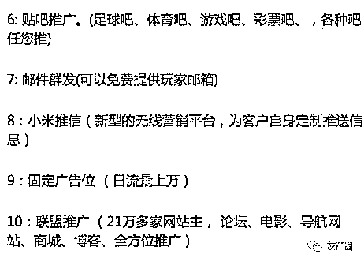
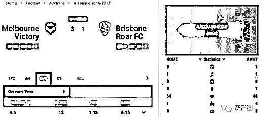
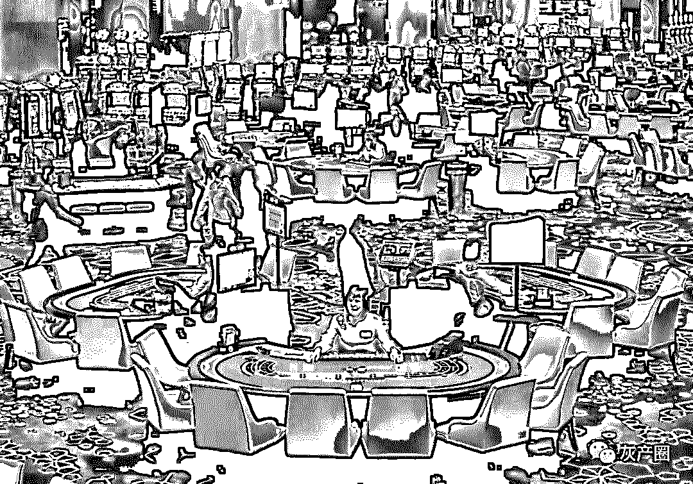

# 菲律宾博彩从业者采访实录

> 原文：[`mp.weixin.qq.com/s?__biz=MzIyMDYwMTk0Mw==&mid=2247495128&idx=1&sn=d276bd79f8eea278d41dbfe933b4c29d&chksm=97cb26e0a0bcaff6447220f8411bbc1fb49afdf6d976b64cbbb330861c1cd93612224217eddc&scene=27#wechat_redirect`](http://mp.weixin.qq.com/s?__biz=MzIyMDYwMTk0Mw==&mid=2247495128&idx=1&sn=d276bd79f8eea278d41dbfe933b4c29d&chksm=97cb26e0a0bcaff6447220f8411bbc1fb49afdf6d976b64cbbb330861c1cd93612224217eddc&scene=27#wechat_redirect)

**点击上方蓝色字体免费订阅“灰产圈”**

导语

年初的一篇访谈，写在菲律宾扫荡博彩公司之后。人在他乡，代表的是另一个故事。

> 菲律宾，全亚洲在线博彩业发展最快的国度。每天在这里都有大量的中国人忙前忙后，他们在异国他乡冒着生命危险地忙于赚钱。他们所在的公司，您早有耳闻。 
> 
> 是的，他们是在菲律宾的博彩从业者。他们有人已经定居菲律宾，有人离开菲律宾，有人被赶出菲律宾。我们知道，您会想听听他们的故事。 
> 
> 感谢@Davind 提供的情报。我们采访了几位在菲律宾的从业者。我们将通过这篇文章给大家揭开这些故事的神秘一角。

进入正题。 

1

五年前来到菲律宾的时候，KK 没有想过自己会留在菲律宾。KK 今年 38 岁了，他在五年前还是上海一家广告公司的营销总监。 

KK 说，每次他只要发朋友圈都会引来一堆朋友的羡慕嫉妒。 

不过，KK 在最近 1 年才开始使用微信的。他过去 4 年都没有发过朋友圈。此外，他从来不发自己地址信息还有工作信息。 

这是 KK 的职业习惯。

**（聊天时菲律宾的景色）**

KK 过去四年曾任职多家菲律宾数家大型在线博彩游戏公司的市场经理，他的任务是策划各种美轮美奂的活动去吸引用户投注。 

是的，KK 所在的公司就是国内大部分朋友称为外围的公司。

**（菲律宾有大量在线博彩公司）**  

KK 过去四年曾任职多家菲律宾数家大型在线博彩游戏公司的市场经理，他的任务是策划各种美轮美奂的活动去吸引用户投注。 

菲律宾是亚洲博彩行业发展最快的国家之一，他们提供了大量的在线博彩牌照，这些公司会通过购买系统的方式来进行风控，然后通过建立营销渠道的方式来进行宣传。 

不过，由于菲律宾的监控混乱，在菲律宾出现了大量违法经营的博彩公司，他们只是在菲律宾搭了平台，然后就开始营运。只是不管非法还是合法，目标都是中国客户。

**（菲律宾的彩票销售点）**  

KK 强调，他就职的公司都是有牌照的，而且地点都在 Makati。按照 KK 的说法，在这个弹丸之地就是几栋大厦可以允许做博彩，但这里面的月流水肯定超过亿万美元。KK 每天会监控销售的活动，然后通过分销机制来鼓励他们。 

2

cc 就是 KK 所说的销售人员。 

她没有和我们见面，仅仅是在菲律宾与我们进行了电话沟通。cc 很谨慎。她不同 KK，她还是希望会到国内。因为她今年才只有 20 岁。 

cc 每天的工作就是利用各种可以的传播渠道去勾引客人，有时候还会联系外包业务。

**（cc 联系的博彩外发广告代理）**

“一个女孩子，没文化，家里穷，我还能做什么呢？”

cc 是通过村里的劳务介绍出国的，她说村里好多女孩子都过来了，由于她比较活泼，所以她争取了销售岗位，但更多的女孩子会做客服。

“销售虽然要熬夜，但提成高，我还是希望多赚钱，回家盖房子的。” 

cc 说她每个月的收入折算到人民币已经过万，有时候会达到几万，比单纯做客服的收入要高很多。 

“我还是很清醒的，一个女孩子，能做什么？这我有些朋友选择了当女主播，比我的收入差远了。” 

3

和 cc 相比，当时在博彩公司做市场经理的 KK 的收入其实更低一些。但 KK 不愿意做销售。 

“那都是坑人的。” 

KK 就职过几家相对正规的博彩公司，他其实挺讨厌自己当时的做法。 

“我们会用各种活动吸引你过去，然后通过各种借口来阻扰你的提款。” 

按照 KK 的说法，大部分东南亚博彩公司都没有自身的开盘系统。他们只会做风控。这里解释一下开盘系统——就是真正的操盘手开盘，这在 10 年前还是博彩公司必备的，在英国的众多老牌博彩公司例如威廉希尔、韦德、Bet365 等都是很流行。只是这这涉及到庞大的资金，而且一个好的操盘手年薪上百万美元，更不要说围绕这个系统所搭建的计算成本。 

因此，在国外早已就有专门的公司为博彩公司提供操盘系统。他们收集比赛数据并且进行计算，然后向博彩公司提供盘口。

**（Cantor Gaming 是全美知名的开盘公司）**  

据 KK 介绍，现在大部分东南亚的博彩公司用的是一套叫沙巴的系统，盘口已经预设完毕，博彩公司只需要投入风控人员进行资金来调配就好。 

博彩公司的风控会做什么呢？包括降低奖金、将投注拆分成各个板块乃至放到必发去挂牌等等。不过，在 KK 看来，这些都不是主要方法。 

4

TT 现在是国内某技术公司的 CTO，他在两年前曾经在东南亚帮助一家博彩公司搭建了风控系统。他与 KK 都是上海人，是 KK 介绍他做系统的，不过 TT 在完成系统后就离开了。

我们也是在网上与 TT 聊的，但 TT 不愿意见面。TT 说他们参考了很多国外博彩公司的风控，其实团队都是老外带领的。风控的核心肯定是资金的运作，但系统的设定帮他们做了很多。

**（在线博彩公司早不用自己开盘了）**

“博彩公司的核心就是让用户持续赌博，时间长了，他们自然就会挂了。” 

当然，TT 也知道对小公司来说，最好的方法就是拉黑用户。他们会有一套算法来计算用户的盈利率，一旦时间过了阀值，他们就会限制用户投注，直接将用户逼走。TT 也承认玩体育的人还是聪明的，里面确实有赢钱的人，但概率很低，如果是滚球玩起来的话，基本就全输。 

“人脑的计算是有限的，他们无法与程序作斗争，而且很多平台都有手段制造延误，让你的投注作废。现在还有提前结算玩法，这个我觉得就更先进了。” 

5

cc 见过很多企图与系统作斗争的人，但基本上都输光了。“很多人都不会玩国内的彩票，他们说赔率低，所以拉客人还是很容易的。”

**（滚球是体育博彩中杀伤力最大的）**

cc 说自己见过一个 1986 年出生的年轻人，在 3 天内输掉了 100 多万，他就是玩滚球玩下去的。 

“很多人输钱是因为赢钱了，但只要赢钱了，心态就会变化，而且在国内比赛都是晚上。晚上很多用户都会思维混乱的，一旦红眼，就救不了了。” 

cc 说自己从来不会赌，她也没见过能够赢钱的。当然，她也会上网的。cc 和她一起的都是同村的女孩子。她们很多时候会浏览菲律宾的华人社区网站，但她们很少上国内的网站。谨慎还是她们的日常。

**（菲律宾有名气的华人网络社区）**

6

KK 说自己可以更新在朋友圈，算是运气好了。 

去年菲律宾曾经针对非法博彩公司进行了一次扫荡，共有 1000 多名中国人被捕，当中的一大部分被遣返回国。KK 说自己多个朋友都中招了。 

去年菲律宾总统杜特地上台后针对线上博彩法规进行了改革。当时杜特地曾经说由于博彩公司牌照的发放混乱，他会改革先上博彩公司。前提是博彩公司是合法交税的。

**（去年菲律宾抓赌，上千中国人被捕）**

“什么是合法？在菲律宾只要是博彩公司都有问题，到最后还是走灰色地带。”

同样的还有 cc。

cc 说她很多同乡现在都去了一些不知道哪里冒出的博彩公司工作，而且这两年势头很猛。不过去年的一次，影响了不少人。 

KK 现在已经改行了，他说菲律宾给了他自由，他喜欢这里。他有赌的习惯。只是他也不敢在线上网站玩得太大。 

“在我看来，有信誉的博彩公司太少了，而且你永远分不清哪些是真正的大公司。” 

这一点，cc 同样这样认为。 

她会觉得国内的足球玩法还是有竞争力的，他们是国家做背景，赔付足够，只是赔率低。 

“我有些客人后来会玩国彩的，说白了，赢和能够赔付才是硬道理。只是大部人还是自以为聪明，而且贪心，然后就输了。” 

7

其实我们的这个专题纠结了很久。我们早就对东南亚的博彩公司很有兴趣，也企图去做一个分析报告之类的来让大家了解更多。 

我们相信，这篇文章会让大家更好地了解博彩公司的本质。同时，也会让大家知道，博彩不在乎奖金，更在乎的是你的心。 

有时候，我们不是输在比赛，而是输在人性。 

最后，我们期待您的转发，期待您在文末的留言。最后我们也非常感谢爆料者@Davind 提供的所有联系人。

●[菲律宾不会下雪，马尼拉没有爱情....](http://mp.weixin.qq.com/s?__biz=MzIyMDYwMTk0Mw==&mid=2247495118&idx=1&sn=634a8708efc7fade004707e67e2977a9&chksm=97cb26f6a0bcafe0bf1d5c25249786ad0d1609d4d5a6d12733c3af9dc14217305aaea056685b&scene=21#wechat_redirect)

●[程序员的黑砖窑，东南亚博彩骗局详解](http://mp.weixin.qq.com/s?__biz=MzIyMDYwMTk0Mw==&mid=2247495118&idx=2&sn=c276b9f4d1566e68ec845aaabdf581c8&chksm=97cb26f6a0bcafe08207ffa5515dc36a976b7e85bfd75dce9713cb0c39589084283472f20513&scene=21#wechat_redirect)

●[东南亚杀猪盘，互联网式爱情屠宰场](http://mp.weixin.qq.com/s?__biz=MzIyMDYwMTk0Mw==&mid=2247495095&idx=1&sn=c250577e2763d3da85102814712038b8&chksm=97cb268fa0bcaf996409b54bc4fb0b2b3f15cec4b07c732aa442bef471de0e5ea1d6b23d556f&scene=21#wechat_redirect)

●[博彩业《不能说的秘密》：为什么久赌必输?](http://mp.weixin.qq.com/s?__biz=MzIyMDYwMTk0Mw==&mid=2247495037&idx=1&sn=5aa5a761e36ac14fc459f33d643cb152&chksm=97cb2645a0bcaf53cae193ff61cdbcf1cbd456c2dd5af8a8c3f0eb5b2cdc28249bd9a966ccff&scene=21#wechat_redirect)

← 向右滑动与灰产圈互动交流 →

**阅读原文加入灰产圈高端社群**