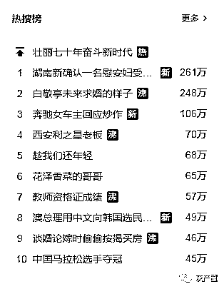
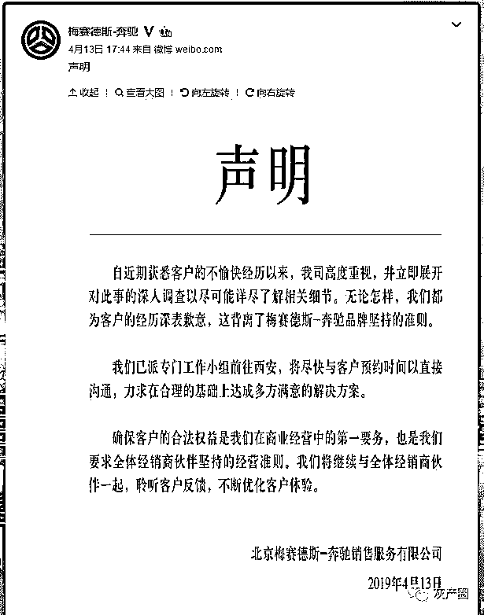
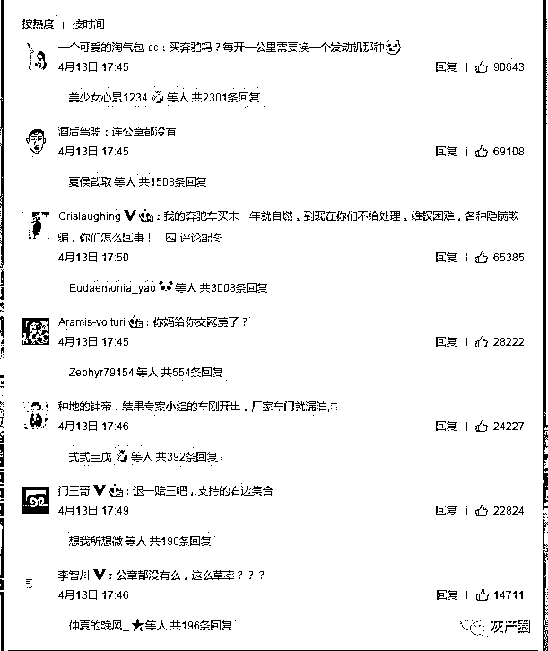
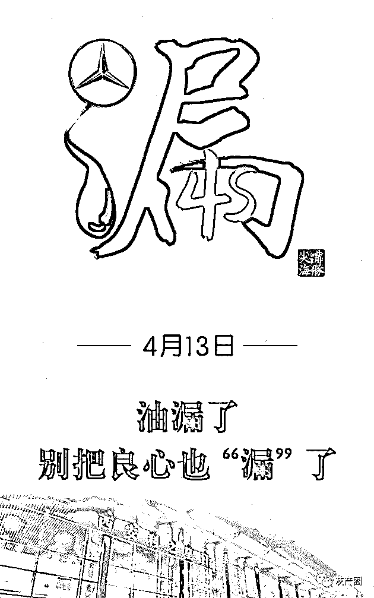
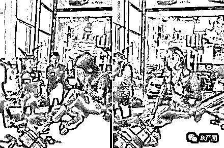
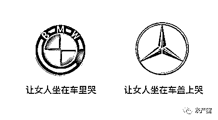

# 油漏了，良心也“漏”了！

> 原文：[`mp.weixin.qq.com/s?__biz=MzIyMDYwMTk0Mw==&mid=2247495082&idx=1&sn=9cf31de04b3c5b31768de20f4682f9e4&chksm=97cb2692a0bcaf8410f0dc346907a65e4cdfbeafbe7faf7b4413f9b9661e0adaf306c56f023e&scene=27#wechat_redirect`](http://mp.weixin.qq.com/s?__biz=MzIyMDYwMTk0Mw==&mid=2247495082&idx=1&sn=9cf31de04b3c5b31768de20f4682f9e4&chksm=97cb2692a0bcaf8410f0dc346907a65e4cdfbeafbe7faf7b4413f9b9661e0adaf306c56f023e&scene=27#wechat_redirect)

**点击上方蓝色字体免费订阅“灰产圈”**

导语

西安奔驰女车主引擎盖哭诉维权的事件仍在继续蔓延发酵,今日（04-14）微博热门有两条是关于此次事件的，灰产圈从事件发生起就持续关注本次事件，可以说，事件女主奔驰车漏油事件并不是第一次发生，也不会是最后一次发生，只不过本次事件通过微博等媒体曝光引发了很多的关注。

而梅赛德斯奔驰官方今日也紧急发布声明，如下：

而在本条声明的下发，网友评论也是热火朝天，可见其问题所在，如下：

“奔驰漏油事件“最新进展

[`v.qq.com/iframe/preview.html?width=500&height=375&auto=0&vid=v0860tk2d44`](https://v.qq.com/iframe/preview.html?width=500&height=375&auto=0&vid=v0860tk2d44)

4 月 14 日，该名女车主与奔驰 4S 店高管沟通录音曝光。

录音中，女车主反复质问：在购车时，不知情的情况下被收取了 1.5 万元的奔驰金融服务费，通过微信二维码扫码支付，进入某个私人账户，全程未有任何服务。“这是我不知情的，骗取的，谁代表你们收的这笔钱？这笔钱流向何处？1.5 万元是什么计价标准？”

其实这仅是众多汽车维权事件的其中一个案例，但此次事件能引起大范围的传播，灰产哥认为原因是:

1.讲道理的解决方式对于汽车维权并不容易，撒泼拉横幅仿佛才是“正确”的处理方式，车主合理诉求得不到保障，压抑的绪在此次事件集中爆发；

2.为何百年奔驰，近期频出店大欺客、发动机漏油、变速箱顿挫等问题，为何快速增长的豪华汽车市场，质量却不如以往？

3.“我是受过文化教育的人，但是这件事让我几十年的教育受到了奇耻大辱！”这句话更是激起广大消费者心中的共鸣，连中产阶级人士都不能维护权益，那普通消费者维权之路将更加艰难。

说到汽车质量，从中国消费者协会发布的 2018 年汽车产品投诉情况看，其中收到投诉最多的为比亚迪汽车，但让人没有想到的是，奔驰、宝马“紧随其后”位列 2.3 名。

我们在来看看此次事件的主角，梅赛德斯-奔驰，从汽车投诉处理平台车质网的投诉信息来看，奔驰减震器断裂、变速箱故障、发动机异响漏油……而让人凌乱的是奔驰官网写着，为广大中国消费者献上出众的产品、服务以及品牌体验，实现对中国市场的长期承诺。

难道这就是“心所向、驰以恒”的品牌精神？

事件结果仍有待监管部门调查，但有一点必须明确，保障合法权益不受侵犯，需要消费者不断增强维权意识，更离不开监管部门的有效监管。

维权，本不应如此之难！

油漏了，别把良心也漏了！

事实上，4S 店和消费者相关的话题属于老生常谈，自有汽车销售行业开始，4S 店和消费者之间的“冲突”就不断，前者能多赚点就多赚点、后者则能省点则省点。对于 4S 店应得的合法合情合理的利益，我们不要去干涉，毕竟经销商不是慈善机构；

而一些譬如价格虚高、加精品装饰等等初级的手段消费者也早就不适合这个理性消费的年代；我们真正要提防的，实际为一些较为隐蔽的“灰色手段”。

4S 店买车

> **一、销售顾问真的可以跟经理申请下最低价吗？**

当买车方与卖车方砍价还价至白热化阶段时，销售顾问通常会“退一步”，所谓是去和经理申请更低的价格，那么经理真的有更低的价格吗？

答案是有，在一家 4S 店每个职位的优惠权限都不同，其中店长权限最大，经理也有一定的优惠权限。

但这里的“申请”也分情况：首先销售顾问确定价你想要，你之所以还没定的唯一原因就是价格，这时候他就会真去申请；其次销售顾问不会去申请，自己手里还有降价空间，只是去办公室做做样子就会出来，他之所以去“申请”是为了防止你得寸进尺再砍价；还有一种情况销售顾问不会申请，因为现在整个汽车销售行业都不景气，一些店经理会把自己手里的优惠权限下放至销售员。其实这时候来看，申不申请就不是最重要的了，价是不是最低才是最主要的，善用同级别车型对比、同品牌店价对比、真诚些基本都会聊到最低价，毕竟多数车型什么价格往外卖和销售顾问工资并无关系。

> **二、为什么我买车的价格和发票价格不同？**

很多人买了车开票后会发现发票标注价会比自己所付的价格要低，销售顾问会说“低开票店里少交税、您买保险时也会便宜”。事实上这一说法并没有不对，但两全其美的背后一般还有猫腻。由于相关政策规定以及厂家规定，低开票的票价一般不能低于该车的最低售价，意思也就是说：一般发票上的价格才是这款车的最低售价。不过多数人都是交钱、验车后才开的发票，过了讨价还价的环节，当然这时候要赠品还是可以的。

> **三、不交订金厂家不给发车？**

关于订金和定金，一般在汽贸区会有贩子玩这样的文字游戏，无论车卖不卖的出至少能坑一笔，一般正规 4S 店都是订金可退。但除非车源紧张的车型，如果只是颜色、配置等方面的问题暂时没车，订金不要交，价格谈妥后直接说明有车就来提、近期没车就去别家提。如果是热销车型、紧俏车型，交订金前说明后期不会有额外加价或强制消费，最好有书面证明，否则订金不交。

> **四、超值大礼包，过几天活动就没有了！**

4S 店一般的大礼包都是有标价的，通常为 8 结尾的四位或五位价格，甚是诱人。但是，这些大礼包多数都是廉价赠品，不要有侥幸心理去百度某某东西的价格，百度、淘宝、闲鱼上都会有此类商品卖，价格甚至比 4S 店标的还要贵，要知道这是经销商提前挖好的坑，他就怕你不百度。退一万步说，既然大礼包值 8888，那就兑换成同等现金优惠好了，你看哪家店能给你兑？

汽车金融黑幕

为什么要说汽车金融行业黑幕？本次 66 万奔驰漏油事件中，女主在购买奔驰轿车的过程中，奔驰工作人员曾要求女主“强制性”汽车分期，为什么女主明明能全款支付，还要求女主办理金融分期呢，这其中有有什么猫腻？

告诉你，黑的很！

这群被洗去的平台除了一些纯粹的骗子和自融的公司，还有一些是从根本的运营上出了问题，最大的原因之一就是——坏账。民间借贷行业坏账率到底有多高？

> **　　不是圈内人，不明圈内事**

　　在谈各个行业时，人们常用到圈子这个词，就像娱乐圈，生动形象，因为它们就真和一个圈一样，圈外人要想真正了解其中的奥秘，你得跳进去才行。外行看热闹，内行看门道，而民间金融借贷行业未尝不是一个圈。有的投资人选择上始终是盲目的，以为听一些公司的各种保证和在网上了解一些行业知识就能实现安全投资，然而这些始终是雾里看花而已。

　　作为曾经的“圈内人”，看着一批一批的民间金融公司诞生，也有一批一批的公司被大浪淘沙般的行业洗牌洗得毫无踪影。而这群被洗去的平台除了一些纯粹的骗子和自融的公司，还有一些是从根本的运营上出了问题，最大的原因之一就是——坏账。

　　行业避而不谈的真实数据

　　据渣打银行 2018 年数据显示，中国国内债务规模与 GDP 的比值是 2.5:1，即国内每发展 1 元钱的 GDP 需要借款 2.5 元才能完成，庞大的债务往来和借贷需求规模使得债务风险不可控，因而坏账频发。民间借贷、网络借贷、银行类金融机构借贷等无一不是坏账高发。国内坏账到底有多严重？

　虽借贷行业有一定坏账率这是公开的秘密，然而不能公开的秘密则是真坏账率的真实数据，民间借贷行业坏账率到底有多高？这个话题在借贷行业可谓是讳莫如深，目前部分公司会在运营数据月报或者年报中会披露自己的坏账率等核心数据，而公司对外宣称的坏账率一般都 3%以内，更有一部分甚至宣称自己平台的坏账率为零。笔者曾经看到过一句话“你所知道的内幕消息都是有一部分人希望你得知的”，这让人细思恐极。而有些公司“适当”的披露自己 2%或 3%的坏账率，其实更是为自己最底层真实数据打掩护。

> **　一车三吃，坏账恶性循环**

　车贷行业一直在宣称自己的坏账率比其他业务的要低，这也只是说给外行人听的，笔者作为曾经的线下借贷公司运营人员，给大家普及一下一些劣质借款人“一车三吃”的玩法：一辆车在 4S 店办理无抵押分期车贷，在几家银行申请车辆相关高额信用卡这是一吃，向民间金融公司申请抵押(安装 GPS 并做抵押登记)车贷款这是二吃，再向民间借贷公司申请质押车借款这是三吃，这样下来从两手空空到拿到车辆价值两倍的钱，20 万的车能套到 40 万贷款，然而大多数都是以坏账终结。“车贷有的公司已经有点做烂了，部分的坏账率可能达到 40%以上。”这是我曾经的同行，一家 P2P 借贷平台总经理的原话。这也是为什么车贷公司对其真实的数据坏账率避而不谈。

　　风控体系非常成熟的车贷公司可能能把坏账把控在 3%左右，但是实际上大多数的平台平均坏账的几率是超过 5%，但这也是个惊人的数字了！目前车贷行业汽车抵押大多都是以安装 GPS 监控的措施，GPS 一拆人跑了车更找不到，钱也有去无回，所以有的平台只能靠做大规模和降低投资人的收益，来掩盖或者转移坏账率给平台带来的风险。

> **　　如何解决？另一模式兴起**

车贷让人如此堪忧，我们不禁想问国内的金融环境、金融企业到底怎么了？难道就没有一套行之有效的解决坏账的途径？由此另一种车贷业务开始崛起——汽车质押贷款。“质押是指债务人或第三人将其动产或者权利移交债权人占有，将该动产作为债权的担保，当债务人不履行债务时，债权人有权依法就该动产卖得价金优先受偿。”简单来说就是必须把车放在借贷公司，如逾期，公司有权将质押汽车迅速处理变现，填补资金缺口。俗一点来说就是，跑得了和尚跑不了庙。

　　如果汽车质押也按 5%的前期坏账来算，其中坏账的标的公司有权处理变现，而根据借款时的价值评估，70%的车辆能达到溢价处理，其中 30%折价大概 20%处理，那么最终的坏账率为 5%×30%×20%=0.3%，如果溢价处理多出的资金再进行填补，那么质押车的风险系数就趋近于 0。如果就以车贷行业的最高坏账率 40%来说，那么车质押的坏账率也仅仅为

40%×30%×20%=2.4%，这也是汽车质押业务崛起的原因，更安全、更稳定，但由于其发展较缓慢，所以众多急于求成的公司大多不以此业务为主。

结尾

奔驰当年也是有些负面新闻的

但这次事件集中了几个因素

**66 万高价
女研究生
新车故障
销售敷衍**

几个因素叠加到一起，导致了此次事件的发酵。 

最后，我想问大家一句：

买奔驰吗？每开一公里需要换一个发动机那种！

**（请点击下方投票发表意见）**

 /mp/newappmsgvote?action=show&__biz=MzIyMDYwMTk0Mw==&supervoteid=504211246#wechat_redirect 

**官方声明：上文引用图片均来自视觉中国，但未缴纳版权费，欢迎来告！**

●[视觉中国：第一个被黑洞吸走的网站！](http://mp.weixin.qq.com/s?__biz=MzIyMDYwMTk0Mw==&mid=2247495062&idx=1&sn=0ab29384498641a6e49b07540922c654&chksm=97cb26aea0bcafb8ca311ec8620f7d18a4abe9fe6f4344d5c74e897190b54a0d9eec5df2f09e&scene=21#wechat_redirect)

●[博彩业《不能说的秘密》：为什么久赌必输?](http://mp.weixin.qq.com/s?__biz=MzIyMDYwMTk0Mw==&mid=2247495037&idx=1&sn=5aa5a761e36ac14fc459f33d643cb152&chksm=97cb2645a0bcaf53cae193ff61cdbcf1cbd456c2dd5af8a8c3f0eb5b2cdc28249bd9a966ccff&scene=21#wechat_redirect)

●[PUA：比一百个传销还恐怖的组织！](http://mp.weixin.qq.com/s?__biz=MzIyMDYwMTk0Mw==&mid=2247495011&idx=2&sn=f1967c258dea2b0aecb27ed89e2466fa&chksm=97cb265ba0bcaf4d05432650096f6700e187fc7604310b2079c19673173daca02e15845f8144&scene=21#wechat_redirect)

← 向右滑动与灰产圈互动交流 →

**阅读原文加入灰产圈高端社群**