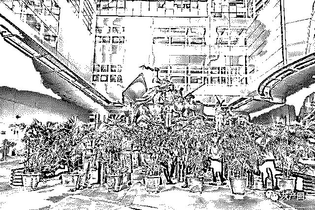
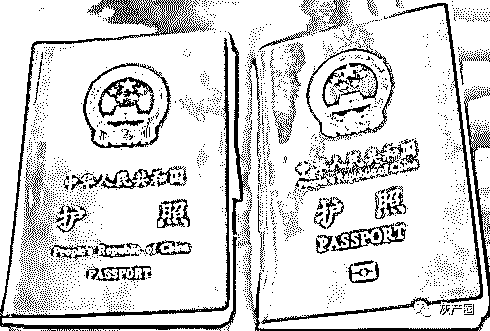
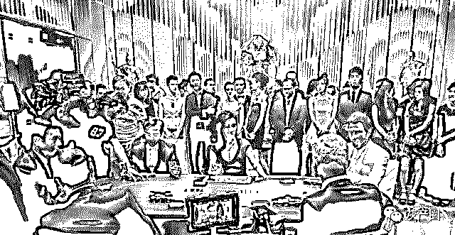

# “小镇青年”赌城黑金梦

> 原文：[`mp.weixin.qq.com/s?__biz=MzIyMDYwMTk0Mw==&mid=2247495071&idx=1&sn=75d1cef8a113f0532c69d51d8559ac90&chksm=97cb26a7a0bcafb144b2abe6216975bb7bc69597301803d71e18fdb22136d54da002a1b3fb28&scene=27#wechat_redirect`](http://mp.weixin.qq.com/s?__biz=MzIyMDYwMTk0Mw==&mid=2247495071&idx=1&sn=75d1cef8a113f0532c69d51d8559ac90&chksm=97cb26a7a0bcafb144b2abe6216975bb7bc69597301803d71e18fdb22136d54da002a1b3fb28&scene=27#wechat_redirect)

**点击上方蓝色字体免费订阅“灰产圈”**

**南方周末记者 罗真真/图**

**《南方周末》**

导语

菲律宾全国禁烟，博彩公司每半天会有二十分钟供菜农们吸烟，这些吸烟区久而久之成了菜农们的消息集散地，也是他们为数不多的社交时间。 

扣护照是博彩公司的第一条铁律。各个公司的假期、薪酬、福利，以及管理方式都有所不同，但唯一不变的就是扣护照。

她手下的客户有不少家破人亡的故事，但丝毫没有影响她对马尼拉的美好感受，“在国外还能过着中产的生活，挺好”。

当了两年的代理，自己成为这个产业链一环之后，他才发现，“你赌下去肯定是要输的，哪怕你赢了也会送回去”。

交换过护照，才是真爱

从梦里惊醒过来，陈璇璇擦擦额头的汗，一看闹钟，又是七点。这是她入职博彩公司的第七天，每天七点都会被同一个梦惊醒。

梦里，中国警察突然冲了进来，大喊“全部趴下”。她趁乱躲进了女厕所，“但是警察去厕所搜，还是把我抓住了”。

“警察来了”一直是菜农们的共同梦魇。博牛社区一旦出现抓人的网帖，浏览量比平时能翻上一倍，

十一点半她才起床，简单洗漱后，停在宿舍楼下的大巴车会穿过马尼拉，将他们送到帕赛市的双龙大厦。

从电梯口出来，走廊里的灯光忽明忽暗，有时候陈璇璇会恍惚，分不清梦里还是现实，她的办公室就在这些神秘格子间的最里面。

一排乳白色的铁皮储物柜出现，她把手机和钱包都锁进了柜子。办公室不允许带入私人物品。离开时也一样，不能带走任何东西，“哪怕是一张卫生纸”。

办公桌上没有任何人留下的痕迹，唯一醒目的就是一排排垒放着的手机。背面贴满了各种奇怪的关键词，陈璇璇猜测“应该是有一定的分类”。有些电脑屏幕依然开着，密密麻麻都是对话框。

“就像在医院的停尸房上班。”外面是菲律宾热带气候，高达 30℃的热浪把地面烤得炙热。写字楼里，菜农们披着毛毯，戴着口罩。

这样的中国“菜农”，在马尼拉随处可见。据菲律宾《每日问询者》2019 年 3 月 26 日报道，菲律宾财政部测算，全部 205 家离岸博彩公司约雇用 10.3 万名中国员工。

去博彩公司报到的第一天，陈璇璇数了一下。从电梯口到办公室，每两块地砖之间就有一个摄像头。后来她才知道，办公桌上的屏幕也有人盯着。

一位女同事用 Telegram 向陈璇璇抱怨“肚子很不舒服”。不到一分钟，HR 就冲了进来，“不舒服要提前请假，不要影响工作”。她们这才突然意识到，自己被监控了。

没有最基本的信任，老板们要保证员工明天还会上班，唯一办法就是扣押他们的护照。

扣护照是博彩公司的第一条铁律。各个公司的假期、薪酬、福利，以及管理方式都有所不同，但唯一不变的就是扣护照。

也有人会私自逃跑，悄悄去大使馆补办回乡证。博彩公司之间还专门自建了一个网站“跑路吧”，发布悬赏告示，将不告而别的员工护照信息进行曝光。

菜农们最担心的就是被曝光，隐姓埋名是菜农入职后的第一件事，HR 会要求“取一个与你本人毫无关系的名字，不能有任何谐音，或者让人家联想到你”。

陈璇璇的朋友中，有人彼此认识了快十年，但互相都不知道对方的真实姓名，“也不去谈论任何自己国内的情况”。

下午六点食堂放饭，像一部集体演出的哑剧，大家都沉默着排着队。随处可见的中英文标语上写着：“禁止交谈，违者罚款一万比索”。

年纪稍长的亚当来公司已经有些年头，平时也敢于说话。看到有人加菜的时候，头都探到汤锅里面去了，他觉得这样不卫生，让领导管一管，最好装一个摄像头。

领导白了他一眼，“没必要搞这些”。从此之后，他再也没有来过食堂吃饭。陈璇璇后来才知道，“他原来在的那家公司就是有人心怀不满在饭菜里下了毒”。

“在菲律宾交换多贵的礼物，都不算什么，交换过护照才是真爱。”陈璇璇身边发生过太多例子，一旦回国上岸，菜农们就会与马尼拉的一切彻底切割，哪怕是亲密无间的爱人。

当同事 Ada 宣布了自己恋爱的喜讯后，好几个同事的第一反应都是，“你要确定他在国内没结婚哦，要不然被搞大肚子就不好了”。

菲律宾是一个天主教国家，这里不允许堕胎，过去连售卖避孕套都违法。如今，黑市流通的堕胎药也被菜农们越炒越高，堕胎药要 2500 元人民币，小诊所的堕胎手术更是要一两万人民币。

唯一能带来安全感的只有钱。陈璇璇的室友是一个漂亮的女孩，每天上班前都会画上一个小时的妆，梳妆台上都是清一色的奢侈品牌。

有次半夜醒来，她发现室友正眼睛盯着手机嘴里念着“完了、完了”，额头竟然满是汗珠。

“这一行的人真的很可恨，可又总有一些瞬间让我心生怜悯。”看着身边的这些人，陈璇璇内心很矛盾。

**午夜的双龙大厦，仿佛是珠三角的某个工业园区，小镇青年们在这里川流不息。 **

十年来一直打电话劝人赌博

附近的保安都认识这位矮小的中国女人。大多数中国人对保安的问候视而不见，她却很热情，眼睛眯成一条缝，露出洁白的牙齿，点着头。到马尼拉十年了，崔秀凤还是不愿意说英语，哪怕打个招呼。

2011 年，湖北女孩崔秀凤刚刚大学毕业。听说出国工作比较赚钱，在中介的指引下，她从湖北的小镇来到国际大都市马尼拉，在一家台湾人开的盘口找到了一份电销员的工作。当时的中介费近万元，付不起中介费的崔秀凤还向银行申请了贷款。

如今已经产业化的保关业务在当时还没有出现，她自己拖着行李走出马尼拉的机场。当下占领阿拉亚大街高档写字楼的博彩巨头们，彼时还藏身于破旧宿舍楼里，“两三台笔记本就搭起了一个台子”。

这些巨头们以福建人和台湾人为主，他们以家族为单位在当地不断裂变，如今的博彩巨头老板中，福建人占了主流。

这与马尼拉的华商环境也有着千丝万缕的联系，菲律宾一直流传着一句话，“说英语不如说中文，说中文不如说闽南话”。

但是传统的华商看不起这些博彩起家的新老板，当地的传统华人论坛菲龙网就一直与博彩业保持着距离。

那是一个客户找台子的年代，用户多、公司少，几乎随随便便做做都能赚到钱。现在的菲律宾总统杜特尔特，当时还是菲律宾最混乱省份的省长，也没有如今的线上博彩管理机构 pagcor。

每次发工资，崔秀凤会将其中的 80%汇回家里，“工作没多久就帮家里在省城买了一套房”。她一直觉得这家中介给她推荐这份工作是一种“幸运”。

博彩行业历经了数次洗牌，最初她在一家台湾公司，与这家公司同时代的大公司几乎都不复存在了，“有的是因为内部斗争，各个高层各立门户，有的是因为市场竞争被淘汰，还有的是因为老板赚够了转行”。

游戏类型也发生了变化，过去以体育类、赌场游戏比较多。现在和国内的彩票游戏挂钩的比较多，比如重庆时时彩、北京赛车，这些都是国内官方机构开奖的，还有最近很火的真人视讯。

彼时，微信用户才刚刚破亿，电话还是最主要的销售手段。她所在的电销部门是绝对的顶梁柱，“电销部门三个月流水可以有一千万元左右”。

当时的促销手段也比较单一，就是送礼金和礼品，“现在花样更多，流水大的话，送电子产品、手机、汽车都有。还有组织去英超看球，或者海外旅游”。

当年的产业化还没有真正开始，现在几乎是一条龙服务，整个市场也显得更为混乱，“过去会更正规，现在黑台子比较多”。

产业逐渐更新换代，崔秀凤所在的电销部门从很多博彩公司中消失了。十年来，唯一不变的就是客人一直在输钱，一直跟着她的那些老顾客“没有一个不输的”。接着，她解释，“我们是挺正规的，并没有骗客人的钱，而且客人自己愿意玩，就要承担输钱的风险”。

她手下的客户有不少家破人亡的故事，但丝毫没有影响她对马尼拉的美好感受，“在国外还能过着中产的生活，挺好”。

最近她怀孕了，她和老公已经计划好了去美国生孩子，为移民美国做准备。如日中天的博彩业，也给了他们新的机会，老公在博彩楼底下开了一家中餐厅，“每天利润稳定在 12 万比索以上”。他们还计划开一个奶茶店，“一个月可以赚 50 万人民币”。

她老公早就花了十万比索买了一个菲律宾人的身份，还取了一个地道的菲律宾名字。

**灯火通明的博彩楼上都是年轻的中国“菜农”。** 

拉别人赌博还自己的债

### 

### **上图来自视觉中国，但是没缴纳版权费！** 

### 从外面看，知名的赌场索莱尔是一组金色的建筑群，远远望去仿佛一座金山。

大门口，车辆要停下来接受检查。背着冲锋枪的保安一手扶着枪柄，一手打开后备箱。侧面的保安，则用长柄的凸面镜伸进去车底盘，仔细检查过了，才可以开进索莱尔。

刘宇所在的网络博彩公司租用了索莱尔的停车场，以便得到索莱尔的庇护，不用担心突袭检查。大厅里满是反光的金色镜面，搭配硕大的水晶灯，一派金碧辉煌。

穿过这个金碧辉煌的大厅，通过一个狭小的电梯就到了他的办公室，刘宇的办公室是停车场改造而成的，异常狭窄没有窗户，空气里满是“人的味道”。

刘宇在赌场食堂点了一份韩国拌饭坐了下来，咀嚼着干涩发硬的米饭，他从服务员的盘子上拿了一杯碳酸饮料。赌场的食堂免费供应饮料，饭菜也很便宜，花上不到 20 元就能解决一顿午饭。

2017 年到菲律宾之前，刘宇是国内一家顶级地产公司的管培生，过着西装革履、朝九晚五的生活。他毕业于湖南一所 985 大学的法律系，在校期间就是学生干部，还没毕业就收到了这家公司的 offer。如今，他已经穿不下当年的西装，啤酒肚子将整件 T 恤吹了起来，一头染黄的蓬松卷发遮住了他的眼睛。

大口喝下一口雪碧后，他一脸满足说已经爱上了菲律宾。

他曾经是个赌徒，催债的电话打到了公司，他的通讯录也被多个网贷平台爆了个遍。但他从公司辞职后，唯一想到的办法就是继续赌，拿着东拼西凑的五千块钱去了澳门，想要“补天”。在赌徒的字典里，欠到无法翻身时的最后一搏，被称为“补天”。没有意外，这五千块钱也输得精光。

复盘自己这两年的经历，他总是清楚地记得一个画面。2016 年，欧洲杯西班牙对意大利，他输掉了 15000 元，这是他当时身上仅剩的所有资金，结果他意外发现自己很轻松地就从借呗和平安 I 贷中，借来了另一个 15000 元。

从那一刻开始，他欠款的数字就开始几千几百地往上涨，“几个月的时间，突然一下就挽不回了”。

原来他一直以为自己输的原因是本金不够。当了两年的代理，自己成为这个产业链一环之后，他才发现，“你赌下去肯定是要输的，哪怕你赢了也会送回去”。

两年来，他唯一拯救自己的办法就是拉更多人进来。这两年他省吃俭用还债，“最多的时候欠了两百多个，现在只剩一百个”。个是计算赌资的特有单位，所谓一个就是一万。

他计划债还完了就在菲律宾开个中餐馆，专门做湖南小炒。他在这边舍不得吃小炒，“一碗辣椒炒肉在这里要五十元人民币，比国内翻了一番还不止。”

来到菲律宾之后，他申请了一个微信号，所在地设置为台湾花莲，说话偶尔流露一两句台湾腔，很多同事都以为他是台湾人。没有人会去问对方的身份，“这里没有人在乎你的过去”。同样，也没有任何人知道他们在马尼拉所做的一切，“都说出国打工了”。

刚刚与他道别，南方周末记者就接到了他打来的电话，语气十分着急，“你不是想找工作吗？特别巧，我刚才帮你问了几个朋友，他们刚好需要人，你赶快过去吧！”

事后，我们才知道他已经和人事谈好，面试成功他要收五千元佣金。

（应受访者要求，陈璇璇、崔秀凤、刘宇为化名。）

●[博彩业《不能说的秘密》：为什么久赌必输?](http://mp.weixin.qq.com/s?__biz=MzIyMDYwMTk0Mw==&mid=2247495037&idx=1&sn=5aa5a761e36ac14fc459f33d643cb152&chksm=97cb2645a0bcaf53cae193ff61cdbcf1cbd456c2dd5af8a8c3f0eb5b2cdc28249bd9a966ccff&scene=21#wechat_redirect)

●[准备去菲律宾做博彩的注意了【深入篇】](http://mp.weixin.qq.com/s?__biz=MzIyMDYwMTk0Mw==&mid=2247494829&idx=1&sn=99a0112e3bb9276d4ac18567476281df&chksm=97cb2795a0bcae8355dbe6d41e4355d445bfda3aa76a09243d6b8320c25c2e6cccd8bf3f5761&scene=21#wechat_redirect)

●[深度调查菲律宾博彩：记者暗访，假扮美女，专坑国人，员工自称“东方监狱”！](http://mp.weixin.qq.com/s?__biz=MzIyMDYwMTk0Mw==&mid=2247492930&idx=1&sn=866796a9018f69208c275f79c3e907b5&chksm=97cb2e7aa0bca76c00d92fa5282c30fb8e08520cf237ea792be05ff3ac8caaaedff934720afb&scene=21#wechat_redirect)

●[深度揭秘 | 菲律宾网络博彩：专坑国人的赌局！](http://mp.weixin.qq.com/s?__biz=MzIyMDYwMTk0Mw==&mid=2247493920&idx=2&sn=bc1df12d46cbd070a27aa6987ef07b0c&chksm=97cb2218a0bcab0e074375d5d5b4264fbc222ae48843bb23ec7348dcc8d9777725a5d6fe4925&scene=21#wechat_redirect)

← 向右滑动与灰产圈互动交流 →

**阅读原文加入灰产圈高端社群**