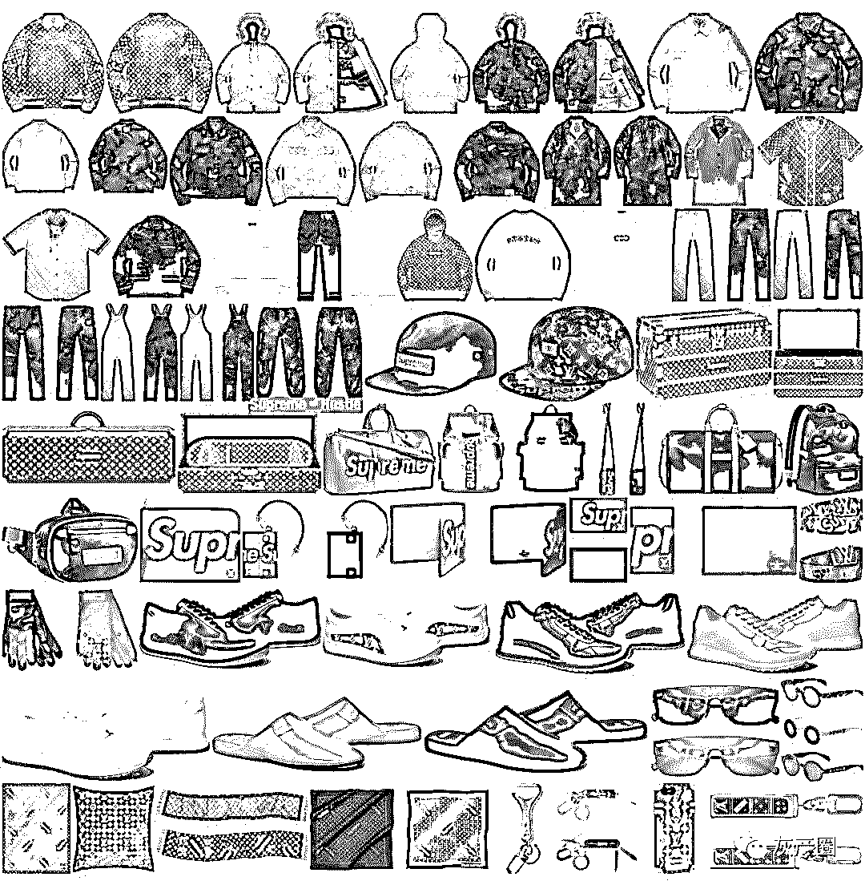
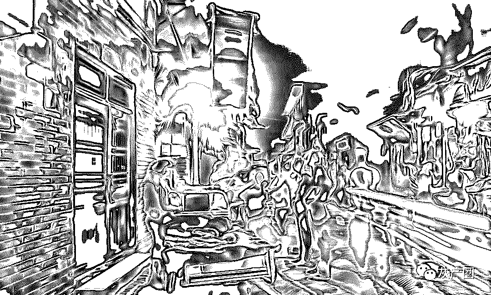
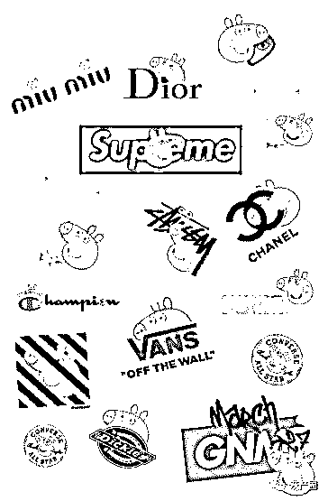
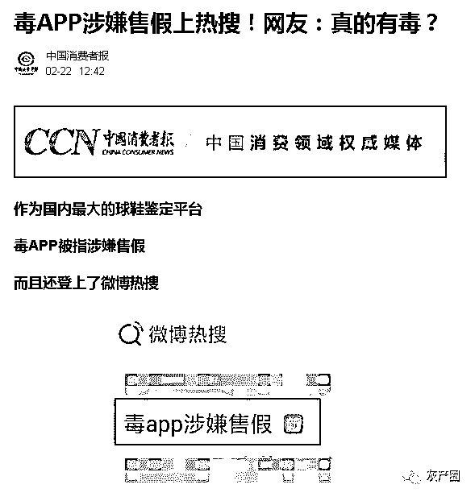
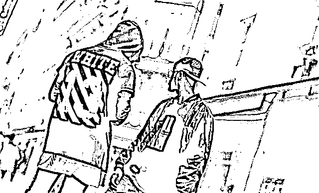
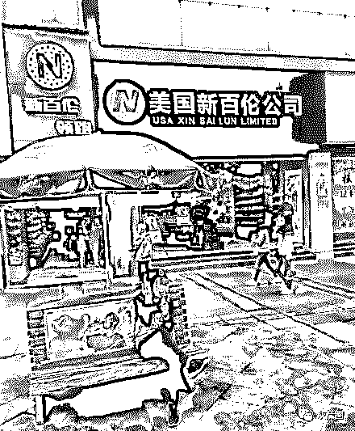
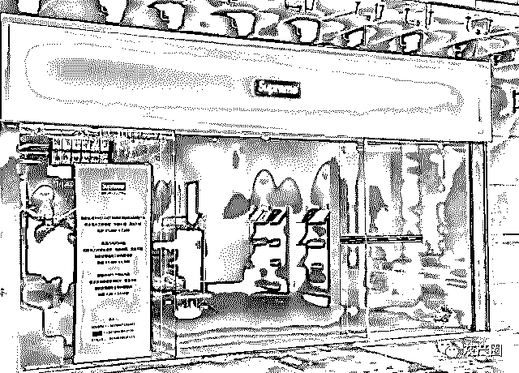

# 潮牌背后的灰色生意经：源自莆田系的罪恶

> 原文：[`mp.weixin.qq.com/s?__biz=MzIyMDYwMTk0Mw==&mid=2247495023&idx=1&sn=40dc0e28b5a802b45ccc73db72ccfa5b&chksm=97cb2657a0bcaf419baa0a2b0d638a0c674fc955bfaeff2e3a1c043de9a44332e4c255590528&scene=27#wechat_redirect`](http://mp.weixin.qq.com/s?__biz=MzIyMDYwMTk0Mw==&mid=2247495023&idx=1&sn=40dc0e28b5a802b45ccc73db72ccfa5b&chksm=97cb2657a0bcaf419baa0a2b0d638a0c674fc955bfaeff2e3a1c043de9a44332e4c255590528&scene=27#wechat_redirect)

**点击上方蓝色字体免费订阅“灰产圈”**

导语

近年来流行的个性潮牌，成为不少年轻人青睐的产品，但由于各类潮牌在国内商标注册以及不熟悉市场等问题，使之在产品供应及销售等方面均出现了不同程度的问题：仿冒产品不断衍生，垂直电商平台的货品频频因为出现假货被消费者投诉。近日在福建莆田走访时发现，此前被仿冒鞋碰瓷的对象，已经从耐克（NIKE）、阿迪达斯(adidas)、新百伦(New Balance)等较为大众的品牌，转为“Vans（范斯）”、“supreme”等潮牌。

凌晨“鬼市”人来人往

　　“你看，这些扛着纸箱的摩托车就是准备去‘鬼市’的。”开车的当地司机告诉 KK。

　　凌晨的莆田安福电商城，本应安静的街道却灯火通明，长达 2.6 公里的学园路上，摩托大军正穿梭其中，在摩托车后座的大箱子里，隐约可见品牌运动鞋的标志。

　　在学园北路的一幢烂尾楼里，建筑墙体暴露在外，显得有些破烂，每个隔间却装着崭新的防盗门，门口贴着微信二维码，窄窄的楼道中摩托车鱼贯而入，这些被称为“阿冒”的骑手轻车熟路驶入一个个隔间。KK 向门内张望，发现里面堆满各类名牌运动鞋，拿货人用手机出示取货码、取货、付钱，极少对话，1 分钟内拿货走人。

　　而在一片看似居民区的楼房背后，是如“马蜂窝”状分布的仿冒鞋仓库。实际上，这些仓库面积在 12 平方米左右，前来取货的人按事前拿单的号码排队拿货，所谓的货则是外盒有耐克（NIKE）、阿迪达斯(adidas)、新百伦(New Balance)标志的仿冒鞋。

　　“这里的居民区每一层楼，都被划分为无数的隔间，这些摩托车一部分是来拿货的，另一部分是来送货的，这样既可以补充货源，也不会囤积太多。因为近年检查太严，这样的操作如果被查到也不至于损失太严重。”当地一名知情人士告诉 KK，一般来拿货的人都是有固定对口的商家，如果是陌生人，他们会很警惕。

　　“鬼市”生意也衍生出了“快递一条街”“夜宵一条街”。KK 留意到，这些鞋子从仓库取出后，随后被摩托车运往楼外巷子口的各个快递公司。这些所谓的“快递公司”打着韵达、圆通、申通等正规快递公司的招牌。

一般快递公司的揽货时间是截止到晚 9 点，而在这里，这些快递公司会营业到早上五点，半掩的卷帘门内并不见穿工作服的快递小哥，取而代之的是麻利的收货点货中年妇女。“这一晚上收百来单不成问题，身边有不少。”一名快递人员说。这些快件随后将通过发达的物流网络发往全国。

山寨潮牌“毫不客气”

　　KK 在“鬼市”上看到，这里的商标“碰瓷”屡见不鲜。其中耐克（NIKE）、阿迪达斯(adidas)、新百伦(New Balance)是“山寨”最多的品牌，其中以，“New Balance”的山寨版最多，包括 New Barlun（纽巴伦）、NEWBAILUNLP（新百伦领跑）、New Boom、New bunren 等。“据我所知，这里 New Balance 的山寨版那么多是因为这家公司注册的商标较少，只注册了‘新百伦’‘New Balance’等几个，对于仿冒商家来说就有机可乘了。”知情人士告诉 KK。

KK 了解到，一些大牌公司除了自己的商标外，为了防止山寨，也会把相似的商标名称注册下来。

　　在大众品牌仿冒之外，山寨高端潮鞋也成为莆田的新生意。在一面写着鲜红的“致富热线”的墙上，上面是商标为“万斯·范斯”的鞋子产品，而无论是从鞋子设计，还是鞋面商标，这个所谓的“万斯·范斯”都和美国运动潮牌 Vans(中文译为“范斯”)如出一辙，在这一广告墙上还留下了加盟的联系方式。另一个被“碰瓷”较多的对象是美国街头服饰品牌 supreme，在安福电商城的街头，“欢迎加盟 supreme”的广告牌层出不穷，而实际上 supreme 并未在中国有商品授权，更别说门店加盟。

　　莆田山寨高端潮鞋盛行的背后，是年轻人对于个性品牌的青睐。业内有人士认为，潮牌的背后是下一个万亿级市。“有货”、“毒”等垂直潮牌电商也在这两年间活跃起来，毒 APP 作为一款垂直球鞋领域的电商平台，因为货源充足，搜索界面摆设了几乎所有爆款和经典的款式，整合了大量资源提升了购物效率，短时间内获取到了大量的粉丝。

但同时毒 APP 上关于“假鞋”、“售假”的投诉也逐渐增多，KK 统计发现，其 3 月 13 日-16 日期间，共有 10 条相关投诉，有消费者投诉称：“在毒上花了 1299 买了 Aj312，穿的时候发现鞋里面是烂的，而且瑕疵很多，怀疑是假鞋。”

**中国消费者报**

　　随着年轻人社交平台购物习惯的养成，社交平台就成了山寨高端潮鞋的一个新出口。“莆田仿冒鞋商家到底在微博上投了多少广告，怎么在每条微博下都能刷到。”北京的 90 后白领阿元告诉 KK，她在刷微博的时候经常会在评论区刷到关于鞋子的广告，她点进去一看都是一些明星同款的潮鞋，有些店家的资料直接填的就是莆田。

在微信朋友圈，潮鞋也成为面膜之后微商叫卖的另一大品类，诸如“遇到喜欢的人，就送她一双 Vans……”等文案开始在微商中流行。

严管之下另寻出路

　　事实上，早自 2016 年起，当地工商主管部门便开始不定期巡查，邮管部门参与联合行动，抽查快递网点，抽检快递整车，重点检查大批量的鞋品发运。

　　近些年，莆田市各级主管部门逐渐加大对“仿冒鞋假海淘”的处理力度，清理快递市场，并积极引导莆田鞋业打造自主品牌，扶持鞋业电商城健康发展。

　　今年 2 月，莆田市工商局也印发《2019 年鞋服商标侵权违法行为专项整治行动工作方案的通知》，其中将运送、邮寄侵权鞋服的行为列为故意侵犯他人商标专用权的违法范畴。

　　在政策引导和企业自我净化要求下，顺丰和中国邮政 EMS 开始拒收莆田鞋，其它快递公司，也积极配合上级主管部门工作，开展内部清查整顿工作。

　　“在莆田寄出鞋类产品时，大批量的要出示相关的品牌授权资料，散单的话需要提供购物凭证。只要是有注册商标的，或者正品授权的品牌，我们都是可以寄送的。”一名顺丰小哥告诉 KK。

　　“我们本地人现在都不在制鞋工厂里做了，来打工的都是外地人。一是本地人人力成本比较高，而且部分本地人也觉得制假鞋其实挺不光彩的。”一位当地人告诉 KK，随着相关部门整治的深入，越来越多的莆田人开始从事其他产业，或打造自主知识产权的品牌。

三方缺位导致山寨高端潮牌泛滥

潮牌的魅力在于品牌所代表的态度，可能是街头文化、可能是极限运动，也可能是诗与远方，这是年轻人喜爱的潮牌的原因。

但是相比于知名品牌，潮牌的造假成本显然更低，一方面是很多小众潮牌根本还没进入市场，一般的购买渠道是代购，或者授权的海外旗舰店，而社交平台又是假货最容易泛滥的渠道；另一方面，潮牌在国内的造假成本低，和一些国际知名品牌相比，商标侵权所要承担的风险更低。

更重要的是，这个市场非常广阔，根据市场咨询公司尼尔森联合 OFashion 迷橙发布的全球首个潮牌大数据研究趋势及用户分析报告显示，潮牌消费增速是非潮牌的 3.7 倍，90 后和 95 后是潮牌的主要消费群体，且 95 后三年来占比逐渐攀升至 25%，这其中，前 10%的骨灰级用户的潮牌花费占到个人总支出的 60%至 80%，占据了 48%的市场份额。潮牌本身缺乏商标保护措施，仿冒商有以假乱真的“山寨”技术，垂直潮牌平台缺乏监管，三方缺位就导致了潮牌产业的野蛮生长。

结尾

　　近年国内潮牌产业的发展迅速，不只是国外潮牌被年轻人喜爱，国内也诞生了一批潮牌。对于不少国内原创潮牌主理人来说，他们面对的不仅是上游供应商的挑挑拣拣，还要面对大量的“山寨”产品。

每当提到潮牌，行业内常常问的一句话是“中国的 supreme 什么时候会诞生？”但是在野蛮生长之下，我们看到的却是各种缺斤少两的“SUPREME NYC”。

　　莆田“鬼市”的形成有其历史原因，相关管理部门也在持续推进转型升级，虽然自主品牌打造之路需要时间，但相信在各方的努力下，当地一定会走出一条属于自己的品牌之路。

[`v.qq.com/iframe/preview.html?width=500&height=375&auto=0&vid=r0023pm9lfl`](https://v.qq.com/iframe/preview.html?width=500&height=375&auto=0&vid=r0023pm9lfl)

山寨商品物流造假

●[造假！抄袭！“杀熟”！电商平台灰色产业大起底！](http://mp.weixin.qq.com/s?__biz=MzIyMDYwMTk0Mw==&mid=2247493721&idx=1&sn=81ebd3d864be92905518837229950f9f&chksm=97cb2361a0bcaa776f33f6809a2d0b3fe7c76f1f6fc2c986d729e111ab0c5e4a3984c484c2b2&scene=21#wechat_redirect)

●[假伪劣黑产链面前，拼多多只是个孩子，TA 才是巨人](http://mp.weixin.qq.com/s?__biz=MzIyMDYwMTk0Mw==&mid=2247492844&idx=2&sn=18fc2e8aaa847ca0ee5753e1e90e3ecb&chksm=97cb2fd4a0bca6c245aa1eaee942a7b3c9385533fbb2cb1aaf0a6ffae00064761ffa91ba7ad0&scene=21#wechat_redirect)

●[南抖音，北快手，假货界的两泰斗？](http://mp.weixin.qq.com/s?__biz=MzIyMDYwMTk0Mw==&mid=2247490873&idx=1&sn=080d62a50b7f6e51fb21d3157d05db16&chksm=97c8d601a0bf5f170b5341a5e94728fcdc76e5d870214a961a12fd9a2e9b6f507eb5f22fa005&scene=21#wechat_redirect)

●[大揭秘：神秘的 淘宝职业“打假人”  灰色产业链， 年薅“淘宝” 上亿羊毛。](http://mp.weixin.qq.com/s?__biz=MzIyMDYwMTk0Mw==&mid=2247488824&idx=1&sn=87de122c8ffb49dcfd4df5fa1f2872ca&chksm=97c8de00a0bf57168c3c6be6b71fb98b6d0507dc809a04148143cc9044065f1b5bf5c404130c&scene=21#wechat_redirect)

← 向右滑动与灰产圈互动交流 →

**阅读原文加入灰产圈高端社群**