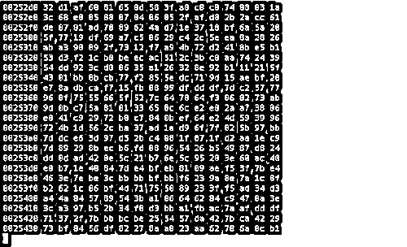

# 1 个 95 后，3 个 QQ 号，60 名团队成员，2 年诈骗 1 亿元！

> 原文：[`mp.weixin.qq.com/s?__biz=MzIyMDYwMTk0Mw==&mid=2247494999&idx=1&sn=25711b33034c74460b2365c5444f8e2d&chksm=97cb266fa0bcaf79c2658bf9b05fa0ce60e423f1321d46e023b62b0d49cf3b2d728a53562a95&scene=27#wechat_redirect`](http://mp.weixin.qq.com/s?__biz=MzIyMDYwMTk0Mw==&mid=2247494999&idx=1&sn=25711b33034c74460b2365c5444f8e2d&chksm=97cb266fa0bcaf79c2658bf9b05fa0ce60e423f1321d46e023b62b0d49cf3b2d728a53562a95&scene=27#wechat_redirect)

**点击上方蓝色字体免费订阅“灰产圈”**

导语

一个 95 后，三个 QQ 号，于缅甸设立窝点，纠集 60 余名犯罪嫌疑人组织策划，行踪遍布 21 个省市自治区，两年内团伙网络诈骗涉案金额近亿元……这起公安部督办的江苏省首批利用支付宝等第三方支付平台实施的特大跨国网络诈骗案成了今年最高检工作报告中提到的典型案例。

微信开业务

2 小时被骗 8888 元

2017 年 6 月 26 日，被害人 cc 到江苏省常州市金坛区某派出所报案称其前一天下午 2 点至 4 点间，在微信上被骗 8888 元。

刚开始，cc 在陌陌上看到有人发状态说“提高蚂蚁花呗额度、强开蚂蚁借呗”，刚好他想提高蚂蚁花呗额度，顺便开通蚂蚁借呗，就加了一个名叫“TT”的微信。

> “TT”先提供一个电话号码让 cc 拨打，按语音提示拨 2 开通蚂蚁借呗，并提供支付宝账号和姓名，结果 cc 手机显示开通失败，此时“TT”已借机掌握 cc 蚂蚁花呗的额度。
> 
> 接着，“TT”告诉 cc 需要进行虚假交易才能开通。于是“TT”又提醒 cc 用支付宝绑定没钱的银行卡来支付发过去的虚拟账单，结果又显示余额不足而失败。
> 
> 随后，“TT”根据 cc 的蚂蚁花呗额度，找人制作了一个相应金额的携程网“任我行”礼品卡订单链接，让 cc 在链接中填写电话号码，并用没钱的银行卡支付，结果仍显示失败。
> 
> 然后，“TT”索要了 cc 身份证号码后六位数，让 cc 用没钱的银行卡重新操作支付失败的订单，又一次支付失败。
> 
> 实际上，cc 经历了一次开通失败，三次支付失败，这些都是“TT”让 cc 放松警惕的幌子。这时，“TT”才让 cc 点击蚂蚁花呗支付，而因支付宝的密码在前面已经反复输入，所以支付宝下的子系统蚂蚁花呗已无需再输入密码。cc 操作到最后一步，还没输密码，蚂蚁花呗已被扣去人民币 8888 元。cc 联系携程网客服，却接到反馈说订单是真实的。等 cc 再与“TT”联系时，“TT”已将他拉黑。事实上，这时“TT”已经获得了 cc 购买的携程网“任我行”礼品卡，可以打折卖给需要的商家套现。

次日，cc 去派出所报案。经查，“TT”的微信登陆 IP 经常出现在南昌市某网吧。民警在该网吧蹲守并于 2017 年 7 月 15 日将微信名为“TT”的梁某抓获。梁某交代，其作案使用的链接为一个昵称是“疯鱼”的 QQ 号制作。

后经严密布控，分析网络记录的蛛丝马迹，办案人员发现“疯鱼”的 QQ 号在缅甸和山东两地频繁登录，至此，这起跨国网络诈骗案终于露出了冰山一角。

“疯鱼”被通缉

偷越国境继续作案

1995 年出生的 KK 是山东籍人，初中毕业后曾到江苏某电子厂上班，后来辞职回山东老家，曾于 2016 年 6 月因寻衅滋事被拘留 30 日，2016 年 10 月因诈骗被拘留。从 2017 年 4 月，他开始在浙江通过三个 QQ 号实施网络诈骗活动，其中一个 QQ 号的昵称叫“疯鱼”。

2017 年 6 月初，KK 因网络诈骗被浙江警方通缉。6 月中旬的一天，他与三名同伙开一辆租的车子来到云南省打洛口岸，并联系缅甸一家赌场准备好摩托车接应四人过境。四人偷渡至缅甸掸邦东部第四特区勐拉，落脚一家大酒店。KK 负责这三名同伙在缅甸的吃喝旅游开支，还经常给他们几千元或上万元的小费，带他们频繁出入高档赌场。

到了缅甸，KK 仍肆无忌惮，继续疯狂作案，因被通缉，不便使用本人的联系方式，他和一名女友同居，并借用女友手机中的微信、支付宝、银行卡作为作案工具，仅 2017 年 7 月一个月时间内，就作案 16 起，骗得人民币 5 万多元。KK 单独或伙同其他人登录当当网、携程网等账号生成支付链接，以淘宝刷单取得佣金、提高蚂蚁花呗额度、低价出售游戏装备或开通游戏卡片包等为由，诱骗被害人点击支付链接或二维码实施诈骗。据了解，KK 做链接的渠道主要有携程网、当当网、交易猫、国美、华为、乐刷、手机 APP“PC28”等，涉案金额达 200 多万元。

> 2017 年 8 月，经前期公安机关与境外沟通协作，KK 等人在缅方境内被捕。江苏省常州市金坛区人民检察院干警应公安机关邀请，提前介入该案，并于 2017 年 8 月 8 日，陪同公安机关在缅甸将 KK 抓获归案，对涉及境外人员和相关证据的移送工作给予了现场指导。

诈骗有套路

各有分工联合钓“鱼”

为方便作案，KK 用昵称叫“疯鱼”的 QQ 号建了一个名为“疯鱼正常开工”的 QQ 群，把一起从事网络诈骗的丢单手、秒单手、链接手、商家等都拉进这个群。

这个群里绝大多数为 20 岁以下的社会青年、学生等，刚开始只有 KK 的女朋友、同学、QQ 网友，后来不断增加至 30 余人。

他们联合作案的同伙除了本群里的人也有群外的人，人员分布在山东、浙江、河北、湖南、云南、广西、广东等 21 个省市自治区。群里已经形成了比较固定的分工模式和操作流程，而且他们都称被害人为“鱼”。

其中，丢单手负责引“鱼”上钩，在社交、游戏等网络平台发布虚假广告，诱骗“鱼”信任后就让“鱼”和秒单手联系。秒单手是具体诈骗环节的人，想方设法让“鱼”点击支付链接或二维码。有的秒单手会制作链接，有的不会制作链接就找链接手，根据“鱼”支付宝里的余额或蚂蚁花呗额度，配合制作相应金额的支付链接或二维码。商家负责把“鱼”支付成功的订单套现出来。

通常，商家扣下套现总金额的 10%后给链接手，链接手再扣总金额的 20%—30%后给秒单手，秒单手和丢单手分别可以获取总金额的 30%左右。KK 主要充当链接手角色，有时也做秒单手。

> 有的诈骗老手可以“身兼数职”，切换角色游刃有余，也有的被害人会陷入连环计而多次被骗。
> 
> 比如，被害人邓某添加了一个名义上是做兼职，实为丢单手的 QQ 号。丢单手让邓某跟秒单手联系，说秒单手是介绍兼职工作的。
> 
> 秒单手随后把链接手做好的二维码发给邓某，骗取邓某 4999 元；之后邓某要求退款，秒单手称在高铁上信号不好，让邓某加第二个秒单手的 QQ 号，说第二个秒单手是退款客服；第二个秒单手要求邓某在 QQ 上开通“远程桌面”功能才能帮其申请退款，结果通过远程控制邓某的电脑又骗了 3 笔钱；
> 
> 次日，第二个秒单手以退款流程出故障为由，骗邓某加了第三个秒单手的 QQ 号；第三个秒单手又骗了邓某 2 笔钱。就这样，邓某接连被骗 6 笔钱，共计人民币 3 万 1 千多元。这其中的第二个秒单手就是 KK。

64 人被起诉

网络不是“法外之地”

由于网络诈骗存在作案手段新、作案区域广、作案方式隐蔽、涉案人员众多等特点，导致电子数据取证难、退赃退赔比例低、案件定性有争议等问题。案发后，公安部督办、江苏省公安厅主要领导批示，江苏省常州市金坛区检察院高度重视，充分发挥检察职能，指派经验丰富的员额检察官提前介入该案。

> 金坛区检察院通过建立网络诈骗案件专业化办案组，对新出台的电信网络诈骗、电子数据收集的相关司法解释、典型案例等进行学习、沟通、交流，掌握打击该类犯罪的理论基础、实践经验，从明确管辖范围、取证程序合法、采取不同强制措施等方面提出侦查引导意见。
> 
> 2018 年 4 月至 2019 年 1 月，江苏省常州市金坛区检察院陆续将 64 名犯罪嫌疑人依法提起公诉，总涉案金额近亿元。随后，64 人均获法院有罪判决。截至目前，该案仍有 2 名犯罪嫌疑人尚在审查起诉环节。

●[游戏币诈骗黑色产业链：三类角色，固定剧本，引人入坑！](http://mp.weixin.qq.com/s?__biz=MzIyMDYwMTk0Mw==&mid=2247494876&idx=8&sn=021c04f303d210f8c5ba003b45d7cf64&chksm=97cb27e4a0bcaef2a8acd4693fbfa372507ce64e1edcf138afe24b2d3aa288e498b6f4093ff2&scene=21#wechat_redirect)

●[诈骗圈“经典”剧本盘点，你中过哪些招？](http://mp.weixin.qq.com/s?__biz=MzIyMDYwMTk0Mw==&mid=2247494310&idx=2&sn=18c51c733b867e1e5aecdccf9bd1f0a1&chksm=97cb219ea0bca888bff87f952af4584968d545cb677539c41c76ab356061d32252a3b99028b8&scene=21#wechat_redirect)

●[骗子坦白如何诈骗老人：你们孝敬父母的钱，他们转手就给了我！](http://mp.weixin.qq.com/s?__biz=MzIyMDYwMTk0Mw==&mid=2247493721&idx=2&sn=48e01a5c6398485a43e7005e51c80874&chksm=97cb2361a0bcaa77093250672aa187217c4971f3a31e4406932582caf89b5b94545ad0673c5d&scene=21#wechat_redirect)

●[黑产之源：从“实名漏洞”到“电信诈骗”，讲述“手机黑卡”的前世今生！](http://mp.weixin.qq.com/s?__biz=MzIyMDYwMTk0Mw==&mid=2247493575&idx=1&sn=0d759a0e54cf87e93f0eb4473c1c37c4&chksm=97cb2cffa0bca5e911c38bb7c3b729cddb90d92c65c9953c699c43368cdfdf812e8305e7c6a1&scene=21#wechat_redirect)

← 向右滑动与灰产圈互动交流 →

**阅读原文加入灰产圈高端社群**