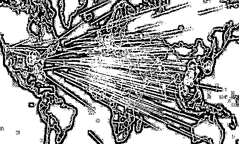

# 嗜血的「714 高炮」

> 原文：[`mp.weixin.qq.com/s?__biz=MzIyMDYwMTk0Mw==&mid=2247494905&idx=1&sn=573b27ebf07ef50d85288a94aff45c36&chksm=97cb27c1a0bcaed7c33742d3c6d364044efeaeea556d5ae2b71ad8e86531925864c6b5e9bc8e&scene=27#wechat_redirect`](http://mp.weixin.qq.com/s?__biz=MzIyMDYwMTk0Mw==&mid=2247494905&idx=1&sn=573b27ebf07ef50d85288a94aff45c36&chksm=97cb27c1a0bcaed7c33742d3c6d364044efeaeea556d5ae2b71ad8e86531925864c6b5e9bc8e&scene=27#wechat_redirect)

**点击上方蓝色字体免费订阅“灰产圈”**

导语

不知不觉中，用户的手机号码被捕获，然后用户接到机器人拨打的各种骚扰电话……在今年央视“3·15”晚会中，偷偷收集用户信息的“探针盒子”颇受关注，被认为是互联网技术发展中形成的一种“黑灰产”产品。

殊不知，探针盒子只是“黑灰产”的一部分。个人信息泄露、金融账号被破解、钓鱼网站诈骗、假冒 app 骗取信息……不法分子瞅准了互联网服务中的安全漏洞，设下一个个陷阱。

国家互联网应急中心在 2015 年就发起了重点打击的“黑产”专项行动，并对“黑产”范围进行界定，主要包括三类：

> **一是发动涉嫌拒绝服务式攻击的黑客团伙；**
> 
> **二是盗取个人信息和财产账号的盗号团伙；**
> 
> **三是针对金融、政府类网站的仿冒制作团伙。而业内人士指出，业界俗称的“黑灰产”更为广泛，只要是法律明文规定禁止的行为都可称为“黑产”，而“灰产”是游走在法律边缘、没有明确法律规定的“灰色产业”，其行为虽无明确的法律规章定性为违法犯罪，但对社会有明显危害。**

那么，“黑灰产”到底有哪些表现形式、又该如何防范呢？解放日报·上观新闻请教了和腾讯的相关安全专家，对目前的“黑灰产”进行了全面盘点。

要小心“钓鱼网站”，也要避免“主动违法”

安全专家认为，可以大致将网络“黑灰产”分为“技术类黑灰产”“黑账号类黑灰产”“非法交易交流平台”等三类。

从技术层面看，每一类都有不法分子利用技术构建了陷阱；从消费者自我保护看，除了要小心已经被曝光的“陷阱”，也要注意避免“主动违法”。

火眼金睛识别“技术类黑灰产”

安全专家指出，技术类黑灰产主要为中下游技术性不强的“黑灰产”从业人员制作并提供各类软、硬件设备和服务，木马植入、钓鱼网站、各类恶意软件等都是常见的“技术类黑灰产”。此次被央视曝光的探针盒子，也可以算“技术类黑灰产”的升级版产品。

目前，不少“技术类黑灰产”的表现形式已经被反复曝光，包括木马病毒、钓鱼网站等。从整体趋势看，近年来仿冒各大银行、运营商的钓鱼网站数量明显增加，用户需要对这类网站信息和链接提高警惕。不过，用户通过提高安全意识、安装安全软件、不随意点击不明来源的链接等，都可以有效防范这类陷阱。

但另一方面，类似探针盒子这样的“黑灰产”产品，用户很难感知到，目前的法律法规也没有对其进行限制。所以，需要通过顶层设计，尽早对此类产品的生产和使用进行约束。当然，随着探针盒子被曝光，各种安全研发者也会推出相应的应对措施，用户可以根据实际情况选用，提高自我防范能力。

避免被注册“黑账号”

《网络安全法》明确规定，使用互联网服务必须进行账号实名认证。但网络“黑灰产”的从业人员为达到隐藏身份、逃避打击目的，经常会利用他人身份信息或手机号码注册大量虚假网络“黑账号”，所以用户需要注意避免“被注册”。

在各种“黑账号”中，“虚假认证”往往来自用户的主动泄露。“虚假认证”是指认证的身份信息无效，或者认证身份信息归属人与实际认证操作人不统一。安全专家指出，目前线下出现大量购买获取身份信息的团伙，通过假冒商家送赠品等方式骗取公民身份信息材料。他们收集的身份信息包括但不限于身份证照、手持身份证照、手持当天当地报纸照等，收集的渠道主要为偏远地区农村、工厂或学校。用户如果“贪小利”而送上自己的身份信息，那么很可能因身份信息被贩卖而“后患无穷”。

不要涉足“恶意平台”

安全专家还指出，“恶意平台”直接服务于各类网络犯罪活动。网络“黑灰产”所运作的各类资源、工具以及犯罪手段、经验往往通过“恶意平台”进行交流、运转、交易。目前，恶意平台可分为三类：恶意网站、恶意论坛和恶意群组。

其中，恶意网站包括空包交易平台、刷单平台、接码平台、验证码打码、发卡平台等。以空包交易平台为例，所谓“空包”就是空快递包裹，是卖家为提高店铺信誉，联合刷手（刷单平台）进行虚假交易时，产生大量非真实的快递订单。

恶意论坛主要分为两类：一类是涉及非技术类经验交流类论坛与“网络赚钱”平台，另一类是涉及技术类的技术交流与工具贩卖类平台。在恶意论坛中，内容发布者一般是“黑灰产”产业链的上游人员。

据阿里安全归零实验室统计，2018 年活跃的专业技术“黑灰产”平台多达数百个，它们的“专业化”服务使得“黑灰产”犯罪技术更加平民化，不少普通人以为通过平台交流能在线赚钱，却不知已被不法分子利用。

这就说明，用户如果想抵制“黑灰产”，除了要保护个人信息外，也要对那些看上去可以赚钱的“黑灰产”交流平台说“不”。

男性当心“情感诈骗”，女性提防“低投入高回报”

腾讯安全专家根据具体案例分析了目前“黑灰产”中的常见陷阱。

首先是诈骗案列。“腾讯 110” （110.qq.com）是腾讯面向网络黑产、诈骗等违法违规行为的举报、打击一体化平台，目前已与多地警方合作，配合警方对犯罪团伙进行线下打击。

该平台对 2018 年全年受理的 1247 万次用户举报大数据深入剖析和侦查后发现，防范电信诈骗仍旧迫在眉睫——2018 年平台收集的电信网络案件同比上升 37%，其中网络诈骗占比高达 72%。在各种网络诈骗中，交易诈骗、交友诈骗与兼职诈骗数量位列前三，其中交易诈骗以 52%的占比位居榜首。

数据还显示，诈骗团伙会根据不同目标群体实施差异化的诈骗。总体来看，受骗人数中男性是女性的两倍以上。男性更容易受到情感类、金融类诈骗；女性更容易被“低投入高回报”的手段蒙骗，因“兼职”、“免费送”等手段遭到个人财产和隐私信息的损失。

此外，青年学生、“宝妈”和单身男性群体由于防范意识相对薄弱，更容易落入盗号、兼职诈骗和交友诈骗的陷阱。由于此类诈骗手法简单，套路容易被识破，受骗金额一般在千元范围内。与之相反，阅历较丰富的中老年群体防范意识更强，受骗人数较少，但一经受骗往往金额巨大。

再看诈骗手法，一些互联网行业的新名词、新技术也被不法分子所利用，变成诈骗工具。

例如，借助“共享经济”这一热门概念，部分诈骗团伙以“低投入高回报”的“共享经济”为旗号，诱骗受害者出钱投资，当用户发现投资后并没有获得允诺的收益回报时，才发现 已经深陷骗局。

再比如，“渣男返利”手法也登上新型诈骗手法前三位——骗子借报复渣男为缘由，面向“好友”发起“痛骂渣男，转我一元，十倍返还”的游戏，利用用户贪图小利的心理，持续诱骗钱财。

此外，诈骗分子还会通过“低价利诱”的方式骗取用户账号和语音内容，制作“是我是我”等证明身份的语音信息发给用户的亲友，使诈骗信息更“可信”。

其次是 app 类诈骗。来自腾讯手机管家的安全专家发现，金融理财 app 的安全隐患不小，一些借款贷款、银行、投资理财、股票基金和记账类软件存在病毒感染、恶意仿冒和窃取隐私现象。

具体来看，用户在使用金融理财类 app 完成转账、买卖基金/股票时，一些不法分子会趁机在这些 app 内植入木马病毒。腾讯手机管家统计发现，银行类 app 病毒感染比例最高，达 48.86%；其次是基金股票和投资理财，比例分别是 20.25%和 14.35%。在感染了木马病毒的金融理财类软件中，41.77%会盗取用户隐私信息，12.24%会肆意推广流氓软件，11.39%会推销虚假贷款信息。

安全专家指出，用户手机感染木马病毒的最主要原因是误装了仿冒 app。这些仿冒 app 与正规 app 的名称和 logo 相似，用户很难区分，极易上当受骗。据统计，全国 393 万用户的手机里装有仿冒软件。安全专家因此建议，用户在下载金融理财类 app 时务必通过正规渠道，以免手机感染木马病毒或者误装仿冒软件；同时可以使用手机安全软件进行病毒查杀。

此外，用户需要提防投资理财类 app 获取过多权限的问题。据统计，金融理财 app 是获取权限最多的 app 类型，平均获取 17.2 项手机权限。在各项权限中，理财类 app 获取“读取存储设备”和“应用列表”最多，分别为 94.9%和 93.2%。用户的姓名、手机号和身份证等信息被无故获取后，会增加被贩卖给不法分子的风险，继而由不法分子展开骚扰和诈骗活动。

安全专家为此建议，用户不要随意给手机 app 授权隐私权限、不随便向陌生人泄露自己的身份信息。

小心！这些是“黑灰产”的新趋势

安全专家认为，互联网行业“黑灰产”犯罪形式多样，有的是诱骗消费者，有的则与敲诈勒索有关，涉嫌欺行霸市。对消费者来说，既要保护自己，也要避免被人利用。

从保护自己的角度看，首先不要被“天下掉馅饼”等信息迷惑。以手机“代理退款”为例，一些不法分子通过电商平台发布服务信息称，能帮助客户取回购买游戏装备所花的费用，用户还能保留游戏中的已购装备；用户只要得支付取回费用三四成的手续费。

可安全专家调查发现，在这条以收取报酬进行恶意退款的灰色产业链中，存在多个安全隐患，包括隐私被泄露、银行卡被盗刷、手机被锁屏需付费解锁等。

同时，要注意一些“老套”的骗局仍旧很活跃，包括冒充公检法、领导、客服退款、兼职刷单、航空公司机票退改签等诈骗。这类骗局被曝光多次，但实际生活中仍旧有很多用户上当受骗。

结尾

腾讯安全专家则分析了 2019 年网络诈骗的新趋势，认为用户要提防短视频、二手交易等第三方平台上的相关信息，因为不法分子正利用这些平台传播快、触达广的特性进行宣传，再诱骗用户到社交平台沟通而实施诈骗，实现跨平台作案。短视频、二手交易平台已经成为不法分子引流的新工具，跨平台交易又为消费者取证维权增加了难度。

从网络欺诈形式看，也呈现出跨境化、多样化和年轻化的三大特点。

其中，“跨境化”是指不法分子逐渐向境外转移，具有团伙化、地域化特征，兼职诈骗体现尤其明显。境外作案不但隐蔽，而且由于跨境作案，国内警方无法直接干预，需与当地警方耗费大量时间侦查，抓捕难度直线上升。所以，用户对涉及境外的电话、网站、“老熟人”信息等要留个心眼。

“多样化”是指不法分子为骗取钱财，已经不局限于从个人账户收款提现这一方式了，而是发展成由受害人代付游戏点卡、代充值虚拟平台币等多样化的收款方式，既降低不法分子的风险，又能够迅速地通过寄售洗钱。

最后，不法分子诈骗对象越来越年轻化，特别是未成年人群体。由于未成年人自我保护意识不够且缺少社会阅历，被低价利诱诈骗成功率高。数据也显示，每年寒暑假都是未成年人被骗的高发时期。由此可见，未成年人是急需保护的群体，需要家庭增强防范网络“黑灰产”教育。

← 向右滑动与灰产圈互动交流 →

**阅读原文加入灰产圈高端社群**