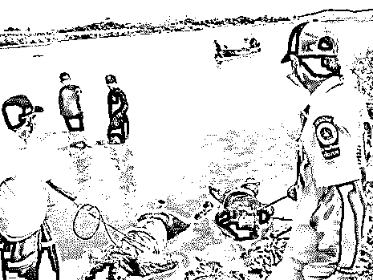
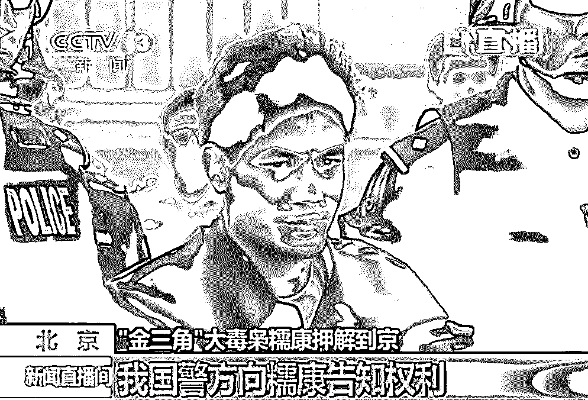

# 我国大使馆警告：残杀多名我国公民，虐待 50 万奴隶！却还有 1000 万国人要去

> 原文：[`mp.weixin.qq.com/s?__biz=MzIyMDYwMTk0Mw==&mid=2247494570&idx=1&sn=e60fa1caf925ea7b0c9adf15835452fb&chksm=97cb2092a0bca984a889d7177e4c96a74c6b7331481b79c9ab8e77d0178c55ab529b9ba82c4c&scene=27#wechat_redirect`](http://mp.weixin.qq.com/s?__biz=MzIyMDYwMTk0Mw==&mid=2247494570&idx=1&sn=e60fa1caf925ea7b0c9adf15835452fb&chksm=97cb2092a0bca984a889d7177e4c96a74c6b7331481b79c9ab8e77d0178c55ab529b9ba82c4c&scene=27#wechat_redirect)

点击上方“灰产圈”关注我们~

导语

一直以来，在东南亚一带都流传着各种各样的都市传说。

**这个，你可能也听过，叫“试衣间的暗门”。**

有很多个版本，说的是一对新婚夫妇出国度蜜月。妻子进店里试衣服，丈夫在试衣间外等候。

可是妻子进去后，就犹如人间蒸发了，再也没有出来。

伤心的丈夫一直坚持不懈地寻找妻子，却一无所获。

多年后，丈夫偶然间来到泰国，观看了一场“畸形秀”表演。

他看到一个肮脏生锈的铁笼里，有一位手脚都被切断的女人。

她扭曲地趴在地上，因为舌头被拔掉了，不断发出奇怪的呻吟声。

突然间，这位丈夫惊恐地发出尖叫声。

因为他从那毫无人样的女人脸上，见到了和妻子一样的胎记！

这个没有了四肢和舌头的人，正是他失踪多年的妻子......

虽然这个故事的真实性还有待查证，但泰国这个国家的危险性，却是有目共睹的。

**“有时你因生活在自己美好的小圈子里太久了，根本不知道世界是什么样的**。**”**

一**“微笑国度”，却是全球最危险旅行目的地！**

说起泰国，印象中，这是一个为旅游业而生的国家。

在很多国人的心目中，它风景秀丽、宁静祥和，甚至有一种文艺小清新范儿。

关键是，对很多中国人来说，它性价比高啊！

所以 2018 年，去泰国的中国游客数量又刷新记录了：

达到 1050 万人次，上涨了 7%！

可见中国人对泰国旅游的喜爱程度。

即便去年，普吉岛沉船事件刷屏了全网，依然挡不住大伙的热情。

然而，这个国家，并没有你想象的那么美好！

**光鲜表面的背后，是让你难以想象的黑暗。**

每隔一段时间，就有游客在泰国出事死亡。

据统计，每年因为各种意外事故死在泰国的外国人不下 3000 人！

最近，中国驻泰国大使馆站出来了！

提醒中国游客，来了泰国：

**千万要注意安全！！！**

**切记切记！**

不只是中国人认为泰国危险，几乎全世界的游客都在吐槽泰国危险。

**在英国恩兹利保险公司编制的全球 10 个旅游最危险国家排行榜中，最危险的是泰国！**

无独有偶，早在 2017 年 12 月，世界经济论坛（WEF）就将泰国列入全球旅游最危险的 20 个国家之一。

连澳洲外交部也出来“站队”，称它是“高危旅行地”！

澳洲外交部提供的数据显示，仅在过去的 12 个月里，共有 238 名澳洲游客死于泰国！这个国家旅游安全指数极低！

澳洲政府甚至直接把泰国部分城市拉黑，呼吁澳洲人千万别去！

其中包括：也拉、北大年府、陶公府、宋卡府这些城市。

一名澳洲的记者甚至专门写了一本《泰国：夺命终点》，向大家揭露“微笑国度”暗藏的许多阴暗面！

这个国家，远比你想的更危险！

二**奴隶、人体器官的超级市场，暗网横行**

2016 年，美国新闻界的最高奖项普利策奖，颁给了美联社的四名女记者。

他们冒着生命危险，持续数月在泰国等地进行实地追踪调查，揭开了泰国最丑恶的真相：**现代奴隶！**

在印尼有一个叫班吉纳(Benjina)的小岛渔村，记者们在那里发现了一大批像奴隶一样被囚禁的渔奴……

他们有的是被黑中介诱骗来，有的是被直接绑架来的。

每天长时间工作，稍作休息便会遭来船长的毒打

有的工人因为动作太慢被杀，其他人负责抛尸海中。

这些奴隶每天只能得到一点点米饭，渴了只能喝点脏水，从渔船上下来就会被送进这样的牢笼里……

在这种身心都受到折磨的情况下，不少绝望的受害者只能选择自杀。

这篇新闻，震惊了全球！

多亏了这些记者，2000 多名奴隶从各个岛屿和工厂里被解救出来……

一名劳工时隔 22 年后与家人团聚时的场景，令人动容：

有个逃出来的渔奴说：这海底下，渔奴的尸体多得能堆砌成一座小岛……

这些死去的渔奴中，很多原本只是开开心心来泰国旅行的游客，却再也没能踏上回家的路。

**泰国光鲜的旅游业背后，是触目惊心的人肉集市。**

据国际劳工组织统计，这里是东南亚最大的奴隶市场，包括性奴、渔奴等！

人数更是达到了惊人的 50 万！

这些人，往往都是来泰的游客或是被诱骗至此的外国人。

中国女孩 Y 就被拐到了泰国夜总会，后来在中国使馆的帮助下，回到了云南。

2015 年，泰国警方在宋卡府发现埋了几十具尸体的乱坟堆：

这些人都是被人贩子残酷杀害的。

甚至，连泰国军方官员也参与其中：

曾经，有一位资深的泰国人贩子这样说里面的经济利益：

卖一个成人的均价大约是 2000 美元。但每卖一单，人贩子才挣 320 美元，因为大头让泰国皇家海军、泰国海警抽走了。

前阵子刷屏的暗网，大家应该都很熟悉了。

**在泰国，毒品、奴隶、杀人、卖淫、枪支、人体器官等各种超过人性底线的肮脏犯罪，应有尽有****。**

所以靠着人口贩卖为主营业务的暗网势力，都扎根在泰国，比如 2017 年被美国警方捣毁的全球最大暗网交易平台 Alphabay。

据《人皮客栈》的导演透露：

在泰国的暗网空间，只要支付 1 万美元，就能换来一支装满子弹的枪。

更恐怖的是，还可以买到一个自愿被你随意宰杀的人。

这些人大多穷困潦倒，为了维持家中生计而主动赴死。

这个耸人听闻的事件，后来被改编成恐怖片《人皮客栈》。

**泰国还有一个半公开化的器官黑市。**

很多东南亚其他国家的人，来到泰国贩卖自己的器官。

这些是来泰国贩卖自己肾脏的柬埔寨人：

美国国务院把泰国列入全球人口贩卖最猖獗国家和地区名单，评级最低。

三**泰国军方腐败涉黑，13 名无辜中国同胞遇难！**

泰国是一个毒品泛滥成灾的国家，尤其是冰毒。

关于泰国贩毒事件，最为中国人所知的，就是湄公河案件。

2011 年 10 月 5 日，两艘中国商船“华平号”和“玉兴 8 号” ，在湄公河金三角水域遭袭，13 名中国船员全部遇难！

所有船员双手被反绑，蒙眼、蒙嘴，身上布满枪眼和刀伤，手段极其凶残、泯灭人性！

湄公河一名参与尸体打捞工作的船员回忆道：“很多人身上被打了两三枪，几乎每一枪都是致命的，头部、胸部、颈部都有枪眼，如果仅仅是为了杀人夺命，那没必要开这么多枪。”（《三联生活周刊》）

一开始，大家都以为，他们是因为“贩毒”遇害。

因为在船上，搜出了 91.8 万颗冰毒。

然而，后来中国警察经过调查发现，这些船员其实都是老实本分的商人！

这起惨案的幕后黑手，是当地贩毒集团头领——糯康！

**之所以对中国船员下此狠手，皆因为他对中国人的仇视。**

因为只有中国船只拒绝向糯康交保护费；中国政府大力推进“替代种植”项目，很多当地农民弃种罂粟，糯康认为替代种植让自己的毒品生意釜底抽薪；一名中国商人在老挝兴建金木棉赌场，极大冲击了糯康旗下天堂赌场的生意。

于是，糯康联合泰国 9 名军人行凶。

他们先绑架了中国船员，然后把毒品放上去，嫁祸中国船员，最后对两艘中国大船密集射击。

最终，13 名无辜中国同胞惨死。

惨案发生之后，中国警方投入大量人力，展开了对糯康集团的抓捕。

这并不是一件容易的事。

在抓捕的过程中，英勇的战士柯占军不幸牺牲。

2012 年 4 月 25 日，中国警方在老挝抓获糯康，终于替屈死的中国商人和因公殉职的柯占军报了仇。

后来，这个事件被改编成了电影《湄公河行动》，票房一度领跑。

但这部电影在泰国被禁映，因为泰国总理认为，这部电影有损泰国国家形象。

更奇葩的是，中国要求处理的管理那片水域的 Prakarn Chonlayuth 将军，非但没有被判刑，反而升为了 3 星上将。

在泰国，军方代表着最高权力，堪称“国中之国”。

甚至可以控制政府，一旦军方对政府不满意，他们就会发动政变。

**而泰国军方，一向以腐败和经营涉黑生意著称。**

当最高权力都和毒贩、人贩子、黑帮势力勾结时，可想而知，泰国有多黑暗！

四**夺命项目无安全保障，无数游客遇难！**

和欧美这些发达国家不同，泰国的旅游业从业者极端缺乏安全意识。

很多刺激的娱乐项目，实际上是夺命项目！一旦丧命，受害人获得的赔偿非常少！

**夺命拖伞**

澳洲著名富豪 Roger John Hussey 就是在这丢命的。

2017 年 3 月，Roger 到泰国玩水上降落伞。

一名没有穿任何安全装备的工作人员跟着他助跑，随后起飞。

可是，他刚升到 100 英尺的高空，就突然毫无征兆地坠入了大海，最终抢救无效死亡。

这一幕，全程被他的妻子拍下来了。

这个项目出事的中国游客也不少。

而就在一个月前，同一个沙滩附近，20 岁的澳洲女孩 Emily Jane Colline 驾驶摩托艇时，摩托车却突然失控。

她和男友的快艇猛烈相撞，在巨大的冲击力下，她被甩进了海里，当场就失去了意识，最后不治身亡。

这样的安全隐患，在泰国比比皆是。

**死亡飞跃**

丛林飞跃这样的项目，在中国重庆、美国、欧洲都有，却没有一个像泰国这么不规范的。

2016 年，来自中国安徽的女游客，根据教练要求与以色列籍女性绑在一起同时滑行。

由于两人重量过大、速度太快，对面的教练在本应该接住两人时却躲开了，导致两人直接撞到树上。

一声惨叫后，中国女游客当场去世。事后，家属只得到 5 万多人民币赔偿。

中国游客喜欢的骑大象和蟒蛇表演，更是事故频发。

甚至之前困住 13 名足球队员的危险洞穴，泰国的旅游部门还在谋划，把这个危险的洞穴开发成一个旅游景点，供游客参观……

**夺命游船和快艇**

游船死亡就更不必说，去年的普吉岛沉船事故，47 名中国同胞遇难，是泰国近年来最大的事故。

明明是游船安全措施不足，却甩锅“中国人害中国人”。为什么？

因为泰方从不吸取教训，看看最近几年的事故，还少吗？

2018 年 1 月，因为快艇漏油，一艘载有 27 名中国游客的快艇在前往皮皮岛途中突然爆炸。

5 人重伤，一人死亡！

2016 年，两艘载有 60 名中国游客的快艇泰国甲米府皮皮岛附近追尾相撞。

造成一男一女 2 位中国游客死亡，34 人不同程度受伤。

类似的事故还有很多很多！

夺命“海底漫步”

“海底漫步”，听起来很浪漫的一项活动，号称去了泰国必体验！

但据网友们反应，戴在头上的玻璃罩子非常容易进水，要是游客在海底漫步时低头或是仰头，都有可能让海水灌进氧气头盔中，

而且居然会突然停止供氧！

这个娱乐项目，安全隐患极大，之前出过多次事故！

2017 年，一名中国女游客在“海底漫步”时不幸溺亡。

2015 年 3 月 6 日，印度妇产科医生苏肯杜·坤杜在“海底漫步”时溺亡。

五**交通混乱，世界第一交通事故大国！**

前几天，就在 1 月 17 日，又有一名中国游客在泰国遭遇车祸而死。

而就在上个月，51 岁暨大教授庄礼伟也在泰国被一辆面包车撞伤，当场去世。

毫不夸张的说，中国人去国外玩，最容易遭遇车祸的国家就是泰国了！

作为东南亚国家中路面交通危险指数第一的国家，泰国是名至实归的“世界第一交通事故大国”。

曾经连续两个月，发生载着中国游客的车辆出现刹车失灵，导致车祸的事件。

2017 年 7 月 10 日，普吉芭东一载有 25 名中国游客的大巴，刹车失灵导致侧翻，当时大巴“几乎整个儿横飞了出去”。

20 多人受伤，2 名中国游客死亡，其中一个是 10 岁的孩子。

2017 年 8 月 6 日，泰国普吉岛一载 31 名中国游客大巴，刹车失灵导致失控翻车，5 人受伤。

**走路被撞、坐旅游大巴车祸，骑车更容易出事！**

去年 6 月，一位香港同胞及其女伴在泰国南邦大象保护中心附近骑车时，被汽车撞上，两人均不幸离世！

而就在两个月前，同样的悲剧也发生在一位澳洲游客身上，他在泰国骑电瓶车遇车祸，昏迷两周后离世。

都说，泰国人什么都“从容不迫”，唯有开车是雷厉风行争先恐后，可怕的是，他们还爱酒驾。

最可怕的是泼水节的时候，那时候在泰国路上最危险！

到底有多危险？看图说话！

六**“世界最不靠谱警察，在泰国街头”**

不知大家是否知道，泰国警察是世界出了名的爱敲诈，无论是对中国游客，还是其他国家的游客！

2015 年圣诞节前夜，澳洲记者纽鲍尔在泰国曼谷一家酒吧，被 6 名当地警察栽赃购买毒品，实际上那包毒品是警察自己带来的。

他们威胁纽鲍尔，只要支付 1.52 万美元现金就能立刻被释放，但纽鲍尔没有屈服。

于是他进了警局。

在警局，他遭到一系列凌辱，尿检被一名守卫大肆嘲笑，整宿没有睡觉、被带到一个灯光刺眼的房间与自己的尿液样本“合影”。

直到第二天早上 8 点被释放，纽鲍尔始终没有得到任何解释。

重获自由后，他联系泰国警方、泰国旅游局投诉，均回复：泰国政府和泰国皇家警察绝不会骚扰、绑架、威胁、拘留外国游客或对其进行毒品测试。

这种事，中国人也遇到不少。

**腐败已成为泰国体制的一部分，这一点都不夸张。**

中国人最直接的感受，就是泰国海关收小费问题。

普吉岛机场办理落地签时，工作人员竟然直接用计算器打出小费数额。

就事论事，我并不是要黑这个国家。

**只是想告诉你，在文明世界之外，还有你不知道的另一面。**

你之所以看不见黑暗，是因为有人竭尽全力把黑暗挡在你看不见的地方。

这个人，就是我们的祖国！

说到底，出门在外，安全第一。自己的安全需要自己负责。

最后，遇到危险，不要犹豫，求助祖国驻泰国大使馆！

文章来源：Dailymail、凤凰 Weekly、X 博士、新闻哥等，版权归原作者所有。

●[深度揭秘 | <em>菲</em><em>律</em><em>宾</em>网络博彩：专坑国人的赌局！](http://mp.weixin.qq.com/s?__biz=MzIyMDYwMTk0Mw==&mid=2247493920&idx=2&sn=bc1df12d46cbd070a27aa6987ef07b0c&chksm=97cb2218a0bcab0e074375d5d5b4264fbc222ae48843bb23ec7348dcc8d9777725a5d6fe4925&scene=21#wechat_redirect)

●[深度调查<em>菲</em><em>律</em><em>宾</em>博彩：记者暗访，假扮美女，专坑国人，员工自称“东方监狱”！](http://mp.weixin.qq.com/s?__biz=MzIyMDYwMTk0Mw==&mid=2247492930&idx=1&sn=866796a9018f69208c275f79c3e907b5&chksm=97cb2e7aa0bca76c00d92fa5282c30fb8e08520cf237ea792be05ff3ac8caaaedff934720afb&scene=21#wechat_redirect)

●[深度长文|告诉你一个真实的<em>菲</em><em>律</em><em>宾</em>！庄家泛滥，骗局重重，暗黑无界！](http://mp.weixin.qq.com/s?__biz=MzIyMDYwMTk0Mw==&mid=2247492193&idx=1&sn=dbac99024c73a37e133bb18fab3f090b&chksm=97cb2959a0bca04f3b1755e702e1b453de836b28afb59a456100f0e4028cf031eedd1485d6f1&scene=21#wechat_redirect)

●[无法想象的黑<em>色</em>产业，30 分钟就能让女孩上门服务](http://mp.weixin.qq.com/s?__biz=MzIyMDYwMTk0Mw==&mid=2247491070&idx=2&sn=7ae6edd85096751e6ce5dacc708e9224&chksm=97c8d6c6a0bf5fd0b0c4b19697a693a18526392d6d3eacbdbad8953285507dd3e6042c7df2eb&scene=21#wechat_redirect)

   

**点击加入 ****灰产圈 | 高端社群**