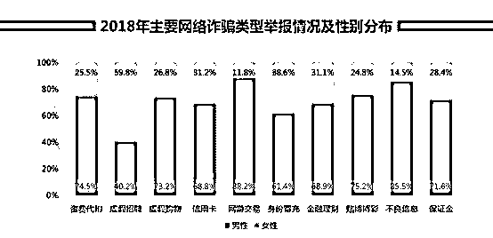
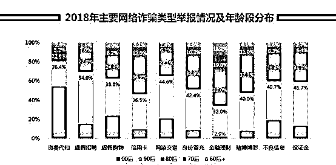
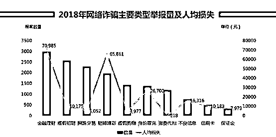
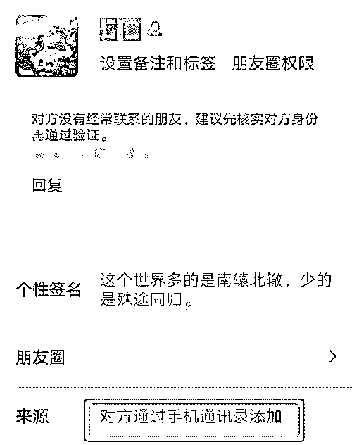
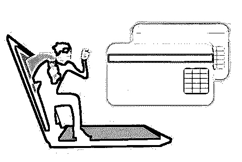
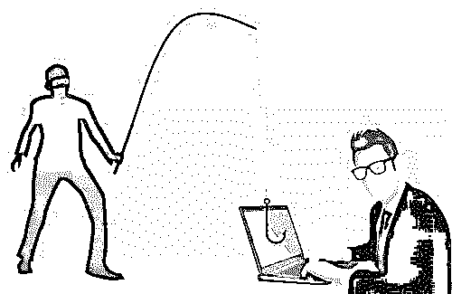
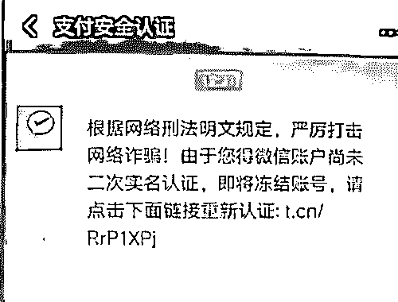

# 《2018 年网络诈骗趋势研究报告》

> 原文：[`mp.weixin.qq.com/s?__biz=MzIyMDYwMTk0Mw==&mid=2247494414&idx=1&sn=5abeb7bb13a0089362dbf82f64681c52&chksm=97cb2036a0bca92067179e65adea4a8c00c6b994013a517dee8acd5e80446c2f07643e9cf353&scene=27#wechat_redirect`](http://mp.weixin.qq.com/s?__biz=MzIyMDYwMTk0Mw==&mid=2247494414&idx=1&sn=5abeb7bb13a0089362dbf82f64681c52&chksm=97cb2036a0bca92067179e65adea4a8c00c6b994013a517dee8acd5e80446c2f07643e9cf353&scene=27#wechat_redirect)

**点击上方蓝色字体“灰产圈”关注并置顶本公众号**

导语

什么最容易骗倒男人、女人？谁杀掉了“60 后的退休生活”？哪类职业人群最易被骗？

1 月 15 日，360“安全大脑”、360 猎网平台发布《2018 年网络诈骗趋势研究报告》（以下简称《报告》），对最近五年的网络诈骗进行大数据分析。

《报告》显示

2018 年网络诈骗人均损失 24476 元，创下近五年新高； 60 后受害者人均损失最大，为 67985 元；而 00 后正在快速成为网络诈骗的“新目标”。

60 后被骗得最惨，骗子更懂你爸妈

透过大数据，《报告》发现了两个不乐观的信号：

一是网络诈骗人均损失 24476 元，创下近五年新高；

二是 00 后正在快速成为网络诈骗的“新目标”。

此外，《报告》还通过“数据画像”，揭示了不同年龄段、不同性别的受害者的“受害特征”。

从受害者性别上看，除了虚假招聘诈骗中女性为主要受害者（女性占比近 6 成）外，其余类型均以男性为主要受害者，其中以网游交易最为严重，男性占比近 9 成，这与网游受众多为男性有关。

从年龄上看，00 后在资费代扣诈骗中占比最高，超过半数；

资费代扣诈骗主要是指用户因被诱导点击了恶意链接、下载了恶意软件等原因导致的恶意扣费情况。

00 后群体网龄较短，网络安全意识相对淡薄，警惕性低，更容易受此类网络诈骗伤害。

90 后最易遭受虚假招聘（54.0%）、保证金（45.7%）、网游交易（44.6%）诈骗。

结合“2018 年主要网络诈骗类型举报情况及性别分布”数据可知，90 后女性是“虚假招聘”的“最易感人群”。

80 后最易遭受赌博博彩（37.3%）、信用卡（36.9%）、身份冒充（33.9%）诈骗。

70 后、60 后+（1960 年及之前出生人群）最易遭受金融理财诈骗。实际上，在 2018 年，金融理财诈骗已成为“网络诈骗之王”，不仅是举报数量最多的网络诈骗，也是人均损失最严重的网络诈骗，高达 70985 元。

这直接拉高了 70 后、60 后人均损失。

数据显示， 60 后受害者人均损失最大，为 67985 元；

70 后受害者次之，为 42086 元。报告认为，60 后群体闲置资金较多、理财需求较高，面对诈骗分子“投其所好”的蛊惑难免中招，一旦深陷骗局便损失惨重。

从受害者职业上看，在校学生占比最高，超过四成，其次为制造业人群，占比 24%。

“‘受害特征’体现了网络诈骗的复杂性与多样性。为了更精准、高效的实施诈骗，诈骗分子往往看人下菜碟”，

据猎网平台专家指出：“网络诈骗就在身边，各年龄段、各性别人群都可能被无缝不入的诈骗分子下套，须提高防范意识。”

从“跑男”到“吃鸡”，钓鱼网站跟风“进化”

钓鱼网站是网络诈骗的主要工具，诈骗分子通常以伪装成正规网站的钓鱼网站为饵，诱骗受害者上当。

《报告》显示，从 2014 年至 2018 年钓鱼网站模仿对象 Top10 的情况来看，综艺类电视节目曾经深受诈骗分子“青睐”，2014 年、2016 年《奔跑吧兄弟》均上榜，《中国好声音》在 2015 年上榜。

这些综艺节目收视率高，有较大规模的群众基础，诈骗分子更容易“借题发挥”，利用群众的侥幸心理和对节目的信任实施诈骗。

在这类诈骗中，通常骗子会以网络短消息或“伪基站”群发短信方式告知对方抽中“场外幸运观众奖”、“幸运用户”，再一步步诱骗受害人缴纳所谓的风险保证金、个税等。

不过，进入 2017 年，模仿热门网络游戏的钓鱼网站成为诈骗分子“新宠”。2017 年，腾讯游戏 DNF 首次出现在钓鱼网站模仿对象的 Top10 榜单中。

2018 年，除了 DNF 外，腾讯游戏绝地求生也上榜。此外，具备游戏币充值功能的腾讯充值中心和主打虚拟物品交易的 5173 也上榜了。

从 2018 年猎网接到的举报数据看，网游交易类诈骗共有 2297 起，为第三大类网络诈骗。在网游交易类诈骗中，骗子的骗术五花八门，包括虚假充值、虚假代练、盗号等。《报告》评选的“2018 年十大网络诈骗经典话术”，就介绍了“低价出售游戏币”的骗局。

除了“全民吃鸡”的网络游戏被钓鱼网站模仿外，中国“新四大发明”之一的移动支付也未能幸免。《报告》显示，支付宝在 2017 年、2018 年连续出现在“钓鱼网站模仿对象的 Top10”中，而模仿银行的钓鱼网站呈整体数量下滑趋势。

据悉，钓鱼网站的“蹭热点”趋势，反映的是诈骗分子的作案逻辑：蹭热点既能吸引更多人关注，也能为诈骗分子提供“掩护”，令受害者放松警惕。

三成受害者怀疑多次仍被骗，网络诈骗瞄准“人性弱点”

大概没人觉得自己容易上当受骗，但现实却是残酷的 

《报告》对受害者的问卷调查显示，在被骗前，超过九成的受害人对网络诈骗有过了解，仅有不到一成的受害者从未听过网络诈骗。

而在受骗的过程中，有一半人怀疑过，近三成受害人怀疑过多次。这从侧面可以反映出网络诈骗骗术“高明”，令受害人难以判别。

《报告》在“网络诈骗发展现状与特点”一章就指出：

骗子善用人性弱点行骗，通过交友实施的诈骗便属此类。

诈骗分子先以交友为名，通过网络结识，建立友谊或者爱情关系后，再诱导受害人到钓鱼网站赌博、理财，制造获利假象。

在爱情、金钱的双重催眠下，受害人入戏渐深，就会付出更大的代价，被骗取大量的钱财。

除此之外，被《报告》评选为“年度最具影响网络诈骗”的“卖茶女诈骗”，也正是利用“交友”手段行骗。

据悉，诈骗分子往往伪装成美女在社交平台加好友，与受害人套近乎、聊天和谈心，再以帮忙打理外公在福建武夷山茶庄为由，撒娇或者以外公病重博取同情，要求对方购买茶叶。

猎网平台专家对我们表示，这类诈骗是建立在网络社交建立的信任之上的，受害者一旦感情用事，就会“当局之谜”，被诈骗分子利用。

从数据上看，具备网络交友功能的社交平台也成为诈骗分子最主要的“作案现场”。

《报告》显示，参与问卷调查的受害者中，有近六成是看到骗子发布的信息后主动联系对方，约四成是骗子主动联系的受害者。

其中，骗子主动联系受害者的方式中，社交平台（QQ、微信等）最受骗子青睐，比例超四成。

在受害人被动接触诈骗信息的途径中，社交平台也是主要途径，占比超五成。有超过六成的受骗者通过社交媒体转账给骗子。

新年将至莫放松，小心“蹭年味”诈骗将迎高发期

春节日渐临近，《报告》也向网民发布了防骗提醒：春节前后，蹭“年味”的网络诈骗将迎高发期。

根据 360 猎网平台历年春节期间接到的举报来看，订机票诈骗、红包骗局、信用卡提额诈骗是这一时期最高发的网络诈骗。

其中，订机票诈骗主要利用“特价机票”、“便宜机票”为诱饵，诱导消费者在钓鱼网站购买“假机票”，也有诈骗分子以“退改签”为由，诱骗消费者一步步落入圈套。红包诈骗则以“诱导分享”居多，其中还会让用户填写个人信息，并进一步借此实施诈骗。

除了订机票诈骗、红包诈骗外，以“信用卡提额”为幌子的诈骗也需提高警惕。因为每逢年末都是信用卡调整授信额度的时候，骗子见缝插针，以“提额”为幌子行骗。

诈骗分子往往会以十分官方的语气，通过短信形式提示“信用卡提额”，并附上钓鱼网址链接。一旦用户中招就会泄露银行卡号、身份证号、验证码等重要信息，导致财产损失。

此外，就在近期，猎网平台还接到以“售卖抢红包软件”为名的网络诈骗。据用户举报称：其轻信骗子宣传，花费 600 余元购买了抢红包软件，但下载后又被索要上千元的激活费，但其付款后依然无法使用该软件，这才意识到是骗局。

新年将至莫放松，小心这些诈骗

春节日渐临近，《报告》也向网民发布了防骗提醒：春节前后，蹭“年味”的网络诈骗将迎高发期。

订机票诈骗、红包骗局、信用卡提额诈骗是这一时期最高发的网络诈骗

一订机票诈骗

主要利用“特价机票”、“便宜机票”为诱饵，诱导消费者在钓鱼网站购买“假机票”，也有诈骗分子以“退改签”为由，诱骗消费者一步步落入圈套。

二红包诈骗

则以“诱导分享”居多，其中还会让用户填写个人信息，并进一步借此实施诈骗。

三以“信用卡提额”为幌子的诈骗

每逢年末都是信用卡调整授信额度的时候，骗子见缝插针，以“提额”为幌子行骗。诈骗分子往往会以十分官方的语气，通过短信形式提示“信用卡提额”，并附上钓鱼网址链接。一旦用户中招就会泄露银行卡号、身份证号、验证码等重要信息，导致财产损失。

2018 年十大网络诈骗经典骗术

一话术一：“明天来我办公室一趟”

　你是否接到过这样的电话，“XXX，明天来我办公室一趟”。对方甚至可以叫得出你的名字或姓氏，但我们又不知道他是谁。如果询问他是谁，他会严肃地责备你，“领导的声音都听不出来?”遇到这种电话要小心了，这多半是骗子冒充成领导进行诈骗。

二话术二：“外公家的茶叶滞销了，可以帮忙买一点吗?”

　跟你聊了很久的美女突然可怜兮兮地对你这么说，你还忍心拒绝吗?这一招正是骗子的“美人计”。这一经典话术出自风靡各大社交平台的“卖茶女”类诈骗。诈骗分子往往伪装成美女在社交平台加好友，与受害人套近乎、聊天和谈心，再以帮忙打理外公在福建武夷山茶庄为由，撒娇或者以外公病重博取同情，要求对方购买茶叶。

三话术三:“看到通讯录好友推荐，以为是熟人就加了”

　　话术三:“看到通讯录好友推荐，以为是熟人就加了”

你在使用微信或者其他社交类软件时，是否遇到有人添加你为好友，请求显示：“来自通讯录好友”的情况呢?当心这可能是今年特别流行的“交友诈骗”。由于很多人的社交平台账号是与手机号码绑定的。利用这一点，诈骗分子会事先“搜集”手机号，先存在自己的手机通讯录里，然后通过微信的“添加朋友”选择“手机联系人”。这样就可以造成“对方通过手机通讯录添加”的假象。

　　诈骗分子往往伪装成“美女”，在添加完好友后，又会以“看到通讯录好友推荐，以为是熟人就加了，看来是我存错朋友号码存成你的了”为说辞，打消对方疑虑。之后还会以“缘分”为由继续交往，获取你的信任，再进行诈骗。

四话术四:“你的快递丢了，我们将进行双倍赔偿”

　终于等到电商促销清空了购物车，却被告知“快递丢失”，但好在可以“双倍赔偿”。别高兴太早，遇到这种情况一定要去电商官网求证，当心诈骗分子冒充客服、快递公司骗你登录钓鱼网站，盗走你的账号信息。

五　话术五：“免费提供长期贷款，无担保”

　谁都有手头紧的时候，但天上可不会掉馅饼。遇到有人向你推荐无担保贷款要小心了，诈骗分子会声称贷款必须先付保证金或者部分利息，并要求你自己办理一张银行卡，先打一笔“企业验资款”到账户上，证明你的还款能力，然后开通电话查询功能供他查询。而实际上诈骗分子利用新办银行卡的初始密码就会把你的钱转走了。

六话术六：“您的银行账户涉嫌洗钱”

   电话那头，伪装成公检法、运营商人员的诈骗分子先拿你涉嫌“洗钱”、“发送诈骗信息”等话术唬住你。如果你不信，诈骗分子甚至能给你发来身份证明、公函等。一旦吓住你，他们就会套路你把账户里的钱转到“监管账户”进行“审查”。

七话术七：教大家一个网上日赚 XX 元的方法，在家就可以做的兼职

　　找网络兼职需谨慎，小心没赚到反而被骗到。“网络兼职”五花八门，但赚钱可没那么容易。找兼职要上正规的招聘网站，不要轻易在网上透露个人信息。不要从事不合法的兼职工作，否则不仅容易上当，而且可能还会犯罪。

八　话术八：“您的微信需二次实名认证”

　自己的微信号明明已经通过了实名认证，却再次收到所谓“微信支付”的官方信息：根据网络刑法明文规定，严厉打击网络诈骗，由于您的微信账户尚未二次实名认证，即将冻结账号，请点击链接重新认证。一旦你点了链接，就可能感染病毒，泄露个人信息，危及财产安全。

九话术九：“推荐股票，稳赚不赔”

　股市行情跌宕起伏，一些并不成熟的股民散户习惯指望所谓“内幕”消息一夜暴富，在股市上赚大钱。如果有人告诉你，听他(她)荐股，今天买了，明天赚，您会不会心动?那就交会费，加 QQ 群、微信群。给你推荐的股票不涨?诈骗分子会告诉你继续交会费，要升级到高级会员才能给你推荐收益高的。

十话术十：“低价出售游戏币”

　看到这种好事要小心了!众多大型网络游戏的风靡，吸引了大量玩家，大多数游戏需要玩家购买装备或者虚拟货币。游戏币诈骗也应运而生。诈骗团伙先以低价诱惑游戏玩家购买游戏币，玩家上钩后，再以需要开通 VIP、资金被冻结需解冻、注册账号时银行卡号填错了等多种理由，一步步套路游戏玩家，诈骗钱财，制定“请君入瓮”的作案流程。

   

**点击加入 ****灰产圈 | 高端社群**