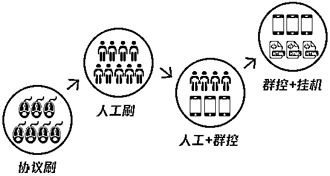
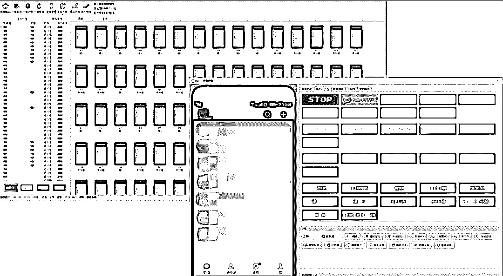
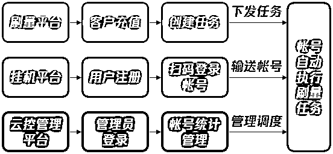
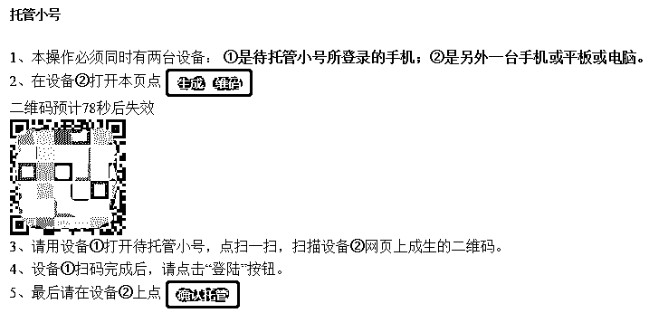
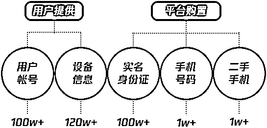
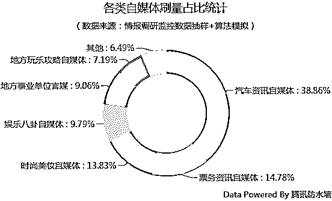
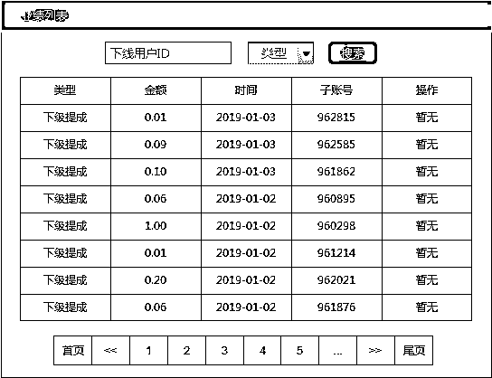
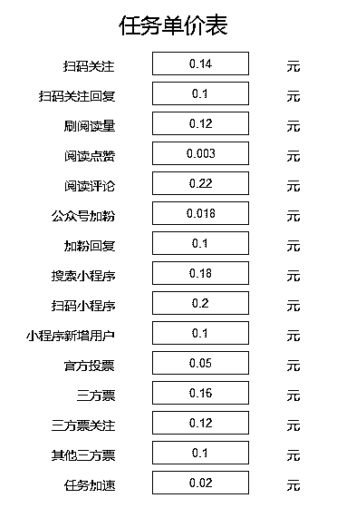

# 亿级流量诞生的背后：被“圈养”的百万网民

> 原文：[`mp.weixin.qq.com/s?__biz=MzIyMDYwMTk0Mw==&mid=2247494345&idx=1&sn=2a9af61094851ca910b10e4820844528&chksm=97cb21f1a0bca8e726e13d90e7364ab662728c0ca6f5c8ed2d3140cd5f6351fbc8373bfe7b0f&scene=27#wechat_redirect`](http://mp.weixin.qq.com/s?__biz=MzIyMDYwMTk0Mw==&mid=2247494345&idx=1&sn=2a9af61094851ca910b10e4820844528&chksm=97cb21f1a0bca8e726e13d90e7364ab662728c0ca6f5c8ed2d3140cd5f6351fbc8373bfe7b0f&scene=27#wechat_redirect)

**点击上方蓝色字体“灰产圈”关注并置顶本公众号**

**作者：腾讯防水墙**

 楔子：百万圈养 

200 块钱，意味着什么？

对于打零工的小廖来说，200 块钱不多，却意味着他小半个月的饭钱，也意味着他每个月从“挂机”中取得的报酬。

“就挂着帐号，啥都不用干，每个月等着躺赚。”去年，小廖在网上搜寻兼职时，一位老乡向他推荐了一种叫做“挂机”的活儿。

老乡所说的“挂机”，是指把用户帐号授权登录在一些挂机平台上，供平台方用于刷阅读、刷投票等各种刷量任务，以赚取报酬。了解到这种网赚形式后，小廖试着注册了会员，很快尝到了甜头。此后，小廖便把自己的帐号及家里长辈的几个号，长年累月地挂在平台上。

**在中国，像小廖这样的网络挂机用户已达到百万量级，且高度集中在近年来被不断开拓的下沉市场中。**为了微利报酬，他们当中大多数人都不了解所谓的游戏规则，也没有深究过自己交出去的帐号会被如何处置，更不清楚自己的小小举动与整个互联网的流量万象有何关系。

比起网赚兼职手的身份，**他们更像是被流量制造集团长期“圈养”的百万劳工，24 小时不间断地被操纵着输送流量、堆砌数据，直至被暗处水蛭般的既得利益者榨干殆尽。**

在互联网的下半场，黑灰色产业的幕后玩家们，正在瞄准下沉市场的广大人群，利用他们对地下世界游戏规则的认知缺乏，构建起互联网磅礴宏大的流量幻象，以骗取资本市场上的真金白银。

*此前，我们分别探讨了流量造假产业中的**[“机器刷量”](http://mp.weixin.qq.com/s?__biz=MzU1OTM4ODI1NQ==&mid=2247483814&idx=1&sn=c747643bb83e8269279d2ff37a1ebb34&chksm=fc194296cb6ecb8063befec9491f33b08cb5d1ddcf32d04597d8cc825cbbb12838af06b9aea6&scene=21#wechat_redirect)和[“人肉刷量”](http://mp.weixin.qq.com/s?__biz=MzU1OTM4ODI1NQ==&mid=2247483880&idx=1&sn=456c451edbc363b780e519989d859a69&chksm=fc1942d8cb6ecbceca9cc8642058622997c2c0367eed625598e2e6d610eab6daa94568f4ea39&scene=21#wechat_redirect)，而以“挂机”为关键环节的刷量手法，则可以说是一种将机器与真人深度融合的产业协作模式。今天腾讯防水墙从挂机黑产平台及其“圈养”的百万网民切入，通过真实调研案例和大家一探究竟。*

 一、淘汰与进化 

今年 29 岁的何聪，原本是一家互联网公司的程序员。2017 年，何聪在技术交流群里接触到群控和一些刷量渠道，从中嗅到了挂机模式的巨大商机。于是，何聪辞掉工作，凭借着积累的圈中人脉和门路，开始亲手搭建挂机平台。

图：发展至今，刷量主要经历了四种模式的演化

**挂机的崛起与兴盛，也就是这两年来的事情。在何聪投身挂机事业之前，整个行业的主流刷量手法历经了四轮的更迭。**在古早时候，刷量的原始手段是“协议刷”，即直接采用代理 IP+用户登录态来模拟协议，简单、直接、技术含量低。

随着互联网企业防御策略的升级，“协议刷”逐渐失效，被黑产果断淘汰。随后，各个社区平台上开始涌现大量的人工接单派单群——需求方以人际网络为渠道，雇佣真人“投手”完成刷量任务，也就是含金量最高的“人肉刷量”。

“人肉刷量”含金量虽高，效率却跟不上业务量的爆发式增长。很快，“群控”被引进产业协作中，以弥补人工刷量效率低下的缺陷。群控，也就是通过系统自动化集成的技术，实现由一台电脑控制多台手机、多个帐号的批量操作。

图：群控

随着策略的持续升级，帐号资源的不断收紧，地下产业发展出新的刷量模式——挂机刷。在以挂机网站为大中台的产业链中，上游是被平台“圈养”起来的挂机用户，长期提供大量真实有效的用户帐号。下游则是刷量平台，负责对接自媒体、广告公司等需求方，批量完成点赞、投票、增粉等各种任务。

图：以挂机平台为大中台的刷量产业协作模式

相较于以往的手法，挂机模式的高明之处在于，**一方面，平台方无需再购买和维护大量的帐号，而是直接以佣金分成的方式招揽用户、获取帐号；另一方面，用户无需再劳心劳力地抢单接单，亲自执行刷单任务，只需给平台授权帐号使用权即可赚取佣金。**本质上，这种模式大量整合了用户帐号资源，各自以不同的方式付出及受益，颇有互联网“共享经济”的痕迹。

图：挂机手法

从“协议刷”到“挂机刷”，刷量黑产与业务方的持续对抗，如同一场螺旋式循环的缠斗。每一个环节的轻微变化，都会引起整个黑市运作模式的自我进化更迭。如今，**挂机平台的崛起，让机器刷量与人肉刷量之间相互取长补短，逐渐走向合流，共同助推了一个个亿级流量的诞生。**

 二、连接与产出 

在何聪看来，**网络社交生态中的每一个身份，每一段关系，都代表着一个可攫取的节点和流量。一个个真实的用户帐号，就好比刷量产业中的水、电、煤，能够源源不断地产生能量。**而挂机平台，便是他精心搭建起来的“能源输送站”。

为了搭建平台，何聪不惜投入重本。在平台建设初期用户寥寥时，何聪就通过各种地下渠道，陆续购置了 100 多万份实名身份证数据，用于注册和解封帐号，为平台的帐号量打下基础。

随着平台的扩建、用户的增长，何聪又陆续以低价收购了约 1 万部二手手机，用于日常维护帐号，俗称“养号”。为了不影响挂机用户在自己的手机上使用帐号，平台购置的手机清一色是 iPhone 低版本手机，通通越狱后刷了系统，帐号扫描登录后可显示成 iPad 端登录。

图：挂机平台资源

从建站到现在短短一年多的时间，挂在平台上的用户帐号累计超过**100 万**，设备信息超过**120 万**条。在海量帐号资源和配套设备的强力支持下，亿级流量频频诞生。据防水墙追踪分析，该挂机平台发展至今，**平均每个月为需求方“贡献”公众号阅读量 1 亿+次，公众号增粉 500 万+个，投票 630 万+票。**

图：汽车资讯自媒体是刷量的大头，地方性事业单位官媒也“作假”

让人意想不到的是，“产出”如此庞大的一个挂机平台，平台人员仅有两人。除了亲自负责平台系统维护的何聪之外，就仅有一名常驻客服，负责提现和帐号托管的咨询售后工作。这是因为，挂机平台在获取大量用户帐号后，主要通过群控设备进行批量操作，所以更多的是设备上的投入和运营成本，无需大量的人工。

就这样，以挂机平台为大中台，后方源源不断地提供资源，前方无休无止地粉饰流量，三方连成一条严丝合缝的暗黑产业链。而这条产业链中，不同角色所能分食的流量红利差别显著——平台每月只需向挂机用户下发佣金约**100 万**，而刷量任务月收入则达到**270****万**。如此下来，该挂机平台年收入已逾**2000 万**。可见，**在流量供需所缔造的地下市场中，既得利益者永远是抓住游戏漏洞并制定规则的幕后玩家，被压榨的则是产业供应链中最为核心的广大劳工。**

 三、收获与收割 

小廖仔细算过一笔账：一个帐号挂一天，通常能赚 1 块钱左右。因此只要把自己的 1 个主号、2 个小号，以及家里亲戚长辈们的 3 个号都挂在平台上，一个月下来就能“躺赚”约 200 元。

为了获取额外的佣金，小廖正在努力地“拉人头”。**挂机网赚在下沉市场中的生态扩张，很大程度上得益于这种“拉人头”式的营销方式。**根据各个挂机平台大同小异的“拉新奖励规则”，若一个用户成功邀请下线，则可提成下线的 10%；若用户成功邀请下线的人数超过 50 人，那么该用户就能申请成为超级会员，超级会员可提成多级下线的 5%。

图：根据挂机平台的规则，发展下线可抽取提成

实际上，**挂机用户的佣金除了与帐号数量、下线人数挂钩，还与帐号的“质量”强相关。**质量低的帐号，收益自然更少，例如注册不满一个月的新号就属于质量低劣的号，一天下来也赚不了几分钱。

图：平台上各类刷量任务的单价不同，扫码小程序最高，阅读点赞最低

与小廖这种赚赚小钱的散户不同，老郑则是以挂机营生的“号商”。顾名思义，**号商手握大量帐号资源，以倒卖帐号资源为生，常常选择与挂机平台进行合作。**作为何聪的长期合作伙伴，老郑在其挂机平台上已经累计挂了 5 万多个帐号，在行情好的时候每月能入账 5 万多元，即使在行情最差的时候也能月入 1 万。

据防水墙调查分析，号商虽然帐号贡献量大，但在人数上只占不到 1%。其余 99%的平台用户，都是像小廖这类集中在下沉市场的普通民众。他们挂在平台上的帐号，承载着一个个真实、鲜活的网民身份，这是批量自动注册的新帐号、僵尸号不可比拟的。这些用户帐号上，有实名认证，有绑定的银行卡，有帐号主人在社交网络里所塑造的形象，有大量的社会关系和网络行为轨迹。

因此，当越来越多的人怀着欲望踏入这个灰色行业时，他们也同样陷入风云诡谲的身份危机中，成为被收割的对象。幕后操纵者如同暗处吸血的水蛭，不遗余力地榨干每一个帐号所蕴含的价值。翻过刷量这一页，**挂机的背后，是社交、消费、金融信息泄漏的出口，是个人身份利用和贩卖的黑色帝国，骗、黄、赌、毒……这些盘根错节的黑色产业链，交织成一张在暗处流淌着交易的巨大网络。**

或许，早在扫码授权登录帐号那一个小小动作之后，他们就走向了没有回头路的峭壁峡谷。

 四、思考与对抗 

市场几度沉浮，产业几番洗牌，流量变现的风口也一波紧接着一波。一个平台倒下后，很快就有新的平台崛起。一个领域热潮退去后，新兴领域以更快的速度奔袭而来。**而流量产业及其延伸产业链的不断自我进化更迭，彰显了这种模式对资本方及其背后利益方强调和巩固利益联系的可持续性。**

归根到底，互联网社交生态是自然社会的一隅缩影。在多年的黑产对抗中，我们见证了数个互联网风口的快速转换，也经历了各门各派黑产从猖獗到溃败的兴衰浮沉。可以说，打击互联网黑产的历程，就是了解社会百态的过程。对此，我们以黑市中的头部挂机平台及其掌握的海量资源为抓手，上游摸查幕后黑产资本集团，下游圈定需求方群体，全面监控感知产业协作的每一个关键路径，以对抗不断进化的黑色产业所带来的利益侵蚀。目前，腾讯防水墙已将各环节掌握的人员、人际、资源、设备等数据用于黑产对抗，为企业提供安全解决方案。

在对真实信息的追寻及符号意义的认知道路上，我们相信，在谎言和幻象之外，我们仍有力量去追觅人间本相，去触碰真相透出的光。

*本文材料均源自防水墙情报调研及黑市监控的真实案例，人物均为化名。

●[“人肉流量”制造业：300 万真人堆砌起的流量迷局](http://mp.weixin.qq.com/s?__biz=MzIyMDYwMTk0Mw==&mid=2247494086&idx=2&sn=52669215b01fac0b9a86996535cbee5c&chksm=97cb22fea0bcabe882a699b97b6fc0e60a02acb10d6fb57d0f72edcb83784f2a010fe6c18d0a&scene=21#wechat_redirect)

●[流量变现之道亦有道&nbsp;道法通天&nbsp;|&nbsp;特辑](http://mp.weixin.qq.com/s?__biz=MzIyMDYwMTk0Mw==&mid=2247493258&idx=1&sn=2a9fde2a59abcf16f5af6dac8d74f92e&chksm=97cb2db2a0bca4a486eae91b7ee9e45ab3ff1426cdb993822ff3fc1436e7cc5296484da6e086&scene=21#wechat_redirect)

●[流量之乱：谁在为互联网“顶级流量”买单？](http://mp.weixin.qq.com/s?__biz=MzIyMDYwMTk0Mw==&mid=2247492910&idx=2&sn=42482f4747dc2f4c036a7842a806ce49&chksm=97cb2e16a0bca7001a786f81fb911b47c3af10545fc301d900f98fff0a493d54af1fbdf0c74e&scene=21#wechat_redirect)

●[刷流量买热搜，揭秘演艺圈“流量担当”天价片酬背后的灰色流量产业链（深度长文）](http://mp.weixin.qq.com/s?__biz=MzIyMDYwMTk0Mw==&mid=2247490371&idx=1&sn=5cbba76c2759433f725610506551feec&chksm=97c8d07ba0bf596d4e944906a7ba1134d1d75a2cf5e5c2c01c7bdf717b2bddb900d4086aaeaa&scene=21#wechat_redirect)

   

**点击加入 ****灰产圈 | 高端社群**