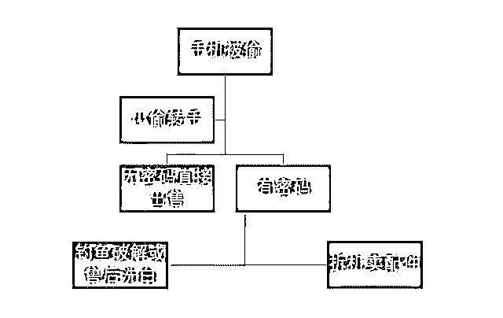
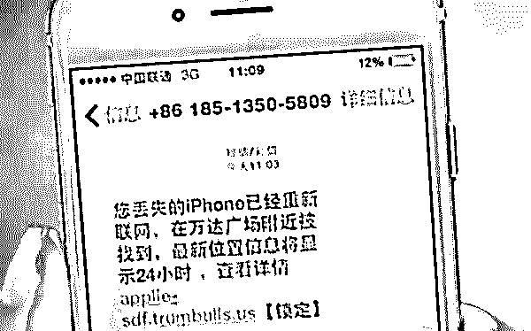
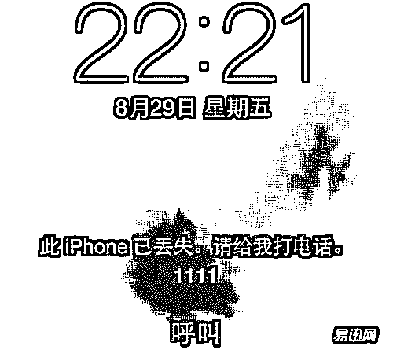
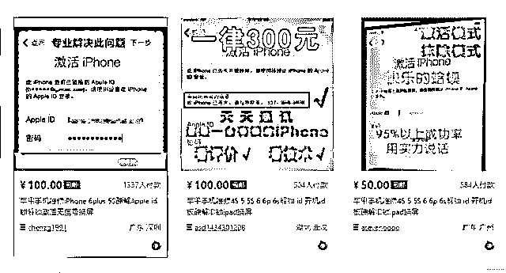
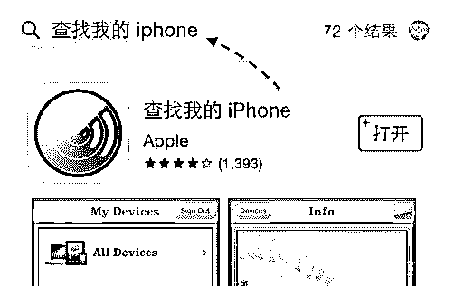

# 深度 | 偷盗，解锁，销赃，换机，手机盗窃"洗白"黑产全揭秘！

> 原文：[`mp.weixin.qq.com/s?__biz=MzIyMDYwMTk0Mw==&mid=2247494326&idx=1&sn=59dc6c954157d03da8314a171b0f154d&chksm=97cb218ea0bca89886bd4c97c12814e28df6a85406a1226e0b31e239bf0abff0fa2e2642a01d&scene=27#wechat_redirect`](http://mp.weixin.qq.com/s?__biz=MzIyMDYwMTk0Mw==&mid=2247494326&idx=1&sn=59dc6c954157d03da8314a171b0f154d&chksm=97cb218ea0bca89886bd4c97c12814e28df6a85406a1226e0b31e239bf0abff0fa2e2642a01d&scene=27#wechat_redirect)

点击上方“灰产圈”关注我们~

导语

我，是一台手机，今年年初的时候主人刚刚花了一个月的工资把我接回家。我们刚刚经历过蜜月，正准备一起厮守天荒地老的时候，突然有一天，我被陌生人带走了，走上了一条让我非常惊恐的迷途。至于我是怎么丢的，走过了哪些路程，我的小伙伴们又都为何频频离奇失踪，敬请收看——手机被偷背后的黑色产业链。 

  利益之矛，黑产之盾

小偷偷手机，其实还是利益的驱动

以一台刚刚上市的 iPhoneXS MAX 为例，小偷的第一手收入在 5000-7000 不等，之后每一手的商家大概还有 1000 以上的利润空间，在最源头进行洗白和翻新的商家收入更高！

对于这样无本万利的生意，投机与犯罪也就不足为奇了。在一台手机（包括 iPhone 和其他所有的安卓手机）被偷之后大致会经过这样的流程：

我们今天就主要来分析分析手机被偷之后，会有哪些不为人知的黑色产业链

始于安全，终于漏洞

近日在深圳发生了一起关于苹果手机灰色产业链的案件。相关从业人员以及设备，均已被警方抓捕和没收。

这得从苹果手机本身的功能优势说起，苹果手机本身具有很好的系统自我保护性。每部苹果手机有封闭系统功能，一旦锁上没有密码就成了“板砖”，根本不能用。

但是，苹果手机的密码锁定系统并不是无敌的，只要找到专业的人，都可以实现苹果手机 ID 解锁。像这样的专业人士，在淘宝上一抓一大把，甚至有的店铺月赚 10 万+。

既然能够在淘宝上出售破解 ID 服务，说明这业务不违法。那为什么上面那些人被警察抓了呢？就好比菜刀可以买，但是菜刀使用不当就会造成危害，即踏入违法犯罪范围。

上面那些被抓的人，就是因为没有利用好“ID 解锁”技术，为了贪图更多利益而落入法网。他们的整个作案手法是怎样的？继续往下看：

一组织盗窃

每部苹果手机都相当于 1 个“肾”，拥有手机的人对其保护得都很好。然而，有这么一群人（歪心思）看到苹果手机的高客单（高收益）后，就产生了谋取暴利的想法，并付诸行动。

为了让苹果手机利益最大化，最好的办法就是零成本获取手机。于是，在市场上就出现了不少有组织、有（盗窃）技术的偷盗团伙，开始针对“苹果手机”进行偷盗。

不管在公交汽车、还是行人来来去去的大街上，都有他们的身影。而那些有苹果手机的人（特别是买新款式的），就是他们的下手对象，通过各种偷盗手段将其手机收入囊中。

二解锁 ID 号

通过一线“偷盗”人员的努力，获取了一批苹果手机，多数都是“脸相”好看或者最新出的新款式手机。

这样一批手机中，分为两种：

无 ID 锁

刷机后，重新流入市场

*   有 ID 锁

    破解后，重新流入市场

由于破解苹果 ID 账号并非人人都会，一些团伙为了节省这个破解 ID 技术服务的费用（最低 100 元起），就通过一些木马病毒盗取原有机主的 ID 号和密码。

不过说真的，对方的这些手段，有时候真的很难防范。特别是对于没有互联网知识的普通大众，更容易上当受骗。

三估价销售

针对没有被锁定的苹果手机，直接在二手市场上进行销账。有锁定 ID 号的手机，就通过“第 2 步”中的方法破解 ID 号后，刷机再销账。

那些“脸相好，外观新”的手机，一般出售都三四千起，而且出货速度很快。比如我办公室的一位工作人员，购买的 1 部苹果 7 花了 7000 多元，用了两个多月（用不习惯），在闲鱼上以 5200 元价格就出售了（从挂出到收款总计 6 天）。

这种打折出售，对于我们本机主是一种亏损，但是对于“销赃者”来讲就是赚了几千块。对方每卖出 1 部苹果手机，至少都赚千元，一天成交 1 部手机，那就是日赚 1000+（大部分童鞋梦寐以求的啊）。

不仅二手转卖平台是他们的销赃渠道，连 QQ 群、微信群、淘宝店铺、个人微信号…..等这些也是他们集中使用的分赃渠道，只是更多人不知道自己买的苹果手机是对方盗窃过来再转卖给他的赃物。

四伪造资料换机

甚至有些团伙，在盗取得手后，针对一些“脸相”不怎么好的手机，就通过伪造各种可以从苹果官方获取换机资格的资料，例如伪造发票、伪造人为损坏……等，向苹果官方申请更换全新的手机，以便于后续可以售出更高的价格。

以上述 4 个步骤，形成有组织、有计划的苹果手机灰色产业链，各个步骤人员分工明确，合作紧密，共同发财赚钱。

整个的操作流程，都是以“空手套白狼”的思维，踩着法律的底线在不断地为自己谋取非法利益。而且，这种操作手法，不仅是深圳才有，就连其他省市也有这种作案团伙。

另外，平时我们走在大街上，突然有个女子或者男子向你走过来，拿着一部全新苹果手机问你“买手机不？”，这也是上述灰色产业链的销赃渠道之一。

收购之后，如何处理？

以上简单讲解了整条手机被盗洗白产业链，下面详细讲解有锁有机商家是如何处理的？

**1.做简单的刷机处理**，会有一部分安全做的不够深入的品牌在这一步就沦陷，重回第一步进行销售

**2.全国各地统一寄回深圳**，毕竟作为我国手机行业的桥头堡，深圳在黑白两道都是很厉害的。被锁定手机在深圳会尝试通过钓鱼网站骗取用户手机锁定 ID 的信息、或者是像 3 中提到的和某些所谓的官方售后进行勾结，用售后的方式洗白手机。

**3.对于比较有办法和“内部关系”的二手商家**，会选择在某地的官方售后进行返修货换新。返修之后再回来的手机既可以当作二手手机买，也可以做简单的翻新加上盒子当作全新的手机卖！很多地方现在可以直接在柜台就做到三码合一、塑封、全套配件这些工作。

**4.如果这些都不行，最终最终还会把手机拆解当作配件来卖**，现在的大屏幕智能手机的原装屏幕都是非常值钱的！ 

苹果在各地都有「官方授权售后服务中心」，其实都不是自己经营的，而是和当地口碑较好或实力较强的手机经销商合作。

这些经销商在面对消费者时的工作流程及规范本应该是非常严格的。但如果过于严格，很多明明应该享受三包政策的手机得不到服务，会极大的影响消费者对于国行苹果的认可度。

所以事实就是，各个授权点的标准不一，如果有那么一两个居心不良的「工作人员」和偷手机的渠道搭上关系，利用这个渠道来借苹果的手洗白手机真的不是什么难事！可以想见未来苹果对于售后的把控会更加严格了。

技术解锁，防不胜防

**国产手机，以魅族为例**，我自己丢过的魅族手机明明是加过密码，而且是刷机格式化都无法解决的。

但依然是在被偷不久之后通过某些渠道又流回市场进行销售了。据我们家修手机十年以上的小哥透露，一两年前国产安卓的加密不算很强，技术高的人确实可以搞定。

**只要是技术就一定有漏洞吧**。至于这两年的情况，他只说了不好跟我透露。他们修手机的，市面上那么多的原装配件从何而来其实大家都一清二楚，而且没有更好的替代方法，互联网上 xxxFIX 神马的，之前不也被爆出过这个问题吗。

钓鱼盗取 ID 的方法虽然看起来有点低级，但是对于很多防护意识不那么强的人，这是最省事的方法。骗子做出来的钓鱼短信、邮件、网页真的非常逼真，很容易引诱人点进去。

还有种情况，你的手机明明在自己手里，但是就被骗子锁定了让你联系某个 QQ 什么的。

这是他们通过破解你的网易或 QQ 邮箱，或者某些大型论坛被盗之后公开的用户数据，撞库撞到了你的账户。

改密之后，通过这样的方法来要挟你，这种时候千万别妥协。他们绝不会满足一第一次的钱，而是会多次骗取你的所谓解锁费用。

这种时候就直接联系手机厂商，提供你用过的帐号，或者购买凭证是会得到解决的！如果是苹果用户，记得开启 apple id 的二次验证！

对于手机既没有加密的，真的只能认倒霉了。下次一定要长个心眼！将手机上的保密措施都加好！

 

市面上主流的安卓手机和 iPhone 目前都有登录账户远程锁定或查找手机的功能。即使是被刷机也不影响。

结尾

以上产业链曝光之后告诫我们，在正常使用中，一定要设有密码、手势密码、指纹解锁中的一个或者数个，不仅仅是为了信息的隐私安全，更是为了手机丢失后做尽可能的补救。

关于找回手机的诀窍网上有很多，大家一定要去学习学习。不过最重要的还是不被偷！  

因为，即使你有 100 种补救方法，“聪明的贼”总会有 101 种应对。所以不被偷还是关键！

看完了本文关于手机黑色产业链背后的故事，你是不是很吃惊？大家有什么想法呢？欢迎评论留言与我们交流！

●[iPhone 用户账号集体沦陷：700 多人被盗刷 ，苹果公司 : 无法退款！](http://mp.weixin.qq.com/s?__biz=MzIyMDYwMTk0Mw==&mid=2247493554&idx=1&sn=c42e8e0d41303f4bbebcbd6f178500bc&chksm=97cb2c8aa0bca59c0175213906e817f7d97e0eb3232cad333422ea9dbf9683d82ee0c910e362&scene=21#wechat_redirect)

●[苹果漏洞：5000 就能买 iPhoneX！](http://mp.weixin.qq.com/s?__biz=MzIyMDYwMTk0Mw==&mid=2247492591&idx=1&sn=e483bf1cb11a3acabfd3823dba56404c&chksm=97cb28d7a0bca1c137f8a4e3dcc40a9db3b86a1d6f933b06f816059da6deed8a0ad36fcaf168&scene=21#wechat_redirect)

●[这条灰色产业链曾让苹果公司损失 10 亿美元！](http://mp.weixin.qq.com/s?__biz=MzIyMDYwMTk0Mw==&mid=2247491953&idx=1&sn=f94b7f91f5515a9af3d69826dc1af6a9&chksm=97cb2a49a0bca35f5848133d5018e514054aa9f4b7e05f4fa82e84fb6fb59022cfe91fbe90e1&scene=21#wechat_redirect)

●[深度|揭秘苹果手游代充灰色产业链：起源于库存系统漏洞！](http://mp.weixin.qq.com/s?__biz=MzIyMDYwMTk0Mw==&mid=2247490278&idx=2&sn=372160fc772fe566b47231382a493ed1&chksm=97c8d1dea0bf58c8a832a20add3951c5fb93f0eed4aef424fe005990f04c446dd0f0ef73fa24&scene=21#wechat_redirect)

   

**点击加入 ****灰产圈 | 高端社群**