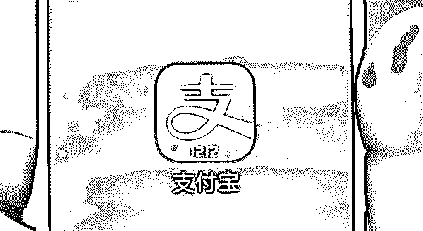
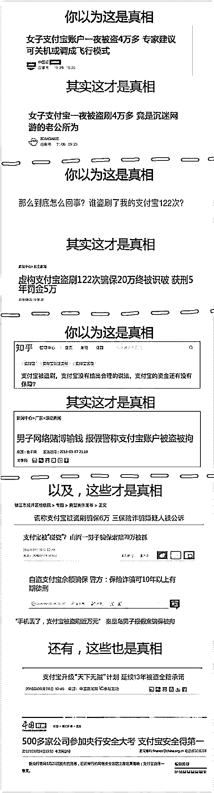

# 支付宝发布年终“神反转”盘点：有人被盗刷 900 次？真相，究竟是什么？

> 原文：[`mp.weixin.qq.com/s?__biz=MzIyMDYwMTk0Mw==&mid=2247494310&idx=1&sn=93c325d465f4bed00cdafaf77fa46253&chksm=97cb219ea0bca8883be930861573e9b32b95a05892114cf6f386e935ee00e0967cd0d412acd1&scene=27#wechat_redirect`](http://mp.weixin.qq.com/s?__biz=MzIyMDYwMTk0Mw==&mid=2247494310&idx=1&sn=93c325d465f4bed00cdafaf77fa46253&chksm=97cb219ea0bca8883be930861573e9b32b95a05892114cf6f386e935ee00e0967cd0d412acd1&scene=27#wechat_redirect)

点击上方"灰产圈"关注我们

导语

每年元旦前后都是盘点季，近日支付宝发布了一个别样的年终盘点：“神反转”系列。

早从 2005 年起，支付宝就承诺“你敢付，我敢赔”，如果账户被盗会得到全额赔付。

但为什么有时网络上还是有被盗拒赔的消息？这一盘点给出了答案：

这可能是投诉者自导自演的骗赔。

年终盘点

据介绍，为确保交易安全，支付宝的智能风控引擎已经升级为第五代 AlphaRisk

能够做到安全风控领域的“科学决策”和“无人驾驶”，帮助风险控制从千人一面向千人千面的转换，能在 0.1 秒内完成对每笔交易的风险识别。

目前，支付宝的资损率已经低至千万分之五（5/100000000），远低于国际同行的千分之二（2/1000）。

被盗刷，已经是一个极小概率的事。而即便碰到了这样小概率的事，用户也不用担心，能得到全额赔付。

在年终盘点中，支付宝列出了一些典型案例：

一谎称被盗 5 万在知乎发文，警方调查后以报假警将其行政拘留

2018 年 8 月，周某在知乎发文称支付宝被盗刷 5 万，称报警后也没有得到赔付，质疑资金安全没有保证，并邀请支付宝知乎机构号对此做回应。

支付宝跟进此案后，发现并不符合被盗特征。用户坚持是被盗，支付宝便与警方取得联系并同步相关情况。

警方调查后发现，此被盗案有重大异常情况，根据相关证据，警方依法抓捕了周某。周某交代，其因赌博输钱，又得知支付宝有“你敢付，我敢赔”的政策，于是报假警称支付宝账户被盗。

**结局**：

周某因涉嫌谎报警情被行政拘留五日并处罚款 200 元。

二谎称手机丢失导致被盗 6 万，男子被起诉

2016 年 10 月，王某联系支付宝客服中心，称自己的手机被盗，要求冻结资金。

可惜还是晚了一步，支付宝客服告知王某资金已被转移，但王某的账号保过账户安全险，可申请赔付，按照支付宝保险理赔的操作流程提交了相关证明材料后，王某最终获得赔付款 28400 元。

但警方调查后发现，称“手机被偷”、“支付宝被盗刷”的王某只是在演戏，他在朋友圈看到传授骗保经验的广告，根据对方提供的方法，先将自己支付宝账户中的全部资金转入孔某银行卡中，随后关机假装手机被盗，再联系支付宝客服。

**结局：**

京口区检察院以涉嫌保险诈骗罪，对犯罪嫌疑人王某等提起诉讼。

三谎称支付宝被盗刷 122 次索赔 19 万，被警方识破判刑 5 年

2017 年 3 月，李某向支付宝申诉自己账户被盗刷 122 次，并向公安机关报案。随后获得国泰财产保险有限责任公司赔付的 19 万。

但警方调查后发现，这是一起自导自演的盗刷诈骗案。根据李某手机中的照片、微信朋友圈等证据载明的情况，可以证明李某所谓的“支付宝账户被盗刷”期间，手机等由李某本人使用。此外，钱款转向的账户也被证实是李某所开设。

**结局：**

李某因诈骗罪获刑 5 年，处罚金 5 万元，同时被责令向被害单位退赔损失。

四谎称支付宝 5 个月内被盗刷 900 次共 70 万，已被批准逮捕

80 后青年温某，原本有着令人羡慕的工作，但在欠下巨款后，却动起了歪脑筋。他拨打支付宝客服电话谎称自己账号“被盗”，并投保过账户安全险，要求保险公司进行赔偿。

温某称“盗贼”在 5 个月内多次使用自己的支付宝账号购买了 900 多次游戏点卡，总计金额超过 70 万元。温某还在当地报了警。

但警方调查后发现，此事疑点甚多，通过线上证据链固定和线下实地排摸，杭州警方最终确认温某并非被盗，而是骗保。

**结局：**

温某被西湖检察院批准逮捕

五转账给熟人谎称支付宝被盗刷，涉嫌骗保被警方抓捕

韶关一女子通过支付宝进行转账，将自己的 3 万多资金转移到熟人账户上，造成支付宝被盗刷假象，然后报警，并骗取保险公司的理赔款。

韶关市公安局浈江分局经侦大队、网警大队、南门派出所联合办案，经过半个月的缜密侦查，抓获涉嫌骗取保险理赔款的犯罪嫌疑人刘某（女），这也是广东省首例互联网骗保案。

一女子一夜被盗 4 万多，原来是老公所为

2018 年 11 月，北京王女士发现前一晚支付宝上竟然有 18 笔支出，从凌晨 2 点到上午 10 点，累计支出金额 42000 余元。而这并非她个人操作的。王女士很紧张，为什么钱会不翼而飞。

还有专家对此给出了建议：“可关机或调成飞行模式”。

但警方调查后发现，这些交易都是在王女士的手机上操作的。进一步调查发现，原来王女士的老公沉迷于网络游戏，因为缺钱充值，竟动了他老婆账户的念头。

结尾

在盘点的最后，支付宝表示，没有谁能承诺提供 100%的安全，但支付宝愿意承诺能给大家 100%的保障。

●[第三方支付已彻底沦为涉黄，赌博，诈骗的帮凶！支付宝首当其冲！](http://mp.weixin.qq.com/s?__biz=MzIyMDYwMTk0Mw==&mid=2247493709&idx=1&sn=70e7793df7a17e82d8ebc357c3848405&chksm=97cb2375a0bcaa6312960e24e9b472158eccd9e462edec5498530dd29322d94ccc93992e6f47&scene=21#wechat_redirect)

●[深度|继双十一“剁手节”之后，马云又创造了“红包节”：支付宝扫码领红包，有人赚了 137W＋!](http://mp.weixin.qq.com/s?__biz=MzIyMDYwMTk0Mw==&mid=2247489556&idx=1&sn=496264ad0247846ec6d4dd579c92ecff&chksm=97c8d32ca0bf5a3a83b04d462c3294053164a9df47101381a22418523f16d050e27d7e9902a0&scene=21#wechat_redirect)

●[深度|你的支付宝余额是如何被清空的？揭秘“支付宝秒余额”的黑色产业链，打开一个年产值数千万的黑色大门！](http://mp.weixin.qq.com/s?__biz=MzIyMDYwMTk0Mw==&mid=2247488728&idx=1&sn=905c1d98fbcc6fca409099044d5776a0&chksm=97c8dfe0a0bf56f6c16c5bb1134f928c2f7e0ddf8fef74e0bd0c9a40ca2db37f59260fbc1b66&scene=21#wechat_redirect)

●[淘宝开了一家大型网上“赌场”，无数人深陷其中家破人亡，但却合法！](http://mp.weixin.qq.com/s?__biz=MzIyMDYwMTk0Mw==&mid=2247489631&idx=1&sn=90408e3c8eb9c314cc991a22fdb181ce&chksm=97c8d367a0bf5a71575aa731aa1907377f64f1427091d63805cff964e020e5f4af4c0f67bea5&scene=21#wechat_redirect)

   

**点击加入 ****灰产圈 | 高端社群**