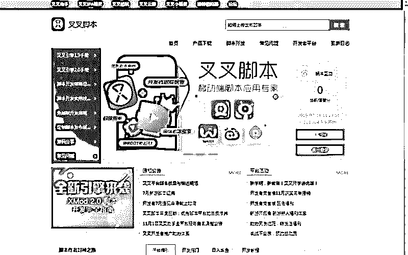
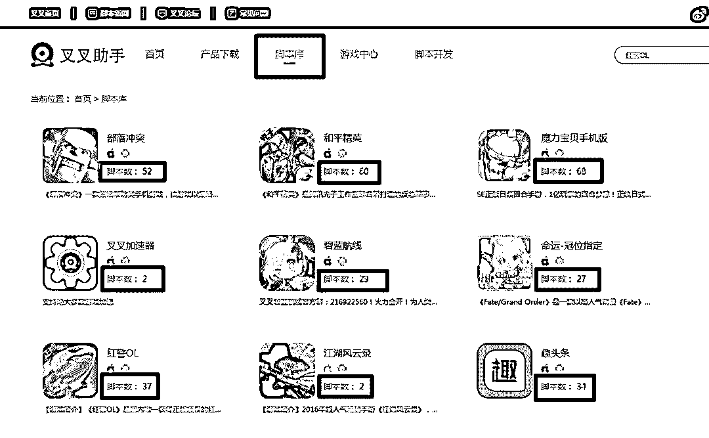
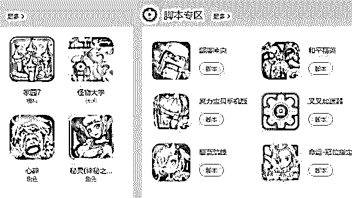
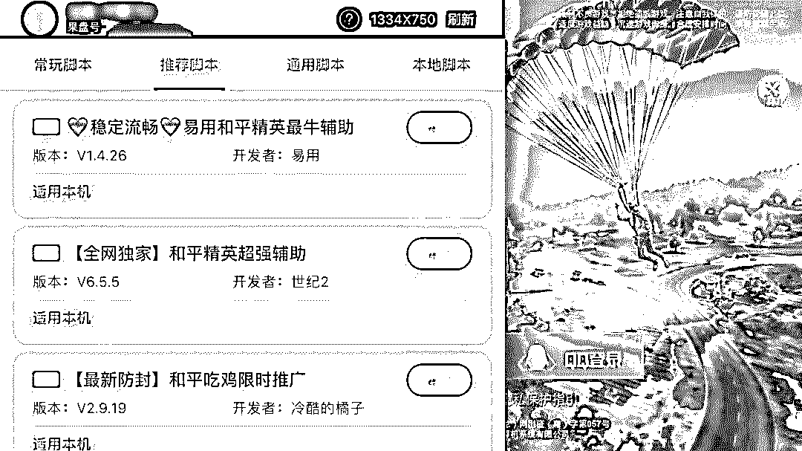
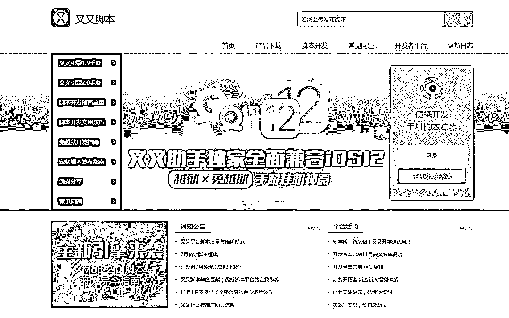
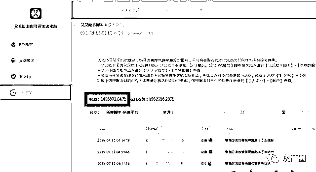

# 全国最大“聚合外挂”平台覆灭记，涉案金额一个亿！

> 原文：[`mp.weixin.qq.com/s?__biz=MzIyMDYwMTk0Mw==&mid=2247496997&idx=1&sn=0a859f9d1065b1c031f3a230256c7597&chksm=97cb3e1da0bcb70b029c7ca1efa3f616c248d456033ea9ff9d626a7f5432ad68da1d9eb9b76f&scene=27#wechat_redirect`](http://mp.weixin.qq.com/s?__biz=MzIyMDYwMTk0Mw==&mid=2247496997&idx=1&sn=0a859f9d1065b1c031f3a230256c7597&chksm=97cb3e1da0bcb70b029c7ca1efa3f616c248d456033ea9ff9d626a7f5432ad68da1d9eb9b76f&scene=27#wechat_redirect)

**点击上方蓝色字体免费订阅“灰产圈”**

导语

日前，江苏张家港警方在“净网 2019”专项行动中破获公安部督办全国首例“聚合脚本外挂平台”案件。 

一家互联网公司运营数年，将外挂的研发、推广、销售等环节打通。其 2000 名登记注册的脚本作者，在利益驱动下，昼夜研发各种外挂软件，从而形成了巨大的犯罪产业链，构筑了国内市场上最大的脚本外挂平台“叉叉助手”。

**从外卖、网约车的抢单软件，到部落冲突、和平精英等热门游戏脚本，一应俱全。****仅其中一名作者，在两年时间内编写 20 余款手游外挂，获利 100 余万元。****而依靠销售数以千计的火爆手机软件脚本牟利，整个平台的非法所得超过了一亿元。**

拒绝“抢单神器” 外卖小哥意外揭开“外挂王国”冰山一角

小王是一名外卖平台送餐骑手，但接单量一直不高。今年 3 月，有人向他推荐了一款“叉叉助手”平台上的“抢单软件”。下载“抢单软件”并付款 48.6 元开通周卡后，小王发现软件竟可以后台自动抢单，接单量大幅增长。在欣喜过后，小王还是觉得这样的“作弊”对同事、对同行都极度不公平，随后小王卸载了软件并报了警。

经张家港市公安局网警大队初查认定，这个批量提供脚本服务的平台并不简单，背后暗藏一条分工精细、手段专业的犯罪产业链。

明码标价，涉案金额逾亿

  

在对“叉叉助手”平台深入研究后，民警发现平台类似于手机软件市场，上架销售的软件数量近千件，绝大部分是手机游娱类软件，这其中不乏腾讯、网易公司旗下百余款热门手游。

△叉叉助手的平台界面

不仅如此，平台根据手机系统不同，设有 iOS 版和 Android 版，使用平台内各类软件对应的脚本也是有偿的，按使用时效从日卡、周卡，上升到年卡、永久卡等，售价依次攀升。平台还建有一套以“原力值”为虚拟货币的支付体系，只有充值“原力值”才能购买脚本。

△叉叉助手内显示的部分可使用外挂的软件

办案民警介绍，脚本就是游戏迷口中的“外挂”。游戏运行脚本不仅能获取虚拟定位、连点器等通用化功能，还帮助玩家提升操作技巧，实现战斗力提升，甚至能自动完成做任务、刷金币等特殊功能。

△使用外挂后的游戏界面

侦查工作仅开展了 10 天，警方所掌握的其中一个平台收款账户的盈利额就高达 170 余万元，“叉叉平台”营运牟利可见一斑。

△叉叉助手的脚本开发者界面

警方发现，“叉叉平台”除了对外售卖脚本，还设有专供脚本作者创作的开放式平台。这些从全国各地网罗的脚本作者，在“叉叉平台”提供的开发框架下编写脚本，之后即可上架销售。

据查，自 2013 年起，“叉叉平台”迅速扩张为国内市场上量体最大的脚本开发、销售平台，依靠销售数以千计的脚本牟取暴利，涉案金额超一亿。

清剿“脚本王国”

警方耗时数月，经美团点评集团、腾讯安全团队、网易游戏法务部等互联网公司的协助，锁定“叉叉平台”归属广东某网络公司，2013 年成立，由创始人马某为首的 30 余名员工维护。平台凭借近 2000 名脚本作者支撑，构筑国内市场上量体最大的脚本平台，依靠销售数以千计的脚本牟利，涉案金额逾亿元。

**重点人员梳理突出、证据链条完善固定，抓捕时机成熟！**

[`mp.weixin.qq.com/mp/readtemplate?t=pages/video_player_tmpl&action=mpvideo&auto=0&vid=wxv_1123739271602552833`](https://mp.weixin.qq.com/mp/readtemplate?t=pages/video_player_tmpl&action=mpvideo&auto=0&vid=wxv_1123739271602552833)

7 月 18 日，警方成立抓捕组，兵分五路前往广东、陕西、四川等省市，**收网抓捕包括“叉叉平台”公司相关人员、主要脚本作者 60 余人，查获电子数据 4TB，各类脚本 60 余万个。**

警方发现，“叉叉平台”通过技术人员，研究并利用技术手段破坏各大互联网运营商设置在手机中的安全防护机制。“平台针对不同的手机系统有不同的脚本运行模式，因此有些手机打开官方程序就能运行脚本，有些则需从平台重新下载软件。”就这样，安装“叉叉平台”的手机用户只要运行手游类软件，软件的运行瞬间便被劫持接入脚本引擎。

△某脚本写手的收益，数额高达 100 余万

作为平台的盈利支撑，脚本作者的身份令人唏嘘。**学历高、专业性强，这是民警对脚本作者的概述。“脚本一旦销售获利，作者将分得利润的 70%。”**民警以 27 岁的脚本作者刘某为例，仅两年时间，刘某就通过编写 20 余款手游脚本获利 100 余万元。

类似刘某的脚本作者四散全国，为能全链条打击“叉叉平台”背后的犯罪产业链，警方于今年 10 月再度出击，收网抓捕脚本作者 30 余人，**追缴非法所得上千万元**。

[`mp.weixin.qq.com/mp/readtemplate?t=pages/video_player_tmpl&action=mpvideo&auto=0&vid=wxv_1123330311359741952`](https://mp.weixin.qq.com/mp/readtemplate?t=pages/video_player_tmpl&action=mpvideo&auto=0&vid=wxv_1123330311359741952)

目前，涉案的 70 余名犯罪嫌疑人因涉嫌提供侵入、非法控制计算机信息系统程序、工具已被警方依法采取刑事强制措施，案件仍在侦办中。

文章整合自：张家港公安官微、现代快报、安全圈

**灰产圈高端社群 邀请您加入 2020 年度会员，与数千位会员共同创业**

← 向右滑动与灰产圈互动交流 →

**阅读原文加入灰产圈高端社群**