# 血洗！又一金融巨骗东窗事发，中产阶层杀手，投资者或血本无归......

> 原文：[`mp.weixin.qq.com/s?__biz=MzIyMDYwMTk0Mw==&mid=2247496920&idx=1&sn=ea80fe05c8c8bb030deb38dd5f5840c2&chksm=97cb3fe0a0bcb6f6ac38b9efcbf21d1b21f66c6bd8a34696f0753fb7a15bbb460dcc420f1fd8&scene=27#wechat_redirect`](http://mp.weixin.qq.com/s?__biz=MzIyMDYwMTk0Mw==&mid=2247496920&idx=1&sn=ea80fe05c8c8bb030deb38dd5f5840c2&chksm=97cb3fe0a0bcb6f6ac38b9efcbf21d1b21f66c6bd8a34696f0753fb7a15bbb460dcc420f1fd8&scene=27#wechat_redirect)

**点击上方蓝色字体免费订阅“灰产圈”**

01

眼看他起高楼，眼看他宴宾客，要看他楼塌了！

外汇骗局割起韭菜来，比什么骗局都触目惊心！

就在**刚刚，PTFX 普顿，这个外汇资金盘遭遇了大爆仓，目前 7 个团队有 6 个团队已经爆仓，无数投资者账户余额，一夜之间亏损至负数，平均亏损率达 113%。**

下面是投资者爆仓的截图。有十几万美金的爆单。

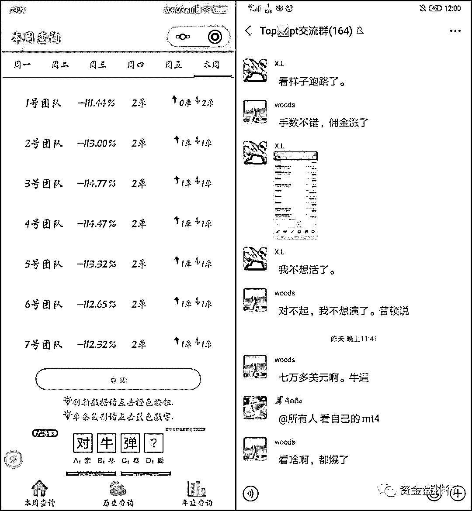

**全没了！****全没了！****所有 PTFX 的群全部炸了。** 

今天，或是参与 PTFX 会员最黑暗的一天，估计很多人都是彻夜难眠。

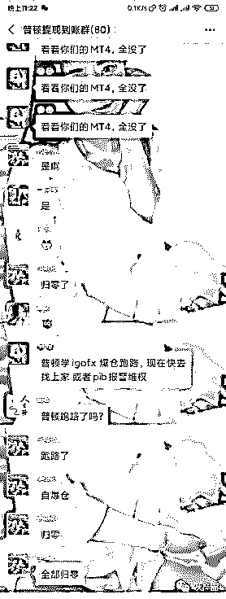

其实，前几个月，PTFX 基本账户就已经都拿不出钱了，期间他们捏造了第三方通道受阻、国内政策限制原因阻挠用户撤单，之后更是以数据压缩为名，清除了无法出金的用户的出金申请记录。

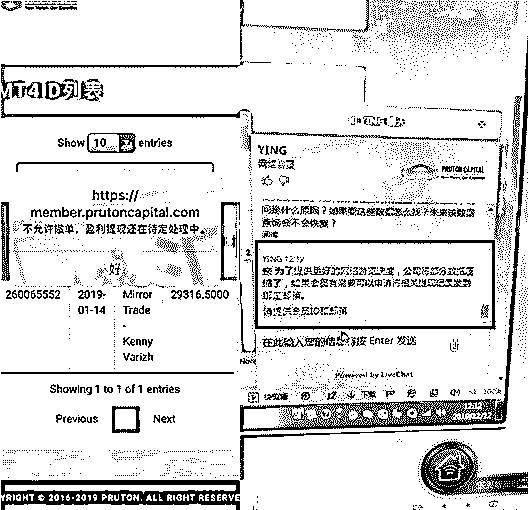

该删除的记录删除了，该清除的痕迹清除了，**今天，PTFX 操盘者，一不做二不休，干脆制造黑天鹅事件，通过将用户账户亏到爆仓的方式，来“巧妙”化解用户申请不出钱的问题。** 

“想出金？门都没有！都给我爆！”这大概是 PTFX 此时内心的真实写照！

爆仓后，大量 PTFX 普顿投资者称网站进不去，有的直接打不开，有的打开网站出现乱码，无法进入。

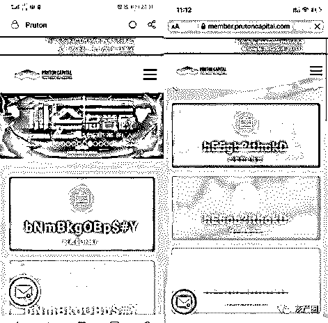

很多投资者所在的 PTFX 群开始解散，解散的理由居然是“防止造成不必要的误会”，并让投资者有问题直接联系推荐人。

什么不必要的误会，不过是割完韭菜，就要跑路了。 

太狠了，今晚，不知道多少人要把身家性命亏没了，又有多少血本无归，家破人亡！

02

什么是 PTFX？

**PTFX 是打着印尼某公司旗号的外汇资金盘，号称是受到印尼监管背书，印尼十大外汇公司之一，操盘手牛逼上天。**

只要你投钱进入 PTFX，你什么都不用做，自然有外汇投资大神带你飞，每个月 10%到 30%的收益包您爽。

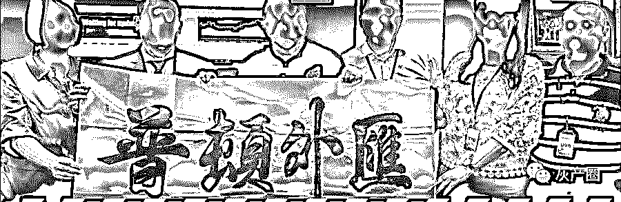

和其他骗局一样，PTFX 这种外汇盘骗局，也是无所不用其极地利用投资者的贪婪、无知和轻信，利用下一个人的资金补足上一个人的收益，击鼓传花，甚至利用亲杀亲、熟杀熟的套路，把一波波心怀暴富梦的人们坑进来。

**1、PTFX 的第一步，就是包装自己，派发安心丸，把自己打扮成受到印尼金融监管局监管的外汇资金盘，正规的外汇投资平台。**

PTFX 宣称是 pruton 公司旗下新成立的品牌，而 pruton 是印尼十大券商之一，受印度尼西亚雅加达期货交易所（JFX）监管。

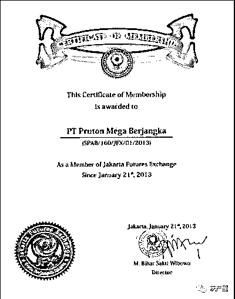

PTFX 还有自己的网站，网址是 http://www.rcm-pruton.com/，界面比官方的还高大上，而且通俗易懂。 

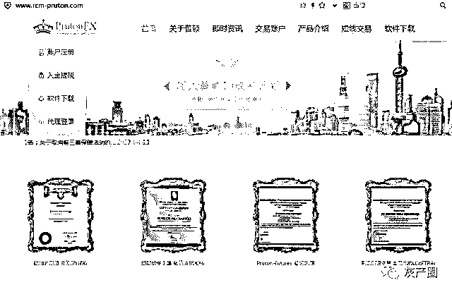

外来的和尚会念经，何况是投资外汇，这样一个高大上的名词，毕竟外汇这个词汇确实经常在新闻里听到，似乎是一个很靠谱很重要的东西，起码比虚拟货币听起来靠谱。

很多人，于是开始有些心动了。

他们哪知道，PTFX 就一冒牌货，假冒普顿旗下公司，虽然炒着外汇这个画皮，其实也是一个面目狰狞的骗子。

**2、PTFX 的第二步，就是高息相诱，躺着赚钱：****声称有专业老师带单操作，你只要出钱，账户自动跟单，金融小白也能躺着赚大钱。**

给你一张 PTFX 的收益表，大家看看，PTFX 有多敢吹：

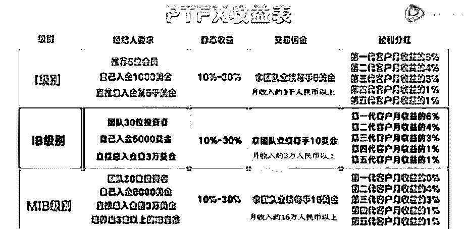

要知道，这里面标注的单位是月，就是一个月 10%到 30%的收益，如果算年华收益的话，算上复利，差不多一年要干到 700%了。

一年赚 7 倍，是不是听起来如梦如幻，天上掉馅饼一般？

你肯定不信吧？

别着急，拉你炒外汇的朋友，会告诉你：这个投资，其实是跟单交易，有高手下单，你只是跟着高手的操作一起下单，利润的分配是以 70%归投资人，15%归操盘手，然后再给你科普一下国际上的外汇交易有多么发达，甩出很多高大上的国外报道。

你还在犹豫？ 

朋友会接着告诉你，这个高手可是世界知名操盘手，再甩给你几张高手的历史交易截图，一些你可能没太听过但听起来很牛逼的国际奖项，以及自己跟单的最近的盈利。

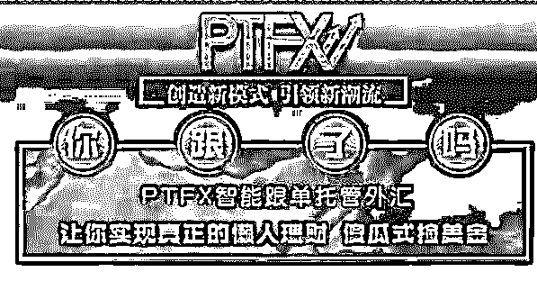

眼睛放光了吧？

朋友会接着苦口婆心劝你，你不理财，财不理你，想想，10 万存款银行定存一年收益 1900、余额宝 3000、银行理财 4000、但是用 PTFX 进行外汇自动跟单收益高达 120,000！

看的我都心动了，机不可失、失不再来，很可能你就跟着把钱砸进去了。

很多人一开始可能是投点小钱，然后，玩着玩着，就觉得平台记录很真实，盈利很给力，还可以提现一部分钱，所以越玩越大。

他们哪里知道，PTFX 根本就是一个虚假的外汇盘子，什么高手带单，都是假的，后台的账户金额及交易记录，都是假的，投资者的资金根本没有进入国际外汇保证金交易市场。

PTFX 这么用心良苦地折腾，其实就是资金盘的博傻游戏，为了骗更多人的，等骗得盆满钵满时，再携款跑路。

**3、PTFX 的第三步，就是让你拉人头发展下线，鼓励你拉新拿佣金，利用亲杀亲、熟杀熟的套路，把一波波心怀暴富梦的人们坑进来！**

PTFX 是支持 5 代分红的，就是最少有 6 级关系链，上级可以通过推广会员，发展下线来获得返佣。

注册 PTFX 的时候，要绑定一个经纪人的 ID，作为推荐人。说白了，如果你拉到了更多的人参与 PTFX，他们就会成为你的下线，收益分你一部分，你下线的再拉下线，那么你还能获得收益。

多少收益呢？拉到新人，可以给你充值金额的 30%，甚至拉来的人再拉来的人，交易也有奖励。 

**现在明白了吧，炒外汇只是幌子，实际干着金融传销的勾当，就是一个旁氏骗局。**

**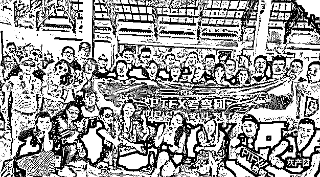**

换句话说，和泛亚、e 租宝、中晋、钱宝一样，PTFX 这种外汇骗局，最终只能靠“借新债还旧债”、击鼓传花的形式维持着，只有不停的拉新人进来，这个盘子才能有资金来让老人获得收益。

可是不能被忽视的关键点就是，庞氏系列骗局是永远都不可能产生财富的！

一旦击鼓传花传不下去了，庞氏骗局的链条会忽然断裂，那么所有的钱都会打了水漂，盘子顷刻坍塌，又是一场血本无归！

03

其实不仅是 PTFX，近两年，什么奥美 OTM，“IGOFX”等好多个外汇平台集体爆仓，不少投资者几十万、几百万的资金瞬时化为乌有，真是欲哭无泪。

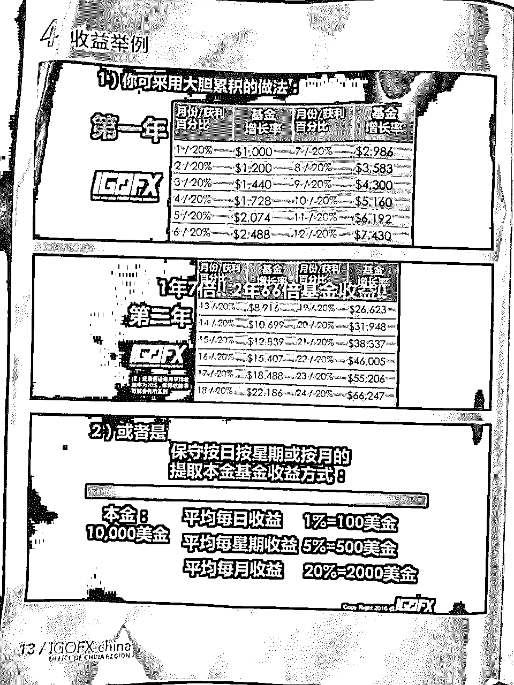

投资者被骗，归根到底，还是一个“贪”字。

毕竟，这些外汇骗局的受害者，不少人也隐约知道，这个钱赚得很诡异，但他们往往心存博傻的侥幸，希望有比自己更傻的，在高位借自己的盘，找“替死鬼”来帮助自己再次投胎，乃至自觉不自觉成为骗子帮凶。

**一方面，在中国，炒外汇是非法，所谓投资外汇的外汇平台，没有一个是真的、靠谱的。**

我国非常明确地规定，不允许网络平台参与外汇保证金交易，网络外汇交易不受法律保护！

要知道，我们是一个外汇管制国家，每个人每年就 5 万美元的外汇额度，怎么可能让你自由交易外汇呢？

所以，只要是国内的外汇平台，全部是假的！全部是假的！全部是假的！ 

知道是假的，还把钱存进这些平台，这跟把钱打到别人银行卡，有什么区别？

把钱打进别人信用卡，如果在国内，可能还能追回来。而 PTFX 平台的服务器，可是放在印尼！

**另一方面，在我国，超过 3 级的分销体系，就会被定义为传销，而 PTFX 是支持 5 代分红的，就是最少有 6 级关系链，这个不是传销，能是什么？**

传销是违法的，这个已经是常识了。

我们来看看国家对于 PTFX 的态度是怎样的。

这是湖北省外汇管理局网站的回复。

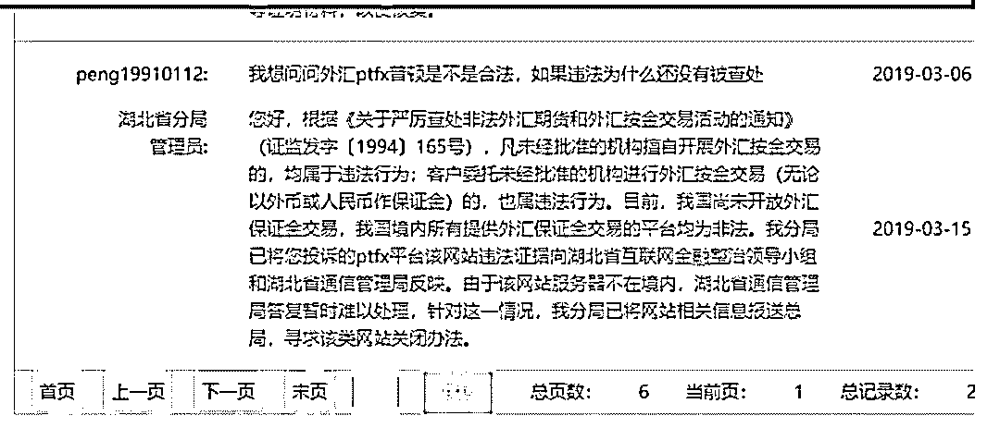

这是深圳外汇管理局的的回复。

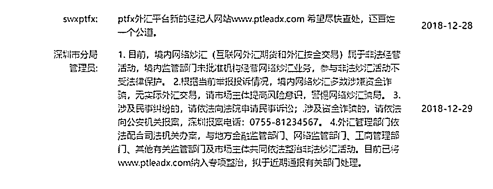

政府机构都这么明确的答复了：**境内网络炒汇是非法经营活动，境内监管部门没有批准过任何一家机构经营网络炒汇业务，参与非法炒汇活动不受法律保护！**

PTFX 这种，利益链超过 3 级的传销，外加国家严厉打击的网络外汇资金盘交易，更是恶上加恶，更是必须严加提防、严加打击！

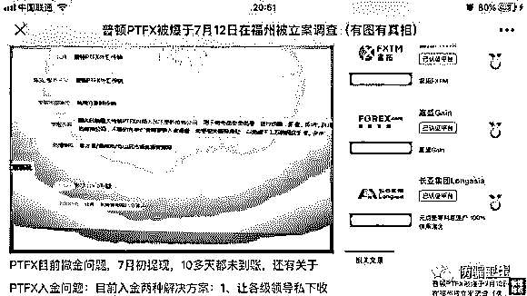

可是，仍然很多人至今不愿醒来：

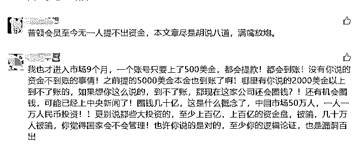

这不是利令智昏，什么是利令智昏？ 

贪婪是魔鬼，自己做的孽最终只能自己扛！

04

历史不会重复，但总是带着同样的韵脚。正如黑格尔早已说过那样：人类从历史上学到的唯一教训，就是人类没有从历史中吸取任何教训。

从“郁金香泡沫”这个人类历史上第一次有记载的金融泡沫开始，从庞氏骗局发生之后，人性并没有多大变化。今天的我们，并不比当年炒郁金香的荷兰人高明多少。

**其实，这些庞氏骗局的画皮并不那么别致，只是太多的人利令智昏，被欲望蒙住了眼睛，即使将信将疑，在动人的诱惑之下，往往也心甘情愿当了那只扑火的飞蛾。**

一次又一次血的教训都在告诫我们：

**1、首先，当前你在网上找到的所有的，一切的，外汇公司，全部，注意我说的是全部，没有一家是合法的，全部都是非法。**搜索引擎搜出来的，邮箱里的广告的，不管怎么吹的，没有一家是合法的。全部都是在国内非法的。

**2、天上不会掉馅饼，掉的很可能是陷阱！**这个世界，不承受较大幅度波动，而能够取得 10%左右年化率的资产，其实是很少的。即使是巴菲特那么样的投资大牛，年化率也就 25%左右，那已经是顶天了，不能指望有天上掉馅饼的好事。

**3、凡是看不懂的，无论打着什么美妙的旗号，一律不要碰。**无论是投资外汇、互联网+还是什么 AI+、区块链，投资要取得高收益，背后一定是高风险、高波动。对那些承诺高收益而低风险的投资，一定要瞪大眼睛！

**4、你贪的可能是人家给的高息，但人家要的是你的本金！**在梦想取得高额回报之前，首先看住你自己辛辛苦苦赚来的本金。利令智昏，孤注一掷，最后的结果往往是赔了夫人又折兵，人财两空！

**5、永远不要以为自己比别人高明，能够逃过击鼓传花的最后一棒！**即使你在前 100 次都侥幸脱险，但第 101 次的陷落，你就将永劫不复。只有清醒地认识到自己和别人一样无知，你才真正走上了智慧之路！

的确，金融不是谁都可以亵玩的游戏。投机死于贪婪。提高防范意识，不被高利诱惑，自觉抵制博傻游戏和金融骗局！

茨威格在《断头王后》里，曾经有一句经典名言：她那时候还太年轻，不知道所有命运赠送的礼物，早已暗中标好了价格。

**天下永远没有免费的午餐！**

另：大量读者还有没养成点赞的习惯，希望大家阅读后顺手点亮“在看”，以示鼓励！长期坚持原创真的很不容易，多次想放弃。坚持是一种信仰，专注是一种态度。

← 向右滑动与灰产圈互动交流 →

**阅读原文加入灰产圈高端社群**