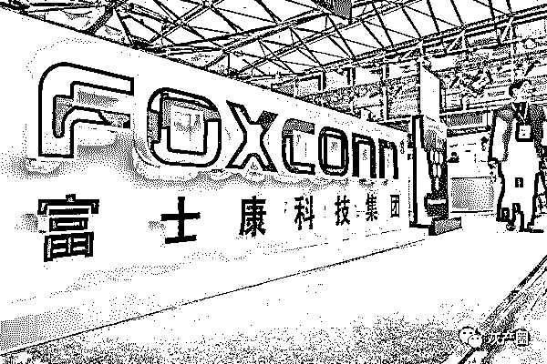
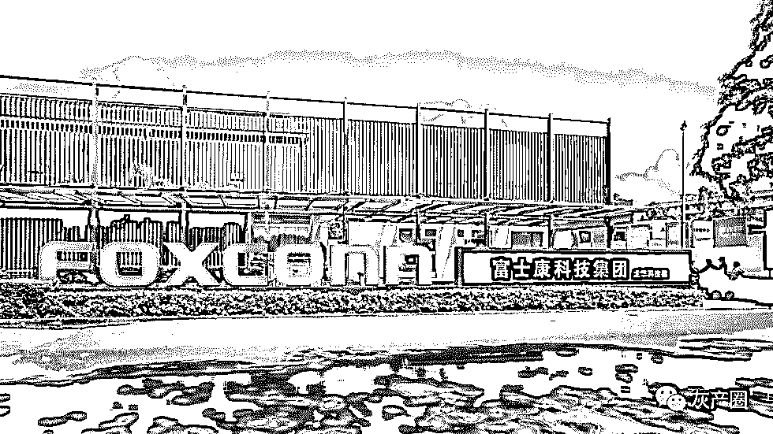
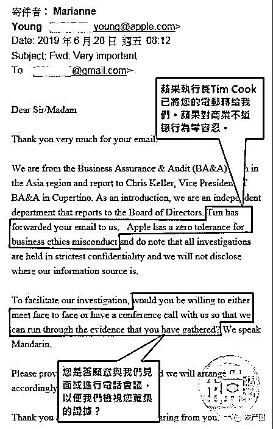
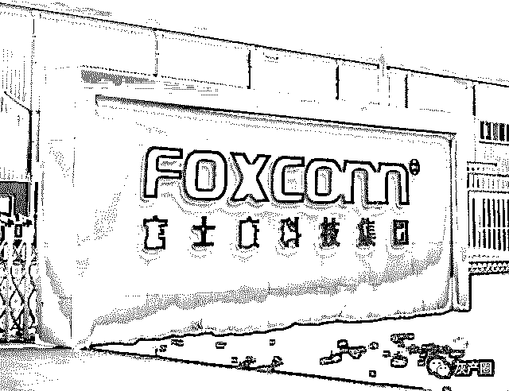
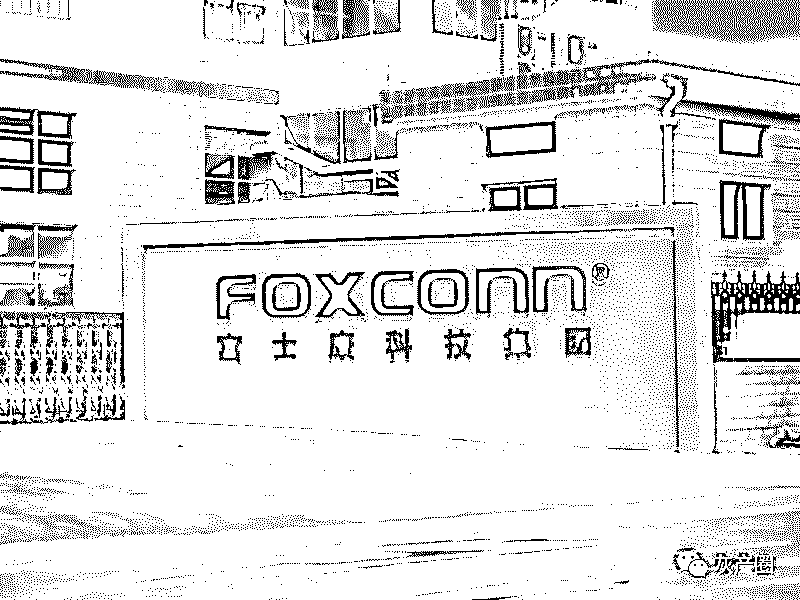
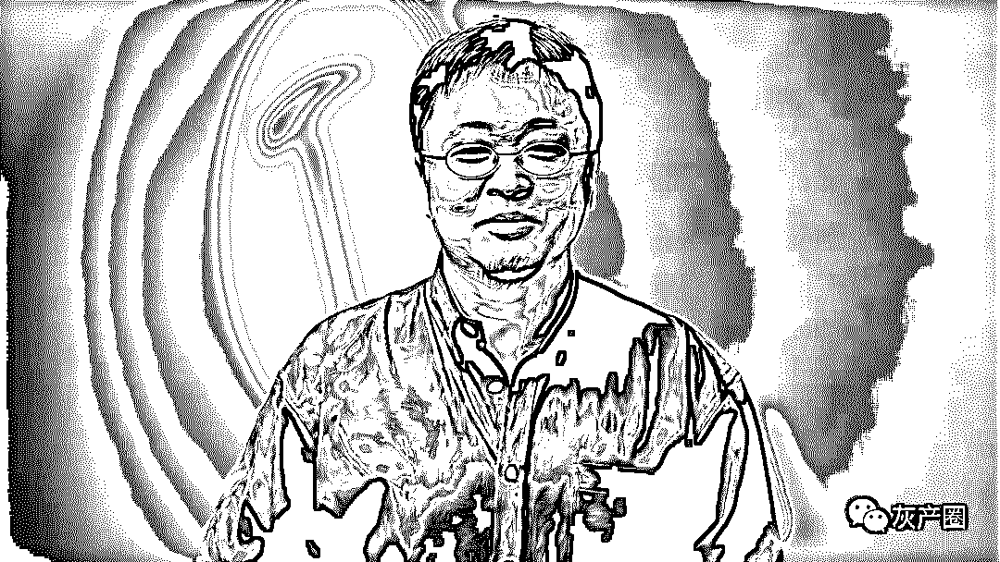
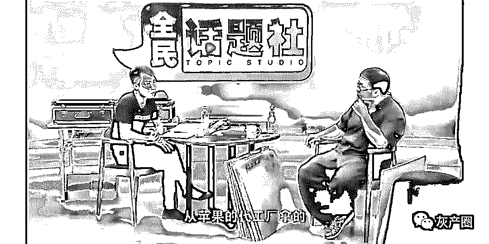

# 富士康黑产：内鬼偷卖零件赚 3 亿元，罗永浩一语道破天机！

> 原文：[`mp.weixin.qq.com/s?__biz=MzIyMDYwMTk0Mw==&mid=2247496891&idx=1&sn=3068afdf1b0bba0d2402076e187bb877&chksm=97cb3f83a0bcb695583fbd8b7c9e4f7ae4dcd87e56d277040ed3550362fa156cc4d8086d3f12&scene=27#wechat_redirect`](http://mp.weixin.qq.com/s?__biz=MzIyMDYwMTk0Mw==&mid=2247496891&idx=1&sn=3068afdf1b0bba0d2402076e187bb877&chksm=97cb3f83a0bcb695583fbd8b7c9e4f7ae4dcd87e56d277040ed3550362fa156cc4d8086d3f12&scene=27#wechat_redirect)

**点击上方蓝色字体免费订阅“灰产圈”**

导语

近日，据中国台湾媒体报道，一名台商爆料称，他的团队与 iPhone 代工厂富士康郑州工厂高级干部合作两年多，低价买进原本应该销毁的 iPhone 零组件瑕疵品，经简单加工，再以原厂良品的名义转卖。三年时间涉案金额达高达 4200 万美元（约 3 亿元人民币）。这是目前涉及金额最大的 iPhone 黑产案件之一。该黑产可能每年给苹果带来近 30 亿美元的损失。

事件起因

  

该台商主动爆料的原因，是今年 2 月因故与上述郑州厂干部闹翻。他先向富士康母公司鸿海集团投诉，但未获回应。之后转向苹果总公司检举，直接发邮件给苹果总公司及 CEO 库克（Tim Cook）。目前，苹果公司收到邮件后转给亚洲稽核单位进行调查。

12 月 18 日，鸿海集团回应称，公司一直遵循诚信经营守则，亦要求所有员工务须恪守职场道德与相关规范。故无论报道内容是否属实，公司都愿以最严谨的态度面对与查察，因此本公司不但已启动内部稽查程序，并亦同时报请有关单位进行侦查办理，一旦查明属实，公司绝不宽贷。

据官网，富士康 1974 年在中国台湾创立，1988 年投资中国大陆以来，迅速发展壮大，拥有百余万员工及全球顶尖客户群，是全球最大的电子产业科技制造服务商。2002 年起位居中国内地企业出口 200 强榜首（2018 年进出口总额占大陆进出口总额的 4.1%）,2005 年起跻身《财富》全球企业 500 强（2019 年跃居第 23 位）。

记者联系富士康了解事件进展，截至发稿未获得回复。

直接进厂验“货”

  

富士康是 iPhone 的主要代工厂商，在中国大陆拥有 30 余个工厂，其中郑州、成都和深圳工厂主要负责 iPhone 生产。虽然今年生产线开始向东南亚转移，但中国大陆制造商依然高度依赖，据报道，超过 90%的苹果产品仍在中国组装。

公开资料显示，富士康郑州园区于 2010 年 8 月投产，规划占地面积 10 平方公里，建成厂房面积约为 100 多万平方米。到 2014 年时，富士康郑州园区已经成为富士康的第二大园区，仅次于深圳园区。

上述台商称，该台商的团队原本做的是电子工厂废料回收、转卖生意。从 2016 年 7 月到今年 2 月为止，他的团队从富士康郑州工厂取得的货品，已使其获利人民币 3 亿元(约新台币 13 亿元)。

该台商和富士康郑州工厂相关人员的“合作模式”是，该台商等人会先到郑州厂看货，“我们看完货后下订，隔天就叫货车，双方约在厂外隐密的民宅接货、验货之后，直接支付现金给接头的人。然后我们再将这些零组件卖给固定配合的盘商，最后由这些盘商销往全大陆，也间接卖往中国台湾。”

他以最新的 iPhone XR 举例，相关零组件大多在富士康郑州工厂组装，良率约 93%，也就是有 7%的不良品。依规定，这些不良品须销毁。但他的团队也能拿到未销毁的不良品，经简单整理，就可变成良品转售牟利。

他在发给库克的举报信中写到：“为了搜集证据，我花了很多时间，并安排秘密人员进入富士康”。他还偷拍了在富士康郑州工厂内验货的视频。

特殊的郑州工厂

  

虽然富士康工厂一向以管理严格著称，但员工偷窃不良品的案件此前确有在富士康郑州工厂发生。

据检查日报报道，富士康位于郑州航空港区的鸿富锦精密电子郑州有限公司的员工郭胜涛、杨文庆于 2013 年 4 月 3 日、4 月 9 日、4 月 13 日，共将总价值 21 万元的 900 块 CG（iPhone 5 手机显示屏)）带出工厂并出售。

2014 年 7 月 19 日，经检察机关提起公诉，法院一审以职务侵占罪，判处郭胜涛有期徒刑六年零六个月，判处杨文庆有期徒刑五年零二个月。郭胜涛和杨文庆都没有提出上诉。

富士康的物料仓分为良品仓和不良品仓。不良品仓的工作是收集从生产线上退下来的有问题的手机零配件，按照手机显示屏、主板、后壳等等分类，再把分类好的零配件转到报废仓，将其报废。郭胜涛当时正是该厂不良品物料仓的副班长，杨文庆是其手下员工，负责退大件 CG 和后壳。

郭胜涛发现，料仓的管理一直都比较混乱，每天的转进转出数目都很大，经常有对不上账的情况。于是，2013 年春节前的时候，郭胜涛找到杨文庆，商量一起把料仓的 CG 弄出去一些卖钱。杨文庆同意了。2013 年 4 月 3 日、4 月 9 日、4 月 13 日，上班时间，杨文庆分三次，每次 300 块，共将 900 块 CG 带出车间。

其实，这 900 块 CG 都是良品，本来是要从生产线上的 KT 仓退到良品仓，再返回公司大仓库的。杨文庆找到 KT 仓负责退料的侯某，跟他说这一批 CG 退料的时候不要在单子上打上是不良品还是良品。

根据惯例，这些良品如果打上单子，良品仓的人就会收走。如果单子上不显示，良品仓的人就不管，不良品仓的人就可以收走。杨文庆和侯某的关系很好，于是侯某就同意了，将这批良品 CG 转到不良品仓，也就等于是转到了郭胜涛的“能力范围之内”。

杨文庆分三次把这 900 块 CG“带”出来，郭胜涛在厂区门口接应。郭胜涛接到这些 CG，骑着电动车，按照小广告上的电话，通知收屏的人。900 块 CG，郭胜涛卖了 3 万元，和杨文庆均分，一人一万五。而 CG 的实际价格，是每块 38 美元，按当时汇率，900 块 CG 价值 21 万多元。

值得注意的是，检查日报在报道中提到，“此类案件在富士康频频发生，占（郑州）航空港区检察院全年受理案件的百分之三十还多。自 5 月起，航空港区检察院与富士康集团密切联系，已经建立了常态化沟通机制。”

业内公开的秘密？

  

早在 2014 年，罗永浩就曾意外捅破“偷料”的“窗户纸”。

2014 年 8 月 1 日，国内知名测评人 ZEALER 王自如发布了关于锤子手机 Smartisan T1 的评测视频，王自如称 T1 算不上“东半球最好用”的手机，列举了其诸多弊端。

同年 8 月 12 日，锤子手机创始人罗永浩在微博上约王自如上优酷做现场直播节目并当面对质，王自如应战。8 月 27 日 19：00，两人如约面对面 PK，双方就“锤子手机是否易碎”“散热设计是否有问题”等话题展开了激烈的辩论。

在辩论过程中，罗永浩问王自如修手机时用的苹果的元器件是哪里来的。王自如说从南方某知名电子元器件市场进货。

罗永浩说，“苹果是一个不卖元器件的厂商，你们的上游渠道是从哪里得到的苹果（元器件）。

我们跟苹果确认过，苹果没有给自己授权商以外的人提供任何配件。从工厂拿的。对不对？”王自如于是回答：“（上游渠道是）从苹果的代工厂‘拿’的”。

然后，罗永浩就向大家“普及”了一个关于苹果元器件“流通”的“灰色渠道”：很多半黑社会性质的企业，他们怎么得到苹果的原厂配件呢？基本上大多数的方式，就是跟代工厂里面（的人）内外勾结。

苹果对元器件要求非常苛刻，有一些元器件送到代工厂后，就被判定为不合格品不能用。但这些不合格品比起山寨厂商那些配件，质量还是很高的，至不过过不了苹果的高品质标准。还有在生产过程中发现的不良元器件，也会近不良品库做报废。

报废库里面存了足够多数量的不良元器件之后，如果代工厂内部人跟外面的半黑社会性质的企业勾结，直接偷出去肯定是不行的。他们会先找一些劣质的（其他品牌）的不良元器件，拿到代工厂里面，放进报废库，这样保证报废品是一直存在的。然后，把苹果的不良元器件“换”出去。这两种不良元器件的差价是 5 到 10 倍。这就是为什么在“某知名电子元器件市场”到处都可以买到苹果不承认的苹果元器件。全国都在这个市场批这种苹果元器件。

罗永浩称，王自如使用来自“灰色渠道”的元器件维修苹果手机的行为是违法的，可能属于“掩饰、隐瞒罪犯所得、罪犯所得收益罪”。

← 向右滑动与灰产圈互动交流 →

**阅读原文加入灰产圈高端社群**