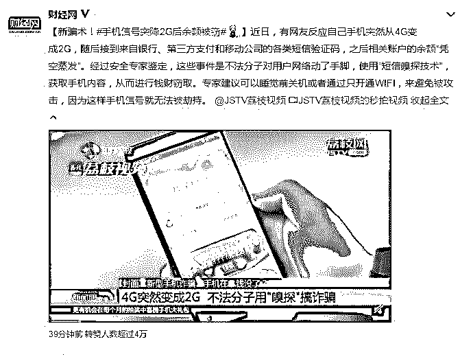
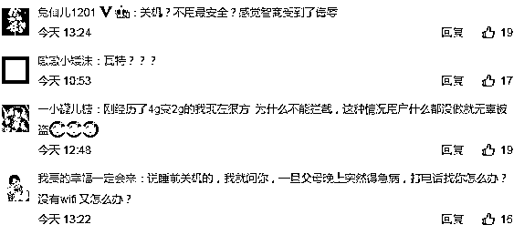
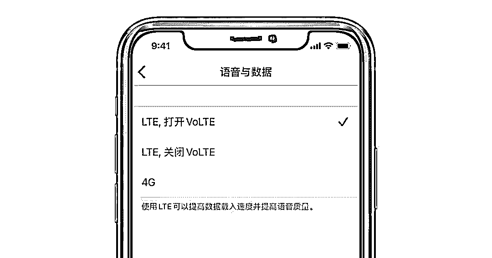
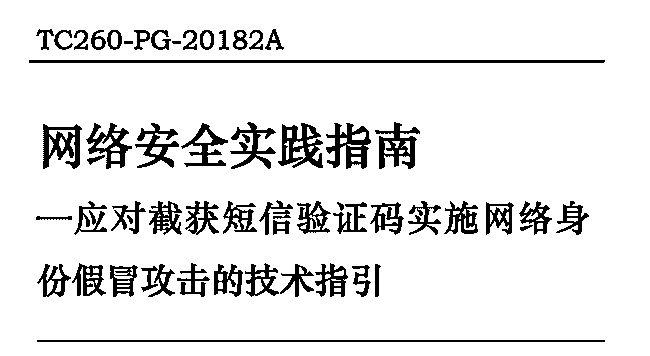

# 手机在：钱没了！专家建议：晚上关机！

> 原文：[`mp.weixin.qq.com/s?__biz=MzIyMDYwMTk0Mw==&mid=2247496886&idx=1&sn=654ccfab5355f76af595b460847763e3&chksm=97cb3f8ea0bcb69892170731dbf8289fbb25dc81f1a03d2fd8357fdd3ca98397e11302adc43f&scene=27#wechat_redirect`](http://mp.weixin.qq.com/s?__biz=MzIyMDYwMTk0Mw==&mid=2247496886&idx=1&sn=654ccfab5355f76af595b460847763e3&chksm=97cb3f8ea0bcb69892170731dbf8289fbb25dc81f1a03d2fd8357fdd3ca98397e11302adc43f&scene=27#wechat_redirect)

**点击上方蓝色字体免费订阅“灰产圈”**

导语

近日，有网友反应自己手机突然从 4G 变成 2G，随后接到来自银行、第三方支付和移动公司的各类短信验证码，之后相关账户的余额“凭空蒸发”。

其实这类事件并不算新鲜事了。去年，豆瓣网友“独钓寒江雪”的文章《这下一无所有了》曾刷爆整个网络，她以切身经历讲述了自己在毫不知情的情况下，支付宝、京东及关联银行卡被盗刷的全过程。

经过安全专家鉴定，这些事件是不法分子对用户网络动了手脚，使用“短信嗅探技术”，获取手机内容，从而进行钱财窃取。

所谓短信嗅探技术，是在不影响用户正常接收短信的情况下，通过植入手机木马或者设立伪基站的方式，获取用户的短信内容。这其中就包括来自银行、第三方支付平台和移动运营商的短信验证码。

据了解，在 2G 通道下进行的短信和通话信息使用的是明文传输，其安全性不够。为成功劫持信号完成短信嗅探，不法分子会干扰 3G 和 4G 信号，强制让用户“降维”到 2G 网络状态。这就是前面提到的 4G 信号突然下降到 2G，很可能就是受到了干扰。

手段

一般来讲，这样的作案手段可以分为四步：

首先，利用 GSM（2G 网络）设计缺陷，通过伪基站自动搜索附近（一般是周边几百米内）的潜在手机号码。

其次，通过查询地下出售的个人隐私数据，或登录第三方支付平台、网上银行等，碰撞查询到目标手机号码对应的身份证号码、银行卡号等。

第三，通过短信嗅探设备，嗅探目标手机号码收到的验证码及运营商、银行所发短信。

最后，在网上银行或者移动支付平台，通过验证码登录、修改账户信息，进行账户支付、借贷等资金流转操作。

源头

那么这些嗅探设备哪里来的呢？ 

只要在互联网和社交软件搜索，就可以发现大量嗅探设备交易帖和交流群。此前央视记者实测，有卖家表示全套设备需要 8500 元，盗取第三方支付账户余额的相关设备则需 2 万元。

***全部车载嗅探攻击设备，从上到下依次是变压器、嗅探信道机、电脑、车载电源（图片来源：******终结诈骗）***

规避

**用户如何避免？**

仔细观察不难发现，这类案件一般发生的时间是深夜，不少受害者都是早上起床后发现手机收到很多验证码和银行扣款短信。这是因为嗅探设备只能嗅探但不能拦截短信，因此犯罪分子通常会选择在深夜作案，这时受害人大多在酣然入睡，不会注意到短信异常。

为此，有专家建议，可以睡觉前关机或者通过只开通 WIFI，来避免被攻击，因为这样手机信号就无法被劫持。

不过对于这样的建议众多网友并不赞同。关机确实是保险的方法，但是这无疑是牺牲了用户权益，给用户带来不便。

安全

**作为普通用户，我们可以做的还有：**

开通 VoLTE 功能，让短信通过 4G 网络传输，防范无线监听窃取短信。

我们已经了解到，嫌疑人要实现盗刷，其中的一项条件就是，受害者手机号必须是中国移动和中国联通，因为这两家的 2G 是 GSM 制式，传送短信是明文方式，可以被嗅探。因此如果你是其中一家的用户，请及时开通 VoLTE。

中国移动用户可发送 KTVOLTE 到 10086，即可开通；中国联通用户可发送 DGVOLTE 到 10010，收到回复确认方式后，回复“Y”即可开通 VoLTE 功能，并立即生效。

而就在前几日，苹果推送了 iOS 13.3 正式版系统更新，中国联通用户等待已久的 VoLET 功能也正式到来。

但也可以看到，对于防范措施来说，普通用户能做的，十分有限，并且也不能一劳永逸。

运营商

**运营商能做什么？**

其实只要数据流量、通话、短信走 3G 或者 4G 通道，安全系数还是比较高的。最大的“罪魁祸首”2G 网络，因此建议运营商加快 2G 淘汰，确保信息最大程度的安全。

目前已经有很多国家关闭了 2G 网络，包括日本、韩国、美国、新加坡等多个国家、地区的 20 多家运营商已经正式关闭了 2G 网络。中国的运营商也在努力迁移用户，关闭 2G 网络。

金融机构

**相关的金融机构能做什么？**

从短信嗅探技术盗刷他人金融账户的案例来看，目前，被多数金融机构采用的基于账户登录密码和短信验证码的“双因子安全认证”虽然方便，但存在较大的风险。

对此，有关专家建议，在“双因子安全认证”出现漏洞的情况下，包括银行和第三方支付平台在内的金融机构应加强安全因子的多重验证，推出更为完善可靠的校验手段。

在这方面，苹果、谷歌等企业就采用了多重验证之类的方案。

结尾

实际上，去年年初，三大运营商和各互联网公司的安全专家们，一起编制了《网络安全实践指南—应对截获短信验证码实施网络身份假冒攻击的技术指引》，提出多项加强身份验证安全性的建议，除短信验证码外还新增了短信上行验证、语音通话传输、常用设备绑定、生物特征识别、动态选择身份验证方式等等诸多二次验证机制。

但目前的难点在于，还无法完全抛弃短信验证码。毕竟国内网民大多是从移动互联网时代成长起来的，手机就是唯一的标识。而使用短信验证码验证用户身份的技术，已被广泛应用于各类移动应用和网站服务。

为此，当下希望第三方支付机构要注意资金安全，发现异常及时停止服务，避免用户损失。同时，第三方支付也要和银行开展配合，形成更立体强大的风控体系。

此外，我们也寄希望于各方能建立更完善的安全机制，来保障普通用户的权益。对于非法买卖、使用短信嗅探设备的行为也应该加大打击。

← 向右滑动与灰产圈互动交流 →

**阅读原文加入灰产圈高端社群**