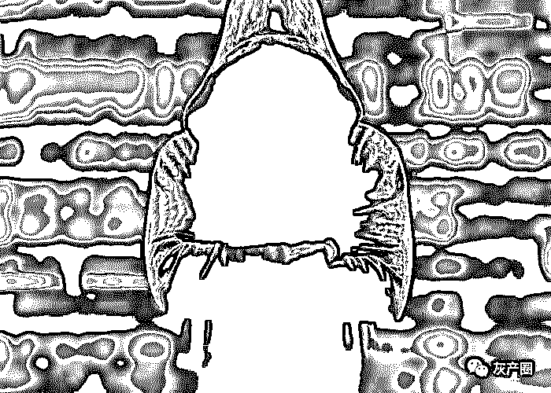
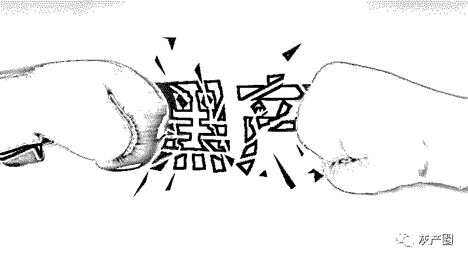
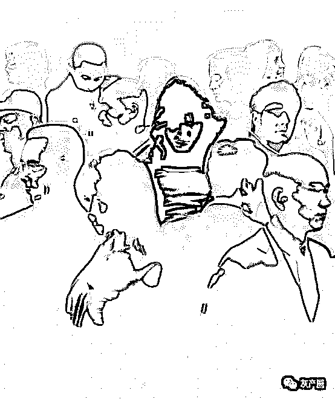
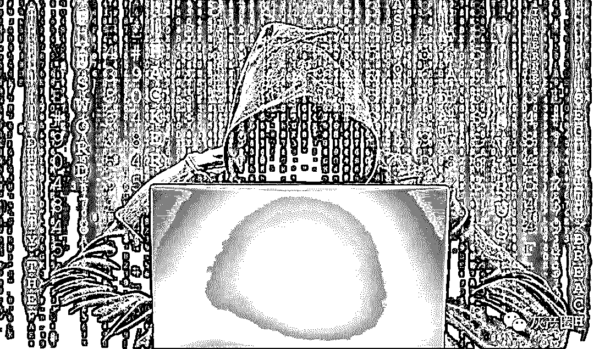

# 卧底暗访网络黑产： “90 后”“00 后”成黑产军团“主力军”

> 原文：[`mp.weixin.qq.com/s?__biz=MzIyMDYwMTk0Mw==&mid=2247496879&idx=1&sn=bc87abf492feb556ae9002e845a3fdec&chksm=97cb3f97a0bcb681f1c130f8153349ddc6f69a417fbc4f2d6392a8fe31e8789f045894656617&scene=27#wechat_redirect`](http://mp.weixin.qq.com/s?__biz=MzIyMDYwMTk0Mw==&mid=2247496879&idx=1&sn=bc87abf492feb556ae9002e845a3fdec&chksm=97cb3f97a0bcb681f1c130f8153349ddc6f69a417fbc4f2d6392a8fe31e8789f045894656617&scene=27#wechat_redirect)

**点击上方蓝色字体免费订阅“灰产圈”**

导语

   互联网新语境中，国人耳熟能详的“薅羊毛”，也从一个原本中性的词语，变成了贬义词。

　　“我跟叔叔生在农村，长在农村，小店是我们的命根子。求求各位不要再投诉，给我们留一条生路吧！”2019 年 10 月 26 日，一家由叔侄二人经营的淘宝水果店“果小云”在网上发出求助。

      他们经历了什么？原来，由于操作失误，店主把 26 元 4500 克的脐橙标成了 26 元 4500 斤。随后，在 B 站视频主“路人 A-”的带领下，1 万粉丝下单“薅羊毛”，一天拍下 23 万件 1 亿多斤脐橙，涉及金额 700 多万元。在店家无法发货的情况下，“路人 A-”又号召粉丝们恶意投诉“商家虚假宣传”，网店对每个投诉需赔付 400 多元，使商家数万元保证金全部被扣完，面临关店倒闭。

　　2006 年，一款名叫“熊猫烧香”的网络病毒，曾令成千上万中国网民叫苦不迭。人们开始见识到网络病毒的强大破坏力与网络黑产的利益链。13 年后，一则恶意“薅羊毛”将店家“薅”到几近破产的新闻，再次提醒人们：网络黑灰产在中国由来已久，并且眼下的新问题层出不穷。

网络黑灰产的新面孔

　　10 月底淘宝店家“果小云”的遭遇，并不是近年来网络恶意“薅羊毛”的个例。此前，根据北京市海淀区人民检察院消息，一位 1993 年出生的在校大学生使用脚本程序，批量注册了某母婴 App 的 20 万个账号，并筛选出两万多个可以参加“奶粉买一赠一”活动账号出售谋利。

通过这个途径买奶粉的“羊毛党”，“薅”走奶粉约两万多桶。2019 年年初，电商平台拼多多出现系统漏洞，一时间用户可免费领取 100 元无门槛购物券。消息一出，广大网友自然不愿错过机会。尽管很快进行补救，但拼多多还是在一夜之间被“薅”走近千万元。

之后，拼多多方面就此回应，有黑灰产团伙通过一个过期的优惠券漏洞盗取数千万元平台优惠券，进行不正当牟利。而类似刚过去不久的“双十一”等大型促销活动，更是恶意“羊毛党”，乃至网络黑灰产的“盛宴”。

　　究竟什么是网络黑灰产？

黑产，是黑色产业的简称，而网络黑产是指通过网络利用非法手段获取利益的行业，比如利用互联网商业行为的漏洞实施攻击以牟利。“与黑产类似的，还有灰色产业，它主要是游走在法律法规等规定不明确的边缘地带，通过打‘擦边球’等方式不当获利。”

　　网络黑产与网络攻防技术密切相关。利用网络漏洞实现网络攻击是形成黑产的基本前提，而具体形式演化至今，已经有非法获取隐私信息、渗透攻击、利用恶意代码、流量劫持、分布式拒绝服务攻击等。

“当前，黑产技术与云计算、大数据、移动网络和人工智能等新技术结合的趋势愈发明显，由此导致的黑产技术的全新升级，使得互联网安全形势越发严峻。”

　　在不断更新的互联网技术“加持”下，黑灰产营利手段随之越来越多。如今，常见的除了早先的实施勒索病毒攻击与上述提及的恶意“薅羊毛”，还包括植入软件暗扣话费、恶意推送广告流量变现、手机 App 分发恶意软件、通过手机木马刷单等。

　　在互联网技术不断更新的浪潮下，这些网络黑灰产的新面孔正暗流涌动，屡屡令网络监管平台与电商防不胜防。

恶意“薅羊毛”只是“冰山一角”

　　若不是过去一年恶意“薅羊毛”的事件一而再再而三出现，可能其背后的网络黑灰产正如名称那样，将持续隐藏在公众视线之外。而就在 2019 年“双十一”过后，记者卧底多个 QQ 群，发现恶意“薅羊毛”只是如今网络黑灰产的“冰山一角”。

　　“带你们开个车，免费拿衣服，听指挥就行。”每晚，这样的“开车信息”在“吃货群”里络绎不绝地出现。

　　在一个名为“十七——淘宝吃货、京东吃货”的 QQ 群中，记者看到群主在群公告中写道：“很多人不知道淘宝退款是什么意思，其实淘宝退款俗称‘吃货’。”接着群主又分别对“吃货”的“原理”与流程进行了解释：

“1。拿到货后，货自己留下，然后再把本金退回来，这样就是 0 元撸实物。不花一分钱，就能买到自己想要的东西。退款方法和思路有很多，这里就不一一多说了。

2。应该有很多人不理解为什么淘宝给我们退款，因为他是假货，假货侵犯正品的权益，所以淘宝会支持我们退款。

3。很多人也会问淘宝退款违法吗？货是淘宝判给我们的，钱也是淘宝退给我们。我们怎么违法了？要违法，也是店家违法，因为是他们卖假货，侵犯了我们的权益。”

　　经过进一步了解，发现这是一个恶意退款群。在“行业”内部，这被叫作“吃货群”。只凭上述这一段文字，或许还不能看出恶意退款究竟如何操作，但之后群里出现的一个个商品链接，让记者明白了其中的门道。

在电商平台上，以部分知名的运动品牌耐克与阿迪达斯为例，除了有这两家品牌的官方旗舰店，还有一些专门卖高仿的个人店家，即人们熟悉的“莆田鞋”。很多消费者在看到这些店家给出的商品价格后，自然心知肚明。

　　如今，这些专卖高仿的店家被广大“吃货群”盯上，成为其牟利的渠道之一。根据记者观察，群里每天都会由群主或是管理员多次发布运动品牌的商品链接，从价格和渠道不难看出是高仿。

群里的粉丝便会按照发布者的指示，先购买这些商品，等商品到货后，再立马以“买到假货”等理由申请商家退款。而一旦商家不同意，这些人便扬言要进一步投诉商家，要求商家“假一赔十”。记者从群内聊天截图中看到，一个“吃货”对商家说道：“你帮我处理吧。假一赔十到时候你可不好受，你自己小心点吧。”卖高仿的商家在此过程中自知理亏，往往选择同意退款，息事宁人。如此一来，“消费者”便做到了不花一分钱，白白“薅”到一件衣服或是一双鞋子。和传统“打假”相比，这种退款行为多了“威逼”的气息。

　　除了上述总体“流程”的介绍，在“吃货群”内，人们还能找到更详细的“退款教科书”。这些“教科书”多为固定的话术，用来教群成员如何与电商的店家沟通，从而实现退款不退货。在一个名叫“举报用语整理”的文档中，看到一段文字：

“我看是代购的以为是正品，结果拿到我朋友的 nike 专柜一看是假货！旗舰店卖 1200 多块而且有发票！这个没有发票，就只有一个盒子和一个鞋子，而且价格差距非常大。

鞋子打开有一股刺鼻的味道，我非常难受！希望店小二，严打假货！还大家一个正品的购物环境！严惩这种淘宝钻空子假冒伪劣的商家，请小二明察！如果卖家仍然坚持自己的是正品，请上传进货单、发票、小票、Nike 授权书！”

当群里的“吃货”凭借这样的话术，便能够从那些卖高仿耐克的淘宝店家 0 成本“薅”到衣服或鞋子。群里的人把这种行为叫作“上车”，而一旦得手，就是“下车”。

　　能够“上车”的不止于“莆田鞋”或者衣服，牛奶、水果也是这批“吃货”的重点对象。

一名管理员在群里一天之内多次分享了成功 0 元“薅”到牛奶的截图。从截图上发现，每次申请退款的理由集中于“污渍”与“包装破损”。随后，记者找到这名管理员进行“咨询”，对方发来一份“酸奶牛奶退货教程”。原来，这些“吃货”在网购整箱牛奶到货后，故意弄破其中一盒，将牛奶撒得包装盒上到处都是，显得一片狼藉，以此营造出一种“污渍”与“包装破损”的迹象。更有甚者拍下牛奶生产日期照片，简单粗暴地通过修图软件将牛奶保质期改为过期，以此找商家退款。

　　当记者表示想进一步了解时，这名管理员便要求转账。在对方的个人介绍中写道：“收徒 288 元，链接 18.8 元。”其中，收徒指长期提供“吃货”思路和咨询，链接是指提供一组可以稳稳“下车”的商品链接。“快过年了，拜师的话我不仅会发‘上车’链接和思路，还有其他一些赚钱项目分享给你，让你多赚点钱过个好年。”对方向记者说道。

　　必须指出的是，“吃货”在选择店家时也是有讲究的。他们倾向于挑选电商平台上那些具备“极速退款”、“闪电退款”条件的店家。所谓“闪电退款”，是指符合退款条件的消费者申请退货并寄出商品后，即可收到平台的退款，无需等待商品抵达平台仓库。这本是电商平台为照顾消费者权益而推出的措施，没想到却让众多恶意退款的“吃货”有了可趁之机。

　　有组织还有“纪律”，核心成员又不断层层向下发展，恶意退款如今已形成自身一套完备的网络黑灰产业链。涉及面广、传播速度快且无技术门槛，具备网络黑灰产典型特征的恶意退款，已成为这一领域的代表。

“90 后”“00 后”成网络黑灰产“主力军”

　　每天整点，“吃货群”的全体成员通知如约而至。“前方高能”、“赶紧上车”，各种撸货、教学链接，如同病毒一般，在 QQ 群的世界中拉人、“上车”、退款、“下车”。管理员时不时出现，展示着各种“薅”来的战利品，如一后备厢的鞋子，一堆衣服以及各种零食、水果。

　　根据记者观察，“吃货群”里的人可以分两类：一类是大部分的普通“吃货”，他们只是按照群内的链接去“薅”商品；而另外一类，是职业“吃货”。与普通“吃货”相比，这些人不仅“吃”，还要“赔”。他们的目标不局限于让商家给自己退款，还要按照“假一赔三”、“假一赔十”等法律法规去索赔。职业“吃货”的日常，除了寻找那些能“上车”的电商，也通过“收徒”不断壮大自己的队伍。在这些终日游走在法律边缘的“吃货”群体中，很大一部分是“90 后”、“00 后”，多为校学生。

　　为什么年轻人会成为恶意退款乃至网络黑灰产的“主力军”？因为这一行普遍不需要专业技术支撑，最大的成本是时间，而年轻人最不缺时间。作为一门“生意”，不需要太多的原始投资，同时涉及金额不大，一般情况下难以构成真正的违法犯罪行为。

　　“相信兄弟们都是学生，年龄应该在 16 岁到 24 岁之间。撸界，可以让我们这些学生变得有钱，而且在身边的朋友面前有空间排面。为什么说空间排面？你玩撸界，你的说说浏览会破千，而不玩的人也就是几十几百个。”“吃货群”中的一个管理员在发布教程之后说道。从群里的年龄结构看，“90 后”与“00 后”占到了 800 人中的 85%。

　　此外，记者还在“吃货群”注意到一些细节。或许是出于群内聊天内容的担忧，管理员们在大量发布“吃货”链接后，会不定期发一些“支持腾讯净网行动”、“社会主义核心价值观”的文字或图片刷屏，以防封群。当有新成员加入并对恶意退款行为产生疑惑时，那些职业“吃货”常说：“没事的。自己多去看看淘宝的规定不好吗？”

网络黑灰产：法律、平台与店家的共同难题

　　在上述案例中，电商平台的特质决定了店家在面临恶意退款时，通常都会同意退款，“花钱消灾”。因为不这样做，可能就会遭遇作为卖家的“灭顶之灾”——商品链接被下架。

　　根据各大电商平台目前的规则，如果店家的某商品因短时间内遭受大量投诉，很大概率会被系统紧急下线。商品下架对于店家是致命打击。一旦下架，商品就失去了原有的搜索排名。如果要重新在排名上拥有一席之地，就不得不每天花费一两百元，借助平台的直通车推广。即便这样，当辛辛苦苦操作一两个月，等到排名好不容易再次上升，一切对于店家而言为时已晚，因为原有客户都已纷纷流失。总之，面对恶意退款甚至索赔，店家尽快“花钱消灾”，失去的是当下的利益，否则被损害的就是自身的长远利益。

　　这种店家陷入进退两难的境地，对平台而言也是一道难题。某知名电商平台的一名公关负责人表示，在平台眼中，消费者和商家的权益都需要保护，商家和消费者之间的纠纷，首先由交易双方协商解决，协商不成可申请平台介入。平台会根据具体情况判责，目标是维护公平的交易秩序。

　　对于上述恶意退赔的“吃货”，现在电商平台已经着手从用户历史行为进行分析和分层，“很多职业‘吃货’的行为有明显特征，我们可通过大数据识别，确认后予以封禁。”这名负责人称，但目前职业“吃货”群体不断扩大，注册小号的成本也低，导致平台不能完全进行事先有效识别。

　　网购本身就是新时代新技术的产物。维护网购的交易公平，同样离不开技术支持。“避免风险发生，首先要加强平台应用系统和数据的安全性，尽量减少漏洞。其次应密切监管促销之类的特殊业务，如出现业务数据异常，早发现、早处理，及时封堵漏洞。此外，要积极配合公安部门调查，提供详细证据，以实现追踪溯源、依法打击。” 技术并非万能，但加强平台对于恶意退款和索赔的规制，没有技术是万万不能的。

　　另外，针对恶意“薅羊毛”与恶意退款等新型网络黑灰产涉及的法律问题，记者咨询了上海君悦律师事务所朱平晟律师。朱平晟表示，这其中的情况较为复杂，需要分开讨论。“我认为要区分情况，像果农被恶意‘薅羊毛’这一类应属民法通则中的显失公平。商家可以撤销订单，因为这是明显的误操作而违背真实，所以不应该支持买家(羊毛党)维权。

至于恶意退款，我们也要分情况讨论。像‘莆田鞋’商家被要求退款，因本身存在假货问题，很难讲买家不能这么干。但是一群人有组织地去做这件事，‘打假’性质就变味了，更像是‘黑吃黑’，这种行为肯定不鼓励。而那种恶意损坏牛奶然后要退款的行为就比较恶劣，因为它属于恶意造假然后获利。”至于这些恶意退款行为是否构成敲诈勒索，朱平晟表示主要看涉案金额。比如针对“莆田鞋”的假货投诉，即使按照“假一赔三”的原则，金额一般也不超过千元，商家很难以敲诈勒索起诉这些“吃货”，更不用提司法程序本身的成本。

　　当前我国法律对网络黑灰产的监督尚未细化。“对于恶意退款等行为，执法部门主观上很难去区分，法律对此的宣判风向也一直在变。可能之前大家都强调维护消费者权益，那么自然对商家不利。然后最近一段时间又主张保护商家，那恶意退款就会被整治。”但无论法律对具体行为如何界定，在朱平晟看来，恶意“薅羊毛”和“吃货”都是利用了电商对于消费者原有的信任。“这些带有恶意的不诚信行为，实则损害的是社会整体风气。以前电商平台主动推出‘无理由退款’等原则，是基于对消费者的信任，以及对消费行为的照顾。现在这些‘吃货’不怀好意地做这些事，是占了全体消费者的便宜。最终还得让广大消费者买单，因为商家利益一旦受损，就会考虑提高商品成本，从而导致社会成本的增加。”

　　当然，相关监管部门与法律法规也注意到了这些“新兴”的网络黑灰产。11 月 23 日杭州召开的 2019 互联网法律大会上，南都新业态法治研究中心发布《恶意索赔行业观察报告》，指出“职业索赔”已经影响到商家、平台、监管部门、司法部门等多方，破坏了市场营商环境，侵占了消费者正当维权的司法执法资源。报告同样提到，这一恶意行为目前正呈现团伙化、年轻化、产业化等趋势。半个月后，杭州互联网法院对一起案件作出判决，认定被告周某的恶意退款行为明显不符合常人的购物习惯，系滥用淘宝会员权利，损害平台正常运营秩序，判决周某赔偿淘宝网经济损失 1 元及合理支出(律师费)1 万元。

原来，去年周某注册淘宝账号后曾疯狂下单再退款。其中，2018 年 6 月 7 日至 16 日，周某下单 289 笔，其中退款成功 277 笔。尝到甜头后 ，周某又如法炮制。2018 年 7 月 1 日至 7 月 5 日，又下单了 344 笔，再陆续申请退款 343 笔，其中退款成功 335 笔，实际退款金额 18842.53 元。最终，周某的恶意退款行为成功引起了平台与法院的注意。此案也是淘宝网起诉恶意退款系列案件中，法院作出的首例判决。

　　与此同时，2019 年 12 月 2 日，国家市场监督管理总局发布《市场监督管理投诉举报处理暂行办法》，规定“不是为生活消费需要购买、使用商品或者接受服务，或者不能证明与被投诉人之间存在消费者权益争议的”，市场监管部门不予受理。

该规定将于 2020 年 1 月 1 日正式生效。这意味着以“打假”等名义实施恶意投诉和退款的行为将受到规制。有商户也希望借此新规，让各方更重视保护商家的权益，加大对恶意投诉索赔行为的监管，最终令这些互联网消费体系中的“害群之马”无处可遁。

← 向右滑动与灰产圈互动交流 →

**阅读原文加入灰产圈高端社群**