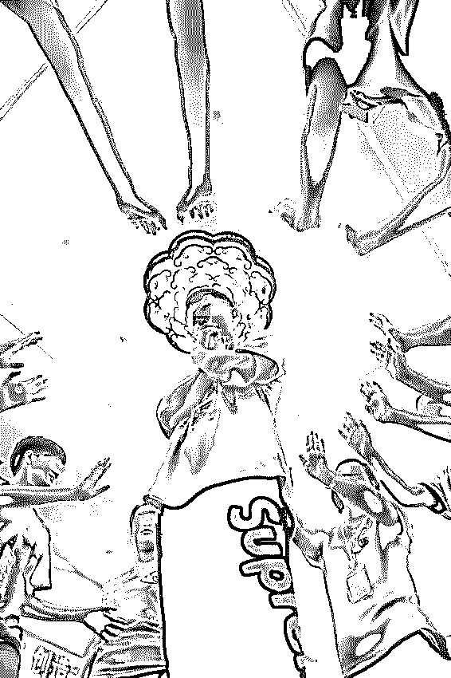
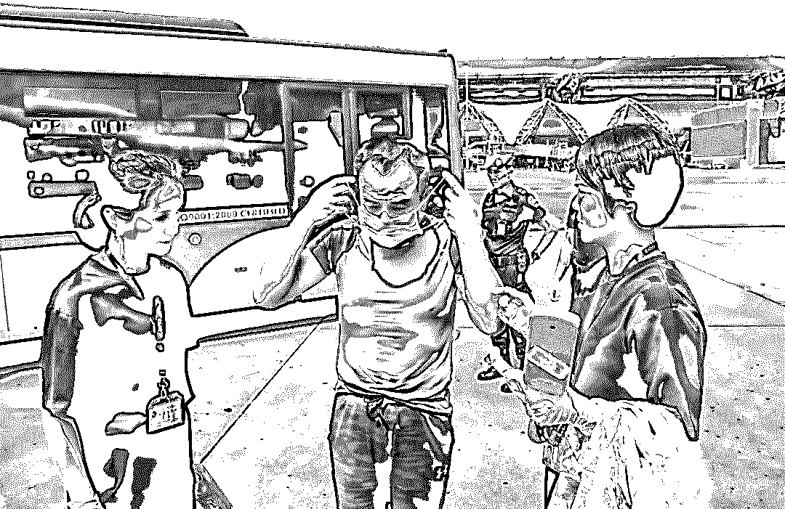
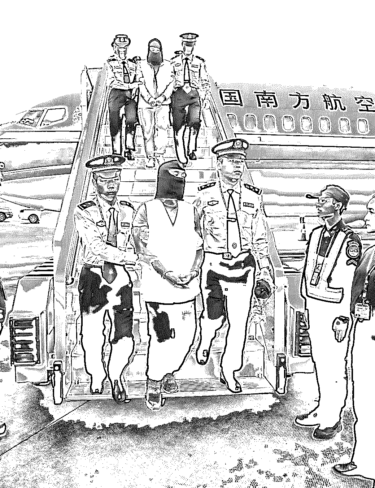
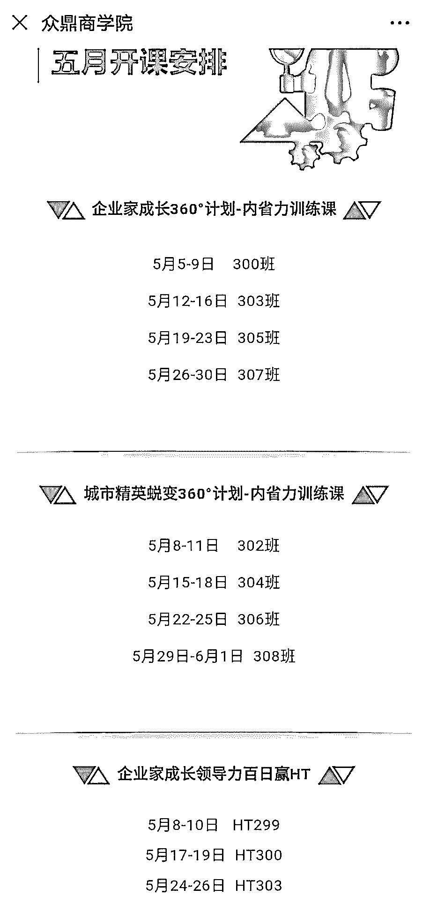
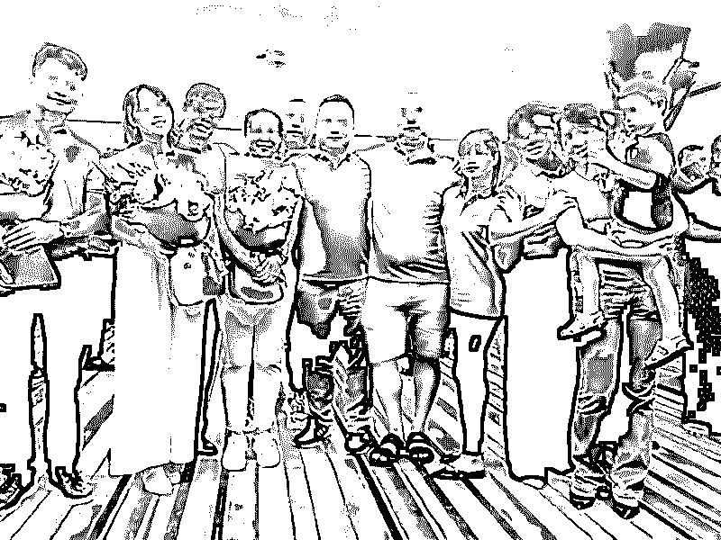
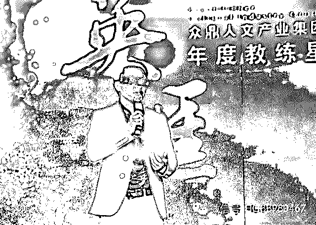

# 精神控制、催眠同化、传销敛财…深圳警方打掉的全国首个“教练技术”组织有多可怕

> 原文：[`mp.weixin.qq.com/s?__biz=MzIyMDYwMTk0Mw==&mid=2247496827&idx=1&sn=83068193b60d2885ee58f6b1022f20c3&chksm=97cb3f43a0bcb65563366689c1f57666622685966a92ab397883bfe13ba116c7610bd08efddf&scene=27#wechat_redirect`](http://mp.weixin.qq.com/s?__biz=MzIyMDYwMTk0Mw==&mid=2247496827&idx=1&sn=83068193b60d2885ee58f6b1022f20c3&chksm=97cb3f43a0bcb65563366689c1f57666622685966a92ab397883bfe13ba116c7610bd08efddf&scene=27#wechat_redirect)

**点击上方蓝色字体免费订阅“灰产圈”**

“全国上千家‘教练技术’培训机构，数百万名学员参与，大部分学员深陷其中，性情大变。轻则与亲友产生矛盾、抛夫（妻）弃子，闹到离婚地步，重则精神失常甚至轻生自杀，说白了就是这些培训机构为了钱啥都干得出来。‘教练技术’已成为和谐社会的一大毒瘤。”这段话是屈某从业 20 年的肺腑之言。作为深圳市众鼎商学院（下称“众鼎公司”）一阶段总教练，20 年前，屈某放弃年薪百万的总裁职位加入到“教练技术”培训行业。

“教练技术”起源于美国，上世纪 80 年代被引进到企业管理领域，“企业教练技术”应运而生。1999 年，香港人黄荣华在深圳注册成立汇才人力技术（深圳）有限公司，将其正式引入中国内地并在深圳得到推广。最早，由所谓的一二三阶段的生命动力体验式培训而来的“教练技术”培训课程，号称通过改善被教练者心智模式的培训后，可以让人的心智、潜能得到全方位提升。而在反“教练技术”人士眼里，所谓的“教练技术”就是一个彻底以精神控制、催眠同化为手段，以老学员拉新学员来敛财的集传销、邪教为一身的犯罪组织。

学员团建活动现场。图源：众鼎商学院微信公众号

2018 年，深圳公安机关发现众鼎公司以“教练技术”为幌子，对学员通过“唤醒——蜕变——感召”三个阶段进行“改造”，形成以感召“海星”（新学员）精神控制为目的的非法培训机制，并引诱、逼迫参与者采取暴力和“软暴力”等手段不断发展“下线”人员参与，大肆骗取钱财。

众鼎公司的培训方法、手段还涉及违背社会伦理道德相关内容，严重扰乱经济社会秩序。2018 年 9 月，深圳公安机关对众鼎公司的违法行为实施破案收网行动，成功抓获涉案人员 85 名，冻结资金 2700 万元。目前，薛某顺、查某等 20 名犯罪嫌疑人因涉嫌强迫交易罪被检察机关批准逮捕。

据悉，去年以来，深圳市有关部门重拳出击，查处关停一大批此类培训机构，防止其死灰复燃，营造规范良好的培训市场秩序。

2018 年 10 月，“教练技术”行业“大咖”查某被押解回国。本报记者 景国民 摄

起底“有害培训新型传销”

2018 年 10 月 26 日，一架从泰国曼谷起飞的中国民航包机抵达广州白云机场，17 名外逃经济犯罪嫌疑人被集中押解回国。其中，除一众 P2P 高管外，还有一名“搭便机”的神秘人物——国内“教练技术”行业“大咖”查某。查某的落网，标志着国内首个被警方打掉的“教练技术”培训机构核心骨干悉数归案。

潜逃泰国的众鼎公司核心骨干查某被押解回国。本报记者 景国民 摄

中小企业主成围猎“目标”

虽从深圳市众鼎商学院（下称“众鼎公司”）结束培训已有两年之久，但李标（化名）仍不愿面对那段经历。

2012 年，李标完成了从个体户到企业主的转变，成为一家贸易公司的老总。由于自感能力欠缺，李标带着强烈的求知欲，开始去各地参加各种增强企业管理能力的培训。

“想让公司规模更大，自己能力更强，更被员工认可。”李标告诉记者，2016 年 8 月，在东莞的一个培训班上，他认识了一名在深圳做装饰建材生意的女老板，两人都是抱着增强个人企业管理能力目的而来，于是很快就聊到一块。

“她同时报了几个培训班，其中深圳众鼎公司的培训对她帮助最大，于是她将那家培训机构介绍给我。”李标回忆，当时他正苦于找不到合适的培训机构，于是两人认识的第二天，他给介绍人转了 4.5 万元让其代交学费。

很快，李标就接到众鼎公司工作人员的电话，核查其是否达到报名学习的门槛：公司年营业额必须在 500 万元以上。同时，该工作人员还从公司名称、行业、员工数量、家庭背景和教育背景等方面对李标进行了初步了解。

2016 年 9 月，李标来到众鼎公司的深圳坪山培训基地，开始接受以增强企业管理能力为目标的培训。他发现，众鼎公司主要招收中小企业法人代表、股东、高管为学员。

密集的课程安排学员团建活动现场。图源：众鼎商学院微信公众号截图

**第一阶段：****混淆概念夸大罪责**

培训第一阶段的总教练屈某是个 50 岁出头、温文尔雅的中年男子。见他两手空空，没有带讲义和教案，“他要凭一张嘴上完这 4 天 3 夜的课吗？”李标心中略有好奇。那些刚完成三个阶段课程的学员也引起了他的注意：回公司做“义工”，他们个个精神抖擞，西装革履，配合导师维持课堂秩序。

在第一阶段 4 天 3 夜的课程里，屈某以认识自我为主题，一个个“包袱”和故事被抛出，吸引了大部分学员的注意。如在昏暗的灯光下，他向学员分享物质匮乏年代，父母含辛茹苦抚养子女的艰辛，将学员带入愧疚和感恩的自责中。在助教的带领下，学员开始情绪失控、捶胸顿足、嚎啕大哭、喃喃自语……

李标并不排斥这些故事和众多体验式游戏，还通过给曾经伤害自己的人打电话，挽回了一名欠债不还，但有着多年交情的朋友。

屈某和查某是业内知名的第一阶段导师。

屈某在接受记者采访时坦言，第一阶段主要是用平和的方式给学员灌输一些虚的、适合大众的价值观，以增强学员的自信心，让学员在“内省”和“困难逆境”中突破，做到以前不敢做或者做不到的事。

“也有学员对第一阶段的课程提出异议，但助教总是吊胃口，说惊喜和最精彩的内容在接下来的两个阶段，以此留住学员，避免提前‘下车’（不愿继续上课而离开）。”李标说。

**第二阶段：****压迫心智否定自我**

经历了温和的第一阶段，李标迎来了第二阶段——魔鬼阶段。在这个阶段，不仅有“魔鬼导师”，更有魔鬼式经历。

“一进教室，里面没人，时间一长就有学员开始骚动，上厕所、走动、打电话的现象开始出现。这时，一名年近 40、个子不高的短发女子突然走进教室。”李标回忆说，这名女子就是第二阶段总教练荆某，她戴着耳麦，伴着音响里传来的巨大骂声走入教室。

“你看你，年纪这么大了，还混成这样，失不失败！”

“还有你，一点担当和自律意识都没有，才导致你和你弟经营的电商平台出现今天的局面。”

……

荆某将全班近 40 名学员挨个骂了一遍。“太恐怖了，她能踩着每个人的痛点来训斥。”李标说，不仅总教练骂，助教也跟着骂，骂到几乎哭声一片。当然，那些受不了或是不吃这套的学员，都被教练请出教室，然后再让小组成员拉其回来。

李标并不知道，荆某进教室前不仅对每个人做足了功课，还躲在教室外观察学员的一举一动长达 15 分钟，甚至更长。

“第二阶段几乎不给人喘息的机会。”李标回忆，这 5 天 4 夜完全是一种魔鬼式训练。课程安排得极为紧凑：早上 7 点起床，中午简短用餐，名义上晚上 10 点结束学习，但分组讨论之后一般都过了深夜 12 点，然后就是拼命赶作业，一般都是第二天凌晨两三点才睡觉，累到连洗澡的力气都没有。

疲劳战术的作用非常明显。整个第二阶段，每名学员长时间处于封闭、紧张的环境，完全没有思考和分辨能力，只能被导师牵着鼻子走。

“导师还会利用各种机会和学员聊天，把学员所有信息，包括夫妻生活等私密信息都摸得一清二楚，整个人都处于他们的控制之中。”李标告诉记者，学员喜欢称荆某为“魔鬼导师”“灭绝师太”或“荆魔头”，而荆某则给自己取了个“荆露珊”的艺名和“天山童姥”的网名。李标和学员们所不了解的是，只有高中学历的“荆魔头”在众鼎公司的税前年收入是 430 万元。

这一阶段的主题为“蜕变”，“荆魔头”的核心工作就是摧毁每一名学员的心理防线，让他们觉得自己一无是处，必须要改变。

“事后回想起来才觉得可怕，有的学员在第二阶段被整得精神失常，还有好几个被送医治疗，都是拜‘荆魔头’所赐。”李标说。

**第三阶段：****不断营销胁迫就范**

从众鼎公司宣传册资料看，第三阶段的主题是“共赢”和“感恩”，主要锻炼领导力和感召力，实现自己设定的目标，养成新习惯，时间跨度 100 天，集中上课时间为三个周末，分为首周末、中周末、尾周末各三天，贯穿三个周末的核心是——感召。

老学员迎接感召来的“海星”（新学员）。图源：众鼎商学院微信公众号

“感召就是一场人生游戏，不是你感召他，就是他感召你，马云当年就是感召了‘18 罗汉’才有了今天的阿里巴巴。”导师的这句话令李标印象深刻。

这一阶段，教练和助教向学员持续施压。例如：在感召前先分组，每组设定感召目标，每人发表感召宣言，承诺感召“海星”（新学员）数量，然后学员分散出去完成感召任务。期间，教练会对未完成任务的学员频繁打电话施压，如果 24 小时结束后学员仍未完成感召指标，就会有相应的惩罚性措施，如扣缴班费、跑步等。

首个 24 小时的感召目标，李标定了 1 个，却被教练骂了一通，定 2 个还是被骂：“你可以做得更好，却为何非要把自己看得那么怂！”最终，李标将目标定为 3 个。

“24 小时感召，就是看你 24 小时之内能拉来多少人，教练会不停打电话催你。”李标说，只要有学员感召到“海星”，便会马上把“海星”的身份信息传到群里，形成你追我赶的局面。

就算学员完成了感召任务，只要时间未到，教练也会继续催促：“你的潜力还没真正发挥出来，你还能感召更多‘海星’。”

在这样的催促下，在首周末的 24 小时感召课程里，李标完成 7 个感召目标，取得小组第一的好成绩，教练也授之以“班长”这一“光荣”职务。

李标告诉记者，感召都是从身边人，尤其是自己信任的人入手。碍于面子或是生意伙伴关系，对方都会口头答应参加培训。但为确保感召“海星”的上课率，李标只能不停地催促对方交学费，到最后往往都是他被迫出钱“买果子”，也就是为自己感召的学员垫付学费。

第三阶段总教练夏某告诉记者，教练会根据收集的信息分析学员的感召能力，并利用学员的虚荣心恰到好处地给予荣誉、表彰和持续紧凑的施压，像李标这样“买果子”的学员很普遍，“逼果子”的也不在少数，有时还会做出极端的事情。

所谓“逼果子”，就是在学员未完成感召目标或中途放弃的情况下，由教练和全体小组成员出动，逼其继续感召“海星”。常用手法就是去学员家或是单位静坐、拉横幅施压，在此过程中还会发生吵架、打架等情况，造成学员受伤。一般的学员会担心在单位影响不好，于是用各种方法，哪怕是自己掏钱来完成感召“海星”的业绩指标。

“教练看准了我的性格弱点，不停给我下套、压担子，最后我自己掏钱买了 32 个‘果子’。”李标说，在第三阶段，他垫付的学费高达 73 万余元，但部分人从未参与培训或只接受了部分培训。因感召人数成绩突出，李标所在班级获得“冠军班”殊荣，全班 24 名学员和教练获得 5 天 4 夜、价值 1.6 万元的马尔代夫海外游。

直到毕业半年后，李标才意识到，众鼎公司所谓的培训就是传销，于是找上门要求退还剩余课程的学费，但被无情拒绝。

2018 年底，听说众鼎公司被警方查封，李标才到深圳报警。

“家人也劝过我，但我听不进去，导致生意下滑厉害，家也差点毁了。”李标说，除了挨骂，他没学到任何有用的东西，自己也变成他们“拉人头”的帮凶。

“滚雪球”开启疯狂“感召”模式

众鼎公司董事长兼总裁薛某顺。图源：众鼎商学院微信公众号

众鼎公司的灵魂人物是薛某顺。

45 岁的薛某顺毕业于北方某知名理工大学。1999 年，汇才公司将“教练技术”引入内地后，在福建做计算机软件创业的薛某顺闻讯赶去培训，并最终放弃自己的事业加入汇才公司，从一名基层助教做起。

2007 年 11 月，汇才公司因偷漏税违法行为被行政执法机关查处后关闭。之后，原汇才公司的导师和学员在高额利润回报的驱使下，纷纷克隆汇才公司的培训理念和方法进行办班授课。原汇才公司的核心骨干成立宏才公司，继承了汇才公司的衣钵。

2013 年 11 月，薛某顺以 3000 万元的价格收购宏才公司，将其改造成宏才培训机构。随后，薛某顺先后成立深圳市众鼎商学院有限公司、深圳市众鼎商学院在线科技股份有限公司，并实际控制。

成立众鼎公司后，薛某顺开始大刀阔斧进行改革，包括培训内容、时段、地点，以及参与培训人员条件、感召“海星”奖励方法等。薛某顺曾跟公司骨干说，他设计的这套课程可以让培训班像“滚雪球”一样滚起来，从而确保培训不断扩大，公司不断盈利。

如何快速“滚雪球”，答案就是“逼果子”。逼得最凶的那几年是业绩最好、盈利最高的几年，但也是投诉最多、口碑和业界风评最差的几年。可在业内，不怕口碑差，就怕赚钱能力差。对于网络差评，薛某顺一开始并不在乎，但到了 2017 年，随着互联网上关于众鼎公司的负面信息越来越多，一些受害者及家属还成立了“反教练技术”联盟，公司业绩开始下滑，薛某顺下定决心改变公司形象。

“薛某顺想取消感召，于是将第一阶段和第二阶段合并，并提出无理由退学费，如此一来导致 2017 年后公司营收大幅下降，一批骨干也纷纷离开，包括年薪 400 万余元的荆某。”屈某介绍，“2000 年左右，‘教练技术’开始被国人接受，大量银行行长、政府官员、企业家慕名而来参加培训，但发现没太多实际作用后，招生成为难题，于是就有了一级级往下感召的无奈，导致学员素质也明显下降。”

记者了解到，目前全国有上千家“教练技术”行业机构，仅深圳就有百余家，无一不是靠收取高额学费来支撑公司运营。

作案手法

**第一步**

精心包装树个人崇拜，树立导师权威，让学员产生崇拜之心，为接下来的精神控制做铺垫。

**第二步**

引导学员进行情绪宣泄，使其精神处于麻痹状态，打破基本的心理防御。这时候，导师完全掌握了学员的心理状态，以便进一步实施精神控制。

**第三步**

全封闭环境+疲劳战术强力催眠让学员完全处于极度紧张、疲惫、焦虑状态，使其很容易精神崩溃，丧失所有自我判断。

**第四步**

通过辱骂攻击和摧毁自尊的方式让学员完全否定自己，彻底放弃自己原有的判断和思维，以有利于导师对学员进行更有力的精神控制。

**第五步**

学员会按导师指引的方向去实现价值——积极地去“感召”他人，甚至自己掏钱“感召”他人，无形中成为了公司的义务推销员。

以身说法

犯罪嫌疑人 A：当时一直傻傻地以为，只有拉了“人头”、拿了提成才算传销，被抓后细读刑法和刑诉法，才发现自己干的就是传销，只是“拉人头”的提成和收益以工资、年终奖和海外旅游等形式兑现。

犯罪嫌疑人 B:薛某顺在公司和行业几乎是偶像级人物，甚至可以说是“神”一般的存在。但直到他将数千万元资金转移海外，我们才发现他是伪君子。

犯罪嫌疑人 C：这个行业没有春天，只有句号。全国“教练技术”公司上千家，学员少说也有几百万人，如此大规模的培训和组织，很容易成为社会不稳定因素之一。

专家解读：害人骗财培训已成社会毒瘤

针对以众鼎公司为代表的“教练技术”培训模式，记者采访了广东警官学院犯罪学教研室犯罪心理学副教授彭琨、广东警官学院侦查系教授吴明高，以及不愿具名的“反教练技术”人士。他们均表示，“教练技术”课程设计严密精妙，环环相扣，一步步控制学员的思想，最终达到一本万利的目的——将学员变成公司免费的“销售人员”。“如果没有一定的心理学背景，普通人只要全部学完该课程，心理不可能不受影响和控制，只是程度不同而已。”

专家们认为，“教练技术”培训打着提升心智的幌子，用高额的费用、苛刻的规则、故弄玄虚的游戏等手段，把课程打造得非常神秘。其实，该课程不过是运用心理学的一些原理，利用人性的一些弱点，达到对学员实施精神控制并最终高额敛财的目的。**这种培训最大的危害是，让学员丧失对自己和社会的客观、公正、多元化认识，通过“洗脑”的方式“摧毁”学员原有的心理结构，却未设计“协助重建心理结构”程序，于是部分学员出现精神失常状况。**

据了解，在众鼎公司公关负责人处理的 7 宗公关危机中，有 5 起为培训中出现精神异常并被送往精神病医院医治的案例。此外，学员迫于压力在教练目睹下公然在所住小区裸奔,精神亢奋引发伤害案件等令人意想不到的情况也经常发生，甚至出现过学员自杀身亡的案例。

**为了赚钱，“教练技术”公司没有任何职业操守和底线。**2015 年，在山东曾发生过强拉在校学生上课培训的事情。“那时，一个班的学员都是在校学生。由于背上了几万元的高昂学费，很多人最后只能再拉受害者加入，或者直接加入团队成为教练，从而荒废了自己的人生。”

此外，由于参与者多为企业主或高管，因沉溺于“感召”而疏于企业经营，最终放弃事业加入“教练技术”行业的不在少数。

“反教练技术”联盟发起人北哥（网名）介绍，他们将“教练技术”称为“精神传销”，参与者对家人的伤害严重，危害巨大。

“学员变得格外自私，非常苛刻，对家人的付出视而不见，反而作为其负面情绪的发泄对象，对陌生人却异常热情。尤其是夫妻和情侣关系，培训后离婚率和分手率明显提高。”北哥说，那些选择回去做义务助教的，从此与家人再无共同语言，不回家成为常态。

随着行业的快速扩张，网上求助的参与人家属也越来越多，这些人最终走到一起成立“反教练技术”联盟。高峰时，每天新加入的成员多达四五百名。

“反教练技术”人士表示，对正在参与此类培训的学员，**亲朋好友若发现其突然性情大变，对家人态度先热后冷，将“同频”等陌生词语挂在嘴边时，亲属可加入“反教练技术”联盟获取技术支持**，各地“反教练技术”联盟群会针对不同培训、不同阶段的课程提供劝离方案。对深陷其中、造成心灵伤害者，建议求助正规心理咨询。

最后，专家、“反教练技术”人士、受害者家属和警方希望国家有关部门能联手规范此类培训机构，尤其是对设计心理手段的，须对其资质、内容进行严格审查。

[AG 才是网赌界的硬核朋克!](https://mp.weixin.qq.com/s?__biz=MzIyMDYwMTk0Mw==&mid=2247496824&idx=1&sn=3a0c649e1aa072f78889052fc9afd8bc&chksm=97cb3f40a0bcb6569c6739c5166644380a69e4ac6543652a17ac16d21a5f6a4eaf11a8c008ad&scene=21#wechat_redirect)[21 岁日本女星惨遭猥亵，只因自拍瞳孔倒影暴露住址？|一张照片是怎么出卖你的！](https://mp.weixin.qq.com/s?__biz=MzIyMDYwMTk0Mw==&mid=2247496815&idx=1&sn=1057a776b031678930027d7efa706fc2&chksm=97cb3f57a0bcb6419ea1276e3dc752279d6a9f8a0f82b0f26c4ffec31477cb8af470b2fdded3&scene=21#wechat_redirect)[尝试了 108 种方法，我从 ofo 要回了押金](https://mp.weixin.qq.com/s?__biz=MzIyMDYwMTk0Mw==&mid=2247496813&idx=3&sn=c00a766241370e63c2ed8cd47df540ae&chksm=97cb3f55a0bcb6439600ebd6e0405e552808585dd6fb24fc3ddf3b8c1e7241f6f7fc2fdd20a1&scene=21#wechat_redirect)[刷个“戒赌”短视频，“回血”损失 300 万！](https://mp.weixin.qq.com/s?__biz=MzIyMDYwMTk0Mw==&mid=2247496804&idx=2&sn=bc48a1b045016b1fb6bfc691eb74e82a&chksm=97cb3f5ca0bcb64a16b68d32d06d290c9bc8dbe9891f78a5669ae6f65c98c4c89949f17662be&scene=21#wechat_redirect)[一年收割 20 亿！卖的比茅台还贵！起底网红小罐茶背后的营销套路](https://mp.weixin.qq.com/s?__biz=MzIyMDYwMTk0Mw==&mid=2247496792&idx=1&sn=59fb577ab2353adfec6fa702d563a717&chksm=97cb3f60a0bcb676b066cfa5c4ddf4d0f7ebf7030cfb16eab1ede9acd04c0ee49f887ee18a5d&scene=21#wechat_redirect)

← 向右滑动与灰产圈互动交流 →

**阅读原文加入灰产圈高端社群**