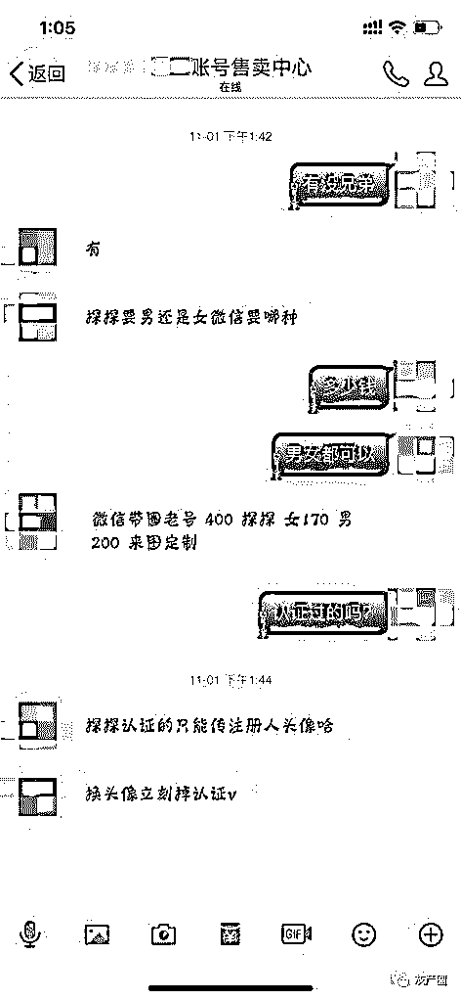
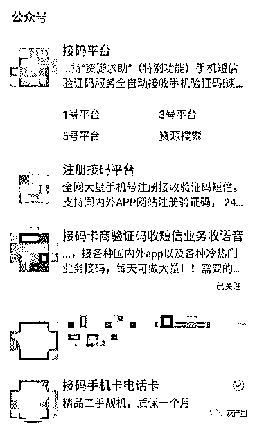
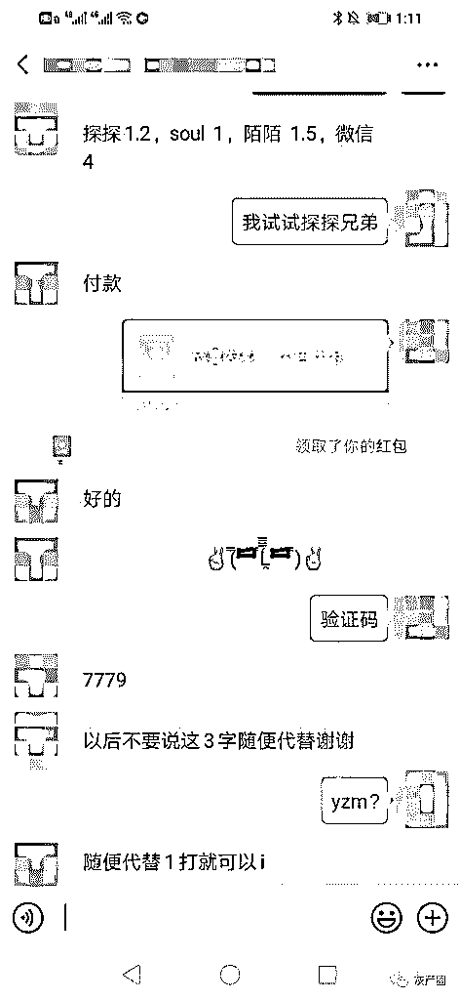
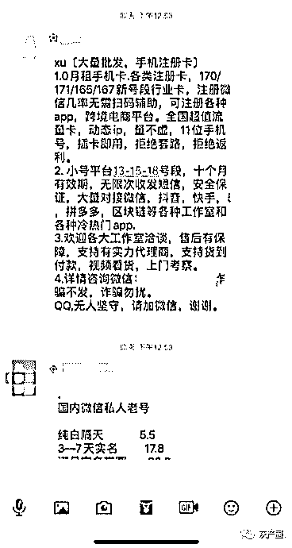
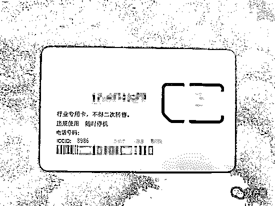

# 薅羊毛、杀猪盘上游的“造号党”：微信号 400 元，探探女性账号 170 元！

> 原文：[`mp.weixin.qq.com/s?__biz=MzIyMDYwMTk0Mw==&mid=2247496804&idx=1&sn=b0b9d47c0176cd0dbf8103799b09b3fd&chksm=97cb3f5ca0bcb64a5e57ce0e8f6f50e256749c599a744be2565df8dbbf9064b18bc278488566&scene=27#wechat_redirect`](http://mp.weixin.qq.com/s?__biz=MzIyMDYwMTk0Mw==&mid=2247496804&idx=1&sn=b0b9d47c0176cd0dbf8103799b09b3fd&chksm=97cb3f5ca0bcb64a5e57ce0e8f6f50e256749c599a744be2565df8dbbf9064b18bc278488566&scene=27#wechat_redirect)

**点击上方蓝色字体免费订阅“灰产圈”**

记者在陈淼的摊位看到，除卡片全身素白外，和日常使用的手机卡并无二样。“ 这就是注册卡，不能打电话，不过可以接短信。”陈淼抬头望了一眼暗访的记者后，指着这摞白色卡片说，“可以用来注册账号，有了账号想干吗就干吗。你如果想要的话，我可以给你发快递。”

导语

“微信带圈老号 400 元，探探女性账号 170 元，男性账号 200 元。”社交账号销售商“禾盛”说。

　　记者调查发现，在账号买卖黑产链条中，以销售商身份存在的“禾盛”只是一个变现末端。位于该黑产上游，藏匿于微信公众号之中的接码平台被暴露出来。所谓接码平台，即接收验证码的平台，只不过用的并非自己的手机卡。陈淼（化名）的柜台中摆着大量“注册卡”。“不能打电话，不过可以接短信。”

　　像陈淼这样的卡贩子，在业内被称为“卡商”。据接近黑产人士透露，黑产人员只需要通过卡商和接码平台即可获得手机号和验证码，再利用自动化程序工具，即可完成整个注册流程。目前，不少接码平台已“入驻”微信公众号，通过他们，可以在短时间内注册多个 App 的账号。接码平台的下游包括“薅羊毛”和电信诈骗等多种黑灰产。前者，曾让不少大型企业损失惨重；后者，则常见于备受关注的网络“杀猪盘”等恋爱赌博骗局。

　　买卖微信、探探、婚恋网账号，黑产爱盯“婚恋粉”

　　“（出售）各种婚恋网、相亲、社交账号。”在一个账号交易 QQ 群中，昵称为“禾盛账号售卖中心”（下称“禾盛”）的用户发布了一则广告。

　　禾盛在广告中称，世纪佳缘、珍爱网、抖音、快手等多个社交平台的账号均有售，作为陌生人社交巨头的探探、陌陌和微信账号也在他的“业务范围”内。

　　“微信带圈（即朋友圈）老号 400 元，探探女性账号 170 元，男性账号 200 元，可定制。”据禾盛介绍，所谓的“定制”便是客户可以指定图片，他们负责作出数据和回复匹配。

　　另一名昵称为“冰果”的销售商表示，“珍爱网账号新号 300 元，带会员 550 元；老号 550 元，带会员 850 元。世纪佳缘带会员 150 元。”

　　记者近日加入多个黑产行业交流群发现，有关账号买卖的广告仍然近乎刷屏。除了 QQ，闲鱼上此类信息也不少。记者在闲鱼上看到大量与世纪佳缘等账号买卖有关的商品展示框。

　　买卖这些账号干什么呢？“杀猪。”简单两个字，是婚恋网站账号卖家李峰（化名）给出的答案。

　　往往，受害者通过社交网站结识近乎完美的婚恋对象，在“恋人”的蛊惑下参与网络博彩，最终全部积蓄和借款在充值进博彩账户后，与“恋人”一起消失。在犯罪分子看来，受害者只不过是用所谓“爱情”圈养的“猪”，养肥了自然要“杀掉”。这种骗局被取了个很形象又残酷的名字——“杀猪盘”。

　　有黑产人士直言，通过婚恋社交平台账号吸收的粉丝，在圈内的行话为“婚恋粉”。因婚恋粉黏性大，变现能力强，在黑产中“备受欢迎”。直白来讲，就是实施诈骗更容易。

　　“是不是觉得我跟傻子似的，我自己都觉得我傻。”受害者张颖（化名）去年八月份在婚恋网站与一名自称“王俊凯”的网友结识。“王俊凯”的颜值加之每天对张颖嘘寒问暖，张颖迅速坠入情网，最终被骗走 18 万。据张颖描述，对方一直避免与她视频，她怀疑，照片本来就是假的。

　　李峰透露，目前该产业链已经模块化发展。“批量注册账号的是一批人，被称为注册商；销售账号的是一批人，即销售商；对账号进行实名认证的又是一批人，被称为认证商。”

　　李峰即销售商中的一员。每个号花 80 元从上家提货，再以 100 元的价格卖出，李峰买卖每个号可以获得 20 元的利润。“我出售的都是裸号，也就是未经认证的账号。”李峰介绍，刚刚踏入此行不久的他每天可以收入几百元。

微信暗藏验证码服务，一条验证码约一元

　　李峰提及的注册商还有一个名字——“造号党”。在“造号党”之上，还存在接码平台、卡商等多个利益链条。

　　对多数人来说，接码平台是个较为陌生的词汇。按照字面意思，可简单解释为“接收验证码的平台。”在黑产从业者的眼中，接码平台被认为是“黑灰产的入门武器”，下游可对接诈骗、薅羊毛、刷单、水军等多个黑灰产。

　　记者调查发现，不少接码平台已经“入驻”微信公众号。

　　“本店主打短信加语音码子。”记者通过一个名为“接码卡商验证码收短信业务收语音”的公众号与“海洋”取得了联系。“（每接一条验证码）探探 1.2 元，soul1 元，陌陌 1.5 元，微信 4 元。”“海洋”表示。

　　“海洋”介绍，具体操作流程为，付款之后，他提供一个手机号，记者将手机号导入到各大 App 后点击“发送验证码”，他便会将验证码发送过来。通过“海洋”发送过来的验证码，记者尝试在探探等平台上输入简单信息后，便可注册成功。整个过程，通常不会超过一分钟。

　　在交流过程中，“海洋”颇小心，为了规避微信监管，他并不会在聊天中提及“验证码”三个字。当记者向其要验证码时，他要求，“不要说那三个字，可随便用其他来代替。”

　　公安部门对验证码黑产的打击在加大。公安部公布的 2018 年 9 起打击整治网络乱象典型案例之中，就有全国首次出现通过运营商服务器批量获取电话“黑卡”及验证码的犯罪模式。

　　据媒体报道，该网络黑灰产团伙与广西、贵州、四川等多省份运营商“内鬼”勾结，利用未投入市场未激活的“空号卡”，搭建平台连通运营商服务器用以注册账号、收发验证码。该公司将“空手机号+验证码短信”上传至接码平台，销售给数十个“黑卡”卡商团伙，以供这些团伙注册微信等互联网平台账号，进而实施刷粉刷量、诈骗、发布黄赌毒信息、网络招嫖等违法犯罪行为。

　　今年 7 月，广东省公安厅网警总队侦破全国首例打击预装手机后门获取验证码注册网络账号的网络黑产案件。经侦查，深圳某科技有限公司为多家杂牌手机厂商提供终端系统方案，在未出厂的手机操作系统底层植入木马黑客程序，只要用户买了手机插入电话卡，在不知情的情况下，其手机号码即被黑客程序控制。此外，该公司还搭建多个接收手机验证码平台，结合事先植入手机操作系统底层的木马黑客程序，把接收到的手机号码和短信验证码用于为下游黑产团伙提供各类网络账号注册服务，每次接码服务费为 0.4 元至 2.5 元。经腾讯守护者计划安全团队技术分析，短信验证码回传后，后台即删除、屏蔽相关短信，导致手机用户无法发现自身号码已被他人利用注册了网络账号。

一张注册卡约 10 元，多用于电信诈骗、薅羊毛

　　根据腾讯发布的《互联网账号恶意注册黑产产业治理报告》，卡商是恶意注册产业链条的源头。“卡商就是注册卡贩子。”一位接近黑产人士告诉记者说。

　　据记者调查，因所需手机卡数量庞大，默认关闭语音功能、资费超低的注册卡受到这些黑产从业者的青睐。“他们用猫池来做群控，可以实现多张手机卡同时作业。”上述接近黑产的人士表示。猫池即一种电子设备，在上面可以插多张手机黑卡。通过猫池可用手机卡接收验证码，也可蓄养大量虚拟账号。

　　一般而言，卡商直接跟接码平台合作，通过猫池将验证码自动发给接码平台，接码平台向“卡商”支付报酬，每条信息收费在 1 角至 3 元不等，卡商基本能“足不出户，月入过万”。

　　在北京某二手手机交易市场的地下，陈淼（化名）面前的玻璃柜台中杂乱地摆放着一摞白色的卡片。“注册卡 12 元一张，数量多的话价格好商量。”

　　记者在陈淼的摊位看到，除卡片全身素白外，和日常使用的手机卡并无二样。“这就是注册卡，不能打电话，不过可以接短信。”陈淼抬头望了一眼暗访的记者后，指着这摞白色卡片说，“可以用来注册账号，有了账号想干吗就干吗。你如果想要的话，我可以给你发快递。”

　　不过，陈淼并不愿意透露这些注册卡是怎么来的。一位黑产研究人士 Jane（化名）向记者表示，这些卡中有相当一部分为物联网卡，还有的是虚拟号卡。

　　“物联网卡是通过代理商销售并激活的，并非运营商。”一位天津的手机店老板李通（化名）告诉记者。据李通介绍，“一般来讲，这些物联网卡是严禁在手机上使用的，但是目前却被包装成手机流量卡流向市场。”

　　记者走访了北京两个二手手机卖场，发现其中均有注册卡卖家，价位在十元上下。在多个 QQ 群和微信群，记者也发现注册卡卖家发布的广告。

　　《互联网账号恶意注册黑产产业治理报告》中指出，恶意注册是下游网络犯罪的上游源头行为。

　　以恶意注册行为为核心，上游有提供手机卡号的号商，他们通过包括物联网卡、个别虚拟运营商流出的非实名号、黑产人员与个别运营商工作人员勾结流出的非实名号，以及其他非实名白号和虚假实名号，提供给下游用于注册信息；提供短信验证码或语音验证码的接码平台，提供图像和滑块验证码的打码平台，提供公民个人信息和企业注册信息的“料商”，这些人分别提供了资源用于作为注册信息和身份绑定信息，供应注册行为人进行注册行为。在注册行为完成后，号商会进行养号从而提升号码的价格和防止被安全措施封禁，并最终提供给下游，用于多种下游黑灰产业。

　　下游的黑灰产业，首先就是用于诈骗等犯罪场景。例如上文提到杀猪盘、美女诈骗、荐股类诈骗等，这些账号显然不是真实身份注册的。此外，恶意账号还可能被黑产人士用于薅羊毛，刷粉、刷量和刷单炒信等虚假流量行为，广告营销，其他违法或灰色行为。

　　电子商务研究中心主任曹磊此前在接受媒体采访时表示，国内“羊毛党”已经形成了组织化程度极高的黑灰产组织。上到 BAT，下到初创的互联网公司，只要举办市场活动，都可能面临“羊毛党”的巨大威胁。

专家：需要对监管责任主体进一步明确

　11 月 19 日，最高人民法院发布《司法大数据专题报告：网络犯罪特点和趋势》显示，2016 年至 2018 年，网络诈骗案件被告人主要利用的虚拟犯罪工具为微信、QQ、支付宝等，占比分别为 42.21%、35.23%、15.28%。利用微信实施诈骗的案件在全部网络诈骗案件中的占比逐年快速提高，到 2017 年已有赶超 QQ 之势。微信的普及使其成为 2018 年网络诈骗犯罪分子使用较为频繁的工具。

　　报告还指出，被告人在实施网络诈骗案件时，以冒充他人身份来欺骗受害者的案件占比最高，约占 31.52%。

　　平台加强监管被认为是斩断黑产利益链的重要方式之一。“弱监管是很多平台存在的问题，这让他们（黑产从业者）能够直接在上面去发布广告，联系客户。通过设置关键词等方式来加强信息审核或许不失为改善这个问题的一个突破口。”一位黑产研究人士称。

　　有律师向记者表示，“平台监管缺位为不法分子留下了空间，严格落实实名制度有利于减少信息泄露事件发生。”

　　多名专家表示，要打击这类黑产，最有效的方式是直接打掉其产业链上游的恶意注册工具提供商。

　　早在 2016 年 9 月，工信部、银监会、公安部等六部门联合发布《关于防范和打击电信网络诈骗犯罪的通告》，对电话实名制落实提出了明确时间表，同时对电信运营商开卡给予了数量限制。据媒体报道，参与侦破当时最大验证码平台“爱码”案的沈勇认为，这将从根本上遏制此类平台（即接码平台）的发展。

　　据介绍，成规模的卡商，往往握有几百万张手机 SIM 卡，通过介入验证码平台，可提供上万个网站项目的接收验证码服务。“当时我们发现爱码平台提供的服务项目大概有上万个，价格从一毛到一块不等。半年之间涉案的有历史记录的交易金额大概上千万。”沈勇说。

   近年来，监管一直在加大对源头卡商的打击。去年 3 月，黄埔警方在东区街、萝岗街、长洲街捣毁 3 个“卡商”窝点，抓获 5 名犯罪嫌疑人，缴获作案用的电脑 30 多台、猫池 100 多套、手机卡 40000 多张等。据嫌疑人供述，大量的无名手机卡主要来自以企业或单位名义购买的手机卡，俗称“企业卡”。此类手机卡登记在不同企业名下，多数只有接听来电、收发信息的功能。嫌疑人利用“企业卡”无个人实名登记的特点，为需要规避实名制的各类“客户”（大部分是实施电信诈骗的不法分子）提供服务。

　　网络黑产不断蔓延，河北省电子商务法研究会副会长兼秘书长、河北工程大学副教授马三军认为急需对相关电子商务运营平台进行强监管。“这需要对监管责任主体进一步明确，而今年 1 月 1 日刚施行的《电子商务法》并未规定具体的监管部门与职责划分，仅是一般性规定，在实践中缺乏可操作性，这需要相关部门适时出台相关配套法规或细则来进一步完善；另外网络交易的取证难对监管也形成了新挑战，这方面需要在加强行业自律和创新监管方式上付出更多努力。”

**新京报记者 李大伟 罗亦丹  **

**值班编辑 花木南 吾彦祖  **

[“陈安之”骗局：成功学的神坛和祭坛](https://mp.weixin.qq.com/s?__biz=MzIyMDYwMTk0Mw==&mid=2247496759&idx=2&sn=565425058ef4f64848f26e0fcd26d596&chksm=97cb3f0fa0bcb61960cc3f8dfb1849f758988d614acd4425c0065e187a856020f64c7301c79c&scene=21#wechat_redirect)[“狗代”们的五大手段，引诱了多少戒赌吧“老哥”上当！](https://mp.weixin.qq.com/s?__biz=MzIyMDYwMTk0Mw==&mid=2247496767&idx=2&sn=eca4009cb67076eb5d2c0cb71e5e12eb&chksm=97cb3f07a0bcb611c48b28835572b31d9212273810f0294d55642f22f069a4e8b89ba538f9c4&scene=21#wechat_redirect)[“日租女友，900 可摸，1500 可睡”](https://mp.weixin.qq.com/s?__biz=MzIyMDYwMTk0Mw==&mid=2247496767&idx=1&sn=df6d94dbc1832e93be0c6af37274989e&chksm=97cb3f07a0bcb611723110d1800bcaaa52645d14506e1f5be4a50f459b5be1c705dd75b6920b&scene=21#wechat_redirect)[监管重压，老赖猖獗：投诉威胁金融机构，要求退息退保](https://mp.weixin.qq.com/s?__biz=MzIyMDYwMTk0Mw==&mid=2247496767&idx=3&sn=525ffc025d14914c129355c893915f92&chksm=97cb3f07a0bcb6119d08aa219c5f8641ce894625f409fa6ee11a099de47f9d381ae0b18a2db4&scene=21#wechat_redirect)[网游“搬砖党”，打金工作室。](https://mp.weixin.qq.com/s?__biz=MzIyMDYwMTk0Mw==&mid=2247496772&idx=1&sn=bf15fa232f20d91775f09a2ff54f49b9&chksm=97cb3f7ca0bcb66afb05be616a0e83185c29d551cc5d833ba489a25b529e2c5225e5eed1e28c&scene=21#wechat_redirect)

← 向右滑动与灰产圈互动交流 →

**阅读原文加入灰产圈高端社群**