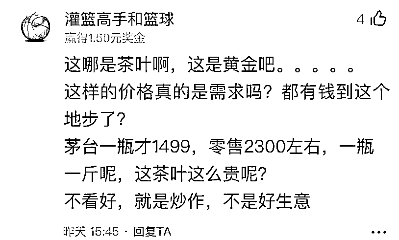
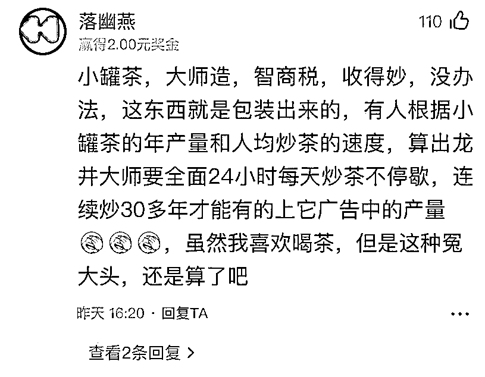
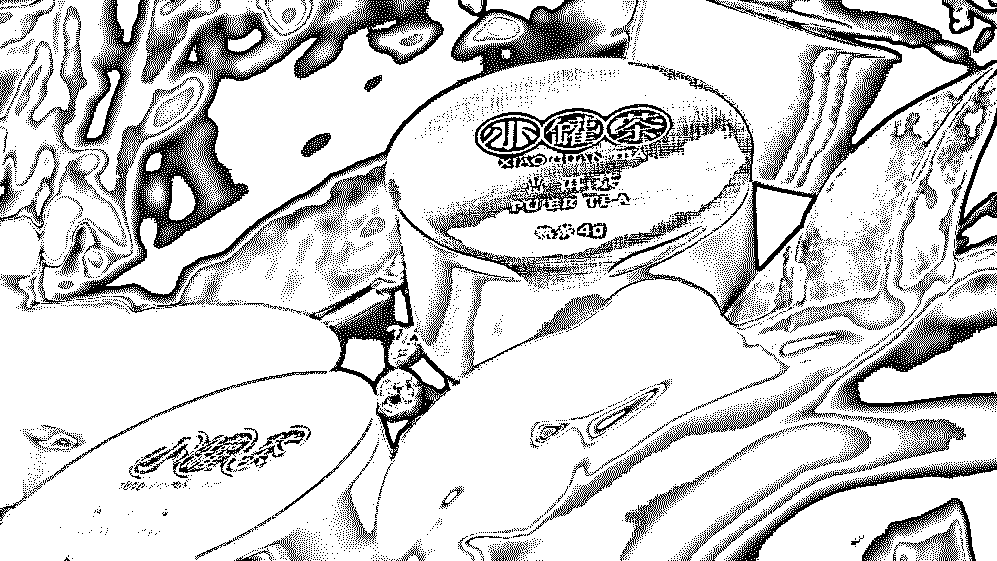
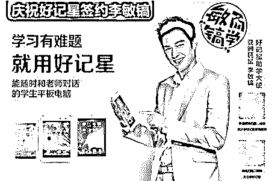
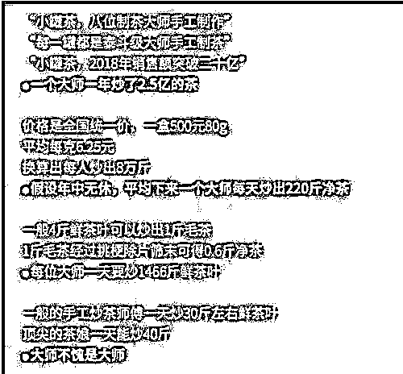
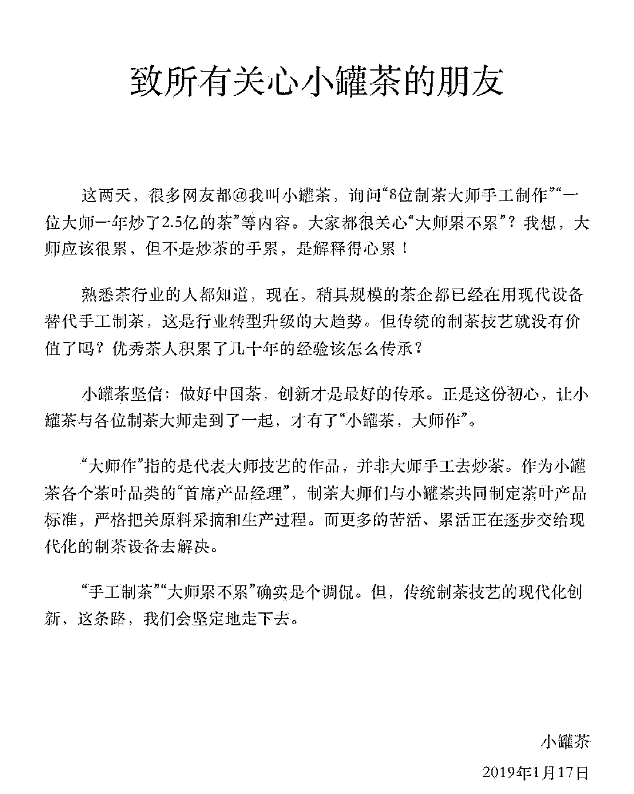
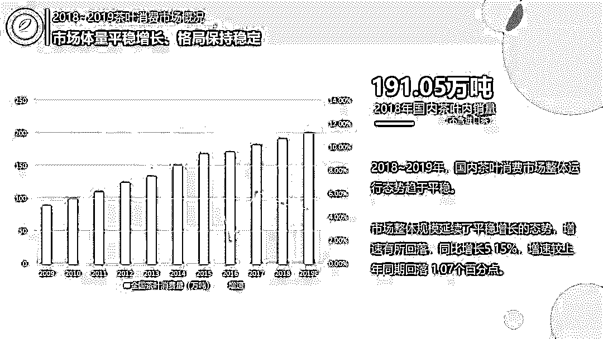
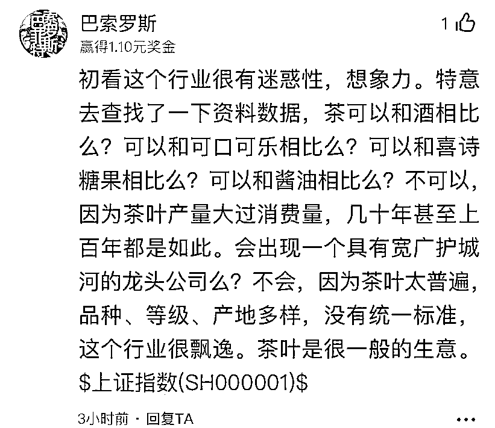
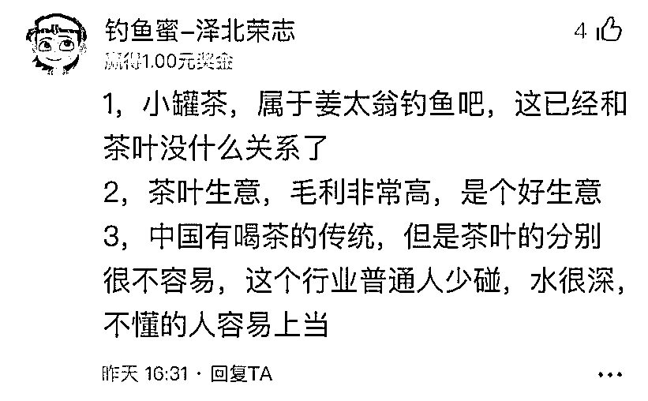

# 一年收割 20 亿！卖的比茅台还贵！起底网红小罐茶背后的营销套路

> 原文：[`mp.weixin.qq.com/s?__biz=MzIyMDYwMTk0Mw==&mid=2247496792&idx=1&sn=59fb577ab2353adfec6fa702d563a717&chksm=97cb3f60a0bcb676b066cfa5c4ddf4d0f7ebf7030cfb16eab1ede9acd04c0ee49f887ee18a5d&scene=27#wechat_redirect`](http://mp.weixin.qq.com/s?__biz=MzIyMDYwMTk0Mw==&mid=2247496792&idx=1&sn=59fb577ab2353adfec6fa702d563a717&chksm=97cb3f60a0bcb676b066cfa5c4ddf4d0f7ebf7030cfb16eab1ede9acd04c0ee49f887ee18a5d&scene=27#wechat_redirect)

**点击上方蓝色字体免费订阅“灰产圈”**

00

许久未出现在大众视野中的小罐茶近日又火了！据小罐茶官方显示，今年上半年，“送礼佳品”小罐茶将价格降至 1000 多元一斤；而此前，小罐茶金罐每罐 4 克，售价 50 元，折合 6250 元一斤！可即便是价格大幅下调，在雪球悬赏《你怎么看高价小罐茶？卖茶叶是好生意吗？》中仍引起雪球用户的疯狂吐槽：

那么这个价格堪比茅台的茶叶到底是如何“收买”人心的？让我们再次掀开小罐茶的面纱。

01

**小罐茶到底是卖给谁的？**精美的小罐包装、高端的品牌形象、广告的狂轰乱炸，让正式上市才三年多的小罐茶成了中国茶叶界的新晋网红。2017 年，小罐茶销售额为 6.5 亿。2018 年，小罐茶完成 20 亿元销售额，成为创始人杜国楹打造的又一爆款产品。**为什么说又一，因为小罐茶的创始人杜国楹正是成功策划过背背佳、好记星、E 人 E 本、8848 手机等案例的爆款操盘手！**

1.  1997 年，用 50 万将背背佳做成行业翘楚，第二年狂销 4.5 亿。

2.  2003 年，好记星销量超 10 亿台，逐步吃下数十亿的学习机市场。

3.  2009 年，E 人 E 本累计销售 16 亿，后被清华同方 14 亿收购，净赚 7 亿。

4.  2015 年，8848 手机攻占高端机市场，仅 2 年圈钱 20 亿。

5.  2016 年，小罐茶席卷央视，次年营收达 7 亿，2018 年营收 20 亿。

**从背背佳到小罐茶，杜国楹五次创业的模式几乎如出一辙：普通产品→代工厂生产→广告轰炸。**其中最突出的就是广告轰炸环节，杜国楹的营销手段一直非常简单粗暴：砸钱，找明星。有媒体评价他擅长用疯狂的广告轰炸，让品牌在很短的时间内被用户熟知，然后获得可观的销量。好记星签约韩星李敏镐**疯狂砸钱导致如此价格高昂的小罐茶叶，究竟是卖给谁的？**在最初的市场调研中，杜国楹把茶叶市场中的用户群体，大致分为了四类：喝茶而又懂茶的人、喝茶但是不懂茶的人、送茶而又懂茶的人、送茶而又不懂茶的人。因为大多数懂茶的人，都有自己特殊的购买渠道。**于是他瞄准的用户群体，是喝茶但是不懂茶的人和送茶而又不懂茶的人。**并在小罐茶走进市场后，通过在央视投放的 3 分钟广告中，赋予了小罐茶产品大量的想象空间，特别是投资及社交属性。通常来说，价格超过 1000 元/斤的茶，在大多数不懂茶的人眼中，就已经算是好茶了。即使在经常喝茶的人眼中，也算是相对比较优质的口粮茶。小罐茶刚好达到了这个标准，这对于小罐茶的定位来说，其实就已经足够了。这时的小罐茶已经足够有面子，送礼的优势开始显现出来。**贵，就是小罐茶最大的特点。**

02

**小罐茶“虚假宣传”之争**真正让小罐茶翻车的，是今年一月份一张网上广为流传的图片，为小罐茶算了一笔细账：按照小罐茶“八位制茶大师手工制作”、“每一罐都是泰斗级大师手工制茶”、“ 2018 年销售额突破二十亿”的宣传，**假设年中无休，平均下来每位大师一天要炒 1466 斤鲜茶叶！****这已经是个不可能的数字！**一般的手工炒茶师傅一天炒 30 斤左右鲜茶叶，顶尖的茶娘一天能炒 40 斤。这些数据直接影射小罐茶的央视广告语“小罐茶、大师作”是虚假宣传。上述算法是按一盒 500 元小罐茶 80 克计算，根据小罐茶官方旗舰店售价，一盒 500 元的小罐茶通常是 40 克，按此计算，大师们可能没有上面所说那么累，但也极不符合实际情况。**虽然市场依旧会为大师作买单，但“大师累不累”的话题让杜国楹意识到，市场可能已经不是从前的市场。**对此，小罐茶官方给出回应：声明指出，熟悉茶行业的人都知道，现在，稍具规模的茶企都已经在用现代设备替代手工制茶，这是行业转型升级的大趋势。**“大家都很关心大师累不累？我想，大师应该很累，但不是炒茶的手累，是解释得心累！”**不过声明随即被反驳噎住，“既然机器能做出大师茶，那还要大师干嘛，你的矛能戳破你的盾吗？”回顾杜国楹的 5 件爆款，有人调侃：长身体的时候他卖背背佳给你，上学的时候他让你觉得你就是需要一台好记星，工作时缺一台商务笔记本，打拼几年后想成就企业家的风采？来一部 8848 手机！成为老板之后用什么也是个问题，不如就来一盒大师亲手炒制的小罐茶吧！

03

**茶叶行业是不是个好生意？**中国的茶叶市场有多庞大？据数据显示，2013 到 2018 年，中国茶叶产量逐年攀升，到了 2018 年底中国茶叶产量将达到 280 万吨，国内茶叶消费量达 200 万吨，销售额突破 2600 亿元，消费群体已经达到 4.9 亿！在此前杜国楹长期对市场的调研中，他发现正是这样一个 2600 亿体量的茶叶市场，却没有真正的茶品牌，消费者对茶品牌的认知也仅仅停留在产地+品类的程度，如西湖龙井。**杜国楹因此嗅到商机，这也是小罐茶出现的重要原因之一。**对于整个茶叶市场，不少投资者同样也嗅到商机：茶酒不分家，为何只有白酒企业上市不见茶企上市呢？实际上，目前有近 20 家茶企已挂牌新三板，但营收过亿的企业也不过四五家。而反观中国白酒企业，近 20 家登陆 A 股，已成为整个市场最核心的板块之一，贵州茅台更是以 2018 年年销售 772 亿元、净利润 352 亿元冠盖群芳。**那茶叶行业到底算不算一门好生意？****在雪球上的讨论中，多数用户的观点是：茶叶不是一门好生意，但小罐茶更不是，小罐茶是一家营销公司，没法相提并论。**雪球用户@巴索罗斯表示：初看这个行业很有迷惑性，想象力。但茶叶太普遍，品种、等级、产地多样，没有统一标准，这个行业很飘逸。所以茶叶是很一般的生意。

雪球用户@不要当真：茶无上品，适口为佳。饮茶口味习惯的地域性太强了，每个人的口味也不同，没有一个厂家能够制造出符合大多数中国人口味的茶叶。所以中国的茶文化，注定永远不会出现白酒行业那种的龙头企业。不过也有用户表示茶叶毛利非常高且中国有喝茶的传统，是个好生意。

**抛开茶叶市场本身来说，小罐茶到底是抢占了用户的心智还是收割了国人的智商？**

[`v.qq.com/iframe/preview.html?vid=c08290q9e90&auto=0`](https://v.qq.com/iframe/preview.html?vid=c08290q9e90&auto=0)

**《“小罐茶”被网友质疑并非手工制作，律师：广告涉嫌欺骗消费者》**

* * *

来源： 

## 《小罐茶的智商税，如何让我们交得心甘情愿？》憨牛网

## 《小罐茶背后的爆款操盘手》南方财经人物

# 《茶叶行业竞争分析》中国报告大厅

## 《2019 中国茶叶消费市场报告》

← 向右滑动与灰产圈互动交流 →

**阅读原文加入灰产圈高端社群**