# 靠“盗版”抖音连续霸榜 17 天，这款 App 都有哪些骚操作？

> 原文：[`mp.weixin.qq.com/s?__biz=MzIyMDYwMTk0Mw==&mid=2247496789&idx=1&sn=7f19697883e8a7b88dab66408fc5402c&chksm=97cb3f6da0bcb67b9a2ccb5d122c7995591c7d2f170ea1c15342428e43d665171f0d4b3439ba&scene=27#wechat_redirect`](http://mp.weixin.qq.com/s?__biz=MzIyMDYwMTk0Mw==&mid=2247496789&idx=1&sn=7f19697883e8a7b88dab66408fc5402c&chksm=97cb3f6da0bcb67b9a2ccb5d122c7995591c7d2f170ea1c15342428e43d665171f0d4b3439ba&scene=27#wechat_redirect)

**点击上方蓝色字体免费订阅“灰产圈”**

00

最近，有一个 App 引起了我的注意。

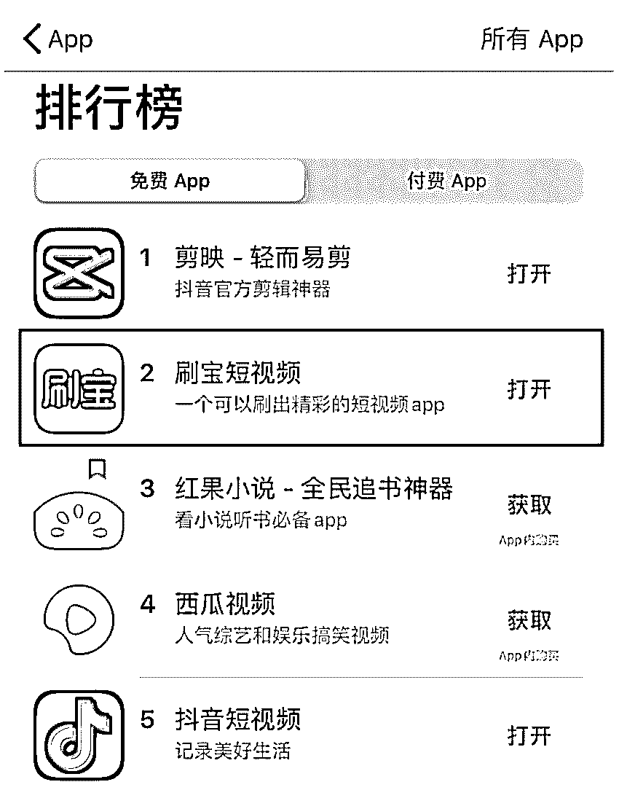

大半个月来（10 月 29 日~11 月 15 日)，这款 App 稳居 App Store 免费榜单第二（现在第三），摄影与录像榜单第一，可以说是很强势了。

讲真，能在免费榜单排名靠前这么久的 App 还真是活久见。**我第一反应是：抖音的竞品来了？**

然而从它投放的广告来看，我觉得它不是抖音的对手（至少现在还不是），广告剧情狗血至极，让人忍不住想吐槽，有网友看了说：

 > 我仿佛看到了沙雕小说广告的身影，剧情令人喷饭，连十三路公交车的梗都搬了出来…… 

鬼畜的是，不管剧情怎么沙雕，**最后都能落到这个 App 的唯一亮点：****刷视频可以赚钱。**

并且暗示用户，这款  App 不仅能赚钱，还能赚不少钱：

 > 虽然一天刷几百块的钱比较少，但是一天刷几十块钱的奶茶钱还是没有问题的…… 

这就有点意思了。在职业病好奇心的驱使下，我下载了这个叫刷宝的 App，看看它背后到底有什么猫腻。

接下来，我就带大家一起来扒一扒。

# 

01

**刷宝 App 真的能赚钱？**

当我打开刷宝 App 时，我感觉自己好像打开了抖音，这页面和抖音长得也太像了，据说还有很多视频都是抖音同步过去的，说它是"翻版抖音"一点也不为过。

左刷宝，右抖音

我一个视频还没刷完，页面上就弹出了一个大红包，当我去点红包的时候，平台提示检测到了我的本机号码，让我一键登录。

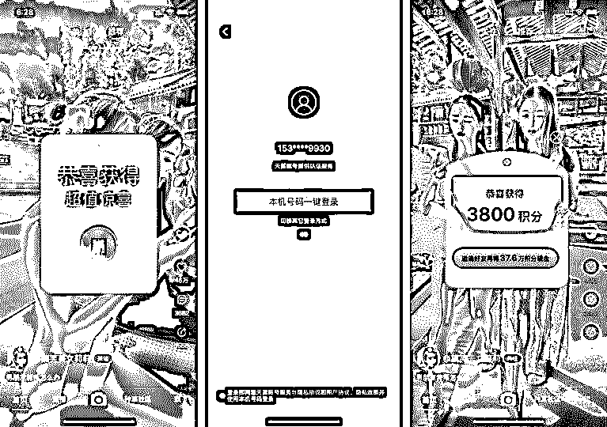

登陆后，我点开红包后发现，里面不是现金，而是 3800 积分。

根据平台的规则，1W 积分能兑换 1 块钱，那么这 3800 积分可以兑换成 3 毛 8 现金。

想要赚更多钱就要获取更多的积分，想要获得更多积分，就要不断刷视频。然而事实却没有想像的那么简单。

首先，**普通用户刷到 1W 积分并不是一件容易的事。**

我刷了一个多小时的视频，获得的积分也不过 7000 多（7 毛钱），而且越到后来，积分获取的速度就越来越慢。

其次，**用户获得的积分只能****部分兑换。**

积分的可兑换金额，是你在平台的活跃度（刷视频的频率）决定的。

因为我是第一天登陆，尽管我刷再多的视频，获得再多的积分，能兑换积分只有 3800（新用户红包）。

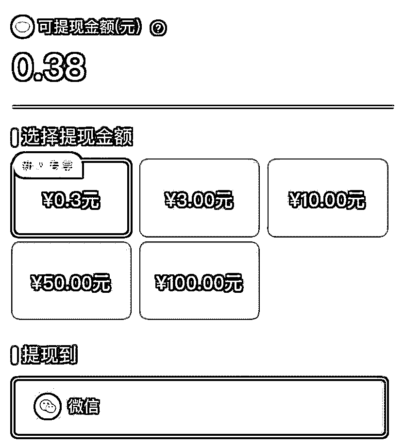

更狗血的是，就这 0.38 元可提现金额，**真正能提现出来的却只有 3 毛钱……而且一天有且仅有一次提现机会。**

这还不算啥，一番体验后，**我发现刷宝在“提现”的流程上，一直在给用户挖坑。**

比如用户好不容易刷了 10 块钱，提现的时候才发现**要连续登陆 20 天才才可以提……**

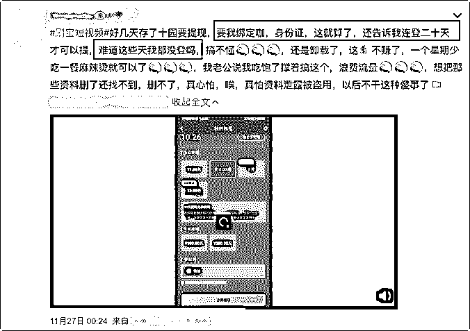

网友吐槽刷宝提现流程

刷宝提现页面

还有的压根就提现不了。

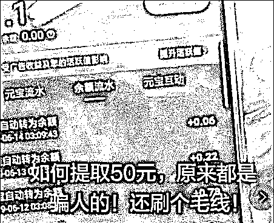

刷宝除了在“提现”的流程上大做文章外，还各种诱导用户邀请好友。

**比如玩文字游戏，**“邀请好友再得 37.6 万积分现金”，不仔细看还以为是 37.6 元现金。

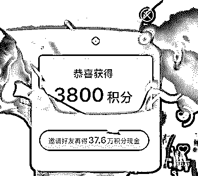

**比如玩捆绑套路，**你光邀请好友还不行，邀请的好友必须连续登陆 3 天并完成相应的任务后，你才有可能获得奖励。

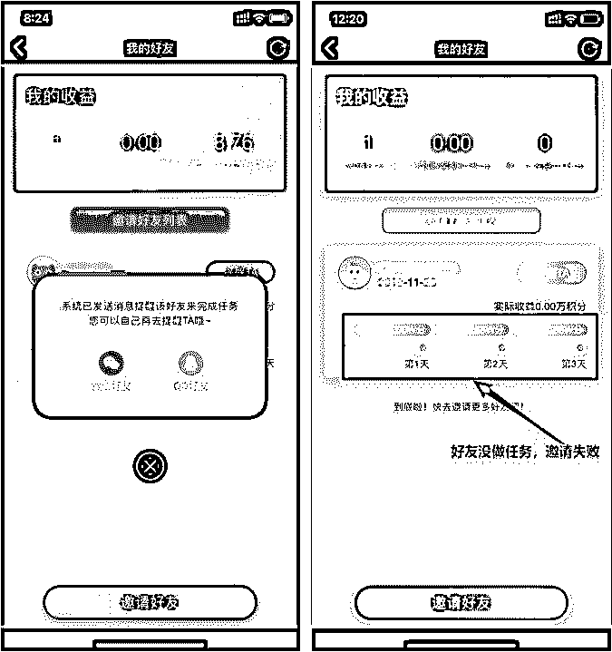

更狗血的是，就算邀请成功（好友连续 3 天做任务），用户能获得的也只有 3.76W 积分，而并不是 37.6 W 积分。还可能得不到任何奖励，**因为好友在填写你的邀请码的时候，可能就根本填不上去。**

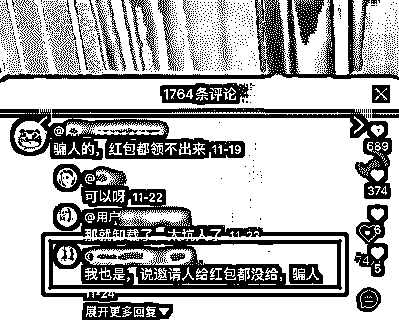

随手一翻 App Store 上的用户评价大都是吐槽，还有很多用户更是“打五星”吐槽为了让更多人看到。

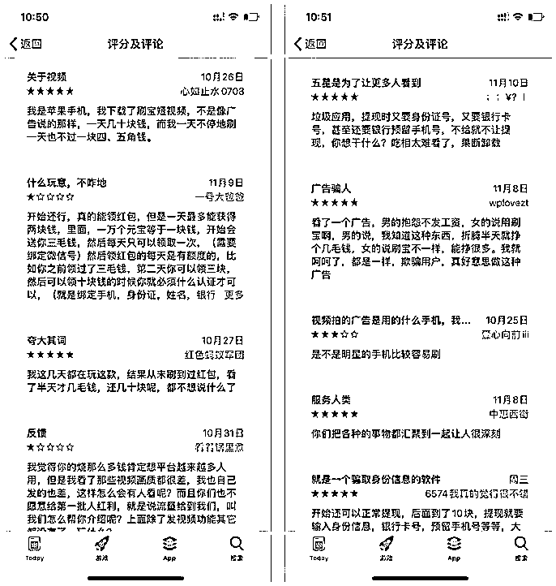

事实上，像刷宝一样打着 XX 赚钱的旗号让用户下载的 App 还有很多，并且**这些 App 套路都大同小异。**

首先，通过在 QQ 空间、微博、抖音等平台投放低成本“沙雕”小广告，**用 XX （看小说、走路、打卡……）能赚钱吸引用户的注意力。**

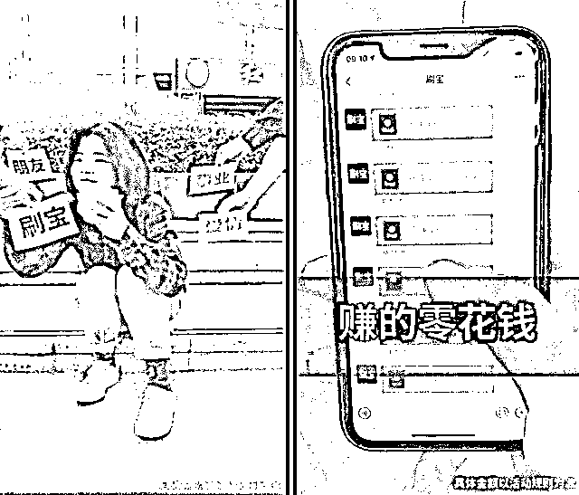

其次，在用户入坑的时候，**让他们很轻松就能提现第一笔钱，这笔钱一般来说不会超过 1 块。**

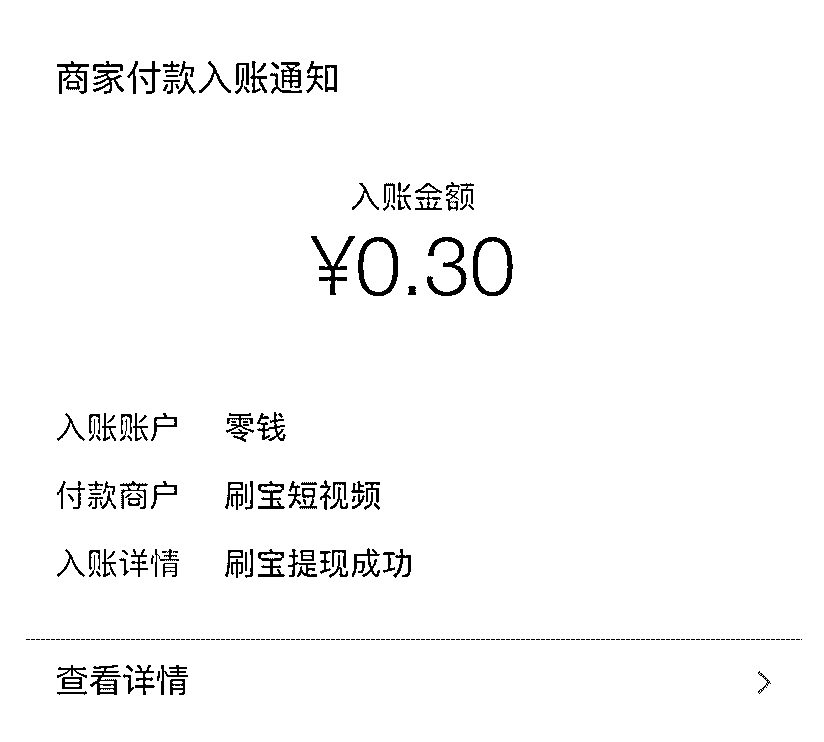

当用户尝到甜头后，想要继续赚更多钱的时候，这类 App 就会各种耍心机：

有的 App 会让用户**花费大量的时间**刷视频、新闻、小说，或者让**用户走很多路才可以提现。**

据说一个东北大妈下载某走路赚钱 App 后，走了半年多才赚了 48 元钱，还不能提现，想要达到提现门槛（50 元提现门槛）就要不停地走路，结果发现走了好几万步才走了 1 角多钱，坦言给自己累够呛。

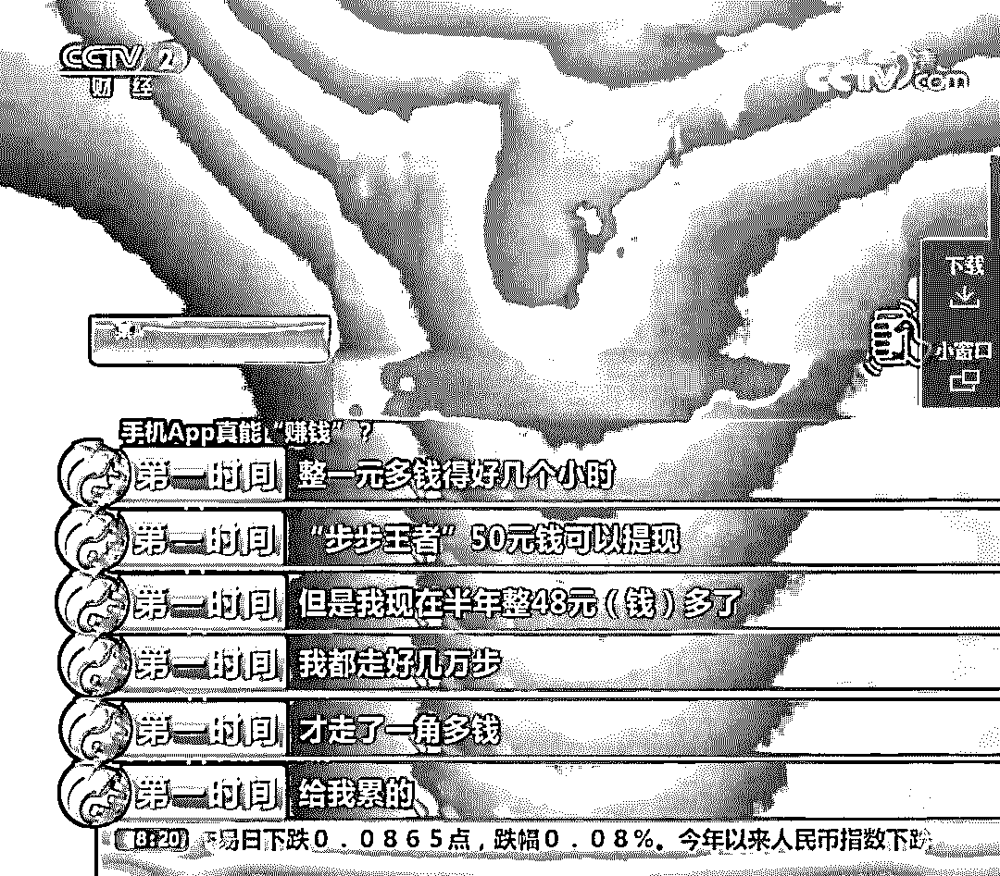

还有的 App 在用户把钱攒到提现门槛的时候，**设置各种提现门槛，花式劝退用户。**

比如要求用户绑定银行卡、身份证等有可能泄露个人信息的操作；比如要求用户要连续再登录 XX 天才可以提现；还有更狗血的，用户必须要邀请好友才可以提现……

最后，**赚钱类 App 还有一个标配套路就是“拉人头”。**平台声称只要邀请好友，你就可以获得奖励，并且好友在 App 上赚到的钱，你也可以获得一定比例的分成。

同样的套路屡试不爽。这不，**排行榜前 10 个就有 3 个赚钱类 App。**

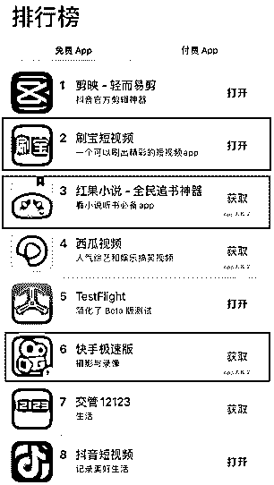

# 

02

**赚钱类 App 都是什么人在用？**

看到这，你可能会感到疑惑，有着如此坑爹套路的网赚 App，为什么在 App store 排行榜上的排名还能那么靠前 ？这些赚钱 App 都是什么人在用呢？

我研究了一番发现，这些 App 背后还真是有“忠实用户”的。

## 

**1）专业“薅羊毛”的羊毛党们**

各种赚钱 App 对普通用户来说，就是“占点小便宜”，但对于羊毛党来说，那可是块“肥肉”，一天赚个成百上千不是事。

根据腾讯发布的《网赚 App 产业链调研报告》，羊毛党团队通过开发全自动脚本对某头条进行刷量，每天获利上万元。

羊毛党都怎么做到的呢？事实上，他们除了拥有的全自动脚本外，更关键的是使用群控设备。

啥是群控设备呢？简单来说就是**用一台电脑设备控制上百台手机，每个手机每天全自动实现摇一摇、点击、刷视频等动作。**  

群控技术图源：@华企黄页网

但是，如果你以为只要买个群控设备就可以在家轻轻松松日入上千，那你就真的想太多了。

现在很多赚钱 App 只是让用户看上去感觉能赚钱，但实际上真正操作起来，就知道薅点羊毛有多不容易了。 

CCTV 的「第一时间」节目就曾曝光过群控系统圈套，很多人不惜花重金购入群控系统，想着靠刷单躺赚。**结果一天只赚了 4 块钱，甚至有时候还赚不够一天的电费.........**

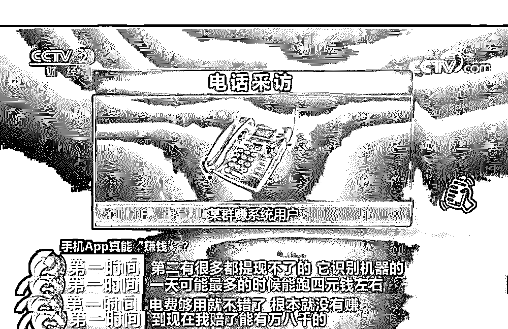

当然了，羊毛党们不会止步于此。他们除了正常做任务赚钱外，**还会通过邀请新用户注册来“薅补贴”。**

我们知道，很多 App 为了做拉新，会给用户一定的奖励来激励他们邀请好友。比如刷宝 App 的某一个版本 ，邀请好友可以获得 60 元奖励金。如果能邀请 100 个好友，就意味着能获得价值 6000 元的奖励金。（虽然不一定真能到账）

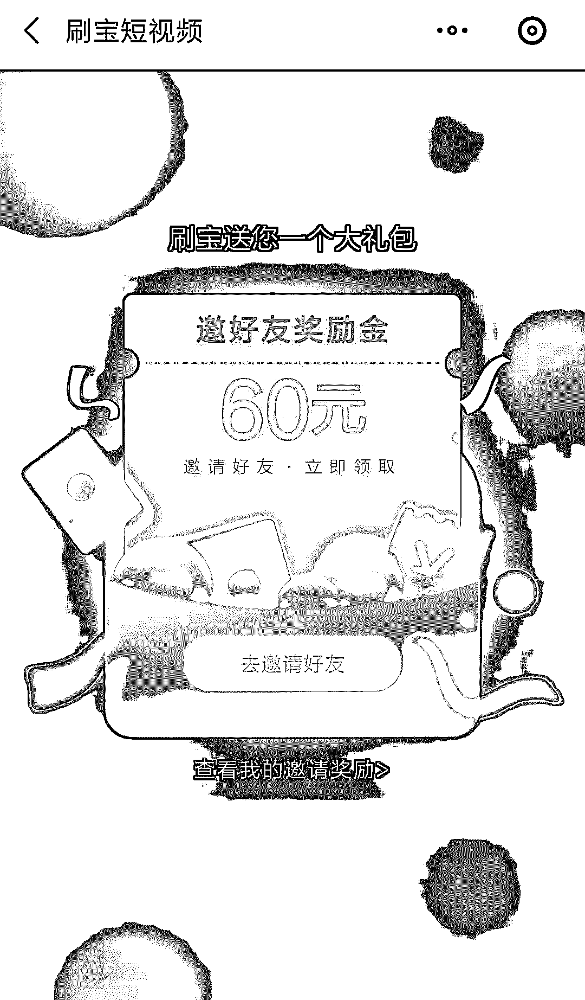

如何快速邀请到 100 个好友呢？羊毛党们用的方法是，买上百个手机号自己邀请“自己”。

在这里，**就不得不提羊毛党的背后的强大组织——卡商。**小一点的卡商手里至少有上百张电话卡，大一点的卡商上万张电话不足为奇。

为了弄清卡商们的套路，我混进了卡商群，才知道一张卡的价格居然只有 8 块钱。

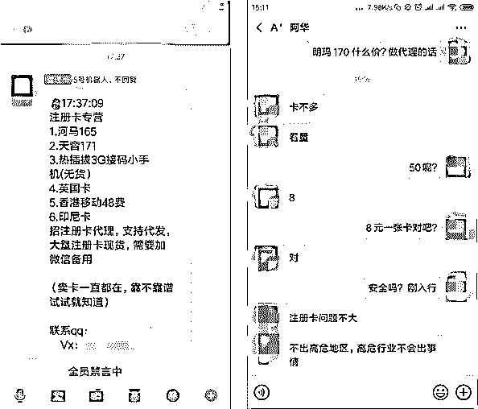

从目前获得的资料来看，卡商主要获得卡的方式有 4 种：

 > 物联网卡：物联网卡是由中国联通、中国电信、中国移动面向物联网用户提供的，和电话卡最大的区别在于**无法打电话，只能接受短信和使用流量。**境外卡：像印尼等国家的信号与我国相同，印尼当地的手机卡完全可以接收到中国的短信。**而且这些境外卡成本较低，半年只需要 18 元。**真实注册的手机号：卡商通过有偿利用普通老百姓的身份证，**去运营商网点批量办卡。**集团号：有的卡商通过虚假成立公司来向当地运营商申请集团号，**通常在审核疏忽的情况下，会批下来上百张号码。** 

除了低价售卖手机卡外，卡商还能**通过猫池（插入手机卡即可获得短信验证码）****给羊毛党发送验证码来获取分成。**

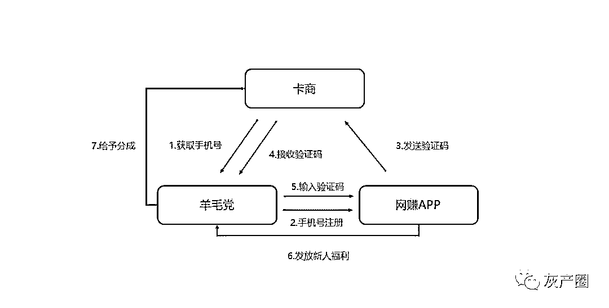

除了薅"赚钱类 App "的新人注册福利，羊毛党还盯上了这类 App “收徒模式”。

收徒模式指“师傅”（用户）可以通过招多个“徒弟”（代理）来获得佣金，并且徒弟“赚的钱”也会有一部分进入用户的账户中。

羊毛党利用手上多个手机账号成为主号的“徒弟”，**并通过自动化脚本让多个“徒弟”自动阅读，从而给主账号“师傅”获利。**

更高级一点的玩法是通过多个“徒弟”给主账号“师傅”造势，让新进网赚群的萌新认为这行很好赚钱。利用萌新们贪婪的心理，引导他们复制这个玩法，招更多的“徒弟”入坑。

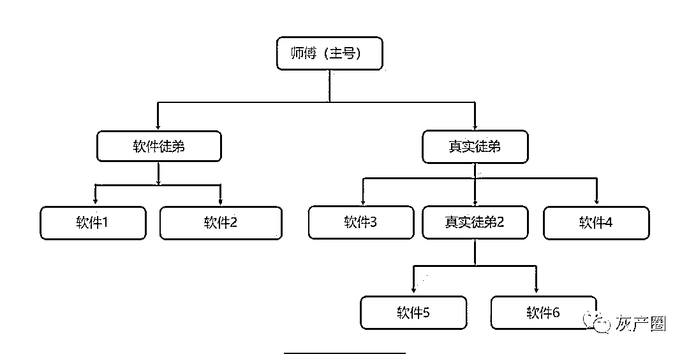

值得一提的是，赚钱类 App 为避免被薅推出了反作弊系统。一旦发现有账号用刷单软件、模拟器等软件，便会删除账号里的积分并封号。目前主要的检测方式，还是识别手机的 IMEI 码（手机的身份证）。

不过这可难不倒专业的羊毛党，羊毛党团队中也有专门开发程序的技术人员，给底下羊毛党提供技术工具。**比如使用手机 IMEI 码修改工具，来修改手机的名称和属性。**

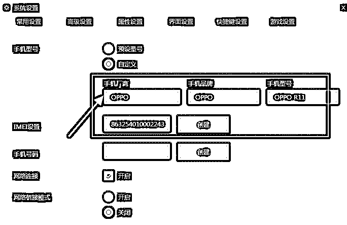

相比于通过纯机器刷量的高风险，**人工+机器才是最高阶的流量造假术。**于是，羊毛党为了规避被平台封号的风险，通过部分人肉刷量来以假乱真，骗过反作弊系统。

羊毛党头子（项目负责人）为了找到更多的人刷量，最常见出现的地方就是贴吧、QQ 群。直接简单粗暴告诉你通过网赚获利了多少钱，并留下联系方式，让你添加 QQ 或微信。

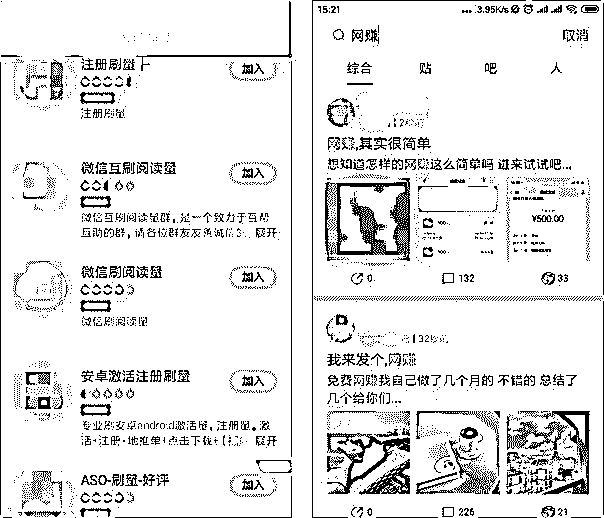

当你添加微信或 QQ 后，便把你引流入刷量群。**随后羊头会在线报群内，不定期的发布信息号召群内人员去刷量。**

其实这背后已经形成了一个完整的网赚灰产链：羊头（项目负责人）→技术专家（提供技术设备）→卡商 (养号）→实操刷量员（利用群控设备刷量）。

## 

**2）有“闲”没钱的下沉用户和学生党**

除了专业羊毛党之外，赚钱类 App 还有一类用户就是有“闲”没钱的下沉用户和学生党。

走路、阅读就能赚钱的套路，到底对下沉市场用户来说多有吸引力呢？

根据《 QuestMobile 下沉市场报告》显示，「趣头条」和「微鲤看看」（赚钱类 App）通过**现金奖励+裂变**的方式，分别获得了 1271 万和 630 万的月活跃用户数量，并进入了下沉市场资讯类 App 榜的前十。

看来，目前下沉市场用户还是很吃“利用空闲时间”赚钱这一套路的。 甚至还有人化身为民间科学家，**创造出各种“刷视频、刷阅读”的赚钱神器。**

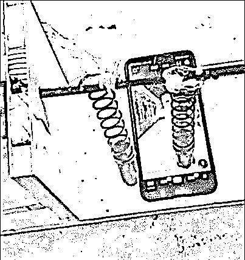

除了下沉市场用户外，**00 后也是赚钱类 App 的主力军 。**

根据《00 后网赚 APP 使用行为调研报告》，**网赚 App 的 1/4 用户由 00 后群体构成，并且高于全部网民 00 后占比。**除此之外，60% 的 00 后手机中含有 2 款或更多网赚 App 。

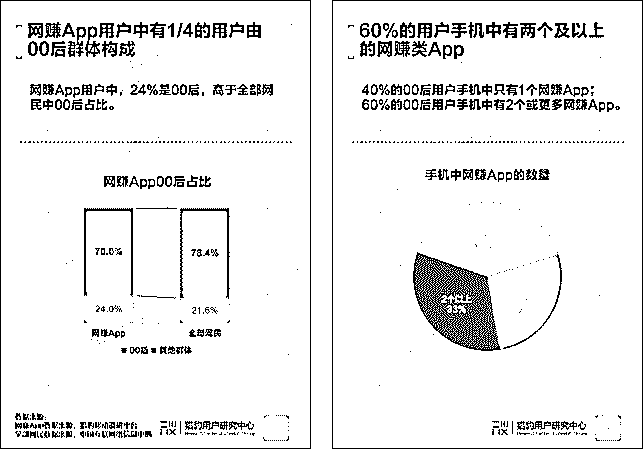

假如你和一个中学生聊天，他除了懂王者荣耀外，说不定知道的网赚 App 比你还多。

# 

03

**结语**

现在，赚钱类 App 层出不穷，不是看新闻赚钱、就是刷视频赚钱还有走路赚钱等。令人唏嘘的是，大部分网赚类 App **都是打着 XX 赚钱的口号，把用户当韭菜割，而且套路都几乎一个样：**

首先是告诉你，通过刷视频、看小说既可以打发时间又可以赚钱，来诱惑你下载。当你真正去刷时，可能只赚个几毛钱。

其次，当你想将这几毛钱提现时，不好意思，想要提现你还得继续刷视频。

除此之外，这类 App 还会各种“利诱”你，比如邀请新用户就可以获得奖励。但实际上拉来的新用户需要完成某些“任务”，你才有可能拿到奖励，甚至有时候根本拿不到。

总的来说，**在赚钱类 App 的层层套路下，用户想赚钱几乎是不可能的。**

然而，还是有人抱着“薅羊毛”的心理，想通过群赚设备来赚钱。他们往往花重金买设备，由于赚钱类 App 的反作弊系统和花式套路，一顿折腾没赚到什么钱不说，还白白因为刷各种新闻和视频占据了大量的手机内存……本来是想去薅羊毛的，没想到却被羊薅了。

← 向右滑动与灰产圈互动交流 →

**阅读原文加入灰产圈高端社群**