# “水滴筹”黑幕！“扫楼”招募求助者，撰写故事，按单提成，月入过万，末位淘汰……

> 原文：[`mp.weixin.qq.com/s?__biz=MzIyMDYwMTk0Mw==&mid=2247496778&idx=1&sn=c5583c52d5561abfc8f400c96bc79b53&chksm=97cb3f72a0bcb664fa13d9f39c6e587a003a23756590513ee8972ad1bd0a6ae4a857d924d8ee&scene=27#wechat_redirect`](http://mp.weixin.qq.com/s?__biz=MzIyMDYwMTk0Mw==&mid=2247496778&idx=1&sn=c5583c52d5561abfc8f400c96bc79b53&chksm=97cb3f72a0bcb664fa13d9f39c6e587a003a23756590513ee8972ad1bd0a6ae4a857d924d8ee&scene=27#wechat_redirect)

**点击上方蓝色字体免费订阅“灰产圈”**

导语**每单最高提成 150 元，****月入过万，末位淘汰……****近日，梨视频拍客的一段****卧底“水滴筹”视频登上微博热搜**

[`v.qq.com/iframe/preview.html?vid=f3027i6psex&auto=0&width=500px&height=375px`](https://v.qq.com/iframe/preview.html?vid=f3027i6psex&auto=0&width=500px&height=375px)

**卧底水滴筹医院扫楼筹款****高薪+绩效考核，审核漏洞多**据了解，这些筹款顾问每天在医院里地毯式扫楼，**逐个病房引导患者发起筹款**，一个下午就扫完大半个医院。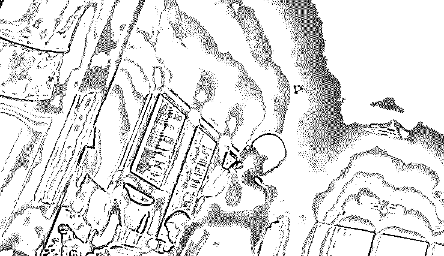在跟踪过程中还发现筹款顾问对募捐金额填写随意，对求助者财产状况不加审核甚至有所隐瞒，对捐款用途缺乏监督。在宁波一家医院，从顾问和患者家属间的对话可以看到，对筹款目标就是他们双方“商量着来”，并没有具体的医疗凭证或方案作为依据。

**筹款顾问**

你们想筹多少？

**家属**

这个嘛，实际上那你说...

**筹款顾问**

对，照我说没具体数的

**家属**

能捐几块就几块

**筹款顾问**

那你觉得目标金额 5 万可以吗？

**家属**

可以

╮(￣▽￣"")╭

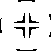在郑州，有患者表示自己没有职业，是农民。**筹款顾问直接帮他们定了 15 万的筹款目标。**但随后知情人士透露，这家人曾于 2015 年获得过征地拆迁补偿，但患者家属称“很早的事了，那 10 万 8 万够干啥”。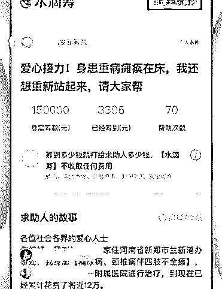

诸如此类不规范的问题，顾问还表示公司不会来调查。很多求助者在提现之后，甚至不再证明资金去向，顾问们对此，倒也是不闻不问。

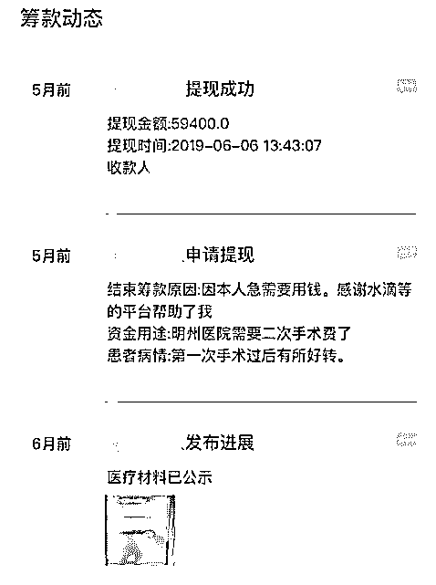“不靠谱”

接下来看看这些筹款顾问

工作流程中是如何的“不靠谱”

先来看看具体步骤

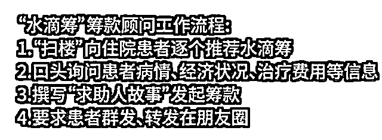

1、“扫楼”

“扫楼”是指挨家挨户拜访，

本是保险等行业内常用语。

例如成都水滴筹志愿者，

每天都在成都的各大医院拜访病人，

“5 到 28 楼，基本上一下午扫一半，

第二天下午扫另一半”。

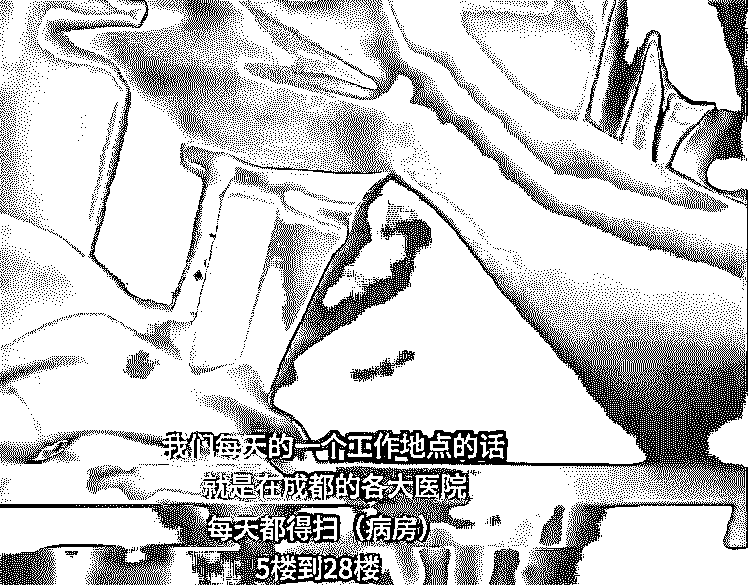2、询问患者信息

筹款顾问也十分注重话术培训，

在现场经常可以听到顾问这样说服患者：

“半个小时就能给你办好，

前面这两家都是我昨天刚给他办的。

他家昨天一晚上筹了五万多。”

3、写故事

说服患者和家属后，

撰写“求助者故事”如今已经成了“小 case”。

因为文章都有模板套用，

路数几乎全都一样。

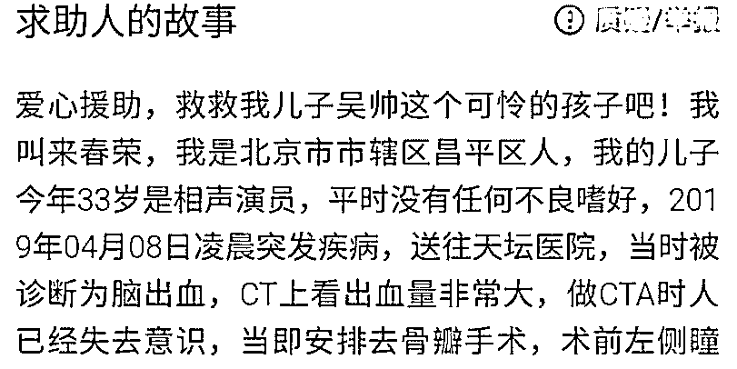4、要求转发

最后，顾问还会教求助者

如何做才能让效果最大化。

在微信上群发消息，

转发的人越多，效果越好。

有筹款顾问透露，公司给顾问的报酬也很明确：前 5 个有效单每单 80 元，6 到 10 单每单 100 元。这位顾问自称上个月就拿了 14000 元。当然，每位顾问每月得完成 35 单，不然就会末位淘汰。

为什么？

**帮病患捐款** 

**还给筹款顾问提成**

**水滴筹为什么要这么做？**

据筹款顾问透露，据测算，通常一名癌症患者会有四五千个人给患者捐款，数额在 20 万左右。**爱心人士捐款时，后台就会推送癌症保险，因为这类人群当时购买癌症保险的几率较高。**

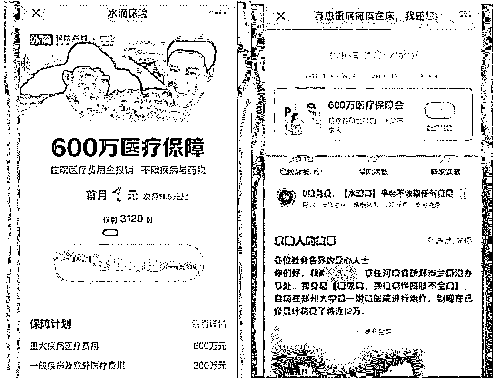

诱导人捐款给并不困难的人已经很让人生气了，还要再把对方当成营销对象赚笔佣金，良心真的不会痛吗？视频一出网友纷纷表示寒心……

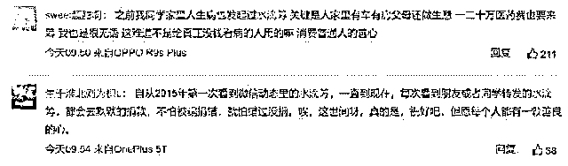

怎么办？

**水滴筹回应：****线下团队暂停，彻查**

对此，水滴筹 11 月 30 日回应**表示地推团队全面暂停服务**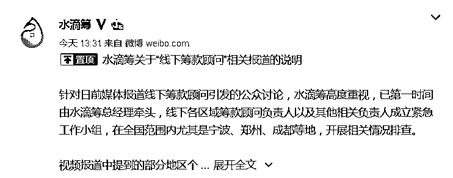水滴筹称，已有超过 2.5 亿人参与帮助。作为一种公益形式，网络众筹有着深厚的群众基础。与此同时，凭借"讲故事""编故事"吸引人气，问题频频曝光，如此"无人驾驶"，众筹平台必须管起来。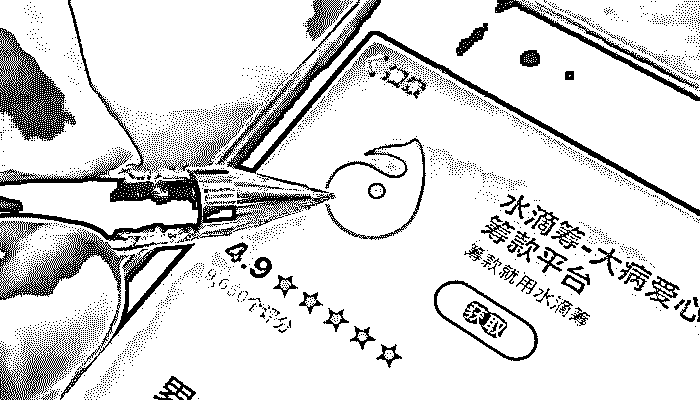公益到底能不能成为生意？乱象这么多，到底谁来管？公众如何用网络互助平台？来听听专家怎么说👇👇👇

[`mp.weixin.qq.com/mp/readtemplate?t=pages/video_player_tmpl&action=mpvideo&auto=0&vid=wxv_1099480680876212224`](https://mp.weixin.qq.com/mp/readtemplate?t=pages/video_player_tmpl&action=mpvideo&auto=0&vid=wxv_1099480680876212224)

水滴筹

究竟是筹爱心还是愁爱心呢？狼来了的故事难道没听过吗？**11 月 30 日下午，水滴筹公关团队回应称**，水滴筹高度重视，已第一时间由水滴筹总经理牵头，线下各区域筹款顾问负责人以及其他相关负责人成立紧急工作小组，在全国范围内尤其是宁波、郑州、成都等地，开展相关情况排查。相关视频报道称，“水滴筹”在逾 40 城医院派驻地推人员，他们常自称“志愿者”，逐个病房引导患者发起筹款。拍客发现，地推员们对募捐金额填写随意，对求助者财产状况不加审核甚至有所隐瞒，对捐款用途缺乏监督。

“水滴筹”的回应称，相关视频报道中提到的部分地区个别线下人员的违规现象，严重违反了水滴公司价值观、准则及相关规定，调查清楚后将给以严惩。同时自即刻起，线下服务团队全面暂停服务，整顿彻查类似违规行为，组织重新回炉学习，再次加强平台纪律培训和提升服务规范，培训通过后方可重新提供服务。

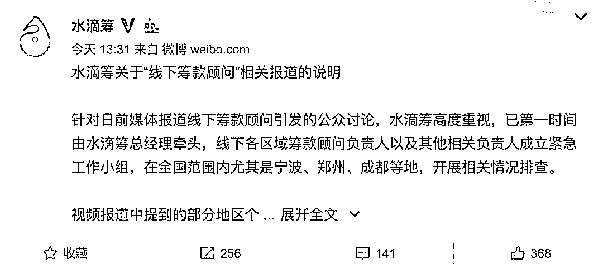**以下是水滴筹发给新闻媒体的回应：**

**1、 水滴筹组建线下服务团队的起因，是发现一些年纪偏大、互联网使用水平较低的患者，在陷入没钱治病的困境时，还不知道可以通过水滴筹自救。水滴筹不希望任何一名有需要的大病患者错失自救机会，因此组建了线下服务团队为他们提供相应的筹款支持服务，比如患者关怀、平台协议讲解、医疗服务支持、与医护核实等。同时，对那些协助发起了不符合筹款条件的项目的线下服务人员，平台有严格的惩戒措施。**

 **2、线下服务团队在申请发起前的服务仅仅是层层审核机制中的一环。限于目前个人家庭资产情况普遍缺乏合法有效的权威核实途径，平台采取覆盖筹款发起、传播、提现等环节的全流程动态审核，借助社交网络传播验证、第三方数据验证、大数据、舆情监控等技术和手段对筹款项目进行层层验证。**

 **3、 关于报道中提到的财产信息审核、目标金额设置、款项使用监督等问题，水滴筹皆建立了相应的审核机制，确保财产等信息的充分公示并联合第三方机构验证，同时持续跟进款项的使用情况。**

 **求助者财产等信息审核方面，发起人会对包括求助者财产状况在内的所有求助信息全面公示，患者社交网络中的熟人会参与证实、举报、评论，而平台会针对其反馈的信息进行进一步的核实，比如由患者所在地的村（居）委会、车管所、房管局等机构提供相关证明, 与患者的就诊医院进行电话或实地核实等。**

 **目标金额及款项用途方面，对于目标金额超过一定额度的筹款，平台会强制要求发起人提交预期医疗花费的权威证明，对于无法提供的，限制其发起目标金额过高的筹款。重大疾病的医疗花费常常会由于病情改变、治疗方式调整等原因动态变化，平台会持续监控筹款进展，并正在积极尝试打款到医院或分批打款等方式，确保款项用途。同时，平台在打款后也会持续要求发起人更新患者治疗进展和钱款用途，面向赠与人的举报通道仍保持开通。近期，某失信筹款人挪用款项，被水滴筹起诉退还了全部筹款，便是通过平台的持续跟进机制发现并处理的。**

**回应文稿提到，水滴筹的监督举报邮箱是：jubao@shuidichou.com，欢迎全社会共同监督。**

****期待调查结果的点“在看”****

* * *

**综合整理来源：新闻晨报、澎湃新闻、扬子晚报、新闻夜线、看看新闻、梨视频、新闻坊等**

******[ofo 退押金，太难了！](https://mp.weixin.qq.com/s?__biz=MzIyMDYwMTk0Mw==&mid=2247496752&idx=1&sn=2af05bf8d15c81f9c653ca930eff9046&chksm=97cb3f08a0bcb61eb5d6cc362dadf4b3f6e9d6e75715f0d6d8b7169a8c396bb1967c54c57ca3&scene=21#wechat_redirect)[深度调查：人贩子“梅姨”身后嗜血的“寻人灰产”](https://mp.weixin.qq.com/s?__biz=MzIyMDYwMTk0Mw==&mid=2247496759&idx=1&sn=29ca3c80d54f78ef1c839dc8abf01a38&chksm=97cb3f0fa0bcb619c160b093dba340423c7ae68cbbf0fe73dcbdc68ebc6ef65134768615b695&scene=21#wechat_redirect)[直播间成“赌场”，一分钟流水超 20 万！](https://mp.weixin.qq.com/s?__biz=MzIyMDYwMTk0Mw==&mid=2247496759&idx=4&sn=328f4719ce6780bb87af25f44c5c5e24&chksm=97cb3f0fa0bcb619399de8b491cb82ada52027bceb44c93e85cd26032e7cd34362fcfe9ef218&scene=21#wechat_redirect)[“陈安之”骗局：成功学的神坛和祭坛](https://mp.weixin.qq.com/s?__biz=MzIyMDYwMTk0Mw==&mid=2247496759&idx=2&sn=565425058ef4f64848f26e0fcd26d596&chksm=97cb3f0fa0bcb61960cc3f8dfb1849f758988d614acd4425c0065e187a856020f64c7301c79c&scene=21#wechat_redirect)[“狗代”们的五大手段，引诱了多少戒赌吧“老哥”上当！](https://mp.weixin.qq.com/s?__biz=MzIyMDYwMTk0Mw==&mid=2247496767&idx=2&sn=eca4009cb67076eb5d2c0cb71e5e12eb&chksm=97cb3f07a0bcb611c48b28835572b31d9212273810f0294d55642f22f069a4e8b89ba538f9c4&scene=21#wechat_redirect)**

****

********

**← 向右滑动与灰产圈互动交流 →**

****

********阅读原文加入灰产圈高端社群****