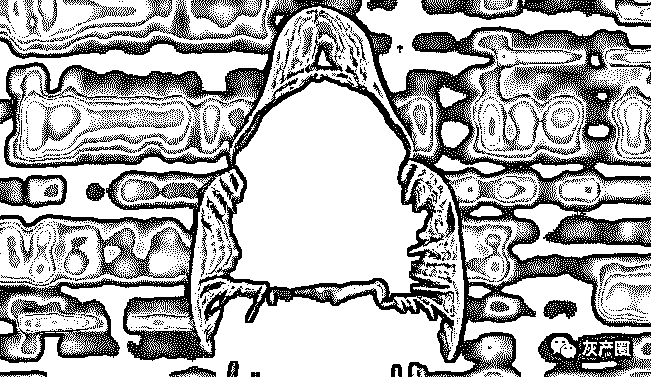
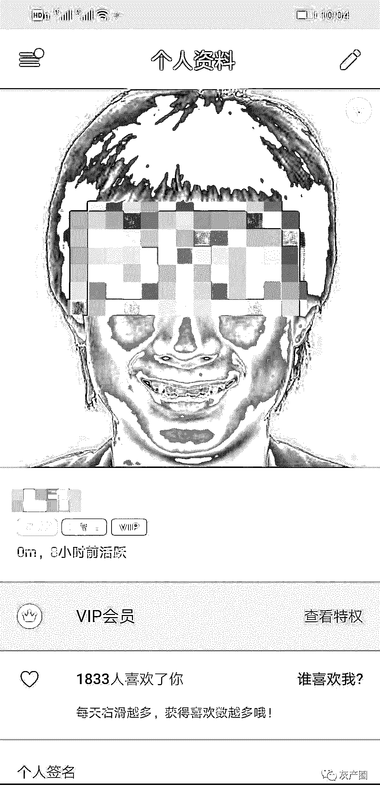
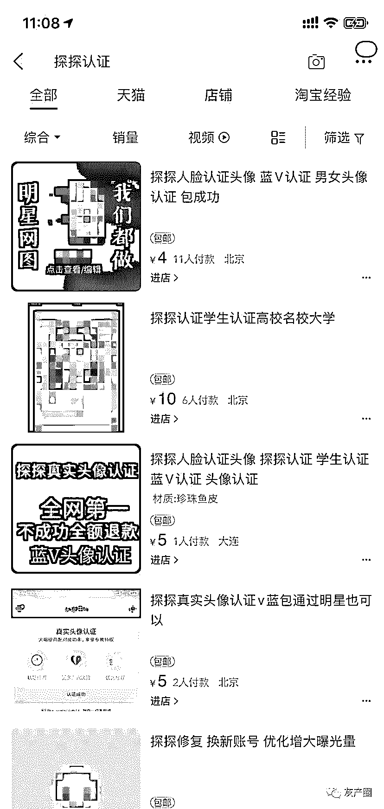
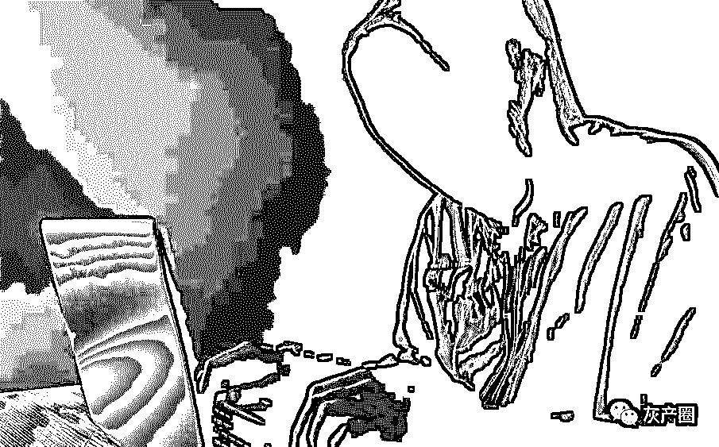
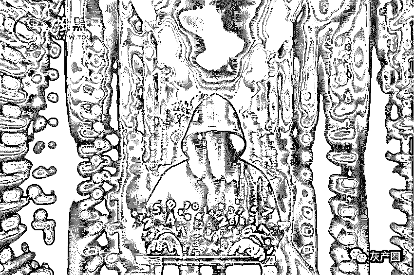
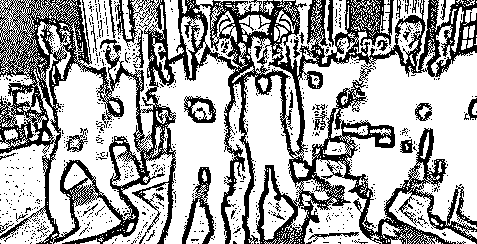

# 我花 100 元在探探上变成了明星“文章”……

> 原文：[`mp.weixin.qq.com/s?__biz=MzIyMDYwMTk0Mw==&mid=2247496703&idx=1&sn=fb444e132378de50e9fd5474d943f5cb&chksm=97cb38c7a0bcb1d1a1289e0e1246bc9754efc07624bfb1be2eaff80ec83b8a5962d9a5901ca1&scene=27#wechat_redirect`](http://mp.weixin.qq.com/s?__biz=MzIyMDYwMTk0Mw==&mid=2247496703&idx=1&sn=fb444e132378de50e9fd5474d943f5cb&chksm=97cb38c7a0bcb1d1a1289e0e1246bc9754efc07624bfb1be2eaff80ec83b8a5962d9a5901ca1&scene=27#wechat_redirect)

**点击上方蓝色字体免费订阅“灰产圈”**

张嘴-摇头-张嘴-点头，11 月 17 日晚，刚刚被制作完成的视频在电脑屏幕上播放。视频是用一位陌生女性的照片做成的，将被用来在 APP 上实名认证。而这位女性并不知情。

“甚至可以在本人不知情的情况下注册公司、撸贷。”黑产从业者称。记者调查发现，黑产从业者已经盯上人脸识别这块“新蛋糕”。目前，不少 APP 应用均上线人脸认证这一功能，包括社交软件探探。人脸“代认证”也成为一条黑产链条，并呈团队化发展。通过一名黑产从业者，记者在探探上成功通过人脸认证并“变脸”某知名艺人。还有黑产从业者将照片制成 MP4 格式的短视频来绕过人脸识别服务商的认证系统。而这项绕过人脸识别的黑客技术正在网上被售卖，售价 888 元。

在其背后，更是牵出个人信息贩卖黑产。据黑产人士称，认证通常需要姓名、身份证号和大头照。黑产业内通常将以上资料统称为“料”，贩卖人士则被称为“料商”。据透露，每条料子价位在 1 元左右。黑产人士用这个技术来做拉新项目赚取推广佣金。“一天几百不成问题。”

律师表示，越来越多人意识到人脸识别可能带来的风险问题，期望国家司法层面对该问题给予明确。 

黑产代做人脸认证：记者在探探变脸知名艺人

“在软件上看着挺好的，聊得也不错，但是见面后却发现和照片根本不一样。”使用探探一年的用户罗婷（化名）告诉记者，她在线下约见的过程中，曾遇到过多位“照骗”。探探用户用“照骗”来称呼那些图片和真人不匹配的用户。

探探是一款知名陌生人社交软件，用户通过观看照片、信息等资料，滑动手指来进行配对。左划不喜欢，右滑喜欢。按规则，当两位用户同时喜欢对方时方可进行聊天。在探探进行真人认证通常需要两步。首先，上传的图片要通过审核，之后用户通过人脸认证才可成功。认证之后探探头像下方会出现一个蓝 V 的标志。

记者发现，网上有多位店家表示可以提供学生认证、蓝 V 认证等多项服务。

11 月 10 日，记者在某电商平台搜索关键词“人脸认证”后，发现首页一款商品宣称可以通过“探探人脸认证”。记者在淘网上与之取得联系后，为规避平台监管，对方发来了她的微信号并要求记者添加。

“不做个蓝 V 头像你让大家伙儿怎么信你？”为了吸引客源，卖家程晓彤（化名）在朋友圈写道。

“男号还是女号？”程晓彤问。据其介绍，只需 80 元便可以通过探探的真人认证。交易步骤并不复杂，除付款外，记者需要将想使用的人脸图片上传探探并通过平台初步审核，还需要向她提供账号和密码，她就可以进行认证操作。

程晓彤表示，代做认证对账号注册时间也有限制，“满月才能做。”也就是，账号需注册后三十天方可被操作。“有封号风险哦，封号概率大概为百分之二十。”程晓彤解释，风险来源“主要是换机登录有风险”。

“我们有专门的技术负责这块儿。”另一名做探探人脸认证的商家告诉记者，并且要价 100 元。与程晓彤不同，该商家强调其“0 风险”。

11 月 17 日上午，记者暗访时在网络随机下载了艺人文章的一张照片，将其上传至探探。不久，第一重审核通过。下午 2 点，记者付款并将登录验证码发送给上述商家后，一台位于大连的设备登录了记者的探探账号。几分钟后，对方发来信息，“好了，你可以登录账号看了。”此时，记者发现探探账号头像已经成为了艺人文章，并且通过了探探的真实头像认证。 

事实上，类似承诺可以通过人脸认证的服务，并非只存在于一个电商平台，涉及的 APP 也并非只有探探。

在另一网络平台上，记者通过关键词搜索，浏览到多个与此相关的商品。其中一则商品资料写道：“58 同城人脸认证”，并注明“发帖更加稳定”。另一则商品说明表示，除了可以通过个人人脸认证外，还可以通过企业认证，业务范围包括 58 同城、赶集网、个人招聘。该款宝贝售价为 9 元。

发布该则广告的用户方注册平台只有 28 天。截至 11 月 10 日，该款商品浏览量为 104，有 22 人表示想要。因其在商品图片上标注了微信号，所以该款商品成交量显示为 0。

一位接近黑产的人士向记者表示，因基于软件具有庞大的使用量、用户具有社交需求，陌生人社交软件一直是电信诈骗、非法引流等诸多黑色产业链的重要上游之一。此前曾报道，石家庄的一位探探用户刘茜（化名）发现自己的照片被用于网络招嫖。

过 APP 人脸认证技术被贩卖，宣称可撸贷、注册公司

经记者调查，目前不仅有代过人脸认证的黑产，网上甚至还有出售“过人脸认证”方法的。

一则用户发布的广告显示：出售“过 APP 人脸认证”的方法，支持多款 APP，并且包教会。据显示，该款商品售价 888 元。“微信直接转。”

为了证明该信息的真实性，广告发布者 Abby 给记者发送来一段小视频，视频内容为一位男性正在使用其出售的技术通过某软件的人脸识别认证。当软件提示请眨下眼或者左右摇头时，屏幕显示为一片空白。不过，这并未持续多久，几秒之后，手机屏幕弹出的“温馨提示”对话框显示认证成功。屏幕显示，该段视频的拍摄时间为今年的 11 月 7 日下午。

“这就过了，我们的技术没问题的。”视频镜头转向手机旁的电脑，这位手机显示的被实名认证的男子姓名、身份证号和照片出现在屏幕上。

为深入调查，记者以 888 元的价格购买了这套“技术”。付款后，Abby 将技术老师 KK（化名）介绍给了记者。“他（KK）会给你远程操作，只要不是傻子包会。”Abby 称。KK 提供了两份动作脚本，分别为眨眼-摇头-眨眼-点头和张嘴-摇头-张嘴-点头。在软件中导入人脸照片并标记眉峰、眼角等人脸关键点后，本来一张二维的人脸图片便可按脚本做出眨眼、点头、摇头、张嘴的动作。其原理为将一张人脸照片通过软件套在动作脚本上并制成 MP4 格式的视频，从而绕过服务商的人脸识别认证。

“说好听点是绕过人脸识别，说难听点我们就是（拿照片）做一个虚拟视频。通过刷机劫持手机前置摄像头，强行将其改为已经做好的 MP4（一种视频格式）。”KK 透露，要用他的方法绕过人脸识别，需要使用与其制作的刷机软件相匹配的手机。KK 表示，很多公司会让第三方提供人脸识别服务，“但是，很多第三方人脸识别服务商做得并不好，很轻松就可以绕过。”“甚至可以在本人不知情的情况下注册公司、撸贷（用她的身份贷款）。” 

接单注册、认证账号，背后暗藏信息贩卖

 KK 透露，他的客户主要是购买技术用来做账号注册、认证。

“通过这种技术，做资金盘的拉新项目的话，一天几百块钱不成问题。”KK 说，“花费时间也不会太长，几分钟就一单。”他口中的拉新项目，即通过实名认证 APP 获取酬金。记者进一步追问获悉，一单利润大概在十几元。

“接快眼推广 11 元”，“趣步推广 12 元”……在一个“快眼交流群”中，记者看到近乎刷屏的此类广告，涉及趣步、链信、快眼等多个平台。“‘学员’这两天操作快眼比较多。”KK 表示，“他们（学员）会买别人的身份证资料，然后接单子来做。另外，QQ 群贴吧内也有放单的、卖料的。”

该黑产从业者所谓的“料”，格式一般为身份证件照图片文件，文件名称为身份证号和姓名。11 月 17 日上午，记者在某贴吧看到，多条帖子含此类“卖料”的信息。

“我这边手持的、大头的都有。”秦磊（化名）发布的帖子显示，帖中附有联系方式。在业内，秦磊被称为“料商”。

因 APP 认证规则不同，所需要的“料”也不尽相同。“快眼所用到的料是身份证号、姓名和对应的大头照。”KK 说，“这也是大部分 APP 需要的料。”

以快眼为例，发布此类广告的广告主通常会在广告中写明每单酬金，并将自己的邀请码给发布出来，黑产从业者需要输入上述邀请码并认证成功后，截屏发送给广告主，广告主便会将钱款发送到这些黑产手中。

秦磊告诉记者，快眼一单正常价 11 元，除去认证费 1.5 元和料子 2.5 元，一单能挣 7 元。“十单就能挣 70 元。”不过，在 KK 看来，秦磊卖的料并不算便宜，每条“高达 2.5 元”。“我们一般买的料都是一块左右每条，最多不会超过一块五。”

“现在，至少有上百个 APP 可以用这个方法绕过。”KK 说。随人脸识别概念的不断走红，KK 也变得忙碌起来，一天要向十几个“徒弟”传授或者指导“技术”。据 KK 透露，其一个月的收入在七万至八万之间。

重要的是，这一黑产链条已呈现团队化运营。“我们现在有一个公司，还有一个陕西的（人）在给我们招人。”

11 月 17 日，记者成功用一位女性用户的身份证号、姓名和照片绕过快眼的人脸认证。“快眼认证是最好通过的。”KK 表示，“我们甚至可以通过这些信息在别人不知道的情况下注册公司。”

不少 APP 拉新项目从业者认为，用“料”来做项目“十分可耻”。他们将这些黑产从业者称之为“刷子”。在一些群中，如果有人表示自己是刷子之后会被群主直接踢出。

北京盈科（上海）律师事务所高级合伙人陈晓薇认为，被买卖的“料”包括了个人的姓名、身份证号和大头照，能够精准锁定到个人，属于《刑法》规定的公民个人信息。陈晓薇强调，“料商”可能涉嫌侵犯公民个人信息罪。

“在目前黑产呈现快速扩张态势的背景下，刑法对此行为的规范明显较弱。不管是司法解释，还是立法层面，均应引起重视，尽快对非法提供人脸认证行为做出更为严格的法律规定。”陈晓薇向记者表示。

用更高级算法防黑产 “对人脸识别不可滥用”

 11 月 18 日，一名不愿具名的人脸验证安全专家对记者表示，目前许多人脸验证摄像头会采用更为高级的算法来防止黑产的破解。如有摄像头会专门看人脸深度的位置，一些前置摄像头会突然放大一下（亮度）来刺激瞳孔收缩，以此来确认通过验证的是一个活人，这样那些采用 3D 模拟的假人脸就无法通过了。

而对于采用导入事先编辑好的视频来欺骗摄像头人脸验证的破解方式，该名专家表示，这种方式其实也已经“落伍”了。“以前人脸验证会要求人在摄像头前做出动作，一般有四组一共 36 个动作，这样事先拍摄好的视频可以尝试多次，以三十六分之一的几率通过验证。对于这种破解方式，只要采取更高级的算法就可以防御，在黑产端口，目前最新的手法是黑客直接黑掉摄像头，因为视频采集人脸图像时，摄像头到服务器中间不一定安全，可能有人会窃取流量，最后达到破解的目的，这更加难以防御。”

安恒信息安全研究院院长吴卓群对记者表示，对于照片破解人脸识别的问题，其实是可以通过改进传感器去解决的。“比如采用两个摄像头，一个摄像头去识别是否为真正的人脸，如根据人脸皮肤反光、立体凹凸情况、动态行为等去判断脸的真假，第二个摄像头再去判断是不是被验证人的脸。”

据了解，目前人脸识别技术主要应用在金融和安防两大 B 端领域，诸如机场安检、学校等。备受青睐之下，安全和风险一直在对垒。人脸识别验证背后，对隐私泄露的担忧和“被绕过”的风险一直是外界的忧虑。

北京市京师（上海）律师事务所徐延轩认为，人脸识别在国内正大面积广泛推广，但与之相反的是国外比如美国旧金山市对人脸技术发出了禁令，欧盟也计划采取人脸识别数据使用的立法。随着个人隐私意识的提高，越来越多人意识到人脸识别可能带来的风险问题，期望国家司法层面对该问题给予明确。

“人脸识别数据属于个人信息的范畴。对人脸识别不可滥用，在追求技术发展过程中需要平衡对现有法律的尊重和个人信息的保护。必须时，也应该出台相应法律法规规范该技术的应用。”徐延轩告诉记者。

记者 李大伟 罗亦丹 

编辑 李薇佳 校对 杨许丽

← 向右滑动与灰产圈互动交流 →

**阅读原文加入灰产圈高端社群**