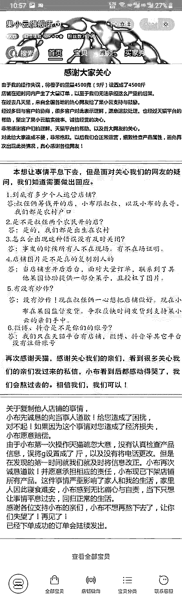
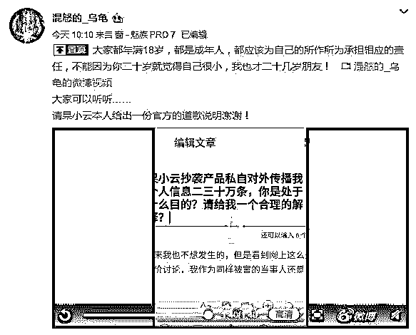
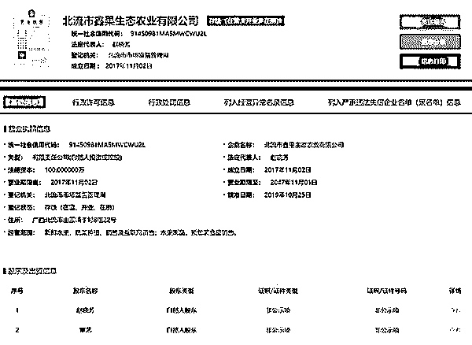

# 追踪丨被薅垮的网店背后：果农承认抄袭且家中无脐橙果园！

> 原文：[`mp.weixin.qq.com/s?__biz=MzIyMDYwMTk0Mw==&mid=2247496647&idx=1&sn=8582dbddbac0754a06140d8c6a12ad95&chksm=97cb38ffa0bcb1e9267a7d76d44033bd744df7d31bbab077a138fe098be416bbce4c39c3a873&scene=27#wechat_redirect`](http://mp.weixin.qq.com/s?__biz=MzIyMDYwMTk0Mw==&mid=2247496647&idx=1&sn=8582dbddbac0754a06140d8c6a12ad95&chksm=97cb38ffa0bcb1e9267a7d76d44033bd744df7d31bbab077a138fe098be416bbce4c39c3a873&scene=27#wechat_redirect)

**点击上方蓝色字体免费订阅“灰产圈”**

导语

从一开始被“薅羊毛”让人得知，到网友心疼水果大卖，再到网店涉嫌抄袭注册信息被曝光……如今，果小云旗舰店产品均已下架，只剩下三个声明。

果小云或许自己都没想到，大起大落能这么快。在最新的声明中，“果小云”表示：不想再熬下去了，让你们失望了，再见！

“薅羊毛”事件后，果小云网店被指抄袭

此前，“果小云旗舰店”因错标价格而致的“薅羊毛”事件在网上发酵。

在“薅羊毛”大 V 道歉、网店重开后，一位网友“混怒的乌龟”发文称果小云抄袭其店铺中脐橙的商品图片及设定，在商品详情页面中留下的联系方式也是其私人号码。

据报道，12 日，记者找到“被抄袭”店家，店主刘先生表示，有关脐橙商品及价格设定等信息是其自己的网店发布的，发布信息后发现后台订单数据异常，经过查询发现是后台设置错误，将 4500 克错写成了 4500 斤，于是及时进行了下线操作。“我们觉得这个事情就这么过去了……但是（随后）有一大堆的电话全部打来我个人的手机上，一直在找一个叫果小云旗舰店的人”。

13 日晚，一段疑似“果小云”打给被抄袭店主的录音曝光。录音中，“果小云”一方承认抄袭并表示愿意给予被抄袭者 500 元的经济赔偿。同时还向对方表示：希望化敌为友，自己资源多到无法想象。据报道，被抄袭的刘先生一方表示确有合伙人接到电话，但已拒绝“资源合作”。称自己没想过，也不会要物质补偿，只希望对方就抄袭和冒充农民道歉。

[`mp.weixin.qq.com/mp/readtemplate?t=pages/video_player_tmpl&action=mpvideo&auto=0&vid=wxv_1075541844978745347`](https://mp.weixin.qq.com/mp/readtemplate?t=pages/video_player_tmpl&action=mpvideo&auto=0&vid=wxv_1075541844978745347)

网店背后注册资金百万，农民身份遭质疑

在被“薅羊毛”事件发生后，得知店主是农民，“果小云”引来不少网友的同情，重新开张后，其所售脐橙大卖，月销 3 万余单。

然而据记者调查发现，“果小云旗舰店”在天猫认证公司北流市鑫果生态农业有限公司注册资金 100 万元，于 10 月 25 日刚变更了股东及法定代表人，由原来的练鸿南变更为覃艺和赵晓芳，二人各持股 50%。

果小云旗舰店所属公司股东为赵晓芳、覃艺

记者于 11 月 10 日前往北流市、玉林市等地进行实地调查，见到了该公司前负责人练鸿南。练鸿南表示，他此前用该公司信息注册了天猫网店，销售百香果、火龙果等；10 月底，经朋友介绍，覃艺与赵晓芳从其手中接手了这家公司及对应注册的网店。

而覃艺一直以在四川发货忙碌为由，未进一步接受采访。一位自称是覃艺合伙人的张锋向记者承认他们并无“自有脐橙果园”，但否认存在营销炒作。张锋称，网店的实际管理和运营是“小布和叔叔”，“覃艺是小布的表哥，他是小布的堂哥”。

此前“小布”以网店负责人身份曾在被“薅羊毛”后发布信息称，其与“叔叔”出身农村，凑钱开网店，“小布”负责操作店铺，“叔叔”负责采摘果子发货，并“跪下”向“羊毛党”求饶。

“小布和叔叔”是谁？张锋在电话中曾多次答应会让“小布”接受采访，但截至记者发稿时仍未实现。“小布和叔叔”是否真实存在，仍是谜团。

此外，张锋和覃艺关系特殊，二人在多家电子商务公司、日用百货公司控股、担任法定代表人和高管。其中，覃艺在张锋控股的玉林市穿云电子商务有限公司中担任监事。

[`v.qq.com/iframe/preview.html?vid=e3020p21e9i&auto=0&width=500px&height=375px`](https://v.qq.com/iframe/preview.html?vid=e3020p21e9i&auto=0&width=500px&height=375px)

视频来源|荔枝新闻 

另据媒体报道，“果小云”的店铺信息显示橙子产自成都，而记者下单后实际的发货地也在成都蒲县，那么两位实际控制人怎么会都在广西呢，又是不是农民呢？

11 月 11 日，一位自称“果小云”负责人哥哥，可以全权代表“果小云”发声的人对记者表示：“我们当然是农村的，都是农村户口你要不要看？家里还有自留地。”

可是记者追问“农村户口与农民或者果农是否可以划等号”，“到底是四川农村还是广西农村”等问题时，对方拒绝再谈。

**“让你们失望了，再见！****”**

在果小云店铺贴出的最新回应中，对于店铺图片是否复制别人，果小云旗舰店回应：“当店铺重开后，面对大量订单。联系到了其他果园协助提供一部分果子，且授权了图片。”

果小云旗舰店强调，自己没有炒作。关于复制他人店铺的事，果小云旗舰店表示道歉，愿意对造成的经济损失进行赔偿。

回应的结尾还写道：“小布不想再熬下去了，让你们失望了！再见了！”

目前店铺内所有商品均已下架。

而就在这段时间以来，果小云旗舰店的店铺粉丝从最开始的 2000 多人，涨到如今的 76831 人，翻了 38 倍以上。

**相关信息有待进一步查明，**

**更重要的是，**

**希望人们的善意，**

**不会再被利用。**

**编辑：吴明泽****责任编辑：孟夏****来源：中国青年报、齐鲁网·闪电新闻、澎湃新闻、荔枝新闻、北京日报**

← 向右滑动与灰产圈互动交流 →

**阅读原文加入灰产圈高端社群**