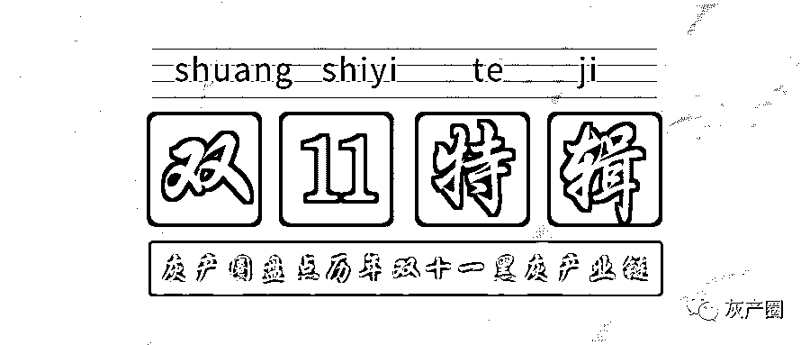
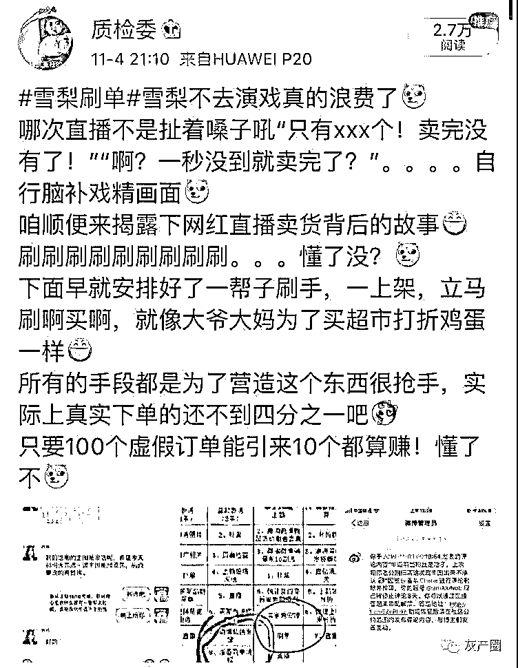
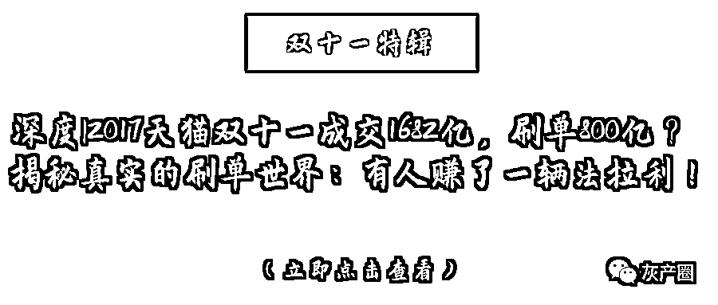
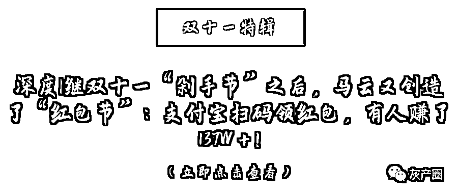
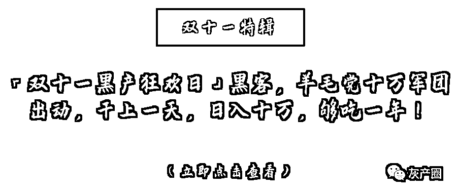
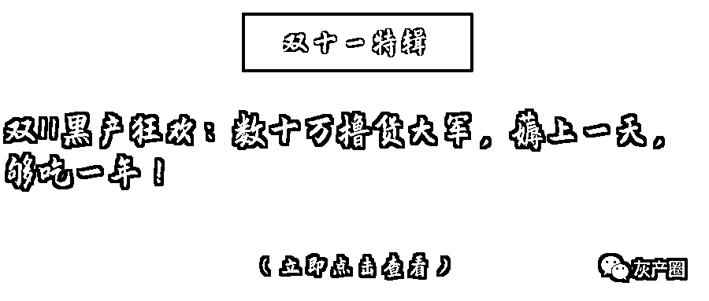
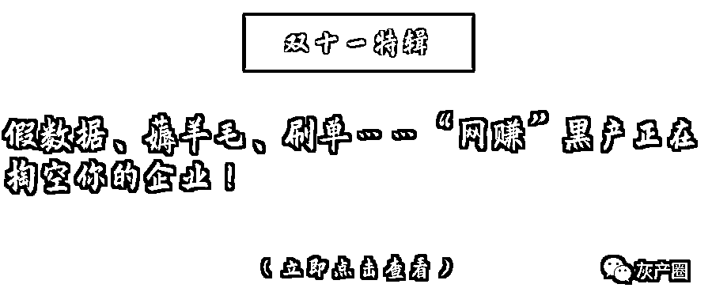
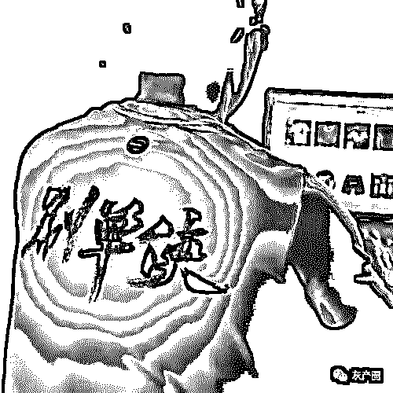

# 双 11 特辑：盘点历年双十一狂欢下的黑灰产业链！

> 原文：[`mp.weixin.qq.com/s?__biz=MzIyMDYwMTk0Mw==&mid=2247496615&idx=1&sn=1783dd6dc770fd645b569ba2797f01bd&chksm=97cb389fa0bcb1895fddaaf4d00655d1fd227e8805bf41547037f8fd7e6c45907bef724a382e&scene=27#wechat_redirect`](http://mp.weixin.qq.com/s?__biz=MzIyMDYwMTk0Mw==&mid=2247496615&idx=1&sn=1783dd6dc770fd645b569ba2797f01bd&chksm=97cb389fa0bcb1895fddaaf4d00655d1fd227e8805bf41547037f8fd7e6c45907bef724a382e&scene=27#wechat_redirect)

**点击上方蓝色字体免费订阅“灰产圈”**

双十一的号角昂然吹响，这是一场全民战役。

紧锣密鼓的营销安利轮番轰炸，应接不暇，空气中到处弥漫着“抢钱”的味道。斗法已至中场，狂热的气氛下又分明夹杂着一丝吊诡。

前有某天猫商家因价格战受挫放出对手猛料，称其为造成轰动效果，大肆刷单造假，今年更是数月前已开始动员布局刷单分队，竞争手段极其恶劣。

后有网红达人“雪梨”在一场直播卖货结束后，与工作人员复盘某商品销量时，“不慎”透露刷单内幕，直接提及要一百单一百单的加量刷，明晃晃上演了大型翻车现场，喜提热搜。

 

被刻意掩埋的暗黑藤蔓一点点破土而出，屡创新高的数据背后，除了数亿消费者散兵游勇式的冲锋，更是一场有组织有谋划的刷单暗战。

接下来，我来盘点下灰产圈之前关于双十一刷单以及电商黑灰产业链的文章，很多铁粉可能都看过，在这里我还是要照顾一下新粉，我们整理了一下，免得找了半天没找到，毕竟灰产圈文章真的不少，先提前祝大家双十一败家愉快！

1<sectionhttp: data-linktype="1"></sectionhttp:>2<phttp: data-linktype="1"></phttp:>3<sectionhttp: data-linktype="1"></sectionhttp:>4<sectionhttp: data-linktype="1"></sectionhttp:>5<sectionhttp: data-linktype="1"></sectionhttp:>6<sectionhttp: data-linktype="1"></sectionhttp:><sectiondisplay: inline-block="" top="">7<sectionpadding-left: inline-block="" top=""></sectionpadding-left:><sectiondisplay: inline-block="" top="">8<sectionpadding-left: inline-block="" top=""></sectionpadding-left:><sectiondisplay: inline-block="" top="">9<sectionpadding-left: inline-block="" top=""></sectionpadding-left:><sectiondisplay: inline-block="" top="">10<sectionpadding-left: inline-block="" top=""></sectionpadding-left:><sectiondisplay: inline-block="" top="">11<sectionpadding-left: inline-block="" top=""></sectionpadding-left:><sectiondisplay: inline-block="" top="">12<sectionpadding-left: inline-block="" top=""></sectionpadding-left:><sectiondisplay: inline-block="" top="">13<sectionpadding-left: inline-block="" top=""></sectionpadding-left:>

2017 年 11 月，十二届全国人大常委会第三十次会议表决通过新修订的《反不正当竞争法》中规定，刷单炒信行为将受到严厉查处。

令人费解的是，种种高压之下，刷单业并未因此一蹶不振，反而大有反扑之势。不为人知的另一面是，攻防大战不过是明面上的技术博弈，但两者间微妙的共生关系，才是这个灰产链条生生不息的根源所在。

 

电商平台的发展进程里，也伴随着两种难以调和的矛盾：一是运营部门和中层，他们需要向高层交上一份“完美的数据”;二是 VC 和投资人，他们需要证明业务繁荣，拉升估值。

今年的双十一的酣战如火如荼，但不论各家如何秀肌肉，最终的成绩单才是重点，一串串刷新历史的数字背后，若仔细推敲，反科学的猫腻比比皆是。

“实际上，我们之间算是各取所需的关系，但谁也不会主动捅破窗户纸。”一位浸淫刷单行业多年的 90 后对“卧底”媒体人员透露，“表面上电商平台对我们全力绞杀，但暗地里又故意留下漏洞，就是为了增加业务量。” 雪崩时，没有一片雪花无辜。刷单集团固然是灰色产业链的“执行者”，但更是人性中不断发酵的贪欲令其滋长出了更多的“恶之花”。扬汤止沸，不如去薪，溃痈虽痛，胜于养毒。刷亦或不刷，从来就不该成为一道选择题。

← 向右滑动与灰产圈互动交流 →

**阅读原文加入灰产圈高端社群**</sectiondisplay:></sectiondisplay:></sectiondisplay:></sectiondisplay:></sectiondisplay:></sectiondisplay:></sectiondisplay:>