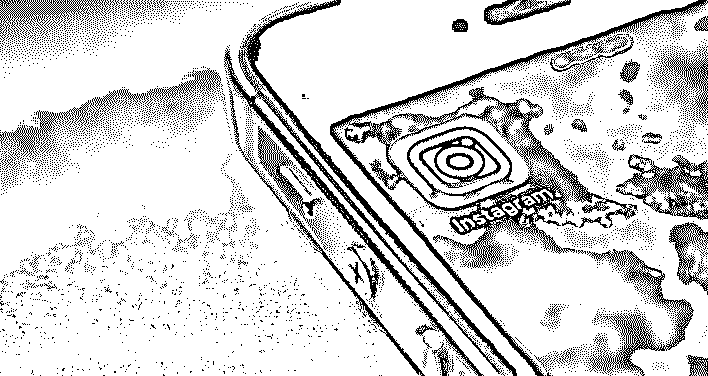
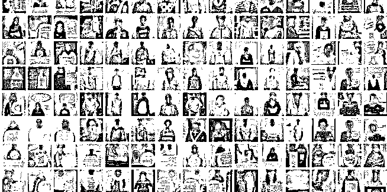
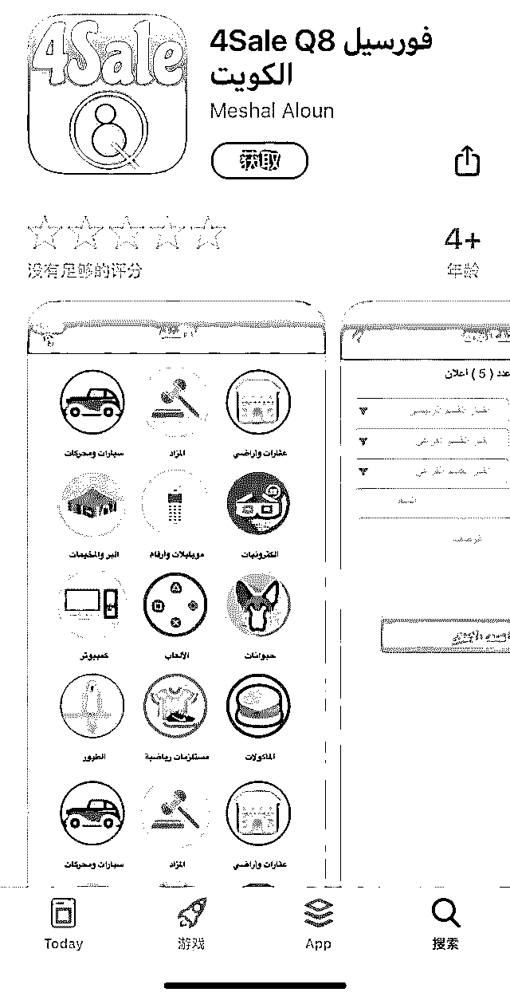
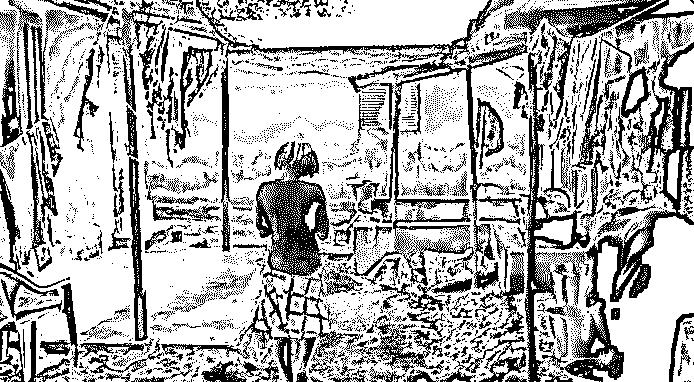
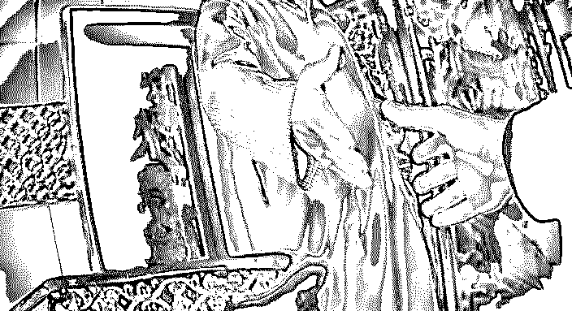
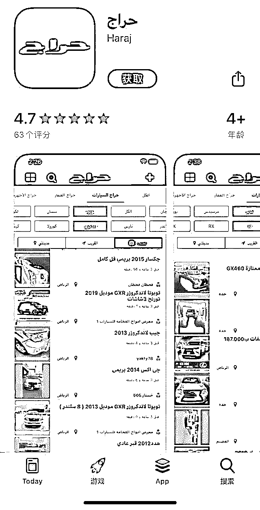

# 社交 APP 暗藏奴隶市场，上万女性标价出售，最小仅 16 岁…

> 原文：[`mp.weixin.qq.com/s?__biz=MzIyMDYwMTk0Mw==&mid=2247496595&idx=1&sn=4638fbf4e731bbab8562b1d248886f28&chksm=97cb38aba0bcb1bd2c474154e4997d83cfbb34108a9c9cf203a6575b2daf380109dcc1e6ad6b&scene=27#wechat_redirect`](http://mp.weixin.qq.com/s?__biz=MzIyMDYwMTk0Mw==&mid=2247496595&idx=1&sn=4638fbf4e731bbab8562b1d248886f28&chksm=97cb38aba0bcb1bd2c474154e4997d83cfbb34108a9c9cf203a6575b2daf380109dcc1e6ad6b&scene=27#wechat_redirect)

**点击上方蓝色字体免费订阅“灰产圈”**

01

# **黑市：**************“网上奴隶市场” 不同类别不同的价格等级************

******近日，BBC 记者在科威特进行的调查发现，**美国硅谷“打造”了一个网上“奴隶买卖黑市”，有人在黑市上买卖帮佣，产业“蓬勃发展”**。**********而这项买卖可以通过谷歌应用商店（Google Play）、苹果应用商店（AppStore）提供的 App，以及在脸书旗下的 Instagram 上由算法推动的话题标签来实现。************联合国当代奴隶问题特别报告员乌尔米拉·博呼拉称其为“网上奴隶市场”。**********************************Instagram 成为奴隶市场************报道称，倒卖“奴隶”的生意在黑市也十分火爆，甚至有人专门靠此牟利。************比如，**通过 App 挑选，以 2000 美元的价格买下一个女佣，然后以 3300 美元的价格卖出去，倒卖一个女佣就可赚 1300 美元（约合人民币 9150 元）**。******

# ****女佣像私人财产一样被买卖，就连警察也在网上出售女佣。****

 ****[`mp.weixin.qq.com/mp/readtemplate?t=pages/video_player_tmpl&action=mpvideo&auto=0&vid=wxv_1058521431203545088`](https://mp.weixin.qq.com/mp/readtemplate?t=pages/video_player_tmpl&action=mpvideo&auto=0&vid=wxv_1058521431203545088)**** ****90%的科威特家庭都雇有家佣，家佣一般为女性，来自比较贫穷的国家或地区，她们背井离乡，图的不过是挣钱养家糊口。********然而，现实是，这些女佣被当作商品，在各种互联网平台上被买来卖去。********每年有数千名女佣在不知情的情况下、被人当成财物般买卖，其中有受害人年仅 16 岁。********在**科威特**的大街上，你看不到这些女佣，她们被没收了护照和手机，被人藏在门后无法离开。********可拿起智能手机，你就可以滚动浏览她们的照片，**成千上万张，按年龄、种族、性格、来源等分类，不同类别不同的价格等级，让人以几千美元的价格购买**……**** ************科威特网上形成贩卖人口黑市****

****02****

****近日，BBC 卧底团队假扮一对刚到科威特的夫妇，走访了十几名试图通过一款名为“4Sale”的流行 App 向他们兜售家政服务的人。******************“她很听话，你可以叫她清晨 5 点起来干活……”**这是一名用户对其在售“奴隶”的描述。********用户以这些女性的“所有者”自居，剥夺她们的基本人权，比如不给她们放假，**“一天、一分钟，甚至一秒钟都不行。********”**************几乎每个人都主张没收女佣的护照，并让她们很少或根本无法使用手机。********4Sale 自称是“科威特最大的销售网站”，**拥有 140 多万活跃用户和 1080 多万广告**。对于买卖女佣业务，让用户可以根据种族进行筛选，不同类别提供不同的价格等级。********有一名**警察用户**也知法犯法参与人口贩卖，他在介绍自家女佣的时候说：**“即使让她工作到凌晨 5 点，她也不会抱怨。**********”**他还“好心”提醒 BBC 卧底夫妇记得收起女佣的护照，**“不要给她护照，你是她的赞助商，为什么要给她护照？**********”**********************联合国当代奴隶问题特别报告员乌尔米拉·博呼拉说，**“这是现代奴隶制的典型例子。********我们在这里看到，这些女性像私人财产一样被买卖。************”**。****************

****03****

# ******护照被没收还不能休息，工作 9 个月只拿到 2 个月工资。******

****BBC 的卧底夫妇选中了 16 岁的帮佣女孩法图。据介绍，法图从西非的几内亚被卖到科威特，已经做了 9 个月的女佣，而科威特的法律规定，**帮佣必须年满 21 岁**。****

****法图的雇主这样推销她：**“没有休息时间，护照和电话被没收，不允许独自离开房间”**。而这些在科威特都是非法行为。****

****BBC 记者将法图的案件交给科威特政府处理。科威特政府采取行动时，法图已经被卖到另一个家庭，幸好她最后被找到并被送入官方庇护所，现因未成年已遣返回国。****

******************BBC 团队跟随法图回到了她在几内亚首都科纳克里的家************后来，BBC 卧底团队跟随法图回到了她在几内亚首都科纳克里的家。法图透露，自己在科威特工作 9 个月期间曾为 3 个家庭打工，但只获得两个月工资，**“他们会骂我，称我做动物，我很受伤很不开心，但我无能为力”**。**********如今，法图回到了几内亚的学校继续校园生活。**“我很开心，现在的日子过得比以前好，生活好多了，感觉从奴隶制中被解放回来了。**********”**法图说。**************卧底团队发现，在几内亚，每年都有数百名妇女被贩卖到海湾国家做帮佣。一名做过女佣的几内亚女性说，**“科威特真是个地狱。******”**另一位说，**“那里的房子非常糟糕，睡不成觉，没有吃的，什么都没有。********”************

# ********原因：************中东“卡法拉”制度 造成劳资双方极不对等地位****************

******在科威特等多数中东国家，**帮佣由中介机构带进这个国家，潜在的雇主向中介机构支付费用，成为帮佣的正式担保人。********在这种被称为“卡法拉”（Kafala）的制度下，帮佣不能辞职，必须担保人给予“许可”才可以换工作，也不能在没有担保人许可的情况下离开这个国家**。像“4Sale”这样的 App 可以让雇主将帮佣的赞助权卖给其他雇主，从中获利。**********************BBC 卧底团队录制了与科威特帮佣卖家的对话**** ****令人震惊的是，这种“网上奴隶市场”不仅仅在科威特才有。调查发现，**在沙特阿拉伯，成千上万名女性在一款名为“Haraj”的 App 上被买卖。**********在脸书旗下的 Insta-gram 上，还有数千名女性被买卖。********************

****04****

******目前，海湾地区外籍女佣的困境已经引发了国际争议。******************2018 年 2 月，科威特警方发现 29 岁菲律宾女佣乔安娜陈尸于冰箱内，死亡时间超过一年。******************命案曝光之后，乔安娜生前遭雇主苛待、不给饭吃、一年只能跟家人通话三次等离谱待遇也被揭发，验尸官证实乔安娜生前曾遭殴打至肋骨断裂。************乔安娜虐杀案件甚至上升至国家外交危机。震怒的菲律宾总统杜特尔特实施了一项禁令，禁止菲律宾女佣前往科威特，甚至大手笔包机让至少 1 万名在科威特的菲律宾女佣免费返国。******

******BBC 曝光这一“网上奴隶市场”后，科威特公共人力部门负责人穆巴拉克·阿齐米表示，他们正在调查 BBC 报道中提到的一名妇女，她通过一款 App 将几内亚 16 岁女孩法图出售，此外报道中提及的那名警察也正在接受停职调查。******

******美国国际律师莫特利接了法图的案子，呼吁对那些参与贩卖法图的人提起刑事诉讼。******

******她表示：**“我认为，App 开发者肯定需要为法图提供赔偿，包括苹果和谷歌。************苹果商店宣称对上架的一切内容负责。************所以我们的问题是，这种责任意味着什么？************”********************************

******科威特政府表示：**“正在与这种买卖行为作斗争”**，并坚称将“严格审查”这些 App。******

****据悉，科威特政府已正式传唤几个社交媒体账号的所有者，这些账号被用来将家政工人贩卖为“奴隶”。****

****但到目前为止，还没有采取重大行动。****

********

********

********

****************

****← 向右滑动与灰产圈互动交流 →****

********

**************阅读原文加入灰产圈高端社群******