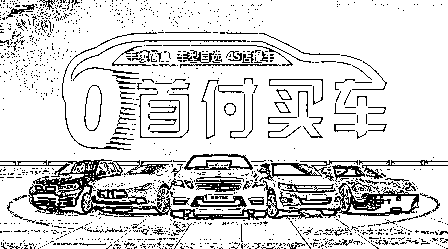
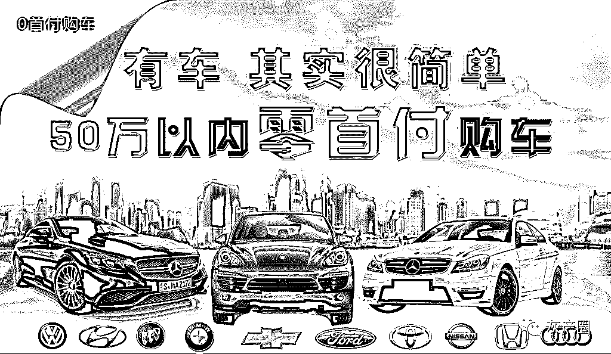
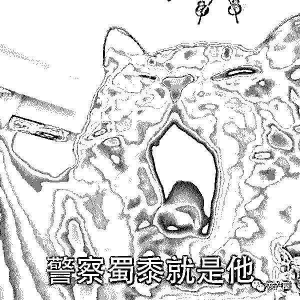
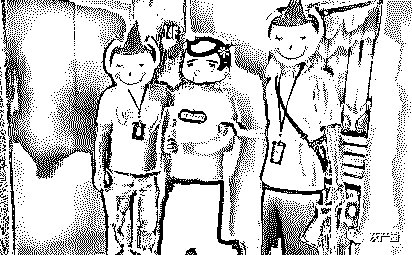
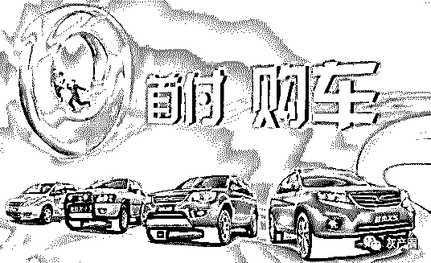
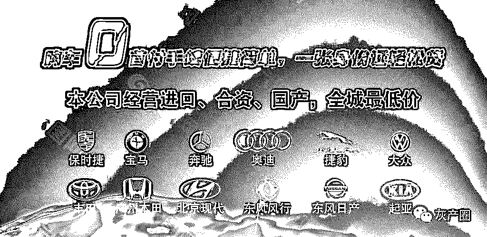

# 都 9012 年了，你还在相信“零首付购车”么？

> 原文：[`mp.weixin.qq.com/s?__biz=MzIyMDYwMTk0Mw==&mid=2247496546&idx=1&sn=315dc8cdaabdd5b746a628cf47acb824&chksm=97cb385aa0bcb14cbd829be69cb07ca4474c1501114ab208c0d5cd557746202d44e69e130017&scene=27#wechat_redirect`](http://mp.weixin.qq.com/s?__biz=MzIyMDYwMTk0Mw==&mid=2247496546&idx=1&sn=315dc8cdaabdd5b746a628cf47acb824&chksm=97cb385aa0bcb14cbd829be69cb07ca4474c1501114ab208c0d5cd557746202d44e69e130017&scene=27#wechat_redirect)

**点击上方蓝色字体免费订阅“灰产圈”**

买车、买房是很多深圳人的奋斗目标。相信很多囊中羞涩又想买车的人，都曾经被“零首付、免利息、轻松购车……”的广告诱惑过。

涉案资产 300 万！又有人掉进“购车零首付”套路贷

实际上，根据中国人民银行、银监会颁布的《汽车贷款管理办法》，汽车贷款的首付比例不得低于 20%，也就是说，“零首付购车”这个做法，本身就是不被允许的！

但是不少骗子还是搞“诱惑加码”，不仅号称可以“零首付购车”，还可以“购车贷款套现”！

既拿不到车，还赔了高额贷款！

  

今年 6 月中旬，家住深圳光明的市民 C 先生因资金周转需要，通过朋友接触到某汽车销售公司。对方称，不仅可以给 C 先生争取“零首付购车”，还可以帮 C 先生通过购车套取贷款！

既然要套现，那么合同金额自然是定得越高越好，在该公司业务员的安排下，C 先生签订了一份远高于汽车真实价格的购车合同，并贷款 20 余万元。

可是签订合同之后，C 先生却傻了眼，原来，汽车销售公司称想提车可以，但得按照合同来，要求 C 先生按合同价支付车款。

双方僵持一个月之后，拿不到车还被迫还贷的 C 先生才意识到自己被骗了，于是报警。

接到报警后，警方立即成立专案组展开侦查。

经查，一个打着卖车幌子，骗车又骗贷的“套路车贷”犯罪团伙浮出水面。该团伙在微信群、QQ 群中，大肆宣传“零首付办理购车套取贷款”，如果有人心动，该团伙成员再私下找到目标，以“零首付”“立刻套现贷款”等话术游说，诱导借贷者签订埋有陷阱的购车合同。

当借贷者想要提车时，该团伙又称借贷者不按合同价格提车，使得借贷者最终车、钱两失。

9 月 26 日凌晨，警方对该团伙开展统一收网行动，抓获违法人员 11 名，现场扣押合同、电脑、手机等一大批违法证据，扣押、冻结涉案资产共计 300 多万元。目前，该团伙 11 名嫌疑人已被依法拘留，案件正在进一步侦查中。

警方提供抓捕照片

零首付购车有什么猫腻？

“不收一分钱、让你开新车”“买车能融资、开新车、贷百万”，这些来自骗子的广告十分诱人，透露出一种“不仅让你有车开，还有钱挣”的意味。

但请大家开动脑筋想想，世界上怎么可能有这么好的事情？

环环踩雷的“零首付购车”

*   合同

价值十万元的车，合同上硬是又拔高了十万元。售车公司会如约转账 20 万元（留下转账痕迹），但又立刻让你交回 10 万元现金的“手续费”（不留下转账痕迹）。

同时，合同上的还款日期，甚至会精确到分钟。

*   违约

当借贷者拿着 10 万（车价）来还款时，售车公司会要求其按照合同还款 20 万。银行的流水记录确实是售车公司转账了 20 万元，但借贷者却没证据显示自己还回了 10 万元现金——售车公司据此认定借贷者违约。

即使借贷者真的还款 20 万，售车公司也会以各种理由搪塞拖延，一旦超过时间——售车公司同样认定是借贷者违约。此时，借贷者不仅要还 20 万，还要赔偿高额的违约金。

*   提车

就算借贷者倾家荡产还上了所有贷款、违约金，售车公司仍会以种种理由不交车，比如要办理车牌，需要提交各种手续等。

即使所有手续都办好了，套路贷公司也会以借贷者违反了合同中规定的还款日期等理由，强行收回车子……

环环踩雷，步步惊心，可以说，只要你相信了“零首付购车”的广告，那么结局就会是丢车又丢钱！

远离“套路车贷”！

  

那么，到底如何避免陷入这种陷阱？

除了远离“零首付购车”广告以外，你还需要做到这些：

1、提高自身防范意识

在“小额贷款公司”进行借款前，借款人一定从官方途径、经营资质等方式查询其是否正规。在正规贷款平台借贷，自身权益才有保障。

2、不随意签订借款合同

合同签字之前应当仔细看清楚，借多少写多少。凡是口头保证却不肯写进合同的，绝不签名。签合同时如果有空白条目，一定写清楚或直接划去，不给对方留可篡改的空间。

3、但凡钱款往来，务必留存证据

尤其是现金往来！记得拍照、录制视频或者到有视频监控的地方操作。归还本金或者支付利息一定要汇入双方书面确认的账户，以现金方式交付的要求出具收条。

4、及时止损，果断报警

发现被“套路贷”后，要毫不犹豫地立即止损、报警，并向亲朋好友广而告之。同时，如果对方讨债时涉嫌暴力恐吓、骚扰滋事，一定要做好防范和取证。

结尾

  

最后，大家还是要记住那句话！

“零首付购车”违法！还藏着无数陷阱！

选择“零首付购车”，意味着告别购车！！！

[`v.qq.com/iframe/preview.html?vid=o30163humd2&auto=0`](https://v.qq.com/iframe/preview.html?vid=o30163humd2&auto=0)

**远离零首付购车“背债”业务！别让“黑中介”给你玩进监狱！**

← 向右滑动与灰产圈互动交流 →

**阅读原文加入灰产圈高端社群**