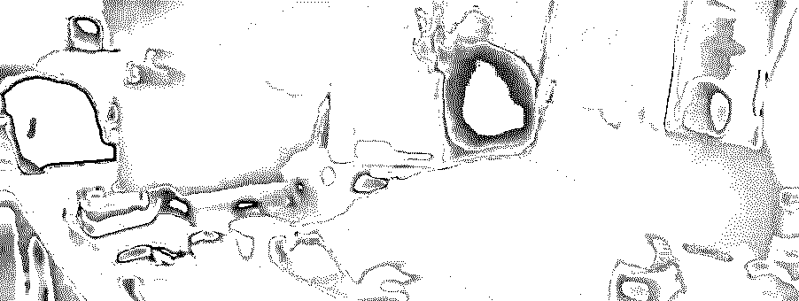
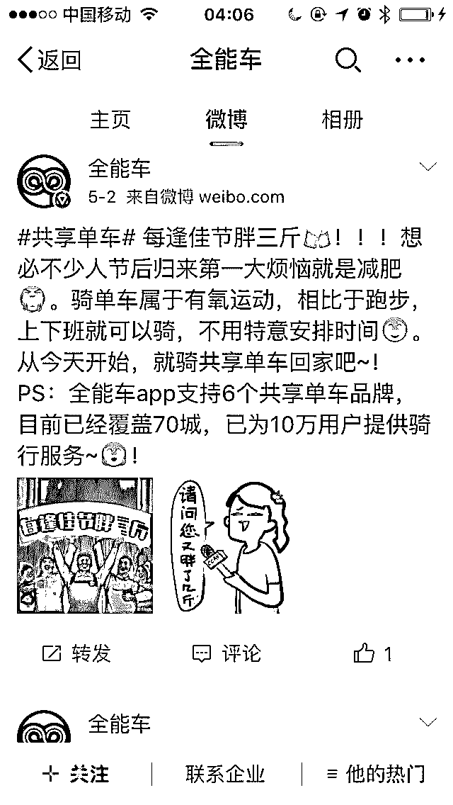
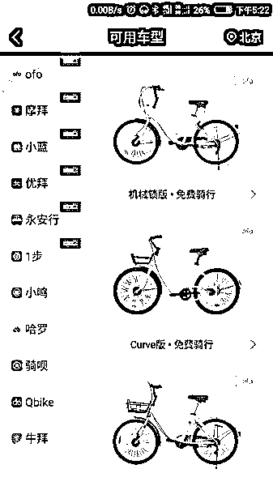
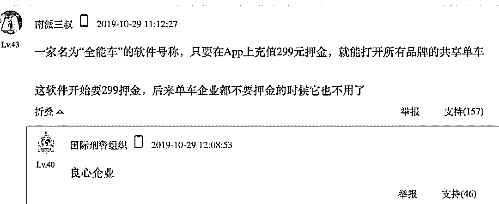
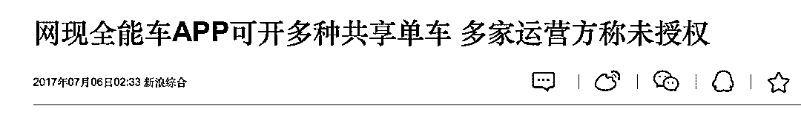
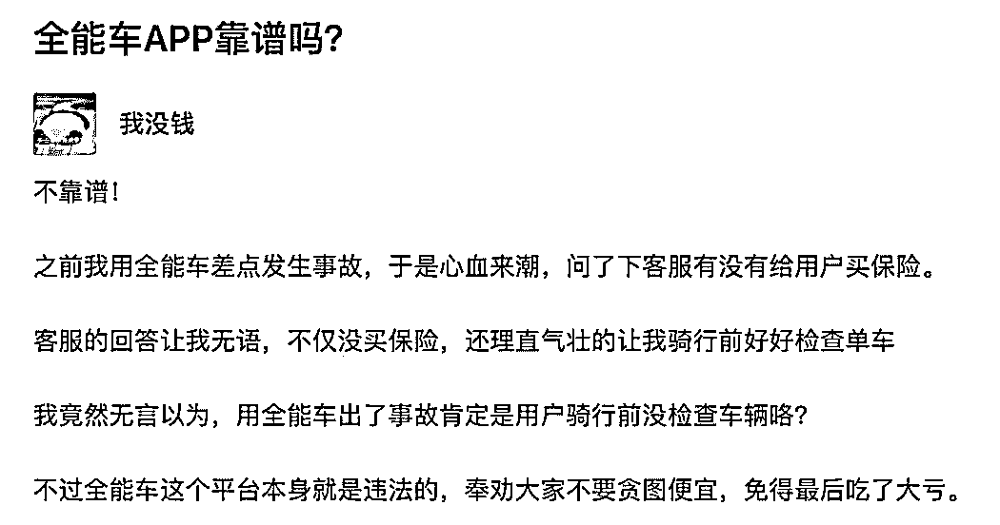
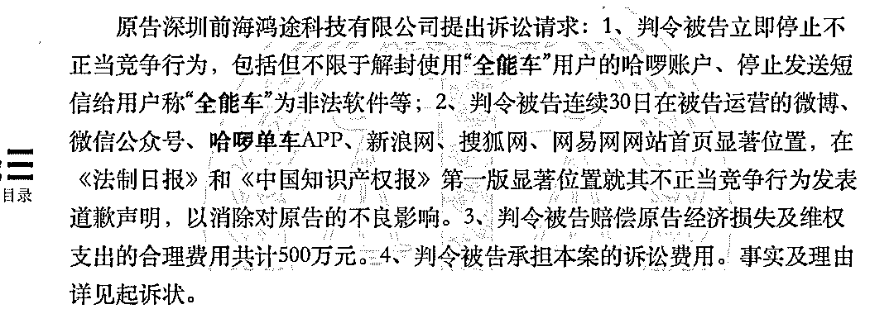
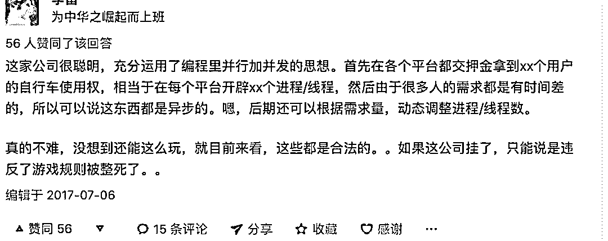
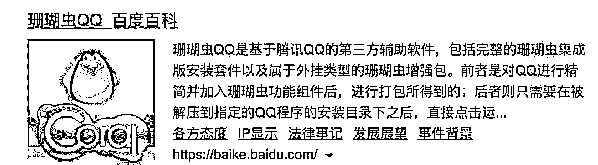

# 空手薅走 3 亿元「共享单车」羊毛，「全能车」落网背后

> 原文：[`mp.weixin.qq.com/s?__biz=MzIyMDYwMTk0Mw==&mid=2247496539&idx=1&sn=cd646cf25cfe54853d5833fcc9b26c95&chksm=97cb3863a0bcb175f7a25e43e8f369e33621c0748095906def6ececc82b152b684ed31280866&scene=27#wechat_redirect`](http://mp.weixin.qq.com/s?__biz=MzIyMDYwMTk0Mw==&mid=2247496539&idx=1&sn=cd646cf25cfe54853d5833fcc9b26c95&chksm=97cb3863a0bcb175f7a25e43e8f369e33621c0748095906def6ececc82b152b684ed31280866&scene=27#wechat_redirect)

**点击上方蓝色字体免费订阅“灰产圈”**

共享单车版“万能钥匙”之称的「全能车」App 最终还是翻车了。近日，上海警方暗中前往深圳，将还在办公的全能车员工悉数带走。

       

1 个 App 轻松打开市面上所有的共享单车。「全能车」自 2017 年 4 月开始上线起无数次官司缠身，却安然无事，到 2019 年 10 月却突然被媒体报道警方抓捕。

全能车究竟是触犯了什么法规？为何他之前能安然的存活这么久？此次被抓捕背后又有哪些藏在水面之下的问题呢？

**全能车：****我们不生产共享单车，我们只是服务的搬运工**

一般情况下，我们想到的羊毛党，就是微博打小广告，QQ 上私下接单，以及各种随机生产的网页地址。不过，全能车 App 却完全是另一派的作风。

它有正儿八经的官网，有专人运营官方微博，它的应用上线在各大应用商店，包括 app store。

作为一个共享单车聚合平台，全能车的使用很简单：

用户只需在该 APP 上充值 299 元的押金，并使用真实姓名及手机号码注册后，就能实现**“交一份钱，骑多款车”**，包括摩拜、ofo、小蓝在内的多种品牌的共享单车。

而且在支付宝等 app 推出免押金骑行后，它也同时免押金了，而且推出了更进一步的优惠条款：

「通过全能车骑车，你可以享受到低至半折的优惠骑车价格。」

和支付宝的入口一样方便，同时提供更低廉的价格。正如其官网所称，它最大限度调用共享单车资源，帮助用户减少使用成本。

对于需要频繁骑车的用户来说，全能车这样的 APP 简直是良心软件。

不过，有心之人可能会好奇，这款 app 收价如此之低，共享单车那边应该也还要收钱，它就究竟靠什么盈利呢？

警方的证词讲的很清楚，「“全能车”公司旗下没有任何一辆自己的共享单车，实际是一款黑客软件，通过入侵截取共享单车服务器发送的数据包，并破解、添加会员信息，伪装成月卡或年卡用户，再返回数据包，以此欺骗服务器，实现开锁。」

简而言之：全能车的运营者就是到 ofo、摩拜、小蓝单车各个平台注册一些月卡、年卡账号，然后将这些账号共享给平台用户。

因为平台的用户不可能同一时间使用，所以，它可以用少量的账号，可以满足大量用户的需求。而全能车平台方，则以用户骑车产生的计时费用作为收入。

所以实际上，全能车的用户骑行单车时，是没有一分钱给到共享单车的，因此随着“全能车”的走红，各家共享单车难免会对他虎视眈眈。

**大胆运营：****在违规的边缘疯狂试探**

2017 年 7 月 6 日，摩拜和 ofo 先后对媒体表示，全能车大量购买个人的身份证信息，再去用这些信息实名认证注册各家共享单车，全能车的接口已被摩拜和 ofo 封禁。不过也仅是发函而已。

       

不过，全能车 App 还是一如既往的运营着，官博也照样更新。

这主要因为，作为一款违规的产品，就规模而言，全能车的用户量实在太小，一般单车平台就发发律师函警告，外加技术手段封禁，不会和它去法庭硬怼，毕竟打官司太麻烦了。

唯一烦恼的是，全能车涉及的安全问题。2018 年，ofo 和全能车就因为安全问题同时成为被告。

一位全能车用户骑行 ofo 的过程中摔伤住院，花去医疗费 25 万余元，但 ofo 和全能车双方都拒绝理赔，用户将 ofo 和全能车告上法庭。

ofo 辩称全能车违法入侵 ofo 共享单车数据接口盗取车辆，责任应侵权人全能车承担；全能车辩称，自己不提供共享单车，也不承担共享单车的运营及维护、维修，用户有检查车辆状况的义务。最后，法院判决 ofo 和全能车共同承担责任。

虽说有一些小麻烦，但整体来说，全能车的日子还是岁月静好，你封杀就封杀，我这边另外破解，大家彼此没有撕破脸。

但是在今年 5 月 9 日，全能车却突然做出了一个反常举动，它倒打一耙将哈啰单车告上法庭。

全能车的诉求包括：解封使用“全能车”用户的哈啰账户、停止发送短信给用户称“全能车”为非法软件等，而且请求法院判决哈啰出行赔偿全能车经济损失及维权支出费用 500 万元。

      

在这个诉讼上报没多久，哈啰单车就向警方报警，称全能车是一款非法工具给哈啰单车造成了 3 亿元的损失，最终导致了文章开头讲到的逮捕一幕。

究竟是全能车嗅到了哈啰单车的行动，所以临死挣扎；还是哈啰单车不甘被全能车上诉，硬气回应，我们不得而知。

但是，全能车和哈啰单车的这一冲突是必然的。

**全能车被起诉背后**

早在开始之初，其实明眼人就已经知道它是一个违规工具。而且全能车造成的那点损失，对于共享单车企业来说并不足挂齿。绝非媒体说到的 3 亿那么夸张。

       

因此“全能车”App 最大的合法性问题，绝不是上面说的盗用身份信息，盗用车辆，经济损失等问题，而更可能是当其大到一定程度后，会模糊和混淆各大共享单车的品牌界限，让哈啰单车烧钱砸出的品牌认知，被直接窃取。

这两年，哈啰单车背靠支付宝免押金骑行，迅速铺开到三四线城市，同时也极大的促进支付宝的推广，是共享单车领域的后起之秀。

而在使用全能车 app 的情况下，无所谓哈啰单车、ofo 还是摩拜单车，大家眼中都是一样的，支付宝的入口更是无足轻重。而这影响到了哈啰的发展态势。最终逼得他痛下杀手。

其实早在十多年前，同样的事情也曾发生。

2007 年夏天，北京理工大学计算中心的陈寿福老师被羁押。他被腾讯起诉侵犯著作权罪，最终被深圳南山区法院判处有期徒刑三年，并处罚金人民币 120 万元。

陈寿福老师制作的“珊瑚虫 QQ”，是一个装有外挂的 QQ，能让网民在聊天时不受广告的骚扰。当时腾讯最大的收入来源是 QQ 广告， 客户端广告经常铺天盖地。

        

在 2003 年的腾讯首次打击外挂中，各个修改版的作者纷纷退出，包括陈寿福自己也写了不再开发的保证书。但此后没多久，为了阻击 MSN，腾讯再度默许珊瑚虫等修改版 QQ 开发，甚至在自己的下载站首要位置提供珊瑚虫 QQ 下载。

陈寿福开发出“腾讯 QQ 珊瑚虫增强包”可以与 QQ 软件自动结合，并改变 QQ 的某些功能。同情陈寿福的人将其比喻为“就像机顶盒增强了电视机的一些功能，你能说机顶盒侵犯电视机的著作权吗？”而腾讯下载站收录珊瑚虫，也被视为官方的默许。

但是，判决当头，一切挣扎都是徒劳。

实际上，珊瑚虫最大问题在于其威胁到了 QQ 的品牌地位，坊间的“QQ 有广告，用珊瑚虫更好”之类的信息，会被解释为：有一种比 QQ 更好的聊天软件叫“珊瑚虫”。

全能车的被捕，只是将历史重演了一遍。阿里不希望听到，有一种比哈啰单车更好的软件叫全能车；更不希望，支付宝的入口被一个全能车的替代。

参考链接：https://www.zhihu.com/search?type=content&q=全能车和珊瑚虫

来源：极验

← 向右滑动与灰产圈互动交流 →

**阅读原文加入灰产圈高端社群**