# 羊毛党、狗推、黑中介：无处不在的网络黑产！

> 原文：[`mp.weixin.qq.com/s?__biz=MzIyMDYwMTk0Mw==&mid=2247496495&idx=1&sn=d04d193f2dfa4df212a24917596f6e4a&chksm=97cb3817a0bcb101565bae92d8e36dd75b3832492c8ddd726d89d73a938feaa183e153e02627&scene=27#wechat_redirect`](http://mp.weixin.qq.com/s?__biz=MzIyMDYwMTk0Mw==&mid=2247496495&idx=1&sn=d04d193f2dfa4df212a24917596f6e4a&chksm=97cb3817a0bcb101565bae92d8e36dd75b3832492c8ddd726d89d73a938feaa183e153e02627&scene=27#wechat_redirect)

**点击上方蓝色字体免费订阅“灰产圈”**

导语

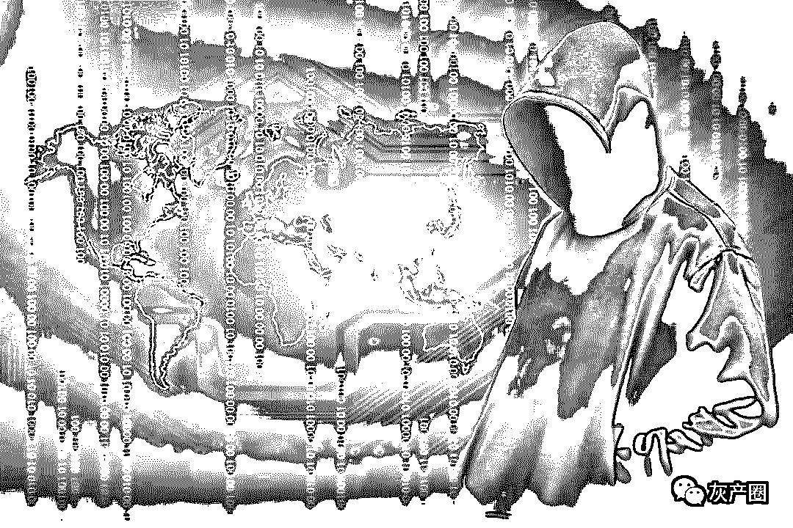

什么是薅羊毛？

这一名词远不止在电商平台找优惠券、抢到 0 元购商品那么简单。

近日，某电商平台出现百元优惠券漏洞被大量薅羊毛，敲响了防控大数据黑产业的警钟。组织严密的黑灰产业链条，先进技术手段攻破平台风控防线，百万元级利润收入……羊毛党是如何变成有组织的产业并日渐壮大的？

他们对互联网产业的健康发展带来了怎样的危害？我们就此进行了调查。

拨开羊毛圈：只有你想不到，没有我薅不到

我们进入了一个羊毛群，发现这里仿佛是另一个世界：一些忙着往群里扔福利的大 V，几百个每日蹲守群里接福利的羊毛客，不断被朋友拉进群的小白……他们有自己的网站、论坛，平时会交流心得、总结经验、分享线报。

从各大网站 BUG 价、秒杀价，到 P2P、区块链、小额借贷等平台的注册金，如今羊毛客们又大量回归并专注于电商平台以及公众号福利。我们在一个专注某电商平台福利的微信群里看到，群主在 5 个小时里发布了 98 条线报，主要集中在商品秒杀、领券等优惠信息，同时也有试玩 App 等花样繁多的刷单式羊毛。我们在一位羊毛客的指导下尝试下载某 App 并按要求停留 3 分钟，果然收到了 0.16 元的赏金。网友看夕阳落下称，自己入行仅一个月，就已经赚了 5000-6000 元。

但这只是薅羊毛的入门级操作。从蝇头小利中不断累积的羊毛客，渐渐发展成拥有大量资源和专业设备的羊毛大户。据介绍，羊毛大户们大多积累了大量身份资料，有可靠的关系网络收集线报，有程序员功底。这从某平台网站在凌晨出现优惠券漏洞，随即被迅速领取数千万元的案例中可见一斑。

据群内羊毛客介绍，邮币卡火的时候，某大牛一高兴直接提了宝马 3 系，某大牛单每月的理财收益就有 8000 元以上，如今行情不好，很多网络项目也被封杀殆尽，许多大牛的公众号也被封杀。但大户依然存在，并正在借用更高级的科技手段，成为活跃在互联网平台背后的一群黑色阴影。

探寻羊毛头：手握万号抢优惠 狠钻空子建黑产

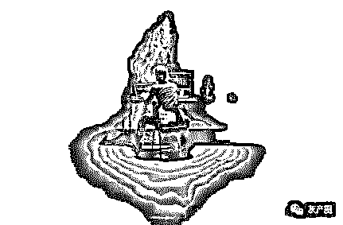

在羊毛党的圈子内，不少骇人听闻的案例被传为美谈：某上市公司用现金激励推广直播软件，但 10 亿元以上的主播奖励大部分被羊毛党以黑卡套走；某电商平台发放满 2000 元减 50 元优惠券漏设使用门槛，有羊毛党一人就狂刷 1.7 万单……

羊毛党何以能短时间内攻击并薅垮一家平台？业内人士揭露，薅羊毛三字背后是巨大的黑产圈。

安全产品专家刘庆介绍，近几年越来越多的企业开展撒钱吸引新用户、拉流量的活动，着实养肥了不少黑产业。黑产业分工也愈发精细，并不断利用新兴技术手段。

新用户优惠拦不住羊毛党的步伐：黑灰产人员或是拥有多达数十万乃至千万级别的手机黑卡库，或是利用接码平台的大量卡号资源，以每条 0.1 元左右的价格接验证码，快速并大批量注册。高级的验证码技术有时也难以形成防控机制：羊毛党利用打码平台的人工智能技术，以机器、人工结合的方式识别各种图片验证码。2017 年，绍兴警方就曾通报其破获的快啊打码平台案件，该平台 3 个月内就提供了验证码识别服务 259 亿次。

互联网上缺乏安全防控的促销、红包活动中，70%-80%的优惠都会被羊毛党薅走。大规模的批量机器下单，甚至能够造成网站瘫痪。

面对羊毛党来袭，此前有电商平台紧急召回已发出的货物；有知名咖啡品牌紧急叫停赠饮活动。但经验丰富的羊毛党大多掌握专有洗白渠道，青睐高流通性的话费、Q 币等产品，一旦变现就难以追回，很多平台不得不吃哑巴亏。

饿狼扑羊毛：从卡号到企业亟待建立安全网

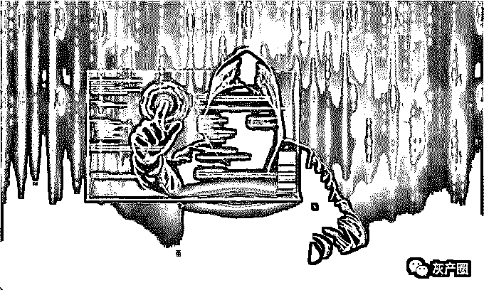

掠夺网络资源、参与流量造假、逼停创业公司，羊毛党更像是一群饿狼党。事实上，他们的行为已不再只是游离于违法的边缘。

律师表示，通过购买、交换或网络下载等方式获得私人手机号码等个人信息，用以在网络平台注册换取首单优惠等，就构成了侵犯公民个人信息罪；而羊毛党通过不正当途径获取大量平台优惠券，则可能面临盗窃罪的处罚，各地量刑标准不同，在上海累计达到 1000 元就构成盗窃罪。

深探黑产业背后，他们抢占优惠的大量手机卡号究竟从何而来？除了实名注册的国内手机卡、境外手机卡等，根据业内机构的调查，目前流通的手机黑卡中 80%以上是物联网卡。

手机黑卡的平台化趋势亟须管控。除了进一步细化对手机实名制管理的规定，还应针对电信运营商号卡建立体系化管控机制，特别是针对物联网卡等新类别的号卡，最好采用专门号段，更要加强号卡供应商的资质审核和管理，严禁层层转售。

一方面，对于企业来说，升级风控体系成为必要选择。由于黑灰产业群体应用的技术手段非常多，因此企业需要使用更多数据维度和指标，构建更复杂的策略、模型进行防御。另一方面，要整合互联网安全企业资源，形成有效的系统化合力。杨天一建议，建立共享的黑卡数据库，并鼓励社会力量参与，为进一步加大对黑卡的精准打击等提供支撑。

“暗刷流量”黑色产业曝光

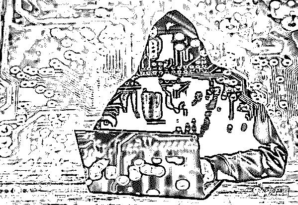

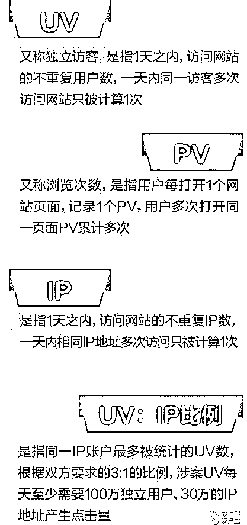

为提高网络的点击量，有一种玩法是通过购买网络暗刷服务来实现，致使不少网络游戏玩家被这一虚假流量误导。

5 月 23 日，常某诉许某暗刷流量案在北京互联网法院开庭审理。作为全国首例暗刷流量案，此案备受关注。合议庭依法公开审理，并当庭宣判，依法驳回原告全部诉讼请求，并对合同履行过程中的获利全部予以收缴。

拖欠暗刷流量费被起诉

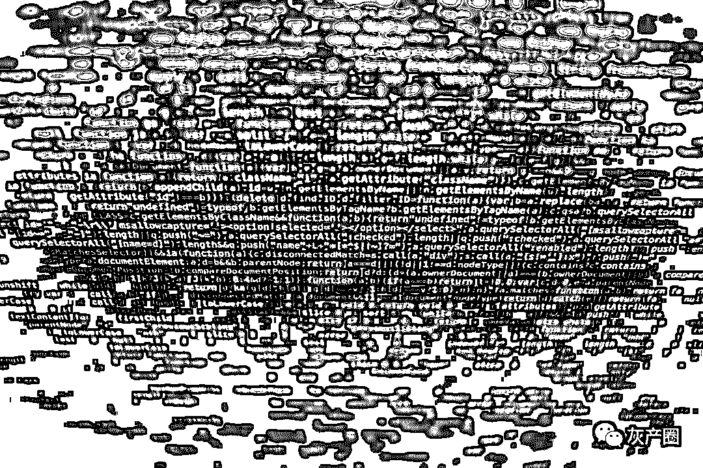

我有个朋友在找暗刷的流量，你(王鹏)有资源吗？要求植入一个 JS 暗刷点击，目前就要移动端 IOS 的量，日 UV(独立访客)最好 50W 以上，不要机刷……但要真量。庭审中，许某陈述了这场关于暗刷的交易。

所谓 JS 暗刷，即是真实用户的点击；机刷，则是用机器实现模拟用户的访问。许某要求植入一个 JS 暗刷点击，就是借助其他 APP 或广告的点击量，在其中植入 JS 暗刷点击，通过搭其他广告便车的方式，来刷其自身游戏的访问量，并且不被相关用户知晓。

2017 年 9 月 11 日至 9 月 14 日，许某与昵称为王鹏的微信用户之间就流量暗刷交易达成合意。常某系昵称为王鹏的微信账户的使用者和控制者，涉案合同的聊天信息由常某作出，本案合同供方为常某。

常某诉称，被告许某通过其微信向原告寻求暗刷流量，双方就暗刷流量达成一致，通过电子邮件确认了统计链接、结算方式、单价等内容，并确定按被告指定的第三方后台 CNZZ 统计数据结算。

根据约定，双方合同履行共进行了 3 次结算，结算单价从 0.9 元/千次 UV 改为 1.1 元/千次 UV。原告最后一次为被告提供“暗刷流量”服务发生费用 30743 元。可是，经原告催促，被告迟迟拒绝付款，故原告起诉至北京互联网法院，请求法院判令被告支付服务费 30743 元及利息。

涉案合同违反社会公共利益

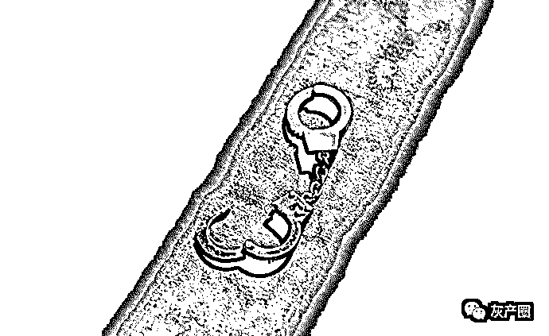

此案涉及的合同是否有效，是法庭争议的焦点之一。被告许某认为，暗刷流量合同因违法而无效。原告与被告之间实质为居间服务关系，暗刷流量的受益方为被告上家，被告并没有向原告支付服务费的义务。同时，原告提供的“暗刷流量”本身违反法律禁止性规定，此类服务提供方无权要求支付对价，依托此类服务所成就的服务协议因违反法律禁止性规定而应认定为无效。

北京互联网法院认为，根据《合同法》第 52 条第 4 项规定，有损害社会公共利益情形的合同无效。网络产品的真实流量能在一定程度上反映网络产品的受欢迎程度甚至质量优劣情况，因此，流量成为网络用户选择网络产品的决定因素之一。虚假流量会扭曲网络用户的决策。

涉案合同当事人通过作弊造假行为进行欺诈性点击，违反商业道德底线，违背诚信原则。这一行为也同时侵害了社会公共利益，既侵害了不特定市场竞争者的利益，又会欺骗、误导网络用户选择与其预期不相符的网络产品，侵害广大网络用户利益。涉案合同违反社会公共利益、违反公序良俗，应属绝对无效。

双方通过虚假流量交易获益，违背任何人不得因违法行为获益的基本法理。同时，考虑到本案呈现的技术复杂性、“暗刷流量”行为的隐蔽性，以及由此产生的对社会公共利益的严重损害，需通过个案的查处表明司法对此类行为的否定态度。因此，法院对双方在合同履行过程中的获利，另行制作决定书予以收缴。

全网直播揭露潜规则

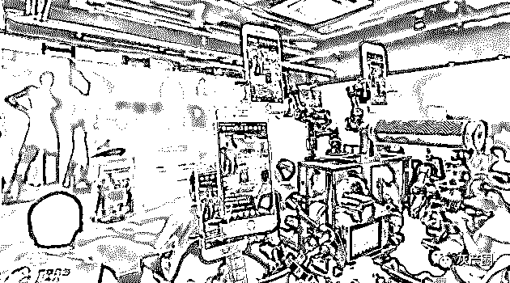

该案的审理全网直播，以审判的方式揭露互联网领域隐秘的潜规则。以提供暗刷流量技术服务牟利为主的黑色产业浮出水面。

如何实施暗刷流量行为？原告常某表示：我下面有代理商，代理商下面又有层层代理，所以会有很多人去实施点击。这些代理商可能是去付费购买用户点击，也可能是通过设置攒积分等形式，吸引用户的点击。

据了解，常某所说点击的链接是一串代码，其下家经常会做成吸引用户点击的图片。也就是说，看到感兴趣的图片的人，并不知道点击的动作是支持了另一个动作的暗刷。

该案审判长、北京互联网法院院长张雯表示，因本案暗刷流量涉及技术问题，较为专业，因此本案中引入了技术调查官，对本案涉及技术术语进行阐明，并明确对 JS 暗刷和机刷的含义。同时，法院向北京市通信管理局、北京市互联网信息办公室、深圳市腾讯计算机系统有限公司、北京市市场监督管理局、北京市公安局相关部门、CNZZ 运营公司北京锐讯灵通科技有限公司、上海东方计算机司法鉴定所等单位进行了大量走访调查。

庭审中，审判员出示了与本案有关的调查情况。相关部门的调查意见显示，JS 暗刷就是编写一个 JS 脚本，挂在一个网站代码或者 APP 里，置入暗链。当用户访问网站或者 APP 时，得出一定的点击量，但并不意味着实际有对应的人去注册或访问。这样带来的用户量是真实的用户点击，但是因为是暗链，用户并不知道点击了，用户并无感知，不是基于对被访问网站的兴趣而点击。

据了解，原告常某和被告许某相约通过暗刷流量技术操作，为某软件产品在应用场景增加虚假访问量，常某因涉案交易非法获取服务费 16130 元，许某通过涉案交易获取流量利益，拖欠服务费用 30743 元。

最终，法院驳回了常某的全部诉讼请求。同时，上述二人通过暗刷流量交易，获取非法经营利益，损害社会公共利益，法院对双方的非法所得予以收缴。

网络赌博、海外务工和黑中介：

一条针对程序员们的黑色产业链条

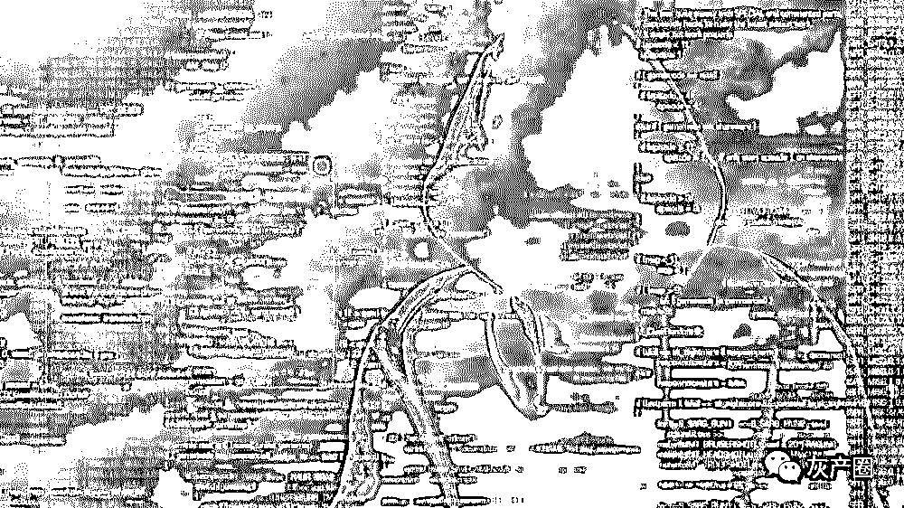

近来，一场关于 996 的网络大辩论引爆了各大媒体平台，在被资本家们榨干了最后的精力和健康，还美其名曰这是你修来的福报之后，互联网从业者这个曾经高薪群体的代名词，一时间牵扯出了无数的血泪汗水。

但更让人愤怒的是，却并非国内的压榨，而是来自于从国内招聘到国外奴役的黑色产业链条，把他们邪恶的黑手，伸向了这个疲敝交加的群体。

由于行业寒冬的到来，许多国内的互联网公司开始了强制加班、降薪甚至裁员，一时间，很多程序员陷入了失业或是无法继续忍受当下工作的境地，在这样的情况下，来自于东南亚的黑网络赌场，把目光投向了这个在职场中单纯而相对弱势的人群。

为了躲避国内警方的追捕，国内绝大多数已知的在线网络赌场，其网站和服务器都设在东南亚，而维护这一套庞大而复杂的系统，自然少不了专业技术人员。于是，为了用赌博手段从国人手中谋取暴利之后，丧心病狂的网赌经营者们，设下了对于对于国内正处于迷茫期的程序员们的圈套。

诱人的薪资、宽松的上班时间、东南亚优美的风光，甚至于当地的色情产业，都成了他们打造出来的诱人蛋糕。在当前的互联网寒冬中，程序员们的普遍薪资在 10 到 25K 之间，只有较为资深的主程或者大牛可以拿到 40K 左右。但在这些黑网站的招聘信息中，给普通程序员的薪资就在 30 万到 48 万，远远超过了国内的平均水准。

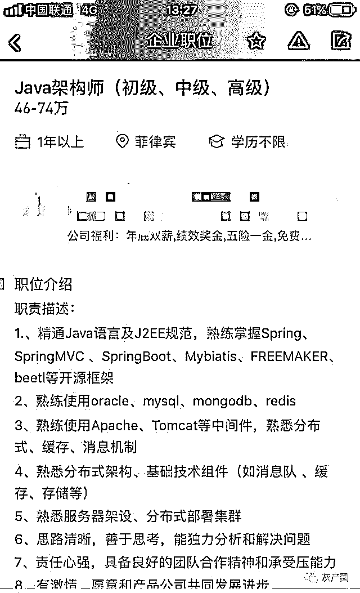

在生活的压力和诱惑下，相当一部分人在权衡利弊之后，买下了前往目的地的机票，踏上了一条不归路。

然而，怀着对赚钱和事业的憧憬，来到异国他乡的程序员们，却面临了空前的灾难。在入职伊始，他们的护照和身份证就会被人收走，接着是二十四小时的监控和无休无止的高强度血汗劳动，就连薪资，根本也是彻头彻尾的谎言。而一旦有人反抗，等待他们的，则是威胁、恐吓和殴打。

黑赌场们早年从国内骗人到境外赌博，进而进行暴力夺取的手段，再一次找上了用武之地，一天天榨干着被哄骗上当的程序员们仅存的价值。没有了休息、没有了薪水、没有了劳动保障，连自由都被人限制，他们只有在绝望中，日复一日的等待。

在被骗到海外的程序员中，仅有一小部分谨慎而机敏的人逃了出来，剩下的只能和这些丧心病狂的人进行合作，争取早日出来的机会。

在这个大骗局中，为了更快地让越来越多的人上当，黑网站们运用手中的财富，笼络了大量的和黑猎头和黑中介，让他们在招聘网站和平台上物色合适人选，而他们得到的报酬，往往是在国内做成一单的几倍到十几倍。在暴利面前，很少有人能抵住诱惑。

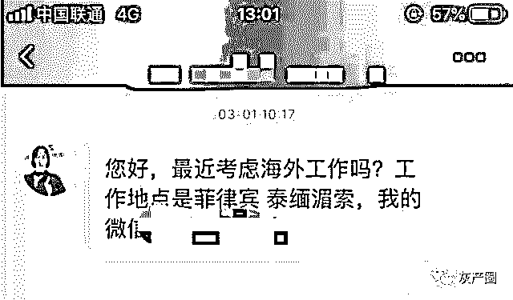

但更让人感到害怕的是，黑猎头们还不是这个黑色产业链条的最下游，在他们之下，还有无数黑培训机构，打着培训完成包高薪入职的幌子，将一个又一个对互联网事业满怀憧憬，却又毫无社会经验的年轻人，送到了东南亚的黑砖窑。

而在这个黑色产业链条之外，又催生了其他分支，比如打着 0 基础，包吃住做游戏推广的黑中介们，其实是把人们骗到国外，让他们再去欺骗自己的亲朋好友，来到网站赌博，然后在失去利用价值后，被遗弃在异国他乡，自生自灭。

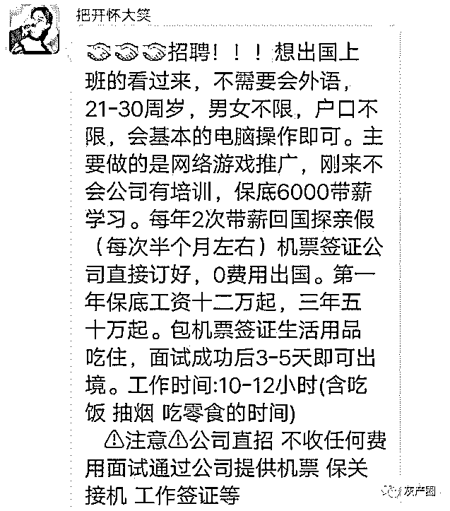

结尾

从黑赌场的拥有者、运营者到黑中介，再到黑培训机构，在这条邪恶的利益链条中，他们吃着蘸着人血的馒头，个个吃的肚饱肠圆，而唯一的受害者，只有沦为他们工具的劳动者，他们仅仅是想要赚钱养家，仅仅是需要一份不需要拼却性命的工作。

但在这些人看来，所有他人正常的需求，全部是可以利用的弱点。

← 向右滑动与灰产圈互动交流 →

**阅读原文加入灰产圈高端社群**