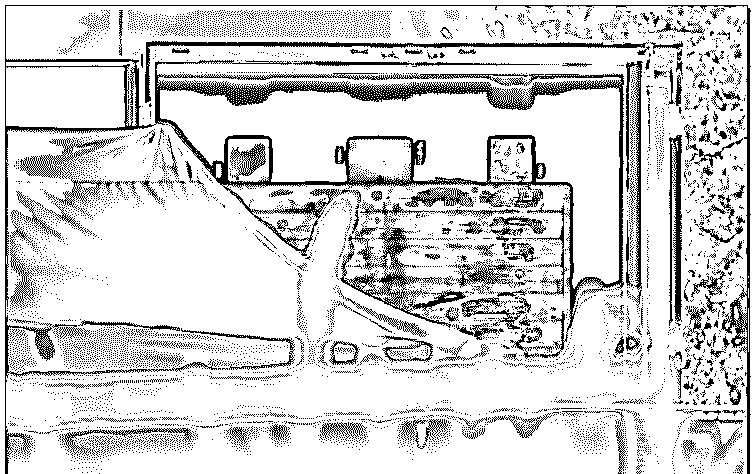
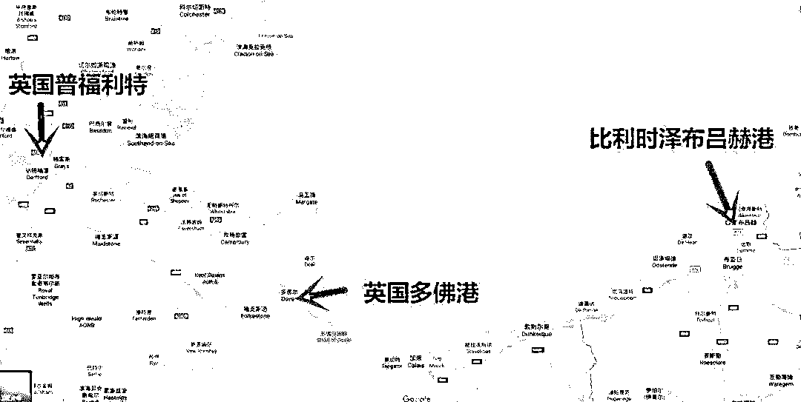
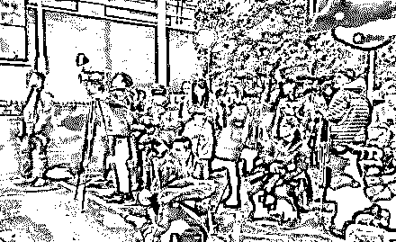
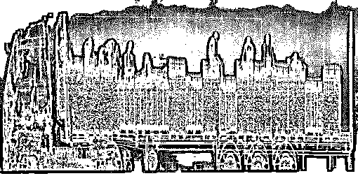
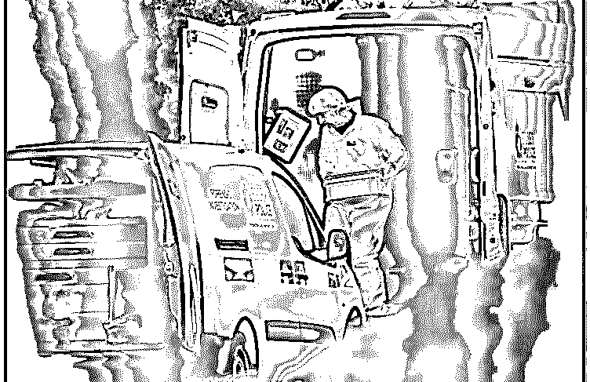
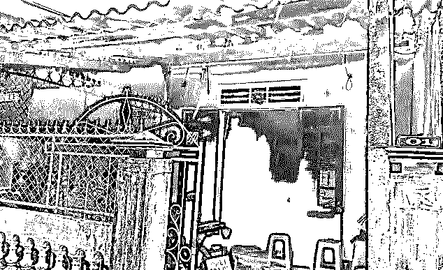
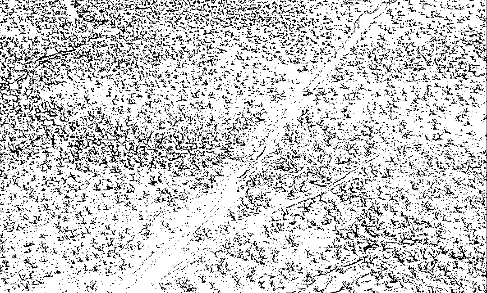
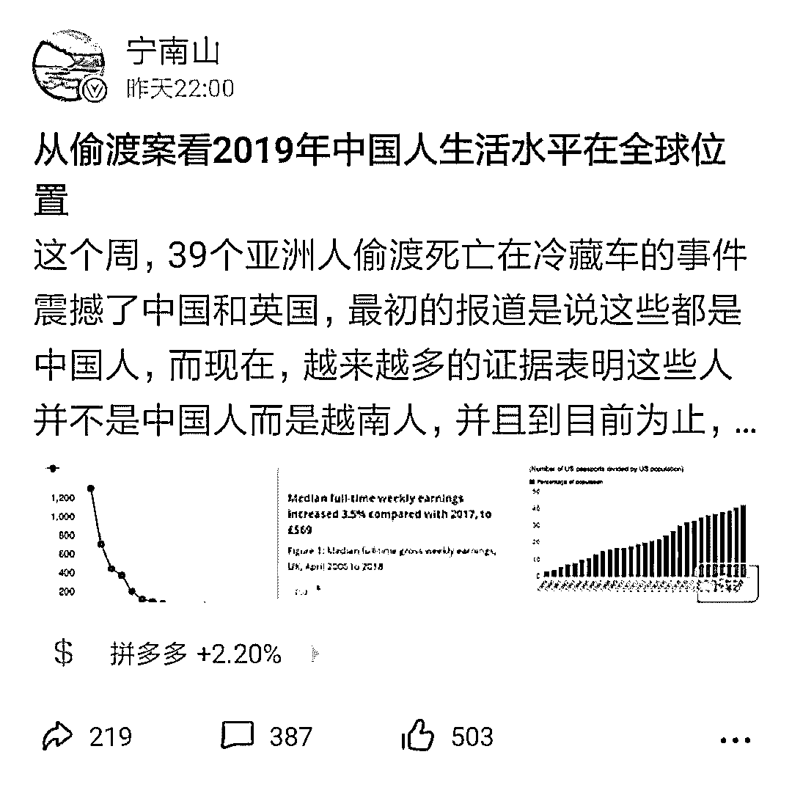
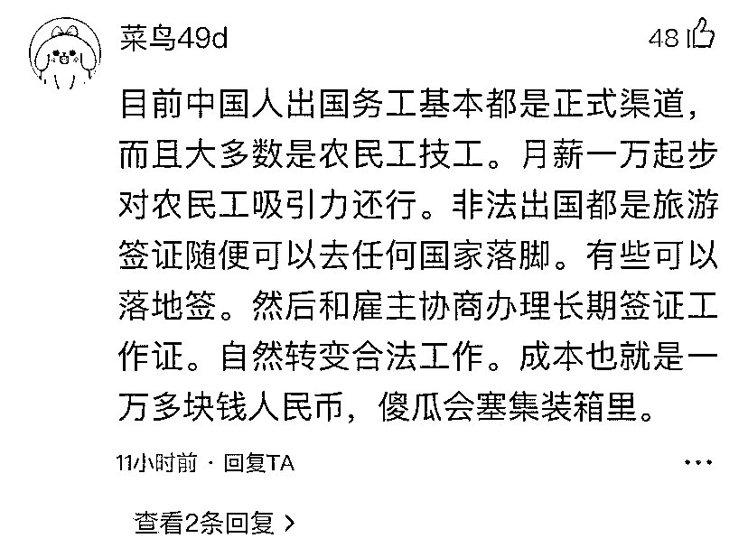

# 衣不蔽体，血手印求救，39 具货车冰尸！背后产业链比贩毒还罪恶！

> 原文：[`mp.weixin.qq.com/s?__biz=MzIyMDYwMTk0Mw==&mid=2247496489&idx=1&sn=b8868f00b58a9cdddb2d872544433743&chksm=97cb3811a0bcb1075a9818fad61f5fc938743d6478c9bddb4cce85d18f1550695ff841d6c5cf&scene=27#wechat_redirect`](http://mp.weixin.qq.com/s?__biz=MzIyMDYwMTk0Mw==&mid=2247496489&idx=1&sn=b8868f00b58a9cdddb2d872544433743&chksm=97cb3811a0bcb1075a9818fad61f5fc938743d6478c9bddb4cce85d18f1550695ff841d6c5cf&scene=27#wechat_redirect)

**点击上方蓝色字体免费订阅“灰产圈”**

上周，英国警方在埃塞克斯郡一个工业园区的集装箱货车里发现了 39 具尸体。此消息一出，引起各国社会高度关注。近两日越来越多细节和报道出来了。据英国警方的通报，这辆车，曾途径比利时的泽布吕赫港口，是在第二天凌晨 1 点左右，到达的英国埃塞克斯。如果是这样，那么这死亡的 39 个人，很可能在零下 25 度的环境里，呆了至少 15 个小时。换句话说，这些人是被活活冻死的。

紧急救援人员描述打开货门一瞬间的场景，令人感到恐怖也心碎。医疗队赶到藏尸货车处时，发现车厢靠近门内侧布满了血手印，数名死者穿着极少甚至裸体，数十具遗体堆叠在一起。

这个悲剧的背后，隐藏着庞大又罪恶的偷渡黑色产业链。

**01**

**39 具尸体是什么概念？**

先把整个过程回顾一下：是卡车司机把车子开到指定地点的后，想下车打开车厢取一些文件,竟然打开一车厢的尸体？他吓死了，赶快叫救护车，随即报警，这个事情才捅了出来。之后，英国警方打开这个这一辆卡车的集装箱。

车厢打开之后的样子

发现里面安静地躺着 39 个人，他们已没有任何生命特征。

相关报道网络上到处都是，最初英国多方媒体曝出遇难者是中国公民，但紧接着中国驻英使馆通告：英国警方尚未确定死者国籍，甚至朋友圈还有传说连死亡者名单都有了。 

随着事件的进一步调查，却出现惊人反转：39 名尸体中多位都可能是越南人！因为从越南传来了令人震惊的消息，一位越南妈妈的手机收到了女儿的死亡短信，短信的内容：“妈妈对不起，我出国的路没有成功，我很爱你。”“我快要冻死了，我不能呼吸。”恰好与新闻中 39 名死者的死亡状况对上了号：出国——偷渡，冻死了——零下 25℃的集装箱内，

这条短信的细节和“死亡集装箱”案件的相吻合——比利时的 Zeebrugge 出发的火车在 23 号凌晨十二点半到达英国埃塞克斯郡 Purfleet 码头，而 Pham Thi Tra My 的信息恰好发送在前两个小时前。

**02**

**“组织者”不允许接电话，这是她给人家的嘱咐**

由于组织分子不准她接电话，因此要求家人不要联系，但每到一个地方就会报平安。死者的父亲范文辰说，他们一家同时失去爱女和金钱，当初收钱的人口贩子没有透露偷渡方式，只称是一条“安全的道路，会用飞机与汽车”。“如果我知道她是这样去英国，我绝不会让她去的。”悲剧发生后，死者父亲无比痛心。

遇难者与父亲

据了解，这辆卡车行车路线不寻常——明明有近路可走，却疑似为了避开安检而多绕路，以便从几乎是“边检宽松”的口岸进入。《爱尔兰时报》报道称，通过 GPS 信息找到集装箱的发货地是此案的关键。据《电讯报》报道，该集装箱曾在 2017 年在保加利亚境内注册。如果以上消息属实，那么此案件的模式与近年来频发的人口贩卖非常类似：先到达东欧的某个国家，通过铁路、公路或者海运到达比利时的泽布吕赫港，随后通过海运运往英国。

涉事货车路线图

涉案货车的集装箱属于冷冻集装箱，箱内温度最低可达零下 25 摄氏度，39 人在“极其可怕的环境下被慢慢冻死”。英国公路运输协会的总裁伯尼特说：任何人在里面的情况，都是极其可怕的。

大批记者等待警方更新信息

目前已有 4 人因为涉嫌谋杀、过失杀人、人口走私罪名被逮捕，包括货车司机在内，两名 38 岁男女、一名 48 岁男子都已被拘留。对于这件事，目前有两个地方，疑问最大：

第一、遇难者的国籍，英国有媒体说，39 人全部是中国人；但这个说法现在被推翻了，据中国驻英使馆的通告，警方尚未确定这些人的国籍是否都是中国国籍。

第二、也是最重要的，这么一起震惊全球的恶性死亡案件，背后的势力究竟是什么？真相为何？

目前，警方还在调查，并没有明确结论。英国舆论和媒体普遍认为，是两方面原因：1、非法移民偷渡；2、跨国人口贩卖。但是多数外媒倾向于一个观点非法移民造成的死亡。

我们目前不知道这 39 个人是在哪里上车、在车上呆了多久。只是为什么车子要开冷冻？这不是把人活活冻死了？如果真相真的是偷渡或者是贩卖人口的话，答案只有一个！躲避检查！

英国现在很多港口都配备了红外热成像仪作为辅助检查工具，就是类似下面这种（热成像仪可以清楚探查到人体，地震救援时也用于探测生命）：

非法行为所对应的方法就是冷藏柜运人，低温下红外热成像仪会显示不出里面的情况。

如果货柜里有人的话，可以在热像仪中看到。

然而这在唯利是图的人蛇集团眼中根本没有用。热像仪只能检测有温度的物品，而对冷冻集装箱根本无效。因为内部温度太低，所以也无法收到任何人产生的热量，而不法分子就是利用这一点来躲避检验。但是，一旦被骗上集装箱，车门被锁上那刻起，他们将注定被送上了一条不归路。事实上，越来越多的使用冷藏货车将移民偷运。

偷渡环节中，到处都是致命的陷阱！

**03**

## **事件只是冰山一角，比贩毒还暴利**

英国官方的数据显示，每年英国面对的非法入境情况已经多达 4 万起。

“这是一个庞大的产业，有人甚至说这比贩毒还来钱”，英国议会中负责应对人口贩卖问题的议员威农•克科尔（Vernon Coaker）这样说。

英国官方认为其国内偷渡和人口贩卖的受害者每年可能有 7000 人，但这个数字其实只是实际情况的冰山一角。每年被非法运到英国的人恐怕多达 2 万到 4 万人。如果再算上伪造旅行材料和签证过期后蓄意“黑”在英国的人，这个数字将高达 10 万多人！

而在这些吓人的数字背后，则是一个触及全球各地、有着一套复杂体系的人口贩卖和偷渡犯罪网络。那些遇难者怎么都不会想到，本以为会来到一片充满了牛奶和蜜糖的土地，去那里能赚钱、有高收入、能给家里带来更多的收入，进而改变全家的命运。

可真相却并非如此。有难民透露，负责将他偷渡的犯罪团伙有着非常惊人的能力，他们不仅有数百人的团队，更有酒店、餐馆等一系列的产业支撑，还有人公然在脸谱网（Facebook）这种社交网站上“打广告”。面对这么严重的情况，英国以及其他处在这条利益链条上的欧洲国家的政府，也都在想办法去打击这条恐怖暴利的黑色产业链。

一个曾做了 10 多年“蛇头”透露，不同时期出国的人群和价钱也不同。根据偷渡到的国家不同，费用也大相径庭，英国是最贵的，要 2 万英镑，约合人民币 16 万元，其他欧洲国家不超过 1 万英镑。

从事偷渡行业的“蛇头”数目庞大，其中很多“蛇头”都是一家人，另外还有的是朋友，他们互相介绍牵引、互相协作帮助，各自负责偷渡者的不同项目，分享偷渡者的资金，发财致富。

据说，一个人偷渡到英国要付"蛇头"20 万元人民币左右，但在英国找到工作后，一般每月省吃俭用可寄回 1.5 万元至 2 万元钱，这样，一年就可以赚回本钱。正因为此，有人选择去冒险偷渡。偷渡英国较容易，因为英国的海关检查不太严格，容易过关。到了英国后，往往很容易办到难民卡，再以难民卡换劳工证。

近年来，偷渡英国的人渐渐多起来，找工作也变得不容易。每次组织偷渡一般都有好几个蛇头，往往在国外有一个人蛇组织，大蛇头都在国外遥控指挥，由国内的小蛇头负责"招兵买马"，事成之后，小蛇头每人最少可抽 5000 至 1 万元。

除了预交少量定金外，大部分的偷渡费用都存入银行的指定户头，待偷渡成功并亲自打回电话后，再一次性付清余款。

如果一时凑不够钱，有的蛇头还允许赊账，待以后赚到了钱再还，当然这种情况往往是亲戚或非常熟悉的朋友。如果要借贷，往往利息较高，约两分利息。即使是这样的高利贷，还是有很多人愿意借。

遇难者的家

据悉，此次部分受害者偷渡到英国的价格是 3 万英镑（约 3 万 8500 美元 约人民币 26 万多），有人还会问，他们都能拿出这些钱，为什么还要偷渡呢？

其实这么多钱，大部分都是他们东拼西凑借来的，为了赌一个可以改善生活的机会。太多的前辈留下了可以效仿的标杆：某叔、某哥在外挣了多少多少钱，邻居靠着国外亲人赚的钱盖了新房……这样的事情发展了十几年、几十年，仿佛也就成了传统。出去的人都知道，在国外赚钱，并没有想象中的容易，刚开始要还欠下的债，同时还要忍受老板的压迫······因为是黑工，他们寄回家的钱都是实打实的血汗钱。

近几年的年轻人出去，如果有亲人在国外，可以走亲人铺好的路，有人帮忙找工作，会相对轻松许多，不过之后的生活如何还要看自己的努力了。

但无论如何，这种方式，偷渡环节中，到处都是致命的陷阱！

**04**

**最可怕的是不知道死亡什么时候来临**

美国也是一些偷渡者的向往之地，有网友爆料自己去美国的经历：带到了一个荒无人烟的地方，然后开始徒步。

后来才知道因为德州边境查的很严，组织上不让坐车怕被查就被抓了。从墨西哥跟德州边境一直步行到休斯顿机场！在灌木丛集合下每个人分了饼干，泡面，还有果汁！然后就开始走了。

但是食物很快就吃光了。途中会有直升飞机临时检查，很多时候，都要迅速躲进灌木丛，满身都被仙人掌扎到，拔出来时候上面还粘着血迹。

有人说，蛇头都是骗人的，只要一上了路，就由不得你了：有同伴二十几天没饭吃，饿急了，草根、树皮都吃过；有的人走着走着，人就没了，跟不上就这样被永远的落下了...这是一条非法移民的亡命之路。

**05**

**偷渡是条不归路**

此案最开始，英方媒体称遇害 39 人可能都为中国人，后来越来越多的证据表明这些人并不是中国人而是越南人。

宁南山《从偷渡案看 2019 年中国人生活水平在全球位置》一文在雪球 app 内也引发了大量关于“中国人的生活水平在世界到底是什么水平”的讨论，文中写道：“人均 GDP 一万美元只是中国全国平均水平<h-char unicode="ff0c" class="biaodian cjk bd-end bd-cop bd-hangable bd-jiya">，</h-char>如果愿意离开家乡提高收入<h-char unicode="ff0c" class="biaodian cjk bd-end bd-cop bd-hangable bd-jiya">，</h-char>完全可以到国内收入比较高的大城市打工<h-char unicode="ff0c" class="biaodian cjk bd-end bd-cop bd-hangable bd-jiya">，</h-char>像一线城市和强二线城市<h-char unicode="ff0c" class="biaodian cjk bd-end bd-cop bd-hangable bd-jiya">，</h-char>人均 GDP 已经 2 万美元<h-char unicode="ff0c" class="biaodian cjk bd-end bd-cop bd-hangable bd-jiya">，</h-char>已经接近了希腊<h-char unicode="ff0c" class="biaodian cjk bd-end bd-cop bd-hangable bd-jiya">，</h-char>葡萄牙等入门级发达国家的水平<h-char unicode="ff0c" class="biaodian cjk bd-end bd-cop bd-hangable bd-jiya">，</h-char>已经进入发达国家人均 GDP 的门槛了<h-char unicode="ff0c" class="biaodian cjk bd-end bd-cop bd-hangable bd-jiya">，</h-char>你在北上广深送个外卖<h-char unicode="ff0c" class="biaodian cjk bd-end bd-cop bd-hangable bd-jiya">，</h-char>好好干 5000-1 万元的月薪也是可以达成的<h-char unicode="ff0c" class="biaodian cjk bd-end bd-cop bd-hangable bd-jiya">，</h-char>还不用支付任何偷渡费用<h-char unicode="ff0c" class="biaodian cjk bd-end bd-cop bd-hangable bd-jiya">，</h-char>想回家也就是坐个高铁<h-char unicode="ff0c" class="biaodian cjk bd-end bd-cop bd-hangable bd-jiya">，</h-char>平时的打折机票几百元人民币<h-char unicode="ff0c" class="biaodian cjk bd-end bd-cop bd-hangable bd-jiya">，</h-char>比从欧美飞回国便宜多了<h-char unicode="ff0c" class="biaodian cjk bd-end bd-cop bd-hangable bd-jiya">，</h-char>更何况国内薪水还在涨<h-char unicode="ff0c" class="biaodian cjk bd-end bd-cop bd-hangable bd-jiya">，</h-char>出去十年付出太多<h-char unicode="ff0c" class="biaodian cjk bd-end bd-cop bd-hangable bd-jiya">，</h-char>回来一看沧海桑田。”

目前来说，中国国民生活水平仅次于发达国家<h-char unicode="ff0c" class="biaodian cjk bd-end bd-cop bd-hangable bd-jiya">，</h-char>但是又领先大多数发展中国家<h-char unicode="ff0c" class="biaodian cjk bd-end bd-cop bd-hangable bd-jiya">，</h-char>和其他少数三四个国家一起位于也是基本事实的。就算是出国务工人员，也很少偷渡，正如雪球用户@菜鸟 49d 所说：目前中国人出国务工基本都是正式渠道，傻瓜会塞进集装箱里。

10 月 27 日，关于此案的调查仍未明朗之际，新华社爆出法国执法机构在加来港的一次例行检查中，在一辆冷藏货柜车发现 8 名非法移民！其中包括 4 名儿童。他们自称来自阿富汗，目的地也是英国！当时，货柜温度只有 7℃左右，8 人均有轻微的低体温症症状。

***“当利润达到 100%时，就有人敢于铤而走险；**当利润达到 200%时，他们就敢于冒上断头台的危险。”***

整理：雪球哥

来源：新华社、环球日报、海外生活站

← 向右滑动与灰产圈互动交流 →

**阅读原文加入灰产圈高端社群**