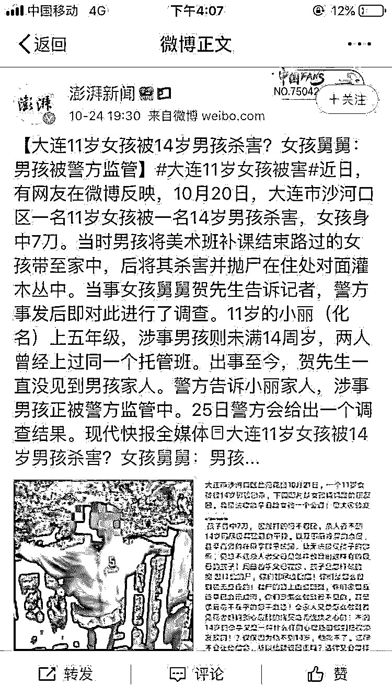
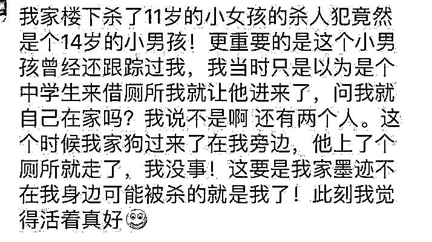
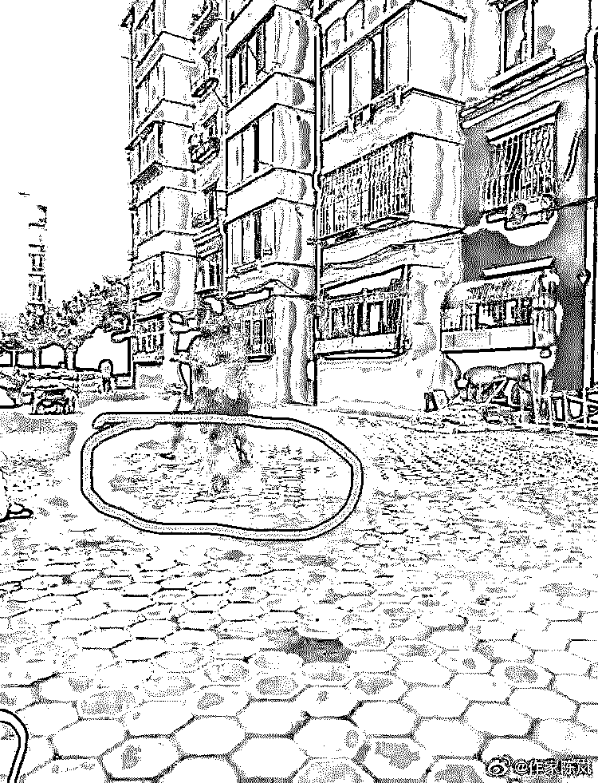
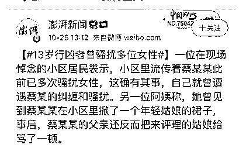
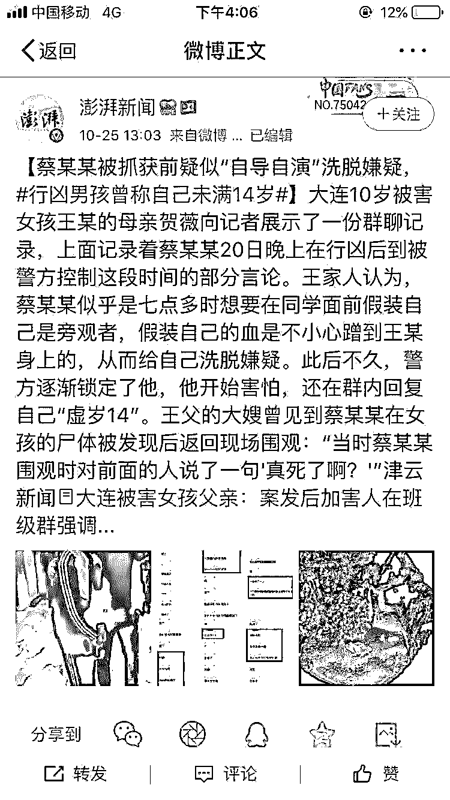
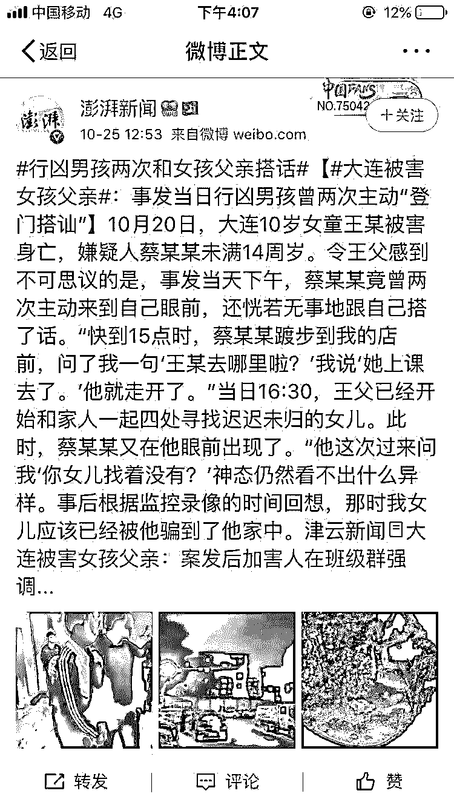
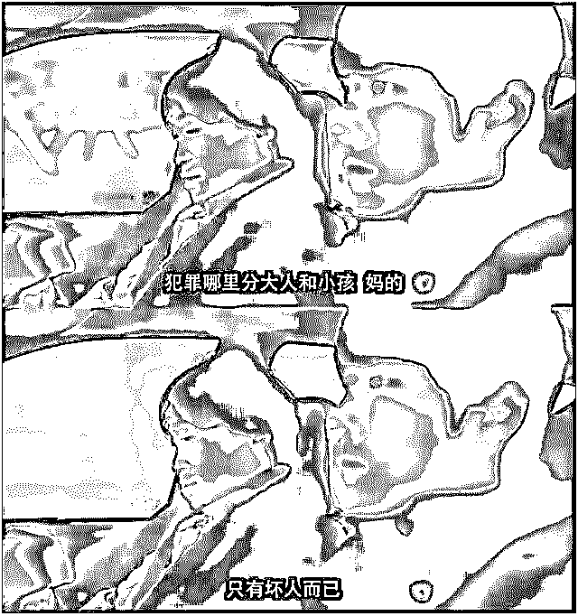
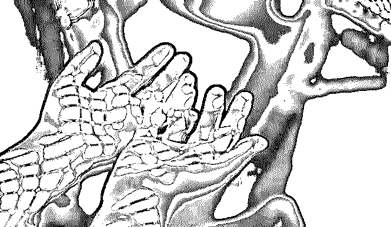

# 13 岁男孩杀死 10 岁女孩：反正我未成年，杀人不偿命！

> 原文：[`mp.weixin.qq.com/s?__biz=MzIyMDYwMTk0Mw==&mid=2247496476&idx=1&sn=ec8bbbee65a450d269ad9c0db786182b&chksm=97cb3824a0bcb1329b49da03e687285ca2b46c27ed937b548960ad0f793158f31c0df52daa6d&scene=27#wechat_redirect`](http://mp.weixin.qq.com/s?__biz=MzIyMDYwMTk0Mw==&mid=2247496476&idx=1&sn=ec8bbbee65a450d269ad9c0db786182b&chksm=97cb3824a0bcb1329b49da03e687285ca2b46c27ed937b548960ad0f793158f31c0df52daa6d&scene=27#wechat_redirect)

**点击上方蓝色字体免费订阅“灰产圈”**

“那个男孩把我 10 岁的女儿骗到他家中，试图性侵并最终多刀杀死了她，还把她的尸体扔到绿化带中。可是就因为那孩子还差两个多月才到 14 周岁，这种种罪行就只能‘不予追究刑事责任’！”

王先生提及杀死自己女儿的 13 岁男孩时，下颌紧绷了起来，语气中充满愤怒。

01

这几天，相信大家或多或少了解到这则令人悲愤的新闻：

**10 月 20 日大连 10 岁小女孩被 13 岁男孩残忍杀害，女孩身中七刀，遗体被扔在距家仅 100 多米处的灌木丛里。**

时间发生经过：

2019 年 10 月 20 日 15 时 20 分许，**13 岁男孩蔡某某**以需要帮忙为由，将美术班补课结束路过此处的受害者，**一个 10 岁的小女孩**王某骗到家中，并对王某进行搂抱，欲与王某发生性关系。

遭到拒绝后，对王某的头面部进行殴打，并将王某摁倒在地掐其脖。

当王某没有抵抗力之后，蔡某担心王某将自己的行为说出去，就用刀刺了王某上身五六次。

确定王某死亡后，将王某的尸体遗弃在住处对面的灌木丛中，事后还将作案使用的刀也装到了垃圾袋中一并遗弃。

你以为这个男孩是临时起意吗？

**不，他是蓄谋已久，不是这个女孩，也会是其他女孩。**

案件发生后，当地有女生出来指认，自己曾经也被这个男孩跟踪过，询问她是否一个人在家，甚至在她家上了厕所。

也有女生出来指认，说自己被多次跟踪，甚至在有一次拍下了他仓皇逃跑的照片：

一位在现场悼念的小区居民表示，**自己曾经看到蔡某在小区里掀了一个年轻姑娘的裙子，事后，蔡某的父亲还反而把来评理的姑娘骂了一顿。**

事情发生以后，蔡某还打算自导自演洗脱嫌疑，在同学面前假装自己是旁观者，当警方把嫌疑人锁定他之后，他开始害怕，在同学群里回复自己**“虚岁 14”！**

更让人觉得不可思议的是，这个人在事发当天下午，还主动两次走到受害女孩的父亲面前，还恍若无事的跟他搭话，问“王某去哪里了”，受害人父亲说“她上课去了”，他就走开了。

这是干什么?来打探情况，确认自己相安无事吗?

凶手已有劣迹、家长没有怎么管、家长有掩盖嫌疑、案发后淡定与受害家属搭讪、“自导自演”脱罪、自己说出“虚岁 14”……这些细节似乎都在说，凶手做出这样残忍的事情，是个必然，不是今天，就是明天，不是这个女孩，就是别的人……

**10 岁女童何其不幸！****女孩美好的生命就这样逝去，但那个 13 岁的男孩却仅被收容教养！**人民日报微评，一针见血，直指本质：

> 女孩被杀令人痛惜，加害人同是未成年，让人愕然而沉重。“我们是祖国的花朵，请好好爱护我”，预防未成年人犯罪法修订草案正在审议之中，血的教训再次冲撞人心！治理未成年人违法犯罪如何破题？必须早发现早预防，实行分级干预。

02

如此骇人听闻的未成年人犯罪已经不是第一例了。

● 2012 年，广西一名 13 岁的女孩，因为嫉妒同学比自己漂亮，把同学约到家里，残忍杀害并肢解尸体。

● 2015 年，湖南 3 名学生，入室抢劫当地小学宿舍，持木棍殴打值班女教师，将她砸倒在地，用毛巾活活闷死。

● 2018 年 6 月，湖北一名 13 岁少年，尾随女同学进入电梯，挟持她到了一个空房间，女生身体多处被划伤。

● 2018 年 6 月，山东淄博一 14 岁中学生，因为嫉妒同学成绩比自己好，残忍将其杀害。

电影《彷徨之刃》里有这么一句话：**“犯罪哪里分大人和小孩，只有坏人而已！”**

电影《告白》中有句台词：**「如果你是邪恶的，那我又何必提醒你只是个孩子，人性的丑恶或许有时候真的与年龄无关。」**

14 岁，在许多人眼里或许还是个上了初中的孩子，但在当今这个思想开放的时代，14 岁早已不是懵懂无知的少年，恶魔的种子也早已生根发芽，等待时机。

14 岁的限定，给了很多心术不正的孩子可以放纵愤恨、可以知法犯法的暗示，也只会让越来越多心存恶意的少年漠视生命。

**最令人发指的是，当他们做出恶魔行径之后，却依然因为未成年人的身份而避开了法律的严惩。**

03

自从《未成年人保护法》颁布以来，许多未成年人在家庭教育、学校教育、免受暴力等许多方面，保障了未成年人的合法权益。

但是，另一个问题也凸显出来：**一些懂法的未成年人，知道即使自己犯下恶行之后，也有最正确、最光明的《未成年人保护法》保护他们，没有一丝后顾之忧，可以肆无忌惮地去犯罪。**

犯下恶行的未成年人的权益得到保障了，可是，那些被这些“未成年人渣”迫害的人，其中许多也是未成年人，他们或受到严重伤害，或失去性命，他们美好的青春年华、**他们的权益谁来保障？难道他们就该白白承受这样悲惨的命运？**

目前中国 11-13 岁的未成年人有 4800 万左右，虽然这种极其恶劣的事件是偶发事件，但是我们还是要充分重视。

**防范和惩戒未成年人犯罪，其实是对其他未成年人最大的保护。**

我国的死刑比欧美国家严苛，但针对未成年人犯罪的处罚却轻得多，几乎是零处罚。

未成人年犯罪居高不下，曾经成为欧美国家最头疼的问题，为此许多国家会逐步提高针对未成年人犯罪的刑事惩罚，而且将刑事责任的年龄作了调整，法国刑事责任年龄为 13 岁，美国刑事责任年龄为 10 周岁，部分国家甚至为 9 周岁。

而我国刑事责任年龄为 16 岁，14 岁以下犯罪不负刑事责任。可以说，未成年人犯罪不必付出任何代价，不仅仅是现在，以后也不必付出任何代价。因为《未成年人保护法》保护这些犯罪的未成年人信息，使他免受任何指责。

**然而，误入歧途的少年全部都能改过自新吗？**

**作恶者被一次次姑息，但谁来医治无辜受害者心中的伤痛呢？**

**我们希望，未成年人保护法能够惩恶扬善，而不是成为“未成年人渣”的保护伞！**

****

04

日本暗黑电影《告白》中，有两个学生残忍杀害了老师的女儿。

但因为两个凶手都是未成年人，老师知道法律拿他们无可奈何。

于是老师开始了一系列“杀人诛心”式的复仇。

她避开了法律，利用自己的智慧，步步为营，把两个凶手逼上了绝路。

电影令人瞠目结舌，却又感慨万千。

豆瓣点赞数最高的短评第一句话是：

**“当罪人无法通过法律将其制裁的时候，唯有以暴制暴。”**

似乎酣畅淋漓，可是细想，这已是社会的悲哀和另一种恐怖了。

**我们不要以暴制暴，只希望还公义以公义。**

所以，我们只能努力呼吁国家的法制做出相应的改善。

**预防未成年人犯罪，从家庭、学校，到政府、司法机关，再到社区，一个都不能少，但不是平均发力。**

及早干预，分类防治，各尽其责，互相配合，才是对孩子负责。

**一定程度上说，给孩子什么样的现在，他们就有什么样的未来。**

预防未成年人犯罪，我们还有不短的路要走！

**希望在不久的将来，任何恶行、任何恶人，都逃不过法律公正的裁决！**

*新闻及图片来源：澎湃新闻,于成文摘

← 向右滑动与灰产圈互动交流 →

**阅读原文加入灰产圈高端社群**