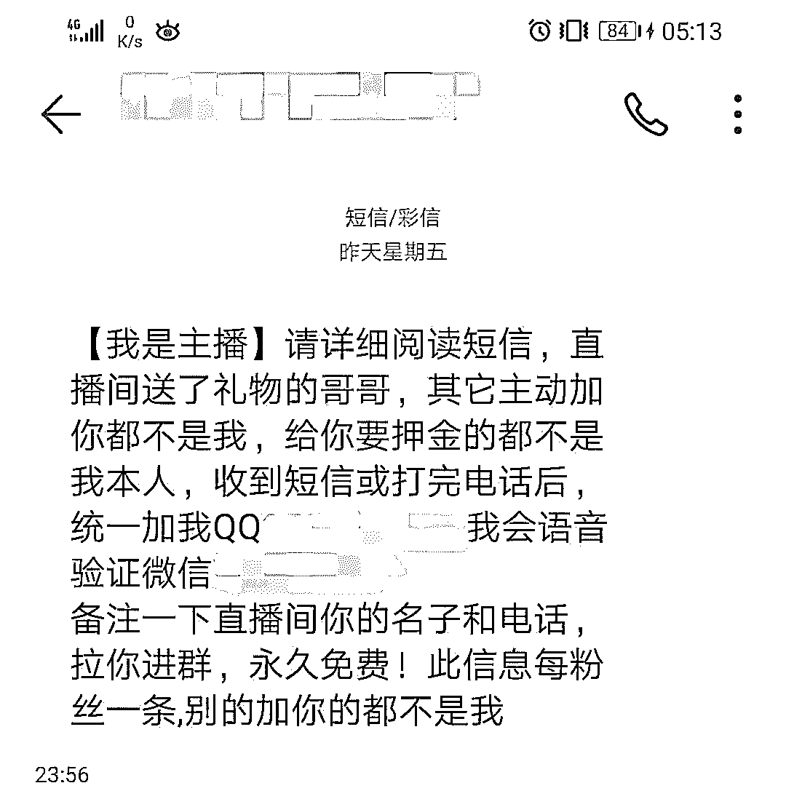
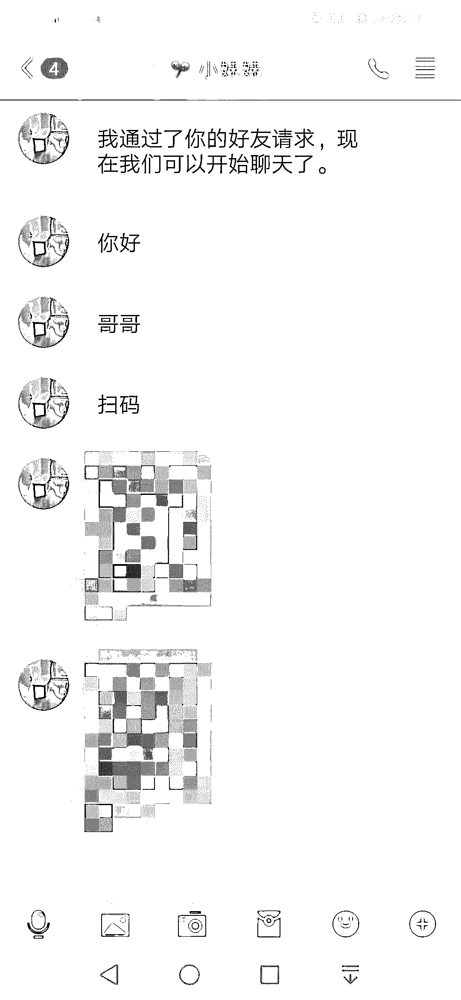
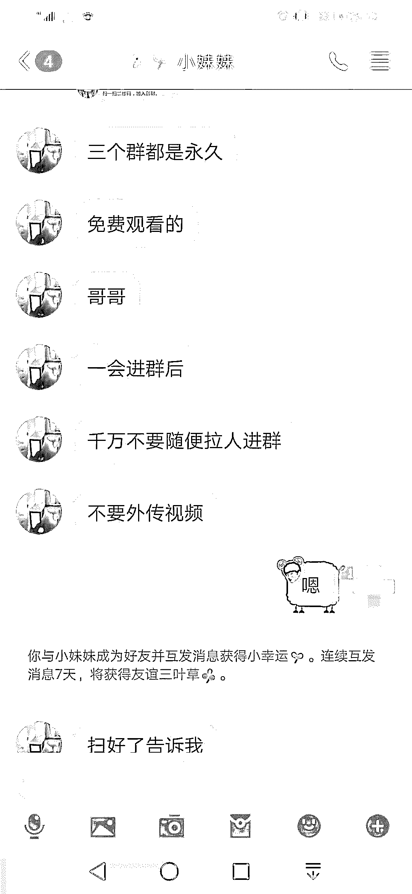
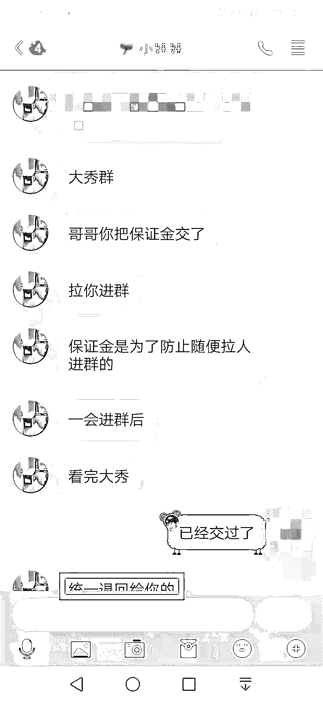
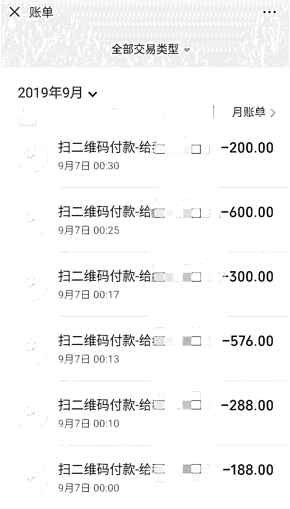
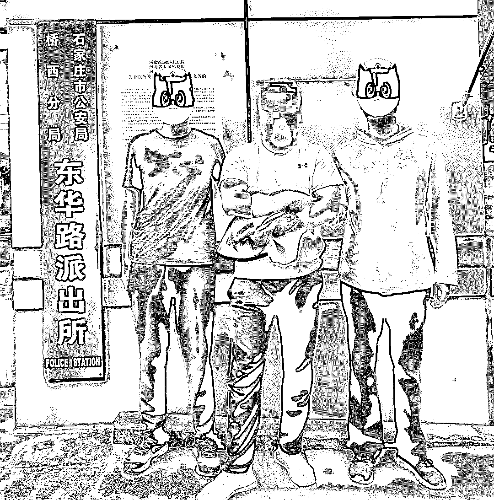
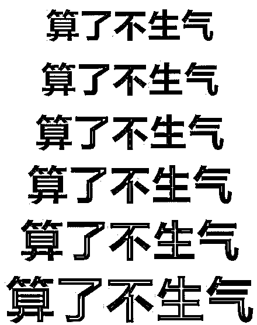
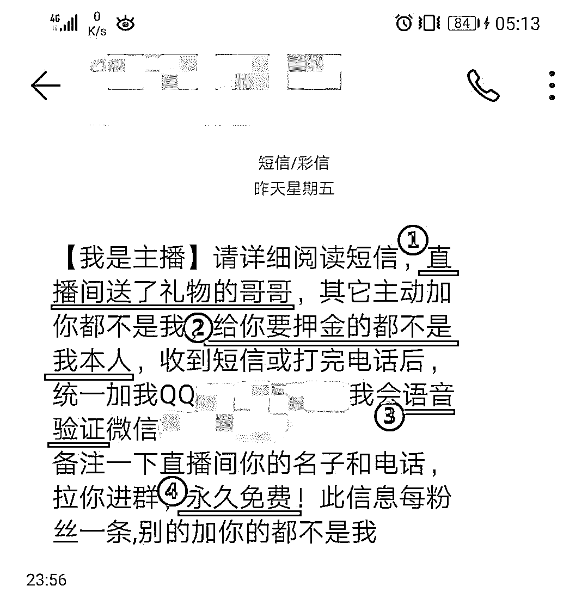

# 抓到一个“女主播”！

> 原文：[`mp.weixin.qq.com/s?__biz=MzIyMDYwMTk0Mw==&mid=2247496470&idx=1&sn=6682a84ef1eafef83261003cbf18f367&chksm=97cb382ea0bcb138f03ab299398370afe50004c685c45e2b6fc9f26a11a4cd9c8ff59a03d091&scene=27#wechat_redirect`](http://mp.weixin.qq.com/s?__biz=MzIyMDYwMTk0Mw==&mid=2247496470&idx=1&sn=6682a84ef1eafef83261003cbf18f367&chksm=97cb382ea0bcb138f03ab299398370afe50004c685c45e2b6fc9f26a11a4cd9c8ff59a03d091&scene=27#wechat_redirect)

**点击上方蓝色字体免费订阅“灰产圈”**

近日，市民林先生经网友推荐 

**下载了一款直播软件**

刚登录便看到了一个美女主播

他随即给对方送了一辆“跑车”

**（跑车为虚拟礼物，需在平台充值金额后购买）**

没想到居然引起了

“对方”的注意

主播主动求加好友？ 

这么好的福利林先生当然不想错过

可谁知道

这位“主播”接下来的操作

让他一步一步走向深渊

**操作一：****主动邀请扫码进群**

至于为什么要扫码

当然是以**“福利”**为诱饵

但天下真有这么“好”的事儿吗？

很快对方就露出了自己的真面目

**要钱**

**操作二：****收取各类费用**

3 个群的群聊管理费 188 元*3

承诺不录屏不传播的保证金 288 元*3

群聊直播私密费 300 元*3

统计费 200 元*3

……

为什么受害人

愿意一次又一次的交钱呢？

**因为对方承诺**

**收取的费用之后全部会统一退回**

**然而林先生交了这么多费用**

**还是没能看到直播**

**怀疑被骗的他随即要求退款**

对方却表示充值人员太多

分不清是哪些成员缴纳了费用

想退款的话就需要再转一次等额的费用

等之后查清交易记录

再将两次的费用一并退还

**操作三：****拒绝退款并拉黑**

林先生再次听信了对方的话

**然而转账后不仅没有收到退款**

**对方还把自己拉黑了**

林先生随即报警

警方根据线索

很快将身在外地的嫌疑人尹某

抓获归案

让人意外的是

**尹某竟是一名“抠脚大汉”**

**而他这么做的原因**

**竟是因为自己之前被相同的方式骗过**

**想以此来“挽回损失”**

可尹某又是怎么做到的呢？

**如何获取受害人的信息？**

尹某称很多“粉丝”为了能让女主播添加自己好友，**往往会在直播间的公开频道里留下自己的联系方式****。**

尹某收集信息后，便批量向受害人发送短信或好友请求等。

**有人怀疑身份的真实性吗？**

我们再来回顾一下

尹某发送的短信

**1.“直播间送了礼物的哥哥”**——具有针对性，刚刷了礼物就收到短信，大大增强了该短信的真实性，同时“哥哥”的称呼也很符合女主播的语言习惯，还能给受害人一种被重视的感觉。

**2.“给你要押金的都不是我本人”**——多次的强调其实就是在给受害人做“心理建设”，还表明了自己不会收钱的立场。

**3.“我会语音验证”**——此话一说，真实性立马大增，然而事实上只是托词，真加了好友便直接跳过这一步。

**4.“永久免费”**——受害人越担心的问题越早“澄清”，给人一种“试一下也不会被骗，万一是真的呢？”的错觉。

**同时尹某会事先对女主播进行了解，记录对方的昵称和头像，创建高仿账号，**防止在添加好友后身份被拆穿。

不仅如此，**尹某还会邀请网友、朋友等充人数，营造出场面火爆的假象，**同时设置“全员禁言”功能，即使有人发现被骗，也无法告知其他成员。

**广大网民应坚决抵制不良信息**

**涉及金钱的交易的更要提高警惕**

**一旦被骗**

**要保存好相关证据并及时报警**

你遇到过类似的骗局吗？

留言提醒更多人！

* * *

来源：南京公安（ID：NJgongan） 

监制：何莉

编辑：关开亮、李永锡

实习：黄宝仪、杨瑞君

← 向右滑动与灰产圈互动交流 →

**阅读原文加入灰产圈高端社群**