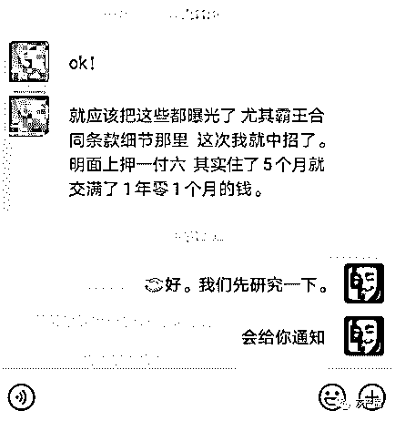

# 一位黑中介的自我修养

> 原文：[`mp.weixin.qq.com/s?__biz=MzIyMDYwMTk0Mw==&mid=2247496438&idx=1&sn=3f69eacdcd1cccaef5ee1c9024397649&chksm=97cb39cea0bcb0d8bdc0b97bbb2593bf18e4f43d1c9eb8be4cb259f9d61fe6baea284ebdac90&scene=27#wechat_redirect`](http://mp.weixin.qq.com/s?__biz=MzIyMDYwMTk0Mw==&mid=2247496438&idx=1&sn=3f69eacdcd1cccaef5ee1c9024397649&chksm=97cb39cea0bcb0d8bdc0b97bbb2593bf18e4f43d1c9eb8be4cb259f9d61fe6baea284ebdac90&scene=27#wechat_redirect)

**点击上方蓝色字体免费订阅“灰产圈”**

01

  

大家好，我叫小王，

大家都叫我小王巴黑中介，

在北京吃黑中介这碗饭也快 10 年了，

接触过各类形形色色的房东和租客，

其中的酸甜苦辣，

想必你们租房的各位也能体会。

好了，不诉苦了，年末了，给大家说说我曾经的**租房**事业，作为一名地道的黑中介二房东，我们有我们的处世之道。例如我的公司，原来叫 A 房地产中介公司，注册在**天通苑**，两个大哥也是老板。

做了几年，挣了一些，当然上门找的人也多了，当地街道房管科也打电话来的多了，查群租房的多了，我们干脆就把公司注销了，在管理宽松的**石景山万达广场**注册了一家新公司**B 房地产经纪公司**，当然老板还是我大哥。

在北京注册公司成本之低、程序之简，我们干这个那是相当容易。有了新公司，能甩的包袱就甩了，能利用的重新拿过来利用。在别人看来，这是一家信誉满满的中介公司啊。

02

  

下面是运作方式，首先用尽一切办法从房东手里拿来房子，再打隔断（悄悄地）变成群租房，再冒充房东（也就是二房东）或正规中介也就是假中介公司收押金对外出租（包括伪造公司执照和假公章，假房本，假身份证，冒充房东用的，因为之前留了房东证件复印件，嘿嘿），除了赚差价，还加收一年的卫生费、保洁费、公共使用维修费、物品损坏赔偿费等等。（注意，正经的房子和正规的中介都是不收取的，正常的房屋只有房租和押金，正规中介的话就只有中介费，至于水电网费等都是租户自己缴纳，反正我们就一次性收你一年，嘿嘿）

注意别看钱少，比如一个房子 5 户，是每户都收，哈哈，反正，能想起了名头，我们都想办法从租户手中骗取。

因为你这个费最后肯定是用不完的，多余的我们就偷偷收下了，你说，租户不傻啊，不会交给你，那你就错了，首先我们会虚假承诺各种好的表象，这就涉及一些销售技巧了，一般我们的目标都是大学生或者第一次来北京租房的（女生最好，好吓唬，嘿嘿），他们钱不多，一般都是自己家里给个几千块钱，或者在学校存下的钱，肯定是以低价为诱饵，中国人嘛喜欢贪小便宜，刚毕业的，对生活充满憧憬，有不懂什么法律，好骗（他们真以为警察叔叔会像教材的那样，哈哈）或者不懂行的傻乎乎。

先想各种办法，**骗，蒙，哄**办法收你的定金，收了你的押金，这就是向你敲诈的开始，你什么都会委曲求全的，就算你发现不求全，各种办法，逼迫你就范，恐吓，威胁，不让你走，反正你一个人拖着那么多行李，第二天还得辛苦上班，你能如何？

然后再让你缴纳各种杂费，哈哈，人生地不熟，你能如何？然后，你所租的一个屋子都是被我们骗来的，我们也会说假话骗你，告诉你大家都一样，全北京合同收费都是这个样子，销售技巧就来了，这样你是不是觉得平衡点？因为你已经无暇顾及其他各种费用的合理合法性了，你也会自己说服自己交钱的，然后我们在让你签署一个拟订好的**霸王合同**（一般我都会跟你说押一付三，在合同里做手脚，让你提前一个月交房租，实际就是押二付三，嘿嘿，还会制造很多你违约的问题哟，一不小心你就违约啦，就乖乖的给钱，呵呵）。

03

  

估计那时候你也没精力一字一句的读了，哈哈，况且很多大学生也不懂，中国人都有奴性，好死不如赖活着，没有法律意识，是不，那个谁？去告啊，各个区的建委房管科，网上都有电话，或者 12345 投诉，或者 110 派出所，或者上各区县法院起诉，或者找城管，哈哈，你们试试啊，看看那个机构管理租房纠纷的事情！

法院说证据不足劝你撤诉、房管科说帮你调查，110 说没有治安事件不管，12345 告诉你我们转给工商了，工商说让你等着调解着呢，城管说你找错部门了。诸位北漂租户不信，你们试试看哈。

中国职能部门，除非他们联合执法，否则都各自另立山头，谁会管你一个小小北漂呢？

就算联合执法，我们跑路了，你也一样要不回钱，就算要回了，最多我们也不赔钱，下次接着继续坑你们这群一批有一批的北漂，北京这么大一锤子买卖有的是！

你没有房住，还得上班，职能部门效率又慢，托也把你拖垮！累了你就别找了认栽！只要 10 个骗 5 个就赚钱，骗 1 个还是赚钱，起诉最多讨回你本金，我们不会受到任何惩罚！哈哈，随便爱去哪告去哪告去，我们保证你胜诉，保证你要不回钱！

你说，我们就赚这点钱，能满足吗？当然不能，到了和房东的合同最后期限，我们提前收取租户 3-4 个月的租金，不交给房东，加上租户之前的押金，这也是一笔不小的金额啊。

你说，房东怎么办？就不给他，就骗他，就不接电话，他能怎么办？厉害的赶走租户，因为他收不到钱，也找不到我们（因为我们已经消失了），不厉害的或有同情心的，就让租户多住几个月，自己承担损失。至于房东更好哄，房东大都喜欢把房子租给正经上班工作的人，只要装的自己刚来北京，很穷，装的很可怜，跟善良人一样，利用他们的同情心，北京人都是很痛快的，基本就租给你了，还有很多房东不在国内，他们房子基本就是我们一直霸占，骗他们几十万都有可能，就是开始给了点钱，就再也不给他们打钱了，有本事回来告我们吧？

至于你说你怎么来的房东信息，只要我们去物业打听，或者派一个去中介上班的朋友，全北京房源想要哪的没有，哈哈，还有各种各样的技巧，一个字就是骗你没商量！（房主租户一起骗）

04

我为什么写这些，是实在看不下去网上你们租客北漂的帖子了，太幼稚了，不要浪费电、浪费口水了，中介尤其像我小王黑中介的公司把着北京 40-60%的出租房，房源充足地段好，无论你找哪家中介，后果都是一样的。

你吃亏了，就认了吧，这就是在北京租房的风险之一，下次、下下次，或许你能涨点心计，也或许你同样还会落入新的黑中介手中。

这几年这些政府部门稍微管了我们一点点。但是四舍五入等于没有。

那么我帮大家科普一下关于合同上的小细节：

**天通苑回龙观**包括全北京各区域：地铁口带看房子的，路边摆着牌子的，贴广告房东直租的，举牌子瞎转悠突然问你租房与否的，还有通过网络 58.赶集等网站发布租金远远低于附近市场价，通过低价引诱，把你约来看房子的，有些张口撒谎口头说自己是房东，房东亲戚，房东朋友委托帮忙，房东出国，在外地忙生意等等类似理由，转移你看房产证和身份证注意力，让你下意识误认为他就是房子的主人。

而没有房产证和身份证证明的，找各种理由回避出示房产证和身份证明的，天通苑回龙观地铁口带看房子那些，尤其是操持东北口音的大爷大妈，大叔大姨，大哥大姐，小弟小妹，包括小三轮，小广告，全是租房骗子假房东二房东！（张口就说没有中介费，然后你问租到一半不住是不是可以退钱？爽快答应可以，还可以帮你找下家，实在找不到也退，听了是不是很暖？瞬间觉得自己捡便宜了？遇到好人了？等你退的时候，他们各种理由或者索性人间蒸发）。

之后收取卫生费，垃圾费，水费，电费，网费，维修费，楼道费，一天一块钱两块钱，钥匙押金 100（金子做的？）电卡押金 200（金卡？），就差直接索要保护费的那种，看完房子就让你交定金，（交定目的是为了用你的钱扣住你，然后骗你把行李全搬过来，然后敲诈，你想你沉重的家当过来了，第二天要上班？你有心情再找房子吗？有几个那么狠心誓死拼杀的？用你沉重的行李，着急的工作的压力和你的押金是不是可以让你像绵羊一样任人宰割？女生们看到这里，不知道有何感想？是不是很心酸？很气愤？）

不愿意让你走，要好处费，辛苦费，定金和签合同分开进行的，（分开进行，交定金是一个人，签合同又是一个人，甚至你交钱时候又换一个人，告诉你这都是为了规避法律的制裁）不出示身份证，房产证，虚构事实，张口就说自己是房东，不给你提前看合同，交了钱才让你看合同的，合同刻意隐瞒偏向自己的，本身口头说押一付三，利用文字游戏，结果让你提前 30 天交下个季度房租间接变成押二付三，让你始终被扣押两个月房租那种，合同过分强调租户违约如何如何，200％违约金等等苛刻条件，从不说房东违约会怎样，动不动就违约动不动就交费。

比如房东提前让你走提前 30 天通知没有提示任何赔偿，租户提前走不仅 30 天通知还视为违约所交费用一律不退，还要赔偿 200％,请问这是抢劫还合同？合同第一行，双方自愿在公平公正公开情况签署，请问哪里对租户公平公正公开？

05

  

各种这种不对等不透明不公正的行为，通过诱骗寒暄拉关系转移你注意力，让你不知不觉签署了类似这种不平等**霸王条款**的合同，全是租房骗子假房东二房东！还有转租也是，利用租户对个人租户转租信任度比较高，编个转租理由，回家或者工作调动着急便宜等等，部分转租人员全是受害者找替死鬼接盘侠。

要么就是二房东黑中介自己的托，一般是一个假转租户和一个假房东，一起演戏诈骗！还有二房东自己举报自己的隔断，让执法人来拆除，进而赶走租户房租押金不退，利用合理合法手段行骗，估计还有收买拆除人员，相互配合，一起利用这种漏洞，讹诈租户，敲诈租户，吸血鬼一样吸住租户，坑害一批又一批（还有各种各样的骗术，好好在生活中观察吧）让你交了钱，等着就挨宰！

运气好，你可以住到到期，但中途绝不踏实，电器坏了不管，房子有问题漏水不管，到期黑你押金，运气不好，严重的各种半路找理由要钱，赶走，扔东西，半夜一群大汉，敲诈勒索收费，骚扰，拉电闸，断水电，打砸抢仍你东西，严重的群殴你！

甚至带你看房有的看你不给钱都动手打人！如果你是新人，看完上述感觉和自己遭遇，房子还住着，建议回家好好看看自己的合同和内容，是不是有 200％违约金和提前 30 天交房租，包括除了房租押金以外的其他费用，类似这种霸王条款！

06

  

最后 祝大家租房愉快。

擦亮眼睛 ！

不要碰到我们这帮断子绝孙的

狗！东！西！

**本篇文章为粉丝投稿，感谢这位匿名粉丝的正能量投稿，如果你也想揭露某一行业或者写出你的故事，欢迎向灰产圈投稿，让我们一起来做这件功德无量的小事!(投稿请在公众号后台回复：投稿，会有专人跟你联系)**

← 向右滑动与灰产圈互动交流 →

**阅读原文加入灰产圈高端社群**