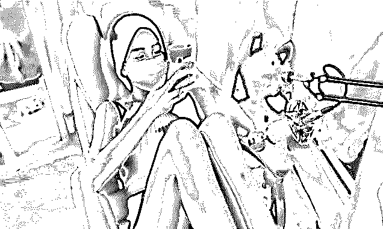
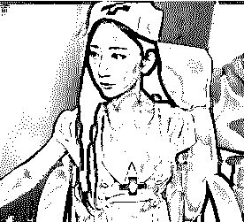
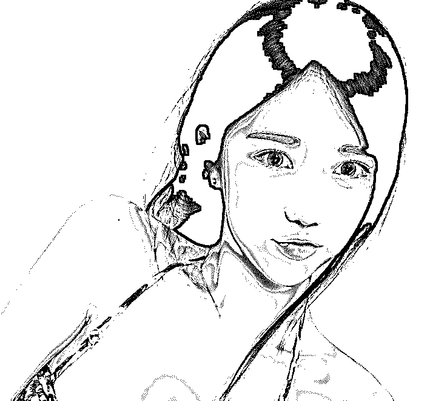
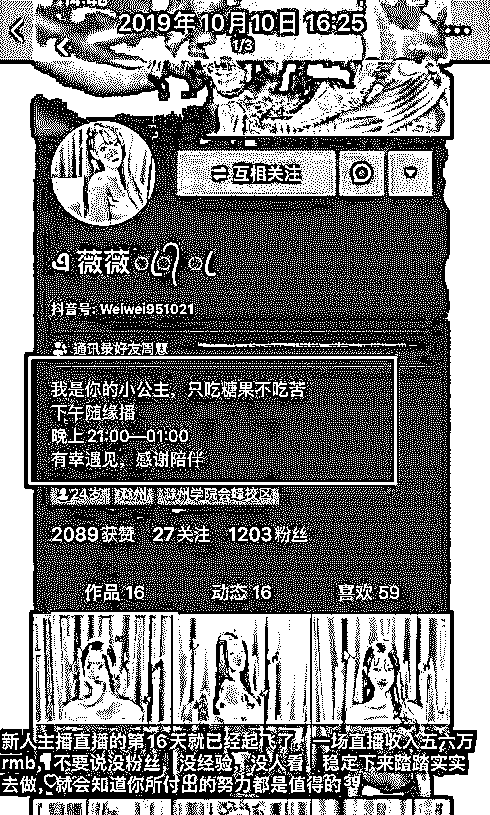
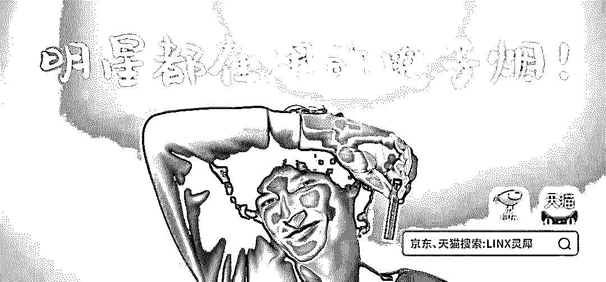
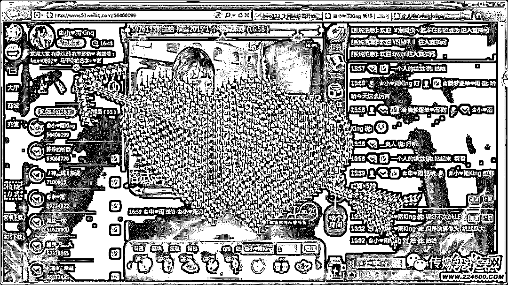
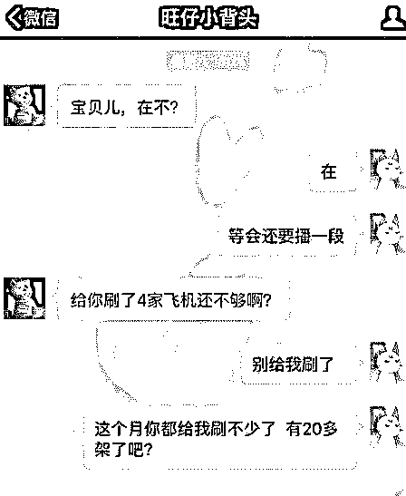
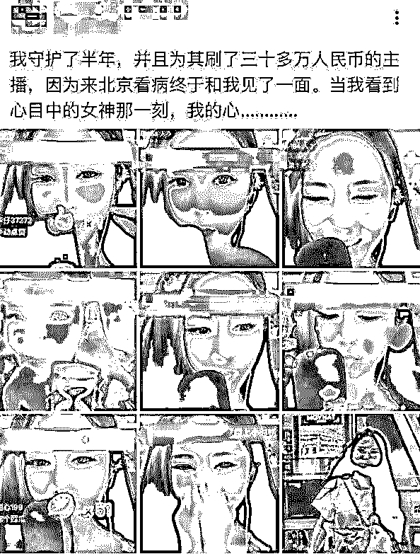
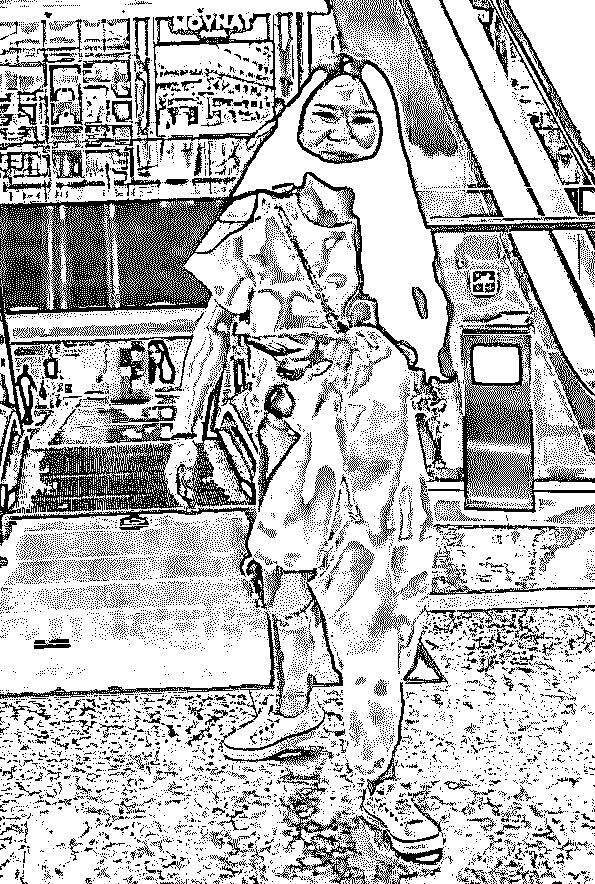

# 我在某鱼上看小姐姐直播，被她们的“乞讨嘴脸”恶心到了......

> 原文：[`mp.weixin.qq.com/s?__biz=MzIyMDYwMTk0Mw==&mid=2247496430&idx=1&sn=5d5505dcf7dc11b08e39c054f3f483b8&chksm=97cb39d6a0bcb0c0869478bb5b301f2e5682e87e63739783b99cfcd8b115559507fa570db95a&scene=27#wechat_redirect`](http://mp.weixin.qq.com/s?__biz=MzIyMDYwMTk0Mw==&mid=2247496430&idx=1&sn=5d5505dcf7dc11b08e39c054f3f483b8&chksm=97cb39d6a0bcb0c0869478bb5b301f2e5682e87e63739783b99cfcd8b115559507fa570db95a&scene=27#wechat_redirect)

**点击上方蓝色字体免费订阅“灰产圈”**

有一群人相比大家都不会陌生。她们之中，有的是在校大学生，有的是来自偏远地区的年轻无业女子。她们身份不同，她们处境相似，怀着一个明星梦，亦或想快速赚更多的钱。 
她们在经纪人的劝说下，或在网民的追捧声中，游走在掺杂色情、违法的灰色地带，有的被男友提出分手后依然不愿离去，有的在自我奋斗，准备离开这个行业。**她们是互联网时代兴起的网络直播中的女主播。**

01

主播们的盈利方式，大家都已经很清楚了，就是靠一些观众的打赏和刷礼物，来获取自己的收益。为了达到这样的效果，主播们可谓是尝试了各种各样的办法。有提高自己专业水准——干货类的，有提高自己表演能力——载歌载舞类的，**但每个行业都有一些不守规则的人，她们为了达到吸引眼球，赚取打赏的目的，选择打擦边球。**顾名思义，这样的女主播第一条直播法则是：不管天气热不热，穿的一定要热：       嫌正常的衣服关注度不够？那就换上一套护士服，走制服诱惑路线：挤胸弄乳的更不用说了：
有穿着宽松 T 恤给大家表演倒立的；有穿着热裤跪在地板上擦地的；还有刚洗完澡裹着一条浴巾就敢出镜的......图片过于羞耻我就不给大家展示了，反正看完我只想说，亏得是法律在守着最后的那条线，要不然，为了博出位求关注，我看要让他们全/裸上镜都能脸不红心不跳。

02

除了在服装商别出心裁，这类女主播在语言上也别有一套方法论。先是一句标准的玛丽苏公主风签名：“我是你的小公主，只吃糖果不吃苦”。 奠定了日后求你刷礼物的感情基调。接下来，就是静等你进入她的直播间了，一旦有新人进来，不管是熟人还是生客，女主播们都得都得嘴甜的叫一声“哥哥”。**“欢迎新来的“小苹果”，欢迎~”****“**大哥又来啦，欢迎~”**乍一听，没什么问题，只能说这名主播嘴甜，会来事儿。可等你呆久了，就会发现事情没有那么简单。只要表演了什么唱歌跳舞的才艺，下来的一句就是，**“哥哥们小礼物走一波吧~”**       如果刷的人少了，接下来就开始撒娇发嗲，求礼物，**什么“呜呜呜，为什么你们不给我刷礼物”；****什么“欺负我一个弱女子，你们的良心不会痛么？”****还有什么“我不管我不管，人家就要你们刷礼物嘛~”**不知道大家如何，反正我只要听到女生捏着嗓子撒娇卖萌，就浑身不自在。对自己亲密的朋友就算了， 对着网线那头毫无关系的陌生人，发出这样不得体的声音，就只是为了获取对方所附带的利益价值？**恕我直言，这样的直播，跟当街乞讨，有什么区别？**更夸张的是，看没人刷礼物，直接关房间不播了，甚至破口大骂，说粉丝都是把钱看的比命还重的死人......这...这都不仅仅是乞讨了，更像是乞讨不得之后的，道德绑架。

03

当然，天下之大， 不乏痴情种。多得是为女主播疯狂氪金刷礼物，求见面、求交往的人。越多人追捧，身价就越高。**加微信，10 万：**加了之后，还是三句不离刷飞机。**约见面：30 万。**明码标价，诚不我欺。这些老实人，抱着娶媳妇的心态，一波一波地往里投钱。结果真到了奔现的时候，翻车翻成大型车祸现场：
还有更夸张的，为了谋取更多的利益，抢夺“优质客户”，主播之间也会相互撕逼。真撕起来，女主播们早没了平日里要礼物的娇滴滴的声线，只剩下粗俗不堪的对骂和不堪入目的杂碎之言。说白了，主播圈，就是一个没有中场休息的宫斗大戏。你方唱罢我方上场。为的不是别的，就是那千万人恭维女神的虚荣感，以及那千万看客口袋里叮当作响的真金白银。

04

浅薄到甚至有些粗鄙的互动语言，加上边缘性的色/情试探，再加上甜到发腻的一声谢谢小哥哥。在各大平台上活跃的人气女主播们，用这样精确的营业性话术，确实吸引了一批又一批的直男观众买单。但这样类似“高级乞讨” 的行为，又能持续多久呢？只是在公共场合露露肉、发发嗲、喊两声哥哥，就能被大批直男奉为女神。这样的捷径，不是不能走，只是一旦走了，就别想有回头路。既然你原意在乌烟瘴气的直播间里，以荤段子搏众人一笑，那就别怪他们在关了直播间后，给你贴上一个**“骚浪贱”**的标签，**至于尊重？****我只能说呵呵。**来源：有态度青年,于成文摘

← 向右滑动与灰产圈互动交流 →

**阅读原文加入灰产圈高端社群**