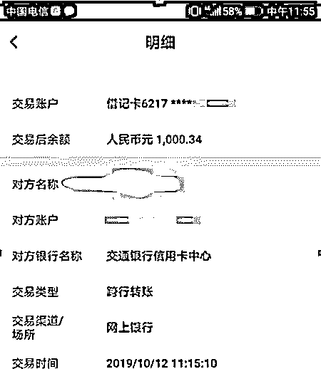
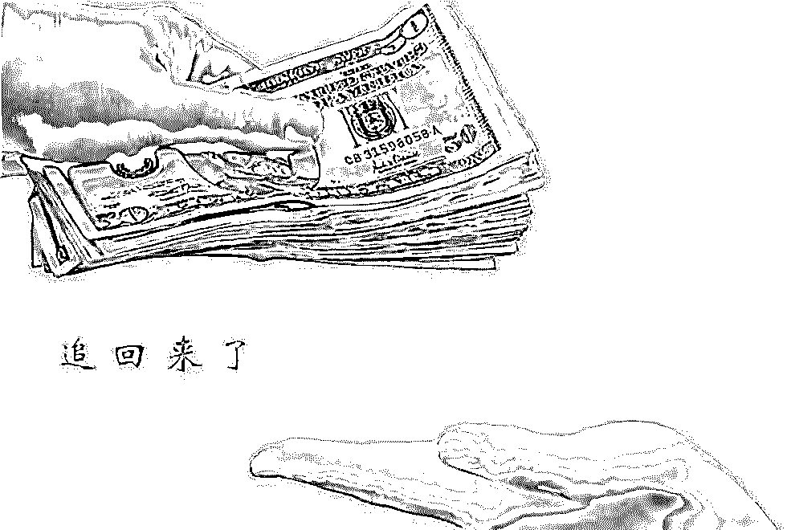
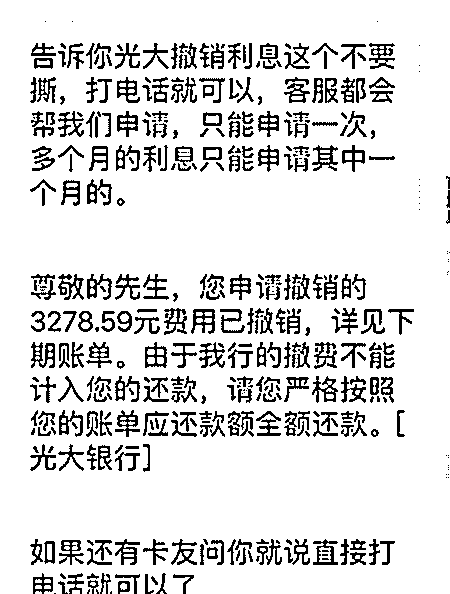
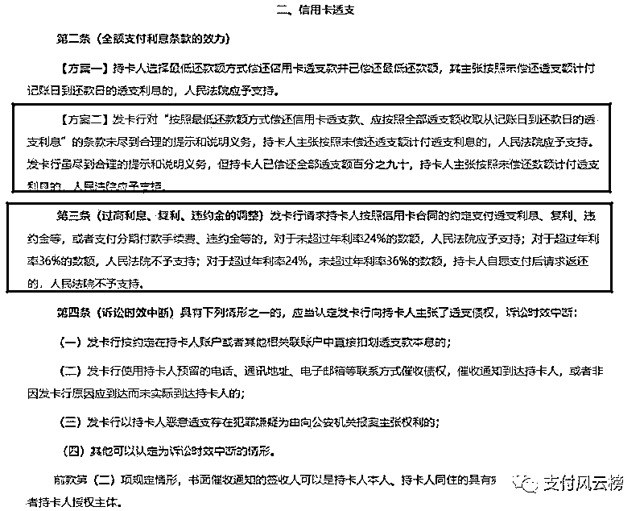
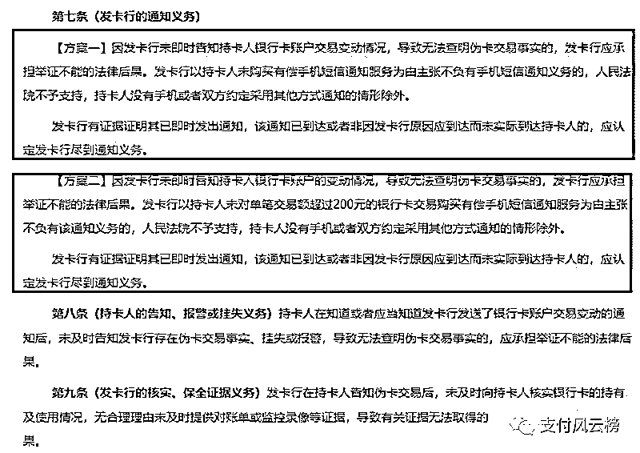
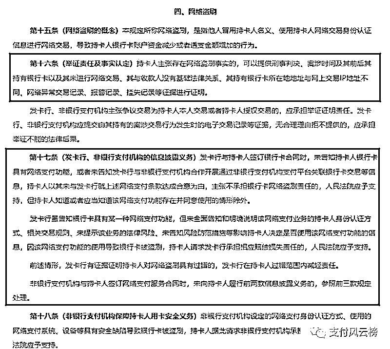

# 神秘的信用卡退息（追息）原来是这么干的！

> 原文：[`mp.weixin.qq.com/s?__biz=MzIyMDYwMTk0Mw==&mid=2247496411&idx=1&sn=5d293704e0f95046fbfa1318ae35b6ed&chksm=97cb39e3a0bcb0f5aab3f7f2ef96e023b0ff24acd4b669f93ec8e7b832bab726dd7bb1dc73de&scene=27#wechat_redirect`](http://mp.weixin.qq.com/s?__biz=MzIyMDYwMTk0Mw==&mid=2247496411&idx=1&sn=5d293704e0f95046fbfa1318ae35b6ed&chksm=97cb39e3a0bcb0f5aab3f7f2ef96e023b0ff24acd4b669f93ec8e7b832bab726dd7bb1dc73de&scene=27#wechat_redirect)

**点击上方蓝色字体免费订阅“灰产圈”**

最近，中介圈流行一个业务：**银行追息**。广告发的铺天盖地，说什么所有银行信用卡违约金，罚息，逾期利息，最低还款手续费等全部都可操作。收费不低，一般为追回利息**30%-70%**不等，甚至有些人打起了歪主意，套路层出不穷。

本不想写这篇，因为会涉及到一些人利益的问题，还有一种可能是传播出去银行会提高防范等级。思想斗争之下，决定还是决定说说皮毛和原理。

说实在的，追息这个事情本身自己是可以去做的，且我身边还有不少人已经把银行扣的利息要回来了。甚至有人还能跟银行谈免除一部分已经欠下的利息的骚操作。

其实这些都不是什么技术活，自己打打电话申请也是有可能成功的，稍微复杂一些的，辅助一些谈判技巧（撕逼）成功的概率也蛮大。金额大的甚至可以找律师协助你去找银行谈判，只不过你需要花点律师服务费罢了。

今天我想重点说下你们眼中神秘的信用卡退息是怎么干的，后面再补充下“产业”中存在的黑产和套路问题。

**先说几个真实案例吧！**

一卡友 A 操作:

先给信用卡中心打电话，申请退信用卡违约金，当初分期 24 个月逾期了 1 年多，一年前坦白后就还清然后注销信用卡了，中间打了 6 个电话说申请退违约金，前 5 个客服都说不能直接办理，要联系本地分行协商，第 6 个客服直接帮我查询截止今天，前 2 年的违约金共 7 笔，最高一期 800 多，最低 89 块，预计共 3000 左右，说 2 年前也可以查询，本人 2 年前逾期应该不多，害怕不退，所以就申请退这两年的 7 期逾期费，客服直接帮我申请，然后需要我等分行电话核对，让我保持电话开机。

个人意见，态度一定要强硬，他让联系分行，就直接说联系过了，一直都没有反馈。客服如果说不能申请，那就记得要他工号说你会投诉，这时客服肯定会帮你查询并帮你申请，建议大家要查全部违约金账单，所有的都可以查，说只能查 2 年内的是幌子，记得一定要态度强硬，最后记住，打客服时记得电话录音，就说我已经录音，你工号多少，你是否代表银行拒绝为客服服务，我要投诉你！

二卡友 B：

我刚刚打了客服，打了两次，都说由于我自身原因逾期不给退，我就要了工号说我想向银监会那边咨询下，过了一会儿就给我回电话了，说帮我查下 16.17 年记录，说只针对违约金可以帮我申请看看。

三卡友 C：

说光大是直接可以去申请的，只能申请一个月。已追回！

四卡友 D:

该卡友账务发生期间发生了严重的交通事故，处于昏迷期间，半年后出院已经是欠了银行一屁股钱了，后来医院交警部门多方开具了证明文件，最后银行让其还完本金即可。这是实实在在属实的车祸，出具了证明，且非伪造！

个人感觉成功率高的还是罚息的追回。有没有发现这些像极了“征信修复”的一些操作。一句话概括就是“找银行撕逼”！但问题来了，有人说：之前问题在我，我没底气去找银行扯皮！我怂了~！

嗯.....下面这段我说说你的勇气的来自哪里！

最高人民法院出台了《关于审理银行卡民事纠纷案件若干问题的规定（征求意见稿）》

链接查看：http://www.court.gov.cn/zixun-xiangqing-100362.html

我觉得你有必要好好读一读，我简单解读几点：

1、关于全额罚息。网页里面已经写的很清楚了最高法予以支持的内容。

比如全额罚息是不支持的，全额罚息比如你欠了信用卡 10000 元，还了 9999 元，还有 1 块钱未还，那么在此政策未出台前很多银行是会按照 10000 元计息的，并不是按照 1 块钱计息。

如果按照 10000 计息，那么肯定是不合规的，你可以拨打银行电话或者银保监会投诉，被多收的利息肯定是可以退回的。

2、关于过高的利息、违约金、罚息等超过红线，也是不予支持的，同样也是可以投诉要回利息的。

3、发卡行未尽义务！如果是由于银行过失导致的，你可以是可以去申诉的。

4、特殊情况产生的违约金。比如：上面说的意外事故、盗刷。也是可以去申诉退回的。

总结下就是找到银行的一些不合理不合规的地方，或者是不可抗力的因素导致，你就有理有据的去撕吧！

一般没什么问题，自己去申诉就好。没必要花冤枉钱。

或者你脸皮厚，就是要要要，那么你也可以天天找银行折腾，多试试必定会有些效果！

讲完正规的，我还想说说一些**见不到光的套路和坑**：

> 1、忽悠小白前期费用，然后交钱拉黑。你懂的，骗子都这么干，拉黑是常态，就赚你智商税。
> 
> 2、高级点的、问题严重点的就是伪造各种文件各种事故等等。伪造这个东西说起来很严重，违法的，千万别弄，发现之后后果不堪设想。

所以，不要利欲熏心，看长远，杜绝隐患！

大家发现问题没有，其实说来说去就那么些事儿，和“征信修复”套路简直是一模一样，我都怀疑是否是同一批人炒作起来的。

现在很多人都在操作这个退息的事情，最近银行也提高了防范措施，一个电话不成功多打几个电话，想从老虎嘴里抢肉不多想想办法怎么可能让你轻轻松松就拿回，你说对吧！

免责声明：部分内容来自网络以及网友爆料，如有侵权或不实之处，请及时联系我们删除。

← 向右滑动与灰产圈互动交流 →

**阅读原文加入灰产圈高端社群**