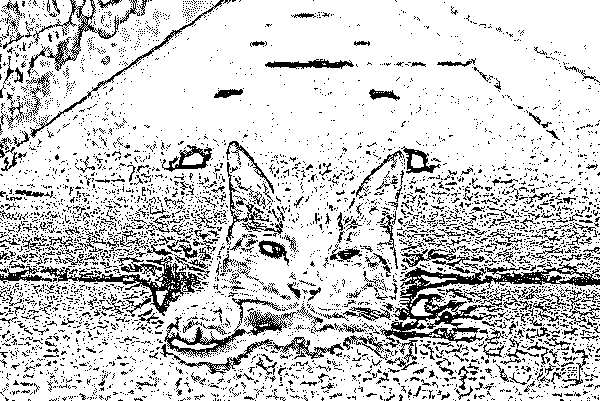
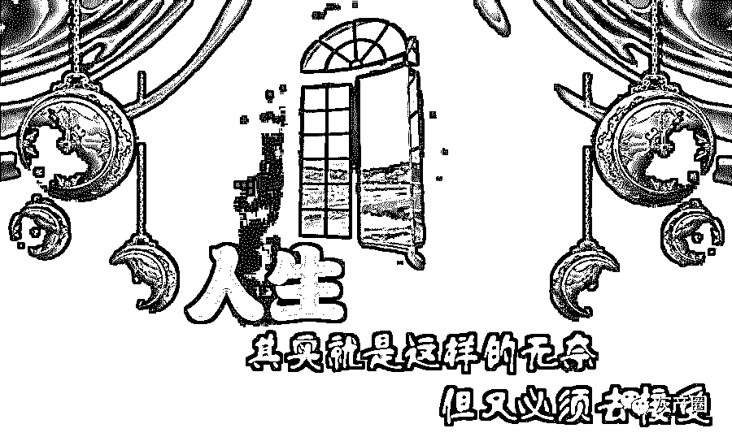

# 我花了三年，用一百万买来的教训

> 原文：[`mp.weixin.qq.com/s?__biz=MzIyMDYwMTk0Mw==&mid=2247496405&idx=1&sn=53f3f3fbec0c355d299439832e8d70bb&chksm=97cb39eda0bcb0fb97d088eca2ea798a698054437e243710d563ad5949cfc6341cb714008a24&scene=27#wechat_redirect`](http://mp.weixin.qq.com/s?__biz=MzIyMDYwMTk0Mw==&mid=2247496405&idx=1&sn=53f3f3fbec0c355d299439832e8d70bb&chksm=97cb39eda0bcb0fb97d088eca2ea798a698054437e243710d563ad5949cfc6341cb714008a24&scene=27#wechat_redirect)

**点击上方蓝色字体免费订阅“灰产圈”**

又是一个赌徒的赌博日记，让我们耐心看完，或许对你有所启发，请在文章末尾写留言告诉我们。

第一次发文，不知道从何说起 我是 2016 年年底接触到网赌的，记得很清楚第一次赌是在 2016 年 9 月 18 号那天，赢了 800，感觉自己运气好好啊！充了 100 不到，10 分钟赢了 800，那也是我黑暗人生的开始 。

2016 年 9 月 20 号，闲得无事，想起了前 2 天赢钱的事，抱着玩玩的心态，充了 500，没几分钟就输了。想想可能是运气不好，然后又充了 2000。这次玩了大概 10 多分钟，又输了。啊，这个月工资一半都输光了，想想运气不会这么差吧？有点上头，思考了片刻，把我银行卡上的 4700，全部都冲进去了。可能运气好，压什么开什么，记得大概花了半个小时，就赢回来了，还倒赢 2300，想想开心 （真不知道那时候怎么想的） 。

就这样每天都要进去玩几把，奇怪的是每天都赢个一两千的，就这样过了差不多 20 天左右。那天下雨，很大的雨，跟往常一样充了钱进去玩，开始还好赢了，玩了大概 20 分钟，已经赢了快 3000 了。想想今天可以收手了，也不知道那个筋搭错了，继续压。

记得很清楚第一把 500 输了，第二把 500 输了，第三把 1500 输了，第四把 3700 也输了。

怎么回事？怎么都是输？把最后的 800 多压了，还是输！又上头了，直接充了个 10000，上来没几把，输了。这几天赢的钱都输进去了，不甘心， 把自己的信用卡透支了 17000，都充了进去，不到 10 分钟就输光了。

那时候吃饭的钱都没了， 整个人浑浑噩噩的，满脑子想的都是去赌，就开始想着去朋友那里借。我基本上不太好找朋友借钱，我一开口五千一万的，就借给我了。那天一共借了差不多 2 万左右，迫不及待的充进去赌，来来回回一个多小时，最后还是输了（哎，倒霉） 。

想办法，想办法，又从 app 上搞出来 8000 多，又充进去，又输了。那天快输了 5 万，那时候人都快神经了，想着这么这么不懂事，打死自己的心都有了。想着去老爸老妈那里坦白，刚好想起来， 明天我要去买车，就找我爸妈拿钱去了。我爸妈给了我 8 万多吧，付首付， 但什么都没想就充了 8 万进去，一直不敢压，怕输。

就这样花了我快 3 个小时，中间我输了只剩下 2 万多一点，一点一点我赢回来了。记得开每把牌，心跳都很快 ，终于赢回来了，吓死我了，发誓再不去赌了。

第二天我去买了车，把朋友的钱还了，把信用卡 app 上的钱都还了。

这样淡了几天，又想起来去玩。那天我输了 3 万多，我告诉了我爸妈，爸妈没有骂我，也没打我，帮我还了，告诉我以后不要去玩了，钱要踏踏实实的挣 。

就这样我 2 个多月没去碰，无意的一天在上网看见了网赌，心里又痒痒的 （真是狗改不了吃屎），又去玩了。开始还小赚了一点，几千块，马上收手，就这样我又每天去玩下。说来奇怪，这样我连续赢了 8 天（好开心） ，我想可以把老妈那里的钱还回去了（真天真） 。好景不长，都输进去，还倒输了 3、4 万。

那时候快过年了，手上没钱，郁闷的， 想想过个好年， 就满世界的借钱。就这样我的第一个漏洞出来了，小 10 万，其中 7 万是输的，一两万自己用的。

过了年，app、信用卡要还款了。不争气的自己告诉了老妈，老妈那次在我面前哭了。我自己也哭了。老妈又帮我还了 （真对不起老妈）。还了钱以后，老老实实上了半年多班，期间想去赌，但自己克服了， 没去。

2017 年 07 月 07 日，那天发工资，银行卡上有 8000 多，又去赌了 （哎，不应该啊）。输了，那次还好就只输了 8000，就这样我开始拆东墙补西墙。这样的日子我过了 5 个月，那时候没心思上班，开始还好，还会去上班，到后来班也不去上了，一天天想钱去赌。 

这样，我第二个漏洞出来了，60 多万，其间借了很多 app，利息我都付了好几万。

17 年 12 月，我快崩不住了，想过去自杀，没那运气。12 月 16 号，我告诉了我爸，我爸真想打我，可是没有。那时候看我爸眼睛里面都是伤心，都是悔意，没把我教好。就这样，我老妈借钱给我还了 67 万 （当时我不知道那钱哪里来的，只知道是借的，后来我知道为了那钱，我妈差点下跪，不应该），把钱还了。

又是快过年，我深深的自责自己，手上留下一块伤疤，自己用刀划的。就这样到了 2018 年 5 月，期间就没想过去赌。和公司老板闹意见，他把我开除了，多付了我 2 个月的工资，3 个月的工资 18000 少一点，整个人很生气。明明老板的错，还怪我头上，很想不过去。

2018 年 5 月 14 日，晴，天气不是很热 ，被开除了，在家上网，玩着玩着，想起了赌博。开始我只是小玩玩，有输有赢，这样一直玩到 7 月 20，又输了 30 多万。可以借的钱都借了，不能借的我也借了，其中 10 万 app，10 多万高利贷，5 万信用卡，其他朋友的具体多少忘了，已经输傻了。

7 月 20，我坦白了，家里很多亲戚都来我家，我不敢告诉他们我又输了这么多，就说输了十几万 （家里的钱已经被我败光了）。7 月 23，亲戚好，帮我还了 20 万， 那天我爸哭的不成样子，说我这么不懂事。

到现在已经过了快 6 个月了，自己努力，还差 10 万不到。发贴之前，我和我爸妈说了。我告诉他们，我没去赌，我会靠自己努力赚钱把钱还了 。

写了这么多，就是想告诉那些现在还在赌的人，不要去赌了。想想你的父母，想想你的孩子 （**我爸那一天整个人好像老了十岁，深深的自责 **）。发此文也是告诫自己，不要去赌。没钱花可以少花一点，就是不要去赌。

看完文章的人，鼓励一下我，给我加加油 ，可以告诫我 ，可以告诉我，怎么面对这一问题。谢谢！

← 向右滑动与灰产圈互动交流 →

**阅读原文加入灰产圈高端社群**