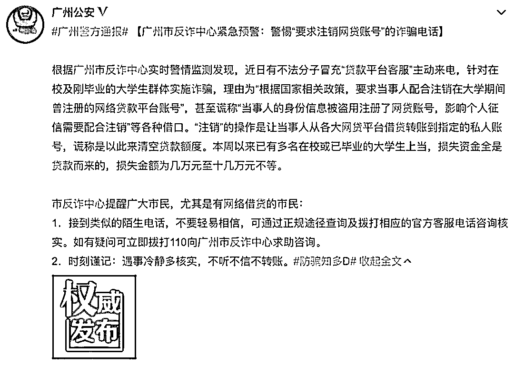
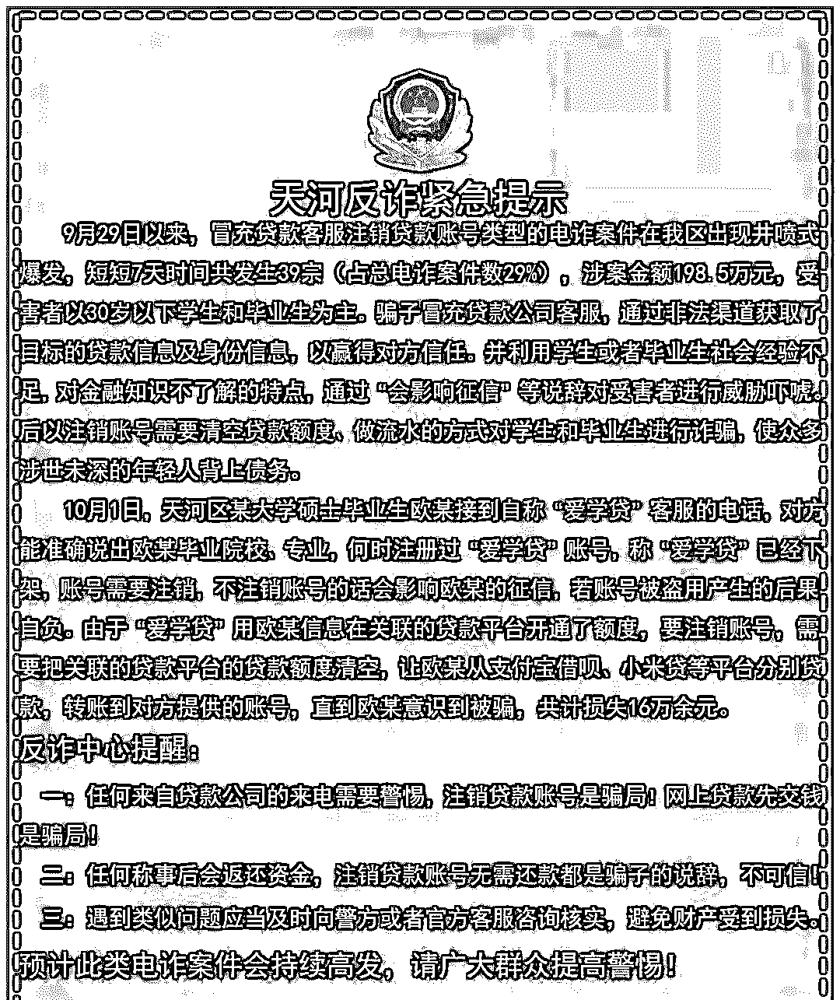

# 警惕！新型网贷骗局，目标群体 90 后！

> 原文：[`mp.weixin.qq.com/s?__biz=MzIyMDYwMTk0Mw==&mid=2247496377&idx=1&sn=6bab11def03fa04c888a2d50ddb70751&chksm=97cb3981a0bcb0975999f711204a7082c818c2b0193bb876a4eefc3804492ae59467f35909f8&scene=27#wechat_redirect`](http://mp.weixin.qq.com/s?__biz=MzIyMDYwMTk0Mw==&mid=2247496377&idx=1&sn=6bab11def03fa04c888a2d50ddb70751&chksm=97cb3981a0bcb0975999f711204a7082c818c2b0193bb876a4eefc3804492ae59467f35909f8&scene=27#wechat_redirect)

**点击上方蓝色字体免费订阅“灰产圈”**

网上曾流传这样一句话，“80 后被房贷压死，90 后被网贷逼疯”。现下不少年轻人不仅没有存款，还过着超前消费的生活。从裸条网贷、恐吓暴力催收，到大学生因身陷网贷最终自杀，网贷平台的乱象层出不穷，在今年央视 315 晚会上也曾被揭露。  

被央视 315 晚会曝光的网贷 app

然而，有些 90 后虽然躲过了网贷平台的坑，还有可能遇上以**“注销网贷账号”为套路的诈骗**。最近一种针对 30 岁以下学生和毕业生（也就是 90 后）的电信诈骗，突然在部分地区爆发。10 月 8 日，广州市反诈中心的通报显示，近期广州市冒充贷款平台客服的诈骗案件持续高发，损失金额从几千元至十几万元不等，基本贷款源头都是来自各大网贷平台。鹅师傅也在朋友圈里看到，有人表示接到了这类诈骗电话——冒充贷款客服注销贷款账号。

**“贷款客服”来电“注销账号”是诈骗**根据警方公布的消息和网友分享的经历，鹅师傅整理出了这种电信网络诈骗的基本套路。**诈骗目标人群****90 后****诈骗手段**

*   冒充网贷平台客服，能说出当事人详细的个人信息；

*   使用社交工具指引操作转账。

**诈骗关键词**注销贷款账号**影响个人征信**清空贷款额度**诈骗说辞**（一）在校期间曾注册网贷平台或有贷款记录：根据国家相关政策需要配合注销账号，否则就会影响个人征信；（二）在校期间没有注册过网贷平台：称对方身份信息被他人盗用注册了网贷账号，有贷款记录，甚至未还清，需要配合注销否则会影响个人征信。**诈骗最终目的****诱骗贷款**：引导当事人从其他各大网贷平台借贷转账到指定的银行账号。根据广州市天河区反诈中心公布的案例，我们可以体会一下这种诈骗的具体套路：在国庆假期的第一天，天河区某大学硕士毕业生欧某接到了一个自称是“爱学贷”客服的电话。**（鹅师傅注：还有人接到的诈骗电话宣称来自分 X 乐、3X0 借条等平台）**这个号称客服的人可以**准确说出欧某的个人信息，其中包括毕业院校、专业，以及注册网贷平台账号的时间**。**（鹅师傅注：这些资料都是通过非法渠道获取，骗子靠这一步骗取被害人的信任）**“客服”对欧某表示，该网贷平台已经下架，需要注销账号，如果不注销账号会**影响个人征信**。若是**账号被盗用，所产生的后果自负**。由于爱学贷用欧某信息在关联的贷款平台上开通了额度，要想注销账号，就需要把关联的贷款平台上的贷款额度清空。**（鹅师傅注：这一步骗子用“影响个人征信”的说辞威胁吓唬）**如何清空贷款额度呢？“客服”让欧某从其他几个网贷平台中分别贷款，并转账到他指定的账户中。然而直到欧某发现自己被骗时，已经损失了共计 16 万余元。**（鹅师傅注：骗子就是为了你的钱呀！）**总的来说，由于不少 90 后年轻人还是学生，或者刚参加工作社会经验不足，并且缺乏金融知识。当听骗子说到“会影响征信”这类吓唬人的说辞后，往往会按照骗子那套“注销账号需要清空贷款额度、做流水”的引导进行操作，最终被骗取钱财。警方提醒公众：

**（一）凡是接到自称贷款平台客服信息，以“在校期间贷款记录影响个人征信为由，指引配合注销贷款账号、清空贷款额度”的，都是诈骗！**

**（二）防骗牢记：****不听、不信、不转账！如有疑问请马上拨打 110 电话，向反诈中心咨询和求助。 **

**网贷诈骗常用手段**然而以网贷平台为幌子的诈骗套路，一直层出不穷，除了这次被警方通报的“冒充网贷平台客服注销网贷账号”诈骗，骗子常用的网贷诈骗手段还有高仿山寨网贷平台、伪造借款凭证、冒充金融机构人员等。

## 

**高仿山寨网贷平台**

诈骗分子通过制作山寨网贷网站、app 进行钓鱼，并在系统后台植入木马、病毒。当被害人遇到这些山寨网贷平台，不仅没法借到钱，甚至还会被窃取个人信息。

## 

**伪造借款凭证**

在一些网贷平台上，骗子会通过软件伪造“借款合同”，生成“借款成功”的截图，用这些假凭证先骗取被害人的信任。接着，骗子手上的屠刀就会变成“**平台费、保证金、审核费、服务费、预付首期利息、解冻费、验证费**”等五花八门的理由，要求被害人先缴纳各种费用，才能从平台中提取借款。然而真相是，被害人缴纳了这些各种名目的费用后，客服也会瞬间消失联系不上，借款也没法提取。

## 

**冒充金融机构人员**

诈骗分子通过非法手段获取到公民的个人信息后，会冒充“金融机构工作人员”，以内部人员的身份给被害人打电话。其中一种常见的说辞就是：可以利用内部人员的便利，给被害人办理无担保、无抵押、下款快的低息贷款，但是需要被害人先向指定的账户打钱进行“激活”。打钱就是被骗了。

**远离非法网贷平台**非法网贷有多可怕？今年央视 315 晚会曝光“网贷砍头息”，报道案例中的董女士一开始只是贷款 7000 元。在经过 3 个月后，加上砍头息、逾期费等竟然滚到了 50 万。小额网贷也被业内人士称为“714 高炮”，意思是贷款周期多为 7 天、14 天，“高炮”指这些借贷高额的“砍头息”“逾期费”。这些网贷平台**利用了部分人急需用钱、贪图宣称“低利息”便利的心理弱点**。而且借款人一旦逾期，就会被非法暴力催款。国家在 2018 年 5 月发布的《关于规范民间借贷行为维护经济金融秩序有关事项的通知》中有明确规定，未经有权机关依法批准，任何单位和个人不得设立从事或者主要从事发放贷款业务的机构或以发放贷款为日常业务活动。严厉打击以故意伤害、非法拘禁、侮辱、恐吓、威胁、骚扰等非法手段催收贷款。非法网贷平台根据其具体情节，可能涉及**非法吸收公众存款罪、集资诈骗罪和侵犯公民个人信息罪**等。对于公众而言，别以为自己从来没有用过网贷平台就可以掉以轻心。你的个人信息可能会被不法分子利用，不法分子也可能用“你的个人信息在网贷平台上冒用”来进行诈骗。远离网贷诈骗，我们需要：**1\. 保护好自己的隐私信息，不留可趁之机给不法分子****2\. 不轻信“低利息，高额度，快速到账”等贷款宣传****3\. 向正规金融机构申请贷款，降低贷款的风险****4\. 办理贷款需预付利息和保险等要求，都是不符合贷款规定的****5\. 发现被骗，请及时举报、报案**

← 向右滑动与灰产圈互动交流 →

**阅读原文加入灰产圈高端社群**