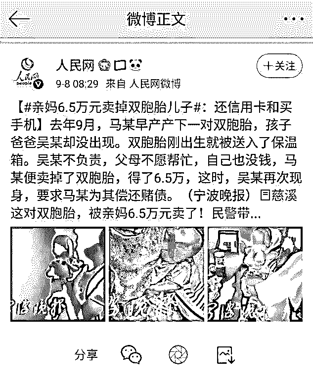
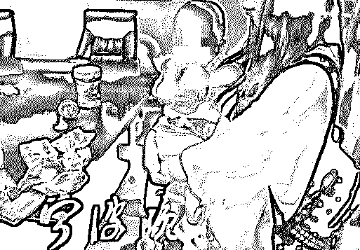
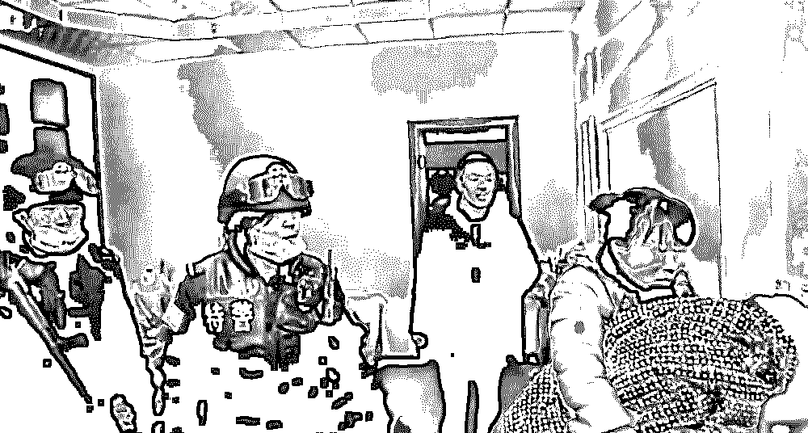
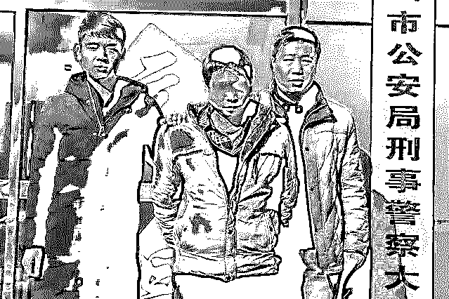
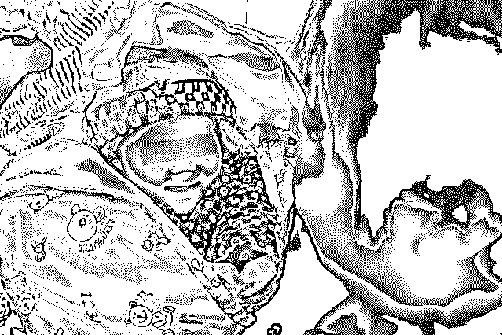
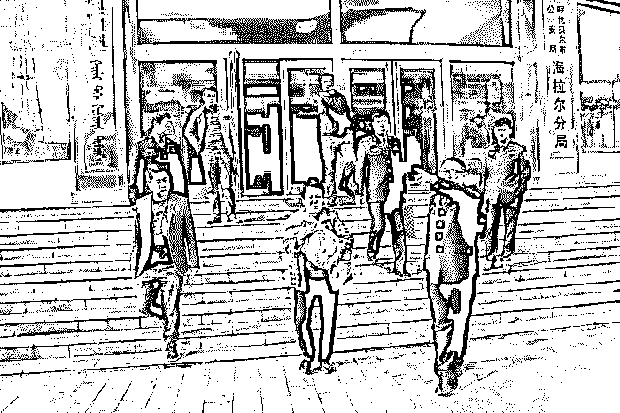

# 亲妈 6.5 万卖掉双胞胎儿子,竟是为了这个目的……

> 原文：[`mp.weixin.qq.com/s?__biz=MzIyMDYwMTk0Mw==&mid=2247496364&idx=1&sn=5de908468f371b92db82ad72eedc4c3b&chksm=97cb3994a0bcb082cd3cfd7f504dbdd74d3eb17ed8aef432f0a67131d18cde98d485dd6a0bf6&scene=27#wechat_redirect`](http://mp.weixin.qq.com/s?__biz=MzIyMDYwMTk0Mw==&mid=2247496364&idx=1&sn=5de908468f371b92db82ad72eedc4c3b&chksm=97cb3994a0bcb082cd3cfd7f504dbdd74d3eb17ed8aef432f0a67131d18cde98d485dd6a0bf6&scene=27#wechat_redirect)

**点击上方蓝色字体免费订阅“灰产圈”**

01

我们中国人常说：虎毒不食子。

**但总有些人比老虎还要可怕，比禽兽还不如！**

前不久，在微博上看到一条新闻：一对父母居然为了自己的一己私欲可以卖儿卖女，把孩子当做商品出售！

这样违背天理人伦的行径简直令人发指！

今年 7 月，浙江宁波慈溪警方在侦办一起涉黑涉恶案件时，发现一名涉案人员吴某（化名）竟然存在贩卖婴儿的行为！

**而更让人意想不到的是，被贩卖的孩子竟然是他的亲生骨肉！**

据了解，吴某与其情人马某是同村人，去年 9 月下旬，马某早产产下了一对双胞胎，而之前满嘴海誓山盟的吴某，作为两个孩子的生父却没有出现在医院。

双胞胎因为是早产儿，所以身体不好，刚出生就被送入了保温箱。

吴某不负责，父母不愿帮忙，自己手上也没有钱，因此马某视两个儿子为负担，随即动起了歪脑筋。

一周后，马某分别以 4.5 万元和 2 万元的价格将双胞胎儿子卖给他人。

卖掉双胞胎儿子后，马某用这笔钱还了自己的信用卡欠款，买了手机。

这时，消失许久的吴某却再次现身，并要求马某为其偿还赌债，马某一一照办，等民警找上两人时，6.5 万黑心钱已几乎被挥霍一空。

两个可怜的孩子，他们才刚刚出生，就被狠心的父母卖掉，他们长大后若是得知这件事情，该会有多么的伤心和难过啊！

**这件事情甚至会成为孩子一生的阴影，永远折磨着他们的内心！**

可恶的马某，把十月怀胎的骨肉肆意贩卖，把亲情明码标价出售，这是何等丧心病狂的行为！**你这种人简直不配为人，更不配做母亲！**

而最可恨的就是那个吴某！他身为丈夫，谈恋爱时海誓山盟，马某生产时却不闻不问！

身为父亲，对两个体弱多病的孩子没有尽到半点的责任，还用卖孩子的钱去还赌债！而且他还涉黑涉恶，这种人简直就是令人作呕的人渣！

02

原以为这样的恶人只是个例，但上网一搜才发现这种事情时有发生。

2011 年 7 月，湖南警方破获一起贩卖案，人贩子是一对 90 后的情侣，他们在 3 年内贩卖了 3 个自己的亲生骨肉。

这对情侣说不想要孩子，千万不要带孩子回来，因为孩子的降生没给他们带来欢乐，他们出去上网就特别不方便。

倒是卖了孩子，让他们一次拿到这么多钱，非常高兴，又可以泡网吧了。

2012 年，陕西小伙子李某和前女友未婚先孕生下一个男孩，随后分手。

2014 年 12 月，李某又谈了个新女友准备结婚，但对方听说他有个小孩后，坚决不同意过来当后妈。

于是李某在电线杆上边贴出告示，希望有人可以“收养”他的儿子。

2014 年 10 月，广西的黄某早起发现妻子和 2 岁的儿子都不见了，本以为两个人外出吃早餐了，并没有在意，直到当晚他收工回家，仍然不见妻儿的踪影，并且妻子手机关机，亲友皆不知情，这才紧张起来。

半个多月后，黄某与警方在一家麻将馆找到了正在搓麻将的妻子，妻子承认，为了打麻将，觉得经济上无力抚养孩子，就把孩子“送掉”，并且收取了 3 万元的抚养费。

2017 年 1 月，广德男子赵某将女儿以 4 万的价格出售，将其中 3 万元，打赏了十几个主播，给主播刷虚拟礼物。

之后其母亲得知，警告其接回女儿却遭拒绝，在母亲的威胁下，赵某不得已才去投案自首。

2018 年 1 月份，在河北省霸州市褚河港，刑警队破获了一起拐卖儿童案，这起案件共有三名犯罪嫌疑人，而其中有一人竟然是孩子的亲生母亲孟某！

据悉孟某的嫂子得知其将三个月大的亲儿子卖掉了，无法接受便选择了报警。

经民警讯问，孟某承认以 8 万元的价格将孩子卖给了邻居万某。而万某并不是自己抚养这个孩子，而是将孩子给了自己的姐夫赵某。

几经周转，办案民警终于找到了孩子。

相比那些孩子被人贩子拐卖倾尽一生散尽家产的家长，这样的父母的行为真的是千夫所指。

孩子是人，享有人权，也就不是父母的私有物品了，当然如果父母随意处置孩子，就侵犯了孩子的人权，违反了法律规定，必然会受到处置。

根据《中华人民共和国刑法》

> 拐卖妇女、儿童的，处 5 年以上 10 年以下有期徒刑，并处罚金，情节特别严重的，处死刑，并处没收财产。

03

每次看到这些消息都不寒而栗，这些生而不养的父母简直就是人渣！

他们从来都没有想过，这些孩子都是一个个鲜活的生命，不是他们的私人物品，更不是没钱就拿去卖的商品！

就像伊坂幸太郎说过的一句话：**“一想到为人父母居然不用经过考试，就觉得真是太可怕了。****”**

未经同意将孩子带到这个世界上，不但没有好好呵护他，还要让他小小年纪尝尽父离母走的心酸苦楚。

这种行为，又和牲畜有何区别？

牲畜尚且知道呵护温暖自己的孩子，可他们不会。

孩子向来都是世界上最可爱的生物，可就是一些不负责任的父母，将这种可爱变成了可怜。

著名黎巴嫩诗人纪伯伦在《论孩子》中写道：

**“你的孩子不是你的孩子，他们是生命的子女，是生命自身的渴望。他们借助你来到世界，却非因你而来，他们在你身旁，却并不属于你。”**

每个孩子都是独立的，是与父母亲人平等的个体，不是任你肆意贩卖的布娃娃！

**这世间的职业有千万种，唯有“做父母”门槛最低。**

孩子的生命是敏感而脆弱的，他们什么都不懂，他们的未来在我们手中，既然我们给了孩子生命，就必须要担负起为人父母的责任，把他们抚养长大！

**最后，希望每个孩子都能有一个美好而温暖的家庭，也希望爱与温暖常伴在孩子身边。**

← 向右滑动与灰产圈互动交流 →

**阅读原文加入灰产圈高端社群**