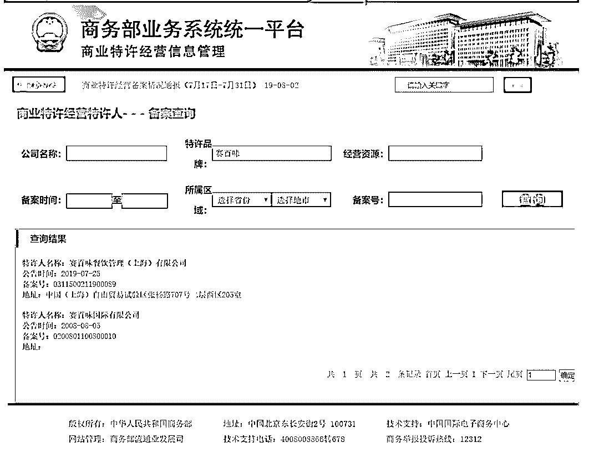
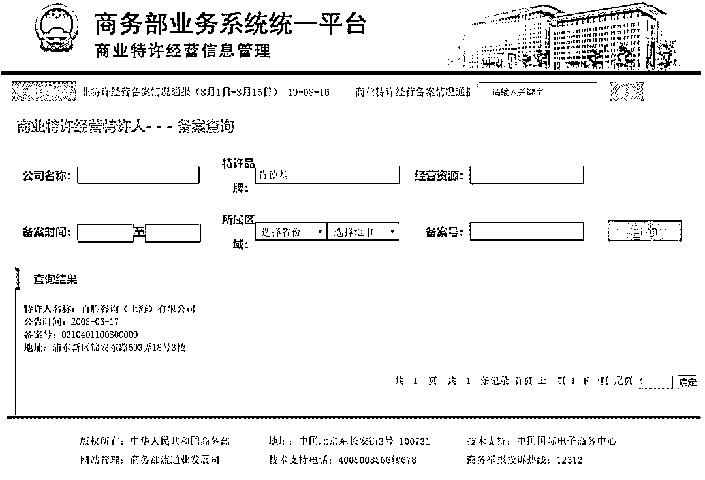
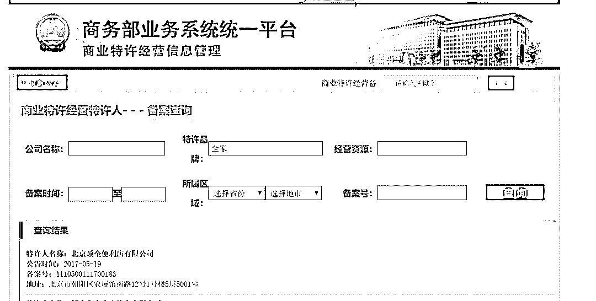

# 韭菜简史：快招加盟的致富骗局

> 原文：[`mp.weixin.qq.com/s?__biz=MzIyMDYwMTk0Mw==&mid=2247496360&idx=1&sn=aad6429c4c16d7ab79c47b248c2076bc&chksm=97cb3990a0bcb086b7e76e06278766f56c6094963dc5ef36eab049e3088e722911d408e7e1b3&scene=27#wechat_redirect`](http://mp.weixin.qq.com/s?__biz=MzIyMDYwMTk0Mw==&mid=2247496360&idx=1&sn=aad6429c4c16d7ab79c47b248c2076bc&chksm=97cb3990a0bcb086b7e76e06278766f56c6094963dc5ef36eab049e3088e722911d408e7e1b3&scene=27#wechat_redirect)

**点击上方蓝色字体免费订阅“灰产圈”**

00

之前我那篇奶茶传销广为流传后，有很多朋友来问与加盟行业有关的问题，覆盖了餐饮，小商品（水果生鲜蔬菜），小超市便利店，装修，人脸支付，乃至汽车美容等等等等，一小半的人在问某某某能不能加盟，一大半的人在问加盟后觉得坑的一比钱要不回来了怎么整。

这让我不禁感慨，这年头真是万物皆可加盟，只要是自己不赚钱的东西，都能拿来搞加盟骗人钱。

果然骗钱才是核心竞争力。

鉴于整个加盟行业的玩法都比较单一且没什么创意，而且他们关于梦想和暴富的话术中隐藏着韭菜收割的核武器库，我想好好谈谈加盟这件事儿。

希望各位读完这篇文章后能够好好对号入座，给自己的人生留一个机会，保护好自己的钱包，警惕各路加盟大师的洗脑。

人家说的赚钱，是说给自己听的。

不是给你的。

01

只要是开店，万物皆可加盟，从奶茶快餐水果黄焖鸡，到洗车超市情趣用品，可以说在加盟这块韭菜田里，只要你想找刺激，总有镰刀等着你。

很多普通人在思考自己到底参加哪个加盟才能赚钱，乃至加盟能不能赚到钱的时候，我都觉得他们对于这个世界的残酷真的是一无所知，善良和道德限制了他们的想象力。

我当年入行尽调审计的时候，师傅教我的第一件事，不是专业知识，不是察言观色，不是谈判技巧。

而是把《刑法》读 10 遍，然后每个月要读一遍，因为我们出审计报告的时候，或许用得上。

可能是用在尽调对象身上，也可能是用在我们自己身上。

法律，是道德的最低标准，是一切的底线，更是做生意的地基。

地基不稳，上面的建筑再华丽也没意义，因为垮塌只需要一阵不大的风。

所以当你在思考是否要参加加盟这个行业的时候，你首先要思考的问题应该是。

这东西是否合法？是否有备案？能否三方核验？会不会打一枪就跑？

当然，加盟或者说特许经营本身，在国内是合法的，这个不用担心。

你得搞清楚的是，你加盟的这个品牌，到底是不是真的经过商务部特许经营备案的。

一个很难过的现实是，整个市场上有特许经营备案的品牌，也就 4 位数，但是各类搞加盟的品牌，已经接近 7 位数了。

这就代表着，你接触到 100 家加盟品牌，里面起码有 90 家是没有商务部特许经营备案的。

这个备案，就是一道门槛，就像学历一样。

不是说大专生高中生里一定没有人才，只能说好学校毕业的人里面，出现人才的概率要更高，因为高考已经筛选过一次了，所以公司招聘的时候可以用学历来快速筛选人员，这样效率高，成本低，效果好。

在加盟品牌中，不能说没有备案的就一定是骗子，只能说能拿到备案的加盟品牌，都是起码经过官方机构审查过的品牌，有最基础的实力保证，所以你在考虑加盟的时候，可以通过这道门槛来筛掉 90%以上的水平不行的加盟品牌。

这是考虑加盟要做的第一步，这一步你都懒得做或者不知道的话，你还是别送人头了。

除非你搞加盟就是怀着公益心态，想为韭菜事业提供肥料，那我敬你是壮士。

02

如何查询一家企业有没有备案？

直接查商业特许经营信息即可，记得找链接里面带 gov（政府机关）的网站。

标准网址见图，认准 gov。

我们随便搜几个人尽皆知的正规加盟品牌看看。

赛百味

肯德基

全家便利店

一点点奶茶

这个网站非常好用，可以有效帮助你识别某个品牌的所谓加盟，到底是不是经过商务部备案的，如果没有备案，那么还是建议多留几个心眼。

除了过滤备案外，更重要的是，可以有效帮你识别山寨。

大家都知道，在搜索引擎去搜索信息的时候，你看到广告的概率是要高于看到有用信息的，只要肯掏钱，引擎们的屁股都是很灵活的，钱在哪里，他们就在哪里，非常真实。

当你直接在搜索引擎搜索某某品牌加盟的时候，往往排名靠前的都不是官网，而是各种山寨的，或者说，根本就是和品牌没关系的，花钱做投放，然后骗你加盟他们家。

鹿角巷自己全国一共才一百来家店，假店有上千，都是山寨的功劳。

当你用这个网站搜品牌的时候，往往还能给出对应的主体公司名称，你在寻求加盟的时候，要认准是不是和这个主体公司以及该公司出具授权的代理公司（授权要打电话到总部核验）签的协议，其他与之无关的公司，不论跟你说的多么天花乱坠，都是骗子，看清楚，都是骗子。

除了通过商务部网站核验之外，你还要考虑一个非常实际的现状是，一家公司到底有没有这个品牌。

之前杭州有一个加盟公司，旗下有一个 XXX 茶，是备案品牌，当时还挺火，然后有很多人去寻求加盟，但是对方说这个 XXX 茶最近不开放了，推荐加盟他们要搞的一个新品牌，叫做 YYY 茶，很多人就真的信了这一套，加盟了 YYY 茶。

结果是 YYY 茶本身是没有备案的（这家公司只有 XXX 品牌做了备案），而且 YYY 茶的品牌，其实是属于另一家成都公司的，杭州这家公司的 YYY 茶，名字根本不是自己的。

最后去加盟了的人，全都血本无归，因为品牌问题，连大型商场都进不去，里面就有我的同学。

懂了么，在加盟一家品牌之前，先要看清楚这家品牌有没有备案，然后要看这个品牌到底是不是和这个公司有关，还要看看这个公司到底有没有持有这个商标，这是最最基础的一步。

这一步不解决，干什么都是白给。

当然商业奇才即使加盟山寨也能打出一片天，但问题是有这个本身干嘛不把加盟费拿去大吃大喝？

03

当你找到了正规品牌的正规的公司后，是不是就可以高枕无忧地掏钱了？

很遗憾，并不是。

如果你遇到了山寨或者未备案的野鸡品牌，那么充其量只能算是上路前车就炸了。

如果你千辛万苦找到了正规品牌，你也只是找到了一条正确的作死之路而已，最后还是要炸的，区别就是直接炸还是半路炸。

加盟这条路，到了 2019 年基本都被人刨坑刨烂了，路上堆满了想要退款的前辈们以及各路吃不饱的梦想演说家们。

这其实很正常，很符合现实。

因为绝大多数人，根本就不适合搞加盟，他们只适合老老实实上班，高收益对应的从来是高风险，能承担高风险的人是极少数，绝大多数都是自以为能承担，结果出事儿之后哭爹喊娘。

加盟也好，自己开店也好，本质上就是做生意。

做生意这件事情，说穿了就是把自己掌握的优势资源变现的过程。

别管这个资源是什么，是人脉也好，是家庭关系也好，是特殊货源也好，是独家秘方也好，哪怕是大额资金也好，你如果要做生意，一定要是在一个能把自己资源最大化利用的领域来进行尝试，并且你要是这个领域的专家。

只有这样，才有存活的可能性。

一个医药领域的资深销售，对于行业定价和药品应用场景有着丰富的经验，并且手上拥有着大量的医生资源和各家药厂的内部价格，他此时出来开自己的医药代理公司，没有人会觉得不合理，专家带着自己的资源出来变现，就是这么顺其自然，他甚至都是带着订单出来单干的。

这才叫做生意，做生意是一个自然而言的让自己优势资源利益最大化的事情。

而我们绝大多数的想着做生意的人，都是什么情况？我总结了一下。

对于行业一无所知，之前根本没干过这一行，我还见过夏天开业火锅店，冬天开业露天烧烤的，这些憨憨的钱都不知道是哪里来的。

对于行业存在沙雕的浪漫幻想，尤其以咖啡店，花店，书店，奶茶店以及宠物店为五大毒瘤，以为岁月静好就能赚钱，最近新晋兴起了猫咖，算是咖啡+宠物的聚合体，堪称毒瘤 2.0.

对于现金流的概念为 0，根本没有现金管理和杠杆的基础知识。

自身现金储备和抗风险能力为 0，对于成本毫无概念，就那么十几万几十万钢镚，还想着吃一辈子，几个月不赚钱就得倒闭。

管理能力为 0，从来没有管过 3 个人以上，根本不知道管人是怎么样困难的一件事。

做事能力不足，过去只有打工经验，根本不知道一个企业的流程有多么繁琐，对于税务和各项检查毫无处理经验。

与人打交道能力不足，根本不懂如何和供应商进行谈判，无法拿到最有优势的价格。

甚至很多人都不知道做生意到底是什么，就是以为投点钱开家店就能收钱，这种人在现实生活中多的不要不要的。

有时候我都得感叹，很多人真的是活在梦里，需要社会狠狠教育一遍。

04

如果看到这里，你觉得自己虽然很茫然，对于加盟也不太懂，但是觉得苍天一定不负有心人，你觉得你可以，那么我来问你几个具体的问题。

之前我抛出过奶茶灵魂 3 问，今天既然写整个加盟业，我打算把灵魂 3 问升级为灵魂毒打 5 式，适用于大多数投资的坑，建议你认真思考一下这些问题，对你的人生或许有好处。

这些问题可能有点痛，但是痛要比你想不清楚进去送命要好。

这顿毒打，是我的温柔。

**问题 1，你对于你要加盟的行业了解多少？有没有打过工？ **

这个问题核心是考验你的信息掌握的能力，如果你的信息和对手的信息是不对称的，那么唯一的结果就是你被割韭菜。

打牌都玩过吧，一个新手和一个老手玩牌，只要老手不是沙雕，那么新手往往很难赢，因为对于规则不够理解，没有足够的经验。

加盟也是如此，一个行业你不懂，但是人家懂，人家就能割你韭菜，信息差产生利差，这个世界就是这么赤裸裸。

假如你加盟奶茶店，你懂不懂奶茶的 SOP？你知道客流潮汐是什么概念吗？如何管理你的员工不让他们偷钱？怎么和房东搞好关系不让他给你坐地起价？开外卖的时候如何保证不被外卖平台坑费用？原材料的保质期和品牌要怎么管理？

假如你加盟小饭店，你对于人流量有没有过测算？你知道如何合理搭配生鲜的采购数量避免新鲜度和浪费的失衡？你知道如何在菜市场不被别人坑?面对霸王餐要如何合理处理摆平？消防，卫生检查，如何管理？别人来挖你的厨师你有什么办法？顾客吃出问题了你怎么办？

假如你加盟一个服装店鞋店，你对于囤货成本是如何考虑的？你和加盟品牌的进货最低限制是多少？过季产品如何处理，品牌方是否回收？回收价算几折？如何应对网店乃至官方的电商渠道冲击？串货怎么说？工厂直接出货你怎么拦？你打算自己做活动，总部给你的调价权是多少？

假如你加盟一个宠物店，你对于动物知识了解多少？你知道猫狗的检验检疫成本有多高吗？你知道杂交和血统里的玄学溢价吗？你知道为了让猫狗油光锃亮，你得付出多少成本吗？你知道中国最大的猫类批发地在辽宁吗，当地批发猫狗真的是按肉价算的。你知道活物是最麻烦的东西吗？你知道一不小心一个传染病死一个店，弄不好还传染人类吗？

每个行业都有自己的问题。

以上问题，对于外行基本是无解的，如果你没有真的去这些行业打工过，你甚至都提出不了这些问题，更别说去解决了。

作为一个外行，傻乎乎什么都不知道，就怀着发财的心撞进去，结果多数都不太好。

**别相信那些搞加盟销售的说什么要认真考察品牌实力，行业优势，技术水平云云，那都是正确的废话，你一个外行你懂个 DAN 的好坏？****你到底看了多少家加盟？****你和多少真正的店主聊过？****你见识过多少一头热血赔光首付的倒霉蛋?你看过加盟品牌的核心 CRM 数据吗？**

你哪里来的本事分辨好坏呀？最后还不得是听着人家销售一通骚话给你造梦？还不是只能看他们的样板店？他们只管卖给你，你赚钱不赚钱管他们什么事情？

**问题 2，你去加盟创业，你有什么别人没有的资源优势？**

加盟这个生意，本质上和其他生意没什么不同，都需要你发挥自身的资源优势来解决问题。

记住，这里的优势是你自身的资源优势，不是所谓加盟品牌的优势，因为加盟品牌谁都能参加，所以这东西不能算优势。

开门店，最重要的三要素是，地段，地段，还是 TMD 地段，店铺位置决定 90%的生意。

那么问题来了，你有足够的优势地理位置资源吗？你家在闹市区有自有门头房，那当然是好的资源，你有吗？

哪怕是低成本的优势地段店铺也可以，注意要低成本，你有吗？

如果啥都没有的话，你说说你凭什么？不交电费用爱发电吗？

你要是还得靠求爷爷告奶奶的腰掏光裤子里的铜板来求一个不怎么样的地理位置，那你别来搞加盟了，别开店了，因为你一定会发现最后赚的钱还不够房租的，简直是赔钱给房东打工。

**为什么很多加盟店活不过 3 个月就要转让？****因为房租一般是押一付三，第一个周期结束后，他们就醒悟过来搞这东西要完犊子，还是打工划算。**

**相信我，绝大多数开过店的人，最后都醒悟过来，自己是给品牌方和房东打工，真的还是上班更划算。**

**当然你非得自己体会一下的话，我其实也觉得年轻人被社会毒打有利于身心健康。**

05

看了灵魂 6 式的前 2 式之后，如果你还是觉得很无所谓，那很好，我就欣赏头铁的年轻人，我们继续。

**问题 3，你真的知道这些加盟赚钱还是不赚钱吗？**

这个问题考验的是你的调查能力和处理问题的能力。

如何考察加盟赚钱还是不赚钱？别听那些销售顾问们跟你讲，从他们嘴里就说不出不赚钱这种事情，你要知道你的利益和他们是不一致的，他们的吃喝拉撒都要从你的加盟费里弄出来呢。

一般加盟方都是给你看一下样板店，标杆店，这些店其实根本没有任何参考价值。

很简单的道理，专门用来展示的店，能差到哪里去？包装一下成本能高到哪里去？

你要看的，不是他们总部带你去的那些店，而是和你在相同城市区间（大家都是三四五六线城市）的那些店，而且要多看几家不同的，同样的店开在不同的城市可能都会天差地别，要多和店主聊天诉苦。

这种情况下，你才能了解到真实情况，到底生意怎么样，品牌方到底要不要脸，市场竞争激烈还是不激烈。

就拿奶茶来说，现在各种奶茶疯狂开店，我楼下一条商业街 20 多家奶茶店，大部分生意都不怎么样，平均都活不过 2 个月，认真一点的话，这些信息根本不难获取。

更专业一点的，你选定几家店，天天盯着饭点和周末的客流潮汐，然后简单估算 GMV。

我以前做尽调的时候，可以看店看半个月，然后随机进门直接抽出当天的小票来核对。

如果你不愿意做这些事情，也不懂，那你还是好好打工吧，搞加盟就是送钱。

**问题 4，你到底有多少钱可以烧光不心疼？**

这个问题本质上是问你的抗风险能力和资金流掌控能力。

我相信每个人做生意都不是为了赔钱的，但做生意这件事情其实就是赔和赚，而绝大多数人都是赔钱的，不然怎么穷人这么多？

别总想着孤注一掷破釜沉舟，人类历史上成功的也就那么几个，绝大多数都是死的不要不要的没人知道，这叫做幸存者偏差。

加盟投入可不是一笔钱投进去就可以坐收其成了，你还要持续不断的投入运营资金，货款，乃至顾客赊账和意料外支出，这些东西往往品牌不会告诉你，怕把你直接吓跑。

很多品牌都说是 XX 元直接开店，呵呵，都是管杀不管埋的主。

加盟是吃资金流的生意，如果没有足够的资金储备，是架不住烧的，开过店的人都知道，每天一睁眼，欠房东多少钱，欠员工工资多少钱，欠水电原材料多少钱，真以为店能生金蛋么？

当你发现手里的钢镚经不住烧的时候，就真的晚了。

如果你不是家里有矿，烧个几十万不心疼，就当体验生活的大少爷姑奶奶，那么别想不开来搞加盟，成功率确实有，但是低到你赌不起。

这些年我见识到的开店的也好，给供应链做尽调时候做用户访谈也好，看到的数据也好，那种因为加盟搞的资产归零的太多太多了，很多人甚至搞到妻离子散。

**问题 5，你真的相信这个世界上有人会把赚钱的东西原原本本的送给你吗？**

人性是自私的，如果一个东西真的赚钱，那么为什么要分享给你？

加盟就是这样的一个反人性的生意。

每一家加盟企业都在吹嘘 0 门槛，0 经验限制，只需要投入 XX 万（甚至有的品牌直接 0 加盟费，你自己出装修和进货就行），有专业人士教你，专业人员帮你选地址，专业培训帮你快速入行，总之就是什么都给你包好了，你躺下赚钱就可以了。

这非常荒谬。

既然加盟品牌可以做到让你一个外行轻松赚钱，那么要你干嘛？当吉祥物吗？一个百分百赚钱的生意，为什么要开加盟？为什么不自己做？一个赚钱的大品牌靠着流水都能快速扩张，缺你一个外行那堆钢镚么？

少数靠谱的加盟品牌，你知道他们的审核和门槛有多高么，哪里来的销售天天给你鼓捣着梦想，财务自由和爱，一个个高冷的不得了，是投资动辄百万起，就这样的企业，都不敢百分百保证你能赚钱，你说说那些恨不得你掏个十来万就帮你走上人生巅峰的加盟品牌，到底是什么鬼？

他们真这么赚钱，还搞个屁加盟，自己下场才能赚的更多，才有更多的规模效应，更低的成本。

除非，他们就是靠加盟来过日子的，就靠吸你的血。

不然哪里来的热情和国际主义精神？

06

如果经受了灵魂毒打 5 式之后，你还是觉得加盟这个行业大有可为，没关系，我还有大招。

我来讲讲当前加盟行业存在的几个巨大的坑，我喜欢管这个叫做独孤韭剑（我没打错字），这九招剑法割起韭菜那叫一个秋风扫落叶。

少年坐稳，看看好这个残酷世界的真相。

**第一剑，加盟费上天。**

你交给品牌方的加盟费也好，保证金也罢，大多数情况下是要不回来的。

你别以为品牌说什么达成什么条件退给你，什么为了方便管理有所约束之类的鬼话，相信我一个 90%以上连备案都没有的行业，人家玩儿韭菜是最专业的。

少数情况下，他们的律师会拿出那些你都看不懂的合同来告诉你小朋友你别想得美了。

多数情况下，他们直接消失或者闭门不见，并建议你直接起诉，起诉的人太多，你可能先得排队拿号。

基本上所有的加盟品牌，叫钱之前你是爹，交钱之后你是孙子。

**第二剑，店铺选址坑爹。**

绝大多数品牌都号称可以帮助加盟商精准选店，真的，这东西其实就是个伪命题，他这么牛逼会选店，选店就能解决经营问题，干嘛要你加盟来承担风险？

很多品牌其实根本不懂选店，只会选人流量大的地理位置，而且还有店的面积要求。

如果你不同意吧，想想你的保证金和加盟费，而且品牌可以甩锅说你自己选店不好，生意不好和他们没关系。

如果你同意吧，这背后代表的就是成本，原本给你许诺的成本，一旦加上他们选的地理位置，百分百超标，没有品牌能给你算准成本的，成本超标是大概率事件。

大多数加盟品牌都不会告诉你好位置=预算超标=他们许诺的小投入根本实现不了。

房租一付，破产近在咫尺。

**第三剑，店铺装修吸血。**

当你咬着牙选了店之后，你得装修吧，很多品牌都会要求你使用他们的装修队以及装修材料，说是为了保证风格统一，给顾客最好的感受。

可拉内啥倒吧，都是嘴上说的好听，其实就是想在装修上坑你一大笔，你如果拿着他们的设计图和标准，自己找队伍装修，起码省一半的钱。

但是吧，想想你的保证金哦小朋友，你咬咬牙可能就忍了。

恭喜你，装修一掏，不管你会不会完蛋，品牌方已经大赚特赚。

**第四剑，原材料上在你胸口开一枪。**

基本上所有的加盟，都要求你使用他们的原材料。

奶茶餐饮要用他们的配方配料，小卖部要从他们那里进货，服装之类的就更不用说了，串货还要被罚。

那么问题来了，他们提供给你的原材料，其实都是加过价的，只要你买了，你就又被割了。

如果你会使用一个叫做淘宝的 APP，你查查类似的原材料以及进货价，你就能发现，自己买贵了很多很多，差价不说一倍吧，多数情况下至少 50%是有的。

这就代表了成本，你的成本就比淘宝价高 50%，你说说你还做个屁生意，你怎么和人家没有加盟的竞争，50%的差价把你屎都给打出来。

更有趣的是，那些被品牌方吹嘘的秘方，淘宝全都有卖，很多店都是你进货多少，直接送秘方，而且原材料还包退换，记得好评哦亲。

如果你进了品牌方的原材料想退？头给你打爆。

如果你想反抗，想想你的保证金，想想你的房租，想想你的装修。

想想你悲惨的未来。

07

**第五剑，压货是你创业路上自杀的上吊绳。**

如果说卖的原材料贵就算了，很多品牌还有要求进货量，一次要进货 N 多，基本就是把加盟商当做接盘侠来出货。

你别想反抗，这些东西都是写到合同里的，想想你的保证金，想象你的房租，想想你的装修，哎呦我都说不下去了，你钱在人家手里，你钱都投了，你还想怎样呢？

老老实实，挨毒打吧。

你想着偷偷用便宜的替代品，偷偷用一模一样的非加盟商渠道的原材料，别想了，很多品牌还有各种巡查员和神秘访客制度，说穿了就是要检查是不是偷偷乱用了。

这些加盟巡查员懂个屁指导经营，他们真懂早就自己做了。

他们的 KPI 就是找到你的不合规地方让后罚款，原材料是重点排查对象。

这些罚款，就像钝刀子割肉，让你既不舒服，又不会一刀切死你。

割韭菜已经全面进入精细化作业了。

**第六剑，失控的同品牌加盟以及激烈的同业竞争。**

按照道理来说，每一家店都有自己的特定辐射范围，类似于地盘的概念，一旦同一块地盘出现了 2 家及以上的店铺，那么就会出现激烈的同业竞争。

所以开店的基础常识是，不要挤在同一块地方，不然大家都不好过。

但是很遗憾，加盟品牌大多数都不会在意这东西，读到这里，你应该发现他们有多少种方法在你身上赚钱，有沙雕赶着来送钱，他们开心还来不及呢，多多益善，多多益善，崩盘之后大不了再搞个新品牌继续干，还美其名曰屡败屡战。

所以不要指望品牌当人，也不要对于过几天你隔壁出现了同一个品牌感到惊讶，这个世界是这样的。

于此同时，很多人做生意都有瞎扎堆的坏习惯，看什么火就干什么。

开店也是，动不动就一堆人开一样类型的店，大家同行是冤家，乱来价格战，最后谁都干不下去，一起完蛋。

**第七剑，让你扛不住的各类活动以及互联网营销。**

你知道么，很多品牌其实动不动就要搞什么全国活动，什么节假日大促销，需要加盟商自费（当然钱直接给他们更好）制作物料，然后自己掏钱补贴活动，请别人来开单。

这时候你看到的排长队，根本没有任何意义，赔钱卖谁不会呀，这种活动搞来的全是价格敏感性用户，他们不是来买的，他们是来占便宜的，谁便宜就去谁那里。

而且，这里面还会有各种羊毛党出现，从品牌方到加盟商，让他们学习或者理解如何防范羊毛党，确实是超纲了。

最后一看订单多多，赔的更多。

至于各种外卖平台的活动以及抽佣，更别提了，提起来都是眼泪。

**第八剑，金融产品榨干你最后一滴血**

怀着财务自由梦想的人很多，但是能一次性掏出很多钱浪费在加盟上的人不多，但是你不用担心，金融贷款现在这么发达，只要你有心，有一万种方法让你成为最绿的韭菜。

很多加盟品牌和贷款公司合作，推出了一键借款服务，简单快捷，利息优惠，催收温馨，让你的破产之路又顺又快又刺激。

如果说搞加盟是蠢，那么借钱搞加盟，我只能说是有想象力。

**第九剑，传销一样的散播手段，韭菜渣也能拿来炒鸡蛋。**

当你开店满 1 个月的时候，你就会完全意识到一个问题。

你被坑成 SB 了。

这时候你想退加盟费，退费用，都晚了，别说没门了，窗户都给你用合金封死。

也有的品牌特别鸡贼，说退钱可以，但是你要拉来至少 3 个人来参加加盟，才能把你的钱退给你，然后你就变成了他们的推销员，为了自己解套，疯狂坑人，疯狂给人讲这个项目多么有前景。

还有的品牌直接搞了一个加盟下线机制，拉人加盟入伙，直接可以获得佣金，下线再拉下线，还有佣金。

和传销一样一样的。

最后大家发现，加个屁盟，还是搞传销最实在。

08

有时候我觉得加盟搞的这么群魔乱舞，简直不可思议。

你想开店，开店就开店，干嘛想不开要加盟？

你一切自己来，或者干脆淘宝买（从原料到配方到标准 SOP，应有尽有），能节省起码三分之二的成本，这些省出来的钱不管是用在房租上还是用作运营费用，哪怕留作跑路经费，都很好，为什么要送钱给你不知道底细的人？

而且现在开店房租这么高，弄不好辛辛苦苦一年算下来全都给房东打工了。

还没自己上班划算性价比高，开店实在是太累太累了。

加盟有时候和微商一比，感觉还不如微商彬彬有礼。

真的，微商都不让你囤货只让你发朋友圈（还能随手屏蔽）结果搞的大家都在骂，加盟不仅让你投入很多钱，还让你囤货压款，还各种欺负加盟商，怎么就一堆人天天凑上去打听，有些人真的是抖 M。

看到这里，或许你会恍然大悟，加盟不靠谱，但是我可以自己搞个品牌拉人来加盟呀，我自己做项目，坑别人钱多好呀。

朋友，建议再读读这篇文章，你以为那 7 位数的加盟品牌是怎么来的？全国起码有 100 万的人和你有一样的想法，这条道路上挂掉的前辈也多不胜数。

韭菜收割已经全面进入高科技时代，你现在怀着这个想法进去，也还是被收割的。

你到不如看看隔壁的知识付费，一个个自己都写不出 10W+的人教你怎么成为 KOL 财务自由，非常刺激。

或许有人说，你怎么一杆子把人都打死了呀？照你说加盟都是骗子吗？

恰恰相反，我不认为加盟是骗子，但我认为加盟本质上是一个门槛非常高的生意，一个没有资源，没有资金，没有行业专业知识的人懵懵懂懂用自己那点老婆本首付本去撞门槛，最后赔的一塌糊涂，非常愚蠢。

对个人，对行业，其实都不好。

那些特别靠谱的加盟品牌，往往门槛都非常高，这就注定了能去玩儿的人，根本不需要别人担心，人家自己有足够的风险承受能力，而且品牌筛选也很严格，纯外行很难混进去。

最坏的就是那些打着 0 门槛的各种连备案都没有的野生加盟品牌们，他们专盯着那些穷人手里的最后一堆钢镚使劲。

还有很多人问，那我确实钱不多，也啥都不懂，那些加盟的人都说的怎么怎么好，我该不该相信呀。

朋友，一边是劝你别乱花钱，实在要开店还是自己来省钱，甚至都告诉你淘宝啥都有，不要加盟掏冤枉钱的；

另一边是恨不得让你今天就交钱签合同掏钱，从你的加盟费里吃提成的。

你说谁在你身上捞好处？你说你该信谁？

如果你这都想不清楚，我觉得你该信梦。

梦里什么都有。

**作者：半佛仙人**

← 向右滑动与灰产圈互动交流 →

**阅读原文加入灰产圈高端社群**