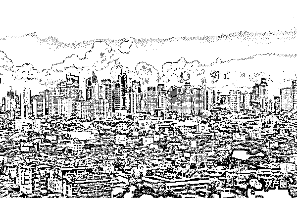
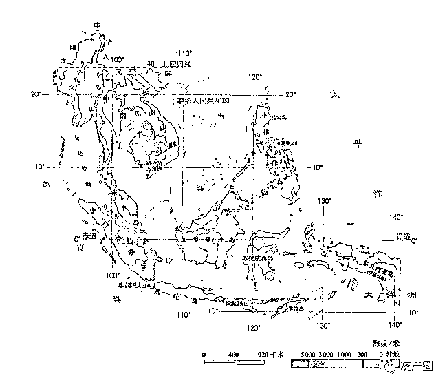
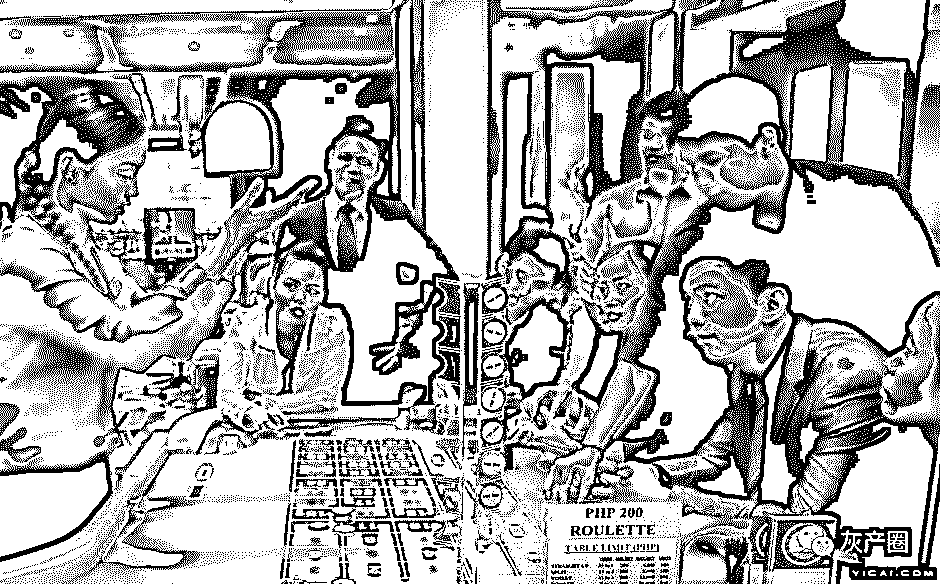
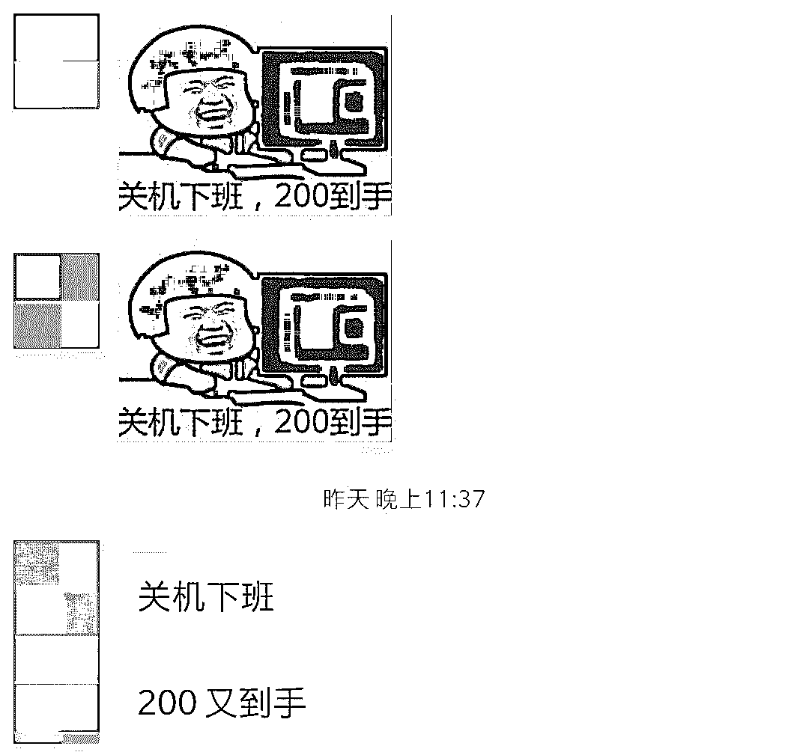
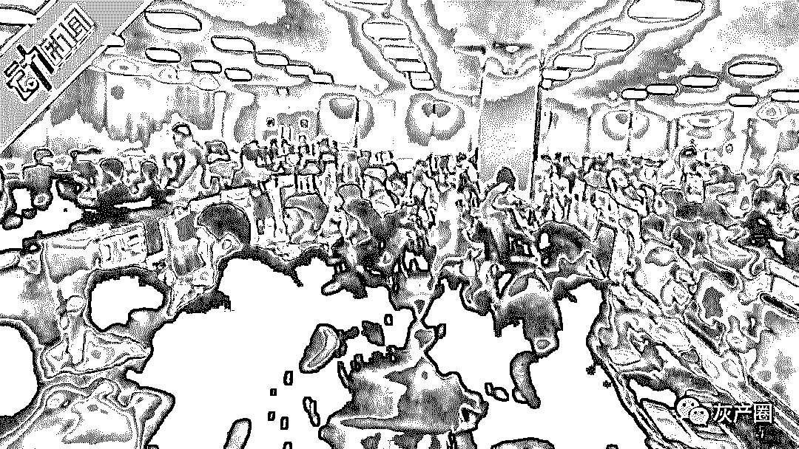
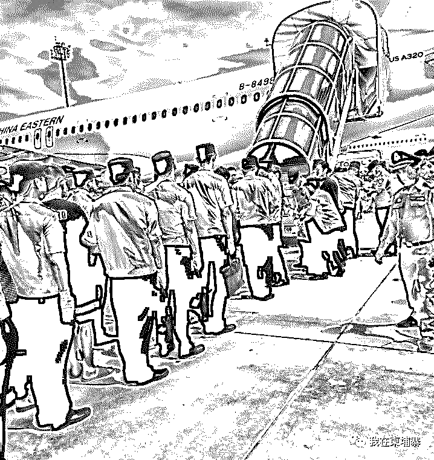
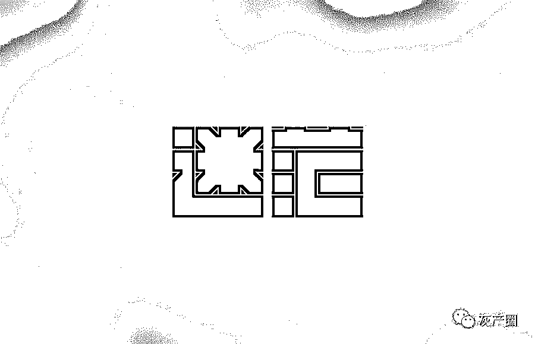
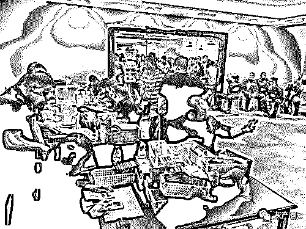

# 高压政策下的菠菜人生，该何去何从？

> 原文：[`mp.weixin.qq.com/s?__biz=MzIyMDYwMTk0Mw==&mid=2247496332&idx=1&sn=4a06d350ebd395c2d3cdda066241fdcb&chksm=97cb39b4a0bcb0a25849e5153075963e409baf438e424af5b1e5a55d593d50ef0e9e07991d75&scene=27#wechat_redirect`](http://mp.weixin.qq.com/s?__biz=MzIyMDYwMTk0Mw==&mid=2247496332&idx=1&sn=4a06d350ebd395c2d3cdda066241fdcb&chksm=97cb39b4a0bcb0a25849e5153075963e409baf438e424af5b1e5a55d593d50ef0e9e07991d75&scene=27#wechat_redirect)

**点击上方蓝色字体免费订阅“灰产圈”**

导语

听说，每一个从事波菜行业的人，都是有故事的人。 

他们或有一夜暴富的梦想，想要豪车美女相伴。

他们或者只是简单的想要买一套属于自己的房子，能在这繁华的世界拥有一个栖身之所。

他们又或者生活所迫，选择亡命天涯，到这里碰碰运气。

数十万人来到东南亚种"菠菜"，开启波菜人生。

据不完全统计，在菲律宾从事波菜行业的人至少有 30 万，其次是束埔寨，不低于 20 万人，缅甸、泰国、越南、马来西亚也有不少。

在东南亚的街头，充斥着华人面孔，灯红酒绿的街道，被中国文化所浸染，随处可见的中国餐馆和中国汉字，让波菜人群，终于有了一丝丝亲切感。

为什么在东南亚波菜公司会遍地开花？

首先，菠菜行业的巨额利润让很多投资者前赴后继的投身这行业但是中国除澳门之外的地方是不允许设赌的。

其次，有利的“种菜”环境。当地地方势力的保护及支持，当地政府睁一只眼闭一只眼，你们爱干啥就干啥，反正别祸害本国老百姓就可以了。在种种利好条件下，兼职是“种菜”的天堂。

再次，很多人为了过上好日子，愿担风险，漂洋过海，来到这里收割波菜利润。

**“菠菜”这一行业，流血的有，流泪的有，挣得盆满钵满的也有，整个产业链条经过十几年的发展已经完整而成熟**。

**链条尖端的人日进斗金自不必说，而那些链条底端的人群，前途未ト，富贵由天，颇有一种破釜沉舟之感。**

从事这个行业的多数人都是普通人，很多人谈不上没那么坏也谈不上啥好人。

不见得都是人渣败类，也不是什么英雄好汉。

善恶与是非有时候很难有清楚的界限。

因果循环与报应，大多凡夫俗子，又都看不透。

****

这些波菜党的工作并不轻松，每日必须工作 12 小时以上，几乎没有假期，吃饭、睡觉的时间更有严格的限制，每日扮演不同的角色去寻找目标客户，为的就是业绩与提成。

想要拿到高额的回报必须要有相等的付出，常言道**“吃得苦中苦，方为人上人。****”**便是这个道理。

过万的月薪也没有那么容易到手，如今的菜农日益艰难，竞争的加剧，中国政府关注，让他们惴惴不安，各大媒体的宣传，让大家防骗意识更强，拉个客户成本更高。

去年有媒体潜入菲律宾的珍珠大厦，最先从官方上揭开了菠菜的一层面纱。

这件事被报道出来后，大家都以为珍珠大厦会有所收敛，至少也要停业整顿一段时间给中国政府一点面子。

实际上，风波后，他们就加强了安保等措施，带有工牌的年轻人照样出入，常言道富贵险中求，或许就是这样。

在忙碌的菜农

今年在中国政府的高压之下，菲律宾、柬埔寨、越南、马来西亚等一些国家更是频频行动，更是闹得人心惶惶，不少波菜公司采取放假措施想借此躲避风波或者直接转移阵地。

波菜之多，如野火烧不尽，春风吹又生，已经存在了十几年的东西，**菠菜行业与当地势力早就磨合默契了，此刻中国要严打要打破这种平衡，不单单动了狗庄们的奶酪，也动了当地势力的奶酪，这是他们坚决不允许的。**

**所以，雷声大，雨点小。****一直都是目前的态势，甚至，在当地势力的干涉下很多人抓了又放了**。

但是这效果也很明显，至少国内的人要出国肯定更谨慎了，呆在那里的也备受煎熬。

即使老板称有多硬的后台，但谁都不知道会不会哪天当自己欢快的听着歌，扮着美女跟赌徒愉快的聊着天，突然警方破门而入呢？然后，就来个落地三件套。

在内外夹击的高压政策下，波菜人生该何去何从呢？

菠菜党是应顺应时事，主动金盆洗手回国，还是继续扛着风险前进，还是另谋他路？

**其实，每个菠菜党心中已经有了答案。**

谁也抵不住暴利的诱惑，每个人都尽力的捞，以保下辈子无忧人生。

捞够的人假装金盆洗手，捞不够的还在继续找机会挺进，什么都没捞着的干脆不再干了。

虽然狗庄、狗推一直被骂，但看在真金白银的面子上，大家都假装不在乎。

在东南亚这些体制不是很完善的国家赚钱从来都不是件容易的事。

有人虽然日进斗金，但还是锒铛入狱，有人即使有财运亨通却没有富贵命，不小心将命留在了这里。

有人什么好处都没捞到，淘金之路开启的是悲剧之路……

这里不光钱不值钱，命也不太值钱。

********

****菠菜行业不会消失，道高一尺，魔高一丈，**菠菜公司，无论国家怎么严打，出啥政策，菠菜公司该怎么运行还是怎么运行，动的也都是皮毛。**

****近期打击最高调的两个国家，菲律宾跟柬埔寨，我们都明显的看的出来，菠菜背后的势力惊人，想要消灭并不那么容易。****

******然而，这一场中国政府与网投及诈骗分子的没有硝烟的战役已经打响。******

****面对接下来的日子菠菜大军是轰然倒塌，还是以另一种更不寻常的方式存在？****

****我们需要等待。****

******来源：我在柬埔寨******

****更多推荐********[200 名“抠脚大汉”伪装美女，在线陪玩诈骗超千万！](https://mp.weixin.qq.com/s?__biz=MzIyMDYwMTk0Mw==&mid=2247496287&idx=2&sn=98e7f23c19edd6a2890cc5ce14d81268&chksm=97cb3967a0bcb071178318a479122a737c55d217c6e8c762efeb9ac3e7c9ce6d29a2895afa03&scene=21#wechat_redirect)[恋爱“杀猪盘”套路深，你能“说好不哭”吗？](https://mp.weixin.qq.com/s?__biz=MzIyMDYwMTk0Mw==&mid=2247496287&idx=1&sn=742acc952de202901f0258c03a5ca578&chksm=97cb3967a0bcb071443be4c0bd3b23a9db7d950cd80d95f89e754a66dd922ff139d02c870f26&scene=21#wechat_redirect)[赌徒：曾经梦想做赌神 , 如今却成人下人](https://mp.weixin.qq.com/s?__biz=MzIyMDYwMTk0Mw==&mid=2247496303&idx=1&sn=cebef18a7c873452ae34a0c64dfb8f8d&chksm=97cb3957a0bcb041688d8bfd1a7fecd0ea24a491884e56e93f01cc898b3c0dcf108664cf1fa9&scene=21#wechat_redirect)[网络无间道大戏之“黑产与黑产的爱恨纠葛”](https://mp.weixin.qq.com/s?__biz=MzIyMDYwMTk0Mw==&mid=2247496287&idx=3&sn=c02396fef0b83a6f3090028c1acd77c0&chksm=97cb3967a0bcb071cca9458337bc54dfaec496b775b8043a41391acb67bac24805b4f9334272&scene=21#wechat_redirect)

← 向右滑动与灰产圈互动交流 →

**阅读原文加入灰产圈高端社群**

# 

> 原文：[`mp.weixin.qq.com/s?__biz=MzIyMDYwMTk0Mw==&mid=2247496329&idx=1&sn=5d50599891bc8388e61564c61a66fcd2&chksm=97cb39b1a0bcb0a72dbeb8befe2973b5c21b87cb18cd9edb510e35ee94f7337a5c8282fd9b94&scene=27#wechat_redirect`](http://mp.weixin.qq.com/s?__biz=MzIyMDYwMTk0Mw==&mid=2247496329&idx=1&sn=5d50599891bc8388e61564c61a66fcd2&chksm=97cb39b1a0bcb0a72dbeb8befe2973b5c21b87cb18cd9edb510e35ee94f7337a5c8282fd9b94&scene=27#wechat_redirect)

## 黑灰产披上网络外衣敛财 “年产值”逾千亿

展开****