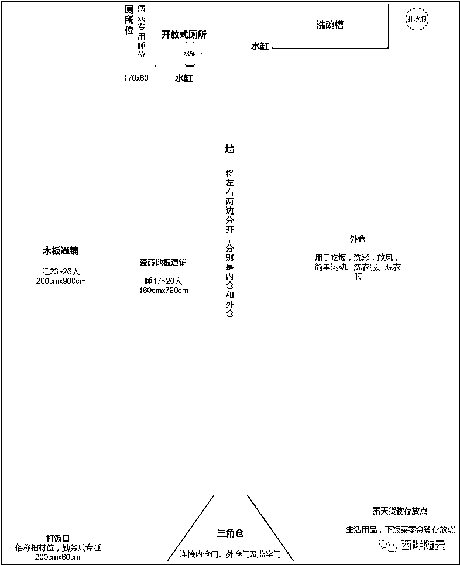

# 不可思议的 456 天——寄正通往监狱大门的外包服务商们

> 原文：[`mp.weixin.qq.com/s?__biz=MzIyMDYwMTk0Mw==&mid=2247496323&idx=1&sn=17c17bd7c06ca1ce5f8eb8f8ad77fc92&chksm=97cb39bba0bcb0adc74651504e46e998dade7d679aec454833bb3e8caf3d5ac1c349524ca298&scene=27#wechat_redirect`](http://mp.weixin.qq.com/s?__biz=MzIyMDYwMTk0Mw==&mid=2247496323&idx=1&sn=17c17bd7c06ca1ce5f8eb8f8ad77fc92&chksm=97cb39bba0bcb0adc74651504e46e998dade7d679aec454833bb3e8caf3d5ac1c349524ca298&scene=27#wechat_redirect)

**点击上方蓝色字体免费订阅“灰产圈”**

因原文传播太广，给作者带来了不必要的麻烦。本文已在原版基础上，删除和修改了敏感信息，本文原文来自：西畔随云。

本网转发本文旨在通过作者的经历让大家远离犯罪，请不要因为制度等问题产生负面情绪，任何发展都需要时间，请大家保持积极的心态。以下是正文：

想了很久这篇文章的主题，最终回想起整个事件的起因，还是因为作为外包服务商的我对法律知识的浅薄以及法律认知上的轻蔑所导致的。遂决定以叙述的形式，从用坐牢的亲身经历来告诫所有类似外包服务商的角度来切入。

本文讲述的是作为外包服务商的我因协助开发赌博软件而坐牢的故事。

本文分三个部分，完整事件、监所生活和感悟轶事。您现在阅读的是全文。

**上篇——整个事件**

我是谁

本人从事互联网行业 10 年，自己创业；做过淘宝卖家（12 年老店）、外卖网（曾获得过 IDG 投资）、超市网（类似 JD 到家）、团购网（面向美国华人的团购）等等。也当过上班族，在重庆市猪八戒网络有限公司任职过产品经理，有幸获得高管赏识，但最后离职自己当小老板。被抓前在猪八戒接软件及网页开发等外包订单。其他的不多介绍了，只要知道我最后是在做外包服务就足够了。

这一年多我在哪？

从 18 年 5 月 3 日到 19 年 8 月 2 日，整整 456 天我都待在某看守所。

因为什么事？

为他人开发赌博软件，涉嫌诈骗罪和开设赌场罪被逮捕。

被捕完整经过

**01**

****接订单** **

**2017 年 12 月，我司通过猪八戒外包服务平台，接到了李某发布的开发竞猜游戏的需求。详谈后得知该游戏需求实际为竞猜 QQ 在线人数的手机网页游戏（以下简称“企鹅在线”）。当然作为一个成年人我很清楚该游戏可被用于赌博，这就像卖麻将机的老板当然也知道麻将机是可以用于赌博的。**

****02** **

****为什么会接这个订单？** **

**1**

**出于赚钱的目的**

**据我所了解，软件外包行业中的 90%的服务商都会开发类似的游戏应用。原因很简单，开发周期短（大多都是在成熟的源码基础上修改）、利润率高（普通开发能做到 50%的纯利润已算很高，但类似软件做到 95%也不稀奇）、维护成本低（基本不需要做什么特别的维护，只是找个名义收维护费罢了），更有甚者直接参与其中获得暴利（一般类似软件运营起来一月上百万的利润是手到擒来，从中占一点技术股或者直接入股也是颇为丰厚的回报）。** 

**2**

**对猪八戒平台的信任**

**猪八戒每个需求发出来都会经过审核，那都发布出来了，自然是猪八戒认为没有法律风险的需求（如果有法律风险也认为会给我提示，就算不提示是否应该给到服务商足够的教育，教育用户当然是作为平台级应用绕不过去的责任）。基于这层原因以及伴随侥幸心理，选择性地忽视了其中存在的法律风险。PS：任何平台的发展都要经历一个过程，本人亲测猪八戒已经屏蔽了所有类似需求的关键字，做了相应的整改，也在逐步进步，大家要相信猪八戒依然是一个不错的外包平台（就不拿某宝举例了）。**

**3**

**对律师的信任**

**在最终决定要开始开发之前，我咨询过“专业”的律师，得到的答复是：如果明知他人开设赌场并为其提供开发技术支持，收取费用不超过 20000 元，则构不成刑事责任。所以我觉得只收取 15000 元的开发费用即可确保无虞（虽然这个费用是亏本的）。PS：1\. 你问我为什么要亏本做？除了风险外，当然是因为可以二次销售啊，同学。2\. 为什么“专业”二字我会打引号，因为我只收了不到 15000 元的开发费用，但是我还是被捕了。**

****03****

****开发****

**因李某一直想要添加杀大陪小，包赢不陪的诈骗功能，“企鹅在线”的开发一直不顺利；一是考虑开发成本，二是考虑法律风险，最后这项功能没有实现。最终项目在 2018 年 4 月分才算初步完成进入测试阶段。除了内部员工进行测试外，李某还找了 10 个左右的真实用户进行小范围测试。**

****04** **

****抓捕以及抓捕之后****

**2018 年 5 月 3 日，7 个警察叔叔（以下都称叔叔）在我家小区蹲了 3 天后，终于在我按下钥匙解开车锁后的 5 秒内蜂拥而至；举着摄像机的举着摄像机，出示证件的出示证件，问话的问话，分工不可谓不明确，将我团团围住，大有一种明星被狗仔跟拍的快感。叔叔问我，为什么 3 天都不出门；答，因为可以用美团外卖啊。随后将我带上车，嘘寒问暖，要不要喝水啊、有没有吃饭啊、要不要去给你买一碗小面？我一阵惶恐和不安，难道我穿越了，这实际上是一辆旅游大巴？演员叔叔们卖力地演出之后，问我是否知道犯了什么事，我将我有记忆以来所有的罪行一一详细坦白，如数家珍，以求获得青天大老爷们的好感。谁知弄巧成拙，我所有认为我有罪的坦白被全盘否定，尴尬到了极点。终于失去耐心的叔叔们恢复了本来面目，拿出了他们秘密武器——华为手机，翻开了李某的聊天记录（不然你以为有多高科技），找到了“企鹅在线”的产品图片问是否是我们所做。我当然只能像磕了摇头丸一样拼命地摇头，哦不，是点头。**

**一顿初步讯问后，叔叔们带着我来到公司办公地点，让我给没有上班的员工通电话，诱骗他们来公司好将他们通通缉拿归案。最后含我在内的 8 人被 30 多个叔叔们押到大竹林派出所，当然叔叔们也不辞劳苦地把所有电脑、公司文件、以及静静地躲在遥远角落的 NAS 网盘也一起带走了。屏幕君们因为体积太大，幸免了。**

****05****

****讯问准备** **

**我们所有人都觉得应该几个小时问完就能潇洒地离开，然而这只是开始而已。5 月 3 日下午 5 点左右到派出所，我们就被关在一个三面都有软垫墙和一面单面透视玻璃的 10 平米房间里。整个讯问准备过程十分漫长，死物活物都拍照片、各种明星级般合影、录指纹、DNA 抽血入库、搜身、准备录像机（听叔叔们说重庆的设备简直烂爆了，所以准备了很久）、打印笔录模板（打印个模板都搞了 1 个小时）等等。中间还是会给水喝，给饭吃，不过也只是饱腹的标准。**

****06** **

****讯问（做笔录）** **

**整个讯问从晚上 9 点左右开始一直持续到凌晨 2 点。当然，我们是一个一个被讯问的。到我的时候已经快接近 12 点了，我所有的抗拒挣扎都变成了想尽快逃离，来吧，管你问什么快问吧，我都告诉你。****写一些比较有印象的问答（都是大概意思没有精确到每一个字）**

****Q1****

******“****企鹅在线”业务是谁接的？******

******<pletter-spacing: rgb="" helvetica="" neue="" hiragino="" sans="" gb="" microsoft="" yahei="" arial="" sans-serif="">A：我。</pletter-spacing:>******

********Q2********

**********“企鹅在线”业务是谁开发的？**********

********A：A 前端,B 后端,C 产品，还有 D 主管（代指）。********

**********Q3**********

**********你们这是一个什么样的平台？**********

********A：竞猜游戏。********

**********Q4**********

**********有无盈利，收了多少钱？**********

******A：亏钱，没盈利，收了 11500 元左右。******

********Q5********

**********李某为什么要找你开发杀大陪小功能？**********

******A：可能想赢钱吧。******

********07** ******

********讯问结束** ******

******凌晨 2 点讯问结束后，与本案无关的同事被释放了。随后又是漫长的体检，按照相关规定，没有体检报告看守所是不收的。最后直接参与本案的，包括我在内的 5 个人，被移送到渝北看守所。叔叔们说先关 2 天，到时候转移到 A 城市，我们要在重庆旅游 2 天。******

********08********

********转移********

******5 月 5 日上午，我们被带出看守所坐动车上 A 城市。为防止逃跑和出于安全的考虑鞋带是不能有的，加之金属物件不能带进看守所，前一天晚上牛仔裤上的金属扣、拉链都被强行拆除了，皮带都被没收。当家人来送行，看到一脸倦容、如此邋遢、像乞丐一样裤子系也不紧、把没有鞋带的运动鞋穿成了拖鞋的我时忍不住泪崩了，但我也只能强装镇定安慰他们说没事几天就回来了。毕竟警察叔叔们都是这么告诉我的：你们这个事情不大，过去配合几天就可以回来了。              ******

************

******普法小百科******

******为了让大家清楚了解刑事案件的被告人一审期间主要会经历哪些主要程序，特地给大家画了一张简图：******

******PS：所有时间均为最长时间，当然并不是所有人都能像我一样获得体验“拖”字诀大法终极奥义的殊荣。
本图不包含不移送审查批捕，不批捕，不起诉，法院不立案等情况；也不包括精神鉴定，申请延期审理、法庭补充侦查、死刑案件等情况；也不包括外籍人员或不在中国领域内居住的当事人。总之 99.9%的案件都属于正常案件，一审都在以上流程内。  除开第一次刑侦延长或向最高院延长等极特殊情况，99.9%的案件从首次刑拘**到**起诉理论上最长会经历 7 个月零 82 天，到一审判决再加 3~6 个月零 7 天。******************

******本案的发展******

********01********

********逮捕前侦查与逮捕** ******

******刑拘后我艰难地度过了第一次为期 30 天的侦查期，在这 30 天内，我总觉得自己可以随时出去。因为自己做了什么自己最清楚，相信律师，也相信法律，也相信外面的家人和朋友会帮忙处理。但坠入绝望深渊的疼痛总是和希望带你飞入天堂的高度成正比的。****** ******看守所的室友都会告诉我，如果第 37 天没来逮捕令就安全了，等着晚上放出去就行了。侦查期过后检察院有 7 天的时间决定是否逮捕，所以这 7 天的任何时候都可能来逮捕，这段时间的每一秒钟你都感觉像脚履薄冰之时总有一滴雨水不停地滴落在你脚前的同一个位置。************按照室友的说法如果能坚持到晚上 7 点半都还不来，那就大概率不会来了。但临近 7 点 30 分，不出意外地，一张“长期居住证”由一个满脸倦容的刑警交到我了我的手上。随着他不耐烦地催促我赶紧签，把“逮捕令”拿到眼前的我只能感觉到纸上炫目的光晕，大脑一片空白。纸上的文字都像是古老的无差别定身咒语，不巧的是我还开启了自动吟唱。看到拿着笔的我连名字都不知怎么签，周围的室友一拥而上当起了热心老师，指指点点：在这里签，这里签。************最后一滴水总是来得突然且猛烈，带你坠入寒冷且绝望的海底深渊，同为沦落的人室友总会欣赏着你的茫然与无助，那一刻你才明白那些真心希望你出去的人应该都毕业于奥斯卡学院。************被刑拘后到案结束前，家人是没有办法会见的，你唯一可以见到的只有律师。******

********02** ******

********第一次审查起诉&退查 ********

******逮捕后经历了 58 天的刑事侦查，案卷移送到检察院，律师申请阅卷了解整个案件之后来告诉我，案情的起因是李某通过网络购买了他人的身份信息用于违法活动，并愚蠢的将自己真实公司地址作为收货地址。在贩卖身份证的团伙被捕后，业余的刑警轻松地查出了李某的购买记录并指派卧底深入其公司搜集罪证。李某被查到的主要犯罪事实是通过操纵一款名为“微盘”的期货型买涨买跌平台诈骗他人财物。但让卧底没想到的是除此之外还意外收获，其发现了李某已组建一支团队正在准备运作一个名叫“企鹅在线”的赌博平台——也就是我们开发的平台。那就一起端了吧，毕竟我们被当成了黑恶势力。对，我们就是黑恶势力！************整个 400 多人的案件中，我们只参与了“企鹅在线”的开发，所以目前和我们有关的涉及到的金额是 2000 多元，其中有部分没有充值记录。************第一次听到这个消息的时，肾上腺素和多巴胺的分泌超越了极度兴奋级别，因为稍有法律常识就知道诈骗罪的立案金额根据省市不同在 3000 元~10000 元之间，这就代表我们连最低金额都达不到。那么我是否可以期待一下不久即将重获自由的将来！************但不幸的是，检察院以犯罪事实还未查清为由驳回了我的取保候审请求。************又过了 40 天，检察院于 9 月 5 日将案件退回补充侦查。******

********03********

********第一次补充侦查** ******

******24 天后，9 月 29 日补充侦查完毕，补充侦查的内容与我们开发的“企鹅在线”没有任何关系，与我们有关的案情与第一次审查起诉时完全一致。这时我又燃起了希望，感觉取保候审有望了。************但不幸的是，检察院以犯罪事实还未查清为由再一次驳回了我的取保候审请求。******

********04********

********第二次审查起诉&退查 ********

****** 又过了 40 天，检察院于 11 月 8 日将案件再次退回补充侦查。******

********05********

********第二次补充侦查 ********

******         28 天后，12 月 6 日第二次补充侦查完毕，充侦查的内容与我们开发的“企鹅在线”没有任何关系，与我们有关的案情与第一二次审查起诉时完全一致。这时我又燃起了希望，感觉取保候审有望了。******

******        但不幸的是，检察院以石沉大海之法“驳回”了我的取保候审请求。******

********06********

********第三次审查起诉&起诉 ********

******这时检察院犯难了，定什么罪好呢？（这也是后来听别的律师说的，至于别人到底有没有犯难谁知道呢？）******

> ******诈骗罪？******
> 
> ******没有诈骗的事实。就算有诈骗事实，诈骗金额也构成不立案标准。******

> ******开设赌场罪？******
> 
> ******作为网络开设赌场提供技术支持收费不到 15000 元，“似乎”也够不成开设赌场罪。******

> ******不起诉？******
> 
> ******Simple and naive，中国刑法千万条，总有属于你那条！******

> ******帮助信息网络犯罪活动罪******
> 
> ******嗯，这个好像可以，就定这个呗。******

******在这个阶段每天都充满幻想，应该会不起诉吧。当时并不知道起诉是由法院送达的，心想只要等到 2019 年 1 月 20 日如果起诉还没来那应该就能不起诉。但当 1 月 20 号结束之时，既没有收到起诉也没有叫我出所。你们以为我会失望么，不，完全没有；都已经这样了，还能再糟糕么。不失望才是极致的失望，因为连望什么都已经不知道了。又等了半个月，临近春节时律师来会见了，直到这时才知道早在 1 月 18 日就已经起诉了，起诉是检察院交给法院，法院只要在开庭前 10 日内送到到我们手中即可。律师拿着模糊的起诉书复印稿告诉我没有看到量刑！！ ************你怎么能够想象律师居然没有带来量刑。这个年应该怎么过？整个春节都在焦虑郁闷中度过，每过几十分钟总是扭头看向黑板上当天的日期，是有多渴望它能从 1 直接跳到 30。************终于在检察院移送起诉后的第 47 天，2 月 25 日我终于收到了正式的起诉书。************在收到起诉前虽然已经有心里预期，但收到起诉后还是感到匪夷所思。并不是律师所说的帮助信息网络犯罪活动罪，最后还是定的开设赌场罪。参赌人数 280 人，赌资高达 31 万。就算经历了 8 个月的佛系生活洗礼，我还是被公安机关竟然将后台测试数据截图作为证据提交给检察院的职业精神给深深折服了。更不可思议的是检察院竟将此作为犯罪事实写进了起诉书。************但量刑依然在预料之中，除了作为老板的李某，其余所有和“企鹅在线”有关的涉案人员全部量刑一年以下。************下面截取一些起诉中关键的信息图：******

********07********

********开庭 ********

******刚进去时在想最多 1 个月吧，逮捕后想最多 4 个月应该差不多了吧。等到了 4 个月就想，这么点金额不可能超过 6 个月的。等过了 6 个月又想再夸张 8 个月也够了吧，我杀人了还是放火了？等到了 8 个月又想，算了起诉都收到了呆都呆这么久啦，量刑都是 1 年以下，不可能判大满贯啊，最多 11 个月咯。但等到了第 12 个月，整个人就崩了。蹦完之后没有悲伤，没有焦虑，也不愤世嫉俗，这些情绪太奢侈，我消费不起。************在沙漠中等待花开。麻木，只剩下麻木。等待，永久的等待。************从收到起诉的时候的第 8 个月等到第 10 个月，10 个月到 12 个月再到第 13 个月，整整等了快 5 个月终于开庭了。**************为什么开庭要等这么久？********

*   ******换了一次法官，从律师那里得知最初的法官因为要轮换去做民事法官，而从民事法官那里要换一个来判刑事。那阅个卷做点准备怎么也要 2 个月吧，换了一个法官不得从头来么。似乎很有道理。所以我很好奇法官的工作交接能力会纳入考核么？******

*   ******法警不够，每个嫌疑人开庭都得配 2 个法警，我们一共 29 人得配 58 个法警。抱歉人力资源不太够，你们在牢里先等着吧。******

*   ******案件复杂，人数众多，法庭就那么几个，我们要占用 2 天，排期很难的。******

******开庭当天，从上午 9 点多一直开到晚上 7 点半。从 29 人大集合聆听完大法官的开场白之后，我们被安排到了 4~6 人一间，有 1.5 平米每间那么大的 vip 包房等候演出。因怕我们饿着上台演出状态不佳，幕后工作人员还体贴的给我们分发了一整天的口粮——一个大馒头，和每 2 人一瓶的 380ML 农夫山泉。为了让所有人的精力都保持高度集中，装修设计师们体贴地给 vip 包房设计了极其舒适的宽约 25cm 的硬座沙发。多亏了大馒头、半瓶矿泉水和这凳子让我们愉快地在法院度过了难忘的 10 个小时。************在庭上我除了对参赌人数和金额的认定提出质疑并给出了专业的认定意见外没再多说什么。倒是取保的同学叽里呱啦说个不停：老板（也就是我）量刑应该比我重啊，我什么都没做啊，我认为我是没罪的。不过大法官也很有意思，祭出了招牌式威胁，直接告诉他们如果要做无罪辩护那就判不了缓刑。（什么？你不信法官会当庭说这种带有威胁性的话？我本来也是不信的！）************开庭大都是走个过场，你千万别太认真地照着演讲模板去废话连篇，那样会惹审判长不开心的。起码我最少看到有 20 次当有人废话连篇时，审判长黛蛾长敛，任是春风吹不展。当然庭审结束时，审判长也不忘废话连篇地安慰我们：你们这个是不是黑恶势力犯罪我们会有公正的判断，你们这个案件确实拖了很久，也是没有办法，我们会尽快给们判下来的 bla bla.....******

********08********

********判决** ******

******        原以为打坐都能安静地坐两小时的我已经坦然于万事，不再会因为任何案件的情况再惊起喜怒哀乐的波澜，结果我还是发现我有点太骄傲了。******

******        等到第 14 个月时，冷不丁地听到仓门外有人念我名字，太意外了，判决终于来了。我在里面做过数据收集和分析，凡是像我们这种即判即走（意思是案件很轻，就是盼着赶紧走完流程判下来，这种案件判下来最多下个月就可以出所） 的案件 99.9%拿到判决时的心情像是沙漠里找到绿洲会让你兴奋得彻夜难眠。为什么不是 100%呢，因为我是在我所有见到的 1000 个多案例中唯一的一个例外。******

********为什么我是主犯？**为什么我和李某判得一样重？为什么 2820 元的赌资，21 人参赌要判 15 个月这么重？为什么量刑 1 年 6 个月的比我这个量刑 1 年以下的还要轻？为什么曾经一起工作的同事要当庭表示我应该比他们重？为什么一个罪量刑 5 年以上，一个罪量刑 1~3 年的李某，只判了 3 年 3 个月加 5 个月，这不等于李某作为老板找我开发软件他却只因此获刑 5 个月，我却要 15 个月？我究竟做了什么？除了接单、安排员工开发、亏了 2 万块钱，我还干了什么？我是和李某一起策划，还是一起运营，还是一起分红？****** 

******        在这个瞬间我觉得整个世界都与我为敌，充满了邪恶的黑暗，没有一点正义与光明。******

********09********

********上诉** ******

******收到判决后冷静了三天，对整个案件有了全局的了解，写下了长达 14 页的上诉状。仓内的朋友都非常不理解，为什么我要上诉，还有一个月就出所了，重获新生了，折腾这些没用的不是给自己添堵么？************中国在办理刑事案件时，有时候是以不管有罪没罪先假定有罪再搜集证据的原则进行的。比如你确实有盗窃行为，但警方却搜集不到足够的罪证，如果你主动承认你的犯罪事实也就判 4 个月就能出去。但是你不承认，那就拖着呗，刑事诉讼法给了他们足够的空间去合理操作。等过了 4 个月再问你认不认，不认就等到第 5、第 6、第 7、第 8 个、第 9 个月。你还是不认？没关系检方可以做出犯罪情节轻微不起诉决定。那你会觉得你不是多坐了好几个月，能拿到赔偿么？注意，你不是无罪，是罪轻，所以根据相关法律规定你根本拿不到一分钱的赔偿。当然检方还可以像对待我们这起案件一样“强行”起诉。（全国各地不同地区的处理方法都有其内在潜规则，也不可一概而论的抹黑或者一味的相信公正）************所以为什么我会上诉？******

> ******我不是主犯******
> 
> ******就算我是主犯，为何刚达到法定立案 20 人的标准要判 15 个月？那还要轻到什么程度的情节才能判 1 年以下？******

> ******赌博人数没有 21 人******
> 
> ******就算要“强行”起诉，21 人的口供中一半以上漏洞百出，这也可以当证据么？（在上面的图里已说明）******

> ******这是我的权利******
> 
> ******我痛恨法律的不公平，我也很讨厌中国人当遇到强权时一味忍让的“奴性”传统。我应该去为自己的合法权益争取，我可以理解新中国是一个只有 70 年历史的国家，任何制度的进步都需要牺牲者。但如果这些牺牲者没有任何一个人出来呐喊以促进制度的完善，那这个国家都不会有快速的进步，也不会长存。这也是为什么中国几千年历史中最长的朝代存在也不超过 800 年的一个原因。******

> ******报复李某******
> 
> ******一个案件中如果有一个人上诉则全案上诉，所有人都拿不到最终判决或执行。在看守所的人只能一直呆在看守所，去不了监狱。去不了监狱就没有办法获得减刑，减刑的计算日期是从执行日期开始。我们案件上诉流程时间走得越久，李某就越不可能获得减刑的机会。监狱那可是罪犯的天堂，看守所是永远比不了的，就算最终他依然能去监狱获得减刑，能让其多在看守所呆一天，多难受一天，我的心里落差就会少一分。因为我很难想象他是出于什么的假设才敢在开庭当天跑过来和我说，你们不上诉的吧？你们这个判下来就走了，我花了很多钱找了关系，应该判不了多久。听完我当时就崩了，原来如此，那谢谢你找关系，怪不得 400 多个人都判完了，我们居然才开庭，你完美地找到了关系让自己判得更轻，却让我们多坐了至少 3 个月。所以当还没拿到判决的时候，我就已经决定不管什么结果我都要上诉上到底！******

********10** ******

********出所** ******

******漫漫长夜路，******

******终有尽头时。******

******笑面挫折后，******

******曙光未来迟。******

******今年 8 月 2 日，不可思议的 456 天的尽头终于来临了。为什么是不可思议的 456 天，而不是难熬的、痛苦的、屈辱的，因为不管是案件本身、办案流程、结果、看守所生活、奇闻异事、就连出所都那么平静见到家人也没有热泪盈眶，所有的一切都是那么的不可思议。****** ************

******1******

********上篇小结********

******如果你和我一样是外包服务商或正在从事类似服务支持，你就需要考虑一下风险和回报比了。你做或是不做与我没有任何关系，但千万不要高估自己的避险能力。如果你是因为对坐牢没有概念而不知如何抉择，请参考下篇讲述的看守所生活。******

******一般犯罪有三大心里错觉******

> ******我只是个打工的******
> 
> *   ******大多打工者都会认为，这是老板叫我做的，要抓应该会抓老板吧，和我有什么关系。我们案件中某个年轻人发个传单都陪我们坐了 14 个月，估计他当初做这份工作时就是这么想的。******
>     
>     
> *   ******刑法上是否犯罪的大前提是是否明知是犯罪，并不会规定你是员工还是老板。什么是明知？就是知道或应当知道。那应当知道就很宽泛了。也没有规定所有罪都得你直接参与才算犯罪。总之要想绝对安全，作为员工的话什么都不知道才是最重要的。****** 
>     
>     
> *   ******产品、UI 设计师、前段工程师是相对于后端工程师、客服、运营等其他职位犯罪风险更高的职业，因为这三种职业可以直接接触到页面，页面如果你都看到了，你还说你不知道连我都不信，警察叔叔更不会相信了。虽然业内人士都知道其实后端才是知道得最多的，但我们案件中的所有后端不是没抓就是取保最后判缓了。毕竟一般刑警并不是专业人士。******

> ******那么多人都在做不会抓到我的吧******
> 
> *   ******确实是这样，每时每刻都有人在犯着和你同样的罪，然而他们为什么没有被抓住？中国是全民违法，选择性执法。我所有熟知的人当中我不曾有印象有谁没有触犯过刑法，当然说全民违法也只是个夸张手法。这就像中彩票一样，你永远不会相信自己会中彩票。只要你觉得被抓的概率以及可能付出的代价和你的收益成正比，那就接着干吧。******
>     
>     
> *   ******赚过这种钱的人，就只能赚这种钱，这就像赌博，不是跌入深渊是戒不掉的，就算戒掉也大概率复发。见过不少违了一辈子法的人，随着各项制度和科技的进步，终于在年近古稀之时身陷囹圄，似乎还没来得及用赚的钱享受退休生活，这辈子就已经结束了。****** 
>     
>     
> *   ******在网络上你永远不要想着自己绝对的安全，什么买别人的身份证、找人洗钱、境外服务器或者举家搬到境外。只要你是中国国籍，你犯罪的结果作用于中国境内，你想一辈子不进监狱的可能性其实和中彩票差不多。你没被抓的唯一可能是你只是小虾米，暂时还顾不上你。******

> ******花钱找人就可以搞定吧******
> 
> *   ******以前仗着家里也许有点人脉或砸锅卖铁也能凑出一点钱的时候我也是这么想的，但从农村进城后，我才发现以前是多么的幼稚。这是一个大趋势，在 A 城市或者法律逐渐规范执行的地区，如果你把法律规避的期望寄托在人情关系身上，你最好重新评估一下。******
>     
>     
> *   ******不管你是醉驾、还是打个小架，不花到 6 位数，你的订单连系统审核都无法通过。就算你是无罪的，花几十上百万都出不去的我也见过。就算能花到 8 位数取保，你也没法保证就能判缓不再回去坐牢。****** 
>     
>     
> *   ******当然你也不用过于悲观，毕竟大多数地区目前还是行得通的。就算在 A 城市，我也见过不少花钱找人还是能起到一些作用的，比如我们案件中的李某，虽然总共还是判了他 3 年 8 个月，但我依然能够想象当他收到判决时春风得意马蹄疾的样子。******

********下篇——监狱生活********

******看守所里的生活******

******注：所有以下配图均来自于网络，仅作为结合的我描述提供大家自行发挥想象力的参考。******

********01********

********到看守所之前** ******

******5 月 5 日一大早我们就被拖上开去重庆西站的专用大巴车准备去坐赶往 A 城市的动车。我国宪法规定人格尊严不容侵犯，即便是犯罪嫌疑人。所以按照规定是应该给我们带上手铐和头套的，如果是危险犯，脚镣也是需要带上的。******

******（图片已删除）****** 

******不过我们运气似乎特别好，只在手上绑了约束带，也没有带头套。如果带上这么一个玩意儿，坐 7 个小时的动车并不是让我觉得人格得到了保护。相反我本人还是比较“享受”被沿路的旅客围观的。毕竟全程 VIP 通道，就算拿着上万年费的无限卡想必也没法享受这种快速通道。************到达 A 城市的当天，我们在派出所过夜。派出所的民警挺好，本来是想用我们手机给我们点吃的，最后发现我们什么都没有，一分钱也没有，就自掏腰包给我们点了 5 份牛肉河粉。这是被抓 3 天以来吃得最美味的东西，一根豆芽也没有剩。************关押的房间只有四周有宽约 30cm 的长凳，睡觉只能在地上垫上被子。还好是夏天，一层被子也足够睡了。为安全考虑整晚都只能带着手铐睡觉，翻来覆去总觉得硌硬。心想应该不可能还有比这恶劣的情况了吧。但一觉睡醒，我发现富有限制了我的想象力。************早上 8 点左右，刚醒来就已经有一群气势汹汹的武警拿着一堆手铐和脚镣在关押室外等候着我们。本来幻想着也许是给其他人准备的，当重达 10 斤左右的脚镣扣紧自己脚踝的那一刻时才觉得这么真实。整个上午一直到 12 点左右不是带着脚镣蹲在一旁，就是走来走去办手续或是做体检。虽然脚踝已被磨得通红伴着些微破皮的疼痛，但这点痛哪里比得上内心的疼。************（图片已删除）************各种身体检查、签字、按手印、拍照后就可以领取生活用品准备入监了。不巧的是当天人太多，夏季的衣服发完了。轮到我们时只有冬季的长袖长裤，不带任何犹豫麻溜的脱光自己衣服，换上 5 分钟就能让人湿透的劣质棉衣棉裤。但那时我根本不关心这些，只期望这磨人的各种程序早点结束，心想警察不是说我们过两天就要出去了么还搞这么麻烦干什么。******

********02** ******

********来到监室** ******

******拿着碗、勺、拇指牙刷、信息卡、充值卡、一条毛巾、两条内裤、一套换洗的冬装、一件换洗的蓝色马甲，满心期待地以为终于能休息了，这磨人的程序见鬼去吧。************本来幻想着可以和同事关在一起，起码相互有个照应。也幻想着有自己的床位，可以马上休息一下。但当管教念完我们各自所在监室后我才明白，原来同案根本没法关在一起。************机械地跟随着大部队移动。经过每一个监仓时，总会有人从仓门狭小的铁窗里向你投来微笑，以示对你的“欢迎”。毕竟这是他们唯一可以和“外界”接触的通道。************（图片已删除）************当快要走到自己被分配的监仓时，管教大声叫到“停下来”。心里慌乱了最少 10 秒，心里不断重复：就是这里了么。还没来得及进一步品尝这种被隔离的慌乱，走进监室的第 1 秒这懦弱的慌乱就被恐惧给体无完肤地击溃了。无数个“不可思议”就像自带无限连击的 98K 子弹一样，轰碎了我的每一个脑神经细胞。******

******映入眼帘的第一幕，我看到大概 50 个人端正的坐在床上或地板上。******

******(图片已删除)******

******当我进去时看到的是所有人的正脸，以及他们灼灼的目光。

(图片已删除)         一个监室拥挤时人数平均在 52~54 人，远比图上看到的 10 多个人要多得多。 (图片已删除)

        新兵进监室时会由监室的人进行安全检查，以防你带有什么违禁品。当然不是像上图这样由管教这么文明的检查。大概就是让你在所有人面前脱光，自己来回翻动生殖器，扒开包皮，然后弯下腰撅着屁股用双手把肛门掰开，给检查人员查看。这么检查是以防你在这些私处藏着什么，比如毒品（这是检查人员的说法）。然后要求全身精光的你不停地上下跳动，直到他们觉得你身上不会掉出什么东西为止，完事后会以卫生为由要求你洗个冷水澡。但每个仓规矩不一样，也只有个别仓会以这种恶趣味的方式来摧毁新兵们本来就剩得不多的自尊心。自从全国开始安全管理不允许牢头狱霸行为后，就有人想着类似的方法来找乐趣。不过目前已经全面禁止上述行为。

自我保护意识把神经的敏感性放大到极致，任何一点风吹草动都能让心跳飙升到 200 以上。因为我不知道我是否安全，我也不知道将面临什么，更不知道这 50 多个都是些什么人。我想我从未经历过这么让人窒息的陌生感。刚进监室就有人招呼我去外仓（监室分为内仓和外仓），大概 5~6 个 175cm 以上的人朝我围了上来，一个壮硕的人拿走了我的碗、勺、信息卡和充值卡，叫我蹲下，然后给为介绍了谁谁谁都是谁，监室有什么规矩。
那一刻我什么都没听进去，除了能感受到 200 的心跳以外，仿佛成了一个高级人工智能机器人，不管“主人”下达什么命令都能毫不犹豫的点头并且无误差去地执行。我当时根本没有任何心情听他们在教训些什么，心里在想这是把卡收过去准备让我叫家里人打钱给他们么？不打钱不给吃饭？要是一会被打的话应该怎么办？要反抗么还是装个孙子？是叫救命还是求饶？不反抗的话要怎么才能保护自己？但意外的是接下来什么都没发生，有人让我进内仓自己随便找地方坐。我找了个角落坐了下来，又是一群人围了上来，问东问西。为什么什么都没发生？为什么这些人好像很友好的样子？听别人说的监狱虐待呢，体罚呢，牢头狱霸呢？越是这样让我越感到不安，总觉得他们在谋划些什么，好让我从想象中的地狱到达天堂，再从自认为的天堂坠入更深的地狱。我坚信这就像自组织发展的过程，总有一刻会达到越临界点。终于熬到吃午饭了，因为是老乡的原因，管小店的室友给了我一个水煮鸡蛋吃。这个鸡蛋终于让我高度紧绷的神经彻底松了下来，无数的水分子正突破我脑神经的防御系统涌向泪腺，要不是疲劳到麻木的内心更需要滋润，我想它们会大规模地夺框而出。事后我了解到，现在全国的看守所都是安全管理，文明管理，严打牢头狱霸，以前电影里看的那些情节基本不会出现了。水煮鸡蛋并不是所有人都吃得到，大多数人呆了半年了都没有吃到过。至于他们收走的我的东西都是因为需要摆放在固定的地方，只是他们热心地帮了我一个举手之劳的忙而已。午饭后逐渐冷静下来后，开启了求生模式。不停地观察、询问以求瞬速地了解这里的游戏生存规则。

**03**

**日常生活** 

 睡觉 

 为什么把睡觉放到第一位，先看一张大致的平面户型图。

注：尺寸有少许差异，比例基本还原，白色区域为地面可走动。

(图片已删除)

外仓是头顶大铁网，不过我们没有遮雨棚，下雨晾着的衣服就全湿。

对环境有了大概的理解是否能想像一下睡觉的场景？NO，你还是想像不出来！也许是因为太惨不忍睹，我用遍了所有能叫得出名字的搜索引擎也没有找到睡觉的图片，不得不佩服相关部门。整个内仓和外仓分别是 34.5 平米减去三角仓的位置实际可用面积只有 33.5 平米左右。夏天最热的时候也是看守所生意最好的时候，平均每个仓 54 人，女子监仓达到 58~60 人也不稀奇。以男子监室为例，按平均身高 170cm，肩宽 50cm 计算，每人最少都要占 0.85 平米。而实际平均每人仅拥有 0.62 平米的空间。如果要算上平均每个仓 5 个 200 斤左右的肥胖人群、2 米宽床板实际有 30cm 没有被利用的空间，以及轮值、协管、九爷等有特殊待遇的人群每人平均占 1.5 平米左右的情况，剩下的空间不到 0.5 平米。所以在里面我们根本不以面积来计算睡位，而是以宽度来计算，因为 170cm 高和 150cm 高的人实际肩宽没有多少差距，差出来的 20cm 高度对于睡觉来说根本没有任何利用价值。所以到底要怎么睡呢？侧着睡！所以最恶劣的时候只能像夹心饼干一样肚子贴着背（这是文明的说法，里面的说法是 JB 顶着菊花），当然就算是这样的情况也只能睡下去 45 人左右。剩下的人干嘛呢?站着值班！值班分中午班和晚班，中午午休 1 小时 45 分钟由 10 个人左右值班，晚上 8 小时 45 分钟由剩下的人平均分配到 4 个班，每个班 2 小时 10 分钟~15 分钟。但并不是所有人都需要值班，像以上描述的有特殊待遇的人及严重病号是不用值班的，组长等也是轮休，所以实际值班的人远远不够。也有人少的时候，最好的情况也是一个人的左肩搭在另一个的右肩上。床板上的直接交叉掉头睡，鼻子和嘴跟别人的脚只有 5cm 的距离，睡着后口水留到别人脚上的事情也是常有的。我经历了两个夏天，30 度以上的天基本全天随时都是湿透的，睡觉时两人手相互碰到都是一股焦糖的黏感。满仓一股汗臭味，不过对于病菌、蟑螂、蚂蚁、蚊子、老鼠等自然是天堂了。我所待的看守所据说是全国第二大看守所（人数第二，不是面积），关押了总共 5500 人左右，第一大看守所宝安看守所也只有 7000 多人。**没有什么值得你为之付出生命，除了土地。** 吃喝 

 千万别以为是这样的：（图片已删除）

或者这样的：（图片已删除）

看守所可不是监狱，也不是自助餐厅，所有的吃食都是从打饭口送进来。在打反口的墙面上有一个长 40cm 宽 40cm 高 15cm 的洞口。
早上牛奶加馒头，据说牛奶是某大公司捐的，全国只有我们监所有牛奶。夏天是酸酸乳，冬天的晨光的纯奶。中午和晚上是青菜煮肉，青菜随季节变动，有白菜、芥菜、胡萝卜、冬瓜、南瓜等，据说会放盐，不过除了偶尔能感觉出来以外和白水煮没有区别。午饭是瘦肉和肥瘦肉隔天轮换，晚上是鸡鸭或鸭肉，不过因为鸡肉很容易成为凶器（后面会讲）所以现在已经没有了；星期四和星期天晚上是青菜煮鸡蛋。除了难吃以外，肉的分量应该在全国看守所还是算比较足的。看管教心情会给打饭师傅说加菜，每次 1~4 碗菜，一般是 2 碗。但菜基本都是上面的人加（轮值、老板等管理层叫上面的人，下面的人就是普通兵），上面的人加完后如果还有剩余的会给下面的人加，不过也得看轮值心情。为什么会叫上面和下面，因为轮值、老板等管理层吃饭是在生活用品存放的位置坐者吃，而普通兵是在下面排成 4 排蹲着吃。从方位上来讲和高度上，坐者的人当然比蹲着的人高一截，所以就有了上面和下面之分。

（图片已删除）

遇到下雨怎么办呢？一般情况会安排到内仓吃。但如果已经到外面吃到一半突然下雨呢，这就要看轮值心情了。要么你可以放弃吃饭进内仓，要么你就蹲在雨里加速地用勺往你的嘴里运送生命能量。第一次遇到这种场景的时候，我不得不佩服有些老兵们的泰然自得，头发都淋湿了还能吃得津津有味。每个月可以用 500 块钱进行购买生活用品、下饭菜、零食、书籍、水果。生活用品有拇指牙刷，中华牙膏或冷酸灵，力士香皂，立白肥皂等。下饭菜零食有涪陵榨菜、老干妈香辣菜、剁椒、康师傅方便面、康师傅饼干等，价格比市面更便宜；比如老干妈香辣菜是 1.41 元，超市平均是 2 元。书籍每个月只能开 100 块，每 1~3 个月开一次，主要所长经常换，换一任所长规定就不一样。水果只有苹果，17.1 元一条，每条 7 个。如果没有钱，那就靠你自己的嘴，总有人愿意给你一些吃的。 拉撒 仓里面配有开放式厕所。当然，多少还是有那么一点遮挡。每个仓上厕所的规矩不一样，有的吃饭时间不准上，有的学习时间不能上厕所，有的需要打报告才能上，有的则随时都可以上。不要觉得上厕所有什么尴尬，一段时间过后就算所有人都盯着你，你也可以旁若无人的享受上厕所的过程。 个人清洁 新老兵分 2 组在外仓进行，每组大概 20 人，每 2 人一桶水，每桶水大概 80L，如果是夏天想慢悠悠地洗澡是几乎不可能的。半桶水根本不够洗，而且你还有一个竞争对手在抢着用水。有些仓洗澡是有时间规定的，有的严管仓规定 3 分钟，有的 5 分钟，时间一到不管是否洗干净都必须立刻结束洗澡。组长以上是不受此限制，有足够的水及时间进行洗漱。除非要重大疾病，不然每天都要求洗澡，无论春夏秋冬。第一瓢冬季冷水撕裂表皮细胞的刺痛感至今还记忆犹新。在外面经常听人说什么天天洗冷水就不怕冷了，见鬼去吧！即使我洗了一整个冬天我依然觉得热水器是人类历史上伟大的发明之一。有钱的可以用自己的香皂和牙膏，没钱的就是所里发的公用的，把一块香皂分成几份几十个人一起抹来抹去。对于刚进去的新兵家里上钱也没有那么块，所以都是公用的。洗衣服的话过渡仓是统一洗，普通兵没有自己单独的衣服都是共用；洗衣服的次数和时间也看轮值，有些过渡仓不给洗衣服，所以在过渡仓的 14 天都会穿着同一套臭烘烘的衣服一直到下一个仓；内裤的话过渡仓也是不让穿的。其他仓每人有两套换洗的应季衣服，每天洗澡完毕后有 15 分钟左右自己洗。冬季可以买袜子，没钱的就没袜子穿，但全年都是拖鞋，也不太冷。A 城市的夏季经常下雨洗完还没干又湿了，一周都没有衣服可以换洗的情况也时常发生，谁叫当初的设计师连个雨棚都不舍得在 CAD 上画一画呢。
 看病 工作日每天上午都有医生挨个仓询问病情。但看病这个事情，实际上都是看命。并不会有那么多负责的和能把我们当普通人对待的医生，只要是不死人的病，我所接触的 5 个医生中有 4 个都是和你打游击。医生，我牙疼；能不能拔，能拔就治。医生，我胃疼；不好意思，今天刚好没有胃药。医生，我腿疼；会不会死，不会就忍着。所以除了三高、心脏病、发烧等可能会出人命的病，大多医生都是能敷衍就敷衍。不过这也是因为确实有很多素质相对比较低的在押人员习惯性的给医生找事情导致的。整个 15 个月我只看过一次病，腿上长了 20 多处 0.5cm 的红斑一直流脓，站着坐着躺着都不停流。就连这仅有的一次看病，吃了 20 多天的药也没有任何改善，都是自身慢慢恢复。所以除了严重的病，其他的病就不要太指望看守所的药有什么明显的作用。 生活制度 

生活制度时间表

| 时间 | 事项 |
| 06:30~09:00  | 起床、洗漱、早操、吃早餐 |
| 09:00~10:30  | 打坐学习 |
| 10:30~11:45  | 午饭及午休前准备 |
| 11:45~13:30  | 午休 |
| 13:30~14:00  | 整理被务 |
| 14:00~15:45  | 打坐学习 |
| 15:45~18:00  | 晚饭，洗漱 |
| 18:00~21:45  | 晚间学习 |
| 21:45~06:30 | 晚休 |
| 每周末 | 全仓大扫除 |
| 每半个月 | 写一次信 |
| 每一个月 | 剃头发、剃胡子、剪指甲  |

最后一项看管教，有的管教半个月进行一次。第一次剃光头时，那种终于体验了劳改犯全套服务后的真实感确实让人有点失落。胡子大多人都是用从衣服上拆下来的细线弹，不然等管教拿剃须刀来时胡子都成头发了。      

打坐学习时间大多数仓都要求盘腿坐好，不能说话。少数仓不强制要求，但也需要抱腿坐好，队形不可乱。夏季炎热的天在 33 平米有 55 人的环境里，你热得连表皮都想脱掉，但早晚学习时间却要求必须穿上马甲。待在可以做扇子的仓我感到很庆幸，有些魔鬼仓连扇子都不让有，在那种仓穿着马甲盘着腿让你一动不动地发呆，换腿、挠痒都要打报告，那简直就是地狱。

（图片已删除）

上下午的学习时间会播放弟子规、论语、百家讲坛等教育类节目。弟子规这种节目重复播放了不下 50 遍，所以对于我们这样的老兵学习时间就选择看书了。不过魔鬼仓是不让学习时间看书的，只有晚上洗完澡到看新闻联播那 1 个小时是可以看书的。那不让看书还不让讲话时干什么？发呆啊！其实就算让看书，一个仓里面有最多也只有 20%的人会看，其他人大多时间还是发呆。晚上固定放中央一台。看电视时大多数仓也不让说话，这简直就是一件反人类的规定。当然并没有太多人觉得我们应该被当做完整的人来对待。周末会放盗版电影和盗版电视剧。

**04** 

**人员职位、待遇及监仓分类** 

 职位及待遇 

| 职位 | 待遇 | 事务说明 |
| 轮值员 | 不用值班 | 负责协助管教管理整个监室，我们口中的老大。（要么关系户，要么是管教特别喜欢的人） |
| 九爷 | 不用值班 | 八爷九爷都是我们所说的关系户，我们也叫老板，不用做任何事（由管教安排） |
| 协管 | 不用值班  | 协助轮值员管理监室。轮值员基本不干任何事只是挂个名字，一般都是协管管（由轮值推荐） |
| 小店 | 不用值班 | 负责管理每个人自己购买的生活用品以及食物，我们所说的老板（由轮值推荐） |
| 书记 | 值一休一或不值 | 负责登记人员信息，排班及铺位等文职工作。（由轮值推荐） |
| 勤务兵 | 值一休一或不值  | 给轮值和老板们服务的小弟，洗衣服，洗碗，打饭，打被等（轮值员选拔） |
| 大组长 | 值一休一  | 分内仓外仓大组长，也有些仓没有这个职位，主要负责分管所有组长（由轮值推荐） |
| 组长 | 值三休二 | 一般 6~8 个，每个组长有不同分工，有负责管纪律的、拉架的、打水的、发纸的等等（由轮值推荐） |
| 老兵 | 不休、洗澡半桶水 | 进去有一段时间的在押人员，混得好的会提拔为组长一直往上升 |
| 新兵 | 同老兵  | 刚进去的普通在押人员 |

PS:以上等级按待遇排序，部分仓有些微区别。除了轮值员按照相关规定不没有的，所以此等级仅针对我所在的看守所当时的情况，不代表我出所后的情况，也不代表全国其他看守所的情况。

 监仓分类 

| 类别 | 说明 |
| 过渡仓 |  除了同案特别多的情况，一般新兵都会先到过渡仓，过渡仓一般规矩比较多但执行相对宽松会给新兵一个适应期。一般呆 1 到 2 周就会去下一个仓。  |
| 刑拘仓 |  刑拘仓规矩多执行比较严，传说中的魔鬼仓就在刑拘仓中，关于魔鬼仓下面会提到。在这种仓就是学规矩守规矩。到逮捕后就会掉到下一个仓  |
| 逮捕仓 |  到这个仓就相对松一些，和刚进所的新兵不一样，毕竟已经呆了一个多月了，大家都是坐牢的，没有谁会故意去为难谁。每满 6 个月会在逮捕仓之间进行一次掉仓，每个月进行 2 次。  |
| 未决仓 |  判决执行下来后就可以掉到已决仓，规矩执行最松的仓。到已决仓后剩余刑期 3 个月以上的就会转到监狱。看守所压力大时也会转到其他看守所。  |
|  已决仓 |  判决下来后 10 天上诉期过就可以掉到已决仓，能和家人会面。通过申请的还可以成为外劳人员，每天可以在外面干活。优点是活动空间更大，可以晒太阳，呼吸新鲜空气，吃得更好，睡得更宽。缺点是像我这种瘦弱的人是去不了的，毕竟是力气活，每天工作的时间也比较长很累。  |

PS:每到一个仓，都是这个仓的新兵，新兵会值 7 个义务班。即刚到的前一周每天要值两个班，每天只有 6 个半小时的休息时间。关于值班请往后看。

**05** 

**惩罚**

惩罚项目表

| 时间 | 事项 |
| 罚吃白饭 |  没有菜吃，让师傅给打纯白饭  |
| 喷辣椒水 |  防狼喷雾，往脸上和眼睛里喷，那个感觉让你终生难忘，喷完后一整天皮肤都如朝天椒一般红润。虽然我没有尝试过，但就只闻到那股味就能让整个仓的人喷嚏不止  |
| 罚值班 |  一个晚班要多值 2:10 分钟。值班都是站着值，不能靠墙，不能说话，不能看书，不能写信。总之除了站着、上厕所和喝水以外，其他的都不能干。  |
| 约束衣 |  给精神病穿的双手双脚约束起来的衣服。吃饭、洗漱和方便需专人协助。  |
|  手铐脚镣 |  24 小时全天候带上手铐脚镣。相对约束衣来说，除了方便需要人帮助，吃饭、洗澡不太需要。  |
| 挂飞机 |  24 小时全天候带上手铐脚镣，将双手挂铁窗上，脚半着地成，大字型。  |

惩罚的原因无外乎是骂人、打架、不遵守仓规等。简单举几个例子：骂人、学习时间讲话、顶撞及不服从轮值员管理等一般是罚吃白饭、喷辣椒水或罚一个晚班。不过据反馈最简单的吃白饭是最难受的，一般一罚都是最少 3 天白饭。打架是比较严重的，一般是罚一个 135。一天总共 5 个班，135 本意是说罚值第 1、第 3 和第 5 班，即中午班和两个晚班，不过根据某些仓自行的规定就改成了罚 3 个晚班，加上自己本来应该值的一个班，实际上就是东方红值通宵。如果打架打出血就是 3~7 个 135。打架后如果态度不端正，就穿约束衣，一般是 3~7 天，约束衣是不透气的长时间穿着后脱下来整个皮肤都会发炎溃烂。如果经常性打架就可能会用上手铐脚镣，一般也是 3~7 天，特别严重的视情节增加时间或者挂飞机。（所有都是仓内的遗留传统，此处不代表任何官方规定，搞新闻的朋友要听更详细故事的请单独找我）不管怎么惩罚，现在看守所讲的是安全管理，文明管理和公平管理，所以作为第一前提的安全方面还是完全有保障的，但留下什么暗病就没人管得了了。

**06**

**特殊技能** 

*   弹胡子：从旧衣服上拆下细线进行开脸拔胡子。如下图：

*   缝纫刺绣：（已删除部分文字）缝枕套、枕巾、头套、裤兜、袜子、改尺寸、缝阿迪耐克奔驰宝马 logo 等。一切你能想到针线活在里面都能干。

*   做挖耳勺、水果刀：已删除

*   自制美食：红烧肉、肉夹馍、蛋糕、苹果酒、烧仙草，总之用现有的材料可以做出一些简版的美味，配方我就不赘述了，欢迎有条件的朋友来我家品尝。

*   带电话：已删除

**07**

**旅游参观** 

经常性的会有人员组织参观看守所。参观者一般从二楼的高处俯视，被参观的我们很有一种被当作动物园里的猴子一样的感觉，可惜戏逗后别人连一根香蕉都不舍得扔给我们。（图片已删除）

1

**下篇小结**

 到了看守所之后才明白，相比看守所，监狱简直就是罪犯的伊甸园。在监狱还能像半个人，在看守所只能是的高智商牲口。在不少人眼里，牢里的人都是一群害虫。对我们是虫子，但我突然想起了《三体》里面的一句话：虫子从来就没有被真正战胜过。

《三体》里还有一句说得也很好：给岁月以文明而不是给文明以岁月。目前国内的刑罚强制措施是为了惩罚而惩罚，没有起到任何教育作用。看守所的例子说得太多了，说个监狱的例子。到了监狱，其实很多人坐牢前从来都没有认真工作过，好不容易被逼着工作了，但所体会到的却是劳动力被压榨带来的厌恶感。（已删除部分文字）如果能让罪犯们体会到劳动带来的快乐，能像外面人一样付出多少赚多少；让其知道劳动也能养活自己而不是辛苦一个月只给区区几百块钱；这样的话是否会更具改造和教育意义？

现在国内坐牢真的是：**入家人苦，出家人苦** 

**番外篇——感悟和轶事**

心路历程和感悟

 断送无聊自尊，只消几个黄昏！ 刚进的时候，不自觉地会带着外面的骄傲审视里面的一切。对于这种吃喝拉撒要被管，睡觉也要被管，能做什么不能做什么也要被管是十分抗拒的。想把藐视权威的本能发挥到极致，但那种看不惯它又干部掉它的样子让我深感无力。不过这种无聊的自尊，不需几日就会因为生存的本能彻底将之抛弃。都虎落平阳了，在外面一套别墅有 50 个厕所的老板，都进来使用 50 个人公用一个的厕所，我这才哪到哪儿啊。从上厕所总会特别在意那种被围观感，到旁若无人的享受蹲坑的时光。从打死都不光着身子再热也要穿内裤，到恨不得脱个精光。从第一次剃光头和管教磨磨唧唧半天，到迷恋光头带来的热气通透的完美体验。从大热天睡觉也要盖着被子来遮住睡梦中因生理冲动带来的尴尬场景，到泰然自得无视周围地自行解决需求。在生存的压迫下，我感受到从未有过的认清现实后带来的真实感。因为没有第二选择。红笺小字，天堂地狱，没个人堪寄最难受的是前两个月。18 年 5 月 1 日刚和好了 7 年的对象分手，5 月 3 日就被捕。还没来得及悲伤，就被更深的悲伤所淹没。这段时间不是思考案情，就是回忆过往。该问候的都通过律师传达了，该写信进来的都写了，可每次都总觉得少了一个人。这种弄巧成拙的事随着时间流逝逐渐尘埃落定。当然，不时也有过些许不甘心。不写信进来，但至少也得有个问候吧，然并无。几次想主动写信出去，拿着笔望着信纸，想着一个人在天堂一个人在地狱，久久没在纸上画上一笔；算了吧，写了也不知道寄给“谁”。不过细想连个结婚证都没有，法律都不承认，管他呢。此后锦书休寄，画楼云雨无凭。 劝君莫作独醒人，烂醉花间应有数晏殊这首词写于男女诀别之时，虽说有感于情但实际描写的却另有更深之疼痛。和我当时的境遇极其相似。看守所就是个犯罪培训基地。如果想好好的活在看守所，那你必须抛弃所谓的道德标准去肯定周围的人。你总需要昧着良心去赞赏他们所做的事，或者装作好奇宝宝去嘘寒问暖，或者替他们喊喊冤，但其实内心对其十分厌恶。骗别人要先骗自己，时间一久连自己都相信自己是欣赏他们的。当然你也可以就作独醒人，浮游于青云间，但从不愿意委屈自己且功利的我可做不到。在里面的人最常思考的事情不是对犯罪的忏悔，而是出去后还要不要再犯罪。因为当一月领着几千块工资的人为了赚点辛苦钱铤而走险而坐牢，却听别人说开设赌场、组织卖淫、盗刷支付宝等等等等能月入几十上百万，而月入百万的人只判几个月，自己却要判更久。看到那些坐几个月的“大老板”们并没有像自己一样这么在乎坐这几个月的牢，为了削弱这种认知失调而带来的不平衡，这类人大多数都会选择进一步学习新的性价比高的犯罪方法为出所后再犯罪做准备，从而企图平衡“坐牢很难受”和“坐牢没什么”这两个矛盾因素。我在没结果之前也是这类人，因为特别不平衡，我学习了很多高性价比犯罪方法，以我的智商如果还想犯罪，就算年入千万被抓到也不会比这次还重了。在这种坏境下想像屈原一样众人皆醉我独醒，出淤泥而不染；像太白一样但愿长醉不愿醒，浪荡不顾一切。但不管是要洁身自好还是沉溺其中，这都是诗，现实根本做不到。所以只能随俗流莫作独醒人，装装样子，和和稀泥。酒醒之时就像卧底破案后还是要回归现实的。 静中吾乃得至交，乌有先生子虚子在看守所里干得最多的事就是看书，最喜欢的事情就是看完一遍后和喜欢听我讲的朋友复述一遍，然后一起讨论。静下来后才发现原来看书是一件这么有趣的事情，那是一种获得自我提升后的满足感。以前总觉得看书没有用，不如多干点实际的事，这还是天生骄傲带来的弊端。如果没有这次经历，也不会有这种面对一切都能放低自己的领悟。什么类型的书都看，并不是都喜欢是没得选择。读了一些诗词，最喜欢李清照这首。有对理想生活的憧憬和对现世的无奈。易安以此诗来自嘲：被冷落后在破旧的坏境中只能看书作诗，以此与相见恨晚的至交进行灵魂沟通聊以慰藉无可奈何的她。但终究得到的是子虚乌有。像极了我当时的情形。 再美美不过想象，再冷冷不过人心在里面其实并没什么精神压力，很放松，只是过于无聊导致的空虚焦虑。所以最常做的事情就是发呆，也并非真正意义的发呆，只是坐着不动目不转睛地想事情。在想象中，外面的好朋友应该正在为我焦头烂额；肯定在为我做点什么；他们应该很关心我在里面的情况吧；最差这周应该能收到他们的信吧；怎么没从家人那里听说他们的消息？应该这段时间比较忙吧；怎么这么久了都还没收到他们的信啊，是不是写了什么案情被管教扣押了；奇怪了，怎么一直没听到他们的消息呢，可能关系太好了写信不知道说什么吧。在里面因为信息不对称，收到的信息都是片段，所以很容易胡思乱想，但总会找一切理由让自己相信所有让不可思议的事情是合理的。当然我的这些美好想象是针对特定几个 T1 级别的十分要好且交过心的朋友，至于 T2 梯队及以下的朋友我本能地不会去做任何期待。但我还是被我的天真吓到了。T1 级别的朋友都做了些什么十分有趣的事情呢？一个像做业务一样催着我妈的命交钱搞关系；一个盗刷了我信用卡，金额足够判刑 3~4 年；一个对我的事情总共花费了不到 30 分钟；一个我出来后 20 天才和我联系；一个并不差几千块钱的朋友，像我要赖账似的找我妈要我借款的利息，在我要出所的前 3 天都不忘记再要一次。一个让我在里面感动得一塌糊涂说要来接我出所，结果因为我出所时已经是下午 5 点，人家下午 2 点回去的机票，提前赶回去陪孩子了。一个在我出所后 3 个小时告诉我买了重庆机票要过来陪我，结果别人是拖家带友过来旅游的。这两天边写东西边收拾整理房间，翻出来了好多小票，定眼一看我居然曾经送过他们那么多东西。不管是国内旅游还是国外旅游每次总会给他们带东西，钱包、背包、手提包、挎包、手表、香水、化妆品、牙刷等等，就连多年前还不是他们老婆的女友送香水都是 1400 元的香奈儿可可小姐。要知道那个时候我只是个大学生，能赚多少钱？我对好朋友或者一般朋友其实都这样，这也是为什么我长达 8 年信用卡欠款从来没低于过 20 万的一个原因。别人都以为我很有钱，其实只是我舍得给他们花而已。但我又得到过什么呢？没有付出就没有期待，付出越少期待越少，期待越少伤害越少。本来没想写这段，不过那天和他们吃饭时，一个朋友说既然都做得出来就不怕你说，人又不活在别人的口水里。听完后我恍然大悟，但还是写得很含蓄。不太能够理解这些事的朋友可以自行将你的发小、闺蜜、铁哥们带入场景想象一下，然后你就明白什么是再美美不过想象，再冷冷不过人心。至于 T2 及以下的朋友反而更能让人宽心一些。家人帮着一直挂着微信，所以出来后能看到这 15 个月的所有留言，一些完全想不到的人总会不时给予一些关心和问候，而且特别有意思的是排序越靠前的问候得越多，至于那些在整个首页都看不到的朋友已经自动剔除心中的好友列表。出来后我成了阴谋论者，总是怀疑一件单纯的事情背后是不是有什么其他目的或者原因。但人总不会这么倒霉，多少还是会有一两个朋友真的关心吧。一个朋友虽然我家人不太喜欢，说牛皮吹得有点大，不过其他方面还是做得足够好了，让我有了些许安慰，毕竟有了上面这一堆人后我的标准下降了很多。但最让我宽心的还是有那么一个人超越了想象。此人是我高中时代相识的新东方同学，出事后不遗余力地帮我处理公司的事；尽心联系周边关系，当然不是像其他人那样简单的联系，连沟通细节的语言组织都会和我家人积极商量，用没用心从细节上是能看出来的；各种了解相关法律知识，而不是说我不知道这样，我不知道还可以那样；每个月都会向我家人打听几次我的情况，情况不好也会言语上安慰他们；出来后对我欠他的所有钱分文不取，他说他忘了，不管是真忘还是假忘都说明他无心计较这些事。更重要的是此人身在美国，隔着太平洋都能做得这么多，而近在咫尺的其他人呢；我并不在乎朋友找的关系，做的努力是否有实际作用，我所看重的仅有是否真心相待。得友如此，余生何求。     所以我依然还是会对朋友好，只是重新选择对象。这就像做生意一样，投资失败了还得接着投，如果不投资连一个朋友都不会再有了。就算上面我提到的这些朋友，我也觉得他们没做什么过分的事情。我早已找了各种理由去理解了他们：比起都不愿意帮忙的朋友，就算是做业务也费心了；比起不还钱的朋友，毕竟刷了还是还了；比起一分钟都没费心过的朋友，只花了 30 分钟的朋友（毕竟只是夸张手法），当然还是要好很多；比起到现在都没和我联系过的朋友，起码别人已经联系过了。比起根本不会借你钱的朋友，别人要个利息也是天经地义；比起都不会去接你的朋友，起码别人还曾留下过痕迹；比起都不会找你的朋友，起码别人已经着家属朋友来“慰问”过了。所以只要适当降低自己的期待，还是能一如既往处理好一切人际关系。有些情已然逝去了。并不能一壶浊酒，多少事都付笑谈中。出来简单聚了几顿饭，只感觉：乱鸦啼后，归兴浓于酒。终究是闲聊醉酒年少事，混不似，旧心情。细算浮生欢娱少，怎爱千金轻一笑？ 整个经历中我最深的领悟是亲情的重要性。朋友终究只是朋友，亲人永远都是亲人。以往不顾一切的工作、赚钱，却忽略失去了很多。人工作的动力来源有两个：一个是基础因素包括地位、薪水、安全保障、工作条件、公司政策等等；另一个是动力因素，包括有挑战性、获得认可、责任感、个人成长。基础因素能在初期能快速让你获得快乐和幸福感，但能长期支撑这种快乐和幸福的是让你爱上工作的动力因素。包括名校毕业的很多人，最开始都会选择一份基础因素相对更好的工作，比如薪水更高。心想等赚了钱就换自己喜欢的工作，但事实是大多数人从此陷入了循环，等买了手机再说、买了车再说、买了房再说、结了婚再说、等孩子大了再说。慢慢地就进入了舒适区，他会越来越害怕换工作，因为通过金钱是最直接也是最容易带来快乐感和幸福感的，一但他脱离了优越的基础因素条件去追求动力因素时，他会觉得没钱自己就不幸福了，家人也要跟着受苦更不会幸福，所以进一步的在基础因素中无限循环。我在这里不讨论基础因素和动力因素的临界点，因为这不是我要说的重点。但当你工作力不从心，孩子也逐渐长大时，你才会发现原来工作和家庭永远没有平衡点，赚钱只是一口幸福的枯井，家庭才是你幸福的源泉。马云赚这么多钱，不还是差点培养出一个网瘾少年，不然也不会说出最遗憾的事是创立了阿里巴巴这种鬼话。不要以亲情的培养很费时间、反正都是亲人来当没时间的借口。亲情的培养重要的是过程不是结果，这是我在和我爸花几十个小时装楼梯时所感悟到的，重要的是这个过程，装成什么样并不重要。有兴趣的可以去看看《你要如何衡量你的人生》一书中第 30 页和 83 页的两个类似的小故事。本以为 456 天从头到尾不会流一滴眼泪，但出所前几天突然收到一封老妈来的信，读到一半得知外婆在 1 个月以前就走了，临终前一直叫我的名字。那一刻真的绷不住了，15 个月的压抑想要不顾一切的释放，好像全世界的委屈都朝着我一个人奔涌而来。抱着腿埋着头，眼泪不停地的流。但更让人难受的是没法哭出声，你很难在那种环境像弱智一样哭得稀里哗啦的给周围漠不关心的人看。哭了很久但却一声都没坑，感觉更难受了。无处宣泄，这就是坐牢最大的无奈，连哭都有所顾忌。这种无法见亲人最后一面的遗憾对我的冲击很大。新仇又舔旧仇恨，也是这一刻我对本案李某的痛恨到了无以复加的程度，因为我始终认为不是他找关系也许我早就出去了，也不会错过亲人的最后离别。有一种亲情，趁年华，错过了就再也回不去了。在最后一个月里，是所有 15 个月中最煎熬的。不管是所有应该比我判得更重的人比我更早的出来，还是亲人的离世都让我对这个 33 平米的地方深恶痛绝。我告诉自己这辈子再也不要到这种地方来，就算能赚再多的钱风险再低我也不会再犯罪了，犯罪赚来的钱没有任何意义。赚了这种钱的人呢就和赌徒一样，不经历痛彻心扉的磨难是停不下来的。一个年入 500 万以上的开设赌场的老板，因为想学盗刷银行卡去参观犯罪团伙如何作案。2 年前的案子，当时说他和本案没关系只需要配合调查，2 年后以共犯将其逮捕，待了 8 个月不认罪一直没起诉。他说出去后还要继续开设赌场毕竟赚钱快又安全。但我深不以为然，如果不是一直找违法犯罪的快钱他也不会去接触盗刷银行卡，也就不会因为这个事情被抓。我如果不是因为整个家庭对法律的漠视，我也不会如此漠视法律，不过都不止干了这一件违法的事，做个牢就当给之前的事赎罪了。只要你还犯着罪，总会有身边的人因此付出代价，不是你就是你的家人要么就是你的后代，当然也可以继续拼拼运气。**在自由面前，赚钱真的就只是一件小事，微不足道。********

******和我关在一起的都是什么人？******

> ******A 先生，40 岁，电信诈骗罪****** 
> 
> ******因在网上以帮助贷款为名义诈骗贷款手续费。咨询律师说诈骗不超过 5000 元不犯罪，遂培训员工不得骗取超过 5000 元手续费，最好 4900 元。但其忽略了累计计算的法律条款。最终因其骗取手续费上亿元，有证据的金额 2800 多万元，最终获刑无期徒刑。其 200 多个员工最低获刑也超过 1 年有期徒刑。******

> ******B 同学，20 岁，传播淫秽物品牟利罪****** 
> 
> ******在微信上贩卖了几部黄片，因微信发送文件有大小限制，其将几部视频分成 20 多部小文件进行贩卖，共赚取了不到 10 块钱。根据相关法规通过互联网传播淫秽视频达到 20 部即可判刑。部数是按照文件数计算，所以将 1 部分成 20 部进行传输则算作 20 部。最终该同学获刑 4 个月拘役。******

> ******C 大爷，64 岁，包庇罪****** 
> 
> ******自己经营小旅店，因将房间开给一网逃犯，但没有用其身份证登记。最终逃犯被抓，其因包庇罪获刑 8 个月有期徒刑。******

> ******D 大爷，67 岁，盗窃罪****** 
> 
> ******因长期看见一废旧且无人看管的餐厅，以为已经废弃，进去拿了几台打面机，卖废铁赚了 1000 多块，最终获刑 6 个月有期徒刑。******

> ******E 大叔，48 岁，涉嫌重大安全事故****** 
> 
> ******因将房间租给女租客，该租客自行更换了热水器，但房屋因没有地线最终租客触电死亡，其在看守所关了 2 个月后给了 150 万与被害人家属进行和解，最终出所。******

> ******F 小哥，35 岁，容留吸毒罪****** 
> 
> ******因给大舅子开宾馆，大舅子带着狐朋狗友在里面吸毒，其知晓后愤然离场。最终大舅子和狐朋狗友被抓，并供述称 D 先生知晓他们当时在吸毒。最终坑爹的大舅子和朋友因吸毒被治安拘留 10 多天后回家，D 先生因容留吸毒最获刑 6 个月有期徒刑。******

> ******G 大叔，55 岁，涉嫌重大安全事故****** 
> 
> ******因介绍工友一起施工，不慎工友拆墙时墙壁倒塌将其压死，E 大叔因无钱赔偿我走时已经关了 3 个月，不知后续会怎么发展。******

> ******H 同学，19 岁，寻衅滋事****** 
> 
> ******其身为外卖小哥帮领导处理空调，当已经和二手回收站老板谈好价格准备给钱时，小哥老板突然打电话说不让卖了，最终小哥和二手店老板发生冲突，一拳下去二手店老板鼻子歪了，最终小哥获刑 8 个月有期徒刑。******

> ******I 大叔，43 岁，盗窃罪****** 
> 
> ******因深夜从粪池中偷走 8 麻袋大便，被判盗窃罪获刑 6 个月有期徒刑。该粪池是黄金加工厂的粪池，有专人承包，因粪便中有黄金粉末，每袋大便大概能提取出 3 克左右黄金。******

> ******J 大叔，52 岁，非国家工作人员受贿罪****** 
> 
> ******其因在某大公司收受经销商贿赂 1200 万左右，判了 11 年。这个其实很普通，大多都是职务侵占和非国受贿罪，此公司对自己的员工大多都是重判，但也有例外。******

> ******K 大哥，37 岁，职务侵占****** 
> 
> ******其因占公司 40%股份，收款后直接将 40%扣除，剩余 60%转给公司。大股东不给谅解最后判了 1 年 6 个月。对这个情节印象很深，也算是比较奇葩的职务侵占。******

> ******L 小哥，32 岁，职务侵占****** 
> 
> ******身为装修总监的他接私单，虽然是自己的客户、自己的装修队、自己出设计、自己监理，但签合同用的公章，最后老板不给谅解，合同金额 20 多万，判了 1 年整。******

> ******M 先生，45 岁，涉嫌假冒注册商标****** 
> 
> ******其为汽车配件经销商，因同行举报称其销售的配件为假冒产品被逮捕。但其销售的产品为旧车拆下来的二手配件，虽说不是全新但绝不是假冒产品。8 个月内警方来回找了一堆弱智证据想让其认罪，但最终因证据不足无罪释放，法院判赔其 108000 元作为补偿。其请了两个律师花费了 25 万，疏通关系花费了不少于 50 万。******

******以上所有案例都是个例，并不代表普遍情况。请变相看待这些案例，我并没有看过他们完整的卷宗，只是根据他们自身的描述，以及起诉和自己看到的情况进行的总结。（已删除部分文字）数字记不太清楚，而且也只是我们看守所 3 个月其中几个仓的统计，仅作为参考。平时和大家最直接相关的无非就是非国家工作人员受贿罪和职务侵占了，任何人在任何公司都可以犯此罪，至于追不追究那就要看老板的心情了。****** ******总的来说十恶不赦的人很少，没去过之前总觉得里面都是些杀人放火的、大毒枭或者黑老大，但去了之后才知道哪来那么好的运气碰上这些传说中的人物呢？（当然有专门管重刑犯的看守所，里面都是 15 年以上刑期）。我看过 1000 多个案例，真正冤枉的只有一个，所以犯了罪就是犯了，没有冤枉之说，非要说冤枉只能说是不懂法律的自我安慰。******

******出来后的生活******

******出所当天，胡子拉碴头发凌乱，满头红痘，手脚发着炎流着脓。所有的委屈和不满都随着吃下的一口铁板肥肠而烟消云散，那种吃什么都是人间美味的触电感瞬间融化了一切余悸。随后几天亲戚们都很热情顿顿都安排吃大餐，但此时早已归心似箭。在 1400 多公里的长途之旅中，终于理解了为什么李白会能写出两岸猿声啼不住，轻舟已过万重山。小时候读到这两句心想这是什么鬼，哪来这么多猴子。那种和家人有说不完的好话让时间的流逝处于静止状态，前一分钟还在 A 城市，下一分钟就已经回到了重庆。************回到重庆后就和各种朋友聚餐讲故事、处理之前公司留下的一堆烂事、帮所里朋友处理一些私事、更新了很多行业信息、谈了一场短暂的恋爱，也认清担米养仇的道理。************最后再讲 2 个有趣的小故事：******

******出来后主动加了一个所里的朋友，20 岁，2 次盗窃历史。在所里听他说从小没爸妈，爷爷奶奶养大。出来后说奶奶已经死了，然后找我借 100 块钱吃饭，我借了。过几天又说爷爷去医院了，没钱看病，又给了他 1500。随后我告诉他你来重庆我给你安排工作，他说没钱买车票但不好意思都让我给钱，他自己还有 150，让我再给他 200 就够了。给完之后消失了几天，我询问后他说他爷爷突然去世了，暂时没法来去重庆，随后又给了 1000 给他。又过了几天，他又说骑电动车撞人了没钱赔交警不让走人。我一听就知道怎么回事了，毕竟看了 4 个月的各种法律书。最后又想借 300，我没借，墨迹了一整天，我说这钱给你的不用还，下次有困难直接说不要骗我。最后人家说我爸妈爷爷奶奶都在，我还有个姐姐，找你借 300 块都这么墨迹，我找别人随便借几千都不说什么，你这种人真讨厌，然后被他删好友了。好吧，是我的错，这就是所谓的斗米养恩，担米养仇。******

******刚出来就加了一个妹纸，感觉情投意合，加的第三天闲聊问她在干什么，她说在玩彩票。我让她把网站发给我，随后通过各种专业分析告诉她这网站是后台控制，骗人的，她就是不信，说还赢着钱不可能骗人吧。我就只能给她讲我是做什么的，这种产品如果要做得真实应该怎么做（实在做得太业余了，只能帮她进行一波产品分析），以及我因为什么坐的牢。最后她将信将疑说那最多就把赢的钱输完就不玩啦。我一想也是，赌徒不都这样么，不输完或者倾家荡产怎么肯罢手。之后的 20 天我们从幼儿园聊到大学，从二次元聊到文学，从初恋聊到四恋，从家庭聊到未来，她说 9 月 20 号过来找我。随后她把买好的机票发给我叫我到时候记得去接她。但在 12 号时，闲聊中她说她研究出了一组数字应该可以赢钱，她要去玩一会问要不要带我一起玩玩。她刚说完的下一秒我的心就沉了，如果是其他人可能还会和他墨迹半天还不知道发生了什么，但就这一句话对我就足够了， 这肯定是个托啊！后面就不提了，是托无疑鉴定完毕。脑残吧， 认识我的第三天就告诉她我是之前是这方面的专家居然还想着套路。******

******总体来说是变单纯了，对社会阴暗面的事一点都不敏感，如果不是智商还在线估计会被骗得很惨。通过这两件事让我很庆幸只呆了一年，如果呆上 10 年，出来后那是一种怎样的恍如隔世。******************

******今后的打算******

******计划是以前做什么就接着做咯，主要会往 BI（商业智能）方向发展。在这里也给之前所有未完成项目的客户致歉，在里面也想了很多办法想做完你们的项目，但情况远比想的要糟糕和艰难，团队重建后我会妥善安排处理相关事宜。****** ******感谢期间所有关心过我的朋友，我现在很好。************本来还想写一些律师篇，普法篇，行业风险篇，办案套路篇，潜规则篇等，不过后来还是觉得写这些更多是为了作为一个回忆，所以其他的内容还是留到以后有机会吧。************最后感谢能耐心看完的朋友，希望文中能有让你产生共情的点。******************

******1******

********为什么我的眼里常含泪水，********

********因为我对自由爱得深沉。********

******** • end • ********

************

************

************

************

************

******← 向右滑动与灰产圈互动交流 →******

************

********************阅读原文加入灰产圈高端社群********