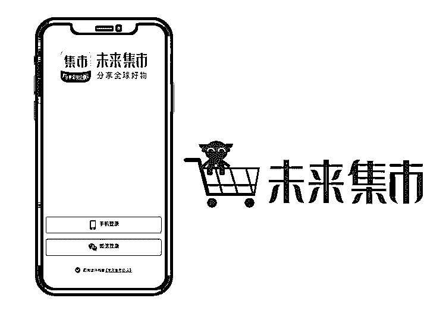
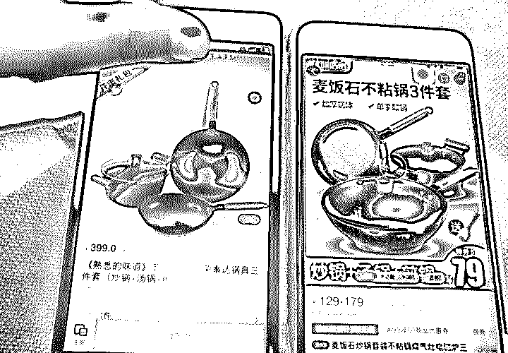
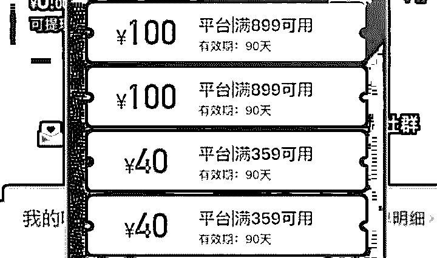
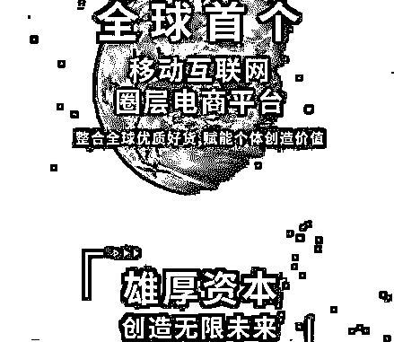
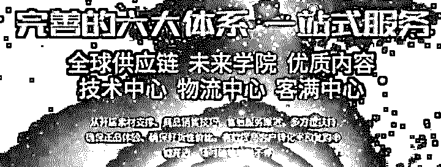
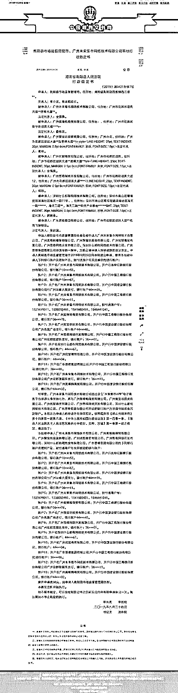
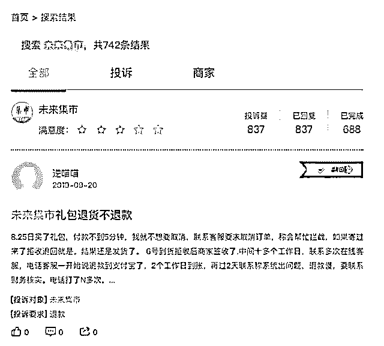
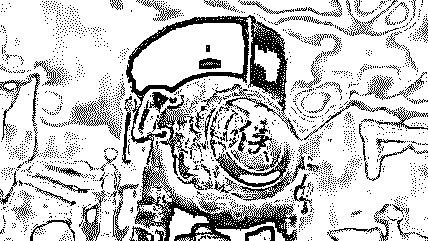

# 未来集市，没有未来？

> 原文：[`mp.weixin.qq.com/s?__biz=MzIyMDYwMTk0Mw==&mid=2247496319&idx=1&sn=17a58566aa395f66a430ee8db2a44ff3&chksm=97cb3947a0bcb05177bd4595d1a5ce32e4b71b1ed87424cd172c1a050521b0abb29e44cf6eeb&scene=27#wechat_redirect`](http://mp.weixin.qq.com/s?__biz=MzIyMDYwMTk0Mw==&mid=2247496319&idx=1&sn=17a58566aa395f66a430ee8db2a44ff3&chksm=97cb3947a0bcb05177bd4595d1a5ce32e4b71b1ed87424cd172c1a050521b0abb29e44cf6eeb&scene=27#wechat_redirect)

**点击上方蓝色字体免费订阅“灰产圈”**

导语

最近在全网有个很火的未来集市，号称是全新的社交电商购物 app，没有中间商，没有差价，而且你被邀请后并缴纳 399 元就可以成为店长，店长每拉过来一个人注册就可以获得 100 元提成，同时自己分享的购物链接，有人买了还能有提成，这里我给它起了个外号叫背锅集市。

我相信这个背锅集市目前有 70%的人目前都是奔着拉人头去的，因为只要拉 4 个人，你就能回本了，剩下那 30%的人都是微商圈的，你要知道，这个平台的大佬，可是微商界数一数二的人物，他有着一张招牌照片，马化腾和马云，同时与他合影，而他这个电商平台也得到了很多大佬们的融资，连知名品牌 360 也投资了，真可谓气势十足。

说到这里，我相信你已经对这个平台充满了信任度，老大这么牛，同时拉一个人还能赚 100 元，这么充满诱惑力的低成本创业项目，真是天上掉馅饼了

行业内幕，不是三言两语就能说得清的，下面是我花了数周时间，通过线下与线上的考察，整理出来的情报，如果你正在接触背锅集市，或是正准备要入坑，并在里面大展身手，交更多的学费创业，那么相信你看完我这条长视频，能够更客观地区看待背锅集市。

一背锅集市 399 优惠卷的真相

这个背锅集市，号称 399 当店长，再送你一张 399 优惠卷，有谁要是黑它不好的，这些店长们分分钟拿 399 优惠卷怼你，这里我说一句客观的话，根据的调查，绝大多数新入坑的店长，都拿这个 399 的优惠卷买了一口锅，为什么呢，因为这个集市能值得用优惠卷买的产品，也只有这口锅了，同时，眼尖的网友直接晒出拼多多的对比价，只要 79 元买一口一模一样的锅，因此我给他起名叫背锅集市，既形象又好记。

还有一点非常关键，这个优惠卷是有时限的，只有 90 天，如果你观望 3 个月不买，那么它就没了。

二背锅集市购物赚补贴的真相

分享购物赚补贴，这是一个很好的模式，我可以理解为它是分享经济，而且国家也大力推荐，这确实是未来的趋势，但是我还是要客观的说一句，这个背锅集市的产品，真的很少，绝大多数都是你用不到的，要么就是价格很贵的消耗品，同样是分享经济，目前淘宝有每天领红包，拼多多可以拼团减价，同时针对淘宝的红包，拼多多也推出了月卡模式，每天都可以领一个红包促进消费。

因此，要论分享经济，这个背锅集市理念是很好，但真的有待完善，同时分享经济也不是你一个背锅集市独创的，有很多拉人头的店长，经常用偷换概念的形式，把背锅集市怎么怎么好，偷换成了分享经济怎么怎么好，这个模式是当前的创业的风口，因此外行人很容易听着听着就入坑了。

最后，我想问的是，目前全网、全短视频都在封杀这个背锅集市，分享购物赚补贴的这个模式，你来告诉我，怎么分享？

三背锅集市众多大佬投资的真相

这个背锅集市确实是有着众多大佬的投资，而且我们在百科上也都能查得到这些知名人物，这一点没有什么可说的，但对于大部分背锅集市的店长，借着背锅集市的名人帽子拉人头，对于这种狂热的心态，我是要给你们泼冷水的，我上面说了，目前全网的流量平台都在打压，甚至封杀背锅集市的关键词，这让我除了看到你们喊口号，看不到任何希望，再说说背锅集市的老大，马云和马化腾同时与他合影，这一点确实很牛，但就在前几天背锅的集市的公众号因大量投诉等违规行为，导致被封号，公众号是马化腾的，即使你跟他合过影，但你违反了规定被大量投诉，那么该封号就得封号，没有任何辩解。

最后，我想说，众多大佬投资看好是不假，但跟我们没有一毛钱关系，在面对全网打压限制的情况下，不要着急入坑。

四背锅集市拉人头的真相

背锅集市拉一个人头当店长，就能净赚 100 元，这个模式是导致全网自发性地，推荐背锅集市的根本原因，我相信至少有一半的店长，都仅仅是扫了几眼简介，知道它跟分享经济挂钩、同时团队老大也很牛，最重要的是，我花 399 当了店长，只要再拉 4 个人头就回本了，开开心心交了学费入坑，岂不美哉？

其实这个背锅集市，成也成在这个 399，败也败在 399，它是一把双刃剑。

我们都知道，在分享经济和社交电商时代，诚信真的太重要了，试想，当一个店长死皮赖脸地终于把你拉进坑了，你猜发现，原来 399 优惠卷是有期限的，原来这里面的产品没有想象中的多，原来背锅集市全网都在打压封杀，原来你的货根本没有捷径能分享出去，原来，背锅集市提现，只能在每个月 1-5 号才可以提现，如果当初拉你入坑的店长把这些都告诉你，那么我相信你会选择继续观望，而不是脑瓜一热就入坑了。

而拉你入坑的店长们，绝大多数也只想跟你做一锤子买卖，坑一个是一个，这些人通过割韭菜是能赚到钱，但在无形之中也消耗着我们的信任度，让我们看不到长远的希望。

“涉传”实锤

果然，不出所料，未来集市 出事了！

以下是衡阳县市场监督管理局、广州未来集市网络技术有限公司其他行政裁定书

**浏览：****11190 次**

裁定书主要内容是：经审查，**广州未来集市网络技术有限公司通过设立“未来集市 APP”电子商务平台****涉嫌从事传销行为**，其与广州美埠购商贸有限公司、广州聚宝坊投资有限公司、广州优智商贸有限公司、广州思埠网络开发有限公司、深圳什么都有网络技术有限公司、广州思埠集团有限公司开设的银行为**涉嫌传销资金沉淀账户**。本院认为申请人的申请符合法律规定。依照国务院《禁止传销条例》第十四条第一款第八项、《中华人民共和国行政诉讼法》第一百零一条、《最高人民法院关于人民法院民事执行中查封、扣押、冻结》第一条第一款之规定，裁定如下：

**冻结**被申请人广州未来集市网络技术有限公司、广州美埠购商贸有限公司、广州聚宝坊投资有限公司、广州优智商贸有限公司、广州思埠网络开发有限公司、深圳什么都有网络技术有限公司、广州思埠集团有限公司的下列银行账户及理财产品、财付通商务号及所绑定的**银行账****户。**

裁定书相关链接：

http://wenshu.court.gov.cn/website/wenshu/181107ANFZ0BXSK4/index.html?docId=b2ae351f80884b55b305aad60043929c

第三方投诉平台黑猫投诉显示，用户发布了不少关于未来集市服务方面的投诉帖，投诉量达 837 例。

总结

客观来说，背锅集市本身并没有什么可黑的，它是当下分享经济和社交电商的产物，也是微商在经历多重洗礼后的整合体，但毁了他的是过高的价格和狂热般推销模式，以及 399 的集资模式，而集齐的模式也是多种多样的，稍不小心你就会翻船，用白话来说就是，空手套白狼，拆东墙补西墙。

所以，在面对想拉你入伙背锅集市的人时，请客观地去看待它，天上没有掉馅饼的好事，只有不思进取妄图一步登天的懒人。

最后，再说句客观的话：可恨的不是“背锅集市”，也不是网上所戏称的“传销头子无照国”，他们的模式确实玩得很 6，到最后也有可能会是最大的赢家，甚至能稳赚不赔，但这些与你来集市“创业、当店长”，一毛钱关系都没有。

真正可恨的是——那些为了拉人头而对你连哄带骗，不告诉你正确情报的店长们，以及我们自己本身贪小便宜、妄图一步登天的心态。

← 向右滑动与灰产圈互动交流 →

**阅读原文加入灰产圈高端社群**