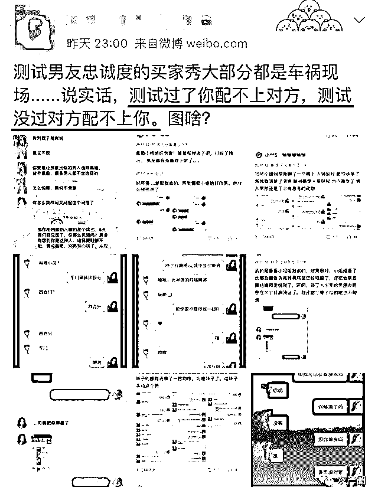
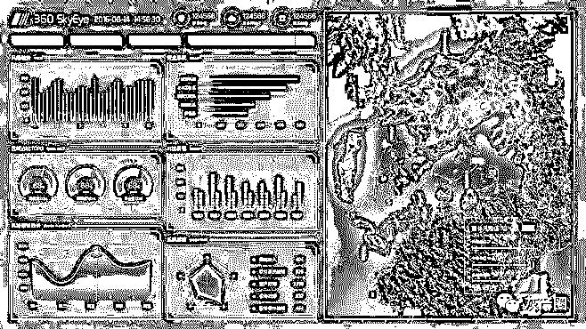
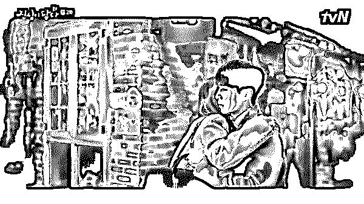

# 在淘宝花 20 块请“美女”陪聊男朋友，我们分手了...

> 原文：[`mp.weixin.qq.com/s?__biz=MzIyMDYwMTk0Mw==&mid=2247496311&idx=1&sn=80353fd54380cd9f8534f82b376d68b4&chksm=97cb394fa0bcb0594a36f00233ecf80956d7e59f8c13b8bb1168be6f4e33df35107b8a155bb9&scene=27#wechat_redirect`](http://mp.weixin.qq.com/s?__biz=MzIyMDYwMTk0Mw==&mid=2247496311&idx=1&sn=80353fd54380cd9f8534f82b376d68b4&chksm=97cb394fa0bcb0594a36f00233ecf80956d7e59f8c13b8bb1168be6f4e33df35107b8a155bb9&scene=27#wechat_redirect)

**点击上方蓝色字体免费订阅“灰产圈”**

导语

在微博看到一篇求助贴，姑娘为了测试男朋友是不是真爱，在淘宝给他买了五天陪聊。 

那几天，男友魂不守舍地盯着手机，她试探问他是不是在等消息，他说谎是工作的事。姑娘生气得不了，在他身边待了两年，居然不如一个客服的五天。

她庆幸当时在淘宝找的是个男人，告诉他真相后，男友非常生气，嚷着分手，姑娘求助该怎么办？

**我还是第一次听说有人花钱来挖自己的墙角！**

下边评论清一水的“不作不死”，还有男同胞为自己伸张正义。虽说男生没禁住诱惑是错，但姑娘这出发点就是错的啊。

总有人说，感情经不住测，测完一拍两散。想想也不是全无道理。

01

在淘宝上搜索“男友 忠诚度”的关键词组合，会出现三百多条商品结果，价格从 28 元的试探服务到 1314 元的“分手大师”或“7 天情感挽回”套餐不等。

虽说 28 元的“普通试探”服务已经足够普惠，但 100 元的“金牌试探”才是更多人的心选，毕竟每个人都觉得自己的对手应该是那些生活中无迹可寻的白富美。

“自己用小号去测试很容易穿帮，说话习惯和固定思维也很难改变，要是另外一个人效果就不一样了。”某卖家透露。

只有输给了 28 块钱的服务，她们才会真正地警觉起来。

客服人员介绍，他们关于男女友忠诚度测试的基础价位是一天 28 元，两天 52，三天 76 元，另外还有一些让人疑惑的定制测试。

“如果用聊天软件没有加上男友，也算测试失败，卖家将会退还一半的价钱，但测试失败也说明了对方忠诚度高，这是千金散尽都买不回的美妙，那些有远见客人，一般就不会要求退款。”  

假如坐实对方坚贞不渝，有些卖家会退还一半的费用作为祝福，皆大欢喜。这也应验了一句真理：真的渣男，才会让你人财两空。

一旦付款，卖家就要开始推进测试流程，你需要将男友的名字、工作、联系方式、社交账号，兴趣爱好（包括他喜欢冲着你的脸放屁）等信息提供给卖家。

他们将根据他的年龄、经历、爱好来设置话题，并精心酝酿一场网络上的偶遇，随后他们要做的只剩将对话框里的秘密变成一张大字报，你男友的不忠很有可能变成店铺的宣传页，供其他举棋不定的客户参考。

尽管一些店家在开始前就会做出承诺：不泄露信息，不见面。但他们还是会声明：如因测试造成不良后果，店家不会承担任何责任。

当然，点到为止，不产生色情部分，更以不上床的引导为主，即便是测试的女孩也不想和别人产生尬聊。

02

根据大数据分析，**在淘宝上购买“查男朋友忠诚度”业务的姑娘，和淘宝上购买“回心转意符”的姑娘往往是同一群人。**

而这些测试男朋友的女孩，她们不是生活里普通漂亮女孩，不是你男朋友身边可疑的女同事，甚至不是一个女孩。

换句话说你制造了一个假想敌，这个假想敌一开始就比你更懂他，恰好头像身材又美得跟林志玲一样，你还期待你的男人能忠贞不渝。

**“人性不能放在极端条件下考验，而有个妹子送上门不叫极端条件。”**

没有什么比看搬起石头砸自己脚的人更过瘾了。

换位思考，假如身边突然出现一个长得好懂你对你又是关心又是体贴的男生出现，还一直和你聊天，撩你，试想一下，作为女生的你，真的一点都不会心动吗？

而对于一部分男人来说，即使侥幸通过了测试，也并不意味着相安无事。

本应该跟你最亲近的人，需要求助于陌生人来对付你，说明你们的关系已经完了。

**用谎言验证谎言，得到的只会是谎言。你既不信我，我也没必要让你提心吊胆。**

****

03

感情之所以伟大，很多时候正是因为坚韧，不轻易随外力而变化，但你首先需要明白的是人是一个生物，最初的时候跟其他生物没什么区别。

一个人如果被你发现了阴暗的一面，那他很难不用阴暗的一面来对待你，比如蝙蝠侠里面的小丑最擅长的就是把人放在黑暗门前再给他开门的钥匙。

**真正的测试，应该是男朋友看到你购买记录的那一刻。**

****

两性交往的相处模式，本来就是相互磨合，慢慢升温的。

与其说不要考验人性，倒不如说要审视自己内心的恐惧与不安感。

一次考验通过后，就会有第二次第三次，你得到了心灵慰藉，对方得到的是压抑，久而久之，对双方关系又有什么好处呢。

**真正懂得经营爱情的女生会不断升华自己，吸引住自己爱的人。**

**用“测试”来考验人性，嚎啕大哭后，相信你依然不会幸福。**

← 向右滑动与灰产圈互动交流 →

**阅读原文加入灰产圈高端社群**