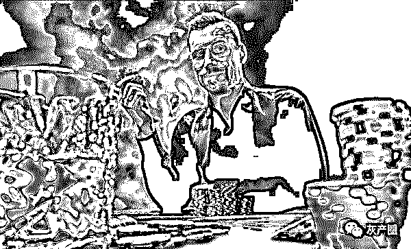
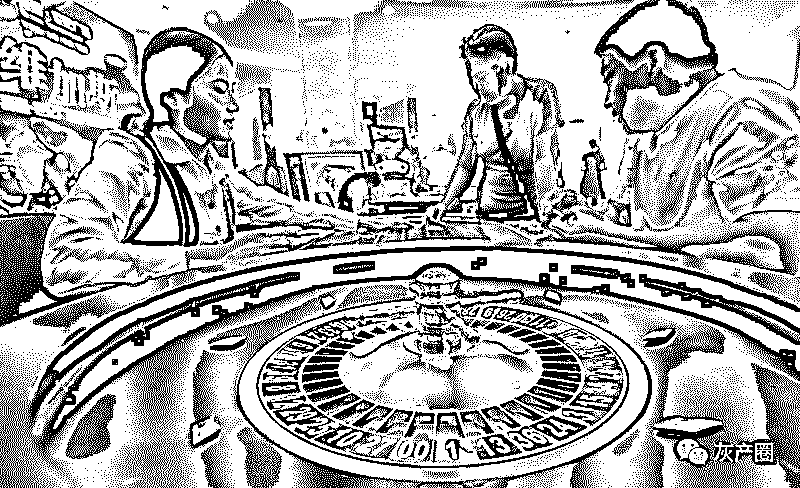
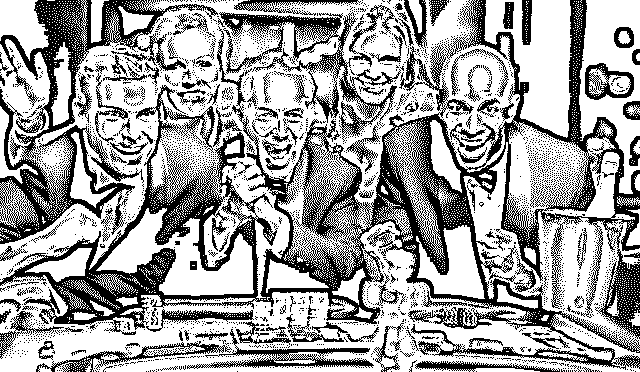
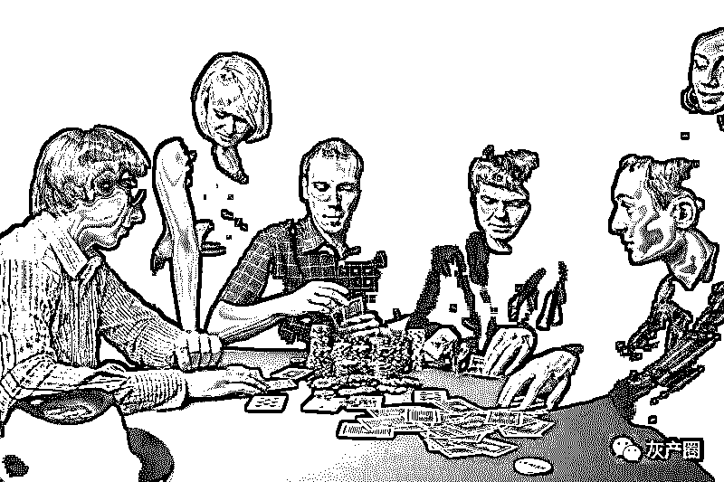
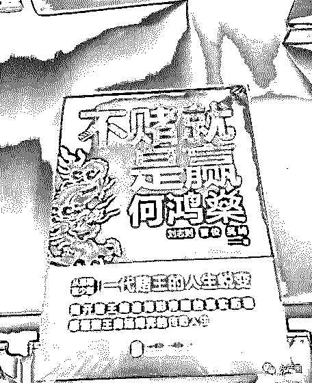

# 赌徒：曾经梦想做赌神 , 如今却成人下人

> 原文：[`mp.weixin.qq.com/s?__biz=MzIyMDYwMTk0Mw==&mid=2247496303&idx=1&sn=cebef18a7c873452ae34a0c64dfb8f8d&chksm=97cb3957a0bcb041688d8bfd1a7fecd0ea24a491884e56e93f01cc898b3c0dcf108664cf1fa9&scene=27#wechat_redirect`](http://mp.weixin.qq.com/s?__biz=MzIyMDYwMTk0Mw==&mid=2247496303&idx=1&sn=cebef18a7c873452ae34a0c64dfb8f8d&chksm=97cb3957a0bcb041688d8bfd1a7fecd0ea24a491884e56e93f01cc898b3c0dcf108664cf1fa9&scene=27#wechat_redirect)

**点击上方蓝色字体免费订阅“灰产圈”**

导语

老虎机也好，真人赌博也好，有的人输光了离开的算是定力不错的，输了取钱再来的有，输了借钱来的还有，为什么会这样，如何破解，是神志不清还是被人下了药，还是赌瘾成性？

这是知乎上的一个问题及其回答，我挑选了 4 个回答，前 3 个都面对正规赌场的回答（第一位答主还是匿名），而第 4 个是一个“赌场骗局”的回答，点赞高达 1.8 万。

由这些回答，我想到很多人的投资理财以及集资被骗经历，所以将其整理之后发在这里，权当新一年里劝人不赌的文章——在我眼里，投资也算是另一种形式的赌博，只不过这个赔率和胜率可以通过正确的方法和努力来改善。

壹

一第一位回答者：答主匿名。

可能知乎上没有几个像我这样因为赌而这么惨和灭绝人性的，从来没有想到自己会变成这个样子。

11 年接触赌球外围，第一次下注 4000 元买了个冷门就赢了 26000 元左右，正如前文中所说，赌徒不可救药的是价值观的颠覆和否定劳动的价值。不到三个月就赢了 29 万多元，本金不过 55000 块，而正常工作累死累活，一年下来还了房贷吃喝日用养车存个三五万都很难。

我居然辞掉了当时大型建筑国企编制员工的工作，回家专门赌球，这就是我自我毁灭的开始。

具体过程不说了，天天赌，一到五大联赛都是通宵作战。自己也研究了很多，还装模做样地做了计划。可是依然是赢个几天，一天就洗白，不可避免地开始输钱。

庄家抽水的存在就是赢了抽你百分之三到五，玩下去是无限趋向于负收益。说起来可笑，我还是做预算造价出身的，明明小学生都知道的简单道理。到入魔的时候，我只想不停地弄钱赌。

到了 15 年我山穷水尽了。连父母留给我结婚生小孩的 50 万元也被我以要买房子投资为由给输光了。手里输得只有几千元，房贷都还不起，吃饭都成问题。

其实如果当时能够收手，找一个工作还是能过得很好的。可是对劳动价值的否定已经根深蒂固了，何况有着那种 7000 块一个周末赢到 14 万的经历不停地在大脑回放。

此时我已经是被多巴胺操控的行尸走肉，开始走向毁灭的第二步。

没钱的时候忽然想起我有招商、交通、中信信用卡一直没用过，而这些卡旗下又有各种贷款。然后我又以卡办卡办了七八张卡，开始了我的补天之路，我不能接受失败，计划用半年时间赢回我失去的所有。

赌徒的筹钱能力很可怕，我最后办了 11 张卡，凑了 40 万的赌资。慢慢有耐心的下，甚至几百几百地玩。第一个月下来果然达到了目标，并且可怜的心里暗示自己不能急不能燥。

可是，一切终究是徒劳的，连输的时候什么计划、止损都拋在了脑后，只想买大的来快速回本。违背事物发展规律，逆天而行的就是赌狗可怜的幻想，终于三个月不到从赢 20 多万到清空。

此时已经对任何事物失去兴趣，找工作更是可笑，也曾经接到不少公司人事的邀请。甚至到自己没有钱吃饭交物业费交电费，都不愿意去上班，最可怕的就是否定了劳动的价值，此时我已经输了 110 多万。90 多万来自父母和银行。

巨大的债务危机和想翻本的心理暗示让我走向了疯狂和灭亡，我开始在市面上的高利贷公司诸如平安，宜信等疯狂借钱。我有物业和行驶证，下的额度还比较多，一家六到十万，利息是恐怖的月息百分之三，不到半年我又输光了。

此时信用卡已经填不住了，招商、中行逾期半年以上，都准备起诉我了。小贷更是还不起，我后来算了一下我一个月要还六万多，光是利息一个月就有两万多。

如果此时我能跟家人好好沟通，找亲朋好友借钱补上漏洞彻底戒赌还可以继续做人。但是我没有，我居然瞒着父母卖了一套 130 平的房子。拿到还完按揭后的剩余款项，还清所有欠款后只剩下可怜的 50 多万。

于是我找了个酒店包了一个月，手机关机办了网银盾不停地赌，内心在呐喊，我必须要赢回来，至少得赢个五十万我就不赌了，重新买一套按揭小房子好好过日子。

一个月后我输得只剩三万元了。

此时我已经计划自杀了，实在对不起父母，写好遗书，把三万元支付宝转给了我妈。可是站在酒店的楼上，我的脚不停地抖。我真的害怕。我唾弃我自己，赌的时候什么都不怕，现在倒是怕死了。

在我下定决心买了很多酒壮胆的那个夜晚，我父母通过开房记录找到了我。我当时失联了一个月，我父亲让我回家。回到家我在床上躺了两个月什么都没干，家里人也没有过多责备我。

一切酿成大错。特别是第二年房价涨了 100 多万，父母辛苦开了一辈子饭馆给我在城市买房凑首付，给我凑的结婚钱被我短短两三年内挥霍一空，曾经殷实的家庭因此不堪重负。

过了半年没有自杀的想法了，决心戒赌好好做人。可是多年来扭曲的价值观已经让我无法开始新生活。在老家县城跟父母住了半年。找的同类工作月薪不足 3000 元，巨大的落差和曾经不赌时的经济状况，以及跟以前同事，同学的横向对比让我觉得还是自杀比较好。无非就是勇敢一点，对不起父母。

此时我 30 岁，没房，只有一辆朗行车，身无分文，可以说一无所有。因为赌博 14 年婚也离了。后来也不去上班了，天天在家打多塔 2，想着什么时候上路。

直到有一天我爸来我房间跟我说：“儿子，你去以前的城市，重新开始吧。找个小点的企业一步一步来。我跟你妈会全力支持你，以前的事情不要想了。我跟你妈商量好了，拿养老金加上这几年店面的租金给你重新按揭一套 60 到 70 平的小房子。”

我决定戒赌好好生活。我内心知道我如果还有钱根本控制不住自己还要赌的。于是我每个月发工资就微信转给我妈，让我妈每天转 100 给我吃饭零用。自己去注销了所有信用卡。

目前已经戒赌 14 个月，尽管现在积蓄只够以前玩一场英超只够在这个大城市买个马桶面积，但是我可以安心地跟父母聊天，可以安心地给父母买点小礼物，可以安心地对着镜子中的自己说你还是一个人。希望我在有生之年能够弥补完自己的过错。

贰

二第二位回答者：答主“江流”。

作为一个移民澳门并长期在赌场做事的人，我想我还是应该有资格回答一下。

很多人不解，为什么明知道赌博是有害家庭有害人生的事，还有那么多人义无反顾地沉沦下去？

因为人性啊，人的本欲总是带着贪念的。工作的人会希望自己能赚更多的钱，谈恋爱的会渴望得到对方更多的爱，努力进步的人会寻求更高的自我实现，甘于平凡的人会盼望没有挫折的人生。其实每个人都有贪念，贪就是你的欲望，只是我们每个人寻求的东西都不一样。

曾经接触过许多赌客，他们拥有大多数人望尘莫及的实力，他们很可能一个晚上输的钱，是普通老百姓十年的存款。有些老板甚至宁愿把钱送给赌场也不愿把他欠公司员工几个月的工资付清。赌场真正的客人永远不是那些过把手瘾的赌客，而是这些掌控无数普通人饭碗站在食物链高层的人士。

接下来我会以我的一些客户为例子，让大家更深入了解这些赌客的本性。

一般澳门的长期赌客都分为三大类：

> **1\. 冒险类赌客**

老板 A 是一个年仅三十岁的富二代，每个月都会来一次澳门。他每次都会拿两到三百万的筹码，每次一开头就压四五十万，赢了以这个数字继续压，如果看到好的路子他会一口压八十万。如果输的只剩下几十万，他也毫不犹豫地全压了。他每次从开始到结束不到 20 分钟，要么赢个四五百万，要么全输了。

你们觉得对于他而言，赌博是什么？是刺激啊！他在乎的不是赢多少钱，而是那种心跳加速最后如愿的快感。赢钱的那一刻，仿佛这个世界都站在了他那边，被命运之神所眷顾着。

我们一生中能有多少次体验到这种快感？简单来说，未来的事永远是未知的，但在你赢的那一刻你仿佛掌控到你的未来世界如你所愿，未知变成了预知。但赌场偏偏最不畏惧这类人，你赢一百次，但你可能一次就连本带利输回去了。

因为这类人永远不服输。在商场上这类人其实成功的很多，但在赌场上最终只会成为输家。

> **2\. 依赖类赌客**

老板 B 是某农村的企业家，年龄大概五十来岁。他一般会拿两百万去玩，每次只是几万几万地压，赢了就拿赢的钱去压，他往往赌得很平稳，不急不燥，每次都能赢个 80 到 100 万。

他试过整整赢了一个月，有时赢个几十万，有时赢个一百万，反正就没怎么输过。但一旦他的本金输了 50 万以上，他整个人就会完全不一样了，他会非常急非常冲动地几十万几十万的压，当然一旦本金赢回来了，他又会几万几万地压。直到有一次，他连输了几把后我第一次看到一个人赌博入魔的状态。他连输好几把，然后开始压几十万，输了，再压几十万，再输，就全压了，然后输了，又拿了几百万这样疯狂地压。那一个星期，他输了大概两千万。他曾经说过澳门赌场是可以长期赢钱的，只要你别太贪，最终你才会赢大钱的。

后来我仔细想想，他一年公司的利润大概三四百万，但他在澳门待一个多星期就已经赚了他一年辛苦赚的钱了。不止是他，现实中许多沉迷于赌博的人也是这样。

赌博它可怕在哪？它可怕在于它很容易让你产生“你的努力变廉价了”这样的误区。它使你失去了努力去赚钱的积极性，它也使你拥有了逃避生活的念头。这个世界，哪怕是职业赌徒，也是无法靠赌博来盈利的，只有靠建立博彩公司盈利。

> **3\. 空虚类赌客**

老板 C 和 D 是大客户，他们拥有身价十亿的资产。但你无法想象他们一个月里有二十多天都在澳门，为了能长期待在澳门不惜办了菲律宾护照。老板 C 长期在美高梅的老虎机贵宾厅里，他可以在老虎机上坐整整 12 个小时，连吃饭都没离开过。老板 D 热爱玩百家乐，也是长时间待在赌桌上，赢了钱没见多高兴，输了钱也没多大反应。

有一次老板 C 跟我说，这些老虎机就是无底洞再多的钱也装不满。然后我问他，那你还那么爱玩啊！他说，因为我除了这个我已经没有什么想做的了，我只爱玩这个。

一开始我想不透这是什么想法，有那么多钱，可以做多少事啊，为何非要把钱送给赌场呢？后来我想通了，我们想当然地被电视书本上的“成功人士”迷惑了。我们理所当然地认为他们成功了，应该会像乔布斯一样改变世界，应该会像马云一样不断追求更大的成就，应该会像巴菲特一样致力做慈善，但我没想过有些人，钱多过头他们已经不知道该做什么了。

有这个资产，想要有的都不难有，山珍海味吃过了，电影女明星上过了，再高级的服务和用品都享受过了。你说追求成就，赚那么多钱心满意足了。你说做慈善，钱是我赚的凭什么非要捐出去。接下来还有什么，赌钱啊，反正钱有的是。在金钱游戏的背后只是一颗枯竭的内心。

最后，老板 C 输到负债几千万，老板 D 还在赌桌上沉沦着。

以上说的都是人对赌的本性，接下来再说说外部影响。

去过澳门的朋友应该知道，赌场有着许多优惠的诱惑，让你一来再来。办张会员卡赌钱可以刷积分，积分可以送手机送酒店房间甚至送赌本给你。而贵宾厅一般都是靠洗码仔（赌厅中介）带大客过来，你过来赌钱会帮你订酒店，派专车过来接你，吃饭他们包了，如果你赌的大还会派直升飞机来接你。甚至有时候还会帮你买这买那，比代购还贴心。

许多游客可能不知道，贵宾厅很多都是洗码仔直接签码给你赌，就是一旦认可你的实力，你过来澳门不用带赌博本金，他向赌厅借钱给你赌。赢了可以换现金拿走，输了就给个期限打钱过来。这已经成为非常成熟的商业链了。

如果你嫌赌桌台上限太低，或者想玩刺激点的，可以赌拖底，拖 2 拖 3，甚至有拖 50 赌本上亿的也有。如果你热爱赌博，又嫌老去澳门麻烦，可以啊，这里有电话投注，你安装一个百家乐软件，他每把都会告诉你点数，你说压多少他就给你压多少。

为什么那么多人热爱百家乐，因为它公平吗？错！是因为它有路子！路子是这个世界最伟大的骗局，它让每一个玩百家乐的人都深信它的局势规律。

> **抛开赌场，再说说赌场外的。**

澳门娱乐场除了赌场最多的是什么店？奢侈品店和珠宝店！然后就是夜总会，夜总会的姑娘全是顶级美女，还有世界各国的，俗称“八国联军”。你很容易就被周围这种纸醉金迷的气氛所感染，每家店都在刺激你的钱包。而周围的赌场就像装着定时炸弹的提款机，向你亲切地招手。忘了说，你会惊奇地发现赌场区那一带的餐厅居然没有什么葡国菜或港式菜，绝大多数都是内地各种地域菜。什么东北餐厅，川味餐厅，湖南湘菜，上海菜馆等等，熟悉的菜式照顾了每一个过来的内地旅客。而且澳门跟香港最大的不同是，香港人面对内地客是傲娇的各种嫌弃，而澳门人见到内地旅客是恨不得装成孙子般跪舔，在他们眼中虽然也看不起内地人，但有钱就是爷啊！

最后，作为一个待了 8 年的澳门居民，我想说，其实我一直都不太喜欢澳门，这是一个把金钱至上这四个字展现得如此赤裸裸的城市，哪怕是奢华艳丽的上海也比不过澳门的现实。

即使是做赌场这一行，也衷心希望各位别太接近赌博，它有毒，而且会让你死无葬身之地。

感觉我写着写着越来越偏题了，我要好好回答题主问题：为什么他们非得输光才走，甚至还要借钱？因为一句话，有赌未为输。大多数赌客的内心都不愿意承认自己是输家。

叁

三第三位回答者：答主“Rick 林”。

突然发现大多数人对于充斥在我们身边的魔鬼从来没有过真正的了解，也不曾了解我们身边那么熟悉的亲人和朋友究竟是怎么一步步变成那个贪婪、恐怖、丑陋的赌徒的。

一个真正的赌徒，从来不是天生的，他们曾经也是和大家一样的普通人。只是一个偶然、一丝贪婪，一步一步走向了魔鬼的深渊。

一个答主给我们讲述了某个地方的黑赌场是如何运作、如何赚钱的。说实话，这并不是一个赌场，而是一个打着“赌场”名义的集体骗局，里面的每一个角色都有不同的功能，也就是说，上述人的钱不是赌输了，而是被骗了。

那么，是不是如果我们去到一个合法的赌场、去到澳门，就能摆脱输光了才走、借钱去赌、倾家荡产的惨剧呢？

肯定地告诉大家：不会。赌到最后的结局绝对是家破人亡、输尽最后一分钱。与其说是十赌九输，不如说十赌十输！！！（我先肯定下拉斯维加斯、澳门赌场的运作方式绝对和黑赌场的方式不一样，他们绝对不会为了某一个赌客花这么长时间、精力去布一个千局。赌场是靠大数法则来进行盈利的，后面我会细说。）

这就是我来答题的原因，大家没有真正意义上去了解赌博、了解赌徒的心态，所以很多朋友无法理解和帮助自己身边嗜赌的亲人和朋友。哪怕国内那些所谓的戒赌卫士在各大节目中演示再多次神奇的千术、高超的牌技都没有用，因为赌徒明白这不是赌博、这是骗术。我们只要找到一个公平的、合法的赌场，我们就可以赌博了！

下面，来细细给大家说说，一个正常的人、一个我们那么熟悉的亲人是怎么一步一步变成那个可恶、丑陋、毫无人性的赌徒的。

一个人参与赌博到最后成为一个彻底赌徒，我将整个过程分为以下四个阶段：警惕阶段、沦陷阶段、补天阶段、最后是逢赌必输阶段。

> **1\. 警惕阶段**

初涉赌场的时候，大家心中都是十分警惕的，开始时小心翼翼地下注，以娱乐为主，赢了几千块、输了几千块就会收手，这个时候普遍还是能管得住自己的。

偶然一次赢了 5W 块，就开始幻想每次来赢 5W 块就走，在澳门可以免费吃吃喝喝、除了赌，澳门其他各项活动也是丰富多彩的哈，这是题外话了～～

好，于是你陷入了每次为 5W 块奋斗的过程。过程中，你会经历运气特好，上桌就赢了 5W，转身走了，你轻松做到；上桌赢了两三 W，没到目标继续，然后开始输了，连盈利输了 5W 了，不甘心继续，反正上次赢了。结果你赢回来了。于是你有了很多赌桌经历，输了 10W 又赢回来了，赢了 4W 没走，输了又打回来。

在这个过程中，你发生了两个改变。一、你的注码似乎越来越大了，因为当你输十万想赢回来的时候，你必定会提高投注额；二、你有了很多输 5W、输 10W、输 15W 赢回来的经验，这些经验对你赌博没有什么用，但要记住：这些经验埋伏着、累积着，直到下一次来摧毁你。

可能说到这里大家不太明白这种经验的重要，举个事例。我去澳门最初几次时，有一次筹码输到只剩最后五千，心灰意懒，烦到极点，想着一把押对子好了（百家乐的一种玩法，押庄或者闲的前两张牌是对子，赔率是 11 倍，当然概率会算的都知道大概是 1/13），结果就那么巧刚好开了庄对。

那一把后，运势突然来了，竟然反败为胜！！！

自那之后我每次输得只剩最后一个筹码时，都会押庄对却再没中过。后来我算了下之后，押在这上面的钱绝对已超过当初中的 5W5。我在押庄对这个玩法上，最终还是输的。

如果当初我没中，后面我肯定不会押。这就是所谓“经验”对赌徒的影响。

> **2\. 沦陷阶段**

每个赌徒都必定会某一次、某一天在赌场特别不顺，开始输了 10W，这时以前的经验出来了，上次输 10w 又赢回来过，不急，来条好路（百家乐每一次结果都会被记出来，所谓好路，就是结果很有规律性，长龙、单跳、双跳等）一次就能翻本。

但这一次，似乎怎么玩都赢不了了，越输越多，之前赢的都输了，甚至已经伤到本金了，这一次是你赌博生涯上的第一次滑铁卢！每个赌徒都会记得这次、这次让你彻底沦陷的赌局，它标志着你彻底成为了赌徒！！！

这就是题主的问题，为什么人一定要输完才会离开赌场？人都不服输，相信会赢。这些信念都不足以支撑你继续玩。只要有过相同的经历，最后 10W 赢过 100W，输了 50W 又赢回来了的经历，才促使你继续玩！哪怕最后一个筹码都一定要押上去，因为那是希望，赢回所有的希望。

> **3\. 补天阶段**

什么是补天呢？四极废，九州裂，擎天之柱轰然倒塌，女娲炼五色石而补青天。大败之后，赌徒妄图用这样的方式弥补之前造成的窟窿。

人是一个很贪婪的动物，一旦到了你口袋的钱，再拿出来你心疼得要死。在澳门听过这样一个故事，一个人用 5W 赢了 100W，一天后，继续赌输光了这 105W，结果他跳楼了。因为他觉得自己输了 105W。

明白了吗？经历一次滑铁卢后，赌徒想的是我要翻本！！！等我赢回上次输的钱，绝对不赌了（看吧，赌徒又发誓了，记住这样的誓言赌徒会发很多次）！

因为上一次滑铁卢输的钱比较多，例如一次输了 80W，尚还有理智的赌徒觉得自己肯定一次赢不回来，开始制订补天计划，一次有难度，那就分几次咯，分几次赢回来！80W 分十次，每次赢 8W 行了吧，这样总该简单些了吧！！！

于是开始了周而复始的赌博！

赌博时间越长，对一个人最致命的影响就是价值观的改变。开始挥金如土，看不起各种工作，辛辛苦苦干一个月才几千、万把块钱，还不如我在澳门的一注，对自己喜爱的各项活动都提不起兴趣了，看到想买的东西，就想去澳门一把赢回来。这个阶段的赌徒，会越陷越深，直到输光所有。

> **为什么？**

我之前提到赌场是靠大数法则来赚钱的，赌场的所有游戏几乎庄家和赌客是公平对等的，但是庄家有抽水。百家乐如果开庄会抽百分之五的水钱，也就是说，如果你押 1W 庄赢了，盈利是 9500。那我一直押闲呢？岂不是不用被抽水？因为补牌规则的不同，出庄的概率要比闲大些，大概百分之二左右吧。不要小看这个抽水，如果你押 20 把庄，刚好开了 10 闲 10 庄，不输不赢，因为抽水你是要输 5000 元的。

看到了吧，你在赌场呆得越久，赌的次数越多，你是趋向负收益的，而且赌场资金是无限的，你的资金是有限的，长期的赌博，导致最后输完的必然是你。

> **4\. 逢赌必输阶段**

赌徒到这个时候，几乎输掉了所有财产的三分之二左右，甚至有的进入了负债阶段，这个时候的赌徒，心态已经严重失衡，一次几万块的输赢已经无关痛痒。每次在赌场都是输得一干二净才走，因为赌徒总是幻想遇到一个天局，一次赢回所有，赢回输掉的钱，赢回输掉的生活。

这时候的赌徒有钱就长期在赌场赌，没在赌场的时候，就是在到处筹钱的路上。赌徒不曾明白已经是兵临城下的生死局了，还妄图用游击战的方式消耗自己的实力。

至此赌徒已经是在和魔鬼交易，彻底坠落了。最后奉劝大家，无论你是否在赌博，无论身处什么阶段，远离赌博，赶紧收手。

有一个澳门的赌友曾给我说：如果你恨一个人，请把他带来澳门。初时不解，现在终于明白。还好，一切都不迟。

肆

四第四位回答者：答主“极乐”。

家里开“篷子”的（设在船上面的赌博场所），讲讲人们的赌博心理是怎么被利用的。就不“小赌怡情”了，点根烟，直接讲大的。

赌场三步骤：

> **1\. 养猪**
> 
> **2\. 杀猪**
> 
> **3\. 以猪养猪**

这里的猪我没加引号，因为人那个时候就是猪。（猪说：你侮辱我）

> **1\. 养猪----人心贪婪（正强化法之中看到人内心深处的盲目自恋）**

在赌场中，养着一群人，供他们吃，供他们嫖，供他们赌，方言里面他们叫做”点子“，我称之为”门徒“。他们不是白吃，白喝，白赌的，他们是猎狗，有敏锐的嗅觉，知道哪些人是猪，他们混迹各大娱乐场所，广交朋友。

曾经有个”门徒“想退出，规则是给 5 万封口费，去另一个城市生活。他还年轻，30 出头，做”门徒“是有瘾的，每天白吃白喝，忽悠忽悠，还有提成，谁不愿意？

我就问他，没赚够养老本怎么就退出了？这行的人都知道，这事缺德，自己没好结果，给孩子能留点是点。

他说，太残忍，受不了了。

这事确实残忍，这门徒叫做”黑子“，很有脑子，做过一个很大的单子。

”黑子“喜欢嫖，所以就把他安排在浴城，钓那些”色佬“。

这次”黑子“钓的”色佬“人还不错，和”黑子“真有感情，杀猪的时候还不上钱，又不愿意再去骗自己的朋友，就被剁了只手，抵了 3 万块钱利息。黑子因为这事内疚，不想干了。

干赌场，只要你还有感情，不够狠，就别干，不然迟早栽跟头。黑子走的好，他明白自己，他不自恋，这是人最缺的。

现在我来讲讲，怎么个养猪法。

“门徒”出去找“朋友”，然后偶然一起来赌一下，只要来了，离死就不远了。

先是不输不赢，每天有心跳，不花钱，只要没事做，就想来两手，开始不会让你赢的，人这时候还不是猪，懂得及时收手，赚了就当个游戏，不去了。也不会让你输，输了人就会怕，怕了就不来了。

这时候人是最小心的，小心翼翼，生怕被骗，还有脑子。

来了个两三次，渐渐喜欢上了，也就不如之前小心翼翼了，警戒心就会降低，这时候，你该赢钱了。

别看赌场热闹，我告诉你，里面起码一半是“托儿”。他们就是专门生事的，方言他们叫做“钉子”，我叫他们“粮食”，就是巴普洛夫经典条件反射里面喂狗的“粮食”。

不方便透露太多，就只说一个“扎金花”，一般桌上三个“托儿”一头猪。会让猪赢钱，然后一个托跳出来，说猪出老千，猪不认，然后赌场出来解决纠纷，证明猪是清白的，让托儿道歉，然后被请出去。你以为赌场里面只有钱？人的内心有什么，他都有，诬赖你是老千，让你愤怒，证明你是清白，给你安慰。这时候再来几个一捧，“你真厉害啊，牌运这么旺，今天穿红内裤了？”

人这时候就开始显露劣根了，开始自恋，无理由地相信自己是赌神。自己翻翻口袋，你只赢了几块钱，就当自己无往不利了？当一个人认为自己赌很厉害的时候，他就开始变猪了。盲目地信任自己，这时候，所有的输钱都变成暂时的运气不好了。

随着你越赢越多，你就越赌越大，你就越来越懒得去思考。

然后一不小心，输了一点，再输一点，稍微赢一点，输了一把大的。至此之后，你永远别想回本，你或许会赢一点，但是相比你输的，差得太远。

你会越输越多，但是你想的是我要把输的赢回来就好，再也不赌了。赌过的人一定能感同身受这句话“我要保本”。你以赚钱为动机送钱为行为，互为表里。

没钱了，找朋友借，拿家里钱，如果这时候你能及时收手，你还有救，回去努力个几年，还能补上漏洞，一旦你敢向赌场里面的人借钱，你就万劫不复了。

我家一般放高利贷是 3 个点，也就是利息是 3 成，但是借给赌徒，利息是 7 个点，而且可笑的是，这些猪看到钱，一脸的感激，他们都不会问利息。妈的，真是自恋啊，你以为你是谁？白白借钱给你？

当然，借的钱你肯定输了，猪是没脑子的，有也只是钱堆起来的，不是赚钱，而是送钱。

猪已养肥。

杀猪是个技术活，一般都需要有脑子的人设计方案，外人眼里，我家是四爷（在我们那里，爸爸的弟弟叫“爷”，四爷就是我爸爸的四弟）说了算，他够狠，道上都会敬他一声“王爷”，因为他叫“王叶”，谐音。但家里人都明白，四爷听我爸的。

我爸在我小时候，是镇上的官，因为生了我，在斗争中被抓住了把柄（计划生育）....偏题了，有机会再讲这些，反正就说明一点，我爸是个文化人，杀猪需要文化人来。

不知道大家见没见过农村杀猪，说白了，就只有三点：按住，杀了，放开。

但这六个字里面有大学问，很大很大的学问。按住：让猪蹄悬空，使猪失了根基；

在赌场，一般到了杀猪的时候，会在其他场子里唤回一批人，方言叫做“扎子”，就是打手，而我叫他们“渣子”。他们是最没有人性的一批人，都是老油条，一般技校里面刚出来混的“黄毛”是不适合做这个的，我曾经做课题测过他们的 MMPI（明尼苏达量表），他们都是精神病倾向极高的人群。

当猪开始输的时候，他们需要钱，借了赌场，欠了钱，会由这些人讨债。

怎么讨？

一点点来，不会一棍子把你打死，会恐吓你，夜里抓住了打一顿，但是都不痛不痒，摧残的是人心。

会在你家泼油漆，血淋淋地写上“欠债还钱，杀人偿命”，红色的大字，就写在门上。我妈是个读书人，说我爸没文化，人家只是欠债，要写上杀人偿命做什么？我妈不懂，没有杀人那两个字，气势就弱了一大截，这是恐吓，是催眠，将“杀”字刻入你的脑子，让恐惧侵占你的身体。偿命！

但是，总会放你一条生路，当一个人无路可走失去希望的时候，他就失去了人性，没了人性就恐怖了，他们会玉石俱焚。赌场要做的，只是让他们变成猪脑子，人性还是必须有的。

会给你拖几天，再拖几天，这个“拖”字真的是大智慧。“拖”是给你时间借，你去借钱了，虽然比起欠的差距太远，但是，会让猪众叛亲离。

让猪蹄悬空！

凡是嗜赌之人，必是众叛亲离，很多时候，家里人不理解，为什么输了这么多还去赌，我用精神分析的“客体关系”给你解释解释。

欠钱了，回去借，找朋友，找亲戚，自己是孙子。被老子骂不孝，被妻子骂无能，就是孩子见到自己都要绕路走，这种环境，人会忍多少自己的不堪？

回到赌场，只要是答应了你拖多少天，在这期间，只要你来赌，你还是大爷，只字不提欠钱，把你伺候好。

是个人都知道怎么选，做孙子还是大爷，欠了钱，猪是一步步被推向毁灭的。

众叛亲离，家里人讨厌，猪这下是彻底被按住了。

> **2\. 杀猪：一刀致命**

一夜之间，那些和你称兄道弟的人脸全变了，你完全不知道发生了什么。要钱，不然 3 万买手，5 万买腿，吊起来，悬空（这里省略若干字，为了和谐）。

不会一下子把话说死，会慢慢来，温水煮，一点点地磨你的意志力，关键，还给你时间思考。仗义多是屠狗辈，想的少容易冲动，想的多了，考虑的多了，人就钝了，就会怂，就会惜命。

让你想，让你思考，让你被折磨，这刀就进去了，就服从了（这段比较少了，省了很多，抱歉了各位）。

放猪：不早不迟

放早了，猪会反抗，还有力气的猪是很恐怖的，赌场被烧过，就是来自一头变成人的猪。 放迟了，猪就死透了，没了活力，要杀要剐随便了，钱也没了，剁手是万不得已，黑社会杀人不杀猪。

场子里有个老人，他一眼就能看出是不是时候放了，老人走了，有这实力的也只有我爸，我爸不愿意干这事，就教下面的人一个办法。看猪愿不愿意卖老婆女儿，愿意了，说明时候到了，但是如果连儿子也愿意卖了，那就迟了。

这里面有多少智慧啊！

古时候盗墓，一人进墓，一人在上面接，一般这二人是父子，就为了防止上面接物的人见财起意，埋了墓下的人。但是，一般老子进去，儿子埋了老子的也不少有，后来怎么解决？换过来，儿子进去，老子在外面。把猪放了，才是开始。

> **3\. 以猪养猪**

农村养过鸡的朋友应该都知道，一群鸡最后活着的没几个，过几天就死几个，不是饿死的，而是被咬死了的。

你们猜猜是哪些鸡咬的？肯定是那些比较强壮的鸡？

不，恰恰相反，是那些相对较为弱小的，就只是这一个行为，写着多少法则啊？

末

这里面有同为弱者的发泄，有争夺食物的自私。猪被放出来了，不需要逼，他们会主动害人的，他们需要理解，需要倾诉，什么是最好的理解？什么是最好的倾诉？

让你也感受，你才能理解。他们开始骗朋友来赌，骗亲人来赌，似乎越多的人变猪，他们越不孤独。

投资有风险，入市需谨慎！

← 向右滑动与灰产圈互动交流 →

**阅读原文加入灰产圈高端社群**