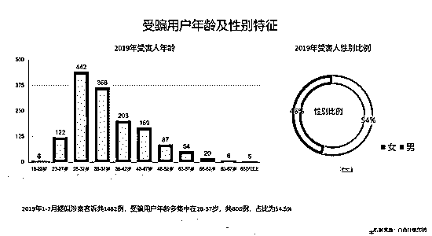
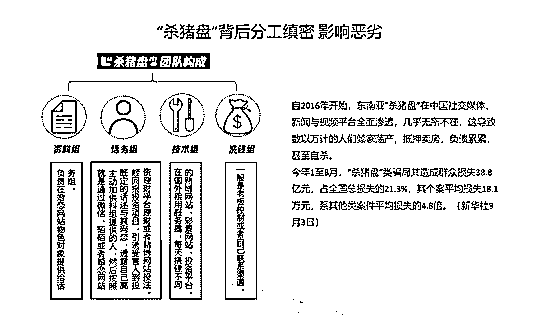
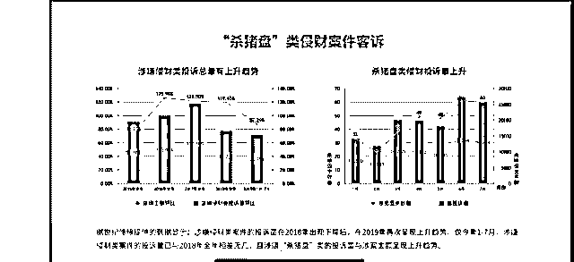

# 恋爱“杀猪盘”套路深，你能“说好不哭”吗？

> 原文：[`mp.weixin.qq.com/s?__biz=MzIyMDYwMTk0Mw==&mid=2247496287&idx=1&sn=742acc952de202901f0258c03a5ca578&chksm=97cb3967a0bcb071443be4c0bd3b23a9db7d950cd80d95f89e754a66dd922ff139d02c870f26&scene=27#wechat_redirect`](http://mp.weixin.qq.com/s?__biz=MzIyMDYwMTk0Mw==&mid=2247496287&idx=1&sn=742acc952de202901f0258c03a5ca578&chksm=97cb3967a0bcb071443be4c0bd3b23a9db7d950cd80d95f89e754a66dd922ff139d02c870f26&scene=27#wechat_redirect)

**点击上方蓝色字体免费订阅“灰产圈”**

导语

周杰伦最近新歌《说好不哭》MV 让“杀猪盘”一词再火了一把。

有人从这首歌的 MV 中看出了女子深情几许，卖奶茶、买哈苏，替小男友在线申请出国去读书。

但也有机智过人的小伙伴，从歌词的字里行间中敏锐地察觉到，这简直是一部制作精良、意味深长的“反诈骗普法宣传片”。

故事围绕一位深陷“杀猪盘”的女受害人展开。

她每天沉浸在和“白马王子”的甜蜜爱情中不能自拔，倾囊所有为对方的梦想埋单。

一旦受害人钱财被骗光，没了利用价值，骗子就会“没有了联络”。

即使意识到可能被骗，受害人仍不愿向公安机关求助，“护着我连抱怨都没有”。

周围的闺蜜家人发现异样，受害人仍然“拼命解释着，不是我的错，是你要走”。

[`v.qq.com/iframe/preview.html?width=500&height=375&auto=0&vid=t0032kwa29w`](https://v.qq.com/iframe/preview.html?width=500&height=375&auto=0&vid=t0032kwa29w)

周杰伦《说好的不哭》

公安部方面称，当前“杀猪盘”诈骗已成为令群众损失最大、危害最突出的案类，案均损失是别类的近 5 倍。

在该类案件中诈骗分子通过婚恋网站、社交 APP，精心选择有经济实力的人，以谈恋爱的手段获取信任进行诈骗，涉案金额从几万元至几百万元，乃至上千万元。

此类案件中的犯罪嫌疑人，多借助境外服务器，**将自己包装为成功人士，引诱受害人“投资”“玩彩票”，并采取“先小恩小惠后钓大鱼”的方式，让受害人越陷越深，陷入绝境，最终完成诈骗。**

在这类诈骗中，受害人自杀的几率非常高。

最真实的“杀猪盘”

9 月 19 日下午，“网络婚恋平台诈骗防范治理研讨会”上，婚恋社交平台企业与公安、法学界专家围绕如何有效防范网络婚恋诈骗进行了研讨。

一**超乎想象**

******个案：****上海一女士 6 天被骗 1660 万******

******数据：****男性受害者占比也达 46%******

****北京市公安局刑侦总队十支队政委王琪介绍，2019 年 1 月至 9 月，北京市网络交友诱导赌博投资诈骗共立案 400 多件，立案数量呈逐步上升的趋势，由一季度占全市整体立案数额 0.58%，上升到目前的 2.3%左右，损失金额近亿元。****

****据百合佳缘集团此次发布的数据显示：今年 1 月到 7 月，世纪佳缘 APP 收到的 1482 例举报中，其中受害用户年龄在 28-37 岁的共 808 例，占比为 54.5%。与公众印象不同的是，男性受害者也达 46%。一改过往诈骗案中受害者以中老年、女性化为主的局面。****

****数据还显示，涉嫌侵财类案件的投诉量，2019 年呈现上升趋势：仅今年 1-7 月，涉嫌侵财类案件的投诉量已与 2018 年全年相差无几。****

********

****“杀猪盘”受害用户年龄在 28-37 岁****

****“曾有上海一位女士，6 天被骗 1660 万”，百合佳缘集团公关总监董世彪介绍，这类诈骗往往涉案数额很高。****

****各类犯罪嫌疑人多以借助境外服务器，将自己包装为成功人士，借助婚恋、交友等手段，引诱受害人“投资”“玩彩票”，并采取“先小恩惠后钓大鱼”的方式，**让受害人越陷越深，没有退路。****继而借遍所有网贷平台，直到受害人经济崩盘，陷入绝境，最终完成诈骗**。****

******** 

****某杀猪盘窝点内部实拍（警方抓获时拍摄）****

****二**********趋势扩大******

******特征：****犯罪窝点向东南亚迁移******

******现象：****“杀猪盘”维权微信群大量出现******

****“杀猪盘”诈骗类案件源于台湾，2017 年左右进入大陆，之后犯罪团伙借助移动互联网、三方支付等新型科技手段不断升级诈骗手段，**诈骗主体由个人诈骗向公司诈骗转变，作案手法由粗狂式向专业智能化转变。******

****主要特征包括：涉案金额巨大；作案群体目前有不断扩大的态势；犯罪的窝点不断向中缅边境地区和东南亚国家迁移；打击难度大，易引发社会不稳定。****

********

****“杀猪盘”骗局团队分工****

****公安部刑侦局电信网络犯罪侦查处相关负责人表示，据监测数据，**今年 1 月至 8 月，网络交友诱导赌博投资诈骗共造成群众财产损失 38.8 亿元，占全部电信网络诈骗总损失的 21.3%，在所有诈骗类型当中造成损失数最大**。****

****最早，这类案件的作案群体**主要是福建安溪、龙岩一带**，但是今年几乎全国每个地区都有，而且呈扩大趋势。****

****同时，这类犯罪的窝点不断向中缅边境地区和东南亚国家迁移。****

****这类案件最初发现的时候是在境内，2018 年下半年随着境内的打击力度扩大，出现了向东南亚国家快速转移的趋势，目前中缅边境和东南亚国家是“杀猪盘”诈骗的主要集聚地。****

****该负责人还表示，“杀猪盘”类诈骗容易引发社会不稳定，受害人受骗以后，爱情、金钱全部破灭，由此很容易造成社会不满情绪。****

****公安部门已经发现有大量“杀猪盘”维权的微信群，**甚至在案件中发现了不少由于“杀猪盘”引发受害人自杀的案件**。****

********

****三**********平台制约******

****婚恋平台上找好目标****

****交易转至第三方****

****对此，婚恋网站目前采取了一系列措施。****

****比如，新用户登录时，如果出现有投诉记录的、IP 地址不一致、易受骗人群的情形，用户会先收到“首都网警”发送的提醒信息。****

****在进一步交往前可以开启“视频相亲”，在会员的视频聊天中，也会进一步出现防诈骗的警示提醒。****

****此外，网站还可以通过大数据技术，多维度评估高危会员，比如对多个用户发送同一生活照、使用同一头像、同一手机号，同一设备登陆多账号，以及多用户上传同一照片，都会被后台系统自动捕捉和监控。****

****以世纪佳缘为例，针对海外用户，还会由专门团队利用智能系统，综合用户注册特征进行二次检测，标记后再次人工复查。****

****两个月前，世纪佳缘与深圳市公安局龙岗分局达成战略合作，推出栏目宣讲防范网络诈骗的相关知识。****

****但目前平台还存在很多困惑，比如婚恋平台仅作为搜索目标而用，双方发生交易均转至微信、支付宝等第三方平台，“仅靠婚恋平台一己之力很难采取反制措施”，造成监管与取证困难。****

********

****网络婚恋平台诈骗防范治理研讨会上发布的数据图****

****四**********惯用手法******

******其一：****谎称发现赌博网站漏洞******

******其二：****扮演在某投资平台赚了大钱******

****研讨会上，北京市公安局刑侦总队十支队政委王琪介绍，“杀猪盘”诈骗中，诱骗赌博和投资成为常用手段。****

****诱骗赌博时，犯罪嫌疑人通常虚构自己为某赌博网站的技术人员，发现了网站存在的漏洞，利用这个漏洞进行赚钱，而自己又不方便操作，于是请受害人帮助操作，并告知受害人网站地址、登录账户名、密码等信息，要求受害人将资金投入。****

****与此同时，犯罪嫌疑人会在后台修改中奖费，让受害人从表面上感觉到确实是赚到了钱，从而骗取受害人对网站存在漏洞的信任。****

****取得信任以后，犯罪嫌疑人谎称这个漏洞被发现，让受害人拿出全部资金来进行最后几期的投入，从而实施诈骗。****

****第二类是“诱骗投资类”的“杀猪盘”。****

****犯罪嫌疑人自称是某投资平台的，就是本人的巨额财产是从某投资平台赚的，将受害人拉入微信、QQ 群。****

****在群内，投资人扮演的角色常常称自己也从投资平台赚了大钱，引诱受害人在投资平台赚钱。****

****受骗人在投资平台上能看到自己的账号金额但无法提取，联系投资平台客服，客服诱导称到一定数额后才能提现，用这种方法循环诈骗。****

****结尾************

********

******警方提醒网络用户不要轻信投资、赌博******

****公安部刑侦局电信网络犯罪侦查处相关负责人介绍，由于犯罪成本低，犯罪分子手段专业，多藏于中缅边境地区和东南亚国家，导致这类案件打击难度非常大。****

****今年以来，公安部相继组织了打击中缅电信网络诈骗专案，并多次派出工作组赴东南亚等国家开展打击电信网络诈骗执法合作，都将“杀猪盘”当作打击重点，也取得了明显成效。****

****公安部在加强打击力度的同时，也不断提醒婚恋网站、婚恋平台企业提高防控能力。****

******文章整理自  红星新闻  新京报  荔枝新闻 我在柬埔寨******

********

********

********

****************

****← 向右滑动与灰产圈互动交流 →****

********

**************阅读原文加入灰产圈高端社群******