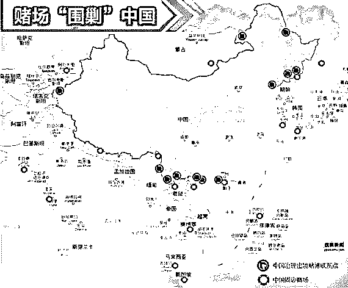

# “围剿”中国“赌徒”的亚洲赌城！

> 原文：[`mp.weixin.qq.com/s?__biz=MzIyMDYwMTk0Mw==&mid=2247496247&idx=1&sn=f43fb172d46d7742d4b9f656cb6faa60&chksm=97cb390fa0bcb01956dfc165ce6bc7d5332e6808219674dc831a5fc521e0ee99b23774bda61f&scene=27#wechat_redirect`](http://mp.weixin.qq.com/s?__biz=MzIyMDYwMTk0Mw==&mid=2247496247&idx=1&sn=f43fb172d46d7742d4b9f656cb6faa60&chksm=97cb390fa0bcb01956dfc165ce6bc7d5332e6808219674dc831a5fc521e0ee99b23774bda61f&scene=27#wechat_redirect)

**点击上方蓝色字体免费订阅“灰产圈”**

导语

赌是刮骨的钢刀，杀人不见血。

5 月 6 日缅甸联邦议会会议上得以通过，允许外国人在缅甸开设赌场的赌博法草案。

该草案对 1986 年缅甸的赌博法几乎全部重新修订的新赌博法中，包含允许外国人在缅甸开设赌场、允许外国人在赌场赌博、禁止缅甸人进入赌场等规定。

法律草案联合委员会委员吴内苗通表示：如果我们缅甸人也可以开赌场，并且也可以进赌场赌博的话，那国家不就乱套了嘛。

赌场客户：中国“赌民”

其实，在这之前缅甸是一个禁赌的国家，但缅甸有许多赌场，在缅甸北部大量的赌场，都是由军阀控制地区所成立的非法赌场、其中不少就是臭名昭著的杀猪场。

据不完全统计，算上合法化的缅甸，在东南亚和东亚共有 13 个国家和地区开设有赌场 300 余个，遍布 120 余个城市，共有赌桌 1.6 万张，老虎机 6 万多台。

目前，周边国家中只有泰国还未将赌场合法化！

而所有这些赌场几乎都指向一个最庞大的顾客群体：中国“赌民”。

亚洲赌城“围剿”中国

  

全世界都知道中国人爱赌，因此他们都把中国人当作目标客户。

中国富豪，也已经成为亚洲等周边国家赌场的经济支柱。

也正因为此，近年来中国知名企业家和商界精英，在周边国家地区的赌场桌上豪赌巨输的新闻也屡见不鲜。

**新加坡**，本地人想进赌场，每天要交 500 人民币左右的“入场费”，外国游客就不用。

**日本**，2018 年将赌场合法化，并且也做了相应的规定：

> 1、在日本全国最多建造 3 处
> 
> 2、赌场占地面积不超过总面积 3%（不包含餐饮区和公共道路）
> 
> 3、将向日本人收取入场费 6000 日元(约合人民币 360 元)
> 
> 4、赌场运营商将被允许从事向客人放贷的业务
> 
> 5、日本人每周仅可入场 3 次，外国人不限次数入场

**韩国**到 2008 年共开设了 16 个针对外国人开放赌场，其中济州岛有 8 个。

济州岛的八家大赌场形成了一个大的磁场漩涡，吸来了全世界各地的赌徒来一试手气，有的倾家荡产，有的却金银满钵。

**济州岛**对中国游客实行免签政策，来自中国的赌客是最多的，济州岛赌场被称为中国人的赌博圣地。

**塞班岛**的赌场也是针对中国人的赌场。有媒体报道，著名手机品牌“金立”，因为老板刘立荣在塞班岛赌博，输掉 100 亿，不得不挪用企业公款 60 多亿，造成金立资金链断裂，被供应商上门追债。后来刘立荣公开表示，输掉的只有十几个亿。

**越南**，政府在今年 1 月把富国岛的赌场对本国人开放，但是想进去的条件很苛刻：

> 1、必须年满 21 岁；必须提供高收入证明（大约每月高于 3000 多人民币）；
> 
> 2、每待 24 小时要交 300 人民币左右的“入场费”。
> 
> 3、同时，中国游客可免签进入富国岛，赌博又是合法的、无限制。

中国赌徒太多了！

  

为什么境外博彩业的规模如此庞大？是谁养活了这群人？

正所谓有需求才会有市场，这个道理在赌博行业同样适用。

中国有十几亿人，人口基数太大了，想赌的人很多，有人表示至少在 4000 万以上。

4000 万什么概念？柬埔寨人口才大概 1600 万，菲律宾人口也就一亿多。相当于三分之一菲律宾整个国家的人，两倍多的柬埔寨国人的人数在赌。

有的人确实戒赌了，但还会有新的人来赌，源源不断。另外，赌是人身上藏着的天性，这个天性是可以诱惑的。

境外博彩给国内赌徒提供了平台，原本没有机会赌的人，如今只需用手机登录赌博网站。

无论是赌博网站还是线下赌场都通过各种诱骗方式，让原本没有赌博习惯的人深陷泥潭。

← 向右滑动与灰产圈互动交流 →

**阅读原文加入灰产圈高端社群**