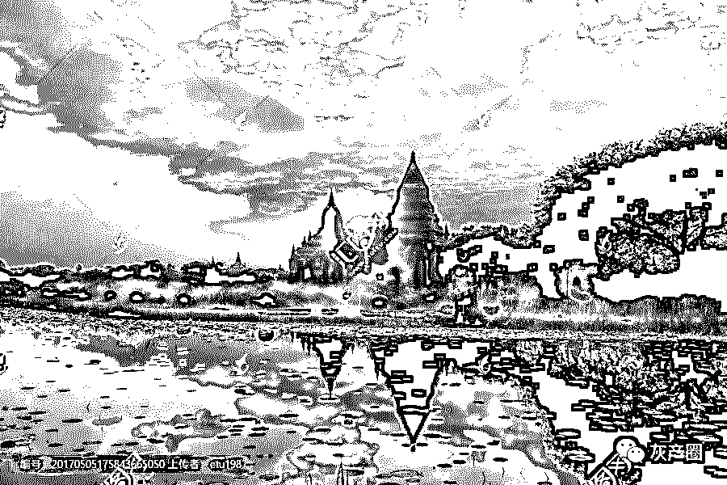

# 故乡安置不了肉身，柬埔寨容纳不下灵魂！

> 原文：[`mp.weixin.qq.com/s?__biz=MzIyMDYwMTk0Mw==&mid=2247496213&idx=1&sn=ec3ebb485502faa585c0fc39a27fac81&chksm=97cb392da0bcb03b2341e46c6cd2003b7014039f3540dc01dc0921dd5a55623e3fcbb97822b4&scene=27#wechat_redirect`](http://mp.weixin.qq.com/s?__biz=MzIyMDYwMTk0Mw==&mid=2247496213&idx=1&sn=ec3ebb485502faa585c0fc39a27fac81&chksm=97cb392da0bcb03b2341e46c6cd2003b7014039f3540dc01dc0921dd5a55623e3fcbb97822b4&scene=27#wechat_redirect)

**点击上方蓝色字体免费订阅“灰产圈”**

又是一年中秋节，对于多数在外打拼的中国人而言，中秋佳节意味着**月已圆，人未聚**。

在国外漂泊，孤身在外，这个与父母孩子共享天伦之乐的日子，似乎从来就不属于这些在外飘荡的游子。

小时候，我总在想，像春节、中秋节、元宵节等这样阖家欢聚的日子里，为什么有的人却选择不回家。 

那个时候，还不知道，人总有一天会离开家，去到另一个地方，遇到另一群人。

“独在异乡为异客，每逢佳节倍思亲。”

每逢节假日回家与不回家，是在柬的同胞们心里永远绕不过去的一个砍。

每逢佳节，很多海外的游子思乡的愁绪无边无际地漫延开来，想回家的念头如施了肥的野草般疯长。 

没有一种感情比亲情更浓烈，没有一种温暖比得上过年回家。

想回家，想看看年迈的父母，想跟老婆孩子亲热下…………

**然而很多人宁愿呆在陌生而孤独的国家，裹在被窝里吃着一碗碗泡面，也许他们有他们的缘由。**

有人没有家可回！

有些人的家不值得回！

有些人太忙了！

有些人为了多赚点钱！

有些人找不到回家的路！

有些人负债累累！

凡有选择，必有代价

大多数人一般本该守着家庭，看着孩子慢慢长大，陪着父母一起变老。

然而有这样一群人，**即便知道国外充满了未知，依旧选择远赴国外打拼。**

你身在国内的朋友不理解你为何这么拼，为何要千里迢迢跑到那么远的地方去工作。

柬埔寨当地人更不理解中国人为何这么爱钱，为了钱宁愿牺牲陪伴家人的时间。

身边中国人圈里能理解自己的人也是少之又少。

最难过的是回国后质疑也从来没有结束过。

**你出国挣到钱了吗？**

**国外的月亮真的比较圆吗？**

有人曾说：**最懂得享受的是美国人，最有信仰的是欧洲人，从出生到死亡都充满竞争和压力的是中国人！**

**有一位外国人曾这样评价中国人：**

无论在国外还是在中国当地，你们中国人的确很勤奋，中国人在海外也能比当地人积蓄更多的钱财。

但我不认为这是你们中国人有经商的天赋，而是你们比我们更节俭，更能省，是通过降低生活标准来完成的金钱积累。

你们很少度假，甚至周末或假期都不休息。

你们会没日没夜的工作，把孩子都交给老人照管，除了关心孩子的学习成绩外，你们忙得很少和孩子一起玩。

和当地人比起来，父母更关心的是家庭的金钱收入、关心的是他们的学习分数，而不是孩子的快乐。

生命是那么短暂，你们借口为了家庭的未来，而在现在就牺牲了家庭，我不知道这个帐是怎么算过来的，怎么还能体现你们自己很自豪的家庭观念。

这个评价是可观的，但也多少让中国人有些难受。

人生经历的苦，只有自己才懂。为了家庭而打拼，再累，也觉得心甘情愿。

外国人永远也不能理解中国人为什么这么拼，对金钱的渴望那么强烈，因为他们不知道，对于中国人来说：**家人的幸福，胜过世间一切的美好。**

我们爱钱，没有钱的苦比没办法陪伴家庭更让人难受。

远离故土对大部分仍有着深厚乡土观念的中国人来说，绝对不是个轻松的选择。

**而凡有选择，必有代价。**

灵魂与肉身

****

**柬埔寨容纳不下灵魂，故乡安置不了肉身，若能一世安稳，谁愿颠沛流离。** 

**故乡找不到养家糊口的路，找到了养家糊口的柬埔寨却安不了家。**

对多数在柬埔寨的游子来说，柬埔寨是一个承载灵魂的地方，这个地方不一定面朝大海，春暖花开，但是它更接近诗和远方。

来到柬埔寨，人生从此便有了漂泊，有了远方，有了乡愁，有了无穷无尽的牵挂，有了肉体和灵魂的互相绞撕。

身在柬埔寨，左边是有钱人的声色犬马，右边是漂泊者的瑟瑟发抖。

在柬埔寨是没有心安的，肩上拖着的是未来，头上压着的是生活，背后跟着的是你永远无法融入的漂泊的灵魂。

离家奋斗的我们，背负了太多的期盼与梦想，承载了太多的爱与责任。

国外生活没有容易二字

****

**这个国家当中的友谊、尔虞我诈 、金钱至上，一夜暴富，亦或是一夜倾家荡产，种种的种种让人以为到了柬埔寨就有了更广阔的闯荡机会，可以破茧重生。**

于是，越来越多的国内打工者、投资者，向往着柬埔寨，涌进柬埔寨这个本与我们没有任何相干的国家。

在柬埔寨机场，总能见到很多熟悉的中国人的面孔，拖着行李，来到柬埔寨。

可是，**柬埔寨不是天堂，这个国家也不相信眼泪。**

大部分的柬埔寨人，总是早早下班与除了生意跟工作上的往来，似乎跟我们是没啥关联的人。

我们也都只是生活在华人的一个小圈子里，日出工作，日落下班，日复一日的重复着。

大部分的柬埔寨时间是无趣的，无趣得有些压抑。

最终，你也会发现大部分的时间，你都是一个人。

你最后也只想着努力的工作，赚更多的钱，才能对得起一直在国内期盼你回去的家人，对的起这么大老远的来到柬埔寨。

生活，在这里，逐渐显出其最真实的状态。

**在这个开放的国家，你虽然不需要考试拿第一名，但是你确需要为着过年多拿点钱回家而坚持着。**

**在柬埔寨  你可以为了一些微不足道的利益和身边的亲人或者朋友反目成仇  可能连你自己也想不到。**

我们真的回不去中国吗？

回不来中国，仅仅是因为不适应国内的人事？国内单位环境？还是雾霾？还是堵车？拜托，别矫情了，你在中国生活了几十年，你在国外才待几年，你回来就不适应了？

大部分人并不是因为以上的原因，**更多的是回到中国害怕找不到自己在国内的位置！**

长期处于一种状态，想要改变很难。更难的是对未来未知以及没办法把握的恐慌。

当初下定决心迈出国外很难，现在一切都稳定了，让你放弃一切回国更难……

如果你不是想在柬埔寨呆一辈子，如果你在柬埔寨的工作经历拿到国内没什么用的话，还是尽早回来吧。

也许，第一年，两年，国内的工作和压力会大些，工资会少一些，但如果你能迅速适应的话，很快可以调整到自己想要的位置和薪水。

**当然，有些人说，我就是不喜欢国内的压力大，柬埔寨虽然乱了点但是生意好做、利润高，打工薪资也高。**

那没问题，你就在国外安安心心好好的待着，好好赚着你的钞票。

当你委屈的时候，你安心的受着；

当你遇到困难的时候，你积极去解决；

当你想哭的时候，自己学会坚强；

别埋怨，国内的朋友离你越来越远；

别埋怨，生病的夜无人陪伴你；

别埋怨，吃不到那口地沟油炸的酥脆油条。

**因为你失去的同时，也在不断的得到着。**

作者：我在柬埔寨

← 向右滑动与灰产圈互动交流 →

**阅读原文加入灰产圈高端社群**