# 柬埔寨：地狱与天堂只有一墙之隔

> 原文：[`mp.weixin.qq.com/s?__biz=MzIyMDYwMTk0Mw==&mid=2247496191&idx=1&sn=a8534503b3806d97a2b5a43957fad00f&chksm=97cb3ac7a0bcb3d1c614046e2bd6c0ac23fae52945c4bbef1a2edcd3228c25c5f6dd814ea3ee&scene=27#wechat_redirect`](http://mp.weixin.qq.com/s?__biz=MzIyMDYwMTk0Mw==&mid=2247496191&idx=1&sn=a8534503b3806d97a2b5a43957fad00f&chksm=97cb3ac7a0bcb3d1c614046e2bd6c0ac23fae52945c4bbef1a2edcd3228c25c5f6dd814ea3ee&scene=27#wechat_redirect)

**点击上方蓝色字体免费订阅“灰产圈”**

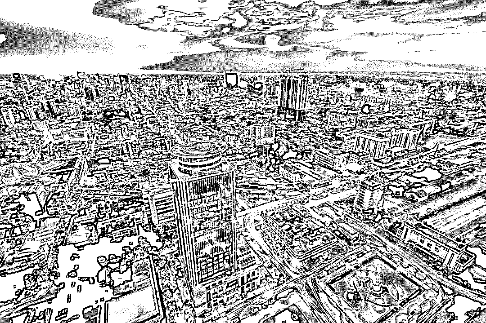

曾经有人说这里是赚钱的天堂，小伙伴招呼国内其他的小伙伴，赶紧来柬埔寨发展，这里处处是商机，只要你肯努力，就能赚到钱。

两口子开个酸菜面摊一年赚 X00 万利润，几个人合伙搞个小菠菜公司一年也赚 X00 万利润，开个超市一年也搞 X00 万，投资 X00 万开餐厅，两三个月回本……

财富的神话貌似不断的被创造着，赚钱就像水龙头流水一样，哗啦啦……

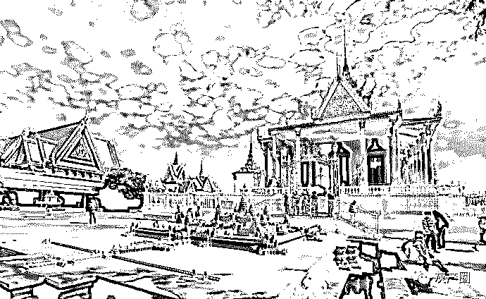

一个离开柬埔寨的朋友说：柬埔寨的生活不是真实的，甚至有人将命都留在这里。 

8 月 27 日下午 3 点左右，一中国男子从金边某工地 12 楼坠亡。

8 月 27 日早晨在西港奥切迭海滩发现一男尸体漂浮在水面上，该男子为中国人。

8 月 26 日下午 5 点多，在西港一酒店，一中国男子自杀身亡，死者为中国籍，今年 47 岁。

有人说这里是天堂，有人说这里是地狱？有人想逃离，有人一直想在这里发财。

柬埔寨生活是天堂还是地狱？只有亲自在这片土地生活过的人才知道。

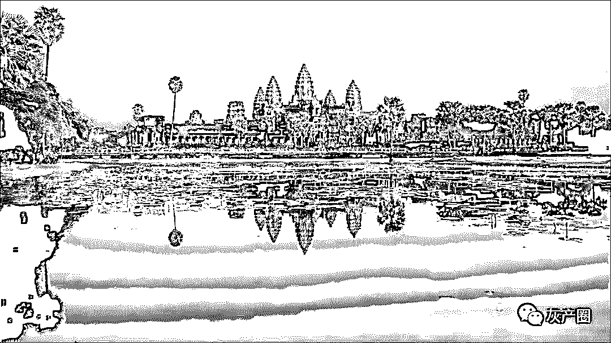

我所知道和不知道的柬埔寨

很多来柬埔寨的人，都是冲着柬埔寨的发展机遇来的，作为“一带一路”的重要节点，柬埔寨的发展潜力不可估量，但每一个来柬埔寨的人，都会吐槽柬埔寨的坑。

柬埔寨会带给你很多以前不知道的世界。

政党斗争也竟可如此霸道、无理，也怪不得从上到下，腐败成性。

这里集齐了白人、黄种人和黑人，也有一些身穿巴宝莉、手提 LV、脚踩普拉达的当地富人。 

俯瞰灯火闪烁的夜景，能让人暂时忘掉金边泛着微臭的街头、拥挤的车流和破旧的排屋。

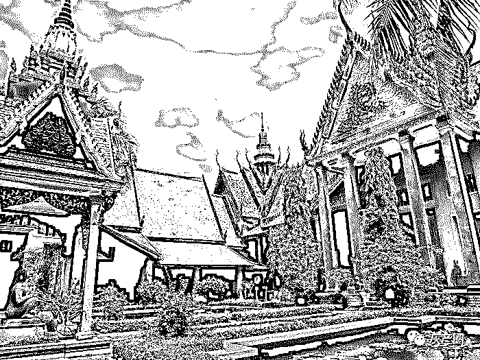

用钱似乎可以解决所有的事情。

酒驾？没事！

嫖娼？没事！

撞车死人？嗯……钱多可能也没事！

但柬埔寨也是糟糕的，因为做什么事情都要钱。

警察说要出警是吧，先给点小费吧！

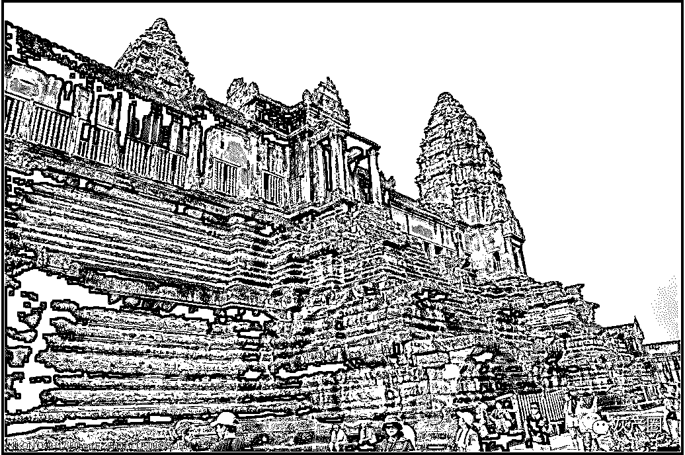

也未曾见过如此矛盾体的国家。

柬埔寨是一个矛盾的地方，一旦你看轻它，就越是看不懂它。

他们生活“穷困拮据”，却有着着“奇高物价”；

他们“待人友善”，却有部分人以“杀伐掠夺”为生；

他们相信来生“知足常乐”，却有部分人“诛求无厌”；

他们信仰“小乘佛教”，但法治却“信仰金钱”

你可能前一分钟被奉为人上人，下一分钟却哭告无门！

作为世界上最不发达的国家之一，贫穷落后是所有人对它的第一印象，但深入了解之后，又会发现，在柬埔寨贫穷常常限制了我们的想象。

金碧辉煌的大厦与贫民窟仅一线之隔，拥挤而狭窄的道路上却常常见到豪车，目前的柬埔寨，正处在矛盾之中。

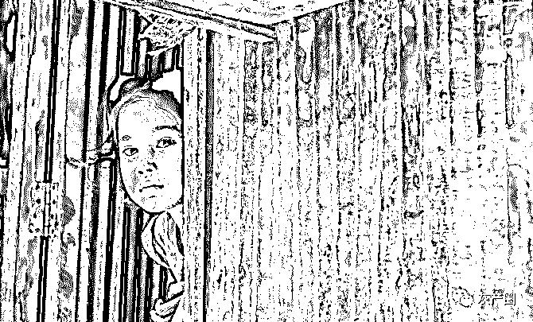

或许高楼大厦的转角处，就是贫民窟，仅仅一墙之隔，但两个地方的人却有着截然不同的命运。 

用“朱门酒肉臭路有冻死骨”形容柬埔寨的贫富差距一点都不为过。

不能想象一个贫穷的国度，消费却可以如此之高。

一个信佛的国度，抢劫、盗窃、强奸、车祸随时随地的发生着。

周围充斥这了对警察、小费的怨念，却很少有人有反抗的念头。

在柬埔寨，寺庙随处可见，但更令人觉得矛盾的是，赌场也随处可见。

赌场催生了经济的发展，但同时也滋生了很多与佛教信仰相违背的东西，比如色情业。

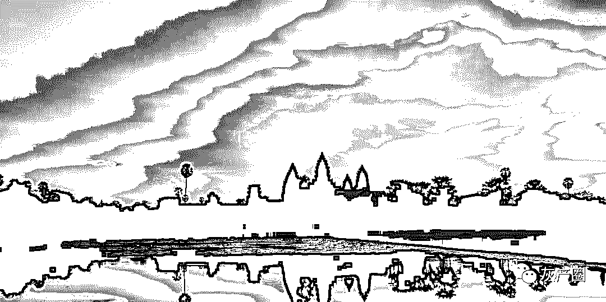

然而，高棉的微笑却又是那么的纯真，让人似乎忘记了这个国家的不好。

这就是不一样的柬埔寨，天堂和地狱并存，不仅有出乎意料的惊喜，同样也有难以言说的悲剧。

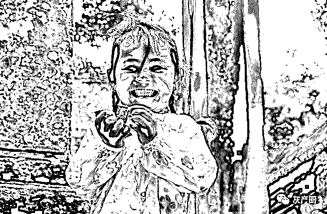

更疯狂的柬埔寨

也正因为落后，才更加充满机会，淘金者们都认为：这是个充满着无限可能的国家，这是个蓬勃发展中的国家，这里满是挑战，这里也满是机会。

于是，一匝又一匝的中国人来到柬埔寨。

于是，金钱、权力、投机、交易、会所、肉体……欲望是这里的主题。

挣钱，挣快钱，不择手段挣钱，突然让人不知所措

有人觉得：“这么疯狂的市场，泡沫马上就要破了”。 

也有人觉得：“越是疯狂，越有发财的机会，泡沫下面是啤酒”。 

特别是柬埔寨房地产的销售们总是不断的告诉你，柬埔寨是个潜力无限的国家。

即使 8 月份洪森菠菜封杀令下达，依然告诉你柬埔寨是一个潜质无限的国家。

通过各种信息旁敲侧击的告诉你：房子赶紧买，价格即将涨，投资后回报巨大。

这就是疯狂的柬埔寨，至于答案，千人千面。

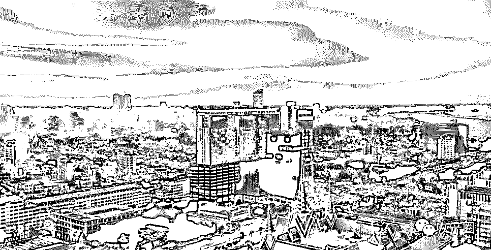

都是为了生活

有人说在柬埔寨做工作很累，生活就像一把无形的枷锁，牢牢的将你套在柬埔寨。

我们脱离国内的压力和竞争，满怀激情的在这里淘金，投入到一个新的战场，人人挥拳霍霍的准备要做下一个王健林和马云，每个人都想着年底能不能实现王健林那一亿的小目标。

投机的商人、热血的创业者、淘金者总能在柬埔寨身上看到商机和潜力。

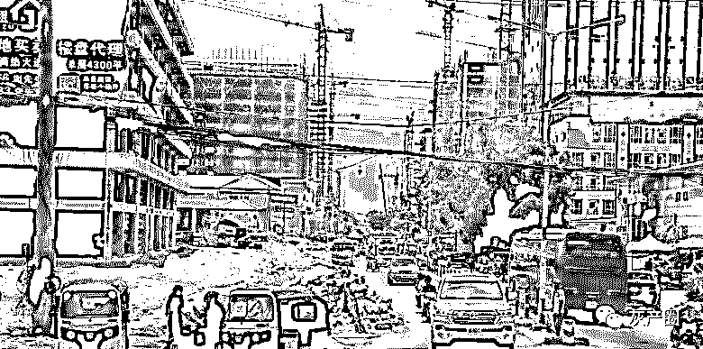

即使做不了下一个王健林和马云，至少也要实现衣锦还乡的小目标。

搞网络赌博和诈骗的人“吃苦”的精神、“敬业”的态度也让人惊叹。

他们总是义正言辞，巴不得挤出眼泪来告诉你“我也是为了生活啊！我们不偷不抢，每天也是累死累活的，也是靠自己的双手跟智慧挣钱的。”

在柬埔寨生活久了，一切都习以为常。

其实，现在的柬埔寨已经是被异化的世外桃源了、在看似漫天飞舞的发财机会下，变成了欺骗与犯罪的温床时。

那些是是非非，见得光、见不得光的，每天都在持续着。

无论你是在柬埔寨做什么，都是为了生活，鞍前马后终日奋斗着。

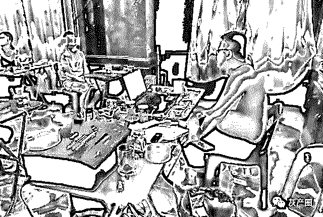

8 月 30 日，柬埔寨首相洪森再次下令，必须在 2019 年内查封所有非法网络赌博业的犯罪活动。

加上中国政府的高压举措让柬埔寨长期以来“疯狂”的菠菜业笼罩在黑暗之中。

此时此刻的菠菜大军、投机商们，更深刻的感受到了天堂与地狱随时在转换。

有人唱衰柬埔寨，有人觉得又一个大机遇即将到来……

一念天堂，一念地狱，地狱与天堂只有一线之隔。

← 向右滑动与灰产圈互动交流 →

**阅读原文加入灰产圈高端社群**