# 拼多多：最怕的是被割韭菜的人，却妄想薅羊毛！

> 原文：[`mp.weixin.qq.com/s?__biz=MzIyMDYwMTk0Mw==&mid=2247496145&idx=1&sn=8c44c416301683c8a6a9e528b5896509&chksm=97cb3ae9a0bcb3ffcb987d7f6dfafde2537dc5697e59e02e62a90789e142fb72e356db782171&scene=27#wechat_redirect`](http://mp.weixin.qq.com/s?__biz=MzIyMDYwMTk0Mw==&mid=2247496145&idx=1&sn=8c44c416301683c8a6a9e528b5896509&chksm=97cb3ae9a0bcb3ffcb987d7f6dfafde2537dc5697e59e02e62a90789e142fb72e356db782171&scene=27#wechat_redirect)

**点击上方蓝色字体免费订阅“灰产圈”**

话不多说，讲个故事

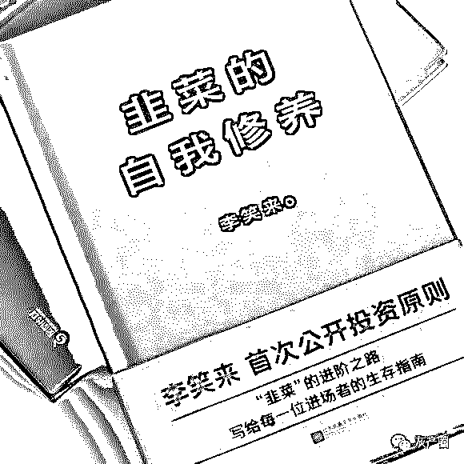

多年没联系的同学

微信中第一句话问你：

## 在不在？

第二句话说：

你帮我点一下这个：拼多多

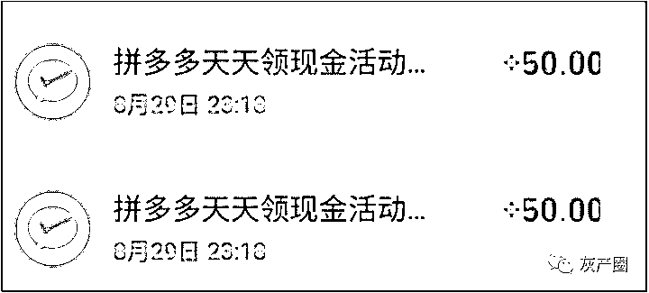

然后 TA 花了一天时间，把通讯录里 200 多个微信好友，全部以相同内容，群发，扰民一圈

嘴皮子磨破了，颜面用光了

终于，到晚上，筹齐人数，拿到 100 元

## 准备提现

## 么想到

## 微信一刹 闪退

## 被封号

## 人、钱，两空！

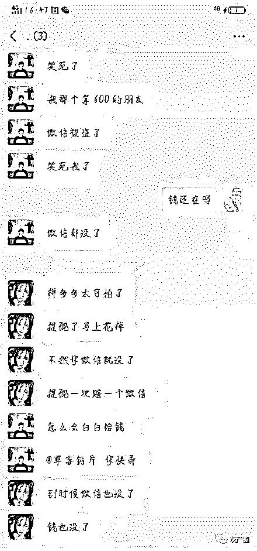

图片来源：微博拼多多超话

图片来源：微博拼多多超话

不管故事是否真实，拼多多抢红包活动是真的火了，相信你也被群发了吧？

先来先割，后来后割

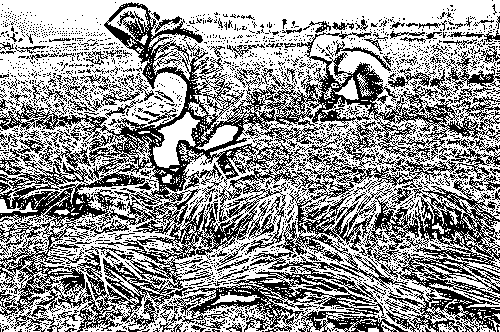

首先来看看拼多多天天领现金活动的入口在哪里?

大家通过拼多多 APP 打开平台，或者是从微信公众号进入平台，在个人的功能界面中就有一个天天领现金的标识，大家点击这个标识就可以进入活动，如下图所示：

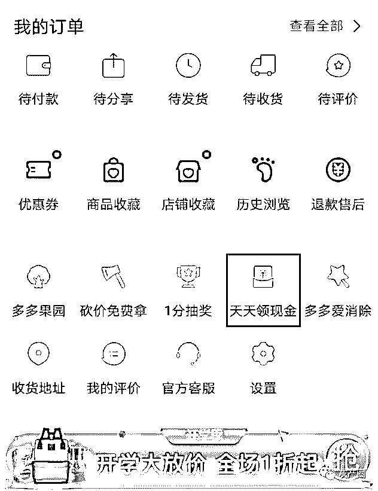

点击这个标识后页面会进行跳转，这时候会提现你签到领现金，签到以后就可以看到有几十块钱的红包，可以看到邀请好友助力的标识，我嘛就点了一次就有 70 多块，如下图所示：

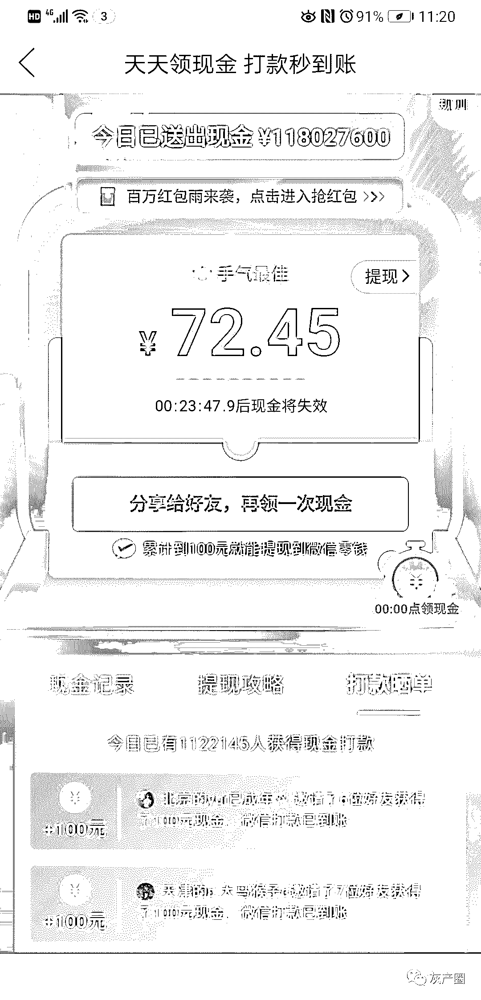

大家点击开之后，就会有累积到一百就可以提现显示，并且要求分享到朋友或群去才能得到金额，如果大家还没有进行拼多多 APP 的下载安装，这时候页面就会再次进行跳转，提示大家进行 APP 的下载使用，才可以参与活动，领取红包，进行相应的红包提现。如下图所示：

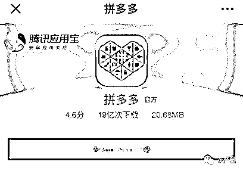

分享到好友以后，就可以看到送你的多少金额了，想要提现，需要你在去继续分享群聊或者邀请好友帮忙开助力，如下图。

亲身体验过之后，反正就是让你分享分享再分享！

简直是神不知鬼不觉的**割韭菜**活动，先来的割后来的韭菜。

凡是参加这个活动并分享的，都是拼多多的线上营销，恭喜拼多多今天收获了数以百万计的员工。

有的员工收到了钱，有的员工收到了优惠券，也还有员工忙活来忙活去半颗都没收到。

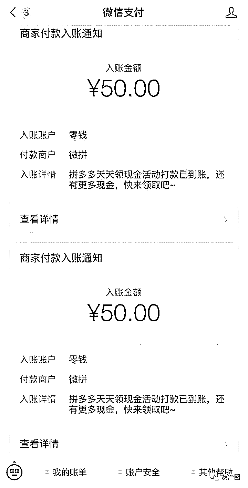

我是那个忙活来忙活去半颗没收到的员工。

拿到钱的员工应该在沉浸在喜悦之中，拿到优惠券的员工应该处于愤怒的状态，而什么也没得到的员工应该思考一下了。

不知道你们的经历有没有和我一样。

我是在朋友那边得到的消息，而且也有身边朋友的成功案例才加入的“点一下大军”。

第一次点进去七八十或者一百多，然后和你说分享到微信群提现，然后你就分享了，反正大家都在分享。

然后和你说，这些钱可以提现，但是要满 100 或者 200 才能提，然后叫你分享助力。

头几回还有 10 多块进账，到后来基本上每个人给你助力或者你领别人的红包，你只能得一分钱了。

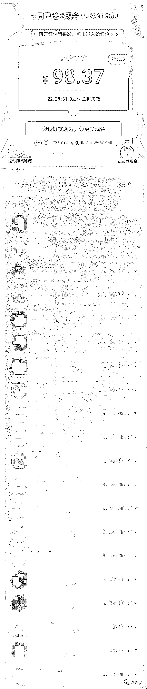

再往后，你发现你领红包也到了上限。能让金额上升的只有别人点你链接了。

但是你不放弃希望，认为奇迹会降临到你头上，你仍然卖力转发，听到有成功经验的朋友说，邀请新人，你就卖力地找新人，可是发现好像并没有什么不一样的。

这时候，你发现还差 1 块多或者更接近目标数字。

这时，韭菜真正变成韭菜。

韭菜们凭借顽强不屈的毅力继续拉着人，还眼红着提现成功的朋友。

但是你想啊，一块多，每人点你链接一次，1 分钱，也就是说要有 100+的人愿意点你链接，你才能得到 100、200 元。

能给你点链接的不是也是玩这个游戏的，那么就是和你关系不错的。

想到这里，不妨审视一下你自己，你是意见领袖吗？你是掌管好几百人的老总吗？你在你人际关系的社交地位能够支持你这么做吗？

如果有个陌生人，而且还是远离我的利益关系的人给我发了这个，点不点可能就得看心情了，而且次数多了，我可能会选择拉黑。

作为一个社畜苗子，我的社交地位显然不能让我达到这个数字，我选择放弃。况且就算我的社交地位达到这个高度，我也不会在乎这一二百块钱。

当我加入这个活动的时候，这个活动就已经进入了爆发阶段（暂且分为活动发展阶段和活动爆发阶段）了，拼多多已经没有必要再把大额红包的概率调得和活动发展阶段那么高了。因为奖金池就这么多。

活动初期加入的人有绝对优势，而且拿到奖金的人晒出的截图有验证活动真实性的作用。吸引后来的韭菜加入。

这和开采比特币非常相似，显卡算力越来越高，开采周期却越来越长，剩的不多了嘛。

这个活动策划应该熟读了**《人性》**这本书，才能在这个活动把人性和群体玩弄得这么自如。

第一视角，窥探内心

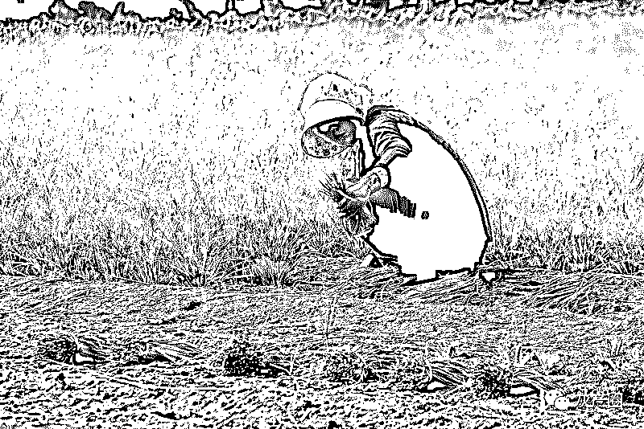

拼多多视角：

什么韭菜不韭菜的？

你们 00 前说这些我听不懂！

作为 10 后，我已经不是三岁小孩了！我已经四岁了！我的想法很简单，我多多从 2015 年出生，发展到今天，用户增长日趋放缓，我总得想点办法。

红包发是肯定是要发的，只有发红包才能维持的了生活这样子！但是呢，又不能血亏，不能让羊毛党给我薅死了，上次苏宁膨胀红包就是一个先例，要不是紧急叫停修改算法，估计就给薅死了。

每每想到这就给老子惊出一身冷汗

卧槽，不对，老子就是薅羊毛出身，还能让他们给我薅死了？！

不过，为了以防万一，特此定了三步走战略。

第一步：财神阶段。打好口碑，老老实实发红包，先发 10 万个面值 100 的红包（可提现），可设置 10 次分享助力拿到。为后面活动大爆发做好充分铺垫。

第二步：裂变阶段。又名万里长征阶段，经过第一阶段，口碑积累传递效应绝对不只 100 万+，准备 100 万个面值 100 元的红包，但是要进行万里长征，越是接近终点 ，越要分秒必争，获客成本就是这个时候降下来的！达到这个阶段，已经达到了这次获客的低成本目标。

相信大家都看的出来，第二步是有瑕疵的，因为只准备了 100 万的红包，万一用完了怎么办？？100 万零 1 个粉丝（羊毛党）就不给人家发钱了么？？不给的话，第二步的裂变效应出不来，给，可能被薅死了。。。

图样图森破啊，忘了老子是羊毛党的扛把子了？？

第三步：不可控阶段，又名保命阶段，又又名反薅阶段。这一阶段，就是所谓的发券阶段，少量无门槛，无限量有门槛。

多多模拟一：

第一阶段过后：嗯，预期不错，韭菜长势喜人。预计丰收年。

第二阶段过后：这，有点猛，大家别太过分了啊，到第二步就够了，老子的目标也达到了，别给老子薅了，悠着点，第三阶段没准备让你们进！

第三阶段过后：一身冷汗！！！卧槽，还好留个后手，在规则不起眼的地方搞了个或者发少量券。骂估计要被骂了，唉，总比被薅死了强。

多多模拟二：

第一阶段过后：长势甚是喜煞寡人啊。

第二阶段过后：卧槽，牛逼，牛逼，老子要发！

第三阶段过后：（翘个二郎腿），这个这个程序员和客服给我重奖！不止发展了用户，达到了目标，抗住了被薅，还反薅了一把（个别气不过花那满减券的，说的就是你），骂那是正常，BAT 哪个发红包有人夸的，还不是一样被骂。

习惯了就好。

在薅与被薅的道路上没有谁对谁错

我多多只不过是一个过客而已。

结尾

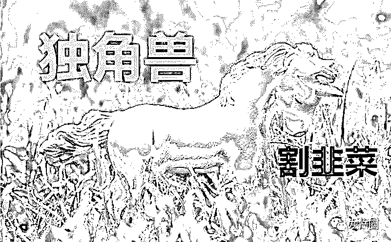

多少韭菜以为自己在薅羊毛。

现金上的九十八块多九十九块多是韭菜们最后的倔强。觉得成功近在咫尺，然后不愿放弃，为了区区一百块钱去寻找上百个亲朋好友，腆着脸去找多年不联系的同学直至出卖灵魂地去为拼多多宣传，是最大的可悲。

拼多多还是拼多多，玩转人性，毫不留情。

← 向右滑动与灰产圈互动交流 →

**阅读原文加入灰产圈高端社群**