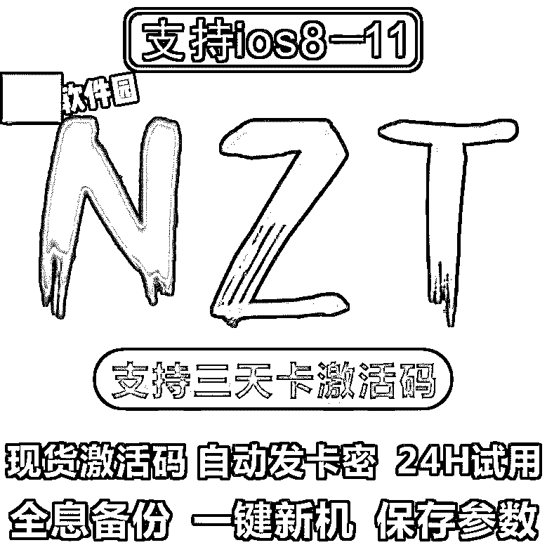
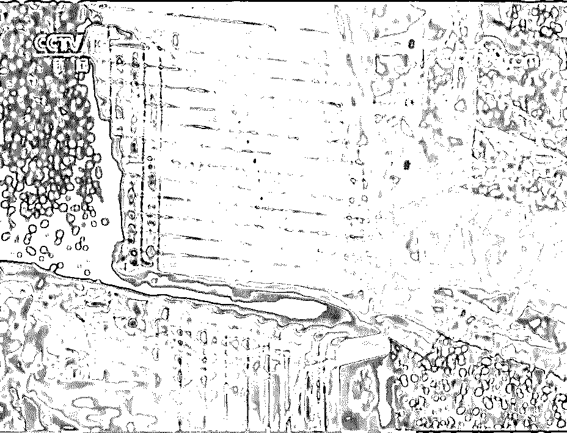
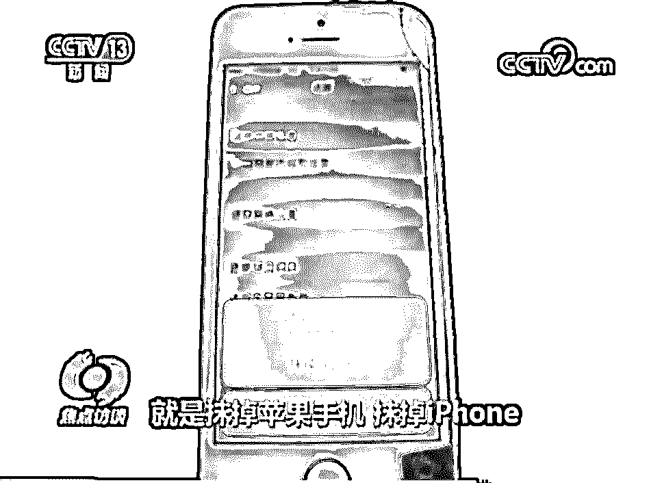
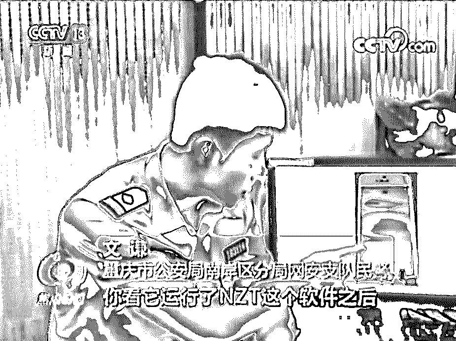
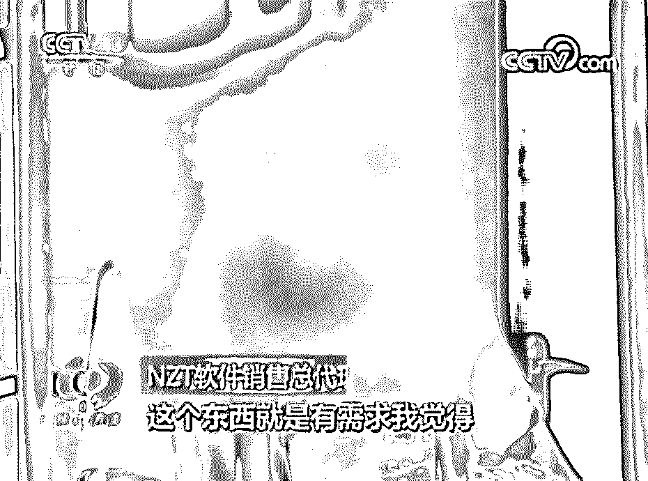
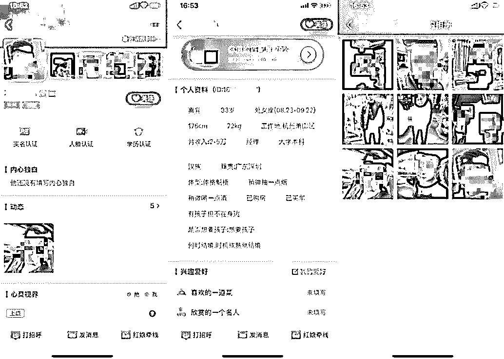
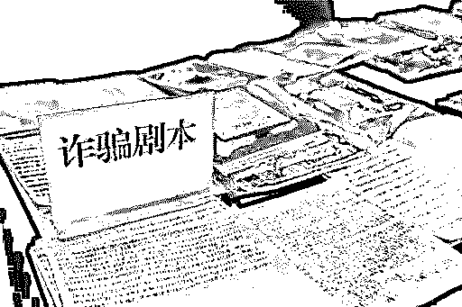
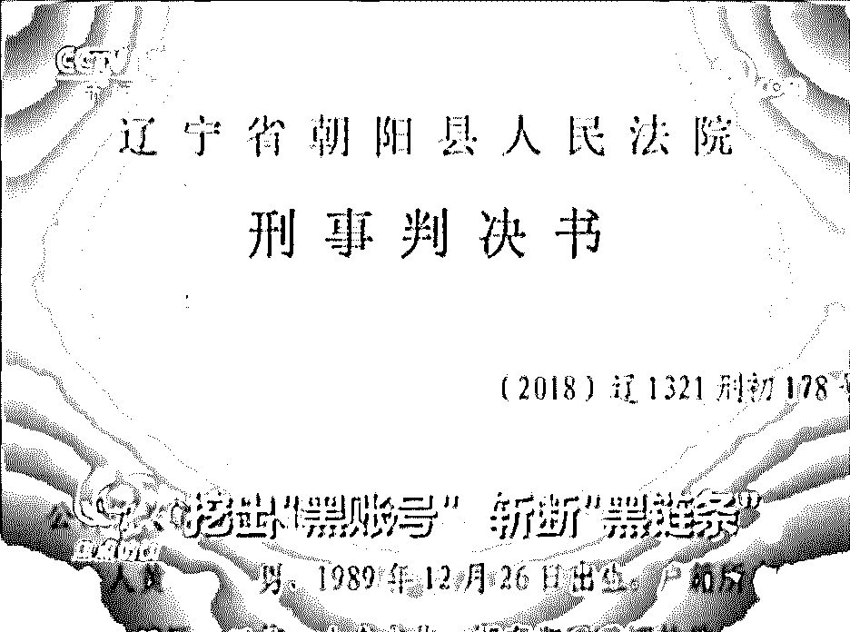

# 黑产神器 NZT 的“地下王国”覆灭记

> 原文：[`mp.weixin.qq.com/s?__biz=MzIyMDYwMTk0Mw==&mid=2247496128&idx=1&sn=157d875caf5295f1b0321e619239a5a7&chksm=97cb3af8a0bcb3ee018cd7efdde929fed7d0fcd5106dea3bba6de348bca6c9efc59e58083905&scene=27#wechat_redirect`](http://mp.weixin.qq.com/s?__biz=MzIyMDYwMTk0Mw==&mid=2247496128&idx=1&sn=157d875caf5295f1b0321e619239a5a7&chksm=97cb3af8a0bcb3ee018cd7efdde929fed7d0fcd5106dea3bba6de348bca6c9efc59e58083905&scene=27#wechat_redirect)

**点击上方蓝色字体免费订阅“灰产圈”**

大家好今天和大家聊聊网络黑产的一个犯罪工具：**一个拥有超强分身能力，能把一部手机能变作成百上千部手机的软件，名为 NZT**。在 NZT 这个手机群控软件背后，有着至少三级代理和几十个资金量较大的代理，堪称隐藏在网络阴暗面里的“**地下王国**”。在这个犯罪团伙被端之前，他们已经让接近 **100 万台手机**使用 NZT。而这些手机也是**黑客攻击、网络黄赌、网络诈骗、网络盗窃等各类违法犯罪活动的作案工具**。NZT 软件名字是“牛轧糖”的缩写。随着 NZT 背后开发、销售的地下王国覆灭，同时也揭开了**全国十几个城市的多起网络犯罪新型案件的工具源头**。NZT 这颗“牛轧糖”，目前已经成为犯罪嫌疑人的“苦果”。

** 1 部 iPhone 变 1000 部 iPhone**这要从一次羊毛党黑产的攻击讲起。我们在文章《[为什么你总是抢不到电商平台的优惠？](http://mp.weixin.qq.com/s?__biz=MjM5MTA0NjU3Ng==&mid=2652704376&idx=1&sn=45460cfe00b72fbf7efda9b0cea4ee13&chksm=bd5220a78a25a9b18e1a58804cf2ce7ddbd586e58efb94e96f150c6e9a83fbcc8038a2a4e5a2&scene=21#wechat_redirect)》中曾讲过，“羊毛党”会使用大量恶意注册的网络账号，以及仿冒真实用户的设备，对各类企业活动进行领优惠券、领红包、刷单、刷榜等。去年 7 月，某电商平台一个指定城市的活动，也惨遭羊毛党搜刮。重庆警方在接到报案、案件侦破后，抓获了犯罪嫌疑人。此案的破获是重庆警方按照公安部“净网 2019 专项行动”整体部署，严厉打击网络违法的重要成果。警察叔叔表示，按照报案所说的损失金额三十多万计算，恶意账号应该有一万个，活动规定每个手机号码只能注册一个账号，按道理嫌疑人手上应该有一万部手机，但是他们现场看到的明显不是这样子。就算嫌疑人用的是苹果旧手机，按照每台 500 元左右的回收价格计算，一万部手机需要 5,000,000 元。狡猾的嫌疑人怎么会做这种“用 100 元制 1 毛钱假币”的亏本生意呢？实际上，警方在现场只是搜获了几十部手机。**这个几十部手机，是怎么修炼出分身术，快速模拟出上万部手机呢？****答案就是一个名为 NZT 的软件。**据鹅师傅了解，这是一个**专门为苹果手机 iOS 系统**开发的多开软件，可以通过修改参数给手机“改头换面”，从而**把一部 iPhone 伪装有成百上千部 iPhon****e**。也就是说，只要装上这个软件，羊毛党黑产只需要几个人员，就能轻松控制上万个账号，薅走了电商平台的优惠券。而那些早早围在路由器旁边，提前准备准点下单的真实用户，只能白费一番功夫，最后得到平台“优惠券已抢光”、“你来晚了，活动已结束”这些忧桑的提示。这个场景，像极了平时总是抢不到电商促销活动的我们。警方通过嫌疑人的手机里的线索进行侦破，很快锁定了 NZT 软件的总代理商：重庆市的于某和郑某，将其抓捕归案。新版《铁窗泪》了解一下 总代理被抓捕的第二天，迫于压力，NZT 软件的制作人沈某从北京赶到重庆自首。NZT 代理网络由于 NZT 的功能强大稳定、更新快，其开发者和总代理在两年多时间里，就非法**获利 7000 多万元**。

**NZT 是网络黑产的工具**对于网络上的犯罪分子而言，NZT 这个软件主要满足了他们的两个需求：其一是隐藏自己的身份，其二是以小博大，降低成本。鹅师傅和小伙伴们曾发现，一些恶意注册、养号的黑产，会配合自动脚本、群控等技术，使用 NZT 软件养号。这些属于网络犯罪上游的团伙。随着互联网平台对恶意账号的防控在加强，黑产在使用 NZT 软件养号的过程中，还会使用非法买卖的公民个人信息进行养号，企图绕过平台的监管。可以说，**NZT 是网络犯罪上游为下游团伙生产提供原材料的工具**。在焦点访谈中，参与案件的警方雷渊认为，类似 NZT 的软件，它主要功能就是隐藏自己的身份。**网络诈骗、网络盗窃、网络赌博等网络常见的犯罪活动，都是需要隐蔽自己身份的活动。因此这些犯罪嫌疑人，都是 NZT 软件的潜在用户。**NZT 这类具备隐藏身份功能的软件，不仅让网上的黑灰产更加猖獗，还让网络诈骗、网上赌博、网络贩毒等犯罪行为升级换代，帮助他们节约犯罪成本，导致犯罪数量爆发式增长。

**当杀猪盘用上 NZT**据鹅师傅了解，NZT 软件不仅被用于持续性地攻击购物支付的平台，在网络社交平台等其它领域，犯罪分子也利用 NZT 等软件恶意注册账号，实施犯罪行为。其中一个例子就是：当杀猪盘用上 NZT 软件，这种本已相当可怕的诈骗，变得更加疯狂。

“杀猪盘”是近两年发案率比较高的一种网络诈骗方式，就是诈骗分子在网络交友、婚恋等平台搜罗受害者，利用网上谈恋爱的套路对受害者骗取钱财。早几年，诈骗分子是广撒网，再逐个给被害人打电话、加好友，从而实施诈骗，人力成本比较高。毕竟人肉聊天，即使是从预设的话术、剧本上复制粘贴，再点击发送，也是需要时间和人力成本的。然而使用了 NZT 等软件后，一部手机就能注册控制几百个账号。**诈骗分子把预设的话术、剧本输进去，机器人就会变成一个温柔体贴、事业有成的理想伴侣。**机器人通过在线群发消息、聊天，一旦把受害人的钱骗到手，就会立即消失。没想到吧，杀猪盘里让受害者放松警惕、沉迷恋情、掏空钱包的情话，居然是机器人发的。

**鹅师傅和小伙伴也参与了打击“黑链条”**鹅师傅想说的是，杀猪盘只是我们今年接触过的大量诈骗案例中的其中一类而已。如果其他诈骗团伙也在使用 NZT 等同类软件，真的是后果不堪设想，鹅师傅想想都觉得脑阔疼。据焦点访谈报道，NZT 软件能够侵入、非法控制计算机信息系统，并且能干扰系统正常获取数据。下游使用它进行的黑产攻击并不是针对某一家公司，而是普遍性地针对于所有的互联网公司。鹅师傅的小伙伴杨建鹅师傅的小伙伴杨建也参与了这次对网络黑产“黑链条”的打击，在接受焦点访谈采访时，他说：**事实上，我们在了解中，NZT 是没有任何合法的应用场景的，在普通用户中也基本上不会有人使用这个东西，而真正使用 NZT 这个软件的，都是一些从事黑灰产业，做违法事情的人才会使用这个工具。**2018 年 7 月，鹅师傅和小伙伴同时向警方举报了 NZT，以及跟它攻击功能相似的另一个软件 XXT。今年 5 月，XXT 软件的制作人和总代理被辽宁省朝阳县法院以**提供侵入、非法控制计算机信息系统程序、工具罪**判决。NZT 这个软件以及背后“地下王国”的覆灭、涉案人员到案，揭开了全国十几个城市的多起网络犯罪新型案件的工具源头。据统计，仅一年多时间，在中国裁判文书网上以 NZT 为关键字搜索，就有广东、吉林、重庆、安徽等省市的多份判决书，涉及到各种类型的网络犯罪。正如鹅师傅的小伙伴杨建说：

**NZT 的存在给了恶意注册一个具体实施的门槛，切实培养了下游犯罪，为下游犯罪提供了账号工具，这些账号工具一方面可能在一些黄、赌、骗的犯罪领域，给普通群众造成了财产的危害。**

**它是这个领域的头部软件，对它的打击，其实是可以震慑到下面的犯罪行为。**对于这类网络犯罪，我国的《刑法》规定了**提供侵入、非法控制计算机信息系统程序、工具罪****，****最高处以三年以上七年以下有期徒刑并处以罚金**。

**打击网络黑产需多方共治**中国政法大学网络法学研究院副院长王立梅，在接受焦点访谈采访时说道：

> **网络犯罪特征是广撒网，哪些人中招了或者说进入到这个网，并没有针对性，并不是针对某一个人，但会针对某一类人，所以它的危害性很大的。**中国大多数网民实际上是不懂技术的，只是使用而已，所以很容易就掉到这里面来。我们现在说网络等级保护是分等级的，有些业务是非常安全，但某些业务可能它的安全等级本来要求就不高，因此肯定就不那么安全，所以要求网民自己要有一个判断能力，不要轻信。

网络犯罪可以打破地域甚至国界的限制，参与人员也常常分布在不同地区，警方办案往往需要跨数省或者跨国，动辄需要联合作战、跨国取证，动用大量社会资源，打击网络犯罪成本很高，因此从源头上打击网络犯罪已成大势所趋。
网络黑产正呈现出**公司化、平台化和跨国化**的特征，以及新技术的应用让黑产活动出现“**智能化**”的趋势。网络黑产并非发生于个别互联网企业，而是广泛地滋生于整个互联网行业，不仅威胁着网络空间的安全，更与下游多种违法犯罪、侵犯法益的行为密切相关，对现实社会的安全与秩序也产生巨大危害。因此，打击治理网络黑产，必须依靠多方联动机制，如公安司法机关、工商管理部门、银行、通信运营商、互联网企业和学界，推动共同建立预警机制、信息共享机制、反馈机制等，形成合力。面对网络犯罪，个人更需要有网络安全方面的意识和知识，比如不随意泄露个人信息；不点击来历不明的链接；不要轻易相信网络陌生人的套路话术等等。

参考资料：

1\. 央视《焦点访谈》， 20190827 期《挖出“黑账号” 斩断“黑链条”》

2\. 重庆网警微信公众号，《央视焦点访谈：重庆网警挖出“黑账号”，斩断“黑链条”！| 净网 2019》，2018-08-28

3.作者：腾讯网络安全与犯罪研究基地

← 向右滑动与灰产圈互动交流 →

**阅读原文加入灰产圈高端社群**